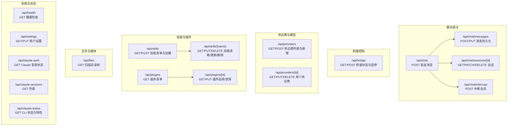
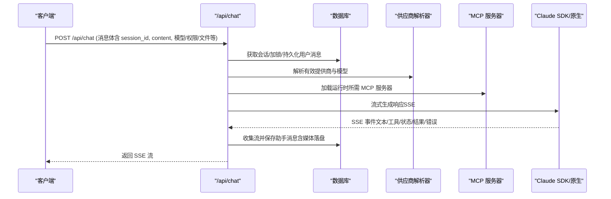
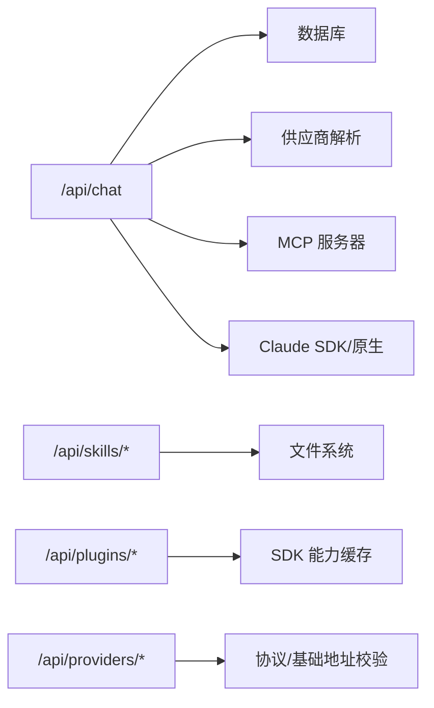

# API 参考

<cite>
**本文引用的文件**
- [src/app/api/chat/route.ts](file://src/app/api/chat/route.ts)
- [src/app/api/chat/messages/route.ts](file://src/app/api/chat/messages/route.ts)
- [src/app/api/chat/sessions/[id]/route.ts](file://src/app/api/chat/sessions/[id]/route.ts)
- [src/app/api/chat/interrupt/route.ts](file://src/app/api/chat/interrupt/route.ts)
- [src/app/api/bridge/route.ts](file://src/app/api/bridge/route.ts)
- [src/app/api/providers/route.ts](file://src/app/api/providers/route.ts)
- [src/app/api/providers/[id]/route.ts](file://src/app/api/providers/[id]/route.ts)
- [src/app/api/skills/route.ts](file://src/app/api/skills/route.ts)
- [src/app/api/skills/[name]/route.ts](file://src/app/api/skills/[name]/route.ts)
- [src/app/api/plugins/route.ts](file://src/app/api/plugins/route.ts)
- [src/app/api/plugins/[id]/route.ts](file://src/app/api/plugins/[id]/route.ts)
- [src/app/api/files/route.ts](file://src/app/api/files/route.ts)
- [src/app/api/health/route.ts](file://src/app/api/health/route.ts)
- [src/app/api/settings/route.ts](file://src/app/api/settings/route.ts)
- [src/app/api/claude-auth/route.ts](file://src/app/api/claude-auth/route.ts)
- [src/app/api/claude-sessions/route.ts](file://src/app/api/claude-sessions/route.ts)
- [src/app/api/claude-status/route.ts](file://src/app/api/claude-status/route.ts)
</cite>

## 目录
1. [简介](#简介)
2. [项目结构](#项目结构)
3. [核心组件](#核心组件)
4. [架构总览](#架构总览)
5. [详细组件分析](#详细组件分析)
6. [依赖关系分析](#依赖关系分析)
7. [性能与并发特性](#性能与并发特性)
8. [认证与安全](#认证与安全)
9. [错误处理与状态码](#错误处理与状态码)
10. [速率限制](#速率限制)
11. [请求/响应示例与客户端实现指南](#请求响应示例与客户端实现指南)
12. [故障排查](#故障排查)
13. [结论](#结论)

## 简介
本文件为 CodePilot 后端 API 的完整参考文档，覆盖聊天消息、桥接控制、供应商管理、媒体与文件扫描、技能与插件管理、健康检查、设置与 Claude 状态等接口。文档以 RESTful 风格描述各端点的 HTTP 方法、URL 模式、请求/响应结构，并提供错误处理策略、性能与并发特性说明，以及客户端实现建议。

## 项目结构
API 基于 Next.js App Router，路由位于 src/app/api 下，按功能域划分目录（如 chat、bridge、providers、skills、plugins、files、settings、health、claude-*）。每个路由文件导出一个或多个 HTTP 处理函数（GET/POST/PUT/PATCH/DELETE），并返回标准的 Response 或 NextResponse。

图表来源
- [src/app/api/chat/route.ts:27-630](file://src/app/api/chat/route.ts#L27-L630)
- [src/app/api/chat/messages/route.ts:11-98](file://src/app/api/chat/messages/route.ts#L11-L98)
- [src/app/api/chat/sessions/[id]/route.ts](file://src/app/api/chat/sessions/[id]/route.ts#L5-L117)
- [src/app/api/chat/interrupt/route.ts:13-44](file://src/app/api/chat/interrupt/route.ts#L13-L44)
- [src/app/api/bridge/route.ts:14-56](file://src/app/api/bridge/route.ts#L14-L56)
- [src/app/api/providers/route.ts:38-143](file://src/app/api/providers/route.ts#L38-L143)
- [src/app/api/providers/[id]/route.ts](file://src/app/api/providers/[id]/route.ts#L18-L177)
- [src/app/api/skills/route.ts:290-421](file://src/app/api/skills/route.ts#L290-L421)
- [src/app/api/skills/[name]/route.ts](file://src/app/api/skills/[name]/route.ts#L239-L411)
- [src/app/api/plugins/route.ts:5-17](file://src/app/api/plugins/route.ts#L5-L17)
- [src/app/api/plugins/[id]/route.ts](file://src/app/api/plugins/[id]/route.ts#L23-L101)
- [src/app/api/files/route.ts:7-63](file://src/app/api/files/route.ts#L7-L63)
- [src/app/api/health/route.ts:3-5](file://src/app/api/health/route.ts#L3-L5)
- [src/app/api/settings/route.ts:28-60](file://src/app/api/settings/route.ts#L28-L60)
- [src/app/api/claude-auth/route.ts:12-38](file://src/app/api/claude-auth/route.ts#L12-L38)
- [src/app/api/claude-sessions/route.ts:3-12](file://src/app/api/claude-sessions/route.ts#L3-L12)
- [src/app/api/claude-status/route.ts:68-149](file://src/app/api/claude-status/route.ts#L68-L149)

章节来源
- [src/app/api/chat/route.ts:1-1060](file://src/app/api/chat/route.ts#L1-L1060)
- [src/app/api/bridge/route.ts:1-57](file://src/app/api/bridge/route.ts#L1-L57)
- [src/app/api/providers/route.ts:1-144](file://src/app/api/providers/route.ts#L1-L144)
- [src/app/api/providers/[id]/route.ts](file://src/app/api/providers/[id]/route.ts#L1-L178)
- [src/app/api/skills/route.ts:1-491](file://src/app/api/skills/route.ts#L1-L491)
- [src/app/api/skills/[name]/route.ts](file://src/app/api/skills/[name]/route.ts#L1-L412)
- [src/app/api/plugins/route.ts:1-18](file://src/app/api/plugins/route.ts#L1-L18)
- [src/app/api/plugins/[id]/route.ts](file://src/app/api/plugins/[id]/route.ts#L1-L102)
- [src/app/api/files/route.ts:1-64](file://src/app/api/files/route.ts#L1-L64)
- [src/app/api/health/route.ts:1-6](file://src/app/api/health/route.ts#L1-L6)
- [src/app/api/settings/route.ts:1-61](file://src/app/api/settings/route.ts#L1-L61)
- [src/app/api/claude-auth/route.ts:1-39](file://src/app/api/claude-auth/route.ts#L1-L39)
- [src/app/api/claude-sessions/route.ts:1-13](file://src/app/api/claude-sessions/route.ts#L1-L13)
- [src/app/api/claude-status/route.ts:1-150](file://src/app/api/claude-status/route.ts#L1-L150)

## 核心组件
- 聊天引擎：负责接收用户消息、组装上下文、调用上游模型、流式输出、保存消息与媒体、处理权限与工具调用。
- 会话管理：提供会话查询、更新（工作目录、标题、模式、模型、提供商、权限配置、清空消息）与删除。
- 桥接控制：统一查询桥接状态与启动/停止/自动启动桥接服务。
- 供应商管理：提供供应商列表、创建、更新（含协议与基础地址校验）、删除；支持默认供应商与图片生成供应商联动。
- 技能与插件：技能清单与 CRUD（含冲突检测与来源优先级），插件清单与启用/禁用（含市场来源解析）。
- 文件与媒体：目录扫描（带路径安全与深度限制）、媒体块落盘与本地路径替换。
- 系统与状态：健康检查、用户设置读写、Claude 登录状态与 CLI 安装状态、会话列表。

章节来源
- [src/app/api/chat/route.ts:27-630](file://src/app/api/chat/route.ts#L27-L630)
- [src/app/api/chat/sessions/[id]/route.ts](file://src/app/api/chat/sessions/[id]/route.ts#L5-L117)
- [src/app/api/bridge/route.ts:14-56](file://src/app/api/bridge/route.ts#L14-L56)
- [src/app/api/providers/route.ts:38-143](file://src/app/api/providers/route.ts#L38-L143)
- [src/app/api/providers/[id]/route.ts](file://src/app/api/providers/[id]/route.ts#L18-L177)
- [src/app/api/skills/route.ts:290-421](file://src/app/api/skills/route.ts#L290-L421)
- [src/app/api/skills/[name]/route.ts](file://src/app/api/skills/[name]/route.ts#L239-L411)
- [src/app/api/plugins/route.ts:5-17](file://src/app/api/plugins/route.ts#L5-L17)
- [src/app/api/plugins/[id]/route.ts](file://src/app/api/plugins/[id]/route.ts#L23-L101)
- [src/app/api/files/route.ts:7-63](file://src/app/api/files/route.ts#L7-L63)
- [src/app/api/health/route.ts:3-5](file://src/app/api/health/route.ts#L3-L5)
- [src/app/api/settings/route.ts:28-60](file://src/app/api/settings/route.ts#L28-L60)
- [src/app/api/claude-auth/route.ts:12-38](file://src/app/api/claude-auth/route.ts#L12-L38)
- [src/app/api/claude-sessions/route.ts:3-12](file://src/app/api/claude-sessions/route.ts#L3-L12)
- [src/app/api/claude-status/route.ts:68-149](file://src/app/api/claude-status/route.ts#L68-L149)

## 架构总览
下图展示从客户端到聊天引擎、数据库、供应商解析、MCP 服务器与 Claude SDK/原生运行时的整体交互。

图表来源
- [src/app/api/chat/route.ts:27-630](file://src/app/api/chat/route.ts#L27-L630)

## 详细组件分析

### 聊天消息发送（/api/chat）
- 方法与路径
  - POST /api/chat
- 请求体字段
  - 必填：session_id, content
  - 可选：model, mode, files[], toolTimeout, provider_id, systemPromptAppend, autoTrigger, thinking, effort, enableFileCheckpointing, displayOverride, context_1m
- 行为要点
  - 校验提供者存在性与会话存在性
  - 会话独占锁，防止并发请求
  - 支持 /compact 命令的即时压缩
  - 组装系统提示、历史与摘要，估计上下文占用，必要时自动压缩
  - 选择 SDK 会话 ID 或全新会话，避免旧历史残留
  - 流式输出，同时后台收集并保存助手消息，媒体落盘后替换为本地路径
  - 支持中断（/api/chat/interrupt）
- 响应
  - 成功：text/event-stream（SSE）
  - 错误：JSON { error, code? }
- 典型状态码
  - 400 缺少参数
  - 404 会话不存在
  - 409 会话忙
  - 412 需要配置提供者
  - 500 内部错误

章节来源
- [src/app/api/chat/route.ts:27-630](file://src/app/api/chat/route.ts#L27-L630)

### 消息持久化（/api/chat/messages）
- 方法与路径
  - POST /api/chat/messages：仅持久化消息，不触发模型
  - PUT /api/chat/messages：更新消息内容（支持 message_id 或 session+hint 回退）
- 请求体字段
  - POST：session_id, role, content, token_usage?
  - PUT：message_id 或 session_id + prompt_hint 或 raw_request_block + content
- 响应
  - 成功：JSON { message | ok, updated_message_id, fallback_used }
  - 错误：JSON { error }

章节来源
- [src/app/api/chat/messages/route.ts:11-98](file://src/app/api/chat/messages/route.ts#L11-L98)

### 会话管理（/api/chat/sessions/[id]）
- 方法与路径
  - GET /api/chat/sessions/[id]：获取会话详情
  - PATCH /api/chat/sessions/[id]：更新会话属性（工作目录、标题、模式、模型、提供商、权限、清空消息）
  - DELETE /api/chat/sessions/[id]：删除会话
- 行为要点
  - 更改模型/提供商时若未显式传入 sdk_session_id，则清除旧 SDK 会话 ID，避免后续恢复失败
  - 切换至 full_access 时自动批准该会话的待定桥接权限
- 响应
  - 成功：JSON { session | success }
  - 错误：JSON { error }

章节来源
- [src/app/api/chat/sessions/[id]/route.ts](file://src/app/api/chat/sessions/[id]/route.ts#L5-L117)

### 会话中断（/api/chat/interrupt）
- 方法与路径
  - POST /api/chat/interrupt
- 请求体字段
  - sessionId：必填
- 行为要点
  - 尝试原生运行时中断（AbortController）与 SDK 运行时中断（conversation.interrupt）
- 响应
  - 成功：JSON { interrupted: true }
  - 错误：JSON { interrupted: false, error }

章节来源
- [src/app/api/chat/interrupt/route.ts:13-44](file://src/app/api/chat/interrupt/route.ts#L13-L44)

### 桥接控制（/api/bridge）
- 方法与路径
  - GET /api/bridge：查询桥接状态（无副作用）
  - POST /api/bridge：{ action: 'start' | 'stop' | 'auto-start' }
- 响应
  - 成功：JSON { ok?, reason?, status }
  - 错误：JSON { error }

章节来源
- [src/app/api/bridge/route.ts:14-56](file://src/app/api/bridge/route.ts#L14-L56)

### 供应商管理（/api/providers 与 /api/providers/[id]）
- 列表与新增（/api/providers）
  - GET：返回 providers、env_detected、default_provider_id
  - POST：创建供应商，进行协议与基础地址校验
- 更新与删除（/api/providers/[id]）
  - GET：获取单个供应商（密钥掩码）
  - PUT：更新供应商，协议与基础地址校验，媒体类型供应商必须提供基础地址
  - DELETE：删除供应商，清理默认与活跃图片生成供应商设置
- 响应
  - 成功：JSON { provider | success }
  - 错误：JSON { error, code? }

章节来源
- [src/app/api/providers/route.ts:38-143](file://src/app/api/providers/route.ts#L38-L143)
- [src/app/api/providers/[id]/route.ts](file://src/app/api/providers/[id]/route.ts#L18-L177)

### 技能管理（/api/skills 与 /api/skills/[name]）
- 清单与创建（/api/skills）
  - GET：扫描全局/项目/安装/插件/SDK 命令，去重与合并，支持 cwd 查询参数
  - POST：创建全局或项目级命令（.md）
- 读取/更新/删除（/api/skills/[name]）
  - GET：按名称查找，支持 source=agents|claude 限定来源，冲突时返回多来源
  - PUT：更新指定来源的技能内容
  - DELETE：删除指定来源的技能
- 响应
  - 成功：JSON { skills | skill | success }
  - 错误：JSON { error, sources? }

章节来源
- [src/app/api/skills/route.ts:290-421](file://src/app/api/skills/route.ts#L290-L421)
- [src/app/api/skills/[name]/route.ts](file://src/app/api/skills/[name]/route.ts#L239-L411)

### 插件管理（/api/plugins 与 /api/plugins/[id]）
- 清单（/api/plugins）
  - GET：返回插件列表，支持 cwd 参数
- 启用/禁用（/api/plugins/[id]）
  - GET：按 name@marketplace 查找插件
  - PUT：{ enabled: boolean, cwd? }，返回 layer 与 escalated 标记
- 响应
  - 成功：JSON { plugins | plugin | success, layer?, escalated? }
  - 错误：JSON { error }

章节来源
- [src/app/api/plugins/route.ts:5-17](file://src/app/api/plugins/route.ts#L5-L17)
- [src/app/api/plugins/[id]/route.ts](file://src/app/api/plugins/[id]/route.ts#L23-L101)

### 文件扫描（/api/files）
- 方法与路径
  - GET /api/files?dir=...&depth=...&baseDir=...
- 行为要点
  - 校验目录参数与路径安全性（禁止根目录作为 baseDir；默认限制在用户主目录）
  - 限制最大深度
- 响应
  - 成功：JSON { tree, root }
  - 错误：JSON { error }

章节来源
- [src/app/api/files/route.ts:7-63](file://src/app/api/files/route.ts#L7-L63)

### 健康检查（/api/health）
- 方法与路径
  - GET /api/health
- 响应
  - 成功：JSON { status: 'ok' }

章节来源
- [src/app/api/health/route.ts:3-5](file://src/app/api/health/route.ts#L3-L5)

### 用户设置（/api/settings）
- 方法与路径
  - GET /api/settings：读取 ~/.claude/settings.json
  - PUT /api/settings：写入 settings 对象
- 响应
  - 成功：JSON { settings | success }
  - 错误：JSON { error }

章节来源
- [src/app/api/settings/route.ts:28-60](file://src/app/api/settings/route.ts#L28-L60)

### Claude 登录状态（/api/claude-auth）
- 方法与路径
  - GET /api/claude-auth
- 响应
  - 成功：JSON { authenticated, email?, accountType?, organizationName? }

章节来源
- [src/app/api/claude-auth/route.ts:12-38](file://src/app/api/claude-auth/route.ts#L12-L38)

### Claude 会话列表（/api/claude-sessions）
- 方法与路径
  - GET /api/claude-sessions
- 响应
  - 成功：JSON { sessions }
  - 错误：JSON { error }

章节来源
- [src/app/api/claude-sessions/route.ts:3-12](file://src/app/api/claude-sessions/route.ts#L3-L12)

### Claude CLI 状态（/api/claude-status）
- 方法与路径
  - GET /api/claude-status
- 响应
  - 成功：JSON { connected, version, latestVersion?, updateAvailable?, manualUpdateChannel?, binaryPath, installType, otherInstalls, missingGit, warnings, features }
- 特性检测
  - thinking、context1m、effort 等基于版本比较

章节来源
- [src/app/api/claude-status/route.ts:68-149](file://src/app/api/claude-status/route.ts#L68-L149)

## 依赖关系分析
- 聊天引擎依赖
  - 数据库：会话、消息、设置、任务同步
  - 供应商解析：统一解析有效提供商与模型
  - 上下文组装：工作区、CLI 工具、小部件提示
  - MCP 服务器：根据预测运行时加载
  - Claude SDK/原生：流式生成与中断
- 技能/插件依赖
  - 文件系统扫描与 YAML Front Matter 解析
  - SDK 能力缓存（命令/插件）
- 供应商依赖
  - 协议有效性与基础地址约束
  - 默认/活跃图片供应商联动

图表来源
- [src/app/api/chat/route.ts:27-630](file://src/app/api/chat/route.ts#L27-L630)
- [src/app/api/skills/route.ts:290-421](file://src/app/api/skills/route.ts#L290-L421)
- [src/app/api/plugins/route.ts:5-17](file://src/app/api/plugins/route.ts#L5-L17)
- [src/app/api/providers/route.ts:38-143](file://src/app/api/providers/route.ts#L38-L143)

## 性能与并发特性
- 会话独占锁：POST /api/chat 在处理期间对会话加锁，避免并发请求导致状态不一致
- 流式输出：使用 SSE 文本流，边生成边返回，降低首包延迟
- 自动上下文压缩：在估计超限时自动压缩历史，减少后续请求成本
- 会话锁续期：长时间流式生成时定期续期锁，避免过期
- 任务调度：首次调用启动任务调度器，保障后台任务执行

章节来源
- [src/app/api/chat/route.ts:68-79](file://src/app/api/chat/route.ts#L68-L79)
- [src/app/api/chat/route.ts:566-569](file://src/app/api/chat/route.ts#L566-L569)

## 认证与安全
- 认证方式
  - Claude 登录状态：通过 ~/.claude/.credentials 判断是否登录
  - 供应商密钥：返回时掩码显示，更新时支持保留掩码值
- 安全措施
  - 文件扫描限制 baseDir 不可为文件系统根，限制扫描范围
  - 路径安全校验，防止越权访问
  - 供应商创建/更新时强制要求特定协议的基础地址（如 Anthropic、OpenAI Image、Gemini Image）

章节来源
- [src/app/api/claude-auth/route.ts:12-38](file://src/app/api/claude-auth/route.ts#L12-L38)
- [src/app/api/providers/route.ts:55-130](file://src/app/api/providers/route.ts#L55-L130)
- [src/app/api/providers/[id]/route.ts](file://src/app/api/providers/[id]/route.ts#L39-L129)
- [src/app/api/files/route.ts:22-52](file://src/app/api/files/route.ts#L22-L52)

## 错误处理与状态码
- 常见状态码
  - 400：缺少参数、无效输入
  - 403：越权或不允许的目录
  - 404：资源不存在（会话/技能/插件/供应商）
  - 409：资源冲突（如技能同名不同内容）
  - 412：前置条件不满足（如需要配置提供者）
  - 413：请求过大（由上游或流式处理逻辑决定）
  - 429：速率限制（见“速率限制”）
  - 500：内部错误
- 错误响应格式
  - JSON { error, code? }

章节来源
- [src/app/api/chat/route.ts:38-58](file://src/app/api/chat/route.ts#L38-L58)
- [src/app/api/chat/messages/route.ts:21-38](file://src/app/api/chat/messages/route.ts#L21-L38)
- [src/app/api/skills/[name]/route.ts](file://src/app/api/skills/[name]/route.ts#L252-L267)
- [src/app/api/files/route.ts:31-51](file://src/app/api/files/route.ts#L31-L51)

## 速率限制
- 当前仓库未发现显式的速率限制实现。建议在网关或应用层引入基于 IP/会话/令牌的限流策略，结合 SSE 流式输出场景，避免长连接滥用。

## 请求/响应示例与客户端实现指南
以下为常见场景的请求/响应示意与实现建议（请以实际返回为准）：

- 发送聊天消息（SSE）
  - 请求
    - 方法：POST
    - 路径：/api/chat
    - 请求头：Content-Type: application/json
    - 示例请求体字段：session_id, content, model, mode, files[], toolTimeout, provider_id, systemPromptAppend, autoTrigger, thinking, effort, enableFileCheckpointing, displayOverride, context_1m
  - 响应
    - 成功：text/event-stream，事件类型包括 text、tool_use、tool_result、status、task_update、result、error、done
    - 失败：JSON { error, code? }
  - 客户端实现要点
    - 使用 EventSource 或 fetch + ReadableStream 读取 SSE
    - 解析事件类型，分别渲染文本、工具调用、工具结果与状态栏
    - 遇到 error 事件时终止并提示错误
    - 遇到 done 结束流

- 持久化消息（非流式）
  - 请求
    - 方法：POST
    - 路径：/api/chat/messages
    - 请求体：{ session_id, role, content, token_usage? }
  - 响应：JSON { message }

- 更新消息内容
  - 请求
    - 方法：PUT
    - 路径：/api/chat/messages
    - 请求体：{ message_id, content } 或 { session_id, prompt_hint, content }
  - 响应：JSON { ok, updated_message_id, fallback_used }

- 获取会话详情
  - 请求
    - 方法：GET
    - 路径：/api/chat/sessions/[id]
  - 响应：JSON { session }

- 更新会话属性
  - 请求
    - 方法：PATCH
    - 路径：/api/chat/sessions/[id]
    - 请求体：{ working_directory?, title?, mode?, model?, provider_id?, sdk_session_id?, permission_profile?, clear_messages? }
  - 响应：JSON { session }

- 删除会话
  - 请求
    - 方法：DELETE
    - 路径：/api/chat/sessions/[id]
  - 响应：JSON { success }

- 中断会话
  - 请求
    - 方法：POST
    - 路径：/api/chat/interrupt
    - 请求体：{ sessionId }
  - 响应：JSON { interrupted }

- 获取桥接状态与启停
  - 请求
    - 方法：GET /api/bridge：查询状态
    - 方法：POST /api/bridge：{ action: 'start' | 'stop' | 'auto-start' }
  - 响应：JSON { ok?, reason?, status }

- 供应商管理
  - 新增/更新/删除：遵循 /api/providers 与 /api/providers/[id] 的请求/响应规范
  - 注意：Anthropic 与媒体类供应商必须提供基础地址

- 技能管理
  - 创建/读取/更新/删除：遵循 /api/skills 与 /api/skills/[name] 的请求/响应规范
  - 冲突处理：当同一技能在多来源存在且内容不一致时，返回多来源信息

- 插件管理
  - 列表：GET /api/plugins
  - 启用/禁用：PUT /api/plugins/[id]，请求体 { enabled: boolean, cwd? }

- 文件扫描
  - 请求：GET /api/files?dir=...&depth=...&baseDir=...
  - 响应：JSON { tree, root }

- 健康检查
  - 请求：GET /api/health
  - 响应：JSON { status: 'ok' }

- 用户设置
  - 读取：GET /api/settings
  - 写入：PUT /api/settings，请求体 { settings }

- Claude 登录状态
  - 请求：GET /api/claude-auth
  - 响应：JSON { authenticated, email?, accountType?, organizationName? }

- Claude 会话列表
  - 请求：GET /api/claude-sessions
  - 响应：JSON { sessions }

- Claude CLI 状态
  - 请求：GET /api/claude-status
  - 响应：JSON { connected, version, latestVersion?, updateAvailable?, manualUpdateChannel?, binaryPath, installType, otherInstalls, missingGit, warnings, features }

章节来源
- [src/app/api/chat/route.ts:27-630](file://src/app/api/chat/route.ts#L27-L630)
- [src/app/api/chat/messages/route.ts:11-98](file://src/app/api/chat/messages/route.ts#L11-L98)
- [src/app/api/chat/sessions/[id]/route.ts](file://src/app/api/chat/sessions/[id]/route.ts#L5-L117)
- [src/app/api/chat/interrupt/route.ts:13-44](file://src/app/api/chat/interrupt/route.ts#L13-L44)
- [src/app/api/bridge/route.ts:14-56](file://src/app/api/bridge/route.ts#L14-L56)
- [src/app/api/providers/route.ts:38-143](file://src/app/api/providers/route.ts#L38-L143)
- [src/app/api/providers/[id]/route.ts](file://src/app/api/providers/[id]/route.ts#L18-L177)
- [src/app/api/skills/route.ts:290-421](file://src/app/api/skills/route.ts#L290-L421)
- [src/app/api/skills/[name]/route.ts](file://src/app/api/skills/[name]/route.ts#L239-L411)
- [src/app/api/plugins/route.ts:5-17](file://src/app/api/plugins/route.ts#L5-L17)
- [src/app/api/plugins/[id]/route.ts](file://src/app/api/plugins/[id]/route.ts#L23-L101)
- [src/app/api/files/route.ts:7-63](file://src/app/api/files/route.ts#L7-L63)
- [src/app/api/health/route.ts:3-5](file://src/app/api/health/route.ts#L3-L5)
- [src/app/api/settings/route.ts:28-60](file://src/app/api/settings/route.ts#L28-L60)
- [src/app/api/claude-auth/route.ts:12-38](file://src/app/api/claude-auth/route.ts#L12-L38)
- [src/app/api/claude-sessions/route.ts:3-12](file://src/app/api/claude-sessions/route.ts#L3-L12)
- [src/app/api/claude-status/route.ts:68-149](file://src/app/api/claude-status/route.ts#L68-L149)

## 故障排查
- 会话忙（409）
  - 现象：同一会话并发请求被拒绝
  - 处理：等待当前请求完成或释放锁
- 需要提供者（412）
  - 现象：未配置任何 CodePilot 提供者
  - 处理：先创建/配置提供者再发起聊天
- 路径越权（403）
  - 现象：扫描目录时 baseDir 为根或超出允许范围
  - 处理：提供正确的 baseDir 或使用用户主目录
- 技能冲突（409）
  - 现象：同一技能在多来源存在且内容不同
  - 处理：明确 source 参数或清理重复来源
- 供应商基础地址缺失
  - 现象：Anthropic 或媒体类供应商未提供基础地址
  - 处理：补充正确的 base_url

章节来源
- [src/app/api/chat/route.ts:48-58](file://src/app/api/chat/route.ts#L48-L58)
- [src/app/api/files/route.ts:31-51](file://src/app/api/files/route.ts#L31-L51)
- [src/app/api/skills/[name]/route.ts](file://src/app/api/skills/[name]/route.ts#L252-L267)
- [src/app/api/providers/route.ts:95-130](file://src/app/api/providers/route.ts#L95-L130)
- [src/app/api/providers/[id]/route.ts](file://src/app/api/providers/[id]/route.ts#L76-L109)

## 结论
本文档提供了 CodePilot 后端 API 的完整参考，涵盖聊天、桥接、供应商、技能/插件、文件与媒体、系统状态等关键领域。客户端应遵循 SSE 事件语义、正确处理错误与状态码，并在需要时配合会话锁与自动压缩机制优化体验。建议在生产环境引入速率限制与可观测性策略，确保稳定性与可维护性。