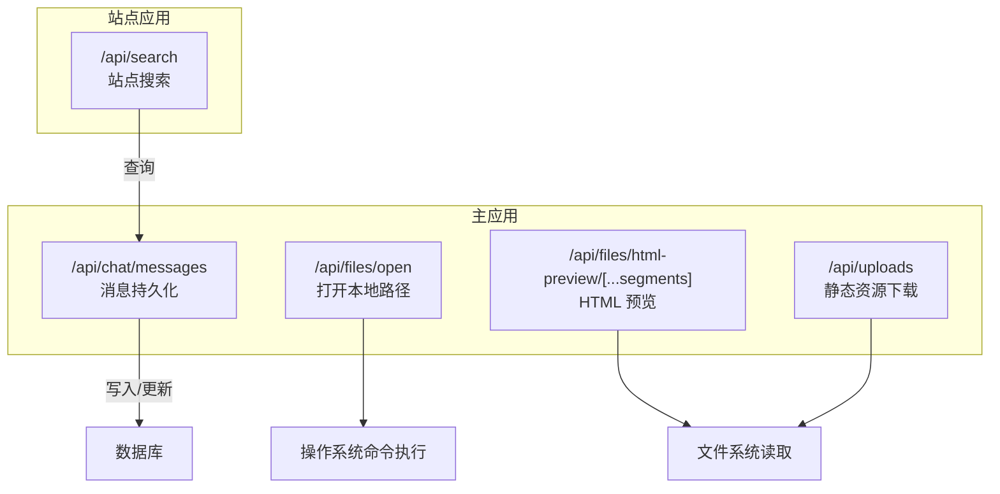
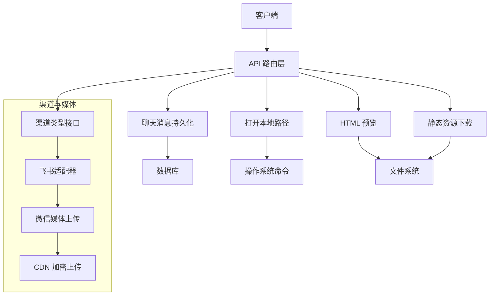
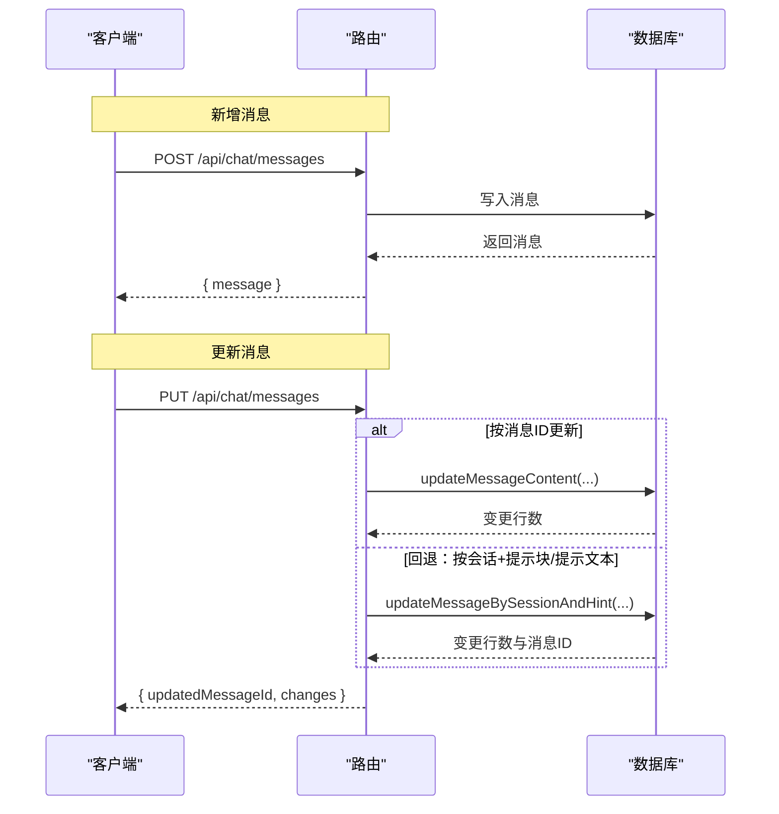
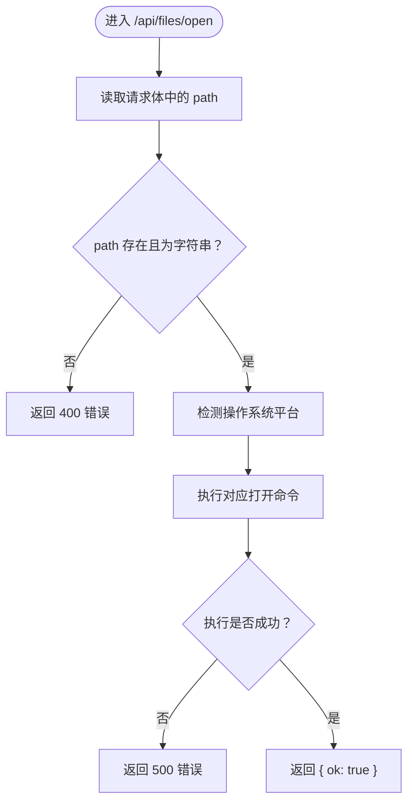
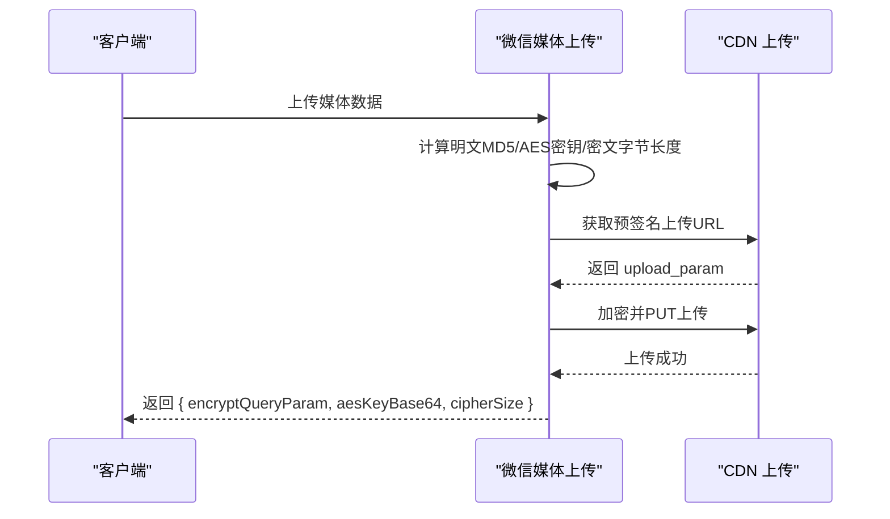
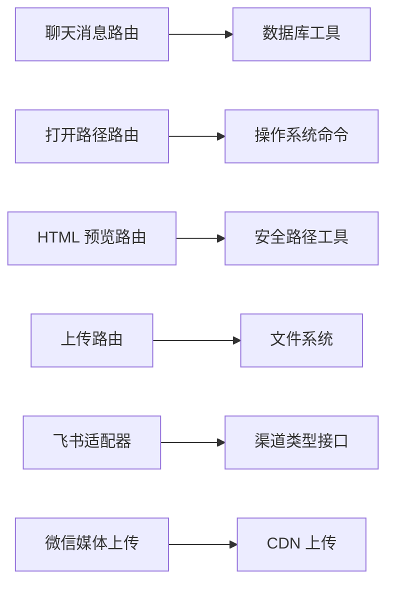

# API 参考

<cite>
**本文引用的文件**
- [apps/site/src/app/api/search/route.ts](file://apps/site/src/app/api/search/route.ts)
- [src/app/api/chat/messages/route.ts](file://src/app/api/chat/messages/route.ts)
- [src/app/api/files/open/route.ts](file://src/app/api/files/open/route.ts)
- [src/app/api/files/html-preview/[...segments]/route.ts](file://src/app/api/files/html-preview/[...segments]/route.ts)
- [src/app/api/uploads/route.ts](file://src/app/api/uploads/route.ts)
- [src/lib/html-preview-url.ts](file://src/lib/html-preview-url.ts)
- [src/lib/files.ts](file://src/lib/files.ts)
- [src/lib/channels/types.ts](file://src/lib/channels/types.ts)
- [src/lib/channels/feishu/index.ts](file://src/lib/channels/feishu/index.ts)
- [src/lib/bridge/adapters/weixin/weixin-media.ts](file://src/lib/bridge/adapters/weixin/weixin-media.ts)
- [资料/weixin-openclaw-package/package/src/cdn/upload.ts](file://资料/weixin-openclaw-package/package/src/cdn/upload.ts)
- [apps/site/src/middleware.ts](file://apps/site/src/middleware.ts)
- [src/__tests__/unit/codex-phase-6-wiring.test.ts](file://src/__tests__/unit/codex-phase-6-wiring.test.ts)
- [src/__tests__/unit/codex-proxy-error-visibility.test.ts](file://src/__tests__/unit/codex-proxy-error-visibility.test.ts)
</cite>

## 目录
1. [简介](#简介)
2. [项目结构](#项目结构)
3. [核心组件](#核心组件)
4. [架构总览](#架构总览)
5. [详细组件分析](#详细组件分析)
6. [依赖关系分析](#依赖关系分析)
7. [性能考量](#性能考量)
8. [故障排查指南](#故障排查指南)
9. [结论](#结论)
10. [附录](#附录)

## 简介
本文件为 CodePilot 的完整 API 参考文档，覆盖聊天、文件、媒体等核心能力的 REST 接口规范。文档从系统架构、端点定义、数据模型、错误处理、安全与性能等方面进行系统化梳理，并提供调用序列与时序图示，帮助开发者快速集成与扩展。

## 项目结构
CodePilot 的 API 主要位于应用层路由中，采用 Next.js App Router 风格的约定式路由组织方式。站点侧的搜索 API 位于站点应用，而核心业务 API（聊天、文件、上传、预览）位于主应用。

图表来源
- [apps/site/src/app/api/search/route.ts](file://apps/site/src/app/api/search/route.ts)
- [src/app/api/chat/messages/route.ts](file://src/app/api/chat/messages/route.ts)
- [src/app/api/files/open/route.ts](file://src/app/api/files/open/route.ts)
- [src/app/api/files/html-preview/[...segments]/route.ts](file://src/app/api/files/html-preview/[...segments]/route.ts)
- [src/app/api/uploads/route.ts](file://src/app/api/uploads/route.ts)

章节来源
- [apps/site/src/app/api/search/route.ts](file://apps/site/src/app/api/search/route.ts)
- [apps/site/src/middleware.ts](file://apps/site/src/middleware.ts)

## 核心组件
- 聊天消息 API：用于在不触发模型推理的前提下持久化消息，支持新增与更新两种操作。
- 文件 API：提供打开本地路径与 HTML 预览两类能力；上传路由提供静态资源下载。
- 媒体与桥接：通过微信/飞书等渠道适配器实现媒体上传与发送，涉及 CDN 加密上传与引用参数生成。
- 站点搜索 API：面向站点内容的搜索入口。

章节来源
- [src/app/api/chat/messages/route.ts](file://src/app/api/chat/messages/route.ts)
- [src/app/api/files/open/route.ts](file://src/app/api/files/open/route.ts)
- [src/app/api/files/html-preview/[...segments]/route.ts](file://src/app/api/files/html-preview/[...segments]/route.ts)
- [src/app/api/uploads/route.ts](file://src/app/api/uploads/route.ts)
- [src/lib/bridge/adapters/weixin/weixin-media.ts](file://src/lib/bridge/adapters/weixin/weixin-media.ts)
- [src/lib/channels/types.ts](file://src/lib/channels/types.ts)
- [src/lib/channels/feishu/index.ts](file://src/lib/channels/feishu/index.ts)

## 架构总览
下图展示 API 层与外部系统的交互关系，包括数据库、文件系统、操作系统命令、CDN 上传与渠道网关。

图表来源
- [src/app/api/chat/messages/route.ts](file://src/app/api/chat/messages/route.ts)
- [src/app/api/files/open/route.ts](file://src/app/api/files/open/route.ts)
- [src/app/api/files/html-preview/[...segments]/route.ts](file://src/app/api/files/html-preview/[...segments]/route.ts)
- [src/app/api/uploads/route.ts](file://src/app/api/uploads/route.ts)
- [src/lib/channels/types.ts](file://src/lib/channels/types.ts)
- [src/lib/channels/feishu/index.ts](file://src/lib/channels/feishu/index.ts)
- [src/lib/bridge/adapters/weixin/weixin-media.ts](file://src/lib/bridge/adapters/weixin/weixin-media.ts)

## 详细组件分析

### 聊天消息 API
- 功能：在不触发模型推理的情况下，向会话中写入用户或助手消息；支持后续替换生成结果。
- 支持方法与路径
  - POST /api/chat/messages：新增消息
  - PUT /api/chat/messages：更新消息内容
- 请求与响应要点
  - 新增消息：需要会话标识、角色（用户/助手）、内容；可选 token 使用量；返回新消息对象
  - 更新消息：优先按消息 ID 更新；若无匹配则按会话+提示块或提示文本回溯更新；返回受影响行数与最终消息 ID
- 错误处理
  - 参数缺失返回 400
  - 会话不存在返回 404
  - 其他异常返回 500
- 使用场景
  - 图像生成模式：先写入“请求”消息，生成完成后以结果替换
  - 多轮对话中插入/修正中间产物

图表来源
- [src/app/api/chat/messages/route.ts](file://src/app/api/chat/messages/route.ts)

章节来源
- [src/app/api/chat/messages/route.ts](file://src/app/api/chat/messages/route.ts)

### 文件 API
- 打开本地路径
  - 方法与路径：POST /api/files/open
  - 行为：根据操作系统平台执行打开命令（macOS 使用 open，Windows 使用 explorer，Linux 使用 xdg-open）
  - 请求体字段：path（字符串，必填）
  - 成功返回：{ ok: true }
  - 错误返回：400（缺少路径）、500（执行失败）
- HTML 预览
  - 方法与路径：GET /api/files/html-preview/[...segments]
  - 行为：解析路径段，校验真实路径在基座目录内，读取文件并按扩展名映射 MIME 类型返回
  - 安全性：强制动态运行时与路径白名单校验，防止越权访问
  - 响应头：包含 Content-Type 与缓存控制
- 静态资源下载
  - 方法与路径：GET /api/uploads
  - 行为：解析文件路径，校验存在性，读取文件并按扩展名映射 MIME 类型返回
  - 响应头：设置缓存策略

图表来源
- [src/app/api/files/open/route.ts](file://src/app/api/files/open/route.ts)

章节来源
- [src/app/api/files/open/route.ts](file://src/app/api/files/open/route.ts)
- [src/app/api/files/html-preview/[...segments]/route.ts](file://src/app/api/files/html-preview/[...segments]/route.ts)
- [src/app/api/uploads/route.ts](file://src/app/api/uploads/route.ts)
- [src/lib/html-preview-url.ts](file://src/lib/html-preview-url.ts)
- [src/lib/files.ts](file://src/lib/files.ts)

### 媒体与桥接 API
- 微信媒体上传（CDN 加密上传）
  - 步骤：计算明文 MD5、生成 AES 密钥、计算密文字节长度、获取预签名上传 URL、加密并上传、返回加密下载参数与密钥
  - 返回字段：encryptQueryParam、aesKeyBase64、cipherSize
- 飞书渠道适配器
  - 角色：实现渠道类型接口，提供授权校验、消息开始/结束回调、卡片流控制器等
  - 授权：isAuthorized(userId, chatId) 基于配置判断
  - 生命周期：onMessageStart/onMessageEnd 用于反馈处理状态
- 站点搜索 API
  - 路由：/api/search
  - 作用：为站点内容提供搜索入口（具体实现由该路由文件定义）

图表来源
- [src/lib/bridge/adapters/weixin/weixin-media.ts](file://src/lib/bridge/adapters/weixin/weixin-media.ts)
- [资料/weixin-openclaw-package/package/src/cdn/upload.ts](file://资料/weixin-openclaw-package/package/src/cdn/upload.ts)

章节来源
- [src/lib/bridge/adapters/weixin/weixin-media.ts](file://src/lib/bridge/adapters/weixin/weixin-media.ts)
- [src/lib/channels/types.ts](file://src/lib/channels/types.ts)
- [src/lib/channels/feishu/index.ts](file://src/lib/channels/feishu/index.ts)
- [apps/site/src/app/api/search/route.ts](file://apps/site/src/app/api/search/route.ts)

## 依赖关系分析
- 路由与工具链
  - 路由层依赖数据库与文件系统工具，确保数据一致性与安全性
  - HTML 预览依赖路径解析与安全校验工具，避免越权读取
- 渠道与适配器
  - 渠道类型接口统一了不同渠道的能力契约
  - 飞书适配器基于网关客户端实现消息发送与反应管理
- 测试与验证
  - 单元测试覆盖路由行为与错误分支，保障稳定性

图表来源
- [src/app/api/chat/messages/route.ts](file://src/app/api/chat/messages/route.ts)
- [src/app/api/files/open/route.ts](file://src/app/api/files/open/route.ts)
- [src/app/api/files/html-preview/[...segments]/route.ts](file://src/app/api/files/html-preview/[...segments]/route.ts)
- [src/app/api/uploads/route.ts](file://src/app/api/uploads/route.ts)
- [src/lib/channels/types.ts](file://src/lib/channels/types.ts)
- [src/lib/channels/feishu/index.ts](file://src/lib/channels/feishu/index.ts)
- [src/lib/bridge/adapters/weixin/weixin-media.ts](file://src/lib/bridge/adapters/weixin/weixin-media.ts)

章节来源
- [src/__tests__/unit/codex-phase-6-wiring.test.ts](file://src/__tests__/unit/codex-phase-6-wiring.test.ts)
- [src/__tests__/unit/codex-proxy-error-visibility.test.ts](file://src/__tests__/unit/codex-proxy-error-visibility.test.ts)

## 性能考量
- HTML 预览与上传路由对静态资源设置了强缓存策略，降低重复请求开销
- 路由层采用 Node.js 运行时与动态路由策略，满足实时文件读取需求
- 建议
  - 对大文件上传采用分片或断点续传（如需扩展）
  - 在高并发场景下对文件系统访问加锁或限流
  - 将频繁访问的静态资源置于 CDN 或应用缓存层

## 故障排查指南
- 聊天消息接口
  - 400：请求体缺少必要字段
  - 404：会话不存在
  - 500：内部异常（数据库或序列化错误）
- 文件打开接口
  - 400：缺少 path
  - 500：命令执行失败（权限不足、路径不存在等）
- HTML 预览与上传接口
  - 403/404：路径越权或文件不存在
  - 500：文件读取异常
- 媒体上传接口
  - 400/500：CDN 获取 URL 失败或上传失败
  - 建议检查网络、凭证与超时设置

章节来源
- [src/app/api/chat/messages/route.ts](file://src/app/api/chat/messages/route.ts)
- [src/app/api/files/open/route.ts](file://src/app/api/files/open/route.ts)
- [src/app/api/files/html-preview/[...segments]/route.ts](file://src/app/api/files/html-preview/[...segments]/route.ts)
- [src/app/api/uploads/route.ts](file://src/app/api/uploads/route.ts)
- [src/lib/bridge/adapters/weixin/weixin-media.ts](file://src/lib/bridge/adapters/weixin/weixin-media.ts)

## 结论
本文档提供了 CodePilot 的核心 API 规范与实现要点，涵盖聊天消息、文件与媒体等模块。通过统一的路由组织、安全的路径校验与清晰的错误处理，开发者可以稳定地集成与扩展相关能力。建议在生产环境中结合缓存、限流与监控进一步完善。

## 附录
- 版本控制：当前仓库未发现显式的 API 版本号或语义化版本策略，建议在路由或响应头中引入版本标记以便演进
- 速率限制：未发现内置限流机制，建议在网关或中间件层增加限流策略
- 安全考虑
  - HTML 预览与上传路由已内置路径安全校验与 MIME 映射，避免任意文件执行
  - 建议在生产环境启用 HTTPS、CSP 与最小权限原则
- 客户端实现建议
  - 使用稳定的 HTTP 客户端库，统一处理重试与超时
  - 对上传类接口采用进度回调与断点续传
  - 在多渠道场景下抽象统一的消息发送接口，屏蔽渠道差异