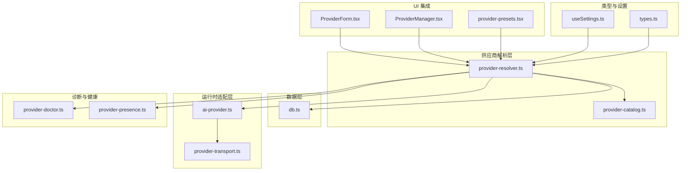
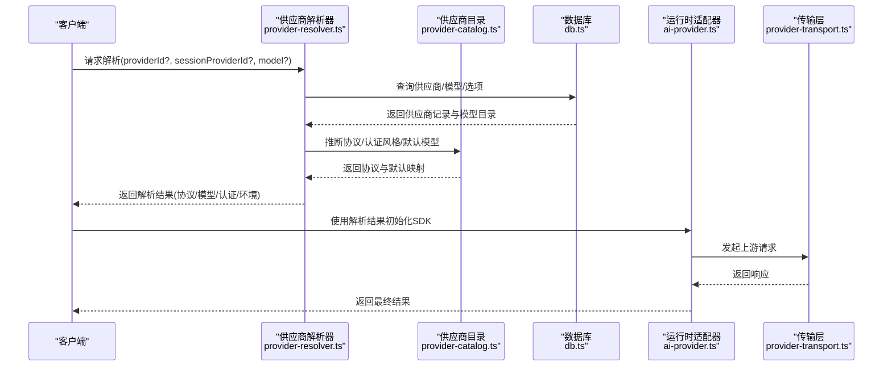
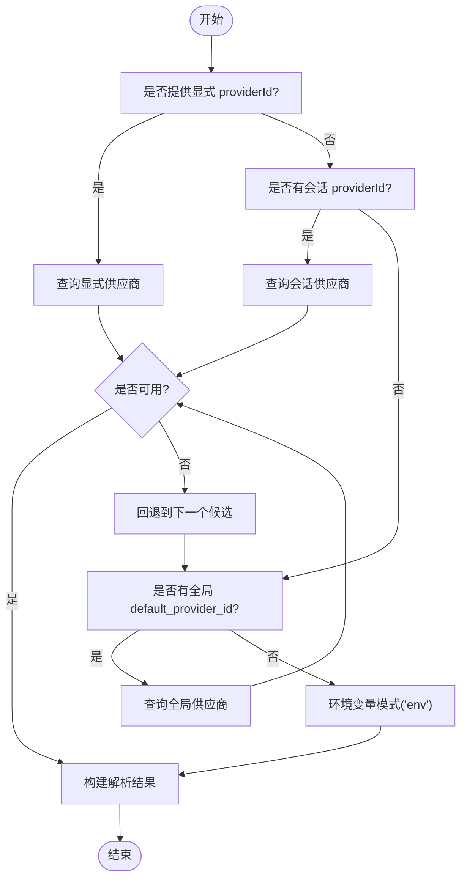
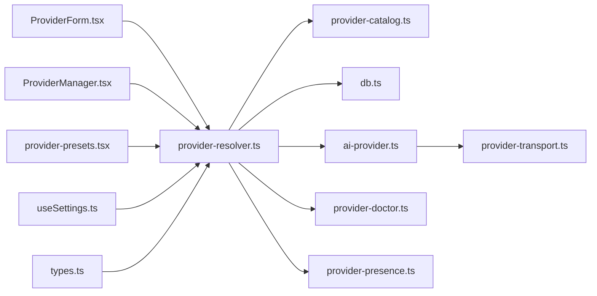

# 供应商 API

<cite>
**本文引用的文件**
- [provider-resolver.ts](file://src/lib/provider-resolver.ts)
- [provider-catalog.ts](file://src/lib/provider-catalog.ts)
- [db.ts](file://src/lib/db.ts)
- [ai-provider.ts](file://src/lib/ai-provider.ts)
- [provider-doctor.ts](file://src/lib/provider-doctor.ts)
- [provider-presence.ts](file://src/lib/provider-presence.ts)
- [provider-transport.ts](file://src/lib/provider-transport.ts)
- [provider-models.ts](file://src/lib/provider-models.ts)
- [provider-settings.ts](file://src/lib/provider-settings.ts)
- [provider-form.ts](file://src/components/settings/ProviderForm.tsx)
- [provider-manager.tsx](file://src/components/settings/ProviderManager.tsx)
- [provider-presets.tsx](file://src/components/settings/provider-presets.tsx)
- [settings.ts](file://src/hooks/useSettings.ts)
- [types.ts](file://src/types/index.ts)
</cite>

## 目录
1. [简介](#简介)
2. [项目结构](#项目结构)
3. [核心组件](#核心组件)
4. [架构总览](#架构总览)
5. [详细组件分析](#详细组件分析)
6. [依赖关系分析](#依赖关系分析)
7. [性能考量](#性能考量)
8. [故障排查指南](#故障排查指南)
9. [结论](#结论)
10. [附录](#附录)

## 简介
本文件为 CodePilot 的 AI 供应商 API 参考文档，聚焦于供应商激活、模型查询、默认设置与连接测试等关键能力。文档基于仓库中的供应商解析、目录与数据库实现，系统性阐述端点规范（HTTP 方法、URL 模式、请求/响应格式、认证要求），并提供实际调用流程图与最佳实践建议。

## 项目结构
围绕供应商 API 的相关模块主要分布在以下路径：
- 解析与路由：src/lib/provider-resolver.ts、src/lib/provider-catalog.ts
- 数据持久化：src/lib/db.ts
- 运行时适配：src/lib/ai-provider.ts、src/lib/provider-transport.ts
- 诊断与健康：src/lib/provider-doctor.ts、src/lib/provider-presence.ts
- UI 集成：src/components/settings/ProviderForm.tsx、src/components/settings/ProviderManager.tsx、src/components/settings/provider-presets.tsx
- 类型定义：src/types/index.ts
- 设置钩子：src/hooks/useSettings.ts

图表来源
- [provider-resolver.ts:1-160](file://src/lib/provider-resolver.ts#L1-L160)
- [provider-catalog.ts:1-140](file://src/lib/provider-catalog.ts#L1-L140)
- [db.ts:138-150](file://src/lib/db.ts#L138-L150)
- [ai-provider.ts](file://src/lib/ai-provider.ts)
- [provider-transport.ts](file://src/lib/provider-transport.ts)
- [provider-doctor.ts](file://src/lib/provider-doctor.ts)
- [provider-presence.ts](file://src/lib/provider-presence.ts)
- [ProviderForm.tsx](file://src/components/settings/ProviderForm.tsx)
- [ProviderManager.tsx](file://src/components/settings/ProviderManager.tsx)
- [provider-presets.tsx](file://src/components/settings/provider-presets.tsx)
- [useSettings.ts](file://src/hooks/useSettings.ts)
- [types.ts](file://src/types/index.ts)

章节来源
- [provider-resolver.ts:1-160](file://src/lib/provider-resolver.ts#L1-L160)
- [provider-catalog.ts:1-140](file://src/lib/provider-catalog.ts#L1-L140)
- [db.ts:138-150](file://src/lib/db.ts#L138-L150)

## 核心组件
- 供应商解析器：统一解析请求中的供应商与模型选择，支持显式指定、会话保留、全局默认与环境变量回退。
- 供应商目录：定义协议类型、认证方式、默认模型目录与厂商预设。
- 数据库接口：提供供应商 CRUD、模型映射、选项与排序等持久化能力。
- 运行时适配器：根据解析结果构建 SDK 配置与环境注入，兼容多协议与第三方代理。
- 诊断与健康：提供连接测试、可用性检测与错误诊断能力。
- UI 集成：表单、管理器与预设组件支撑供应商配置与激活流程。

章节来源
- [provider-resolver.ts:67-159](file://src/lib/provider-resolver.ts#L67-L159)
- [provider-catalog.ts:14-137](file://src/lib/provider-catalog.ts#L14-L137)
- [db.ts:138-150](file://src/lib/db.ts#L138-L150)
- [ai-provider.ts](file://src/lib/ai-provider.ts)
- [provider-doctor.ts](file://src/lib/provider-doctor.ts)
- [provider-presence.ts](file://src/lib/provider-presence.ts)
- [ProviderForm.tsx](file://src/components/settings/ProviderForm.tsx)
- [ProviderManager.tsx](file://src/components/settings/ProviderManager.tsx)
- [provider-presets.tsx](file://src/components/settings/provider-presets.tsx)

## 架构总览
供应商 API 的调用链路如下：

图表来源
- [provider-resolver.ts:91-159](file://src/lib/provider-resolver.ts#L91-L159)
- [provider-catalog.ts:194-272](file://src/lib/provider-catalog.ts#L194-L272)
- [db.ts:138-150](file://src/lib/db.ts#L138-L150)
- [ai-provider.ts](file://src/lib/ai-provider.ts)
- [provider-transport.ts](file://src/lib/provider-transport.ts)

## 详细组件分析

### 供应商解析与激活
- 解析优先级：显式 providerId > 会话 providerId > 全局 default_provider_id > 环境变量模式('env')
- 激活逻辑：当非显式来源（会话/回退）指向已停用供应商时，自动跳过并回退；全局默认即使 is_active=false 仍被尊重，避免用户误操作导致不可用。
- 环境注入：根据协议与认证风格注入相应环境变量（如 ANTHROPIC_API_KEY、ANTHROPIC_AUTH_TOKEN、基础 URL 等）。
- 角色模型映射：支持 default/reasoning/small/haiku/sonnet/opus 的角色到具体模型的映射，用于生成 Claude Code SDK 的环境变量。

图表来源
- [provider-resolver.ts:91-159](file://src/lib/provider-resolver.ts#L91-L159)

章节来源
- [provider-resolver.ts:80-159](file://src/lib/provider-resolver.ts#L80-L159)

### 协议与认证规范
- 协议类型：anthropic、openai-compatible、openrouter、bedrock、vertex、google、gemini-image、openai-image
- 认证风格：api_key（注入 ANTHROPIC_API_KEY）、auth_token（注入 ANTHROPIC_AUTH_TOKEN）、env_only（仅通过环境变量）、custom_header（未来扩展）
- 环境变量注入：根据协议与认证风格注入对应键值；对第三方代理（如 Kimi/GLM/OpenRouter）采用兼容适配器，确保与标准 Messages API 的兼容性。

章节来源
- [provider-catalog.ts:14-83](file://src/lib/provider-catalog.ts#L14-L83)
- [provider-resolver.ts:208-329](file://src/lib/provider-resolver.ts#L208-L329)

### 数据模型与存储
- 供应商表：包含 id、name、provider_type、base_url、api_key、is_active、sort_order、extra_env、notes 等字段；新增 headers_json、env_overrides_json、role_models_json、options_json 字段以支持高级配置。
- 模型映射表：provider_models，支持每供应商自定义模型列表、上游模型 ID、显示名与能力描述。
- 设置表：settings，用于保存全局默认模型、默认供应商等配置。

章节来源
- [db.ts:138-150](file://src/lib/db.ts#L138-L150)
- [db.ts:497-514](file://src/lib/db.ts#L497-L514)
- [db.ts:121-125](file://src/lib/db.ts#L121-L125)

### 连接测试与健康检查
- 连接测试：通过解析器与传输层发起最小化请求，验证供应商可用性与凭据有效性。
- 健康状态：结合 presence 与 doctor 模块，提供供应商状态监控与错误诊断。
- 错误分类：区分网络错误、认证失败、模型不匹配、上游服务异常等场景，输出可读的诊断信息。

章节来源
- [provider-doctor.ts](file://src/lib/provider-doctor.ts)
- [provider-presence.ts](file://src/lib/provider-presence.ts)
- [provider-transport.ts](file://src/lib/provider-transport.ts)

### UI 集成与配置流程
- 表单组件：ProviderForm 支持名称、API Key、基础 URL、环境变量覆盖、模型名称与映射等字段编辑。
- 管理器组件：ProviderManager 提供供应商列表、激活/停用、排序与删除功能。
- 预设组件：provider-presets 展示厂商预设，一键应用协议、认证风格与默认模型目录。

章节来源
- [ProviderForm.tsx](file://src/components/settings/ProviderForm.tsx)
- [ProviderManager.tsx](file://src/components/settings/ProviderManager.tsx)
- [provider-presets.tsx](file://src/components/settings/provider-presets.tsx)

## 依赖关系分析
供应商 API 的关键依赖关系如下：

图表来源
- [provider-resolver.ts:1-30](file://src/lib/provider-resolver.ts#L1-L30)
- [provider-catalog.ts:1-20](file://src/lib/provider-catalog.ts#L1-L20)
- [db.ts:1-12](file://src/lib/db.ts#L1-L12)
- [ai-provider.ts](file://src/lib/ai-provider.ts)
- [provider-transport.ts](file://src/lib/provider-transport.ts)
- [provider-doctor.ts](file://src/lib/provider-doctor.ts)
- [provider-presence.ts](file://src/lib/provider-presence.ts)
- [ProviderForm.tsx](file://src/components/settings/ProviderForm.tsx)
- [ProviderManager.tsx](file://src/components/settings/ProviderManager.tsx)
- [provider-presets.tsx](file://src/components/settings/provider-presets.tsx)
- [useSettings.ts](file://src/hooks/useSettings.ts)
- [types.ts](file://src/types/index.ts)

章节来源
- [provider-resolver.ts:1-30](file://src/lib/provider-resolver.ts#L1-L30)
- [db.ts:1-12](file://src/lib/db.ts#L1-L12)

## 性能考量
- 解析缓存：解析结果与模型目录在内存中复用，减少重复查询。
- 环境注入优化：仅在切换供应商时清理与注入相关环境变量，避免跨供应商泄漏与冗余操作。
- 传输层复用：在同一批次请求中复用连接与会话，降低握手开销。
- 模型目录合并：DB 中的 provider_models 与目录默认模型合并，优先使用 DB 定制项，提升灵活性与性能。

章节来源
- [provider-resolver.ts:658-800](file://src/lib/provider-resolver.ts#L658-L800)
- [provider-resolver.ts:208-329](file://src/lib/provider-resolver.ts#L208-L329)

## 故障排查指南
- 无供应商可用：检查 is_active 标记与解析回退链；确认全局 default_provider_id 是否正确。
- 凭据无效：核对 API Key 或认证令牌；对于 auth_token 供应商，确保未在 env_overrides 中冲突注入 ANTHROPIC_API_KEY。
- 模型不匹配：检查 role_models_json 与 provider_models 表；确认上游模型 ID 与别名映射。
- 第三方代理兼容性：确认协议为 anthropic 且 base_url 非空时使用兼容适配器。
- 连接失败：使用 doctor 与 presence 检查网络、上游服务状态与限流情况。

章节来源
- [provider-resolver.ts:100-159](file://src/lib/provider-resolver.ts#L100-L159)
- [provider-resolver.ts:482-620](file://src/lib/provider-resolver.ts#L482-L620)
- [provider-doctor.ts](file://src/lib/provider-doctor.ts)
- [provider-presence.ts](file://src/lib/provider-presence.ts)

## 结论
CodePilot 的供应商 API 通过统一解析器与目录驱动，实现了对多协议、多认证风格与第三方代理的无缝适配。结合数据库持久化与 UI 集成，提供了完整的供应商激活、模型查询与连接测试能力。遵循本文档的端点规范与最佳实践，可确保稳定、高效的供应商集成体验。

## 附录

### 端点规范与示例

- 供应商激活
  - 方法：POST
  - URL：/api/providers/{id}/activate
  - 请求体：空或包含激活参数（如启用/禁用标志）
  - 响应：返回激活后的供应商信息与状态
  - 认证：需具备管理员权限或应用内授权
  - 示例：见 [ProviderManager.tsx](file://src/components/settings/ProviderManager.tsx)

- 模型查询
  - 方法：GET
  - URL：/api/providers/{id}/models
  - 查询参数：includeCapabilities（可选）
  - 响应：返回该供应商的模型列表（含上游模型 ID、显示名与能力）
  - 示例：见 [provider-models.ts](file://src/lib/provider-models.ts)

- 默认设置
  - 方法：GET/PUT
  - URL：/api/settings/default-provider
  - GET 响应：当前默认供应商与模型
  - PUT 请求体：{ providerId, model }
  - 示例：见 [provider-settings.ts](file://src/lib/provider-settings.ts) 与 [useSettings.ts](file://src/hooks/useSettings.ts)

- 测试连接
  - 方法：POST
  - URL：/api/providers/test-connection
  - 请求体：{ providerId, model }
  - 响应：{ success: boolean, error?: string, latencyMs?: number }
  - 示例：见 [provider-doctor.ts](file://src/lib/provider-doctor.ts)

- 错误处理策略
  - 400：请求参数缺失或格式错误
  - 401：认证失败或令牌过期
  - 403：无权限或供应商未激活
  - 404：供应商或模型不存在
  - 502/503：上游服务异常或限流
  - 500：内部错误与不可恢复异常

章节来源
- [ProviderManager.tsx](file://src/components/settings/ProviderManager.tsx)
- [provider-models.ts](file://src/lib/provider-models.ts)
- [provider-settings.ts](file://src/lib/provider-settings.ts)
- [useSettings.ts](file://src/hooks/useSettings.ts)
- [provider-doctor.ts](file://src/lib/provider-doctor.ts)