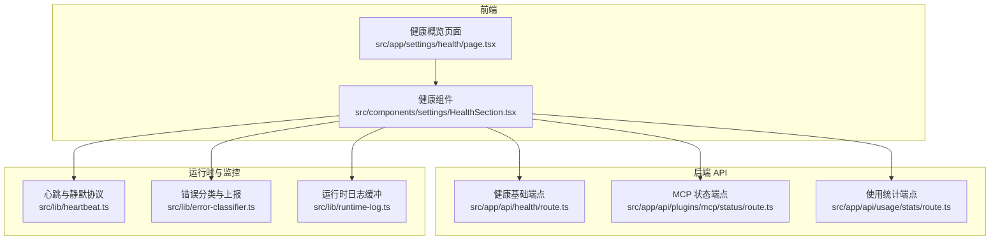
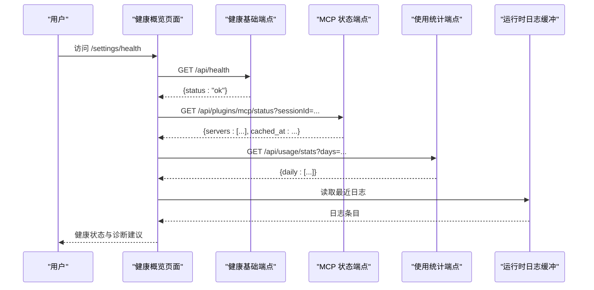
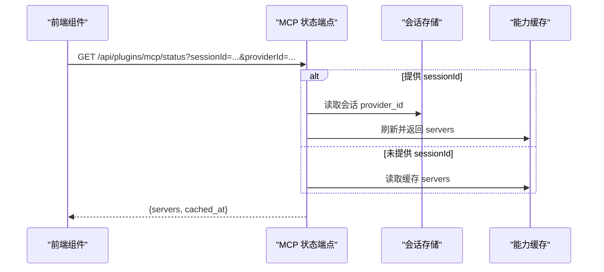
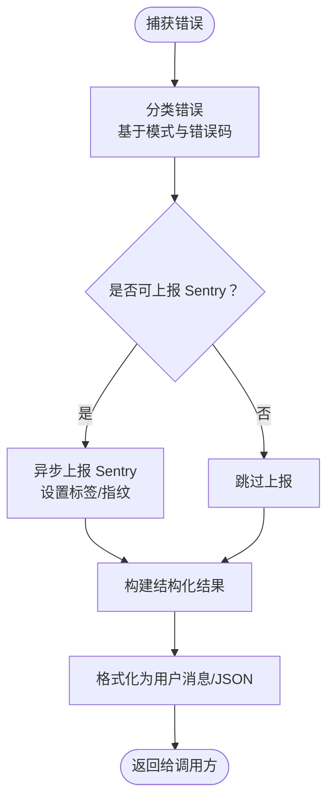
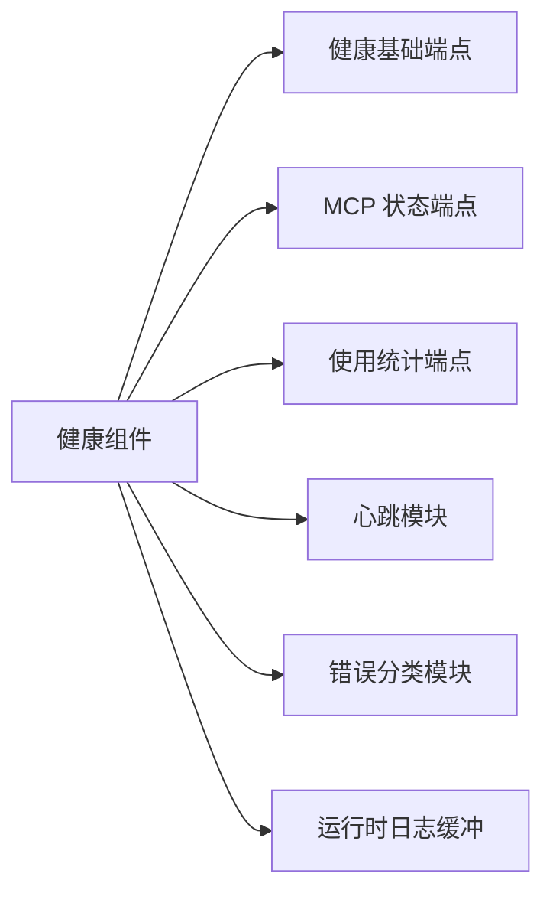

# 健康检查 API

<cite>
**本文引用的文件**
- [src/app/api/health/route.ts](file://src/app/api/health/route.ts)
- [src/components/settings/HealthSection.tsx](file://src/components/settings/HealthSection.tsx)
- [src/app/settings/health/page.tsx](file://src/app/settings/health/page.tsx)
- [src/app/api/plugins/mcp/status/route.ts](file://src/app/api/plugins/mcp/status/route.ts)
- [src/lib/heartbeat.ts](file://src/lib/heartbeat.ts)
- [src/lib/error-classifier.ts](file://src/lib/error-classifier.ts)
- [src/lib/runtime-log.ts](file://src/lib/runtime-log.ts)
- [docs/handover/sentry-error-reporting.md](file://docs/handover/sentry-error-reporting.md)
- [src/app/api/usage/stats/route.ts](file://src/app/api/usage/stats/route.ts)
- [src/components/settings/UsageStatsSection.tsx](file://src/components/settings/UsageStatsSection.tsx)
</cite>

## 目录
1. [简介](#简介)
2. [项目结构](#项目结构)
3. [核心组件](#核心组件)
4. [架构总览](#架构总览)
5. [详细组件分析](#详细组件分析)
6. [依赖关系分析](#依赖关系分析)
7. [性能考量](#性能考量)
8. [故障排查指南](#故障排查指南)
9. [结论](#结论)
10. [附录](#附录)

## 简介
本文件系统化梳理并规范“系统健康检查 API”的设计与实现，覆盖应用状态监控、服务可用性检测、性能指标采集、错误报告与日志收集、异常监控、性能基准与资源使用、负载均衡监控、告警与通知、故障恢复等运维主题。文档以仓库现有实现为基础，结合前端健康概览页面与后端路由，给出统一的接口规范、响应格式、状态码语义与诊断信息说明，并提供最佳实践与运维集成建议。

## 项目结构
围绕健康检查与可观测性的关键文件分布如下：
- 健康检查基础端点：src/app/api/health/route.ts
- 健康概览页面：src/app/settings/health/page.tsx 与 src/components/settings/HealthSection.tsx
- MCP 服务可用性检测：src/app/api/plugins/mcp/status/route.ts
- 心跳与静默协议：src/lib/heartbeat.ts
- 错误分类与上报：src/lib/error-classifier.ts、docs/handover/sentry-error-reporting.md
- 运行时日志缓冲：src/lib/runtime-log.ts
- 使用统计与性能指标：src/app/api/usage/stats/route.ts、src/components/settings/UsageStatsSection.tsx

图表来源
- [src/app/api/health/route.ts:1-6](file://src/app/api/health/route.ts#L1-L6)
- [src/app/settings/health/page.tsx:1-7](file://src/app/settings/health/page.tsx#L1-L7)
- [src/components/settings/HealthSection.tsx:1-468](file://src/components/settings/HealthSection.tsx#L1-L468)
- [src/app/api/plugins/mcp/status/route.ts:1-36](file://src/app/api/plugins/mcp/status/route.ts#L1-L36)
- [src/app/api/usage/stats/route.ts:1-19](file://src/app/api/usage/stats/route.ts#L1-L19)
- [src/lib/heartbeat.ts:1-140](file://src/lib/heartbeat.ts#L1-L140)
- [src/lib/error-classifier.ts:1-532](file://src/lib/error-classifier.ts#L1-L532)
- [src/lib/runtime-log.ts:83-114](file://src/lib/runtime-log.ts#L83-L114)

章节来源
- [src/app/api/health/route.ts:1-6](file://src/app/api/health/route.ts#L1-L6)
- [src/app/settings/health/page.tsx:1-7](file://src/app/settings/health/page.tsx#L1-L7)
- [src/components/settings/HealthSection.tsx:1-468](file://src/components/settings/HealthSection.tsx#L1-L468)
- [src/app/api/plugins/mcp/status/route.ts:1-36](file://src/app/api/plugins/mcp/status/route.ts#L1-L36)
- [src/app/api/usage/stats/route.ts:1-19](file://src/app/api/usage/stats/route.ts#L1-L19)
- [src/lib/heartbeat.ts:1-140](file://src/lib/heartbeat.ts#L1-L140)
- [src/lib/error-classifier.ts:1-532](file://src/lib/error-classifier.ts#L1-L532)
- [src/lib/runtime-log.ts:83-114](file://src/lib/runtime-log.ts#L83-L114)

## 核心组件
- 健康基础端点：提供系统健康状态的最小可用接口，返回统一的健康状态对象。
- 健康概览页面：整合多维度健康数据，形成“日常问题定位”视图，引导用户至具体设置页面进行处置。
- MCP 状态端点：查询并缓存 MCP 服务器可用性，支持按会话刷新或缓存读取。
- 心跳与静默协议：定义心跳内容的静默判定规则，避免重复与无效提示。
- 错误分类与上报：对运行时错误进行分类、格式化与结构化上报，支持 Sentry 上报与 UI 展示。
- 运行时日志缓冲：安全地拦截并缓冲 console 输出，便于诊断与导出。
- 使用统计端点：提供 token 使用统计，辅助性能与成本分析。

章节来源
- [src/app/api/health/route.ts:1-6](file://src/app/api/health/route.ts#L1-L6)
- [src/components/settings/HealthSection.tsx:1-468](file://src/components/settings/HealthSection.tsx#L1-L468)
- [src/app/api/plugins/mcp/status/route.ts:1-36](file://src/app/api/plugins/mcp/status/route.ts#L1-L36)
- [src/lib/heartbeat.ts:1-140](file://src/lib/heartbeat.ts#L1-L140)
- [src/lib/error-classifier.ts:1-532](file://src/lib/error-classifier.ts#L1-L532)
- [src/lib/runtime-log.ts:83-114](file://src/lib/runtime-log.ts#L83-L114)
- [src/app/api/usage/stats/route.ts:1-19](file://src/app/api/usage/stats/route.ts#L1-L19)

## 架构总览
健康检查体系由“前端健康概览 + 后端健康端点 + 运行时监控与错误上报”构成，形成闭环：前端聚合状态，后端提供数据源，运行时负责错误与日志采集，Sentry 负责异常上报与聚合。

图表来源
- [src/app/api/health/route.ts:1-6](file://src/app/api/health/route.ts#L1-L6)
- [src/app/api/plugins/mcp/status/route.ts:1-36](file://src/app/api/plugins/mcp/status/route.ts#L1-L36)
- [src/app/api/usage/stats/route.ts:1-19](file://src/app/api/usage/stats/route.ts#L1-L19)
- [src/lib/runtime-log.ts:83-114](file://src/lib/runtime-log.ts#L83-L114)

## 详细组件分析

### 健康基础端点
- 方法与路径：GET /api/health
- 功能：返回系统健康状态对象，用于容器编排与负载均衡探活。
- 响应格式：
  - 成功：{ status: "ok" }
- 状态码：200
- 典型用途：Kubernetes readiness/liveness 探针、反向代理健康检查。

章节来源
- [src/app/api/health/route.ts:1-6](file://src/app/api/health/route.ts#L1-L6)

### 健康概览页面
- 页面路径：/settings/health
- 组件职责：汇总五大健康维度，生成总体严重级别与导航至对应设置页的入口。
- 健康维度（示例）：
  - 服务商连接：是否存在已配置的 provider
  - 执行引擎/CLI：运行时状态、CLI 可用性与兼容性警告
  - 默认模型有效性：固定模型与当前运行时的兼容性
  - 模型暴露：picker 可见模型数量
  - 助理工作空间：本地协作能力配置状态
- 总体严重级别：ok/warn/error，驱动页面头部状态指示与“需要进一步排查？”提示。

章节来源
- [src/app/settings/health/page.tsx:1-7](file://src/app/settings/health/page.tsx#L1-L7)
- [src/components/settings/HealthSection.tsx:1-468](file://src/components/settings/HealthSection.tsx#L1-L468)

### MCP 服务可用性检测
- 方法与路径：GET /api/plugins/mcp/status
- 查询参数：
  - sessionId：可选，传入则按会话刷新状态；否则读取缓存
  - providerId：可选，显式指定 provider；未提供时从会话解析
- 响应字段：
  - servers：MCP 服务器列表与状态
  - cached_at：缓存时间戳（毫秒），未缓存时为 null
  - error：失败时返回错误字符串
- 缓存策略：按 providerId 缓存，支持按会话刷新
- 典型用途：插件生态与外部 MCP 服务器的可用性巡检

图表来源
- [src/app/api/plugins/mcp/status/route.ts:1-36](file://src/app/api/plugins/mcp/status/route.ts#L1-L36)

章节来源
- [src/app/api/plugins/mcp/status/route.ts:1-36](file://src/app/api/plugins/mcp/status/route.ts#L1-L36)

### 心跳与静默协议
- 协议要点：
  - 心跳内容中包含特定标记时，视为“静默”提示，应忽略或去重
  - 内容长度阈值：超过一定字符数才视为有效提示
  - 时间窗口去重：同一内容在 24 小时内重复出现将被跳过
  - 活跃时段：支持配置开始/结束时间，跨午夜场景
- 适用范围：仅适用于助理工作空间会话的心跳输出

章节来源
- [src/lib/heartbeat.ts:1-140](file://src/lib/heartbeat.ts#L1-L140)

### 错误分类与上报
- 错误分类：基于模式匹配与错误码，将运行时错误归类为若干类别（如认证失败、速率限制、网络不可达、进程崩溃等）
- 结构化输出：包含用户可读消息、修复建议、重试属性、提供商信息与详情
- 上报策略：非开发环境且可上报类别下，异步上报至 Sentry，携带标签与指纹
- UI 展示：支持将分类结果格式化为 SSE 事件或 JSON 字符串

图表来源
- [src/lib/error-classifier.ts:1-532](file://src/lib/error-classifier.ts#L1-L532)
- [docs/handover/sentry-error-reporting.md:52-105](file://docs/handover/sentry-error-reporting.md#L52-L105)

章节来源
- [src/lib/error-classifier.ts:1-532](file://src/lib/error-classifier.ts#L1-L532)
- [docs/handover/sentry-error-reporting.md:52-105](file://docs/handover/sentry-error-reporting.md#L52-L105)

### 运行时日志缓冲
- 功能：拦截 console.error/warn，将输出缓冲到内存数组，支持读取与清空
- 用途：在诊断场景中快速获取最近日志，便于导出与问题定位

章节来源
- [src/lib/runtime-log.ts:83-114](file://src/lib/runtime-log.ts#L83-L114)

### 使用统计与性能指标
- 方法与路径：GET /api/usage/stats
- 查询参数：
  - days：天数，默认 30，范围 1–365
- 响应：包含每日 token 使用统计，前端据此渲染图表
- 用途：评估性能与成本趋势，辅助容量规划与告警阈值设定

章节来源
- [src/app/api/usage/stats/route.ts:1-19](file://src/app/api/usage/stats/route.ts#L1-L19)
- [src/components/settings/UsageStatsSection.tsx:299-508](file://src/components/settings/UsageStatsSection.tsx#L299-L508)

## 依赖关系分析
- 健康概览页面依赖多个后端端点与运行时模块：
  - 健康基础端点：提供系统健康状态
  - MCP 状态端点：提供插件生态可用性
  - 使用统计端点：提供性能与成本数据
  - 心跳模块：指导会话内提示策略
  - 错误分类模块：提供错误诊断与修复建议
  - 运行时日志缓冲：提供诊断日志
- 前后端耦合度低，通过标准 HTTP 接口交互，利于独立演进与扩展

图表来源
- [src/components/settings/HealthSection.tsx:1-468](file://src/components/settings/HealthSection.tsx#L1-L468)
- [src/app/api/health/route.ts:1-6](file://src/app/api/health/route.ts#L1-L6)
- [src/app/api/plugins/mcp/status/route.ts:1-36](file://src/app/api/plugins/mcp/status/route.ts#L1-L36)
- [src/app/api/usage/stats/route.ts:1-19](file://src/app/api/usage/stats/route.ts#L1-L19)
- [src/lib/heartbeat.ts:1-140](file://src/lib/heartbeat.ts#L1-L140)
- [src/lib/error-classifier.ts:1-532](file://src/lib/error-classifier.ts#L1-L532)
- [src/lib/runtime-log.ts:83-114](file://src/lib/runtime-log.ts#L83-L114)

## 性能考量
- 探针开销：健康基础端点为纯内存计算，开销极低，适合高频探活
- 缓存命中：MCP 状态端点支持缓存，减少对上游服务的压力
- 日志缓冲：运行时日志缓冲为内存数组，注意在长期内存占用与导出频率之间的平衡
- 图表渲染：使用统计端点支持天数裁剪，避免一次性传输过多数据

## 故障排查指南
- 健康基础端点返回非 200：检查后端服务状态与中间件配置
- MCP 状态返回 error：检查 providerId 与会话存储，确认缓存是否过期
- 错误分类与上报：
  - 确认 Sentry 初始化与 opt-out 标记文件状态
  - 查看分类器输出的用户消息与修复建议，优先处理高优先级类别
- 运行时日志：
  - 导出最近日志，结合错误分类器输出定位根因
- 使用统计：
  - 检查 days 参数与后端数据库可用性，确认统计准确性

章节来源
- [src/app/api/health/route.ts:1-6](file://src/app/api/health/route.ts#L1-L6)
- [src/app/api/plugins/mcp/status/route.ts:1-36](file://src/app/api/plugins/mcp/status/route.ts#L1-L36)
- [src/lib/error-classifier.ts:1-532](file://src/lib/error-classifier.ts#L1-L532)
- [src/lib/runtime-log.ts:83-114](file://src/lib/runtime-log.ts#L83-L114)
- [src/app/api/usage/stats/route.ts:1-19](file://src/app/api/usage/stats/route.ts#L1-L19)

## 结论
本健康检查 API 体系以最小可用端点为核心，配合前端健康概览与运行时监控模块，形成“可观测—诊断—修复”的闭环。通过标准化的响应格式、清晰的状态码语义与结构化的错误分类，既满足自动化探活需求，又为人工诊断与自助修复提供支撑。建议在生产环境中结合负载均衡健康检查、Sentry 异常聚合与使用统计端点，建立完善的告警与恢复流程。

## 附录

### API 规范速览
- 健康基础端点
  - 方法：GET
  - 路径：/api/health
  - 响应：{ status: "ok" }
  - 状态码：200
- MCP 状态端点
  - 方法：GET
  - 路径：/api/plugins/mcp/status
  - 查询参数：sessionId（可选）、providerId（可选）
  - 响应：{ servers: [...], cached_at: number|null, error: string|null }
  - 状态码：200（成功），500（失败）
- 使用统计端点
  - 方法：GET
  - 路径：/api/usage/stats
  - 查询参数：days（1–365，默认 30）
  - 响应：{ daily: [...] }
  - 状态码：200（成功），500（失败）

章节来源
- [src/app/api/health/route.ts:1-6](file://src/app/api/health/route.ts#L1-L6)
- [src/app/api/plugins/mcp/status/route.ts:1-36](file://src/app/api/plugins/mcp/status/route.ts#L1-L36)
- [src/app/api/usage/stats/route.ts:1-19](file://src/app/api/usage/stats/route.ts#L1-L19)