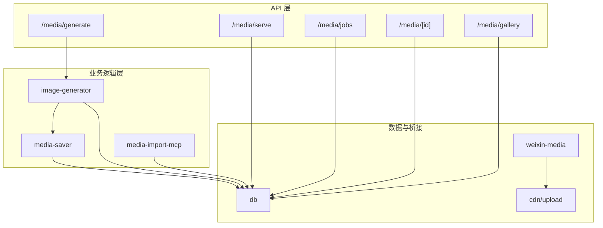
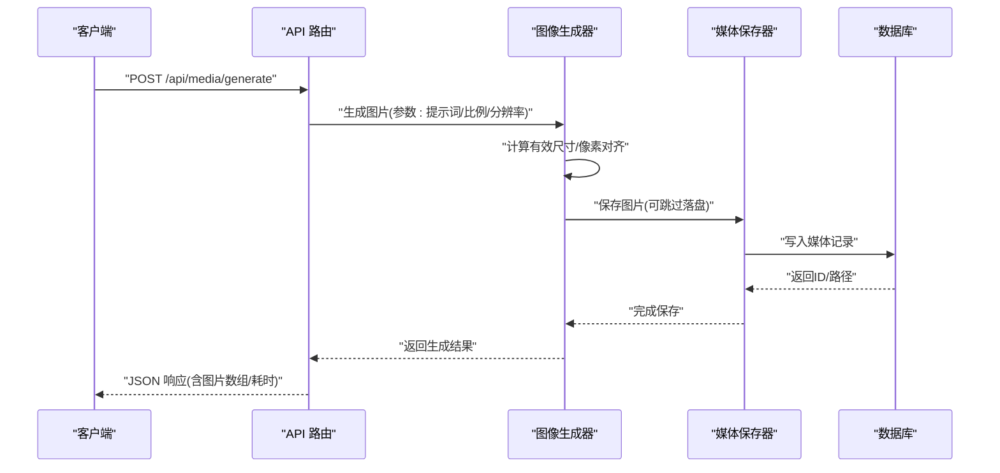
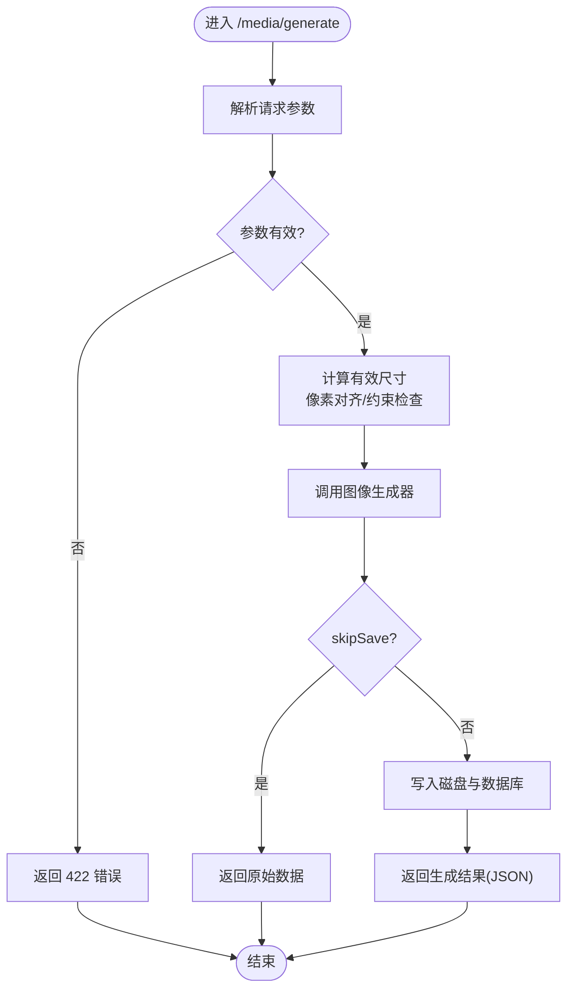
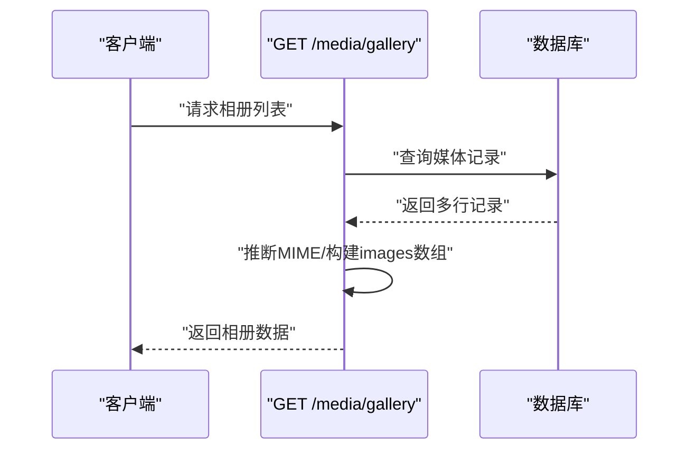
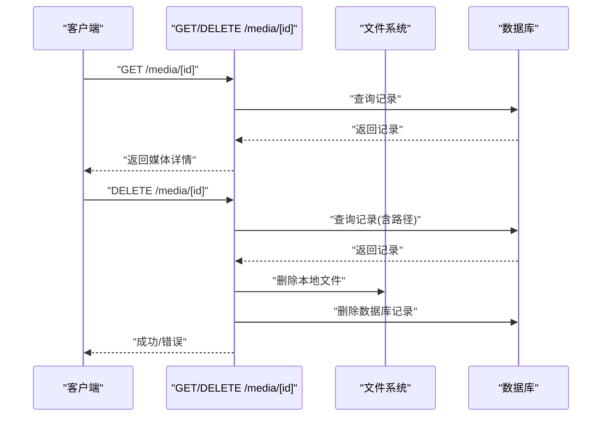
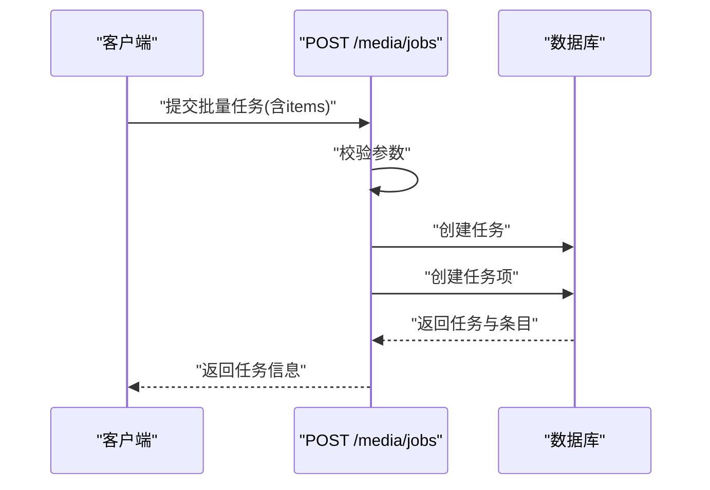
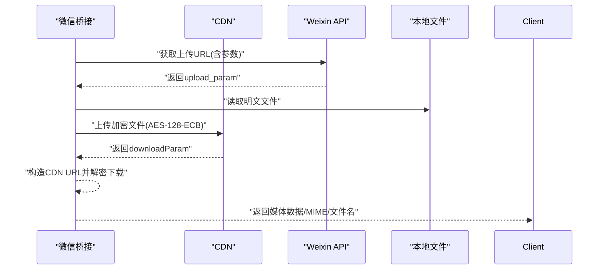
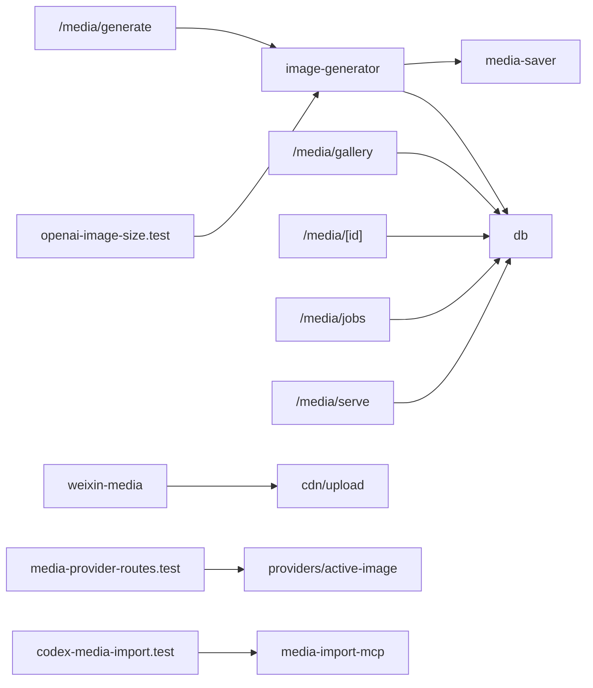

# 媒体 API

<cite>
**本文引用的文件**
- [src/app/api/media/generate/route.ts](file://src/app/api/media/generate/route.ts)
- [src/app/api/media/gallery/route.ts](file://src/app/api/media/gallery/route.ts)
- [src/app/api/media/[id]/route.ts](file://src/app/api/media/[id]/route.ts)
- [src/app/api/media/jobs/route.ts](file://src/app/api/media/jobs/route.ts)
- [src/app/api/media/serve/route.ts](file://src/app/api/media/serve/route.ts)
- [src/lib/image-generator.ts](file://src/lib/image-generator.ts)
- [src/lib/media-saver.ts](file://src/lib/media-saver.ts)
- [src/lib/media-import-mcp.ts](file://src/lib/media-import-mcp.ts)
- [src/lib/db.ts](file://src/lib/db.ts)
- [src/__tests__/unit/openai-image-size.test.ts](file://src/__tests__/unit/openai-image-size.test.ts)
- [src/__tests__/unit/media-provider-routes.test.ts](file://src/__tests__/unit/media-provider-routes.test.ts)
- [src/__tests__/unit/codex-media-import.test.ts](file://src/__tests__/unit/codex-media-import.test.ts)
- [src/app/api/providers/active-image/route.ts](file://src/app/api/providers/active-image/route.ts)
- [public/skills/image-generation.md](file://public/skills/image-generation.md)
- [src/lib/bridge/adapters/weixin/weixin-media.ts](file://src/lib/bridge/adapters/weixin/weixin-media.ts)
- [资料/weixin-openclaw-package/package/src/cdn/upload.ts](file://资料/weixin-openclaw-package/package/src/cdn/upload.ts)
</cite>

## 目录
1. [简介](#简介)
2. [项目结构](#项目结构)
3. [核心组件](#核心组件)
4. [架构总览](#架构总览)
5. [详细组件分析](#详细组件分析)
6. [依赖关系分析](#依赖关系分析)
7. [性能考虑](#性能考虑)
8. [故障排查指南](#故障排查指南)
9. [结论](#结论)
10. [附录](#附录)

## 简介
本文件系统性梳理媒体处理 API，覆盖图片生成、媒体预览、相册管理、批量任务、CDN 上传与下载、以及微信生态中的媒体分享能力。重点说明请求参数、质量设置与输出格式、存储与缓存策略、清理机制、上传/下载/分享规范、媒体类型支持、尺寸限制与格式转换，并给出完整的处理流程与错误处理策略，最后提供性能优化与并发控制的最佳实践。

## 项目结构
媒体相关能力主要分布在以下位置：
- Next.js 路由层：/src/app/api/media 下的各路由（生成、相册、单条、任务、服务）
- 核心业务逻辑：/src/lib 下的图像生成器、媒体保存器、媒体导入 MCP 等
- 测试与约束：单元测试验证尺寸约束、提供商路由校验、导入流程
- 微信生态：桥接适配器与 CDN 上传工具
- 文档与示例：public/skills/image-generation.md 提供技能侧的输入格式示例

图表来源
- [src/app/api/media/generate/route.ts:1-70](file://src/app/api/media/generate/route.ts#L1-L70)
- [src/app/api/media/gallery/route.ts:1-44](file://src/app/api/media/gallery/route.ts#L1-L44)
- [src/app/api/media/[id]/route.ts](file://src/app/api/media/[id]/route.ts#L1-L48)
- [src/app/api/media/jobs/route.ts:45-73](file://src/app/api/media/jobs/route.ts#L45-L73)
- [src/app/api/media/serve/route.ts](file://src/app/api/media/serve/route.ts)
- [src/lib/image-generator.ts:62-376](file://src/lib/image-generator.ts#L62-L376)
- [src/lib/media-saver.ts](file://src/lib/media-saver.ts)
- [src/lib/media-import-mcp.ts](file://src/lib/media-import-mcp.ts)
- [src/lib/db.ts](file://src/lib/db.ts)
- [src/lib/bridge/adapters/weixin/weixin-media.ts:122-156](file://src/lib/bridge/adapters/weixin/weixin-media.ts#L122-L156)
- [资料/weixin-openclaw-package/package/src/cdn/upload.ts:1-110](file://资料/weixin-openclaw-package/package/src/cdn/upload.ts#L1-L110)

章节来源
- [src/app/api/media/generate/route.ts:1-70](file://src/app/api/media/generate/route.ts#L1-L70)
- [src/app/api/media/gallery/route.ts:1-44](file://src/app/api/media/gallery/route.ts#L1-L44)
- [src/app/api/media/[id]/route.ts](file://src/app/api/media/[id]/route.ts#L1-L48)
- [src/app/api/media/jobs/route.ts:45-73](file://src/app/api/media/jobs/route.ts#L45-L73)
- [src/app/api/media/serve/route.ts](file://src/app/api/media/serve/route.ts)
- [src/lib/image-generator.ts:62-376](file://src/lib/image-generator.ts#L62-L376)
- [src/lib/media-saver.ts](file://src/lib/media-saver.ts)
- [src/lib/media-import-mcp.ts](file://src/lib/media-import-mcp.ts)
- [src/lib/db.ts](file://src/lib/db.ts)
- [src/lib/bridge/adapters/weixin/weixin-media.ts:122-156](file://src/lib/bridge/adapters/weixin/weixin-media.ts#L122-L156)
- [资料/weixin-openclaw-package/package/src/cdn/upload.ts:1-110](file://资料/weixin-openclaw-package/package/src/cdn/upload.ts#L1-L110)

## 核心组件
- 图片生成路由：接收请求参数，调用图像生成器，返回生成结果与元信息。
- 相册列表路由：从数据库读取媒体记录，构建响应（含 MIME 类型推断）。
- 单条媒体路由：查询、删除媒体记录及本地文件。
- 批量任务路由：创建任务与任务项，返回任务状态与条目。
- 媒体服务路由：提供媒体文件访问（基于路径或 ID）。
- 图像生成器：计算有效尺寸、执行生成、写入磁盘、持久化到数据库。
- 媒体保存器：统一保存流程（可跳过落盘用于流式场景）。
- 媒体导入 MCP：桥接外部媒体导入，写入数据库并打上媒体标识。
- 数据库：媒体生成记录、任务与任务项、会话关联等。
- 微信媒体适配：下载并解密 CDN 媒体，上传媒体至 CDN 并返回下载参数。
- 尺寸与格式约束：通过测试与映射确保符合平台限制与像素对齐要求。

章节来源
- [src/app/api/media/generate/route.ts:1-70](file://src/app/api/media/generate/route.ts#L1-L70)
- [src/app/api/media/gallery/route.ts:1-44](file://src/app/api/media/gallery/route.ts#L1-L44)
- [src/app/api/media/[id]/route.ts](file://src/app/api/media/[id]/route.ts#L1-L48)
- [src/app/api/media/jobs/route.ts:45-73](file://src/app/api/media/jobs/route.ts#L45-L73)
- [src/app/api/media/serve/route.ts](file://src/app/api/media/serve/route.ts)
- [src/lib/image-generator.ts:62-376](file://src/lib/image-generator.ts#L62-L376)
- [src/lib/media-saver.ts](file://src/lib/media-saver.ts)
- [src/lib/media-import-mcp.ts](file://src/lib/media-import-mcp.ts)
- [src/lib/db.ts](file://src/lib/db.ts)
- [src/lib/bridge/adapters/weixin/weixin-media.ts:122-156](file://src/lib/bridge/adapters/weixin/weixin-media.ts#L122-L156)
- [资料/weixin-openclaw-package/package/src/cdn/upload.ts:1-110](file://资料/weixin-openclaw-package/package/src/cdn/upload.ts#L1-L110)

## 架构总览
媒体处理端到端流程包括：请求进入 API 路由 -> 参数校验与任务创建 -> 调用图像生成器/导入器 -> 写入媒体库 -> 返回结果；同时支持相册查询、单条读取与删除、CDN 加解密与分享。

图表来源
- [src/app/api/media/generate/route.ts:1-70](file://src/app/api/media/generate/route.ts#L1-L70)
- [src/lib/image-generator.ts:62-376](file://src/lib/image-generator.ts#L62-L376)
- [src/lib/media-saver.ts](file://src/lib/media-saver.ts)
- [src/lib/db.ts](file://src/lib/db.ts)

## 详细组件分析

### 图片生成 API
- 请求参数
  - 必填：sessionId（会话关联）
  - 可选：imageSize（分辨率层级）、stylePrompt（风格提示）、batchConfig（批量配置）、items（批量条目）
- 输出格式
  - 返回 JSON，包含生成 ID、模型族、耗时、图片数组（含 MIME 与本地路径）
- 错误处理
  - 无生成物：422，提示更换提示词
  - 其他异常：500，返回错误消息
- 尺寸与质量
  - 基于平台约束与像素对齐规则计算有效尺寸，保证宽高为 16 的倍数且不超过上限
- 存储与缓存
  - 默认写入磁盘与数据库；支持 skipSave 模式仅返回原始数据

图表来源
- [src/app/api/media/generate/route.ts:1-70](file://src/app/api/media/generate/route.ts#L1-L70)
- [src/lib/image-generator.ts:62-376](file://src/lib/image-generator.ts#L62-L376)
- [src/__tests__/unit/openai-image-size.test.ts:1-32](file://src/__tests__/unit/openai-image-size.test.ts#L1-L32)

章节来源
- [src/app/api/media/generate/route.ts:1-70](file://src/app/api/media/generate/route.ts#L1-L70)
- [src/lib/image-generator.ts:62-376](file://src/lib/image-generator.ts#L62-L376)
- [src/__tests__/unit/openai-image-size.test.ts:1-32](file://src/__tests__/unit/openai-image-size.test.ts#L1-L32)

### 相册管理 API
- 列表查询
  - 从数据库读取媒体记录，按类型与 MIME 推断构建响应
  - 支持标签、收藏、会话关联等字段
- 媒体类型与格式
  - 自动根据扩展名推断 MIME（图片/视频/矢量等）
- 分页与过滤
  - 可结合标签、时间范围、类型进行筛选（依据数据库结构）

图表来源
- [src/app/api/media/gallery/route.ts:1-44](file://src/app/api/media/gallery/route.ts#L1-L44)

章节来源
- [src/app/api/media/gallery/route.ts:1-44](file://src/app/api/media/gallery/route.ts#L1-L44)

### 单条媒体操作 API
- 查询
  - 根据 ID 查询媒体记录，不存在则 404
- 删除
  - 先查记录再删除本地文件与数据库记录，失败时返回错误

图表来源
- [src/app/api/media/[id]/route.ts](file://src/app/api/media/[id]/route.ts#L1-L48)

章节来源
- [src/app/api/media/[id]/route.ts](file://src/app/api/media/[id]/route.ts#L1-L48)

### 批量任务 API
- 创建任务
  - 接收 sessionId、docPaths、stylePrompt、batchConfig、items
  - 校验至少一个条目，创建任务与任务项
- 返回
  - 任务对象与创建的条目集合

图表来源
- [src/app/api/media/jobs/route.ts:45-73](file://src/app/api/media/jobs/route.ts#L45-L73)

章节来源
- [src/app/api/media/jobs/route.ts:45-73](file://src/app/api/media/jobs/route.ts#L45-L73)

### 媒体服务 API
- 功能
  - 提供媒体文件访问（基于路径或 ID），内部读取数据库并返回文件内容
- 使用场景
  - 预览、下载、嵌入展示

章节来源
- [src/app/api/media/serve/route.ts](file://src/app/api/media/serve/route.ts)

### 微信媒体导入与分享
- 导入
  - 通过 MCP 导入外部媒体，写入数据库并打上媒体标识
- 下载与解密
  - 从 CDN 基础地址拼接加密参数，下载并解密媒体
- 上传与分享
  - 生成 filekey、AES 密钥与加密后的文件大小，获取上传参数并上传，返回下载参数用于消息发送

图表来源
- [src/lib/bridge/adapters/weixin/weixin-media.ts:122-156](file://src/lib/bridge/adapters/weixin/weixin-media.ts#L122-L156)
- [资料/weixin-openclaw-package/package/src/cdn/upload.ts:1-110](file://资料/weixin-openclaw-package/package/src/cdn/upload.ts#L1-L110)

章节来源
- [src/lib/bridge/adapters/weixin/weixin-media.ts:122-156](file://src/lib/bridge/adapters/weixin/weixin-media.ts#L122-L156)
- [资料/weixin-openclaw-package/package/src/cdn/upload.ts:1-110](file://资料/weixin-openclaw-package/package/src/cdn/upload.ts#L1-L110)

### 媒体类型支持、尺寸限制与格式转换
- 支持类型
  - 图片：JPEG、PNG、WEBP、GIF、SVG、AVIF
  - 视频：MP4、WEBM、MOV、AVI、MKV
- 尺寸与像素对齐
  - 宽高必须为 16 的倍数；最大边长与像素总量受平台限制
- 格式转换
  - 生成器根据目标 MIME 写入对应扩展名文件；测试用例验证约束

章节来源
- [src/app/api/media/gallery/route.ts:24-44](file://src/app/api/media/gallery/route.ts#L24-L44)
- [src/lib/image-generator.ts:62-376](file://src/lib/image-generator.ts#L62-L376)
- [src/__tests__/unit/openai-image-size.test.ts:1-32](file://src/__tests__/unit/openai-image-size.test.ts#L1-L32)

### 存储、缓存与清理机制
- 存储
  - 生成器默认写入媒体目录；媒体保存器负责持久化
- 缓存
  - 通过数据库记录与本地路径实现快速检索；CDN 场景下利用加密参数与 AES 密钥进行安全访问
- 清理
  - 删除接口同时清理本地文件与数据库记录；批量任务完成后可根据策略清理临时资源

章节来源
- [src/lib/image-generator.ts:364-376](file://src/lib/image-generator.ts#L364-L376)
- [src/app/api/media/[id]/route.ts](file://src/app/api/media/[id]/route.ts#L35-L48)
- [src/lib/media-saver.ts](file://src/lib/media-saver.ts)

### 上传、下载与分享规范
- 上传
  - 通过 CDN 工具链进行加密上传，返回 filekey、downloadParam 与 AES 密钥
- 下载
  - 拼接 CDN URL，使用 AES 密钥解密后返回
- 分享
  - 在消息中携带 downloadParam 与 AES 密钥，接收方可直接解密播放/查看

章节来源
- [资料/weixin-openclaw-package/package/src/cdn/upload.ts:1-110](file://资料/weixin-openclaw-package/package/src/cdn/upload.ts#L1-L110)
- [src/lib/bridge/adapters/weixin/weixin-media.ts:122-156](file://src/lib/bridge/adapters/weixin/weixin-media.ts#L122-L156)

## 依赖关系分析
- API 路由依赖数据库与业务逻辑模块
- 图像生成器依赖媒体保存器与数据库
- 微信桥接依赖 CDN 上传工具与 Weixin API
- 单元测试覆盖尺寸约束、提供商路由校验与导入流程

图表来源
- [src/app/api/media/generate/route.ts:1-70](file://src/app/api/media/generate/route.ts#L1-L70)
- [src/app/api/media/gallery/route.ts:1-44](file://src/app/api/media/gallery/route.ts#L1-L44)
- [src/app/api/media/[id]/route.ts](file://src/app/api/media/[id]/route.ts#L1-L48)
- [src/app/api/media/jobs/route.ts:45-73](file://src/app/api/media/jobs/route.ts#L45-L73)
- [src/app/api/media/serve/route.ts](file://src/app/api/media/serve/route.ts)
- [src/lib/image-generator.ts:62-376](file://src/lib/image-generator.ts#L62-L376)
- [src/lib/media-saver.ts](file://src/lib/media-saver.ts)
- [src/lib/db.ts](file://src/lib/db.ts)
- [src/lib/bridge/adapters/weixin/weixin-media.ts:122-156](file://src/lib/bridge/adapters/weixin/weixin-media.ts#L122-L156)
- [资料/weixin-openclaw-package/package/src/cdn/upload.ts:1-110](file://资料/weixin-openclaw-package/package/src/cdn/upload.ts#L1-L110)
- [src/__tests__/unit/openai-image-size.test.ts:1-32](file://src/__tests__/unit/openai-image-size.test.ts#L1-L32)
- [src/__tests__/unit/media-provider-routes.test.ts:30-65](file://src/__tests__/unit/media-provider-routes.test.ts#L30-L65)
- [src/__tests__/unit/codex-media-import.test.ts:1-312](file://src/__tests__/unit/codex-media-import.test.ts#L1-L312)
- [src/app/api/providers/active-image/route.ts](file://src/app/api/providers/active-image/route.ts)

章节来源
- [src/app/api/media/generate/route.ts:1-70](file://src/app/api/media/generate/route.ts#L1-L70)
- [src/lib/image-generator.ts:62-376](file://src/lib/image-generator.ts#L62-L376)
- [src/lib/media-saver.ts](file://src/lib/media-saver.ts)
- [src/lib/db.ts](file://src/lib/db.ts)
- [src/lib/bridge/adapters/weixin/weixin-media.ts:122-156](file://src/lib/bridge/adapters/weixin/weixin-media.ts#L122-L156)
- [资料/weixin-openclaw-package/package/src/cdn/upload.ts:1-110](file://资料/weixin-openclaw-package/package/src/cdn/upload.ts#L1-L110)
- [src/__tests__/unit/openai-image-size.test.ts:1-32](file://src/__tests__/unit/openai-image-size.test.ts#L1-L32)
- [src/__tests__/unit/media-provider-routes.test.ts:30-65](file://src/__tests__/unit/media-provider-routes.test.ts#L30-L65)
- [src/__tests__/unit/codex-media-import.test.ts:1-312](file://src/__tests__/unit/codex-media-import.test.ts#L1-L312)
- [src/app/api/providers/active-image/route.ts](file://src/app/api/providers/active-image/route.ts)

## 性能考虑
- 并发控制
  - 生成器内置最大重试次数与超时控制，避免长时间阻塞
  - 批量任务采用分批创建与异步处理，降低峰值压力
- I/O 优化
  - skipSave 模式减少磁盘写入，适合流式传输与中间态处理
  - CDN 加密上传减少明文传输风险，提高吞吐
- 缓存策略
  - 数据库索引与路径直读提升查询效率；CDN 参数复用减少重复计算
- 资源清理
  - 及时删除临时文件与无效记录，防止磁盘膨胀

章节来源
- [src/lib/image-generator.ts:342-348](file://src/lib/image-generator.ts#L342-L348)
- [src/app/api/media/jobs/route.ts:45-73](file://src/app/api/media/jobs/route.ts#L45-L73)
- [资料/weixin-openclaw-package/package/src/cdn/upload.ts:1-110](file://资料/weixin-openclaw-package/package/src/cdn/upload.ts#L1-L110)

## 故障排查指南
- 生成失败
  - 无生成物：检查提示词是否合理，更换提示词后重试
  - 通用异常：查看日志定位具体错误并修正参数
- 相册为空
  - 确认数据库中是否存在媒体记录；检查 MIME 推断与扩展名
- 删除失败
  - 确认记录存在且本地文件路径正确；检查权限与磁盘空间
- 批量任务异常
  - 校验 items 是否为空；确认 sessionId、stylePrompt、batchConfig 合法
- 微信分享问题
  - 确认 downloadParam 与 AES 密钥匹配；检查 CDN URL 与网络连通性

章节来源
- [src/app/api/media/generate/route.ts:54-70](file://src/app/api/media/generate/route.ts#L54-L70)
- [src/app/api/media/gallery/route.ts:24-44](file://src/app/api/media/gallery/route.ts#L24-L44)
- [src/app/api/media/[id]/route.ts](file://src/app/api/media/[id]/route.ts#L35-L48)
- [src/app/api/media/jobs/route.ts:45-73](file://src/app/api/media/jobs/route.ts#L45-L73)
- [src/lib/bridge/adapters/weixin/weixin-media.ts:122-156](file://src/lib/bridge/adapters/weixin/weixin-media.ts#L122-L156)

## 结论
该媒体 API 体系以清晰的路由分层与职责划分，结合严格的尺寸与格式约束、完善的存储与清理机制、以及微信生态下的加解密与分享能力，实现了从生成、入库、查询到分享的全链路闭环。建议在生产环境中配合并发控制与缓存策略，持续监控生成耗时与磁盘占用，确保稳定与高性能。

## 附录

### API 规范摘要
- 图片生成
  - 方法：POST
  - 路径：/api/media/generate
  - 请求体：sessionId（必填），imageSize（可选），stylePrompt（可选），batchConfig（可选），items（可选）
  - 响应：生成 ID、模型族、耗时、图片数组（含 MIME 与本地路径）
- 相册列表
  - 方法：GET
  - 路径：/api/media/gallery
  - 响应：媒体记录数组（含类型、MIME、标签、收藏、会话等）
- 单条媒体
  - 方法：GET/DELETE
  - 路径：/api/media/[id]
  - 响应：GET 返回媒体详情；DELETE 成功或错误
- 批量任务
  - 方法：POST
  - 路径：/api/media/jobs
  - 请求体：sessionId、docPaths、stylePrompt、batchConfig、items（至少一项）
  - 响应：任务对象与创建的条目集合
- 媒体服务
  - 方法：GET
  - 路径：/api/media/serve
  - 响应：媒体文件内容（基于路径或 ID）

章节来源
- [src/app/api/media/generate/route.ts:1-70](file://src/app/api/media/generate/route.ts#L1-L70)
- [src/app/api/media/gallery/route.ts:1-44](file://src/app/api/media/gallery/route.ts#L1-L44)
- [src/app/api/media/[id]/route.ts](file://src/app/api/media/[id]/route.ts#L1-L48)
- [src/app/api/media/jobs/route.ts:45-73](file://src/app/api/media/jobs/route.ts#L45-L73)
- [src/app/api/media/serve/route.ts](file://src/app/api/media/serve/route.ts)