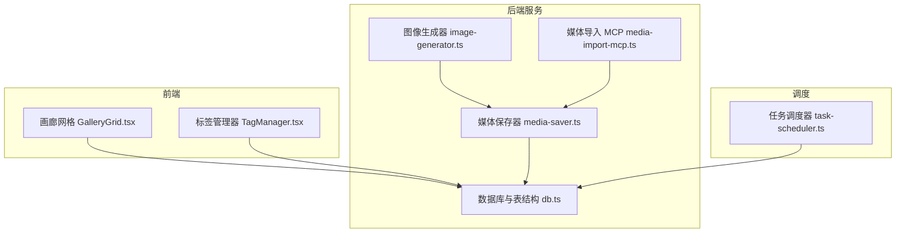
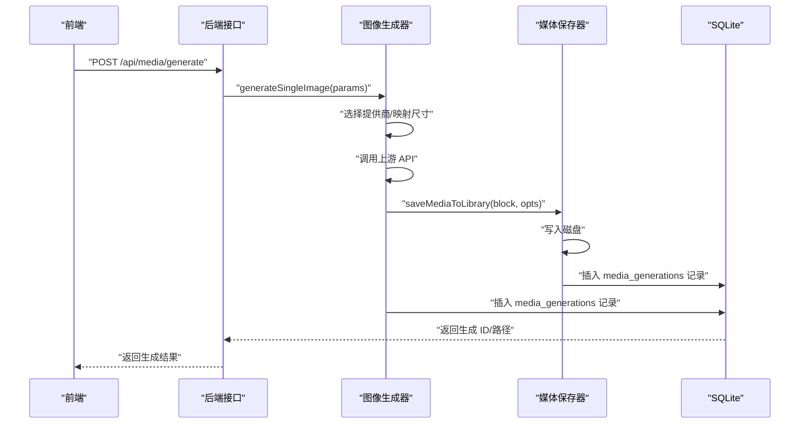
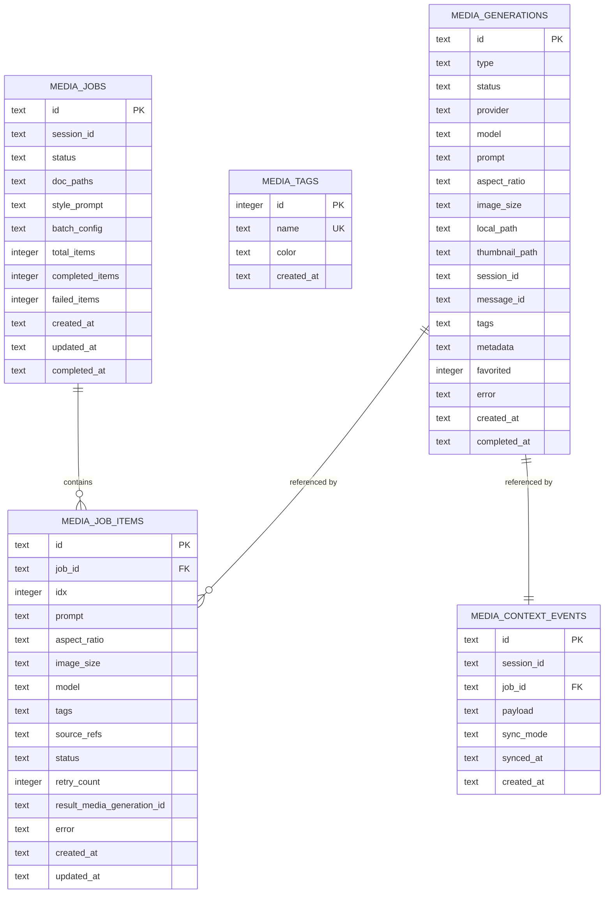
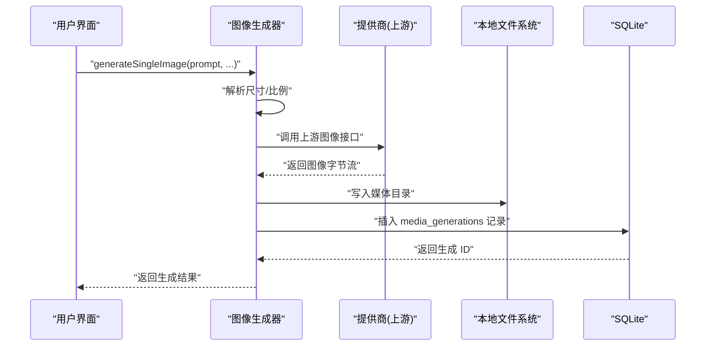
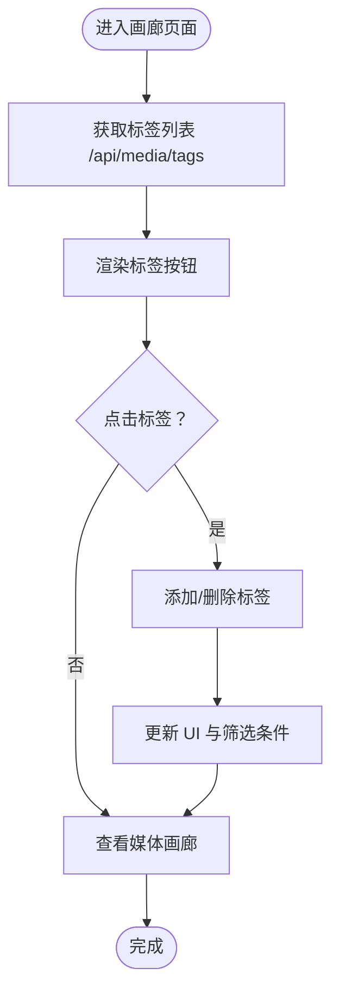
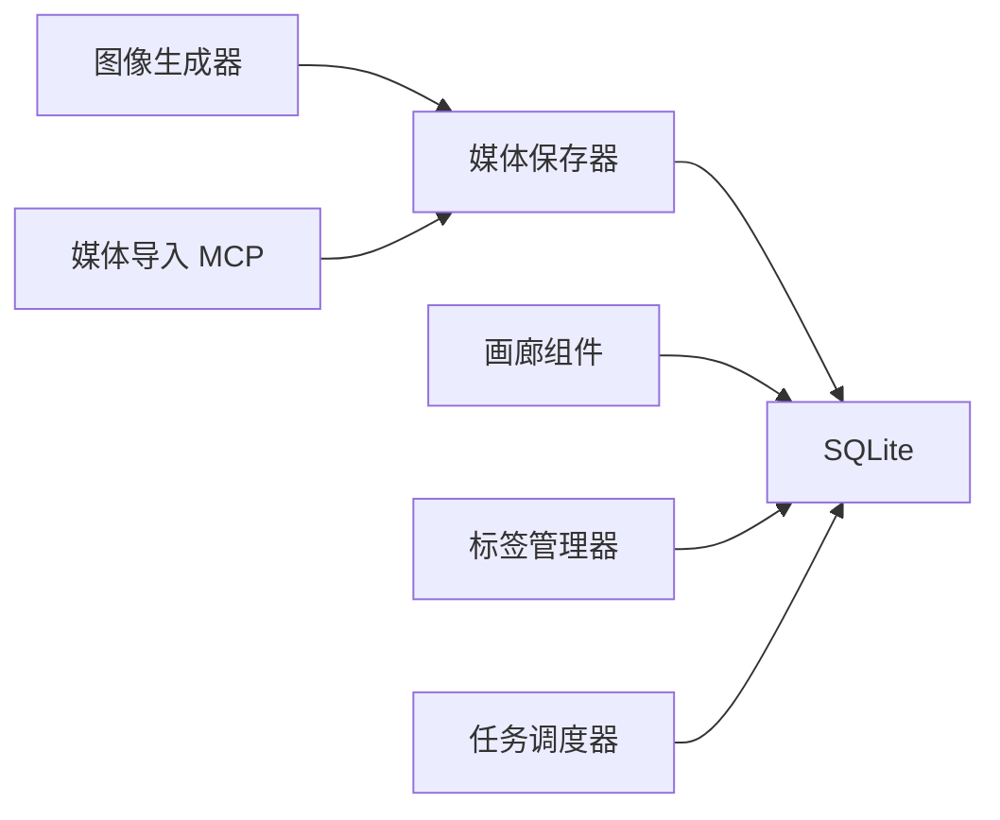

# 媒体 API

<cite>
**本文引用的文件**
- [媒体保存器 media-saver.ts](file://src/lib/media-saver.ts)
- [媒体导入 MCP media-import-mcp.ts](file://src/lib/media-import-mcp.ts)
- [图像生成器 image-generator.ts](file://src/lib/image-generator.ts)
- [数据库与表结构 db.ts](file://src/lib/db.ts)
- [画廊组件 GalleryGrid.tsx](file://src/components/gallery/GalleryGrid.tsx)
- [标签管理器 TagManager.tsx](file://src/components/gallery/TagManager.tsx)
- [任务调度器 task-scheduler.ts](file://src/lib/task-scheduler.ts)
</cite>

## 目录
1. [简介](#简介)
2. [项目结构](#项目结构)
3. [核心组件](#核心组件)
4. [架构总览](#架构总览)
5. [详细组件分析](#详细组件分析)
6. [依赖关系分析](#依赖关系分析)
7. [性能考量](#性能考量)
8. [故障排查指南](#故障排查指南)
9. [结论](#结论)
10. [附录](#附录)

## 简介
本文件为 CodePilot 媒体 API 的权威参考文档，覆盖媒体文件生成、画廊管理、标签操作、作业调度等端点的完整规范。内容包括：
- HTTP 方法、URL 模式、请求/响应模式、认证要求
- 实际请求/响应示例路径（以代码片段路径代替具体文本）
- 图像生成流程、批量任务管理、媒体文件浏览、标签系统
- 错误处理策略与媒体处理最佳实践

## 项目结构
媒体相关能力由以下模块协同实现：
- 后端服务层：媒体导入（MCP 工具）、图像生成、SQLite 数据持久化
- 前端展示层：画廊网格、标签管理器
- 调度层：定时任务调度器，支持一次性与周期性任务

图表来源
- [图像生成器 image-generator.ts:271-451](file://src/lib/image-generator.ts#L271-L451)
- [媒体导入 MCP media-import-mcp.ts:40-122](file://src/lib/media-import-mcp.ts#L40-L122)
- [媒体保存器 media-saver.ts:94-161](file://src/lib/media-saver.ts#L94-L161)
- [数据库与表结构 db.ts:152-229](file://src/lib/db.ts#L152-L229)
- [画廊组件 GalleryGrid.tsx:25-35](file://src/components/gallery/GalleryGrid.tsx#L25-L35)
- [标签管理器 TagManager.tsx:167-213](file://src/components/gallery/TagManager.tsx#L167-L213)
- [任务调度器 task-scheduler.ts:57-131](file://src/lib/task-scheduler.ts#L57-L131)

章节来源
- [图像生成器 image-generator.ts:1-455](file://src/lib/image-generator.ts#L1-L455)
- [媒体导入 MCP media-import-mcp.ts:1-123](file://src/lib/media-import-mcp.ts#L1-L123)
- [媒体保存器 media-saver.ts:1-162](file://src/lib/media-saver.ts#L1-L162)
- [数据库与表结构 db.ts:152-229](file://src/lib/db.ts#L152-L229)
- [画廊组件 GalleryGrid.tsx:1-111](file://src/components/gallery/GalleryGrid.tsx#L1-L111)
- [标签管理器 TagManager.tsx:1-214](file://src/components/gallery/TagManager.tsx#L1-L214)
- [任务调度器 task-scheduler.ts:1-526](file://src/lib/task-scheduler.ts#L1-L526)

## 核心组件
- 媒体保存器：负责将 Base64 或本地文件导入媒体库，写入磁盘并记录数据库条目
- 媒体导入 MCP：通过 Claude Agent SDK 提供 MCP 工具，用于将已存在的本地媒体文件导入库并内联显示
- 图像生成器：选择合适的图像提供商（Gemini/OpenAI），调用上游 API，保存结果并记录元数据
- 画廊组件：渲染媒体缩略图、视频封面、收藏标记与多图计数
- 标签管理器：提供标签列表、添加/删除、切换选中状态的交互与 API 调用
- 任务调度器：轮询 SQLite 中待执行的任务，执行并记录运行日志，支持指数退避与自动禁用

章节来源
- [媒体保存器 media-saver.ts:94-161](file://src/lib/media-saver.ts#L94-L161)
- [媒体导入 MCP media-import-mcp.ts:40-122](file://src/lib/media-import-mcp.ts#L40-L122)
- [图像生成器 image-generator.ts:271-451](file://src/lib/image-generator.ts#L271-L451)
- [画廊组件 GalleryGrid.tsx:25-35](file://src/components/gallery/GalleryGrid.tsx#L25-L35)
- [标签管理器 TagManager.tsx:167-213](file://src/components/gallery/TagManager.tsx#L167-L213)
- [任务调度器 task-scheduler.ts:57-131](file://src/lib/task-scheduler.ts#L57-L131)

## 架构总览
媒体 API 的关键流程包括：
- 图像生成：前端触发或 MCP 触发 → 选择提供商 → 调用上游 API → 写入本地媒体目录 → 记录数据库 → 返回生成结果
- 媒体导入：MCP 工具调用 → 解析文件路径 → 复制到媒体目录 → 写入数据库 → 返回媒体信息
- 画廊浏览：前端发起请求 → 查询数据库 → 渲染缩略图与元数据
- 标签管理：前端发起请求 → 对标签表进行增删查改
- 任务调度：定时轮询 → 执行任务 → 记录日志 → 通知与消息注入

图表来源
- [图像生成器 image-generator.ts:271-451](file://src/lib/image-generator.ts#L271-L451)
- [媒体保存器 media-saver.ts:94-117](file://src/lib/media-saver.ts#L94-L117)
- [数据库与表结构 db.ts:152-171](file://src/lib/db.ts#L152-L171)

## 详细组件分析

### 媒体生成与导入端点规范
- 端点：POST /api/media/generate
  - 请求体字段
    - prompt: 字符串，必填
    - model: 字符串，可选
    - aspectRatio: 字符串，如 "1:1"，可选
    - imageSize: 字符串，如 "1K"/"2K"/"4K"，可选
    - referenceImages: 数组，元素含 mimeType 与 data（Base64），可选
    - referenceImagePaths: 字符串数组，相对/绝对路径，可选
    - sessionId: 字符串，会话 ID，可选
    - cwd: 字符串，工作目录，可选
  - 成功响应：包含 mediaGenerationId、images（每项含 mimeType 与 localPath）、耗时、模型与家族
  - 失败响应：包含错误信息
  - 示例路径
    - [请求体字段定义:13-28](file://src/lib/image-generator.ts#L13-L28)
    - [成功响应结构:30-38](file://src/lib/image-generator.ts#L30-L38)
    - [生成主流程:271-451](file://src/lib/image-generator.ts#L271-L451)

- 端点：POST /api/media/import（MCP 替代方案）
  - 说明：推荐使用 MCP 工具 codepilot_import_media，避免直接 HTTP 调用
  - 请求体字段
    - filePath: 字符串，必填（绝对或相对路径）
    - title/prompt/source/model/resolution/aspectRatio/tags: 可选
  - 成功响应：包含导入成功的媒体 ID 与本地路径
  - 失败响应：包含错误信息
  - 示例路径
    - [MCP 工具定义与调用:44-119](file://src/lib/media-import-mcp.ts#L44-L119)

- 端点：GET /api/media/serve
  - 用途：按本地路径提供媒体文件（用于画廊缩略图）
  - 查询参数
    - path: 字符串，必填（本地媒体文件路径）
  - 成功响应：二进制流（对应 MIME 类型）
  - 示例路径
    - [缩略图 URL 生成:25-35](file://src/components/gallery/GalleryGrid.tsx#L25-L35)

章节来源
- [图像生成器 image-generator.ts:13-451](file://src/lib/image-generator.ts#L13-L451)
- [媒体导入 MCP media-import-mcp.ts:44-119](file://src/lib/media-import-mcp.ts#L44-L119)
- [画廊组件 GalleryGrid.tsx:25-35](file://src/components/gallery/GalleryGrid.tsx#L25-L35)

### 画廊管理端点规范
- 端点：GET /api/media/gallery
  - 查询参数
    - sessionId: 字符串，可选，按会话过滤
    - tags: 字符串数组，可选，按标签过滤
    - type: 字符串，可选，"image"/"video"/"audio"
    - limit: 整数，可选，默认 50
    - offset: 整数，可选，默认 0
  - 成功响应：包含媒体项数组，每项含 id、prompt、images、type、tags、created_at 等
  - 示例路径
    - [前端调用示例:25-35](file://src/components/gallery/GalleryGrid.tsx#L25-L35)

- 端点：GET /api/media/serve
  - 用途：提供媒体文件下载（与画廊缩略图一致）
  - 查询参数
    - path: 字符串，必填
  - 成功响应：二进制流
  - 示例路径
    - [缩略图 URL 生成:25-35](file://src/components/gallery/GalleryGrid.tsx#L25-L35)

章节来源
- [画廊组件 GalleryGrid.tsx:25-35](file://src/components/gallery/GalleryGrid.tsx#L25-L35)

### 标签操作端点规范
- 端点：GET /api/media/tags
  - 成功响应：包含 tags 数组，每项含 id、name、color
  - 示例路径
    - [标签列表获取:167-177](file://src/components/gallery/TagManager.tsx#L167-L177)

- 端点：POST /api/media/tags
  - 请求体字段
    - name: 字符串，必填
    - color: 字符串，可选
  - 成功响应：新增标签对象
  - 示例路径
    - [添加标签:183-199](file://src/components/gallery/TagManager.tsx#L183-L199)

- 端点：DELETE /api/media/tags/:id
  - 成功响应：空
  - 示例路径
    - [删除标签:201-210](file://src/components/gallery/TagManager.tsx#L201-L210)

章节来源
- [标签管理器 TagManager.tsx:167-213](file://src/components/gallery/TagManager.tsx#L167-L213)

### 作业调度端点规范
- 端点：GET /api/tasks/scheduled
  - 查询参数
    - status: 字符串，可选，过滤状态
    - schedule_type: 字符串，可选，过滤类型
  - 成功响应：包含任务数组，每项含 id、name、schedule_type、schedule_value、status、last_run、next_run 等
  - 示例路径
    - [调度轮询与查询:57-66](file://src/lib/task-scheduler.ts#L57-L66)

- 端点：POST /api/tasks/scheduled
  - 请求体字段
    - name: 字符串，必填
    - schedule_type: 字符串，"once"/"interval"/"cron"，必填
    - schedule_value: 字符串，必填（如 "30m"、"0 9 * * *"）
    - prompt: 字符串，必填
    - notify_on_complete: 布尔，可选
    - session_id: 字符串，可选
  - 成功响应：新建任务对象
  - 示例路径
    - [任务创建与调度:145-293](file://src/lib/task-scheduler.ts#L145-L293)

- 端点：PATCH /api/tasks/scheduled/:id
  - 请求体字段
    - status: 字符串，"active"/"paused"/"disabled"
    - schedule_type/schedule_value: 可更新
  - 成功响应：更新后的任务对象
  - 示例路径
    - [任务状态更新:145-293](file://src/lib/task-scheduler.ts#L145-L293)

- 端点：DELETE /api/tasks/scheduled/:id
  - 成功响应：空
  - 示例路径
    - [任务删除:145-293](file://src/lib/task-scheduler.ts#L145-L293)

章节来源
- [任务调度器 task-scheduler.ts:57-293](file://src/lib/task-scheduler.ts#L57-L293)

### 数据模型与存储
媒体相关的核心表：
- media_generations：记录单次媒体生成（图像/视频/音频）
- media_tags：标签表
- media_jobs / media_job_items：批量任务与任务项
- media_context_events：上下文事件

图表来源
- [数据库与表结构 db.ts:152-229](file://src/lib/db.ts#L152-L229)

章节来源
- [数据库与表结构 db.ts:152-229](file://src/lib/db.ts#L152-L229)

### 图像生成流程（端到端）

图表来源
- [图像生成器 image-generator.ts:271-451](file://src/lib/image-generator.ts#L271-L451)

章节来源
- [图像生成器 image-generator.ts:271-451](file://src/lib/image-generator.ts#L271-L451)

### 标签系统（前端交互）

图表来源
- [标签管理器 TagManager.tsx:167-213](file://src/components/gallery/TagManager.tsx#L167-L213)

章节来源
- [标签管理器 TagManager.tsx:167-213](file://src/components/gallery/TagManager.tsx#L167-L213)

## 依赖关系分析
- 组件耦合
  - 图像生成器依赖媒体保存器与数据库
  - 媒体导入 MCP 依赖媒体保存器
  - 画廊与标签组件依赖数据库查询
  - 任务调度器依赖数据库读写与通知模块
- 外部依赖
  - 上游图像提供商（Gemini/OpenAI）
  - SQLite（better-sqlite3）

图表来源
- [图像生成器 image-generator.ts:271-451](file://src/lib/image-generator.ts#L271-L451)
- [媒体导入 MCP media-import-mcp.ts:40-122](file://src/lib/media-import-mcp.ts#L40-L122)
- [媒体保存器 media-saver.ts:94-161](file://src/lib/media-saver.ts#L94-L161)
- [数据库与表结构 db.ts:152-229](file://src/lib/db.ts#L152-L229)
- [画廊组件 GalleryGrid.tsx:25-35](file://src/components/gallery/GalleryGrid.tsx#L25-L35)
- [标签管理器 TagManager.tsx:167-213](file://src/components/gallery/TagManager.tsx#L167-L213)
- [任务调度器 task-scheduler.ts:57-131](file://src/lib/task-scheduler.ts#L57-L131)

章节来源
- [图像生成器 image-generator.ts:271-451](file://src/lib/image-generator.ts#L271-L451)
- [媒体导入 MCP media-import-mcp.ts:40-122](file://src/lib/media-import-mcp.ts#L40-L122)
- [媒体保存器 media-saver.ts:94-161](file://src/lib/media-saver.ts#L94-L161)
- [数据库与表结构 db.ts:152-229](file://src/lib/db.ts#L152-L229)
- [画廊组件 GalleryGrid.tsx:25-35](file://src/components/gallery/GalleryGrid.tsx#L25-L35)
- [标签管理器 TagManager.tsx:167-213](file://src/components/gallery/TagManager.tsx#L167-L213)
- [任务调度器 task-scheduler.ts:57-131](file://src/lib/task-scheduler.ts#L57-L131)

## 性能考量
- 图像生成
  - 尺寸与比例约束：遵循上游 API 的像素预算与步长限制，避免无效重试
  - 超时控制：默认超时 300 秒，必要时传入 AbortSignal
  - 项目目录复制：仅在提供 sessionId 时复制到项目目录，减少 IO
- 媒体导入
  - 支持相对路径解析（基于 cwd），确保跨会话一致性
  - 批量导入时建议合并元数据（prompt、model、resolution、aspectRatio、tags）
- 画廊渲染
  - 使用懒加载与预加载 metadata，优先视频封面占位
- 标签管理
  - 预设颜色与紧凑样式，提升交互效率
- 任务调度
  - 10 秒轮询间隔，指数退避（30s → 1m → 5m → 15m），最多连续失败 10 次自动禁用
  - 一次性任务错过执行时的恢复机制

[本节为通用指导，无需特定文件引用]

## 故障排查指南
- 无图像提供商配置
  - 现象：抛出“未配置图像提供商”错误
  - 排查：在设置中添加 Gemini Image 或 OpenAI Image 提供商
  - 参考路径
    - [提供商选择逻辑:217-265](file://src/lib/image-generator.ts#L217-L265)

- 导入文件不存在
  - 现象：抛出“文件不存在”错误
  - 排查：确认 filePath 是否存在；相对路径需结合 cwd
  - 参考路径
    - [导入文件校验:134-136](file://src/lib/media-saver.ts#L134-L136)

- 任务执行失败
  - 现象：任务状态变为 error，记录 last_error，应用指数退避
  - 排查：检查凭据、网络与上游服务可用性；必要时手动启用任务
  - 参考路径
    - [任务执行与回退:145-293](file://src/lib/task-scheduler.ts#L145-L293)

- 画廊无法显示媒体
  - 现象：缩略图空白或视频不播放
  - 排查：确认 /api/media/serve 的 path 参数正确；检查 MIME 类型与本地路径
  - 参考路径
    - [缩略图 URL 生成:25-35](file://src/components/gallery/GalleryGrid.tsx#L25-L35)

章节来源
- [图像生成器 image-generator.ts:217-265](file://src/lib/image-generator.ts#L217-L265)
- [媒体保存器 media-saver.ts:134-136](file://src/lib/media-saver.ts#L134-L136)
- [任务调度器 task-scheduler.ts:145-293](file://src/lib/task-scheduler.ts#L145-L293)
- [画廊组件 GalleryGrid.tsx:25-35](file://src/components/gallery/GalleryGrid.tsx#L25-L35)

## 结论
本文档提供了 CodePilot 媒体 API 的端到端规范与实现要点，涵盖生成、导入、浏览、标签与调度等核心能力。建议在生产环境中：
- 优先使用 MCP 工具导入媒体，避免直接 HTTP 调用
- 合理设置图像尺寸与比例，遵守上游 API 限制
- 利用标签与筛选优化画廊体验
- 通过任务调度器自动化重复性媒体任务，并关注失败回退策略

[本节为总结，无需特定文件引用]

## 附录
- 认证要求
  - 当前仓库未发现全局认证中间件；若部署于受保护环境，请在网关或反向代理层统一鉴权
- 最佳实践
  - 生成与导入均写入本地媒体目录并记录数据库，便于后续检索与复用
  - 批量任务应明确通知策略与会话绑定，确保结果可追溯
  - 画廊缩略图优先使用 /api/media/serve，避免直接暴露文件系统路径

[本节为通用指导，无需特定文件引用]