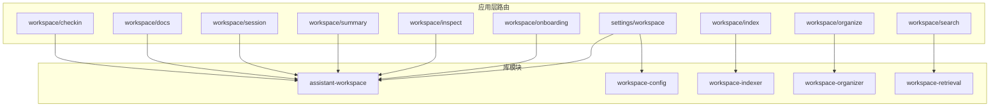
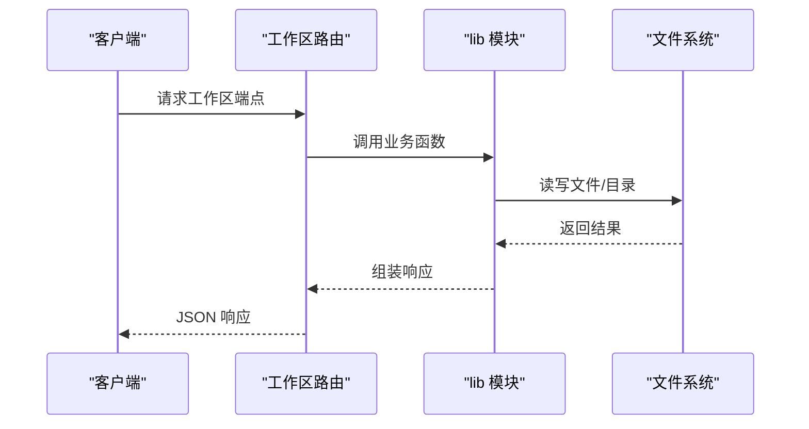
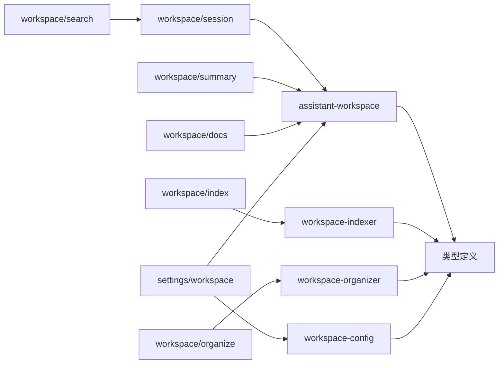

# 工作区 API

<cite>
**本文档引用的文件**
- [src/app/api/workspace/checkin/route.ts](file://src/app/api/workspace/checkin/route.ts)
- [src/app/api/workspace/docs/route.ts](file://src/app/api/workspace/docs/route.ts)
- [src/app/api/workspace/session/route.ts](file://src/app/api/workspace/session/route.ts)
- [src/app/api/workspace/summary/route.ts](file://src/app/api/workspace/summary/route.ts)
- [src/app/api/workspace/index/route.ts](file://src/app/api/workspace/index/route.ts)
- [src/app/api/workspace/inspect/route.ts](file://src/app/api/workspace/inspect/route.ts)
- [src/app/api/workspace/search/route.ts](file://src/app/api/workspace/search/route.ts)
- [src/app/api/workspace/organize/route.ts](file://src/app/api/workspace/organize/route.ts)
- [src/app/api/workspace/onboarding/route.ts](file://src/app/api/workspace/onboarding/route.ts)
- [src/app/api/settings/workspace/route.ts](file://src/app/api/settings/workspace/route.ts)
- [src/lib/assistant-workspace.ts](file://src/lib/assistant-workspace.ts)
- [src/lib/workspace-config.ts](file://src/lib/workspace-config.ts)
- [src/lib/workspace-indexer.ts](file://src/lib/workspace-indexer.ts)
- [src/lib/workspace-organizer.ts](file://src/lib/workspace-organizer.ts)
- [src/lib/workspace-retrieval.ts](file://src/lib/workspace-retrieval.ts)
</cite>

## 目录
1. [简介](#简介)
2. [项目结构](#项目结构)
3. [核心组件](#核心组件)
4. [架构总览](#架构总览)
5. [详细组件分析](#详细组件分析)
6. [依赖关系分析](#依赖关系分析)
7. [性能考量](#性能考量)
8. [故障排查指南](#故障排查指南)
9. [结论](#结论)
10. [附录](#附录)

## 简介
本文件为 CodePilot 工作区 API 的权威参考文档，覆盖工作区检查、文档管理、会话操作、摘要生成、索引与检索、工作区配置与校验、文件整理与归档等端点的完整规范。内容包括：
- HTTP 方法、URL 模式、请求/响应结构、认证要求
- 实际请求/响应示例路径
- 工作区配置管理、文档索引机制、会话状态同步
- 错误处理策略与最佳实践

## 项目结构
工作区 API 位于应用层路由目录下，按功能分组组织，核心实现位于 lib 层工具模块，负责工作区状态、索引、检索、整理等能力。

图表来源
- [src/app/api/workspace/checkin/route.ts:1-46](file://src/app/api/workspace/checkin/route.ts#L1-L46)
- [src/app/api/workspace/docs/route.ts:1-26](file://src/app/api/workspace/docs/route.ts#L1-L26)
- [src/app/api/workspace/session/route.ts:1-46](file://src/app/api/workspace/session/route.ts#L1-L46)
- [src/app/api/workspace/summary/route.ts:1-126](file://src/app/api/workspace/summary/route.ts#L1-L126)
- [src/app/api/workspace/index/route.ts:1-37](file://src/app/api/workspace/index/route.ts#L1-L37)
- [src/app/api/workspace/inspect/route.ts:1-145](file://src/app/api/workspace/inspect/route.ts#L1-L145)
- [src/app/api/workspace/search/route.ts:1-28](file://src/app/api/workspace/search/route.ts#L1-L28)
- [src/app/api/workspace/organize/route.ts:1-99](file://src/app/api/workspace/organize/route.ts#L1-L99)
- [src/app/api/workspace/onboarding/route.ts:1-66](file://src/app/api/workspace/onboarding/route.ts#L1-L66)
- [src/app/api/settings/workspace/route.ts:1-240](file://src/app/api/settings/workspace/route.ts#L1-L240)
- [src/lib/assistant-workspace.ts:1-666](file://src/lib/assistant-workspace.ts#L1-L666)
- [src/lib/workspace-config.ts:1-119](file://src/lib/workspace-config.ts#L1-L119)
- [src/lib/workspace-indexer.ts:1-428](file://src/lib/workspace-indexer.ts#L1-L428)
- [src/lib/workspace-organizer.ts:1-295](file://src/lib/workspace-organizer.ts#L1-L295)
- [src/lib/workspace-retrieval.ts:1-293](file://src/lib/workspace-retrieval.ts#L1-L293)

章节来源
- [src/app/api/workspace/checkin/route.ts:1-46](file://src/app/api/workspace/checkin/route.ts#L1-L46)
- [src/app/api/workspace/docs/route.ts:1-26](file://src/app/api/workspace/docs/route.ts#L1-L26)
- [src/app/api/workspace/session/route.ts:1-46](file://src/app/api/workspace/session/route.ts#L1-L46)
- [src/app/api/workspace/summary/route.ts:1-126](file://src/app/api/workspace/summary/route.ts#L1-L126)
- [src/app/api/workspace/index/route.ts:1-37](file://src/app/api/workspace/index/route.ts#L1-L37)
- [src/app/api/workspace/inspect/route.ts:1-145](file://src/app/api/workspace/inspect/route.ts#L1-L145)
- [src/app/api/workspace/search/route.ts:1-28](file://src/app/api/workspace/search/route.ts#L1-L28)
- [src/app/api/workspace/organize/route.ts:1-99](file://src/app/api/workspace/organize/route.ts#L1-L99)
- [src/app/api/workspace/onboarding/route.ts:1-66](file://src/app/api/workspace/onboarding/route.ts#L1-L66)
- [src/app/api/settings/workspace/route.ts:1-240](file://src/app/api/settings/workspace/route.ts#L1-L240)

## 核心组件
- 工作区状态与文件加载：负责工作区初始化、状态迁移、文件裁剪与提示组装、心跳与检查项逻辑
- 配置与忽略规则：定义工作区配置默认值、合并策略、忽略模式匹配
- 索引与检索：构建清单与块索引、增量更新、关键词检索与热集提升
- 整理与归档：捕获、分类建议、移动、归档日常记忆、演进建议
- 设置与校验：工作区路径设置、权限校验、初始化、重置引导、状态补丁

章节来源
- [src/lib/assistant-workspace.ts:1-666](file://src/lib/assistant-workspace.ts#L1-L666)
- [src/lib/workspace-config.ts:1-119](file://src/lib/workspace-config.ts#L1-L119)
- [src/lib/workspace-indexer.ts:1-428](file://src/lib/workspace-indexer.ts#L1-L428)
- [src/lib/workspace-organizer.ts:1-295](file://src/lib/workspace-organizer.ts#L1-L295)
- [src/lib/workspace-retrieval.ts:1-293](file://src/lib/workspace-retrieval.ts#L1-L293)

## 架构总览
工作区 API 通过 Next.js 路由暴露 REST 接口，内部调用 lib 层模块完成业务逻辑；部分端点依赖数据库设置键（如工作区根路径）与本地文件系统。

图表来源
- [src/app/api/workspace/session/route.ts:1-46](file://src/app/api/workspace/session/route.ts#L1-L46)
- [src/lib/assistant-workspace.ts:1-666](file://src/lib/assistant-workspace.ts#L1-L666)
- [src/lib/workspace-indexer.ts:1-428](file://src/lib/workspace-indexer.ts#L1-L428)

## 详细组件分析

### 工作区检查（GET/POST /api/workspace/checkin）
- 功能：提供检查问题列表；提交检查答案并持久化
- 认证：无内置鉴权头要求
- 请求参数
  - GET：无
  - POST：JSON 对象
    - answers: Record<string, string>，必填
    - sessionId?: string，可选
- 响应
  - GET：返回问题数组（含 key、label、index）
  - POST：成功返回 { success: true }；失败返回 { error: string } 及对应状态码
- 错误处理
  - 无效 answers 格式：400
  - 无工作区路径或越界访问：400/403
  - 其他异常：500
- 示例路径
  - [请求示例:26-45](file://src/app/api/workspace/checkin/route.ts#L26-L45)
  - [响应示例:16-24](file://src/app/api/workspace/checkin/route.ts#L16-L24)

章节来源
- [src/app/api/workspace/checkin/route.ts:1-46](file://src/app/api/workspace/checkin/route.ts#L1-L46)

### 工作区引导（GET/POST /api/workspace/onboarding）
- 功能：提供引导问题列表；提交引导答案并触发处理
- 认证：无内置鉴权头要求
- 请求参数
  - GET：无
  - POST：JSON 对象
    - answers: Record<string, string>，必填
    - sessionId?: string，可选
- 响应
  - GET：返回问题数组
  - POST：成功返回 { success: true }；失败返回 { error: string } 及对应状态码
- 错误处理
  - 无效 answers 格式：400
  - 无工作区路径或越界访问：400/403
  - 其他异常：500

章节来源
- [src/app/api/workspace/onboarding/route.ts:1-66](file://src/app/api/workspace/onboarding/route.ts#L1-L66)

### 文档生成（POST /api/workspace/docs）
- 功能：基于工作区根路径生成根级与目录级 README.ai.md/PATH.ai.md
- 认证：无内置鉴权头要求
- 请求参数：无
- 响应：返回 { root: string[], directory: string[], files: string[] }
- 错误处理：无工作区路径配置时返回 400；生成失败返回 500

章节来源
- [src/app/api/workspace/docs/route.ts:1-26](file://src/app/api/workspace/docs/route.ts#L1-L26)

### 会话创建/复用（POST /api/workspace/session）
- 功能：根据模式（onboarding/checkin）创建或复用会话；校验工作区路径存在且可读写
- 认证：无内置鉴权头要求
- 请求参数：JSON 对象
  - mode?: 'onboarding' | 'checkin'
  - model?: string
  - provider_id?: string
- 响应：返回 { session, isNew: boolean }
- 错误处理：无工作区路径配置（400）、路径不存在/不可访问（400）、其他异常（500）

章节来源
- [src/app/api/workspace/session/route.ts:1-46](file://src/app/api/workspace/session/route.ts#L1-L46)

### 摘要查询（GET /api/workspace/summary）
- 功能：返回工作区配置状态、助手名称/风格、引导完成度、心跳状态、内存统计、近期日志、文件健康度、任务数、伙伴信息等
- 认证：无内置鉴权头要求
- 响应字段
  - configured: boolean
  - name/styleHint: 字符串
  - onboardingComplete/heartbeatEnabled: boolean
  - lastHeartbeatDate: string|null
  - memoryCount/recentDailyDates: 数量/日期数组
  - fileHealth: 各关键文件存在性
  - taskCount: 活跃计划任务数
  - buddy/buddyName: 伙伴信息
- 错误处理：路径不存在或异常返回 configured=false

章节来源
- [src/app/api/workspace/summary/route.ts:1-126](file://src/app/api/workspace/summary/route.ts#L1-L126)

### 索引统计与重建（GET/POST /api/workspace/index）
- 功能
  - GET：返回索引统计（文件数、块数、最后索引时间、陈旧条目数）
  - POST：强制重建索引（force=true）
- 认证：无内置鉴权头要求
- 响应：GET 返回统计对象；POST 返回 { success: true, fileCount, chunkCount }

章节来源
- [src/app/api/workspace/index/route.ts:1-37](file://src/app/api/workspace/index/route.ts#L1-L37)

### 工作区路径检查（GET /api/workspace/inspect）
- 功能：检查给定路径是否存在、是否目录、可读写、是否包含工作区数据、状态分类
- 认证：无内置鉴权头要求
- 查询参数
  - path: string，必填
- 响应
  - exists/isDirectory/readable/writable/hasAssistantData/workspaceStatus
  - 若为 existing_workspace：附加 summary（引导完成、最近心跳/检查时间、核心文件计数）

章节来源
- [src/app/api/workspace/inspect/route.ts:1-145](file://src/app/api/workspace/inspect/route.ts#L1-L145)

### 关键文件与状态（GET /api/settings/workspace）
- 功能：获取工作区路径、有效性、文件状态、状态文件、分类体系、心跳需求
- 认证：无内置鉴权头要求
- 响应：包含路径、有效性原因、文件预览、状态、分类、needsHeartbeat
- PUT：设置/初始化工作区路径（支持 initialize=true 创建目录、resetOnboarding 重置引导）
- PATCH：更新状态字段（如 heartbeatEnabled、重置伙伴、重置心跳时间戳）

章节来源
- [src/app/api/settings/workspace/route.ts:1-240](file://src/app/api/settings/workspace/route.ts#L1-L240)

### 搜索（GET /api/workspace/search）
- 功能：基于关键词在索引中检索，返回高分结果（标题/标签/别名/正文命中）
- 认证：无内置鉴权头要求
- 查询参数
  - q: string，必填
  - limit: number，默认 5
- 响应：{ results: SearchResult[] }

章节来源
- [src/app/api/workspace/search/route.ts:1-28](file://src/app/api/workspace/search/route.ts#L1-L28)

### 文件整理（POST /api/workspace/organize）
- 功能：支持捕获、分类建议、移动、归档日常记忆、演进建议
- 认证：无内置鉴权头要求
- 请求体（JSON）
  - action: 'capture' | 'classify' | 'move' | 'archive' | 'suggest-evolution'
  - title/content: 捕获所需
  - filePath/fromPath/toPath: 分类/移动所需
- 安全校验：相对路径仅允许在工作区内，拒绝绝对路径、~、.. 跳转
- 响应：各动作返回相应结果；路径越界/不允许返回 400；其他异常返回 500

章节来源
- [src/app/api/workspace/organize/route.ts:1-99](file://src/app/api/workspace/organize/route.ts#L1-L99)

## 依赖关系分析

图表来源
- [src/app/api/workspace/session/route.ts:1-46](file://src/app/api/workspace/session/route.ts#L1-L46)
- [src/app/api/workspace/summary/route.ts:1-126](file://src/app/api/workspace/summary/route.ts#L1-L126)
- [src/app/api/workspace/docs/route.ts:1-26](file://src/app/api/workspace/docs/route.ts#L1-L26)
- [src/app/api/workspace/index/route.ts:1-37](file://src/app/api/workspace/index/route.ts#L1-L37)
- [src/app/api/workspace/search/route.ts:1-28](file://src/app/api/workspace/search/route.ts#L1-L28)
- [src/app/api/workspace/organize/route.ts:1-99](file://src/app/api/workspace/organize/route.ts#L1-L99)
- [src/app/api/settings/workspace/route.ts:1-240](file://src/app/api/settings/workspace/route.ts#L1-L240)
- [src/lib/assistant-workspace.ts:1-666](file://src/lib/assistant-workspace.ts#L1-L666)
- [src/lib/workspace-indexer.ts:1-428](file://src/lib/workspace-indexer.ts#L1-L428)
- [src/lib/workspace-organizer.ts:1-295](file://src/lib/workspace-organizer.ts#L1-L295)
- [src/lib/workspace-config.ts:1-119](file://src/lib/workspace-config.ts#L1-L119)

## 性能考量
- 索引增量更新：仅对变更文件重新索引，减少 I/O 开销
- 检索评分：基于清单与块的组合评分，结合热集提升，兼顾召回与效率
- 文件大小限制：按配置限制单文件大小，避免超大文件影响性能
- 提示组装预算：对身份层文件进行预算控制，确保上下文长度可控

## 故障排查指南
- 无工作区路径配置
  - 现象：端点返回 400，提示“未配置工作区路径”
  - 处理：通过设置端点配置路径并初始化
- 路径不存在或不可访问
  - 现象：会话创建/索引等返回 400，提示路径无效或权限不足
  - 处理：确认路径存在、可读写，必要时使用初始化选项创建目录
- 路径越界/非法
  - 现象：整理端点返回 400，提示路径逃逸或不允许
  - 处理：仅使用工作区内相对路径，避免绝对路径、~、.. 等
- 检查/引导失败
  - 现象：返回 400/403 或 500
  - 处理：确认 answers 格式正确，工作区路径有效；查看服务端日志定位异常

章节来源
- [src/app/api/workspace/session/route.ts:1-46](file://src/app/api/workspace/session/route.ts#L1-L46)
- [src/app/api/workspace/organize/route.ts:1-99](file://src/app/api/workspace/organize/route.ts#L1-L99)
- [src/app/api/workspace/checkin/route.ts:1-46](file://src/app/api/workspace/checkin/route.ts#L1-L46)
- [src/app/api/workspace/onboarding/route.ts:1-66](file://src/app/api/workspace/onboarding/route.ts#L1-L66)

## 结论
工作区 API 通过清晰的端点划分与稳健的错误处理，提供了从配置、索引、检索到整理的完整能力闭环。配合 lib 层的索引与检索算法、安全的路径校验与状态管理，能够满足复杂知识库场景下的高效工作流。

## 附录

### 端点一览与规范

- 工作区检查
  - GET /api/workspace/checkin
    - 响应：问题列表
  - POST /api/workspace/checkin
    - 请求体：{ answers: Record<string, string>, sessionId?: string }
    - 响应：{ success: true } 或 { error: string }

- 引导流程
  - GET /api/workspace/onboarding
    - 响应：问题列表
  - POST /api/workspace/onboarding
    - 请求体：同上
    - 响应：{ success: true } 或 { error: string }

- 文档生成
  - POST /api/workspace/docs
    - 响应：{ root: string[], directory: string[], files: string[] }

- 会话操作
  - POST /api/workspace/session
    - 请求体：{ mode?: 'onboarding'|'checkin', model?: string, provider_id?: string }
    - 响应：{ session, isNew: boolean }

- 摘要查询
  - GET /api/workspace/summary
    - 响应：工作区状态与统计摘要

- 索引管理
  - GET /api/workspace/index
    - 响应：索引统计
  - POST /api/workspace/index
    - 响应：{ success: true, fileCount, chunkCount }

- 路径检查
  - GET /api/workspace/inspect?path=...
    - 响应：路径与工作区状态、健康度、摘要

- 设置与校验
  - GET /api/settings/workspace
    - 响应：路径、有效性、文件状态、分类、心跳需求
  - PUT /api/settings/workspace
    - 请求体：{ path: string, initialize?: boolean, resetOnboarding?: boolean }
    - 响应：{ success: true, createdFiles? }
  - PATCH /api/settings/workspace
    - 请求体：{ heartbeatEnabled?: boolean, resetBuddy?: boolean, resetHeartbeat?: boolean }
    - 响应：{ success: true, state }

- 搜索
  - GET /api/workspace/search?q=...&limit=...
    - 响应：{ results: SearchResult[] }

- 文件整理
  - POST /api/workspace/organize
    - 请求体：{ action: string, ... }
    - 响应：各动作结果或错误

章节来源
- [src/app/api/workspace/checkin/route.ts:1-46](file://src/app/api/workspace/checkin/route.ts#L1-L46)
- [src/app/api/workspace/onboarding/route.ts:1-66](file://src/app/api/workspace/onboarding/route.ts#L1-L66)
- [src/app/api/workspace/docs/route.ts:1-26](file://src/app/api/workspace/docs/route.ts#L1-L26)
- [src/app/api/workspace/session/route.ts:1-46](file://src/app/api/workspace/session/route.ts#L1-L46)
- [src/app/api/workspace/summary/route.ts:1-126](file://src/app/api/workspace/summary/route.ts#L1-L126)
- [src/app/api/workspace/index/route.ts:1-37](file://src/app/api/workspace/index/route.ts#L1-L37)
- [src/app/api/workspace/inspect/route.ts:1-145](file://src/app/api/workspace/inspect/route.ts#L1-L145)
- [src/app/api/settings/workspace/route.ts:1-240](file://src/app/api/settings/workspace/route.ts#L1-L240)
- [src/app/api/workspace/search/route.ts:1-28](file://src/app/api/workspace/search/route.ts#L1-L28)
- [src/app/api/workspace/organize/route.ts:1-99](file://src/app/api/workspace/organize/route.ts#L1-L99)