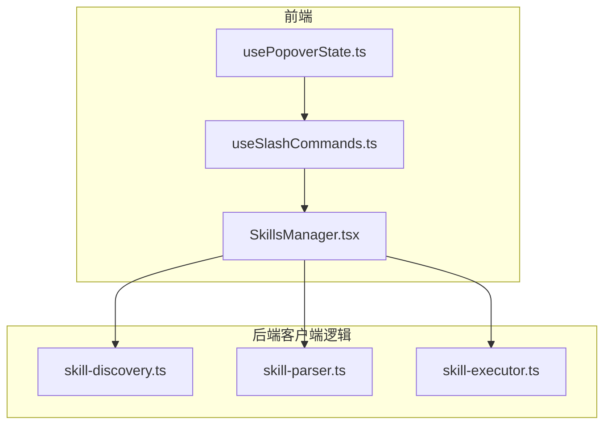
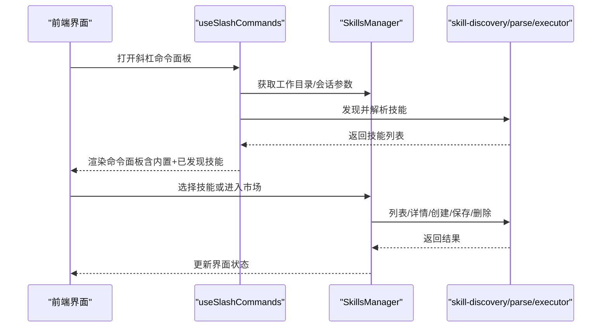
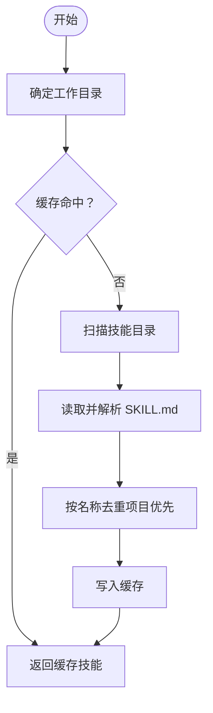
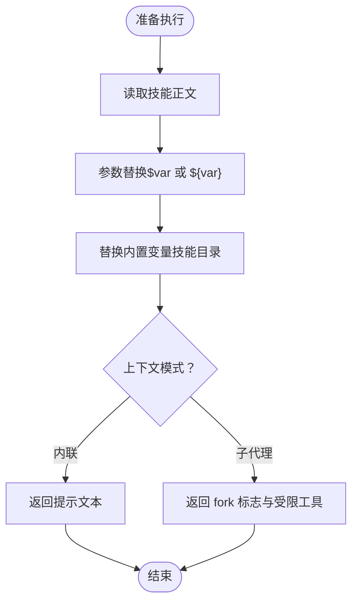
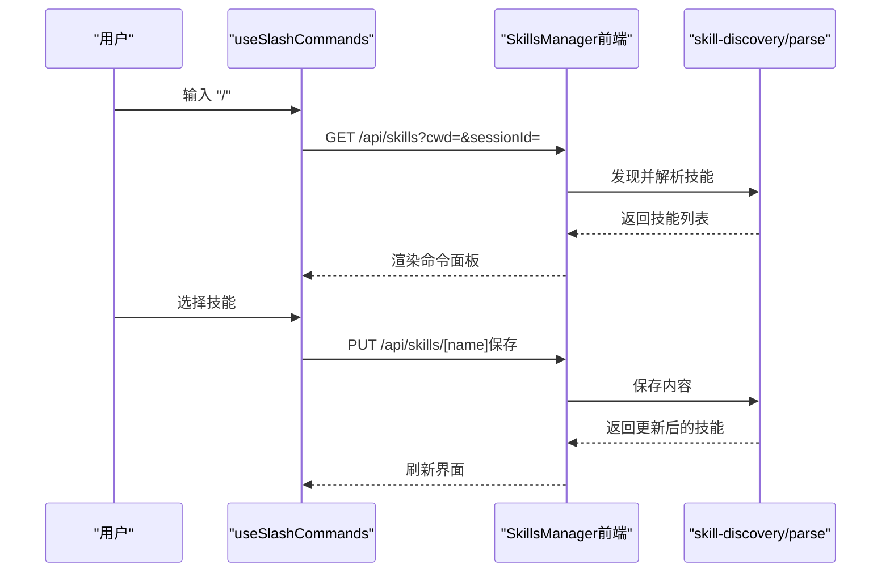
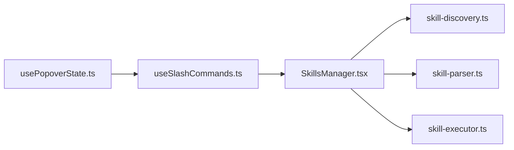

# 技能 API

<cite>
**本文引用的文件**
- [skill-discovery.ts](file://src/lib/skill-discovery.ts)
- [skill-parser.ts](file://src/lib/skill-parser.ts)
- [skill-executor.ts](file://src/lib/skill-executor.ts)
- [SkillsManager.tsx](file://src/components/skills/SkillsManager.tsx)
- [useSlashCommands.ts](file://src/hooks/useSlashCommands.ts)
- [usePopoverState.ts](file://src/hooks/usePopoverState.ts)
</cite>

## 目录
1. [简介](#简介)
2. [项目结构](#项目结构)
3. [核心组件](#核心组件)
4. [架构总览](#架构总览)
5. [详细组件分析](#详细组件分析)
6. [依赖关系分析](#依赖关系分析)
7. [性能考量](#性能考量)
8. [故障排查指南](#故障排查指南)
9. [结论](#结论)
10. [附录](#附录)

## 简介
本文件为 CodePilot 技能系统的 API 参考文档，覆盖技能的发现、解析、执行以及前端交互流程。重点说明以下端点与行为：
- 技能列表与详情：/api/skills 与 /api/skills/[name]
- 技能搜索增强：/api/skills/search
- 技能创建、保存、删除：/api/skills（POST/PUT/DELETE）
- 前端交互：斜杠命令面板、技能市场浏览、技能编辑器
- 错误处理与缓存策略
- 技能开发指南（SKILL.md 规范）

## 项目结构
与技能 API 相关的核心代码分布在以下模块：
- 技能发现与解析：src/lib/skill-discovery.ts、src/lib/skill-parser.ts
- 技能执行：src/lib/skill-executor.ts
- 前端交互：src/components/skills/SkillsManager.tsx、src/hooks/useSlashCommands.ts、src/hooks/usePopoverState.ts

图表来源
- [SkillsManager.tsx:1-348](file://src/components/skills/SkillsManager.tsx#L1-L348)
- [useSlashCommands.ts:1-288](file://src/hooks/useSlashCommands.ts#L1-L288)
- [usePopoverState.ts:1-190](file://src/hooks/usePopoverState.ts#L1-L190)
- [skill-discovery.ts:1-125](file://src/lib/skill-discovery.ts#L1-L125)
- [skill-parser.ts:1-127](file://src/lib/skill-parser.ts#L1-L127)
- [skill-executor.ts:1-52](file://src/lib/skill-executor.ts#L1-L52)

章节来源
- [skill-discovery.ts:1-125](file://src/lib/skill-discovery.ts#L1-L125)
- [skill-parser.ts:1-127](file://src/lib/skill-parser.ts#L1-L127)
- [skill-executor.ts:1-52](file://src/lib/skill-executor.ts#L1-L52)
- [SkillsManager.tsx:1-348](file://src/components/skills/SkillsManager.tsx#L1-L348)
- [useSlashCommands.ts:1-288](file://src/hooks/useSlashCommands.ts#L1-L288)
- [usePopoverState.ts:1-190](file://src/hooks/usePopoverState.ts#L1-L190)

## 核心组件
- 技能发现与去重：扫描多级目录，优先项目级，再用户级，最后跨代理共享，按名称去重并缓存。
- 技能解析：从 SKILL.md 解析 YAML 头部与正文，提取名称、描述、允许工具、上下文模式、参数模板、模型/努力等级、是否可被用户调用等。
- 技能执行：支持内联注入与子代理两种模式，内联模式进行参数替换并返回提示文本；子代理模式返回受限工具集。

章节来源
- [skill-discovery.ts:36-125](file://src/lib/skill-discovery.ts#L36-L125)
- [skill-parser.ts:43-127](file://src/lib/skill-parser.ts#L43-L127)
- [skill-executor.ts:25-52](file://src/lib/skill-executor.ts#L25-L52)

## 架构总览
技能系统从前端发起请求到后端逻辑，后端通过本地文件系统扫描与解析 SKILL.md，返回技能清单与详情，并在需要时进行语义搜索增强。

图表来源
- [useSlashCommands.ts:92-177](file://src/hooks/useSlashCommands.ts#L92-L177)
- [SkillsManager.tsx:30-131](file://src/components/skills/SkillsManager.tsx#L30-L131)
- [skill-discovery.ts:36-125](file://src/lib/skill-discovery.ts#L36-L125)
- [skill-parser.ts:43-127](file://src/lib/skill-parser.ts#L43-L127)
- [skill-executor.ts:25-52](file://src/lib/skill-executor.ts#L25-L52)

## 详细组件分析

### 技能发现与解析（后端逻辑）
- 发现范围：项目级 .claude/skills 与 .claude/commands，用户级 ~/.claude/skills、~/.claude/commands、~/.agents/skills。
- 缓存策略：按工作目录缓存，变更后失效。
- 去重规则：按名称去重，项目级优先于用户级。
- 解析字段：名称、描述、正文、允许工具数组、使用时机、上下文模式（内联/fork）、参数定义、模型/努力等级、是否可被用户调用、源路径。

图表来源
- [skill-discovery.ts:36-125](file://src/lib/skill-discovery.ts#L36-L125)
- [skill-parser.ts:43-127](file://src/lib/skill-parser.ts#L43-L127)

章节来源
- [skill-discovery.ts:18-90](file://src/lib/skill-discovery.ts#L18-L90)
- [skill-parser.ts:9-38](file://src/lib/skill-parser.ts#L9-L38)

### 技能执行（内联与子代理）
- 内联模式：将 SKILL.md 正文进行参数替换后注入对话。
- 子代理模式：返回 fork 标志与受限工具集，交由运行时以受限工具启动子代理。
- 内置变量：支持替换技能所在目录的占位符。

图表来源
- [skill-executor.ts:25-52](file://src/lib/skill-executor.ts#L25-L52)

章节来源
- [skill-executor.ts:10-17](file://src/lib/skill-executor.ts#L10-L17)

### 前端交互与 API 使用
- 技能列表：/api/skills（支持查询参数 cwd、sessionId），返回 skills 数组。
- 技能详情：/api/skills/[name]（支持查询参数 source、cwd），返回单个技能对象。
- 技能搜索增强：/api/skills/search（POST，JSON 载荷包含 query、skills、model），返回语义建议数组。
- 技能 CRUD：/api/skills（POST 创建、PUT 更新、DELETE 删除，支持 cwd、scope 等参数）。
- 斜杠命令面板：自动拉取技能列表，结合 SDK 初始化元数据过滤，渲染命令与技能条目。
- 弹出面板语义搜索：当子串匹配较少时，对非内置技能进行语义搜索增强。

图表来源
- [useSlashCommands.ts:92-177](file://src/hooks/useSlashCommands.ts#L92-L177)
- [SkillsManager.tsx:30-131](file://src/components/skills/SkillsManager.tsx#L30-L131)
- [skill-discovery.ts:36-125](file://src/lib/skill-discovery.ts#L36-L125)
- [skill-parser.ts:43-127](file://src/lib/skill-parser.ts#L43-L127)

章节来源
- [SkillsManager.tsx:30-131](file://src/components/skills/SkillsManager.tsx#L30-L131)
- [useSlashCommands.ts:92-177](file://src/hooks/useSlashCommands.ts#L92-L177)
- [usePopoverState.ts:102-142](file://src/hooks/usePopoverState.ts#L102-L142)

## 依赖关系分析
- 前端组件依赖后端逻辑进行技能发现与解析。
- 斜杠命令钩子负责组装查询参数并调用 API。
- 弹出面板钩子负责在输入较短且匹配较少时触发语义搜索增强。

图表来源
- [useSlashCommands.ts:1-288](file://src/hooks/useSlashCommands.ts#L1-L288)
- [usePopoverState.ts:1-190](file://src/hooks/usePopoverState.ts#L1-L190)
- [SkillsManager.tsx:1-348](file://src/components/skills/SkillsManager.tsx#L1-L348)
- [skill-discovery.ts:1-125](file://src/lib/skill-discovery.ts#L1-L125)
- [skill-parser.ts:1-127](file://src/lib/skill-parser.ts#L1-L127)
- [skill-executor.ts:1-52](file://src/lib/skill-executor.ts#L1-L52)

章节来源
- [useSlashCommands.ts:1-288](file://src/hooks/useSlashCommands.ts#L1-L288)
- [usePopoverState.ts:1-190](file://src/hooks/usePopoverState.ts#L1-L190)
- [SkillsManager.tsx:1-348](file://src/components/skills/SkillsManager.tsx#L1-L348)

## 性能考量
- 缓存：技能发现结果按工作目录缓存，减少重复扫描与解析成本。
- 去重：按名称去重避免重复渲染与计算。
- 语义搜索：仅在子串匹配较少时触发，降低不必要的网络请求与模型调用。
- 参数替换：内联执行前进行一次性字符串替换，复杂度与正文长度线性相关。

章节来源
- [skill-discovery.ts:28-68](file://src/lib/skill-discovery.ts#L28-L68)
- [usePopoverState.ts:61-151](file://src/hooks/usePopoverState.ts#L61-L151)
- [skill-executor.ts:25-44](file://src/lib/skill-executor.ts#L25-L44)

## 故障排查指南
- 技能未显示
  - 检查 SKILL.md 是否位于有效目录（项目级优先）。
  - 确认文件名或 frontmatter 中的 name 字段不为空。
  - 若使用 cwd 参数，请确保路径正确。
- 保存失败
  - 查看返回的错误信息，确认权限与内容格式。
  - 确保请求体包含正确的 content 字段。
- 语义搜索无结果
  - 确认 /api/skills/search 接口可达。
  - 检查 skills 载荷是否包含有效的 name/description。
- 执行异常
  - 内联模式：检查参数占位符是否齐全。
  - 子代理模式：确认 allowedTools 配置与运行时支持一致。

章节来源
- [SkillsManager.tsx:56-129](file://src/components/skills/SkillsManager.tsx#L56-L129)
- [usePopoverState.ts:102-142](file://src/hooks/usePopoverState.ts#L102-L142)
- [skill-parser.ts:43-58](file://src/lib/skill-parser.ts#L43-L58)
- [skill-executor.ts:25-44](file://src/lib/skill-executor.ts#L25-L44)

## 结论
CodePilot 的技能系统通过本地文件扫描与解析实现“即插即用”的技能生态，前端通过统一的 API 与钩子完成技能的发现、展示、编辑与执行。系统具备良好的缓存与去重策略，配合语义搜索增强，提升了用户体验与开发效率。

## 附录

### API 端点规范

- 获取技能列表
  - 方法：GET
  - 路径：/api/skills
  - 查询参数：
    - cwd：工作目录（可选）
    - sessionId：会话 ID（可选）
  - 响应：包含 skills 数组的对象
  - 示例响应字段：skills[].name, skills[].description, skills[].source, skills[].kind 等

- 获取技能详情
  - 方法：GET
  - 路径：/api/skills/[name]
  - 查询参数：
    - source：已安装来源（如 agents/claude，可选）
    - cwd：工作目录（可选）
  - 响应：技能对象（包含解析后的字段）

- 创建技能
  - 方法：POST
  - 路径：/api/skills
  - 请求体字段：name, content, scope（global/project），cwd（可选）
  - 响应：新建的 skill 对象

- 更新技能
  - 方法：PUT
  - 路径：/api/skills/[name]
  - 请求体字段：content
  - 响应：更新后的 skill 对象

- 删除技能
  - 方法：DELETE
  - 路径：/api/skills/[name]
  - 响应：成功/失败状态

- 技能语义搜索增强
  - 方法：POST
  - 路径：/api/skills/search
  - 请求体字段：query（查询词）、skills（技能摘要数组，含 name/description）、model（模型名）
  - 响应：包含 suggestions 数组的对象

章节来源
- [SkillsManager.tsx:30-131](file://src/components/skills/SkillsManager.tsx#L30-L131)
- [useSlashCommands.ts:92-177](file://src/hooks/useSlashCommands.ts#L92-L177)
- [usePopoverState.ts:102-142](file://src/hooks/usePopoverState.ts#L102-L142)

### 技能开发指南（SKILL.md）
- 文件位置：项目级 .claude/skills/[技能名]/SKILL.md 或用户级 ~/.claude/skills/
- 必要字段（frontmatter）：name、description、context（inline/fork）、arguments（数组，含 name/description/required）
- 可选字段：allowed-tools（工具白名单）、when_to_use（使用时机）、model、effort、user-invocable
- 正文：Markdown 格式的提示词主体，支持参数占位符 $arg 或 ${arg}
- 内置变量：${CLAUDE_SKILL_DIR} 表示技能目录路径
- 上下文模式：
  - inline：将正文注入当前对话
  - fork：以受限工具启动子代理执行

章节来源
- [skill-parser.ts:43-58](file://src/lib/skill-parser.ts#L43-L58)
- [skill-parser.ts:108-121](file://src/lib/skill-parser.ts#L108-L121)
- [skill-executor.ts:25-44](file://src/lib/skill-executor.ts#L25-L44)
- [skill-discovery.ts:18-26](file://src/lib/skill-discovery.ts#L18-L26)