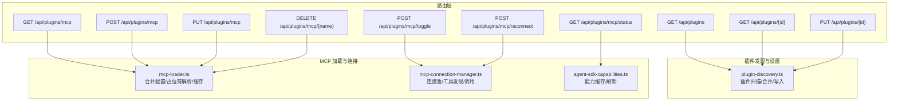
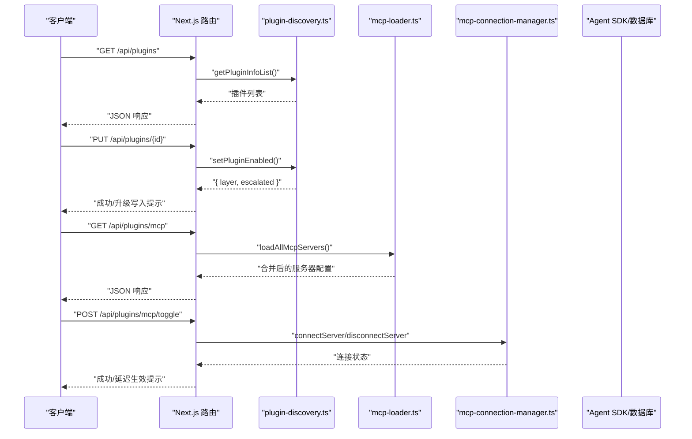
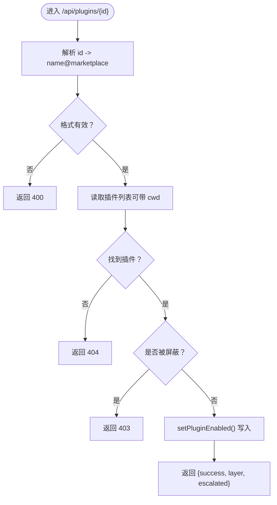
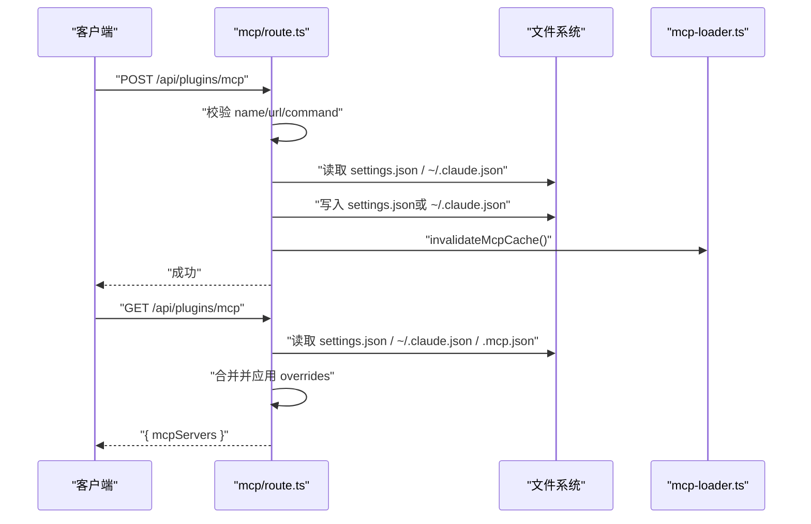
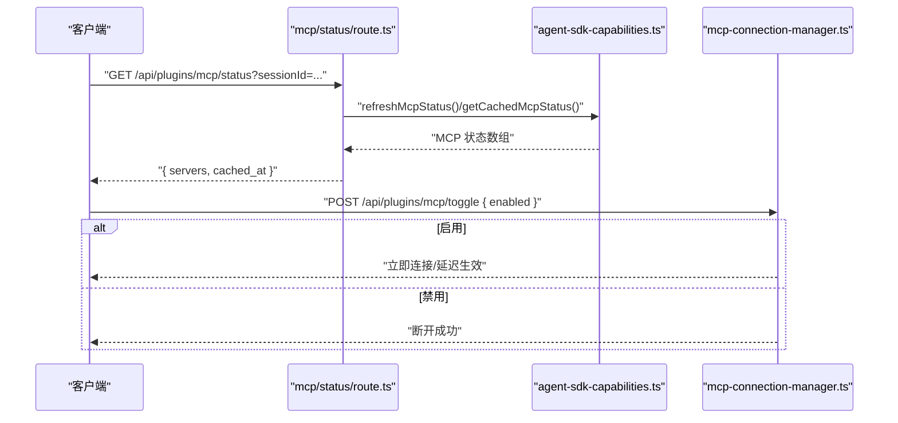
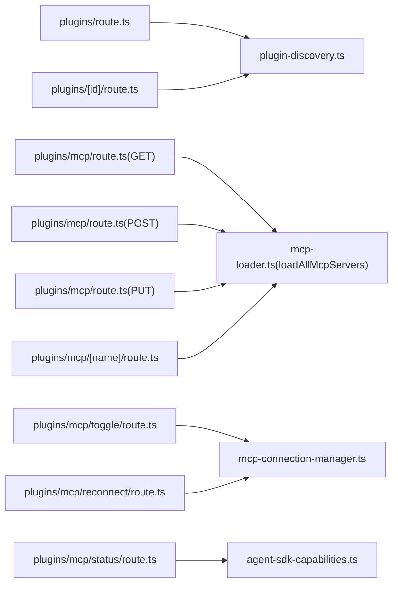

# 插件 API

<cite>
**本文引用的文件**
- [src/app/api/plugins/route.ts](file://src/app/api/plugins/route.ts)
- [src/app/api/plugins/[id]/route.ts](file://src/app/api/plugins/[id]/route.ts)
- [src/app/api/plugins/mcp/route.ts](file://src/app/api/plugins/mcp/route.ts)
- [src/app/api/plugins/mcp/status/route.ts](file://src/app/api/plugins/mcp/status/route.ts)
- [src/app/api/plugins/mcp/toggle/route.ts](file://src/app/api/plugins/mcp/toggle/route.ts)
- [src/app/api/plugins/mcp/reconnect/route.ts](file://src/app/api/plugins/mcp/reconnect/route.ts)
- [src/app/api/plugins/mcp/[name]/route.ts](file://src/app/api/plugins/mcp/[name]/route.ts)
- [src/lib/plugin-discovery.ts](file://src/lib/plugin-discovery.ts)
- [src/lib/mcp-loader.ts](file://src/lib/mcp-loader.ts)
- [src/lib/mcp-connection-manager.ts](file://src/lib/mcp-connection-manager.ts)
- [src/lib/agent-sdk-capabilities.ts](file://src/lib/agent-sdk-capabilities.ts)
- [src/lib/db.ts](file://src/lib/db.ts)
</cite>

## 目录
1. [简介](#简介)
2. [项目结构](#项目结构)
3. [核心组件](#核心组件)
4. [架构总览](#架构总览)
5. [详细组件分析](#详细组件分析)
6. [依赖关系分析](#依赖关系分析)
7. [性能考量](#性能考量)
8. [故障排查指南](#故障排查指南)
9. [结论](#结论)
10. [附录：端点规范与示例](#附录端点规范与示例)

## 简介
本文件为 CodePilot 插件系统的 API 参考文档，覆盖以下主题：
- 插件管理：列举插件、查询单个插件、启用/禁用插件（含跨层级写入策略）
- MCP 服务器管理：读取合并配置、新增/更新/删除服务器、连接状态与工具发现、即时切换与重连
- 配置来源与优先级：用户级、项目级、本地级 settings 层级解析与覆盖
- 错误处理策略与最佳实践：参数校验、冲突检测、缓存与持久化一致性
- 实际调用流程与时序：从 UI 到运行时的交互路径

## 项目结构
围绕插件与 MCP 的 API 主要位于 Next.js 路由层，并通过 lib 层模块完成配置读取、缓存与运行时连接管理。

图表来源
- [src/app/api/plugins/route.ts:1-18](file://src/app/api/plugins/route.ts#L1-L18)
- [src/app/api/plugins/[id]/route.ts](file://src/app/api/plugins/[id]/route.ts#L1-L102)
- [src/app/api/plugins/mcp/route.ts:1-189](file://src/app/api/plugins/mcp/route.ts#L1-L189)
- [src/app/api/plugins/mcp/status/route.ts:1-37](file://src/app/api/plugins/mcp/status/route.ts#L1-L37)
- [src/app/api/plugins/mcp/toggle/route.ts:1-45](file://src/app/api/plugins/mcp/toggle/route.ts#L1-L45)
- [src/app/api/plugins/mcp/reconnect/route.ts:1-25](file://src/app/api/plugins/mcp/reconnect/route.ts#L1-L25)
- [src/lib/plugin-discovery.ts:1-467](file://src/lib/plugin-discovery.ts#L1-L467)
- [src/lib/mcp-loader.ts:1-212](file://src/lib/mcp-loader.ts#L1-L212)
- [src/lib/mcp-connection-manager.ts:1-221](file://src/lib/mcp-connection-manager.ts#L1-L221)
- [src/lib/agent-sdk-capabilities.ts:1-203](file://src/lib/agent-sdk-capabilities.ts#L1-L203)

章节来源
- [src/app/api/plugins/route.ts:1-18](file://src/app/api/plugins/route.ts#L1-L18)
- [src/app/api/plugins/[id]/route.ts](file://src/app/api/plugins/[id]/route.ts#L1-L102)
- [src/app/api/plugins/mcp/route.ts:1-189](file://src/app/api/plugins/mcp/route.ts#L1-L189)
- [src/app/api/plugins/mcp/status/route.ts:1-37](file://src/app/api/plugins/mcp/status/route.ts#L1-L37)
- [src/app/api/plugins/mcp/toggle/route.ts:1-45](file://src/app/api/plugins/mcp/toggle/route.ts#L1-L45)
- [src/app/api/plugins/mcp/reconnect/route.ts:1-25](file://src/app/api/plugins/mcp/reconnect/route.ts#L1-L25)
- [src/lib/plugin-discovery.ts:1-467](file://src/lib/plugin-discovery.ts#L1-L467)
- [src/lib/mcp-loader.ts:1-212](file://src/lib/mcp-loader.ts#L1-L212)
- [src/lib/mcp-connection-manager.ts:1-221](file://src/lib/mcp-connection-manager.ts#L1-L221)
- [src/lib/agent-sdk-capabilities.ts:1-203](file://src/lib/agent-sdk-capabilities.ts#L1-L203)

## 核心组件
- 插件发现与启用控制：负责扫描市场与外部插件目录、读取多层级 enabledPlugins、计算最终启用状态、写入目标选择与升级（必要时写入本地层）。
- MCP 配置加载：合并用户/项目/本地配置，解析环境占位符，过滤禁用项，按需返回给 SDK 或 UI。
- MCP 连接管理：维护连接池，按配置自动连接/断开，发现工具，暴露统一调用接口。
- 能力缓存与刷新：基于会话捕获 SDK 能力（模型、命令、账户、MCP 状态），支持刷新与查询。

章节来源
- [src/lib/plugin-discovery.ts:1-467](file://src/lib/plugin-discovery.ts#L1-L467)
- [src/lib/mcp-loader.ts:1-212](file://src/lib/mcp-loader.ts#L1-L212)
- [src/lib/mcp-connection-manager.ts:1-221](file://src/lib/mcp-connection-manager.ts#L1-L221)
- [src/lib/agent-sdk-capabilities.ts:1-203](file://src/lib/agent-sdk-capabilities.ts#L1-L203)

## 架构总览
下图展示插件与 MCP API 的端到端交互：UI/客户端通过 Next.js 路由访问，路由层调用 lib 层模块完成配置读写与运行时连接，最终与 SDK 或 MCP 服务器交互。

图表来源
- [src/app/api/plugins/route.ts:1-18](file://src/app/api/plugins/route.ts#L1-L18)
- [src/app/api/plugins/[id]/route.ts](file://src/app/api/plugins/[id]/route.ts#L1-L102)
- [src/app/api/plugins/mcp/route.ts:1-189](file://src/app/api/plugins/mcp/route.ts#L1-L189)
- [src/app/api/plugins/mcp/toggle/route.ts:1-45](file://src/app/api/plugins/mcp/toggle/route.ts#L1-L45)
- [src/lib/plugin-discovery.ts:1-467](file://src/lib/plugin-discovery.ts#L1-L467)
- [src/lib/mcp-loader.ts:1-212](file://src/lib/mcp-loader.ts#L1-L212)
- [src/lib/mcp-connection-manager.ts:1-221](file://src/lib/mcp-connection-manager.ts#L1-L221)

## 详细组件分析

### 插件管理 API
- GET /api/plugins
  - 查询参数：cwd（可选，用于定位项目/本地设置）
  - 返回：插件数组（含名称、描述、作者、位置、是否已启用、是否被屏蔽）
  - 错误：内部异常返回 500
- GET /api/plugins/{id}
  - 路径参数：id（name@marketplace，URL 编码）
  - 查询参数：cwd（可选）
  - 行为：解析 id，查找对应插件，返回插件详情或 404
- PUT /api/plugins/{id}
  - 请求体：{ enabled: boolean, cwd?: string }
  - 行为：校验布尔值；若插件被屏蔽则拒绝；根据层级策略写入用户/本地设置；返回写入层级与是否升级写入

图表来源
- [src/app/api/plugins/[id]/route.ts](file://src/app/api/plugins/[id]/route.ts#L1-L102)
- [src/lib/plugin-discovery.ts:424-459](file://src/lib/plugin-discovery.ts#L424-L459)

章节来源
- [src/app/api/plugins/route.ts:1-18](file://src/app/api/plugins/route.ts#L1-L18)
- [src/app/api/plugins/[id]/route.ts](file://src/app/api/plugins/[id]/route.ts#L1-L102)
- [src/lib/plugin-discovery.ts:355-379](file://src/lib/plugin-discovery.ts#L355-L379)
- [src/lib/plugin-discovery.ts:424-459](file://src/lib/plugin-discovery.ts#L424-L459)

### MCP 服务器管理 API
- GET /api/plugins/mcp
  - 合并顺序：settings.json > ~/.claude.json > 项目 .mcp.json
  - 项目服务器的启用状态可通过 settings.json 的 overrides 覆盖
  - 返回：mcpServers 映射（含 _source 标记）
- POST /api/plugins/mcp
  - 请求体：{ name, server: MCPServerConfig }
  - 校验：远程类型需要 url，本地类型需要 command；名称唯一性检查
  - 行为：写入 settings.json（或 ~/.claude.json，取决于 _source）
- PUT /api/plugins/mcp
  - 请求体：{ mcpServers: Record<string, MCPServerConfig & { _source?: string }> }
  - 分流写入：settings.json、~/.claude.json、项目启用覆盖
  - 行为：写入后失效 MCP 缓存
- DELETE /api/plugins/mcp/{name}
  - 行为：尝试从 settings.json 与 ~/.claude.json 删除同名服务器；未找到返回 404；成功后失效缓存

图表来源
- [src/app/api/plugins/mcp/route.ts:44-84](file://src/app/api/plugins/mcp/route.ts#L44-L84)
- [src/app/api/plugins/mcp/route.ts:143-189](file://src/app/api/plugins/mcp/route.ts#L143-L189)
- [src/app/api/plugins/mcp/[name]/route.ts](file://src/app/api/plugins/mcp/[name]/route.ts#L34-L80)
- [src/lib/mcp-loader.ts:40-99](file://src/lib/mcp-loader.ts#L40-L99)

章节来源
- [src/app/api/plugins/mcp/route.ts:44-84](file://src/app/api/plugins/mcp/route.ts#L44-L84)
- [src/app/api/plugins/mcp/route.ts:86-141](file://src/app/api/plugins/mcp/route.ts#L86-L141)
- [src/app/api/plugins/mcp/route.ts:143-189](file://src/app/api/plugins/mcp/route.ts#L143-L189)
- [src/app/api/plugins/mcp/[name]/route.ts](file://src/app/api/plugins/mcp/[name]/route.ts#L34-L80)
- [src/lib/mcp-loader.ts:40-99](file://src/lib/mcp-loader.ts#L40-L99)

### MCP 状态与连接控制 API
- GET /api/plugins/mcp/status
  - 查询参数：sessionId（可选）、providerId（可选）
  - 行为：有 sessionId 时从活动会话刷新状态，否则返回缓存；同时返回缓存时间
- POST /api/plugins/mcp/toggle
  - 请求体：{ serverName, enabled: boolean }
  - 行为：启用时尝试立即连接（失败则提示“下次消息生效”）；禁用时断开连接
- POST /api/plugins/mcp/reconnect
  - 请求体：{ serverName }
  - 行为：断开后重新连接

图表来源
- [src/app/api/plugins/mcp/status/route.ts:8-36](file://src/app/api/plugins/mcp/status/route.ts#L8-L36)
- [src/lib/agent-sdk-capabilities.ts:186-202](file://src/lib/agent-sdk-capabilities.ts#L186-L202)
- [src/app/api/plugins/mcp/toggle/route.ts:13-44](file://src/app/api/plugins/mcp/toggle/route.ts#L13-L44)
- [src/lib/mcp-connection-manager.ts:45-64](file://src/lib/mcp-connection-manager.ts#L45-L64)

章节来源
- [src/app/api/plugins/mcp/status/route.ts:8-36](file://src/app/api/plugins/mcp/status/route.ts#L8-L36)
- [src/lib/agent-sdk-capabilities.ts:160-162](file://src/lib/agent-sdk-capabilities.ts#L160-L162)
- [src/app/api/plugins/mcp/toggle/route.ts:13-44](file://src/app/api/plugins/mcp/toggle/route.ts#L13-L44)
- [src/lib/mcp-connection-manager.ts:113-119](file://src/lib/mcp-connection-manager.ts#L113-L119)
- [src/app/api/plugins/mcp/reconnect/route.ts:9-24](file://src/app/api/plugins/mcp/reconnect/route.ts#L9-L24)
- [src/lib/mcp-connection-manager.ts:173-178](file://src/lib/mcp-connection-manager.ts#L173-L178)

## 依赖关系分析
- 插件 API 依赖插件发现模块进行扫描与启用状态计算
- MCP API 依赖配置加载模块进行合并与占位符解析，依赖连接管理模块进行运行时连接
- 状态 API 依赖能力缓存模块，后者从 SDK 会话中抓取并缓存 MCP 状态

图表来源
- [src/app/api/plugins/route.ts:1-18](file://src/app/api/plugins/route.ts#L1-L18)
- [src/app/api/plugins/[id]/route.ts](file://src/app/api/plugins/[id]/route.ts#L1-L102)
- [src/app/api/plugins/mcp/route.ts:1-189](file://src/app/api/plugins/mcp/route.ts#L1-L189)
- [src/app/api/plugins/mcp/[name]/route.ts](file://src/app/api/plugins/mcp/[name]/route.ts#L1-L80)
- [src/app/api/plugins/mcp/toggle/route.ts:1-45](file://src/app/api/plugins/mcp/toggle/route.ts#L1-L45)
- [src/app/api/plugins/mcp/reconnect/route.ts:1-25](file://src/app/api/plugins/mcp/reconnect/route.ts#L1-L25)
- [src/app/api/plugins/mcp/status/route.ts:1-37](file://src/app/api/plugins/mcp/status/route.ts#L1-L37)
- [src/lib/plugin-discovery.ts:1-467](file://src/lib/plugin-discovery.ts#L1-L467)
- [src/lib/mcp-loader.ts:1-212](file://src/lib/mcp-loader.ts#L1-L212)
- [src/lib/mcp-connection-manager.ts:1-221](file://src/lib/mcp-connection-manager.ts#L1-L221)
- [src/lib/agent-sdk-capabilities.ts:1-203](file://src/lib/agent-sdk-capabilities.ts#L1-L203)

章节来源
- [src/lib/plugin-discovery.ts:1-467](file://src/lib/plugin-discovery.ts#L1-L467)
- [src/lib/mcp-loader.ts:1-212](file://src/lib/mcp-loader.ts#L1-L212)
- [src/lib/mcp-connection-manager.ts:1-221](file://src/lib/mcp-connection-manager.ts#L1-L221)
- [src/lib/agent-sdk-capabilities.ts:1-203](file://src/lib/agent-sdk-capabilities.ts#L1-L203)

## 性能考量
- 插件发现与 MCP 配置加载均内置缓存（默认 TTL 见各模块注释），避免频繁磁盘读取
- MCP 连接池按需连接，仅在需要时解析占位符并建立传输
- 状态刷新采用并发抓取并带空值保护，防止缓存被无效结果清空

[本节为通用指导，不直接分析具体文件]

## 故障排查指南
- 插件启用失败（403）：插件被屏蔽，无法启用
- 插件启用失败（500）：内部异常，检查日志
- MCP 新增失败（400）：缺少 name 或 url/command；或名称冲突
- MCP 新增失败（500）：写入配置异常
- MCP 切换失败（500）：连接/断开异常，查看连接池错误信息
- MCP 状态查询异常：SDK 会话不可用时回退到缓存，或返回错误字段

章节来源
- [src/app/api/plugins/[id]/route.ts](file://src/app/api/plugins/[id]/route.ts#L81-L86)
- [src/app/api/plugins/[id]/route.ts](file://src/app/api/plugins/[id]/route.ts#L95-L100)
- [src/app/api/plugins/mcp/route.ts:152-157](file://src/app/api/plugins/mcp/route.ts#L152-L157)
- [src/app/api/plugins/mcp/route.ts:168-173](file://src/app/api/plugins/mcp/route.ts#L168-L173)
- [src/app/api/plugins/mcp/toggle/route.ts:40-44](file://src/app/api/plugins/mcp/toggle/route.ts#L40-L44)
- [src/app/api/plugins/mcp/status/route.ts:32-36](file://src/app/api/plugins/mcp/status/route.ts#L32-L36)

## 结论
本 API 体系通过清晰的配置分层与缓存策略，实现了插件与 MCP 服务器的统一管理与高效运行时集成。插件启用遵循“用户 > 项目 > 本地”的优先级，MCP 配置支持占位符解析与即时/延迟生效两种模式，满足桌面端与云端会话的不同需求。

[本节为总结，不直接分析具体文件]

## 附录：端点规范与示例

### 插件管理
- GET /api/plugins
  - 查询参数：cwd（字符串，可选）
  - 响应：{ plugins: PluginInfo[] }
  - 示例响应：包含 name、description、author、location、hasCommands、hasSkills、hasAgents、blocked、enabled
- GET /api/plugins/{id}
  - 路径参数：id（name@marketplace，URL 编码）
  - 查询参数：cwd（字符串，可选）
  - 成功：200，{ plugin }
  - 失败：400（格式错误）、404（未找到）
- PUT /api/plugins/{id}
  - 请求体：{ enabled: boolean, cwd?: string }
  - 成功：200，{ success, layer, escalated }
  - 失败：400（参数错误）、403（被屏蔽）、404（未找到）、500（内部错误）

章节来源
- [src/app/api/plugins/route.ts:5-17](file://src/app/api/plugins/route.ts#L5-L17)
- [src/app/api/plugins/[id]/route.ts](file://src/app/api/plugins/[id]/route.ts#L23-L47)
- [src/app/api/plugins/[id]/route.ts](file://src/app/api/plugins/[id]/route.ts#L49-L101)
- [src/lib/plugin-discovery.ts:424-459](file://src/lib/plugin-discovery.ts#L424-L459)

### MCP 服务器管理
- GET /api/plugins/mcp
  - 成功：200，{ mcpServers }
  - 失败：500
- POST /api/plugins/mcp
  - 请求体：{ name, server: MCPServerConfig }
  - 成功：200，{ success }
  - 失败：400（参数缺失/冲突）、500（内部错误）
- PUT /api/plugins/mcp
  - 请求体：{ mcpServers }
  - 成功：200，{ success }
  - 失败：500
- DELETE /api/plugins/mcp/{name}
  - 成功：200，{ success }
  - 失败：404、500

章节来源
- [src/app/api/plugins/mcp/route.ts:44-84](file://src/app/api/plugins/mcp/route.ts#L44-L84)
- [src/app/api/plugins/mcp/route.ts:143-189](file://src/app/api/plugins/mcp/route.ts#L143-L189)
- [src/app/api/plugins/mcp/route.ts:86-141](file://src/app/api/plugins/mcp/route.ts#L86-L141)
- [src/app/api/plugins/mcp/[name]/route.ts](file://src/app/api/plugins/mcp/[name]/route.ts#L34-L80)

### MCP 状态与连接控制
- GET /api/plugins/mcp/status
  - 查询参数：sessionId（字符串，可选）、providerId（字符串，可选）
  - 成功：200，{ servers, cached_at }
  - 失败：返回空 servers 与错误字段
- POST /api/plugins/mcp/toggle
  - 请求体：{ serverName, enabled: boolean }
  - 成功：200，{ success }（启用可能提示“下次消息生效”）
  - 失败：400、500
- POST /api/plugins/mcp/reconnect
  - 请求体：{ serverName }
  - 成功：200，{ success }
  - 失败：400、500

章节来源
- [src/app/api/plugins/mcp/status/route.ts:8-36](file://src/app/api/plugins/mcp/status/route.ts#L8-L36)
- [src/app/api/plugins/mcp/toggle/route.ts:13-44](file://src/app/api/plugins/mcp/toggle/route.ts#L13-L44)
- [src/app/api/plugins/mcp/reconnect/route.ts:9-24](file://src/app/api/plugins/mcp/reconnect/route.ts#L9-L24)
- [src/lib/mcp-connection-manager.ts:113-119](file://src/lib/mcp-connection-manager.ts#L113-L119)
- [src/lib/mcp-connection-manager.ts:173-178](file://src/lib/mcp-connection-manager.ts#L173-L178)