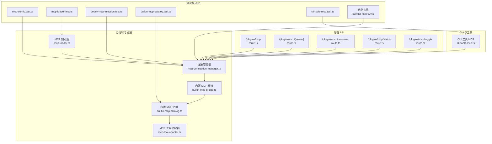
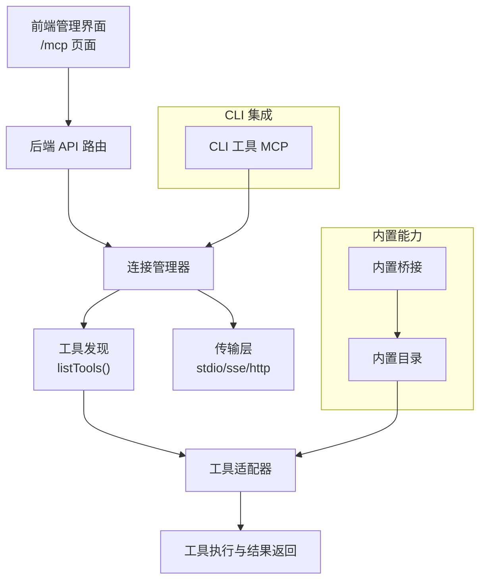
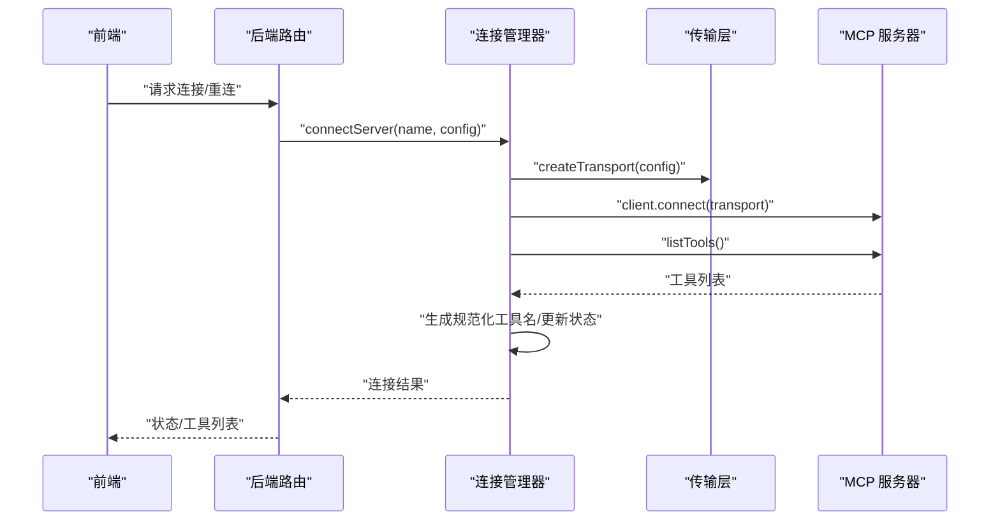
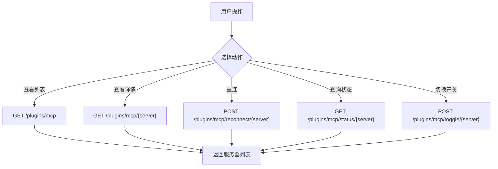
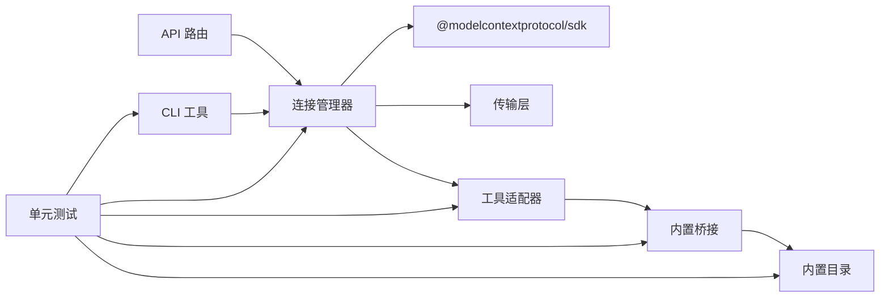

# MCP 协议

<cite>
**本文引用的文件**
- [mcp-connection-manager.ts](file://src/lib/mcp-connection-manager.ts)
- [builtin-mcp-bridge.ts](file://src/lib/builtin-mcp-bridge.ts)
- [builtin-mcp-catalog.ts](file://src/lib/builtin-mcp-catalog.ts)
- [cli-tools-mcp.ts](file://src/lib/cli-tools-mcp.ts)
- [mcp-loader.ts](file://src/lib/mcp-loader.ts)
- [mcp-tool-adapter.ts](file://src/lib/mcp-tool-adapter.ts)
- [route.ts（插件 MCP）](file://src/app/api/plugins/mcp/route.ts)
- [route.ts（插件 MCP 列表）](file://src/app/api/plugins/mcp/[server]/route.ts)
- [route.ts（插件 MCP 重连）](file://src/app/api/plugins/mcp/reconnect/route.ts)
- [route.ts（插件 MCP 状态）](file://src/app/api/plugins/mcp/status/route.ts)
- [route.ts（插件 MCP 切换）](file://src/app/api/plugins/mcp/toggle/route.ts)
- [mcp.mdx](file://apps/site/content/docs/zh/mcp.mdx)
- [selftest-fixture.mjs](file://docs/research/codex-mcp-injection-poc/selftest-fixture.mjs)
- [fixture-memory-mcp.mjs](file://docs/research/codex-mcp-injection-poc/fixture-memory-mcp.mjs)
- [mcp.md](file://docs/guardrails/MCP.md)
- [runtime-log.ts](file://src/lib/runtime-log.ts)
- [stream-session-manager.ts](file://src/lib/stream-session-manager.ts)
- [safe-stream.ts](file://src/lib/safe-stream.ts)
- [provider-transport.ts](file://src/lib/provider-transport.ts)
- [mcp-config.test.ts](file://src/__tests__/unit/mcp-config.test.ts)
- [mcp-loader.test.ts](file://src/__tests__/unit/mcp-loader.test.ts)
- [codex-mcp-injection.test.ts](file://src/__tests__/unit/codex-mcp-injection.test.ts)
- [codex-mcp-events.test.ts](file://src/__tests__/unit/codex-mcp-events.test.ts)
- [builtin-mcp-catalog.test.ts](file://src/__tests__/unit/builtin-mcp-catalog.test.ts)
- [cli-tools-mcp.test.ts](file://src/__tests__/unit/cli-tools-mcp.test.ts)
</cite>

## 目录
1. [引言](#引言)
2. [项目结构](#项目结构)
3. [核心组件](#核心组件)
4. [架构总览](#架构总览)
5. [详细组件分析](#详细组件分析)
6. [依赖关系分析](#依赖关系分析)
7. [性能考虑](#性能考虑)
8. [故障排除指南](#故障排除指南)
9. [结论](#结论)
10. [附录](#附录)

## 引言
本文件系统性梳理 CodePilot 中的 MCP（Model Context Protocol）协议实现与应用，覆盖协议设计原则、通信机制、消息格式、握手与认证、连接管理、消息类型与数据结构、版本兼容性、错误码与异常处理、调试与日志、性能监控，以及在 CodePilot 中的具体场景与最佳实践。文档基于仓库中的源代码与测试用例进行归纳总结，并提供可视化图示帮助理解。

## 项目结构
MCP 在 CodePilot 中由“连接管理器”“桥接层”“目录与工具适配”“API 路由”“测试与研究用例”等模块协同组成，形成从本地/外部 MCP 服务发现、连接、工具暴露到前端管理界面的完整闭环。

图表来源
- [mcp-connection-manager.ts:1-117](file://src/lib/mcp-connection-manager.ts#L1-L117)
- [builtin-mcp-bridge.ts](file://src/lib/builtin-mcp-bridge.ts)
- [builtin-mcp-catalog.ts](file://src/lib/builtin-mcp-catalog.ts)
- [mcp-tool-adapter.ts](file://src/lib/mcp-tool-adapter.ts)
- [mcp-loader.ts](file://src/lib/mcp-loader.ts)
- [route.ts（插件 MCP）](file://src/app/api/plugins/mcp/route.ts)
- [route.ts（插件 MCP 列表）](file://src/app/api/plugins/mcp/[server]/route.ts)
- [route.ts（插件 MCP 重连）](file://src/app/api/plugins/mcp/reconnect/route.ts)
- [route.ts（插件 MCP 状态）](file://src/app/api/plugins/mcp/status/route.ts)
- [route.ts（插件 MCP 切换）](file://src/app/api/plugins/mcp/toggle/route.ts)
- [cli-tools-mcp.ts](file://src/lib/cli-tools-mcp.ts)
- [mcp-config.test.ts](file://src/__tests__/unit/mcp-config.test.ts)
- [mcp-loader.test.ts](file://src/__tests__/unit/mcp-loader.test.ts)
- [codex-mcp-injection.test.ts](file://src/__tests__/unit/codex-mcp-injection.test.ts)
- [builtin-mcp-catalog.test.ts](file://src/__tests__/unit/builtin-mcp-catalog.test.ts)
- [cli-tools-mcp.test.ts](file://src/__tests__/unit/cli-tools-mcp.test.ts)
- [selftest-fixture.mjs:1-35](file://docs/research/codex-mcp-injection-poc/selftest-fixture.mjs#L1-L35)

章节来源
- [mcp-connection-manager.ts:1-117](file://src/lib/mcp-connection-manager.ts#L1-L117)
- [route.ts（插件 MCP）](file://src/app/api/plugins/mcp/route.ts)
- [route.ts（插件 MCP 列表）](file://src/app/api/plugins/mcp/[server]/route.ts)
- [route.ts（插件 MCP 重连）](file://src/app/api/plugins/mcp/reconnect/route.ts)
- [route.ts（插件 MCP 状态）](file://src/app/api/plugins/mcp/status/route.ts)
- [route.ts（插件 MCP 切换）](file://src/app/api/plugins/mcp/toggle/route.ts)

## 核心组件
- 连接管理器：负责 MCP 服务器连接池、传输层创建、工具发现与状态管理。
- 内置桥接与目录：提供内置 MCP 服务的桥接与目录能力，统一工具注册与调用。
- 工具适配器：将 MCP 工具转换为 CodePilot 可用的工具接口。
- 加载器：负责 MCP 配置加载与初始化流程。
- API 路由：提供前端管理界面所需的 MCP 服务器增删改查、重连、开关、状态查询等接口。
- CLI 工具：将 MCP 工具集成到 CLI 工具体系中，支持命令行调用。
- 测试与研究：包含配置、加载、注入、目录与 CLI 的单元测试，以及自测夹具用于验证 MCP 服务器协议正确性。

章节来源
- [mcp-connection-manager.ts:1-117](file://src/lib/mcp-connection-manager.ts#L1-L117)
- [builtin-mcp-bridge.ts](file://src/lib/builtin-mcp-bridge.ts)
- [builtin-mcp-catalog.ts](file://src/lib/builtin-mcp-catalog.ts)
- [mcp-tool-adapter.ts](file://src/lib/mcp-tool-adapter.ts)
- [mcp-loader.ts](file://src/lib/mcp-loader.ts)
- [cli-tools-mcp.ts](file://src/lib/cli-tools-mcp.ts)

## 架构总览
下图展示了 MCP 在 CodePilot 中的整体架构：前端通过 API 路由管理 MCP 服务器；后端由连接管理器负责与外部 MCP 服务建立连接并发现工具；工具经适配器暴露给上层使用；内置桥接与目录提供默认能力；CLI 工具将 MCP 工具纳入命令行生态。

图表来源
- [mcp-connection-manager.ts:1-117](file://src/lib/mcp-connection-manager.ts#L1-L117)
- [builtin-mcp-bridge.ts](file://src/lib/builtin-mcp-bridge.ts)
- [builtin-mcp-catalog.ts](file://src/lib/builtin-mcp-catalog.ts)
- [mcp-tool-adapter.ts](file://src/lib/mcp-tool-adapter.ts)
- [route.ts（插件 MCP）](file://src/app/api/plugins/mcp/route.ts)
- [route.ts（插件 MCP 列表）](file://src/app/api/plugins/mcp/[server]/route.ts)
- [route.ts（插件 MCP 重连）](file://src/app/api/plugins/mcp/reconnect/route.ts)
- [route.ts（插件 MCP 状态）](file://src/app/api/plugins/mcp/status/route.ts)
- [route.ts（插件 MCP 切换）](file://src/app/api/plugins/mcp/toggle/route.ts)
- [cli-tools-mcp.ts](file://src/lib/cli-tools-mcp.ts)

## 详细组件分析

### 连接管理器（MCP 连接池）
- 职责：管理 MCP 服务器连接池，支持多种传输方式（stdio/sse/http），延迟加载 MCP SDK，连接成功后调用 listTools 发现工具，维护连接状态与错误信息。
- 关键数据结构：
  - 连接对象：包含名称、配置、客户端实例、工具列表、状态、错误信息。
  - 工具定义：包含规范化的工具名、原始名称、所属服务器、描述、输入模式等。
- 处理流程：创建传输 -> 连接 -> listTools -> 注册工具 -> 更新状态；失败时记录错误并标记失败状态。
- 错误处理：捕获连接与工具发现阶段的异常，设置失败状态与错误信息，输出警告日志。

图表来源
- [mcp-connection-manager.ts:70-108](file://src/lib/mcp-connection-manager.ts#L70-L108)

章节来源
- [mcp-connection-manager.ts:1-117](file://src/lib/mcp-connection-manager.ts#L1-L117)

### 内置 MCP 桥接与目录
- 内置桥接：提供内置 MCP 服务的桥接能力，统一工具注册与调用入口。
- 内置目录：维护内置工具目录，供工具适配器与上层使用。
- 作用：减少对外部 MCP 服务器的依赖，提供基础工具能力。

章节来源
- [builtin-mcp-bridge.ts](file://src/lib/builtin-mcp-bridge.ts)
- [builtin-mcp-catalog.ts](file://src/lib/builtin-mcp-catalog.ts)

### 工具适配器
- 职责：将 MCP 工具转换为 CodePilot 可用的工具接口，包括输入参数校验、调用封装、结果转换与错误映射。
- 特点：面向工具调用的统一抽象，便于与内置与外部工具协同工作。

章节来源
- [mcp-tool-adapter.ts](file://src/lib/mcp-tool-adapter.ts)

### MCP 加载器
- 职责：负责 MCP 配置加载、初始化流程控制与生命周期管理。
- 与连接管理器协作：在加载完成后交由连接管理器建立连接与工具发现。

章节来源
- [mcp-loader.ts](file://src/lib/mcp-loader.ts)

### API 路由（MCP 管理）
- 列表与详情：列出所有已配置的 MCP 服务器，支持按服务器名查询详情。
- 重连：对指定服务器发起重连操作。
- 状态：查询服务器连接状态与工具数量。
- 切换：启用/禁用某个 MCP 服务器。
- 作用：为前端管理界面提供完整的 MCP 生命周期管理能力。

图表来源
- [route.ts（插件 MCP）](file://src/app/api/plugins/mcp/route.ts)
- [route.ts（插件 MCP 列表）](file://src/app/api/plugins/mcp/[server]/route.ts)
- [route.ts（插件 MCP 重连）](file://src/app/api/plugins/mcp/reconnect/route.ts)
- [route.ts（插件 MCP 状态）](file://src/app/api/plugins/mcp/status/route.ts)
- [route.ts（插件 MCP 切换）](file://src/app/api/plugins/mcp/toggle/route.ts)

章节来源
- [route.ts（插件 MCP）](file://src/app/api/plugins/mcp/route.ts)
- [route.ts（插件 MCP 列表）](file://src/app/api/plugins/mcp/[server]/route.ts)
- [route.ts（插件 MCP 重连）](file://src/app/api/plugins/mcp/reconnect/route.ts)
- [route.ts（插件 MCP 状态）](file://src/app/api/plugins/mcp/status/route.ts)
- [route.ts（插件 MCP 切换）](file://src/app/api/plugins/mcp/toggle/route.ts)

### CLI 工具（MCP 集成）
- 职责：将 MCP 工具纳入 CLI 工具体系，支持命令行调用与上下文传递。
- 应用：提升开发与运维效率，便于自动化脚本与流水线集成。

章节来源
- [cli-tools-mcp.ts](file://src/lib/cli-tools-mcp.ts)

### 测试与研究用例
- 配置测试：验证 MCP 配置加载与解析的正确性。
- 加载测试：验证 MCP 加载器在不同配置下的行为。
- 注入测试：验证 MCP 注入链路与工具调用流程。
- 目录测试：验证内置 MCP 目录的完整性与一致性。
- CLI 测试：验证 CLI 工具与 MCP 的集成效果。
- 自测夹具：通过 MCP SDK 的 stdio 客户端驱动夹具，验证服务器协议正确性（initialize → tools/list → tools/call）。

章节来源
- [mcp-config.test.ts](file://src/__tests__/unit/mcp-config.test.ts)
- [mcp-loader.test.ts](file://src/__tests__/unit/mcp-loader.test.ts)
- [codex-mcp-injection.test.ts](file://src/__tests__/unit/codex-mcp-injection.test.ts)
- [builtin-mcp-catalog.test.ts](file://src/__tests__/unit/builtin-mcp-catalog.test.ts)
- [cli-tools-mcp.test.ts](file://src/__tests__/unit/cli-tools-mcp.test.ts)
- [selftest-fixture.mjs:1-35](file://docs/research/codex-mcp-injection-poc/selftest-fixture.mjs#L1-L35)

## 依赖关系分析
- 组件耦合：连接管理器是 MCP 的核心枢纽，向上对接 API 路由与工具适配器，向下对接传输层与外部 MCP 服务器；内置桥接与目录为上层提供默认能力；CLI 工具与测试用例分别从使用侧与质量侧保障系统稳定。
- 外部依赖：MCP SDK（client、stdio 等模块）通过动态导入避免不必要的依赖加载。
- 潜在风险：传输层差异（stdio/sse/http）可能带来兼容性问题；工具发现与调用的超时与重试策略需要完善。

图表来源
- [mcp-connection-manager.ts:1-117](file://src/lib/mcp-connection-manager.ts#L1-L117)
- [route.ts（插件 MCP）](file://src/app/api/plugins/mcp/route.ts)
- [mcp-tool-adapter.ts](file://src/lib/mcp-tool-adapter.ts)
- [builtin-mcp-bridge.ts](file://src/lib/builtin-mcp-bridge.ts)
- [builtin-mcp-catalog.ts](file://src/lib/builtin-mcp-catalog.ts)
- [cli-tools-mcp.ts](file://src/lib/cli-tools-mcp.ts)
- [mcp-config.test.ts](file://src/__tests__/unit/mcp-config.test.ts)
- [mcp-loader.test.ts](file://src/__tests__/unit/mcp-loader.test.ts)
- [codex-mcp-injection.test.ts](file://src/__tests__/unit/codex-mcp-injection.test.ts)
- [builtin-mcp-catalog.test.ts](file://src/__tests__/unit/builtin-mcp-catalog.test.ts)
- [cli-tools-mcp.test.ts](file://src/__tests__/unit/cli-tools-mcp.test.ts)

## 性能考虑
- 延迟加载：MCP SDK 仅在首次使用时动态导入，降低启动时的内存与加载开销。
- 连接池：复用连接以减少重复握手与资源消耗。
- 流式处理：结合流会话管理与安全流处理，优化长耗时工具的响应体验。
- 超时与重试：建议在传输层与工具调用处增加合理的超时与重试策略，避免阻塞主线程。
- 日志与监控：通过运行时日志与 SSE/HTTP 传输的可观测性，定位性能瓶颈。

章节来源
- [mcp-connection-manager.ts:1-117](file://src/lib/mcp-connection-manager.ts#L1-L117)
- [runtime-log.ts](file://src/lib/runtime-log.ts)
- [stream-session-manager.ts](file://src/lib/stream-session-manager.ts)
- [safe-stream.ts](file://src/lib/safe-stream.ts)

## 故障排除指南
- 服务器无法连接
  - 检查命令是否正确，所需的 npm 包是否已安装。
  - 确认传输类型（stdio/sse/http）与地址配置正确。
- 工具未出现
  - 尝试断开并重新连接服务器，触发工具重新发现。
  - 检查服务器是否正确实现 listTools 并返回有效工具清单。
- 权限错误
  - 确保 MCP 服务器有权访问所需资源（文件、网络、进程等）。
- SSE/HTTP 连接失败
  - 检查 URL 是否正确，服务器是否正在运行，网络与代理配置是否允许连接。
- 协议正确性验证
  - 使用自测夹具通过 MCP SDK 的 stdio 客户端驱动夹具，验证 initialize → tools/list → tools/call 的完整流程。

章节来源
- [mcp.mdx:68-73](file://apps/site/content/docs/zh/mcp.mdx#L68-L73)
- [selftest-fixture.mjs:1-35](file://docs/research/codex-mcp-injection-poc/selftest-fixture.mjs#L1-L35)

## 结论
CodePilot 对 MCP 的实现以连接管理器为核心，结合内置桥接与目录、工具适配器、API 路由与 CLI 集成，形成了从协议接入到工具使用的完整闭环。通过动态导入、连接池与流式处理等手段优化性能，并辅以完善的测试与自测夹具保障协议正确性。未来可在传输层超时/重试、错误码标准化与前端可观测性方面进一步增强。

## 附录

### 协议握手与认证（基于实现的归纳）
- 握手：连接管理器通过传输层创建连接后，调用 listTools 获取工具清单，完成初始握手。
- 认证：当前实现未显式展示认证字段或令牌传递逻辑；如需认证，请在传输层或服务器端实现相应机制。
- 连接管理：支持断开与重连，状态机包含 connecting/connected/failed/disabled。

章节来源
- [mcp-connection-manager.ts:70-108](file://src/lib/mcp-connection-manager.ts#L70-L108)

### 消息类型与数据结构（基于实现的归纳）
- 连接对象：包含名称、配置、客户端、工具列表、状态、错误信息。
- 工具定义：包含规范化工具名、原始名称、服务器名、描述、输入模式。
- API 返回：列表、详情、状态、工具清单等。

章节来源
- [mcp-connection-manager.ts:15-35](file://src/lib/mcp-connection-manager.ts#L15-L35)
- [route.ts（插件 MCP）](file://src/app/api/plugins/mcp/route.ts)
- [route.ts（插件 MCP 列表）](file://src/app/api/plugins/mcp/[server]/route.ts)
- [route.ts（插件 MCP 状态）](file://src/app/api/plugins/mcp/status/route.ts)

### 版本兼容性与错误码
- 版本兼容：连接管理器在创建客户端时传入名称与版本，便于服务端识别客户端身份。
- 错误码：当前实现通过状态字段与错误信息表达连接失败原因，未定义统一错误码枚举；建议在后续版本引入标准错误码与语义化错误消息。

章节来源
- [mcp-connection-manager.ts:80-108](file://src/lib/mcp-connection-manager.ts#L80-L108)

### 调试工具与日志
- 自测夹具：通过 MCP SDK 的 stdio 客户端驱动夹具，验证服务器协议正确性。
- 运行时日志：提供运行时日志能力，便于追踪 MCP 交互与问题定位。
- SSE/HTTP：结合传输层与前端路由，提供可观测性与调试通道。

章节来源
- [selftest-fixture.mjs:1-35](file://docs/research/codex-mcp-injection-poc/selftest-fixture.mjs#L1-L35)
- [runtime-log.ts](file://src/lib/runtime-log.ts)
- [provider-transport.ts](file://src/lib/provider-transport.ts)

### 在 CodePilot 中的应用场景与最佳实践
- 场景
  - 扩展工具能力：通过 MCP 服务器接入第三方工具，丰富 Agent 的工具集。
  - 内容检索：利用内置目录与桥接，快速暴露与调用工具。
  - CLI 集成：将 MCP 工具纳入 CLI 工具体系，支持自动化与流水线。
- 最佳实践
  - 明确传输类型与地址，确保连接稳定性。
  - 使用重连与状态查询接口，提升用户体验。
  - 在工具调用前进行输入校验与权限检查。
  - 通过测试用例与自测夹具验证协议正确性与兼容性。

章节来源
- [builtin-mcp-catalog.ts](file://src/lib/builtin-mcp-catalog.ts)
- [cli-tools-mcp.ts](file://src/lib/cli-tools-mcp.ts)
- [mcp.mdx:66-73](file://apps/site/content/docs/zh/mcp.mdx#L66-L73)