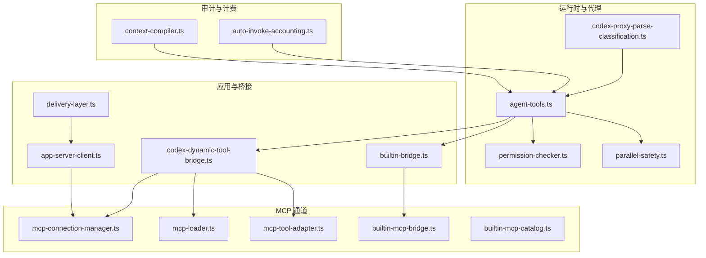
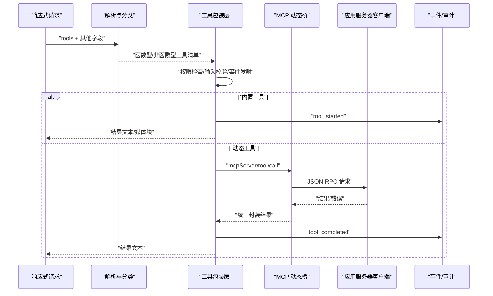
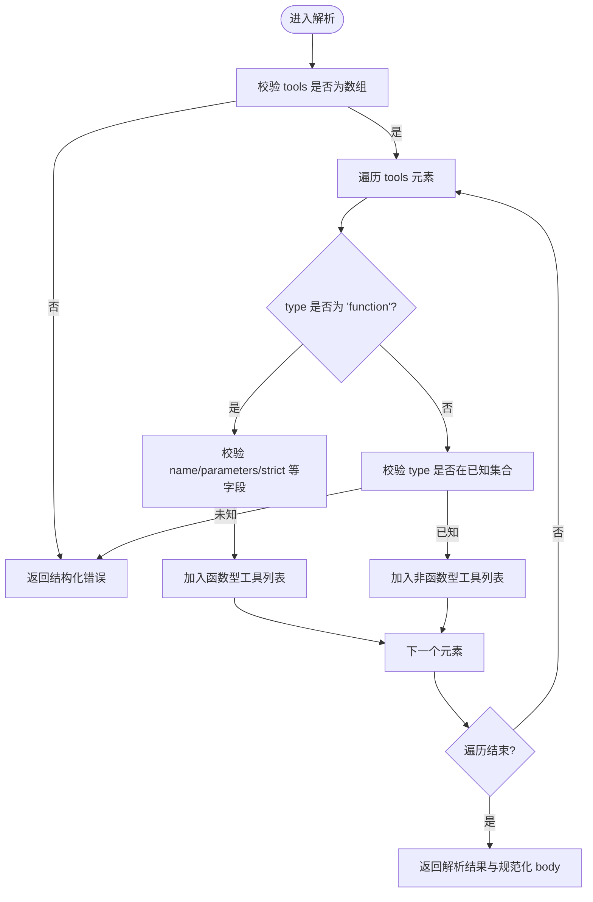
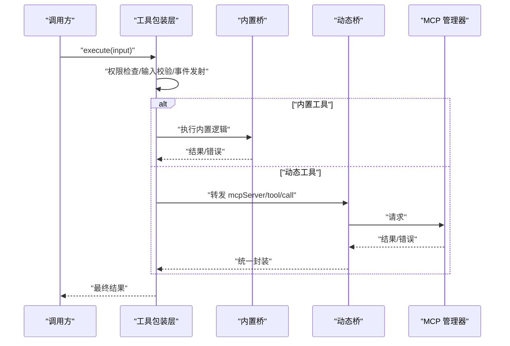
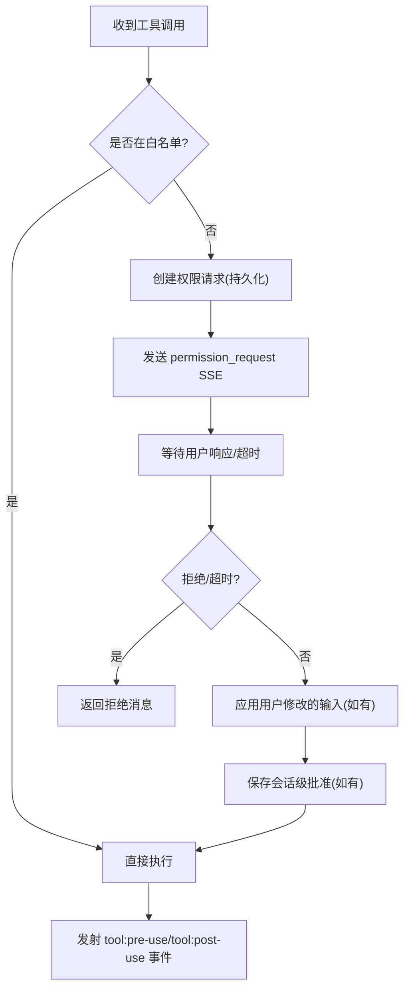
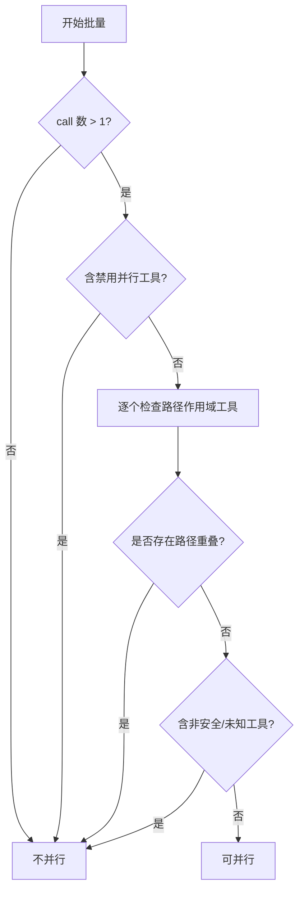
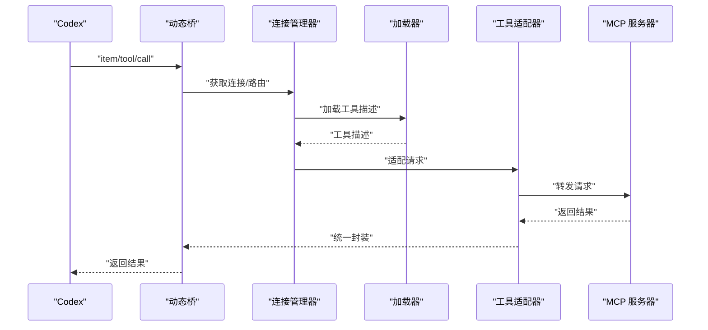
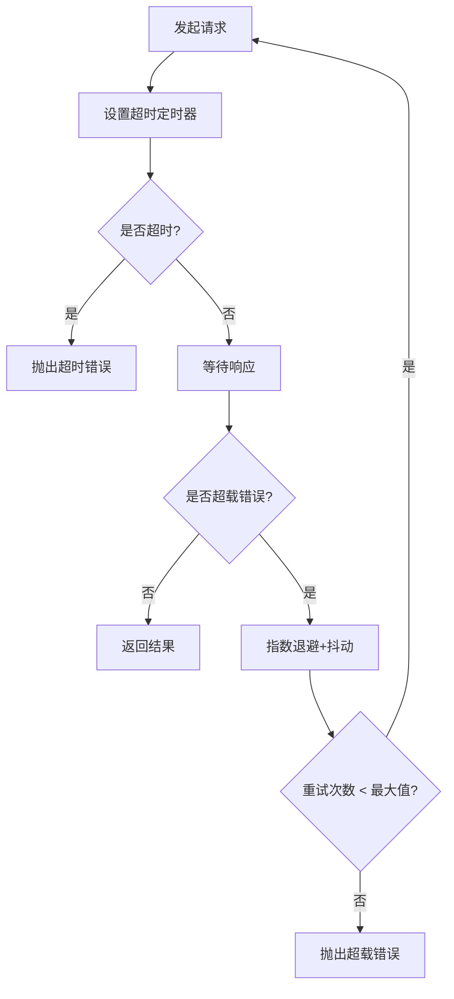
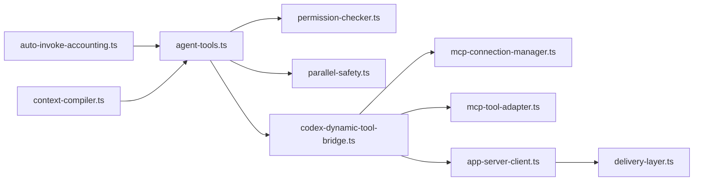

# 工具调用

<cite>
**本文引用的文件**
- [agent-tools.ts](file://src/lib/agent-tools.ts)
- [parallel-safety.ts](file://src/lib/parallel-safety.ts)
- [permission-checker.ts](file://src/lib/permission-checker.ts)
- [db.ts](file://src/lib/db.ts)
- [codex-proxy-parse-classification.ts](file://src/lib/codex/proxy/parse-request.ts)
- [codex-dynamic-tool-bridge.ts](file://src/lib/codex/dynamic-tool-bridge.ts)
- [builtin-bridge.ts](file://src/lib/codex/proxy/builtin-bridge.ts)
- [app-server-client.ts](file://src/lib/codex/app-server-client.ts)
- [codex-app-server-client.test.ts](file://src/__tests__/unit/codex-app-server-client.test.ts)
- [headless-claude.ts](file://src/lib/headless-claude.ts)
- [agent-system-prompt.ts](file://src/lib/agent-system-prompt.ts)
- [cli-tools.mdx](file://apps/site/content/docs/en/cli-tools.mdx)
- [auto-invoke-accounting.ts](file://src/lib/harness/auto-invoke-accounting.ts)
- [context-compiler.ts](file://src/lib/harness/context-compiler.ts)
- [delivery-layer.ts](file://src/lib/bridge/delivery-layer.ts)
- [mcp-loader.ts](file://src/lib/mcp-loader.ts)
- [mcp-connection-manager.ts](file://src/lib/mcp-connection-manager.ts)
- [mcp-tool-adapter.ts](file://src/lib/mcp-tool-adapter.ts)
- [builtin-mcp-catalog.ts](file://src/lib/builtin-mcp-catalog.ts)
- [builtin-mcp-bridge.ts](file://src/lib/builtin-mcp-bridge.ts)
- [cli-tools-mcp.ts](file://src/lib/cli-tools-mcp.ts)
- [image-gen-mcp.ts](file://src/lib/image-gen-mcp.ts)
- [media-import-mcp.ts](file://src/lib/media-import-mcp.ts)
- [memory-search-mcp.ts](file://src/lib/memory-search-mcp.ts)
- [notification-mcp.ts](file://src/lib/notification-mcp.ts)
- [dashboard-mcp.ts](file://src/lib/dashboard-mcp.ts)
- [openrouter-catalog.ts](file://src/lib/openrouter-catalog.ts)
- [provider-resolver.ts](file://src/lib/provider-resolver.ts)
- [provider-catalog.ts](file://src/lib/provider-catalog.ts)
- [runtime-log.ts](file://src/lib/runtime-log.ts)
- [safe-stream.ts](file://src/lib/safe-stream.ts)
- [stream-session-manager.ts](file://src/lib/stream-session-manager.ts)
- [widget-sanitizer.ts](file://src/lib/widget-sanitizer.ts)
- [widget-guidelines.ts](file://src/lib/widget-guidelines.ts)
- [builtin-tools/widget-guidelines.ts](file://src/lib/builtin-tools/widget-guidelines.ts)
- [builtin-bridge.ts](file://src/lib/codex/proxy/builtin-bridge.ts)
- [codex-proxy-parse-classification.test.ts](file://src/__tests__/unit/codex-proxy-parse-classification.test.ts)
- [parallel-safety.test.ts](file://src/__tests__/unit/parallel-safety.test.ts)
- [agent-tools-permission-allowlist.test.ts](file://src/__tests__/unit/agent-tools-permission-allowlist.test.ts)
- [headless-claude.test.ts](file://src/__tests__/unit/headless-claude.test.ts)
</cite>

## 目录
1. [引言](#引言)
2. [项目结构](#项目结构)
3. [核心组件](#核心组件)
4. [架构总览](#架构总览)
5. [详细组件分析](#详细组件分析)
6. [依赖关系分析](#依赖关系分析)
7. [性能考量](#性能考量)
8. [故障排查指南](#故障排查指南)
9. [结论](#结论)
10. [附录](#附录)

## 引言
本文件系统性阐述工具调用协议与实现，覆盖以下主题：
- 协议格式、参数传递与结果处理
- 工具注册、发现与调用全流程
- 同步/异步模式、超时与重试机制
- 参数校验、类型转换与错误处理
- 权限控制、安全检查与审计日志
- 性能优化、并发控制与资源管理
- 实际调用示例与最佳实践

## 项目结构
工具调用体系横跨运行时、代理桥接、MCP 通道与前端 UI，主要模块包括：
- 运行时与代理层：工具注册、包装、权限与并发控制
- MCP 通道：内置与动态工具发现、调用与适配
- 请求解析与分类：响应式请求解析、工具类型识别
- 错误与重试：应用服务器客户端的超载重试与错误分类
- 并发与安全：并行安全判定与串行化门控
- 审计与计费：自动调用快照与上下文记账
- 日志与流：运行时日志、安全流与会话管理

图表来源
- [agent-tools.ts](file://src/lib/agent-tools.ts)
- [permission-checker.ts](file://src/lib/permission-checker.ts)
- [parallel-safety.ts](file://src/lib/parallel-safety.ts)
- [codex-proxy-parse-classification.ts](file://src/lib/codex/proxy/parse-request.ts)
- [codex-dynamic-tool-bridge.ts](file://src/lib/codex/dynamic-tool-bridge.ts)
- [builtin-bridge.ts](file://src/lib/codex/proxy/builtin-bridge.ts)
- [mcp-connection-manager.ts](file://src/lib/mcp-connection-manager.ts)
- [mcp-loader.ts](file://src/lib/mcp-loader.ts)
- [mcp-tool-adapter.ts](file://src/lib/mcp-tool-adapter.ts)
- [builtin-mcp-bridge.ts](file://src/lib/builtin-mcp-bridge.ts)
- [builtin-mcp-catalog.ts](file://src/lib/builtin-mcp-catalog.ts)
- [app-server-client.ts](file://src/lib/codex/app-server-client.ts)
- [delivery-layer.ts](file://src/lib/bridge/delivery-layer.ts)
- [auto-invoke-accounting.ts](file://src/lib/harness/auto-invoke-accounting.ts)
- [context-compiler.ts](file://src/lib/harness/context-compiler.ts)

章节来源
- [agent-tools.ts](file://src/lib/agent-tools.ts)
- [parallel-safety.ts](file://src/lib/parallel-safety.ts)
- [permission-checker.ts](file://src/lib/permission-checker.ts)
- [codex-proxy-parse-classification.ts](file://src/lib/codex/proxy/parse-request.ts)
- [codex-dynamic-tool-bridge.ts](file://src/lib/codex/dynamic-tool-bridge.ts)
- [builtin-bridge.ts](file://src/lib/codex/proxy/builtin-bridge.ts)
- [mcp-connection-manager.ts](file://src/lib/mcp-connection-manager.ts)
- [mcp-loader.ts](file://src/lib/mcp-loader.ts)
- [mcp-tool-adapter.ts](file://src/lib/mcp-tool-adapter.ts)
- [builtin-mcp-bridge.ts](file://src/lib/builtin-mcp-bridge.ts)
- [builtin-mcp-catalog.ts](file://src/lib/builtin-mcp-catalog.ts)
- [app-server-client.ts](file://src/lib/codex/app-server-client.ts)
- [delivery-layer.ts](file://src/lib/bridge/delivery-layer.ts)
- [auto-invoke-accounting.ts](file://src/lib/harness/auto-invoke-accounting.ts)
- [context-compiler.ts](file://src/lib/harness/context-compiler.ts)

## 核心组件
- 工具注册与包装：在工具注册中心统一包装 execute，注入权限检查、输入校验、事件发射与会话级批准缓存。
- 并行安全判定：基于工具集合、路径作用域与破坏性命令的四层判定，决定批量工具调用是否可并行。
- 权限检查与审计：对非白名单工具发起权限请求，持久化待决请求，支持用户交互与自动过期。
- MCP 动态工具桥：将 Codex 动态工具调用转发至 MCP 管理器，统一封装成功/失败结果。
- 请求解析与分类：将响应式请求中的 tools 字段解析为函数型与非函数型两类，进行严格校验与类型识别。
- 应用服务器客户端：封装 JSON-RPC 请求，支持超时、超载重试与错误分类。
- 审计与计费：按工具类别聚合调用次数与输入输出字符，形成上下文记账快照。

章节来源
- [agent-tools.ts](file://src/lib/agent-tools.ts)
- [parallel-safety.ts](file://src/lib/parallel-safety.ts)
- [permission-checker.ts](file://src/lib/permission-checker.ts)
- [codex-dynamic-tool-bridge.ts](file://src/lib/codex/dynamic-tool-bridge.ts)
- [codex-proxy-parse-classification.ts](file://src/lib/codex/proxy/parse-request.ts)
- [app-server-client.ts](file://src/lib/codex/app-server-client.ts)
- [auto-invoke-accounting.ts](file://src/lib/harness/auto-invoke-accounting.ts)

## 架构总览
工具调用从“响应式请求”进入，经由解析与分类后，进入工具包装层；根据工具类型与权限策略，可能通过内置桥或 MCP 动态桥进行实际执行，并产生事件与结果；同时贯穿权限请求、并发控制与错误处理。

图表来源
- [codex-proxy-parse-classification.ts](file://src/lib/codex/proxy/parse-request.ts)
- [agent-tools.ts](file://src/lib/agent-tools.ts)
- [codex-dynamic-tool-bridge.ts](file://src/lib/codex/dynamic-tool-bridge.ts)
- [app-server-client.ts](file://src/lib/codex/app-server-client.ts)

## 详细组件分析

### 响应式请求解析与工具分类
- 解析目标：将请求体中的 tools 字段解析为函数型工具与非函数型工具两类，严格校验字段类型与取值范围。
- 关键点：
  - tools 必须为数组；数组元素必须为对象；type 为 "function" 时，name 必须为字符串；type 为其他字符串时，必须属于已知非函数类型集合。
  - unknown 类型工具将作为结构化错误返回，避免静默丢弃。
  - 保留原始 payload 以便诊断日志输出。
- 输出：返回解析结果与规范化后的 body，确保后续工具包装层仅接收合法输入。

图表来源
- [codex-proxy-parse-classification.ts](file://src/lib/codex/proxy/parse-request.ts)

章节来源
- [codex-proxy-parse-classification.ts](file://src/lib/codex/proxy/parse-request.ts)
- [codex-proxy-parse-classification.test.ts](file://src/__tests__/unit/codex-proxy-parse-classification.test.ts)

### 工具注册、发现与调用流程
- 注册：工具在注册中心以统一签名注册，包装层为每个工具注入 execute 包装。
- 发现：内置工具通过内置桥直接执行；动态工具通过 MCP 动态桥转发至 MCP 管理器。
- 调用：包装层负责权限检查、事件发射、输入校验与会话级批准缓存；执行完成后发射完成事件并返回结果。

图表来源
- [agent-tools.ts](file://src/lib/agent-tools.ts)
- [builtin-bridge.ts](file://src/lib/codex/proxy/builtin-bridge.ts)
- [codex-dynamic-tool-bridge.ts](file://src/lib/codex/dynamic-tool-bridge.ts)

章节来源
- [agent-tools.ts](file://src/lib/agent-tools.ts)
- [builtin-bridge.ts](file://src/lib/codex/proxy/builtin-bridge.ts)
- [codex-dynamic-tool-bridge.ts](file://src/lib/codex/dynamic-tool-bridge.ts)

### 权限控制、安全检查与审计日志
- 权限策略：
  - 白名单工具（如只读工具）无需审批，直接执行。
  - 非白名单工具需发起权限请求，持久化待决请求，支持用户交互与自动过期。
- 审计与日志：
  - 工具调用前后发射事件，记录 pre-use/post-use。
  - 待决权限请求持久化至数据库，支持查询、过期与状态变更。
  - 运行时日志与安全流用于诊断与监控。

图表来源
- [agent-tools.ts](file://src/lib/agent-tools.ts)
- [permission-checker.ts](file://src/lib/permission-checker.ts)
- [db.ts](file://src/lib/db.ts)
- [runtime-log.ts](file://src/lib/runtime-log.ts)
- [safe-stream.ts](file://src/lib/safe-stream.ts)

章节来源
- [agent-tools.ts](file://src/lib/agent-tools.ts)
- [permission-checker.ts](file://src/lib/permission-checker.ts)
- [db.ts](file://src/lib/db.ts)
- [runtime-log.ts](file://src/lib/runtime-log.ts)
- [safe-stream.ts](file://src/lib/safe-stream.ts)

### 并发控制与并行安全
- 判定规则（四层）：
  - 批量大小 ≤ 1 → 不并行
  - 含有禁用并行工具 → 不并行
  - 路径作用域工具检查路径重叠 → 重叠则不并行
  - 含有非安全/未知工具 → 不并行（保守策略）
- 实施方式：在工具包装层外层加互斥门控，或在 agent-loop 的工具事件层维护当前 step 的工具调用列表，结合判定函数决定是否顺序等待。

图表来源
- [parallel-safety.ts](file://src/lib/parallel-safety.ts)
- [agent-tools.ts](file://src/lib/agent-tools.ts)

章节来源
- [parallel-safety.ts](file://src/lib/parallel-safety.ts)
- [parallel-safety.test.ts](file://src/__tests__/unit/parallel-safety.test.ts)
- [agent-tools.ts](file://src/lib/agent-tools.ts)

### MCP 工具调用与适配
- 动态工具桥：将 Codex 的动态工具调用转发至 MCP 管理器，统一封装结果，失败时返回友好文本。
- MCP 适配与连接：MCP 工具适配器与连接管理器负责与外部 MCP 服务器建立连接、分发请求与处理通知。
- 内置 MCP 桥：内置 MCP 目录与桥接负责内置工具的发现与调用。

图表来源
- [codex-dynamic-tool-bridge.ts](file://src/lib/codex/dynamic-tool-bridge.ts)
- [mcp-connection-manager.ts](file://src/lib/mcp-connection-manager.ts)
- [mcp-loader.ts](file://src/lib/mcp-loader.ts)
- [mcp-tool-adapter.ts](file://src/lib/mcp-tool-adapter.ts)
- [builtin-mcp-bridge.ts](file://src/lib/builtin-mcp-bridge.ts)
- [builtin-mcp-catalog.ts](file://src/lib/builtin-mcp-catalog.ts)

章节来源
- [codex-dynamic-tool-bridge.ts](file://src/lib/codex/dynamic-tool-bridge.ts)
- [mcp-connection-manager.ts](file://src/lib/mcp-connection-manager.ts)
- [mcp-loader.ts](file://src/lib/mcp-loader.ts)
- [mcp-tool-adapter.ts](file://src/lib/mcp-tool-adapter.ts)
- [builtin-mcp-bridge.ts](file://src/lib/builtin-mcp-bridge.ts)
- [builtin-mcp-catalog.ts](file://src/lib/builtin-mcp-catalog.ts)

### 同步/异步模式、超时与重试
- 同步/异步：内置工具通常同步执行；动态工具通过 MCP 异步调用，结果通过事件回传。
- 超时：应用服务器客户端支持 per-request 超时配置。
- 重试：对特定超载错误码进行指数退避重试，达到最大次数后上抛错误。

图表来源
- [app-server-client.ts](file://src/lib/codex/app-server-client.ts)
- [codex-app-server-client.test.ts](file://src/__tests__/unit/codex-app-server-client.test.ts)
- [delivery-layer.ts](file://src/lib/bridge/delivery-layer.ts)

章节来源
- [app-server-client.ts](file://src/lib/codex/app-server-client.ts)
- [codex-app-server-client.test.ts](file://src/__tests__/unit/codex-app-server-client.test.ts)
- [delivery-layer.ts](file://src/lib/bridge/delivery-layer.ts)

### 参数验证、类型转换与错误处理
- 输入校验：工具包装层对输入进行 Zod schema 校验，必要时进行类型转换。
- 错误处理：内置工具与动态工具均捕获异常，返回结构化错误文本；应用服务器客户端对错误进行分类与重试决策。
- 诊断日志：保留原始 payload，便于诊断与审计。

章节来源
- [agent-tools.ts](file://src/lib/agent-tools.ts)
- [codex-proxy-parse-classification.ts](file://src/lib/codex/proxy/parse-request.ts)
- [app-server-client.ts](file://src/lib/codex/app-server-client.ts)

### 审计日志与计费
- 自动调用快照：按工具类别聚合调用次数与输入输出字符，形成上下文记账快照。
- 上下文编译：在上下文编译阶段收集工具使用统计，支持规则注入与去重。

章节来源
- [auto-invoke-accounting.ts](file://src/lib/harness/auto-invoke-accounting.ts)
- [context-compiler.ts](file://src/lib/harness/context-compiler.ts)

## 依赖关系分析
- 工具包装层依赖权限检查与并行安全模块，确保每次调用满足策略约束。
- 动态工具桥依赖 MCP 连接管理器与工具适配器，实现跨服务调用。
- 应用服务器客户端为 MCP 与内置工具提供统一的 JSON-RPC 传输层。
- 审计与日志贯穿全链路，保障可观测性与合规性。

图表来源
- [agent-tools.ts](file://src/lib/agent-tools.ts)
- [permission-checker.ts](file://src/lib/permission-checker.ts)
- [parallel-safety.ts](file://src/lib/parallel-safety.ts)
- [codex-dynamic-tool-bridge.ts](file://src/lib/codex/dynamic-tool-bridge.ts)
- [mcp-connection-manager.ts](file://src/lib/mcp-connection-manager.ts)
- [mcp-tool-adapter.ts](file://src/lib/mcp-tool-adapter.ts)
- [app-server-client.ts](file://src/lib/codex/app-server-client.ts)
- [delivery-layer.ts](file://src/lib/bridge/delivery-layer.ts)
- [auto-invoke-accounting.ts](file://src/lib/harness/auto-invoke-accounting.ts)
- [context-compiler.ts](file://src/lib/harness/context-compiler.ts)

## 性能考量
- 并行安全：通过四层判定减少不必要的串行，最大化并行效率。
- 指数退避与抖动：降低拥塞，提升整体吞吐。
- 事件驱动：内置工具与动态工具均通过事件回传结果，避免阻塞等待。
- 计费与上下文压缩：通过自动调用快照与上下文编译，控制成本与延迟。

## 故障排查指南
- 工具未执行：检查代理与 MCP 配置，确认工具可用性与权限；查看 headless 运行器的完整性检查与错误信息。
- 权限请求未响应：检查待决请求状态与过期时间，确认用户交互路径是否可达。
- 超时与超载：调整超时与重试配置，观察错误分类与日志定位瓶颈。
- 结果不一致：核对工具调用事件数量与结果数量，确保每条工具调用都有对应结果事件。

章节来源
- [headless-claude.ts](file://src/lib/headless-claude.ts)
- [db.ts](file://src/lib/db.ts)
- [app-server-client.ts](file://src/lib/codex/app-server-client.ts)
- [headless-claude.test.ts](file://src/__tests__/unit/headless-claude.test.ts)

## 结论
本系统通过严格的请求解析、统一的工具包装、完善的权限与并发控制、以及稳健的 MCP 通道与错误处理，实现了高可靠、可审计、可扩展的工具调用体系。建议在生产中启用并行安全判定、合理配置超时与重试，并持续完善审计与日志策略。

## 附录
- 最佳实践
  - 描述目标而非命令：在 CLI 工具场景中，优先描述目标而非具体命令，让系统选择最优参数。
  - 组合多个工具：将多个工具串联为工作流，提升效率。
  - 使用示例提示：从工具详情页的示例提示入手，快速上手常见用例。
- 示例参考
  - CLI 工具描述接口与示例提示设计，体现工具兼容性评估与多语言支持。

章节来源
- [cli-tools.mdx](file://apps/site/content/docs/en/cli-tools.mdx)