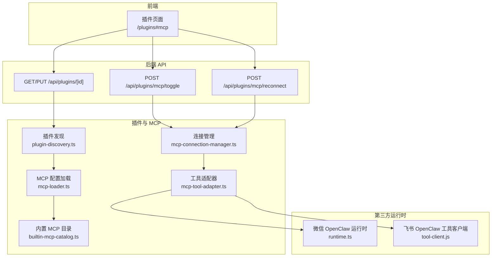
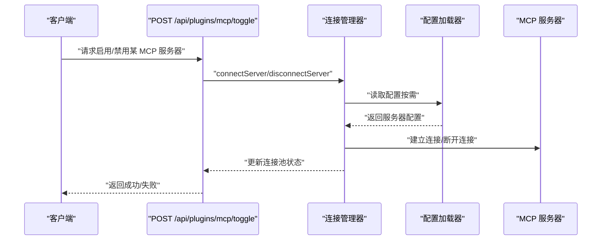
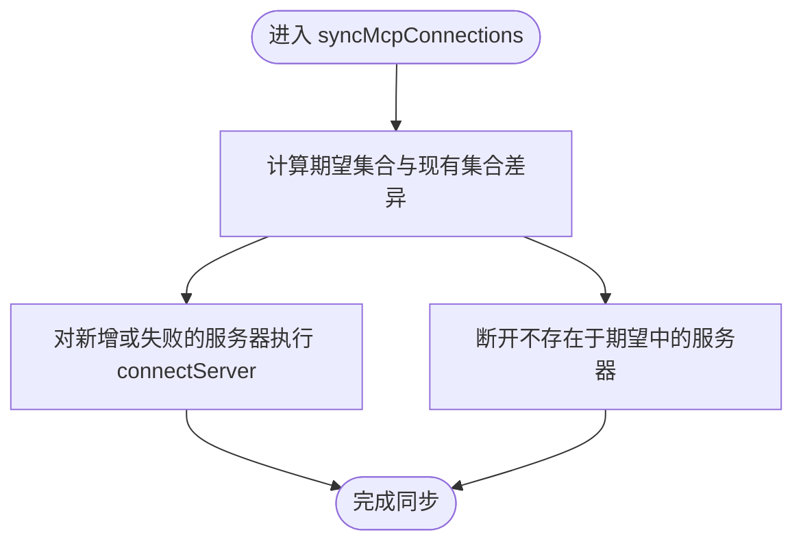
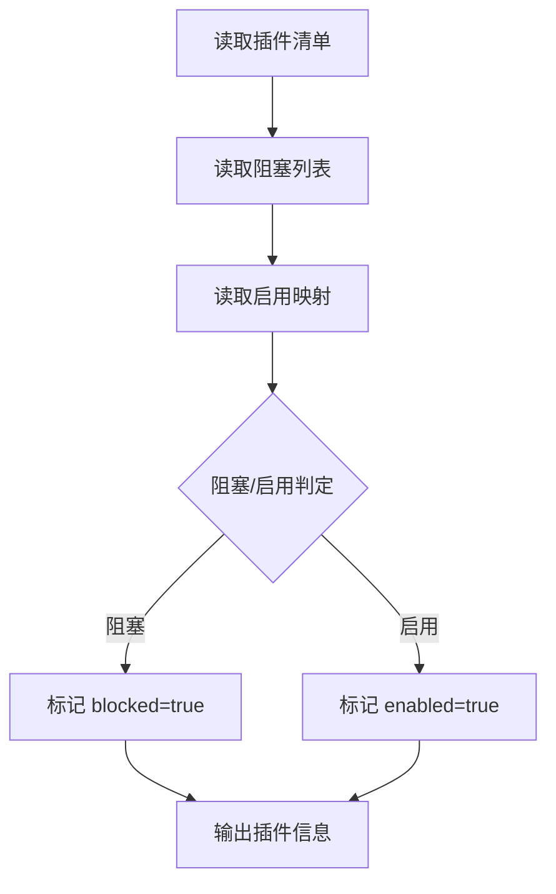
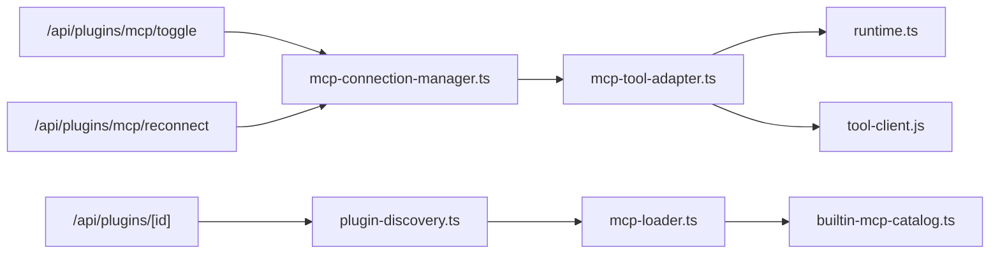

# 插件 API

<cite>
**本文引用的文件**
- [mcp-connection-manager.ts](file://src/lib/mcp-connection-manager.ts)
- [mcp-loader.ts](file://src/lib/mcp-loader.ts)
- [builtin-mcp-catalog.ts](file://src/lib/builtin-mcp-catalog.ts)
- [mcp-tool-adapter.ts](file://src/lib/mcp-tool-adapter.ts)
- [plugin-discovery.ts](file://src/lib/plugin-discovery.ts)
- [route.ts（插件启用/禁用）](file://src/app/api/plugins/[id]/route.ts)
- [route.ts（MCP 切换）](file://src/app/api/plugins/mcp/toggle/route.ts)
- [route.ts（MCP 重连）](file://src/app/api/plugins/mcp/reconnect/route.ts)
- [page.tsx（MCP 页面重定向）](file://src/app/plugins/mcp/page.tsx)
- [runtime.ts（微信 OpenClaw 运行时）](file://资料/weixin-openclaw-package/package/src/runtime.ts)
- [tool-client.js（飞书 OpenClaw 工具客户端）](file://资料/feishu-openclaw-plugin/package/src/core/tool-client.js)
- [provider-proxy-bridge.md（AI SDK v6 工具规范）](file://docs/handover/provider-proxy-bridge.md)
</cite>

## 目录
1. [简介](#简介)
2. [项目结构](#项目结构)
3. [核心组件](#核心组件)
4. [架构总览](#架构总览)
5. [组件详解](#组件详解)
6. [依赖关系分析](#依赖关系分析)
7. [性能考量](#性能考量)
8. [故障排查指南](#故障排查指南)
9. [结论](#结论)
10. [附录](#附录)

## 简介
本文件面向插件系统与 MCP（Model Context Protocol）协议的 API 文档，覆盖插件发现、连接管理、工具调用、状态监控、生命周期管理、错误处理与性能监控，并补充配置、权限控制与安全验证的实现细节。文档同时提供插件开发与集成示例路径，帮助开发者快速上手。

## 项目结构
围绕插件与 MCP 的相关模块主要分布在以下位置：
- 连接与工具调用：src/lib/mcp-connection-manager.ts、src/lib/mcp-tool-adapter.ts
- 配置加载与内置目录：src/lib/mcp-loader.ts、src/lib/builtin-mcp-catalog.ts
- 插件发现与启用/禁用：src/lib/plugin-discovery.ts、src/app/api/plugins/[id]/route.ts
- MCP 后端控制接口：src/app/api/plugins/mcp/toggle/route.ts、src/app/api/plugins/mcp/reconnect/route.ts
- 前端页面重定向：src/app/plugins/mcp/page.tsx
- 第三方运行时与工具客户端：资料/weixin-openclaw-package/package/src/runtime.ts、资料/feishu-openclaw-plugin/package/src/core/tool-client.js
- 工具输入规范参考：docs/handover/provider-proxy-bridge.md

图表来源
- [mcp-connection-manager.ts:45-163](file://src/lib/mcp-connection-manager.ts#L45-L163)
- [mcp-loader.ts](file://src/lib/mcp-loader.ts)
- [builtin-mcp-catalog.ts](file://src/lib/builtin-mcp-catalog.ts)
- [mcp-tool-adapter.ts](file://src/lib/mcp-tool-adapter.ts)
- [plugin-discovery.ts:355-379](file://src/lib/plugin-discovery.ts#L355-L379)
- [route.ts（MCP 切换）:13-34](file://src/app/api/plugins/mcp/toggle/route.ts#L13-L34)
- [route.ts（MCP 重连）:17-35](file://src/app/api/plugins/mcp/reconnect/route.ts#L17-L35)
- [route.ts（插件启用/禁用）:33-101](file://src/app/api/plugins/[id]/route.ts#L33-L101)
- [runtime.ts（微信 OpenClaw 运行时）:12-44](file://资料/weixin-openclaw-package/package/src/runtime.ts#L12-L44)
- [tool-client.js（飞书 OpenClaw 工具客户端）:144-166](file://资料/feishu-openclaw-plugin/package/src/core/tool-client.js#L144-L166)

章节来源
- [mcp-connection-manager.ts:45-163](file://src/lib/mcp-connection-manager.ts#L45-L163)
- [mcp-loader.ts](file://src/lib/mcp-loader.ts)
- [builtin-mcp-catalog.ts](file://src/lib/builtin-mcp-catalog.ts)
- [mcp-tool-adapter.ts](file://src/lib/mcp-tool-adapter.ts)
- [plugin-discovery.ts:355-379](file://src/lib/plugin-discovery.ts#L355-L379)
- [route.ts（MCP 切换）:13-34](file://src/app/api/plugins/mcp/toggle/route.ts#L13-L34)
- [route.ts（MCP 重连）:17-35](file://src/app/api/plugins/mcp/reconnect/route.ts#L17-L35)
- [route.ts（插件启用/禁用）:33-101](file://src/app/api/plugins/[id]/route.ts#L33-L101)
- [page.tsx（MCP 页面重定向）:11-17](file://src/app/plugins/mcp/page.tsx#L11-L17)
- [runtime.ts（微信 OpenClaw 运行时）:12-44](file://资料/weixin-openclaw-package/package/src/runtime.ts#L12-L44)
- [tool-client.js（飞书 OpenClaw 工具客户端）:144-166](file://资料/feishu-openclaw-plugin/package/src/core/tool-client.js#L144-L166)

## 核心组件
- 连接管理器：负责 MCP 服务器的连接、断开、同步、工具发现与调用。
- 配置加载器：从配置中读取 MCP 服务器列表，支持内置目录与外部服务器。
- 工具适配器：将 MCP 工具定义转换为统一的工具调用接口。
- 插件发现与启用/禁用：解析插件清单、合并启用配置、写入启用状态。
- 后端 API：提供切换、重连与插件启停的 HTTP 接口。
- 第三方运行时与客户端：为特定平台提供运行时注入与工具调用封装。

章节来源
- [mcp-connection-manager.ts:45-163](file://src/lib/mcp-connection-manager.ts#L45-L163)
- [mcp-loader.ts](file://src/lib/mcp-loader.ts)
- [mcp-tool-adapter.ts](file://src/lib/mcp-tool-adapter.ts)
- [plugin-discovery.ts:355-379](file://src/lib/plugin-discovery.ts#L355-L379)
- [route.ts（MCP 切换）:13-34](file://src/app/api/plugins/mcp/toggle/route.ts#L13-L34)
- [route.ts（MCP 重连）:17-35](file://src/app/api/plugins/mcp/reconnect/route.ts#L17-L35)
- [route.ts（插件启用/禁用）:33-101](file://src/app/api/plugins/[id]/route.ts#L33-L101)

## 架构总览
MCP 插件系统以“配置驱动 + 连接池 + 工具适配”的方式组织。后端通过 API 控制连接状态；连接管理器维护连接池与工具清单；工具适配器将 MCP 工具暴露为统一调用接口；插件发现模块负责启用/禁用策略与持久化。

图表来源
- [route.ts（MCP 切换）:13-34](file://src/app/api/plugins/mcp/toggle/route.ts#L13-L34)
- [mcp-connection-manager.ts:69-119](file://src/lib/mcp-connection-manager.ts#L69-L119)
- [mcp-loader.ts](file://src/lib/mcp-loader.ts)

## 组件详解

### 连接管理器（MCP）
职责
- 维护服务器连接池，支持新增、断开、同步。
- 提供工具发现与调用接口。
- 暴露连接状态查询。

关键函数与行为
- 同步连接池：根据期望配置连接新服务器、断开移除的服务器。
- 连接/断开：建立连接并缓存客户端实例，断开时关闭底层连接。
- 工具调用：在已连接状态下调用指定工具，传入参数字典。
- 工具聚合：汇总所有已连接服务器的工具定义。
- 状态查询：返回每个服务器的状态、工具数量及可选错误信息。

图表来源
- [mcp-connection-manager.ts:45-64](file://src/lib/mcp-connection-manager.ts#L45-L64)

章节来源
- [mcp-connection-manager.ts:45-163](file://src/lib/mcp-connection-manager.ts#L45-L163)

### 配置加载器与内置目录
职责
- 从配置中读取 MCP 服务器列表。
- 提供内置 MCP 服务器名称集合，用于区分内/外置服务器。

关键点
- 外置服务器通过配置加载；内置服务器由运行时直接提供，无需外部连接。
- 重连接口对内置服务器进行显式拒绝，避免误操作。

章节来源
- [mcp-loader.ts](file://src/lib/mcp-loader.ts)
- [builtin-mcp-catalog.ts](file://src/lib/builtin-mcp-catalog.ts)
- [route.ts（MCP 重连）:25-34](file://src/app/api/plugins/mcp/reconnect/route.ts#L25-L34)

### 工具适配器
职责
- 将 MCP 工具定义转换为统一的工具调用接口，供上层使用。
- 与第三方运行时（如微信 OpenClaw）协作，提供通道运行时解析能力。

关键点
- 适配器依赖连接管理器提供的工具清单与客户端实例。
- 运行时解析优先使用网关注入的通道运行时，回退到全局设置或等待初始化。

章节来源
- [mcp-tool-adapter.ts](file://src/lib/mcp-tool-adapter.ts)
- [runtime.ts（微信 OpenClaw 运行时）:53-70](file://资料/weixin-openclaw-package/package/src/runtime.ts#L53-L70)

### 插件发现与启用/禁用
职责
- 解析插件清单，合并启用配置，生成最终启用状态。
- 提供启用/禁用接口，写入启用值并返回生效层级与是否升级。

关键流程
- 读取阻塞列表与启用映射，按优先级判定启用状态。
- 对启用操作保留版本约束数组，禁用写入布尔值 false。
- 后端接口校验参数、查找插件、拒绝被阻塞的插件，并写入启用状态。

图表来源
- [plugin-discovery.ts:355-379](file://src/lib/plugin-discovery.ts#L355-L379)

章节来源
- [plugin-discovery.ts:197-393](file://src/lib/plugin-discovery.ts#L197-L393)
- [route.ts（插件启用/禁用）:33-101](file://src/app/api/plugins/[id]/route.ts#L33-L101)

### 后端 API（MCP 控制）
- POST /api/plugins/mcp/toggle
  - 功能：启用或禁用某个 MCP 服务器。
  - 行为：立即断开或按需读取配置后连接；禁用即时生效，启用在下一条消息时同步。
  - 参数：serverName（字符串）、enabled（布尔）。
  - 返回：成功或错误信息。
- POST /api/plugins/mcp/reconnect
  - 功能：重连指定 MCP 服务器。
  - 行为：内置服务器拒绝重连；否则执行预检与重连。
  - 参数：serverName（字符串）。
  - 返回：成功或错误信息。

章节来源
- [route.ts（MCP 切换）:13-34](file://src/app/api/plugins/mcp/toggle/route.ts#L13-L34)
- [route.ts（MCP 重连）:17-35](file://src/app/api/plugins/mcp/reconnect/route.ts#L17-L35)

### 后端 API（插件启停）
- GET /api/plugins/[id]
  - 功能：查询指定插件信息。
  - 参数：id（name@marketplace）。
  - 返回：插件详情。
- PUT /api/plugins/[id]
  - 功能：启用/禁用插件。
  - 参数：enabled（布尔），可选 cwd（工作目录）。
  - 返回：success、layer、escalated 等。

章节来源
- [route.ts（插件启用/禁用）:33-101](file://src/app/api/plugins/[id]/route.ts#L33-L101)

### 前端页面重定向
- /plugins/mcp → /plugins#mcp
  - 作用：兼容旧链接，重定向至统一插件页面的 MCP 标签页。

章节来源
- [page.tsx（MCP 页面重定向）:11-17](file://src/app/plugins/mcp/page.tsx#L11-L17)

### 第三方运行时与工具客户端
- 微信 OpenClaw 运行时
  - 提供全局运行时设置与获取，支持异步等待初始化。
  - 提供通道运行时解析，优先使用网关上下文注入的运行时。
- 飞书 OpenClaw 工具客户端
  - 统一 API 调用入口，自动处理 UAT/TAT、scope 校验、错误抛出与重试。

章节来源
- [runtime.ts（微信 OpenClaw 运行时）:12-44](file://资料/weixin-openclaw-package/package/src/runtime.ts#L12-L44)
- [tool-client.js（飞书 OpenClaw 工具客户端）:144-166](file://资料/feishu-openclaw-plugin/package/src/core/tool-client.js#L144-L166)

## 依赖关系分析
- 连接管理器依赖配置加载器与内置目录，以决定是否需要外部连接。
- 工具适配器依赖连接管理器提供的工具清单与客户端。
- 后端 API 直接调用连接管理器与插件发现模块。
- 第三方运行时与工具客户端作为适配层，与工具适配器协同工作。

图表来源
- [route.ts（MCP 切换）:21-31](file://src/app/api/plugins/mcp/toggle/route.ts#L21-L31)
- [route.ts（MCP 重连）:17-35](file://src/app/api/plugins/mcp/reconnect/route.ts#L17-L35)
- [route.ts（插件启用/禁用）:74-94](file://src/app/api/plugins/[id]/route.ts#L74-L94)
- [mcp-connection-manager.ts:45-163](file://src/lib/mcp-connection-manager.ts#L45-L163)
- [mcp-loader.ts](file://src/lib/mcp-loader.ts)
- [builtin-mcp-catalog.ts](file://src/lib/builtin-mcp-catalog.ts)
- [mcp-tool-adapter.ts](file://src/lib/mcp-tool-adapter.ts)
- [runtime.ts（微信 OpenClaw 运行时）:53-70](file://资料/weixin-openclaw-package/package/src/runtime.ts#L53-L70)
- [tool-client.js（飞书 OpenClaw 工具客户端）:144-166](file://资料/feishu-openclaw-plugin/package/src/core/tool-client.js#L144-L166)

## 性能考量
- 连接池同步：仅在配置变更或连接失败时重建连接，减少频繁握手。
- 工具调用：在已连接状态下直接转发，避免重复序列化与网络往返。
- 状态聚合：按连接状态汇总工具清单，降低查询成本。
- 异步等待：第三方运行时采用轮询等待，避免阻塞主线程。

章节来源
- [mcp-connection-manager.ts:45-163](file://src/lib/mcp-connection-manager.ts#L45-L163)
- [runtime.ts（微信 OpenClaw 运行时）:33-44](file://资料/weixin-openclaw-package/package/src/runtime.ts#L33-L44)

## 故障排查指南
常见问题与定位
- MCP 服务器不可用
  - 检查连接状态与错误信息；确认服务器配置正确且可达。
  - 对内置服务器使用重连接口会返回明确错误，应改为检查配置。
- 工具调用失败
  - 确认服务器处于已连接状态；核对工具名与参数格式。
  - 若出现“工具未找到”，检查工具清单与命名一致性。
- 插件启用/禁用无效
  - 核对插件 ID 格式（name@marketplace）；确认未被阻塞。
  - 查看返回的 layer 与 escalated，确认写入层级与是否提升。

章节来源
- [route.ts（MCP 切换）:13-34](file://src/app/api/plugins/mcp/toggle/route.ts#L13-L34)
- [route.ts（MCP 重连）:17-35](file://src/app/api/plugins/mcp/reconnect/route.ts#L17-L35)
- [route.ts（插件启用/禁用）:33-101](file://src/app/api/plugins/[id]/route.ts#L33-L101)
- [mcp-connection-manager.ts:124-140](file://src/lib/mcp-connection-manager.ts#L124-L140)

## 结论
该插件系统以配置驱动与连接池为核心，结合统一的工具适配层与后端 API，实现了 MCP 服务器的发现、连接、工具调用与状态监控。通过插件发现与启用/禁用机制，系统支持灵活的版本与权限控制。第三方运行时与工具客户端进一步增强了跨平台集成能力。建议在生产环境中配合日志与监控，持续优化连接与调用性能。

## 附录

### MCP 工具调用协议与参数规范
- 调用入口
  - 服务器名称：字符串标识。
  - 工具名称：字符串标识。
  - 参数：键值对字典，遵循工具定义的输入模式。
- 结果处理
  - 成功：返回工具执行结果。
  - 失败：抛出错误或返回结构化错误码（参考 AI SDK v6 工具规范）。

章节来源
- [mcp-connection-manager.ts:124-140](file://src/lib/mcp-connection-manager.ts#L124-L140)
- [provider-proxy-bridge.md（AI SDK v6 工具规范）:64-84](file://docs/handover/provider-proxy-bridge.md#L64-L84)

### 插件生命周期与版本管理
- 生命周期
  - 发现：读取插件清单与阻塞列表。
  - 启用/禁用：写入启用映射，保留版本约束数组（启用时）。
  - 生效：按层级合并，返回生效层级与是否升级。
- 版本管理
  - 启用时若存在版本约束数组则保留；禁用写入布尔值 false。

章节来源
- [plugin-discovery.ts:389-393](file://src/lib/plugin-discovery.ts#L389-L393)
- [route.ts（插件启用/禁用）:88-94](file://src/app/api/plugins/[id]/route.ts#L88-L94)

### 安全与权限控制
- 插件阻塞
  - 被阻塞的插件无法启用，后端返回 403。
- 工具调用权限
  - 第三方工具客户端自动校验应用与用户 scope，不足时抛出结构化错误。
- 运行时注入
  - 通道运行时优先使用网关上下文注入，避免竞态与全局状态不一致。

章节来源
- [route.ts（插件启用/禁用）:81-86](file://src/app/api/plugins/[id]/route.ts#L81-L86)
- [tool-client.js（飞书 OpenClaw 工具客户端）:144-166](file://资料/feishu-openclaw-plugin/package/src/core/tool-client.js#L144-L166)
- [runtime.ts（微信 OpenClaw 运行时）:53-70](file://资料/weixin-openclaw-package/package/src/runtime.ts#L53-L70)

### 开发与集成示例
- 启用/禁用 MCP 服务器
  - 使用 POST /api/plugins/mcp/toggle，传入 serverName 与 enabled。
- 重连 MCP 服务器
  - 使用 POST /api/plugins/mcp/reconnect，传入 serverName（内置服务器会被拒绝）。
- 查询/修改插件启用状态
  - 使用 GET /api/plugins/[id] 获取信息；使用 PUT /api/plugins/[id] 修改 enabled。
- 工具调用
  - 通过连接管理器提供的工具调用接口，传入服务器名、工具名与参数字典。

章节来源
- [route.ts（MCP 切换）:13-34](file://src/app/api/plugins/mcp/toggle/route.ts#L13-L34)
- [route.ts（MCP 重连）:17-35](file://src/app/api/plugins/mcp/reconnect/route.ts#L17-L35)
- [route.ts（插件启用/禁用）:33-101](file://src/app/api/plugins/[id]/route.ts#L33-L101)
- [mcp-connection-manager.ts:124-140](file://src/lib/mcp-connection-manager.ts#L124-L140)