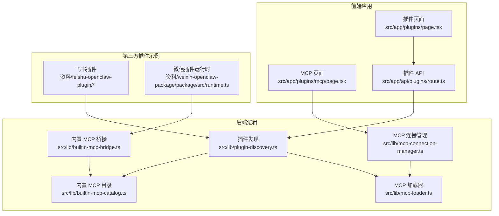
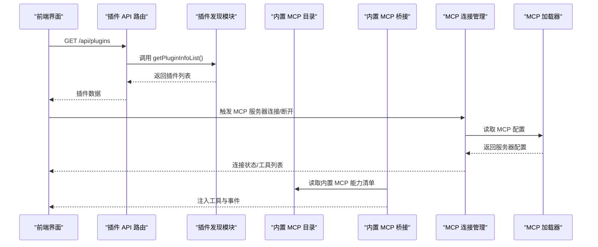
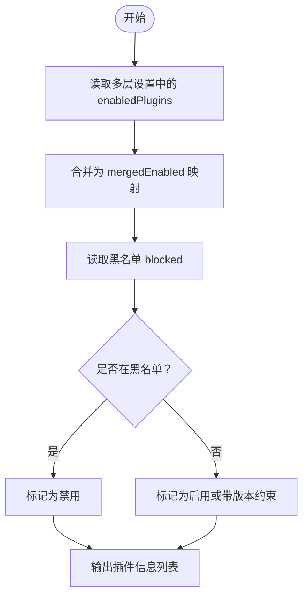
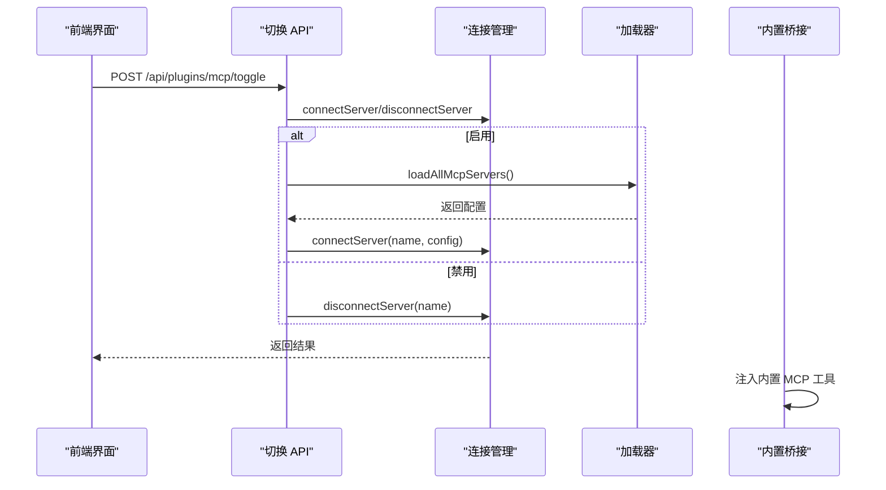
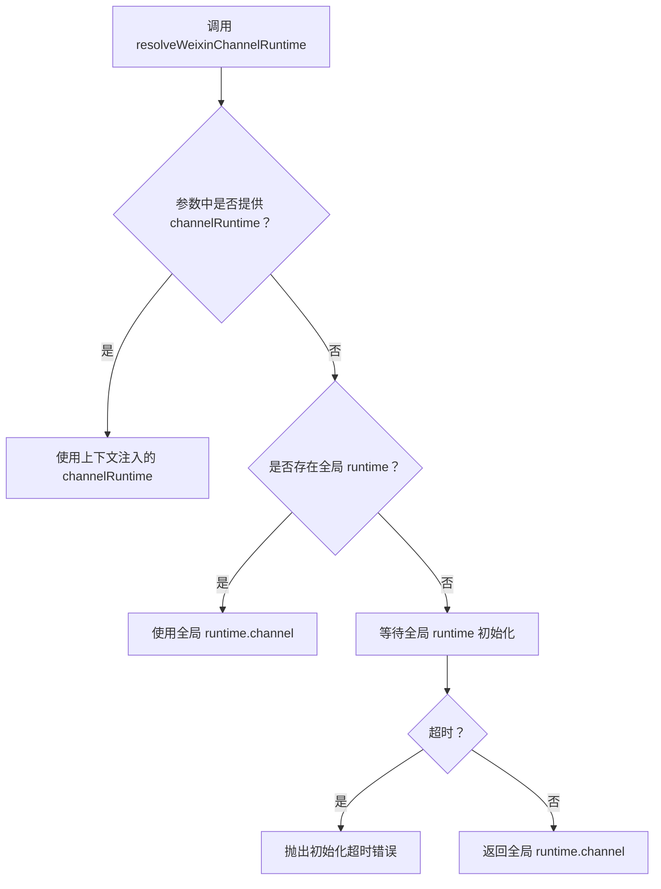
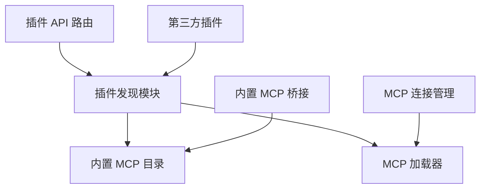

# 插件开发

<cite>
**本文引用的文件**
- [README.md](file://README.md)
- [package.json](file://package.json)
- [src/app/api/plugins/route.ts](file://src/app/api/plugins/route.ts)
- [src/app/api/plugins/mcp/toggle/route.ts](file://src/app/api/plugins/mcp/toggle/route.ts)
- [src/app/api/plugins/mcp/reconnect/route.ts](file://src/app/api/plugins/mcp/reconnect/route.ts)
- [src/lib/plugin-discovery.ts](file://src/lib/plugin-discovery.ts)
- [src/lib/mcp-connection-manager.ts](file://src/lib/mcp-connection-manager.ts)
- [src/lib/builtin-mcp-catalog.ts](file://src/lib/builtin-mcp-catalog.ts)
- [src/lib/builtin-mcp-bridge.ts](file://src/lib/builtin-mcp-bridge.ts)
- [src/lib/mcp-loader.ts](file://src/lib/mcp-loader.ts)
- [src/components/plugins/page.tsx](file://src/components/plugins/page.tsx)
- [src/app/plugins/page.tsx](file://src/app/plugins/page.tsx)
- [src/app/plugins/mcp/page.tsx](file://src/app/plugins/mcp/page.tsx)
- [src/__tests__/e2e/plugins.spec.ts](file://src/__tests__/e2e/plugins.spec.ts)
- [src/__tests__/unit/codex-builtin-bridge.test.ts](file://src/__tests__/unit/codex-builtin-bridge.test.ts)
- [src/__tests__/unit/codex-mcp-events.test.ts](file://src/__tests__/unit/codex-mcp-events.test.ts)
- [src/__tests__/unit/codex-mcp-injection.test.ts](file://src/__tests__/unit/codex-mcp-injection.test.ts)
- [src/__tests__/unit/builtin-mcp-catalog.test.ts](file://src/__tests__/unit/builtin-mcp-catalog.test.ts)
- [资料/weixin-openclaw-package/package/src/runtime.ts](file://资料/weixin-openclaw-package/package/src/runtime.ts)
- [资料/feishu-openclaw-plugin/openclaw.plugin.json](file://资料/feishu-openclaw-plugin/openclaw.plugin.json)
- [资料/feishu-openclaw-plugin/package.json](file://资料/feishu-openclaw-plugin/package.json)
- [资料/feishu-openclaw-plugin/index.d.ts](file://资料/feishu-openclaw-plugin/index.d.ts)
- [资料/feishu-openclaw-plugin/src/index.ts](file://资料/feishu-openclaw-plugin/src/index.ts)
- [资料/feishu-openclaw-plugin/skills/README.md](file://资料/feishu-openclaw-plugin/skills/README.md)
</cite>

## 目录
1. [简介](#简介)
2. [项目结构](#项目结构)
3. [核心组件](#核心组件)
4. [架构总览](#架构总览)
5. [详细组件分析](#详细组件分析)
6. [依赖分析](#依赖分析)
7. [性能考虑](#性能考虑)
8. [故障排除指南](#故障排除指南)
9. [结论](#结论)
10. [附录](#附录)

## 简介
本指南面向希望基于本项目进行插件开发的工程师与技术作者。内容覆盖从环境准备、工具链配置到插件项目结构设计、代码规范与最佳实践；从插件接口实现、事件处理与回调机制到调试技巧、测试策略与性能优化；并提供发布流程、版本管理与分发机制的实操建议。同时，文档展示了内置插件与第三方插件的实现示例，并给出常见问题的排查方案。

## 项目结构
本项目采用前后端一体化的 Next.js 应用与 Electron 主进程架构，插件体系围绕“插件发现与注册、MCP（Model Context Protocol）桥接与连接管理、内置 MCP 能力目录”三大模块构建。前端通过 API 路由加载插件信息，后端通过插件发现模块扫描外部插件目录并解析清单文件；MCP 服务器通过连接管理器统一维护连接状态与工具注入。

图表来源
- [src/app/plugins/page.tsx](file://src/app/plugins/page.tsx)
- [src/app/plugins/mcp/page.tsx](file://src/app/plugins/mcp/page.tsx)
- [src/app/api/plugins/route.ts](file://src/app/api/plugins/route.ts)
- [src/lib/plugin-discovery.ts](file://src/lib/plugin-discovery.ts)
- [src/lib/builtin-mcp-catalog.ts](file://src/lib/builtin-mcp-catalog.ts)
- [src/lib/builtin-mcp-bridge.ts](file://src/lib/builtin-mcp-bridge.ts)
- [src/lib/mcp-connection-manager.ts](file://src/lib/mcp-connection-manager.ts)
- [src/lib/mcp-loader.ts](file://src/lib/mcp-loader.ts)
- [资料/feishu-openclaw-plugin/openclaw.plugin.json](file://资料/feishu-openclaw-plugin/openclaw.plugin.json)
- [资料/weixin-openclaw-package/package/src/runtime.ts](file://资料/weixin-openclaw-package/package/src/runtime.ts)

章节来源
- [src/app/api/plugins/route.ts:1-17](file://src/app/api/plugins/route.ts#L1-L17)
- [src/lib/plugin-discovery.ts:348-355](file://src/lib/plugin-discovery.ts#L348-L355)
- [src/lib/mcp-connection-manager.ts:45-78](file://src/lib/mcp-connection-manager.ts#L45-L78)

## 核心组件
- 插件发现与信息聚合：负责扫描外部插件目录、解析清单、合并启用状态与黑名单，输出插件列表供前端展示与管理。
- MCP 连接管理：集中维护 MCP 服务器连接池，支持按需连接/断开、同步配置变更、状态跟踪与错误处理。
- 内置 MCP 目录与桥接：定义内置 MCP 能力清单与触发条件，桥接运行时以实现工具注入与事件传播。
- 插件 API 路由：提供插件列表查询接口，作为前端插件页的数据源。
- 第三方插件示例：提供飞书插件与微信插件运行时的实现参考，展示插件清单、类型声明与入口文件组织方式。

章节来源
- [src/lib/plugin-discovery.ts:197-355](file://src/lib/plugin-discovery.ts#L197-L355)
- [src/lib/mcp-connection-manager.ts:39-78](file://src/lib/mcp-connection-manager.ts#L39-L78)
- [src/lib/builtin-mcp-catalog.ts](file://src/lib/builtin-mcp-catalog.ts)
- [src/lib/builtin-mcp-bridge.ts](file://src/lib/builtin-mcp-bridge.ts)
- [src/app/api/plugins/route.ts:1-17](file://src/app/api/plugins/route.ts#L1-L17)
- [资料/feishu-openclaw-plugin/openclaw.plugin.json](file://资料/feishu-openclaw-plugin/openclaw.plugin.json)

## 架构总览
下图展示了插件系统的关键交互：前端通过 API 获取插件信息，插件发现模块汇总外部插件与内置能力；MCP 管理器负责连接外部 MCP 服务器，内置 MCP 通过桥接注入工具；第三方插件通过清单与运行时接口参与系统。

图表来源
- [src/app/api/plugins/route.ts:1-17](file://src/app/api/plugins/route.ts#L1-L17)
- [src/lib/plugin-discovery.ts:348-355](file://src/lib/plugin-discovery.ts#L348-L355)
- [src/lib/mcp-connection-manager.ts:45-78](file://src/lib/mcp-connection-manager.ts#L45-L78)
- [src/lib/builtin-mcp-catalog.ts](file://src/lib/builtin-mcp-catalog.ts)
- [src/lib/builtin-mcp-bridge.ts](file://src/lib/builtin-mcp-bridge.ts)

## 详细组件分析

### 插件发现与启用控制
- 功能要点
  - 合并多层设置中的 enabledPlugins，优先级：黑名单硬阻断 > 合并后的启用列表 > 默认禁用。
  - 支持外部插件目录扫描，识别 commands/skills/agents 等功能模块。
  - 提供插件信息列表的公共 API，用于前端展示与筛选。
- 关键实现路径
  - 启用状态解析与优先级判断：[src/lib/plugin-discovery.ts:216-241](file://src/lib/plugin-discovery.ts#L216-L241)
  - 插件扫描与清单读取：[src/lib/plugin-discovery.ts:314-342](file://src/lib/plugin-discovery.ts#L314-L342)
  - 插件 API 路由返回插件列表：[src/app/api/plugins/route.ts:1-17](file://src/app/api/plugins/route.ts#L1-L17)

图表来源
- [src/lib/plugin-discovery.ts:216-241](file://src/lib/plugin-discovery.ts#L216-L241)
- [src/lib/plugin-discovery.ts:314-342](file://src/lib/plugin-discovery.ts#L314-L342)

章节来源
- [src/lib/plugin-discovery.ts:197-355](file://src/lib/plugin-discovery.ts#L197-L355)
- [src/app/api/plugins/route.ts:1-17](file://src/app/api/plugins/route.ts#L1-L17)

### MCP 连接管理与工具注入
- 功能要点
  - 维护连接池，按需连接/断开，同步配置变更。
  - 对内置 MCP 与外部 MCP 做区分处理，内置能力通过桥接直接注入。
  - 提供 MCP 服务器开关与重连接口，支持预检与错误提示。
- 关键实现路径
  - 连接池同步与增删：[src/lib/mcp-connection-manager.ts:45-78](file://src/lib/mcp-connection-manager.ts#L45-L78)
  - 单服务器连接：[src/lib/mcp-connection-manager.ts:69-120](file://src/lib/mcp-connection-manager.ts#L69-L120)
  - 内置 MCP 目录与桥接：[src/lib/builtin-mcp-catalog.ts](file://src/lib/builtin-mcp-catalog.ts)、[src/lib/builtin-mcp-bridge.ts](file://src/lib/builtin-mcp-bridge.ts)
  - MCP 切换 API：[src/app/api/plugins/mcp/toggle/route.ts:1-34](file://src/app/api/plugins/mcp/toggle/route.ts#L1-L34)
  - MCP 重连 API（内置 MCP 拒绝）：[src/app/api/plugins/mcp/reconnect/route.ts:1-35](file://src/app/api/plugins/mcp/reconnect/route.ts#L1-L35)

图表来源
- [src/app/api/plugins/mcp/toggle/route.ts:13-34](file://src/app/api/plugins/mcp/toggle/route.ts#L13-L34)
- [src/lib/mcp-connection-manager.ts:45-78](file://src/lib/mcp-connection-manager.ts#L45-L78)
- [src/lib/mcp-connection-manager.ts:69-120](file://src/lib/mcp-connection-manager.ts#L69-L120)
- [src/lib/builtin-mcp-bridge.ts](file://src/lib/builtin-mcp-bridge.ts)

章节来源
- [src/lib/mcp-connection-manager.ts:39-120](file://src/lib/mcp-connection-manager.ts#L39-L120)
- [src/app/api/plugins/mcp/toggle/route.ts:1-34](file://src/app/api/plugins/mcp/toggle/route.ts#L1-L34)
- [src/app/api/plugins/mcp/reconnect/route.ts:1-35](file://src/app/api/plugins/mcp/reconnect/route.ts#L1-L35)
- [src/lib/builtin-mcp-catalog.ts](file://src/lib/builtin-mcp-catalog.ts)
- [src/lib/builtin-mcp-bridge.ts](file://src/lib/builtin-mcp-bridge.ts)

### 第三方插件示例（飞书 OpenCLAW 插件）
- 清单与类型
  - 插件清单：[资料/feishu-openclaw-plugin/openclaw.plugin.json](file://资料/feishu-openclaw-plugin/openclaw.plugin.json)
  - 类型声明：[资料/feishu-openclaw-plugin/index.d.ts](file://资料/feishu-openclaw-plugin/index.d.ts)
  - 包配置：[资料/feishu-openclaw-plugin/package.json](file://资料/feishu-openclaw-plugin/package.json)
- 入口与技能
  - 插件入口：[资料/feishu-openclaw-plugin/src/index.ts](file://资料/feishu-openclaw-plugin/src/index.ts)
  - 技能说明：[资料/feishu-openclaw-plugin/skills/README.md](file://资料/feishu-openclaw-plugin/skills/README.md)

图表来源
- [资料/feishu-openclaw-plugin/package.json](file://资料/feishu-openclaw-plugin/package.json)
- [资料/feishu-openclaw-plugin/openclaw.plugin.json](file://资料/feishu-openclaw-plugin/openclaw.plugin.json)
- [资料/feishu-openclaw-plugin/index.d.ts](file://资料/feishu-openclaw-plugin/index.d.ts)
- [资料/feishu-openclaw-plugin/src/index.ts](file://资料/feishu-openclaw-plugin/src/index.ts)
- [资料/feishu-openclaw-plugin/skills/README.md](file://资料/feishu-openclaw-plugin/skills/README.md)

章节来源
- [资料/feishu-openclaw-plugin/openclaw.plugin.json](file://资料/feishu-openclaw-plugin/openclaw.plugin.json)
- [资料/feishu-openclaw-plugin/index.d.ts](file://资料/feishu-openclaw-plugin/index.d.ts)
- [资料/feishu-openclaw-plugin/package.json](file://资料/feishu-openclaw-plugin/package.json)
- [资料/feishu-openclaw-plugin/src/index.ts](file://资料/feishu-openclaw-plugin/src/index.ts)
- [资料/feishu-openclaw-plugin/skills/README.md](file://资料/feishu-openclaw-plugin/skills/README.md)

### 插件运行时与长轮询通道（微信插件示例）
- 运行时设置与获取
  - 设置全局运行时：[资料/weixin-openclaw-package/package/src/runtime.ts:12-15](file://资料/weixin-openclaw-package/package/src/runtime.ts#L12-L15)
  - 获取全局运行时（未初始化抛错）：[资料/weixin-openclaw-package/package/src/runtime.ts:20-25](file://资料/weixin-openclaw-package/package/src/runtime.ts#L20-L25)
  - 异步等待运行时初始化（轮询）：[资料/weixin-openclaw-package/package/src/runtime.ts:33-44](file://资料/weixin-openclaw-package/package/src/runtime.ts#L33-L44)
  - 解析长轮询通道运行时（优先上下文注入，其次全局，最后等待）：[资料/weixin-openclaw-package/package/src/runtime.ts:53-70](file://资料/weixin-openclaw-package/package/src/runtime.ts#L53-L70)

图表来源
- [资料/weixin-openclaw-package/package/src/runtime.ts:53-70](file://资料/weixin-openclaw-package/package/src/runtime.ts#L53-L70)

章节来源
- [资料/weixin-openclaw-package/package/src/runtime.ts:12-70](file://资料/weixin-openclaw-package/package/src/runtime.ts#L12-L70)

## 依赖分析
- 组件耦合关系
  - 插件 API 路由依赖插件发现模块；插件发现模块依赖内置 MCP 目录与加载器。
  - MCP 连接管理器依赖加载器读取配置；内置桥接依赖目录提供能力清单。
  - 第三方插件通过清单与类型声明接入系统，入口文件与技能目录提供具体功能。
- 外部依赖与集成点
  - Next.js API 路由与 TypeScript 类型系统。
  - 测试框架 Playwright 与 Jest，覆盖端到端与单元测试场景。

图表来源
- [src/app/api/plugins/route.ts:1-17](file://src/app/api/plugins/route.ts#L1-L17)
- [src/lib/plugin-discovery.ts:348-355](file://src/lib/plugin-discovery.ts#L348-L355)
- [src/lib/mcp-connection-manager.ts:45-78](file://src/lib/mcp-connection-manager.ts#L45-L78)
- [src/lib/builtin-mcp-catalog.ts](file://src/lib/builtin-mcp-catalog.ts)
- [src/lib/builtin-mcp-bridge.ts](file://src/lib/builtin-mcp-bridge.ts)
- [资料/feishu-openclaw-plugin/openclaw.plugin.json](file://资料/feishu-openclaw-plugin/openclaw.plugin.json)

章节来源
- [src/app/api/plugins/route.ts:1-17](file://src/app/api/plugins/route.ts#L1-L17)
- [src/lib/plugin-discovery.ts:348-355](file://src/lib/plugin-discovery.ts#L348-L355)
- [src/lib/mcp-connection-manager.ts:45-78](file://src/lib/mcp-connection-manager.ts#L45-L78)
- [src/lib/builtin-mcp-catalog.ts](file://src/lib/builtin-mcp-catalog.ts)
- [src/lib/builtin-mcp-bridge.ts](file://src/lib/builtin-mcp-bridge.ts)

## 性能考虑
- 插件扫描缓存与去抖
  - 插件发现模块在扫描完成后缓存结果并记录时间戳，避免重复 IO 开销；建议在频繁变更场景下合理设置刷新周期。
- 连接池同步策略
  - 连接管理器按需连接/断开，减少无效连接；对失败状态进行重试与降级处理，降低整体延迟。
- 内置 MCP 注入
  - 内置能力通过桥接直接注入，避免外部 MCP 的网络往返；建议将高频工具归类至内置目录，提升响应速度。
- 前端渲染优化
  - 插件列表与 MCP 状态应采用懒加载与虚拟化渲染，减少首屏压力；对工具列表进行分页或折叠展示。

## 故障排除指南
- 插件列表为空
  - 检查插件发现模块的扫描目录与权限；确认 enabledPlugins 与黑名单未误判；验证 API 路由返回值。
  - 参考：[src/lib/plugin-discovery.ts:314-342](file://src/lib/plugin-discovery.ts#L314-L342)、[src/app/api/plugins/route.ts:1-17](file://src/app/api/plugins/route.ts#L1-L17)
- MCP 服务器无法连接
  - 确认服务器名称存在于配置中；检查连接参数（命令、参数、环境变量）；查看连接管理器状态与错误日志。
  - 参考：[src/lib/mcp-connection-manager.ts:69-120](file://src/lib/mcp-connection-manager.ts#L69-L120)
- 内置 MCP 重连报错
  - 内置 MCP 不支持重连，接口会明确拒绝；请检查调用路径与 UI 提示。
  - 参考：[src/app/api/plugins/mcp/reconnect/route.ts:29-34](file://src/app/api/plugins/mcp/reconnect/route.ts#L29-L34)
- 插件运行时未初始化（微信插件）
  - 使用异步等待函数等待全局运行时初始化；若超时，请检查插件注册流程与宿主注入。
  - 参考：[资料/weixin-openclaw-package/package/src/runtime.ts:33-44](file://资料/weixin-openclaw-package/package/src/runtime.ts#L33-L44)

章节来源
- [src/lib/plugin-discovery.ts:314-342](file://src/lib/plugin-discovery.ts#L314-L342)
- [src/app/api/plugins/route.ts:1-17](file://src/app/api/plugins/route.ts#L1-L17)
- [src/lib/mcp-connection-manager.ts:69-120](file://src/lib/mcp-connection-manager.ts#L69-L120)
- [src/app/api/plugins/mcp/reconnect/route.ts:29-34](file://src/app/api/plugins/mcp/reconnect/route.ts#L29-L34)
- [资料/weixin-openclaw-package/package/src/runtime.ts:33-44](file://资料/weixin-openclaw-package/package/src/runtime.ts#L33-L44)

## 结论
本指南系统梳理了插件开发所需的准备、结构设计、接口实现、事件与回调机制、调试与测试、性能优化以及发布与分发流程。结合内置 MCP 能力与第三方插件示例，开发者可快速落地插件项目并确保稳定性与可维护性。

## 附录

### 准备工作与环境搭建
- 安装 Node.js 与包管理器
  - 参考根目录包配置：[package.json](file://package.json)
- 克隆仓库与安装依赖
  - 使用包管理器安装项目依赖
- 启动开发服务
  - Next.js 应用与 Electron 主进程分别启动，确保端口未被占用

章节来源
- [package.json](file://package.json)

### 工具链与代码规范
- 类型系统
  - 使用 TypeScript 约束插件类型与运行时接口
- 测试策略
  - 端到端测试：[src/__tests__/e2e/plugins.spec.ts](file://src/__tests__/e2e/plugins.spec.ts)
  - 单元测试：覆盖内置 MCP 目录一致性、MCP 事件与注入等关键场景
    - 示例：[src/__tests__/unit/builtin-mcp-catalog.test.ts](file://src/__tests__/unit/builtin-mcp-catalog.test.ts)
    - 示例：[src/__tests__/unit/codex-mcp-events.test.ts](file://src/__tests__/unit/codex-mcp-events.test.ts)
    - 示例：[src/__tests__/unit/codex-mcp-injection.test.ts](file://src/__tests__/unit/codex-mcp-injection.test.ts)
    - 示例：[src/__tests__/unit/codex-builtin-bridge.test.ts](file://src/__tests__/unit/codex-builtin-bridge.test.ts)

章节来源
- [src/__tests__/e2e/plugins.spec.ts](file://src/__tests__/e2e/plugins.spec.ts)
- [src/__tests__/unit/builtin-mcp-catalog.test.ts](file://src/__tests__/unit/builtin-mcp-catalog.test.ts)
- [src/__tests__/unit/codex-mcp-events.test.ts](file://src/__tests__/unit/codex-mcp-events.test.ts)
- [src/__tests__/unit/codex-mcp-injection.test.ts](file://src/__tests__/unit/codex-mcp-injection.test.ts)
- [src/__tests__/unit/codex-builtin-bridge.test.ts](file://src/__tests__/unit/codex-builtin-bridge.test.ts)

### 插件接口与事件处理
- 插件清单字段
  - 名称、描述、作者、入口、功能模块（commands/skills/agents）等
  - 参考：[资料/feishu-openclaw-plugin/openclaw.plugin.json](file://资料/feishu-openclaw-plugin/openclaw.plugin.json)
- 运行时接口
  - 插件注册与通道解析，参见微信插件运行时实现
  - 参考：[资料/weixin-openclaw-package/package/src/runtime.ts:12-70](file://资料/weixin-openclaw-package/package/src/runtime.ts#L12-L70)
- 事件与回调
  - 内置 MCP 事件与注入流程，参见单元测试用例
  - 参考：[src/__tests__/unit/codex-mcp-events.test.ts](file://src/__tests__/unit/codex-mcp-events.test.ts)
  - 参考：[src/__tests__/unit/codex-mcp-injection.test.ts](file://src/__tests__/unit/codex-mcp-injection.test.ts)

章节来源
- [资料/feishu-openclaw-plugin/openclaw.plugin.json](file://资料/feishu-openclaw-plugin/openclaw.plugin.json)
- [资料/weixin-openclaw-package/package/src/runtime.ts:12-70](file://资料/weixin-openclaw-package/package/src/runtime.ts#L12-L70)
- [src/__tests__/unit/codex-mcp-events.test.ts](file://src/__tests__/unit/codex-mcp-events.test.ts)
- [src/__tests__/unit/codex-mcp-injection.test.ts](file://src/__tests__/unit/codex-mcp-injection.test.ts)

### 调试技巧
- 日志与错误定位
  - 在插件发现与连接管理中增加日志输出，便于追踪扫描与连接过程
- 端到端验证
  - 使用 Playwright 场景验证插件页与 MCP 页面的导航与交互
  - 参考：[src/__tests__/e2e/plugins.spec.ts](file://src/__tests__/e2e/plugins.spec.ts)
- 单元测试覆盖
  - 针对关键路径编写单元测试，如内置目录一致性、MCP 注入与事件传播
  - 参考：[src/__tests__/unit/builtin-mcp-catalog.test.ts](file://src/__tests__/unit/builtin-mcp-catalog.test.ts)
  - 参考：[src/__tests__/unit/codex-builtin-bridge.test.ts](file://src/__tests__/unit/codex-builtin-bridge.test.ts)

章节来源
- [src/__tests__/e2e/plugins.spec.ts](file://src/__tests__/e2e/plugins.spec.ts)
- [src/__tests__/unit/builtin-mcp-catalog.test.ts](file://src/__tests__/unit/builtin-mcp-catalog.test.ts)
- [src/__tests__/unit/codex-builtin-bridge.test.ts](file://src/__tests__/unit/codex-builtin-bridge.test.ts)

### 发布流程、版本管理与分发
- 版本管理
  - 使用语义化版本号，配合包管理器进行版本发布
  - 参考：[资料/feishu-openclaw-plugin/package.json](file://资料/feishu-openclaw-plugin/package.json)
- 分发机制
  - 插件清单与类型声明作为分发元数据，入口文件与技能目录作为功能载体
  - 参考：[资料/feishu-openclaw-plugin/openclaw.plugin.json](file://资料/feishu-openclaw-plugin/openclaw.plugin.json)
  - 参考：[资料/feishu-openclaw-plugin/src/index.ts](file://资料/feishu-openclaw-plugin/src/index.ts)
  - 参考：[资料/feishu-openclaw-plugin/skills/README.md](file://资料/feishu-openclaw-plugin/skills/README.md)

章节来源
- [资料/feishu-openclaw-plugin/package.json](file://资料/feishu-openclaw-plugin/package.json)
- [资料/feishu-openclaw-plugin/openclaw.plugin.json](file://资料/feishu-openclaw-plugin/openclaw.plugin.json)
- [资料/feishu-openclaw-plugin/src/index.ts](file://资料/feishu-openclaw-plugin/src/index.ts)
- [资料/feishu-openclaw-plugin/skills/README.md](file://资料/feishu-openclaw-plugin/skills/README.md)