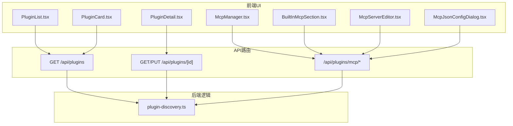
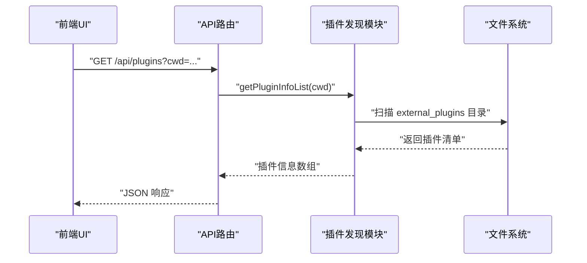
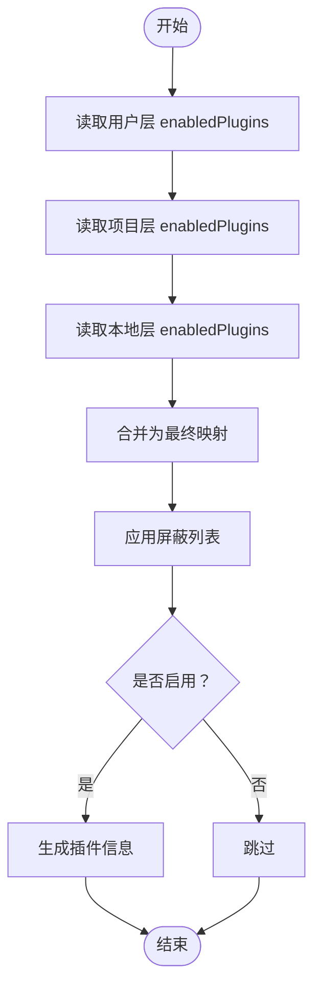
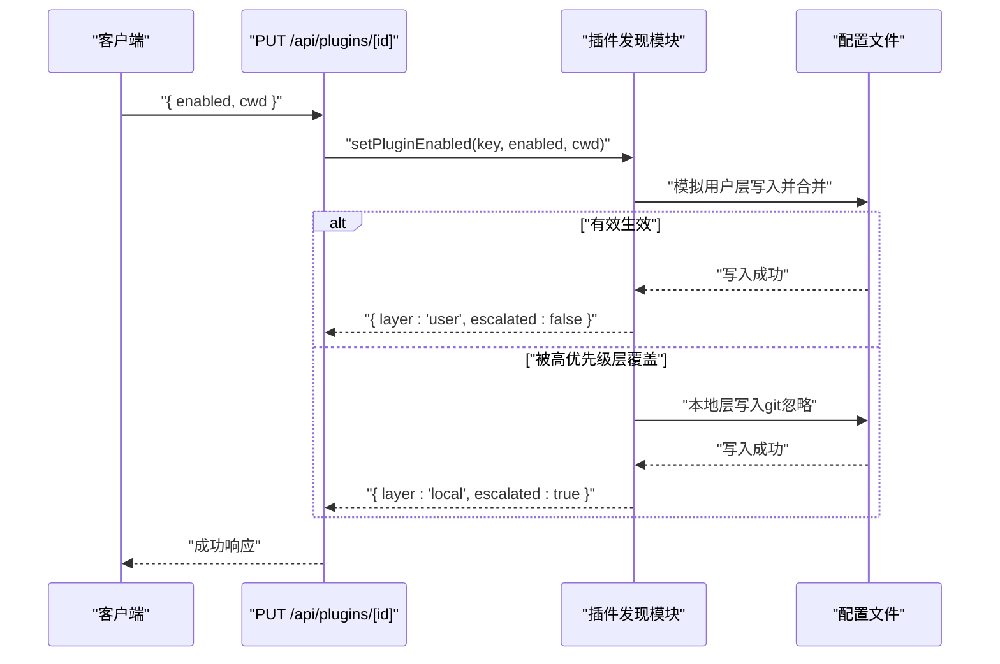
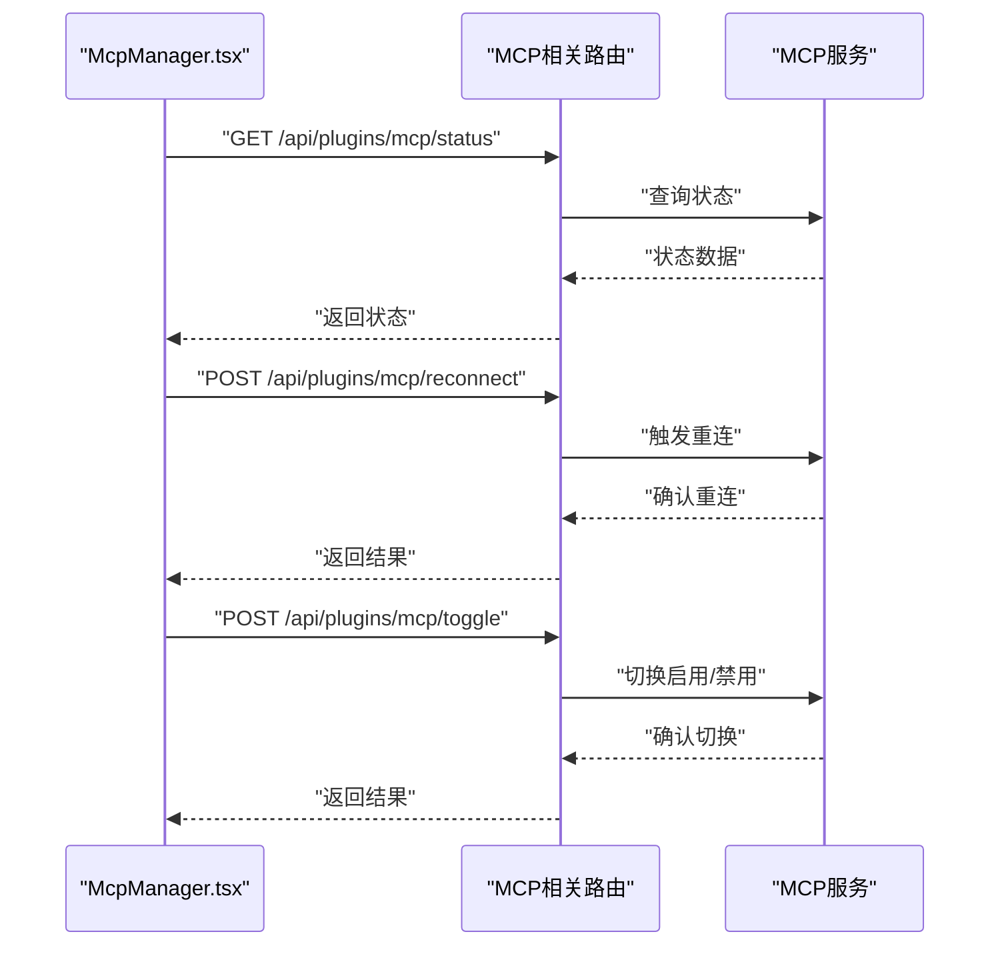
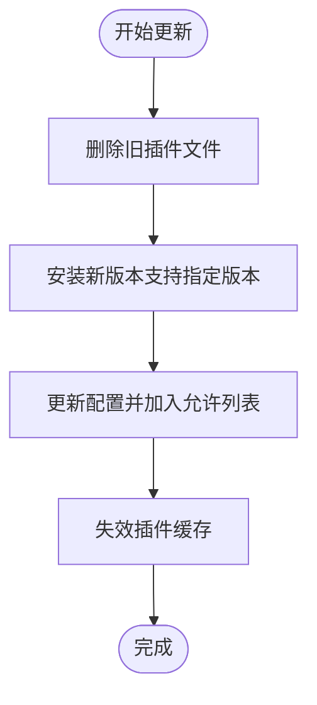
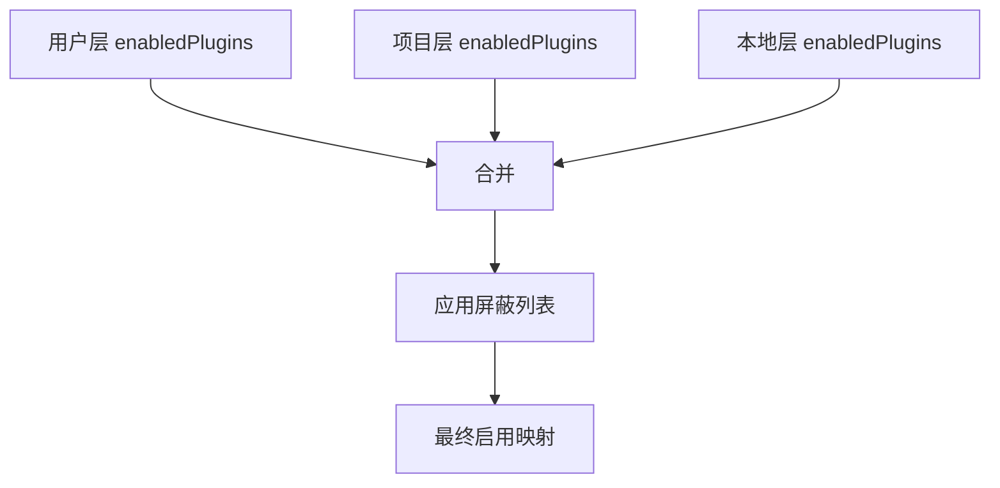
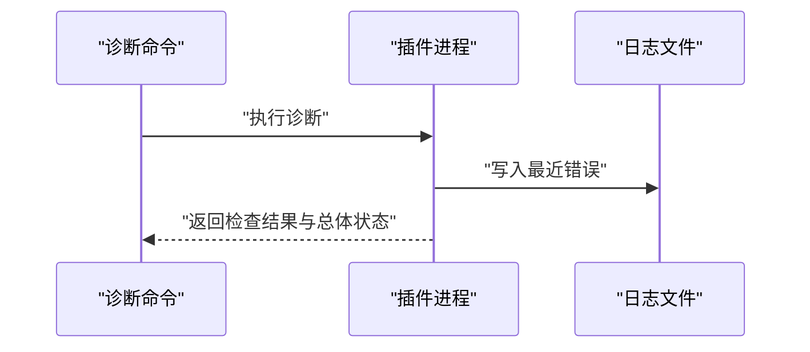
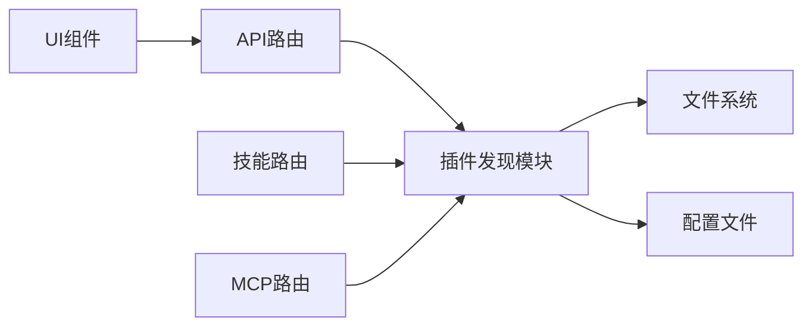

# 插件管理

<cite>
**本文引用的文件**
- [plugin-discovery.ts](file://src/lib/plugin-discovery.ts)
- [route.ts（插件列表）](file://src/app/api/plugins/route.ts)
- [route.ts（按ID查询/启用/禁用）](file://src/app/api/plugins/[id]/route.ts)
- [route.ts（MCP服务器相关API）](file://src/app/api/plugins/mcp/route.ts)
- [route.ts（MCP服务器状态）](file://src/app/api/plugins/mcp/status/route.ts)
- [route.ts（MCP服务器重连）](file://src/app/api/plugins/mcp/reconnect/route.ts)
- [route.ts（MCP服务器开关）](file://src/app/api/plugins/mcp/toggle/route.ts)
- [McpManager.tsx](file://src/components/plugins/McpManager.tsx)
- [BuiltInMcpSection.tsx](file://src/components/plugins/BuiltInMcpSection.tsx)
- [McpServerEditor.tsx](file://src/components/plugins/McpServerEditor.tsx)
- [McpJsonConfigDialog.tsx](file://src/components/plugins/McpJsonConfigDialog.tsx)
- [PluginList.tsx](file://src/components/plugins/PluginList.tsx)
- [PluginCard.tsx](file://src/components/plugins/PluginCard.tsx)
- [PluginDetail.tsx](file://src/components/plugins/PluginDetail.tsx)
- [plugins.spec.ts](file://src/__tests__/e2e/plugins.spec.ts)
- [update.js](file://资料/package/dist/commands/update.js)
- [diagnose.js（飞书插件诊断）](file://资料/feishu-openclaw-plugin/package/src/commands/diagnose.js)
- [monitor.ts（微信监控）](file://资料/weixin-openclaw-package/package/src/monitor/monitor.ts)
- [0.5-sandpack-integration.md](file://docs/research/phase-0-pocs/0.5-sandpack-integration.md)
- [route.ts（HTML预览CSP）](file://src/app/api/files/html-preview/[...segments]/route.ts)
- [skills route.ts](file://src/app/api/skills/route.ts)
</cite>

## 目录
1. [简介](#简介)
2. [项目结构](#项目结构)
3. [核心组件](#核心组件)
4. [架构总览](#架构总览)
5. [详细组件分析](#详细组件分析)
6. [依赖关系分析](#依赖关系分析)
7. [性能考量](#性能考量)
8. [故障排查指南](#故障排查指南)
9. [结论](#结论)
10. [附录](#附录)

## 简介
本文件系统化梳理插件管理子系统，覆盖插件安装、卸载、更新与版本管理的API与流程；说明插件发现机制（自动扫描与手动添加）、配置管理、依赖解析与冲突处理；提供插件状态监控、健康检查与故障恢复接口规范；阐述权限控制、安全验证与沙箱隔离的实现要点；并展示插件生命周期管理、热重载与动态加载的技术方案。

## 项目结构
插件管理涉及三层：前端UI组件、API路由层、后端发现与配置逻辑。核心文件分布如下：
- 发现与配置：src/lib/plugin-discovery.ts
- API路由：src/app/api/plugins/*
- UI组件：src/components/plugins/*
- 测试：src/__tests__/e2e/plugins.spec.ts
- 工具命令（更新）：资料/package/dist/commands/update.js
- 诊断与监控：资料/feishu-openclaw-plugin/package/src/commands/diagnose.js、资料/weixin-openclaw-package/package/src/monitor/monitor.ts
- 安全与沙箱：docs/research/phase-0-pocs/0.5-sandpack-integration.md、src/app/api/files/html-preview/[...segments]/route.ts
- 技能与插件联动：src/app/api/skills/route.ts

图表来源
- [plugin-discovery.ts](file://src/lib/plugin-discovery.ts)
- [route.ts（插件列表）](file://src/app/api/plugins/route.ts)
- [route.ts（按ID查询/启用/禁用）](file://src/app/api/plugins/[id]/route.ts)
- [route.ts（MCP服务器相关API）](file://src/app/api/plugins/mcp/route.ts)

章节来源
- [plugin-discovery.ts](file://src/lib/plugin-discovery.ts)
- [route.ts（插件列表）](file://src/app/api/plugins/route.ts)
- [route.ts（按ID查询/启用/禁用）](file://src/app/api/plugins/[id]/route.ts)
- [route.ts（MCP服务器相关API）](file://src/app/api/plugins/mcp/route.ts)

## 核心组件
- 插件发现与启用状态解析：负责扫描外部插件目录、读取清单、合并用户/项目/本地设置中的启用配置、生成插件信息列表。
- API路由：提供插件列表查询、按ID查询与启用/禁用、MCP服务器管理（状态、重连、开关）等REST接口。
- UI组件：插件列表、卡片、详情、MCP管理器、内置MCP区域、MCP编辑器与JSON配置对话框。
- 更新与诊断工具：命令行更新脚本、第三方插件诊断与监控模块。
- 安全与沙箱：HTML预览CSP策略、Sandpack iframe安全边界研究与落地方案。

章节来源
- [plugin-discovery.ts](file://src/lib/plugin-discovery.ts)
- [route.ts（插件列表）](file://src/app/api/plugins/route.ts)
- [route.ts（按ID查询/启用/禁用）](file://src/app/api/plugins/[id]/route.ts)
- [route.ts（MCP服务器相关API）](file://src/app/api/plugins/mcp/route.ts)
- [McpManager.tsx](file://src/components/plugins/McpManager.tsx)
- [BuiltInMcpSection.tsx](file://src/components/plugins/BuiltInMcpSection.tsx)
- [McpServerEditor.tsx](file://src/components/plugins/McpServerEditor.tsx)
- [McpJsonConfigDialog.tsx](file://src/components/plugins/McpJsonConfigDialog.tsx)
- [PluginList.tsx](file://src/components/plugins/PluginList.tsx)
- [PluginCard.tsx](file://src/components/plugins/PluginCard.tsx)
- [PluginDetail.tsx](file://src/components/plugins/PluginDetail.tsx)
- [update.js](file://资料/package/dist/commands/update.js)
- [diagnose.js（飞书插件诊断）](file://资料/feishu-openclaw-plugin/package/src/commands/diagnose.js)
- [monitor.ts（微信监控）](file://资料/weixin-openclaw-package/package/src/monitor/monitor.ts)
- [0.5-sandpack-integration.md](file://docs/research/phase-0-pocs/0.5-sandpack-integration.md)
- [route.ts（HTML预览CSP）](file://src/app/api/files/html-preview/[...segments]/route.ts)

## 架构总览
插件管理采用“UI组件 + Next.js API路由 + 后端发现与配置”的分层架构。UI组件通过API路由与后端交互；后端通过插件发现模块聚合多层配置，返回统一的插件信息模型；MCP相关能力通过独立路由扩展，支持状态查询、重连与开关。

图表来源
- [route.ts（插件列表）](file://src/app/api/plugins/route.ts)
- [plugin-discovery.ts](file://src/lib/plugin-discovery.ts)

## 详细组件分析

### 插件发现与启用状态解析
- 扫描策略：遍历外部插件目录，读取清单文件，识别命令/技能/代理等能力入口。
- 启用状态解析：优先级为“硬性屏蔽列表” > “用户/项目/本地设置合并后的启用映射”。写入时会模拟提升层级以避免高优先级层覆盖。
- 缓存与失效：发现结果带缓存与时间戳，安装/卸载后可主动失效刷新。

图表来源
- [plugin-discovery.ts](file://src/lib/plugin-discovery.ts)

章节来源
- [plugin-discovery.ts](file://src/lib/plugin-discovery.ts)

### 插件API与工作流
- 列表查询：GET /api/plugins 支持可选 cwd 参数，返回插件列表。
- 按ID查询与启用/禁用：GET /api/plugins/{id} 返回单个插件；PUT /api/plugins/{id} 接收 { enabled: boolean, cwd?: string }，内部解析并写入对应层级配置。
- 启用写入策略：优先尝试用户层写入；若高优先级层会覆盖，则提升到本地层写入，并返回写入层级与是否提升标志。

图表来源
- [route.ts（按ID查询/启用/禁用）](file://src/app/api/plugins/[id]/route.ts)
- [plugin-discovery.ts](file://src/lib/plugin-discovery.ts)

章节来源
- [route.ts（插件列表）](file://src/app/api/plugins/route.ts)
- [route.ts（按ID查询/启用/禁用）](file://src/app/api/plugins/[id]/route.ts)
- [plugin-discovery.ts](file://src/lib/plugin-discovery.ts)

### MCP服务器管理API
- 状态查询：GET /api/plugins/mcp/status
- 重连：POST /api/plugins/mcp/reconnect
- 开关：POST /api/plugins/mcp/toggle
- 管理器：McpManager.tsx 提供搜索、过滤与刷新能力；BuiltInMcpSection.tsx 支持内置MCP服务展示；McpServerEditor.tsx 与 McpJsonConfigDialog.tsx 提供编辑与配置。

图表来源
- [route.ts（MCP服务器状态）](file://src/app/api/plugins/mcp/status/route.ts)
- [route.ts（MCP服务器重连）](file://src/app/api/plugins/mcp/reconnect/route.ts)
- [route.ts（MCP服务器开关）](file://src/app/api/plugins/mcp/toggle/route.ts)
- [McpManager.tsx](file://src/components/plugins/McpManager.tsx)
- [BuiltInMcpSection.tsx](file://src/components/plugins/BuiltInMcpSection.tsx)
- [McpServerEditor.tsx](file://src/components/plugins/McpServerEditor.tsx)
- [McpJsonConfigDialog.tsx](file://src/components/plugins/McpJsonConfigDialog.tsx)

章节来源
- [route.ts（MCP服务器相关API）](file://src/app/api/plugins/mcp/route.ts)
- [route.ts（MCP服务器状态）](file://src/app/api/plugins/mcp/status/route.ts)
- [route.ts（MCP服务器重连）](file://src/app/api/plugins/mcp/reconnect/route.ts)
- [route.ts（MCP服务器开关）](file://src/app/api/plugins/mcp/toggle/route.ts)
- [McpManager.tsx](file://src/components/plugins/McpManager.tsx)
- [BuiltInMcpSection.tsx](file://src/components/plugins/BuiltInMcpSection.tsx)
- [McpServerEditor.tsx](file://src/components/plugins/McpServerEditor.tsx)
- [McpJsonConfigDialog.tsx](file://src/components/plugins/McpJsonConfigDialog.tsx)

### 插件安装、卸载与更新
- 安装/卸载：通过插件发现模块扫描外部目录并生成信息；UI侧提供列表与详情界面。
- 更新：命令行更新脚本先清理旧版本、再调用安装命令，最后更新配置并确保允许列表中存在。
- 版本管理：启用状态解析支持字符串数组形式的版本约束，作为“启用但带约束”的语义。

图表来源
- [update.js](file://资料/package/dist/commands/update.js)
- [plugin-discovery.ts](file://src/lib/plugin-discovery.ts)

章节来源
- [update.js](file://资料/package/dist/commands/update.js)
- [plugin-discovery.ts](file://src/lib/plugin-discovery.ts)

### 插件配置管理、依赖解析与冲突处理
- 配置层次：用户、项目、本地三层；写入时优先用户层，若被高优先级层覆盖则提升至本地层。
- 依赖与冲突：启用状态解析优先屏蔽列表，再合并各层映射；当同一键在不同层出现时，遵循“后写入覆盖”的原则。
- 插件能力标注：扫描插件目录下的命令/技能/代理等能力，并在技能路由中进行加载状态标注。

图表来源
- [plugin-discovery.ts](file://src/lib/plugin-discovery.ts)
- [skills route.ts](file://src/app/api/skills/route.ts)

章节来源
- [plugin-discovery.ts](file://src/lib/plugin-discovery.ts)
- [skills route.ts](file://src/app/api/skills/route.ts)

### 插件状态监控、健康检查与故障恢复
- 健康检查：第三方插件提供诊断命令，汇总全局检查、账户检查、工具注册数、最近错误与总体健康状态。
- 监控与退避：监控模块在连续失败时进行指数退避与休眠，避免对上游造成压力。
- 故障恢复：MCP重连接口与开关接口配合使用，结合UI刷新实现快速恢复。

图表来源
- [diagnose.js（飞书插件诊断）](file://资料/feishu-openclaw-plugin/package/src/commands/diagnose.js)

章节来源
- [diagnose.js（飞书插件诊断）](file://资料/feishu-openclaw-plugin/package/src/commands/diagnose.js)
- [monitor.ts（微信监控）](file://资料/weixin-openclaw-package/package/src/monitor/monitor.ts)
- [route.ts（MCP服务器重连）](file://src/app/api/plugins/mcp/reconnect/route.ts)
- [route.ts（MCP服务器开关）](file://src/app/api/plugins/mcp/toggle/route.ts)

### 权限控制、安全验证与沙箱隔离
- HTML预览CSP：严格限制 default-src、connect-src、frame-src、object-src、worker-src、child-src、manifest-src、frame-ancestors、base-uri、form-action 等指令，交互模式下进一步收紧资源来源。
- Sandpack iframe安全边界：研究四种策略（s1-s4），明确希望的sandbox属性与CSP白名单，必要时通过自托管bundler与webRequest注入CSP实现更强隔离。
- 子组件安全：Markdown Artifact回退方案对组件、属性、事件、链接与图片进行白名单控制，并包裹ErrorBoundary兜底。

章节来源
- [route.ts（HTML预览CSP）](file://src/app/api/files/html-preview/[...segments]/route.ts)
- [0.5-sandpack-integration.md](file://docs/research/phase-0-pocs/0.5-sandpack-integration.md)

### 插件生命周期管理、热重载与动态加载
- 生命周期：安装/启用/禁用/卸载；安装后需使插件缓存失效；启用/禁用通过配置写入实现。
- 热重载：UI侧提供刷新能力（如McpManager的refresh），结合后端缓存失效实现快速生效。
- 动态加载：前端组件采用懒加载策略减少初始包体；插件能力扫描与标注在后端完成，前端按需渲染。

章节来源
- [plugin-discovery.ts](file://src/lib/plugin-discovery.ts)
- [McpManager.tsx](file://src/components/plugins/McpManager.tsx)
- [route.ts（插件列表）](file://src/app/api/plugins/route.ts)

## 依赖关系分析
- UI组件依赖API路由；API路由依赖插件发现模块；插件发现模块依赖文件系统与配置文件。
- MCP相关功能与插件发现模块解耦，通过独立路由扩展。
- 技能路由与插件发现模块协作，扫描插件命令目录并标注加载状态。

图表来源
- [plugin-discovery.ts](file://src/lib/plugin-discovery.ts)
- [route.ts（插件列表）](file://src/app/api/plugins/route.ts)
- [skills route.ts](file://src/app/api/skills/route.ts)
- [route.ts（MCP服务器相关API）](file://src/app/api/plugins/mcp/route.ts)

章节来源
- [plugin-discovery.ts](file://src/lib/plugin-discovery.ts)
- [route.ts（插件列表）](file://src/app/api/plugins/route.ts)
- [skills route.ts](file://src/app/api/skills/route.ts)
- [route.ts（MCP服务器相关API）](file://src/app/api/plugins/mcp/route.ts)

## 性能考量
- 缓存与失效：插件发现结果带缓存与时间戳，安装/卸载后主动失效，避免频繁IO。
- 启用写入优化：优先用户层写入，减少高优先级层覆盖带来的额外写入成本。
- UI懒加载：前端组件采用动态导入，降低首屏负载。
- MCP重试退避：监控模块在连续失败时进行退避，降低对上游的压力。

## 故障排查指南
- 插件未出现在列表：检查 external_plugins 目录是否存在、清单文件是否正确、是否被屏蔽列表阻止。
- 启用/禁用无效：确认写入层级（用户/本地），查看高优先级层是否覆盖；必要时提升到本地层。
- MCP连接异常：使用重连接口与开关接口进行恢复；查看健康检查输出与最近错误日志。
- 安全相关问题：核对HTML预览CSP策略与Sandpack iframe安全边界是否符合预期；必要时切换更严格的控制路径。

章节来源
- [plugin-discovery.ts](file://src/lib/plugin-discovery.ts)
- [route.ts（MCP服务器重连）](file://src/app/api/plugins/mcp/reconnect/route.ts)
- [route.ts（MCP服务器开关）](file://src/app/api/plugins/mcp/toggle/route.ts)
- [diagnose.js（飞书插件诊断）](file://资料/feishu-openclaw-plugin/package/src/commands/diagnose.js)
- [route.ts（HTML预览CSP）](file://src/app/api/files/html-preview/[...segments]/route.ts)
- [0.5-sandpack-integration.md](file://docs/research/phase-0-pocs/0.5-sandpack-integration.md)

## 结论
插件管理子系统通过清晰的分层架构实现了从发现、配置、启用/禁用到MCP管理与健康监控的全链路能力。多层配置与屏蔽列表提供了灵活的权限与冲突控制；缓存与懒加载提升了性能；安全方面通过CSP与Sandpack边界研究保障了隔离与可控。后续可在版本约束与自动发现上进一步增强自动化与可观测性。

## 附录
- 测试用例：端到端测试覆盖插件管理关键场景，建议在变更后运行以保证稳定性。
- 文档参考：Sandpack iframe安全边界研究文档提供了安全策略选择与落地建议。

章节来源
- [plugins.spec.ts](file://src/__tests__/e2e/plugins.spec.ts)
- [0.5-sandpack-integration.md](file://docs/research/phase-0-pocs/0.5-sandpack-integration.md)