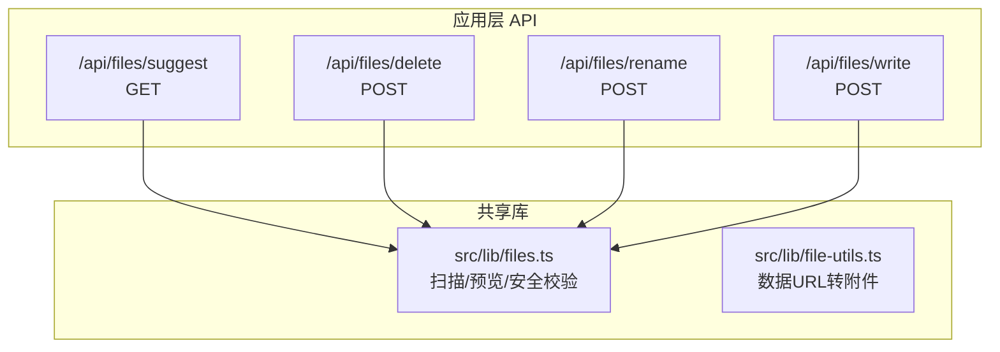
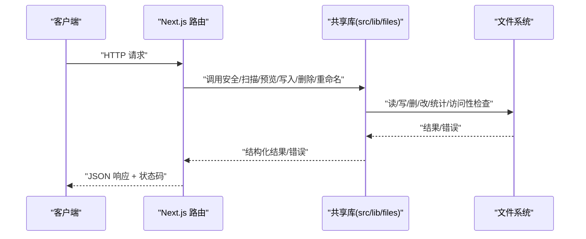
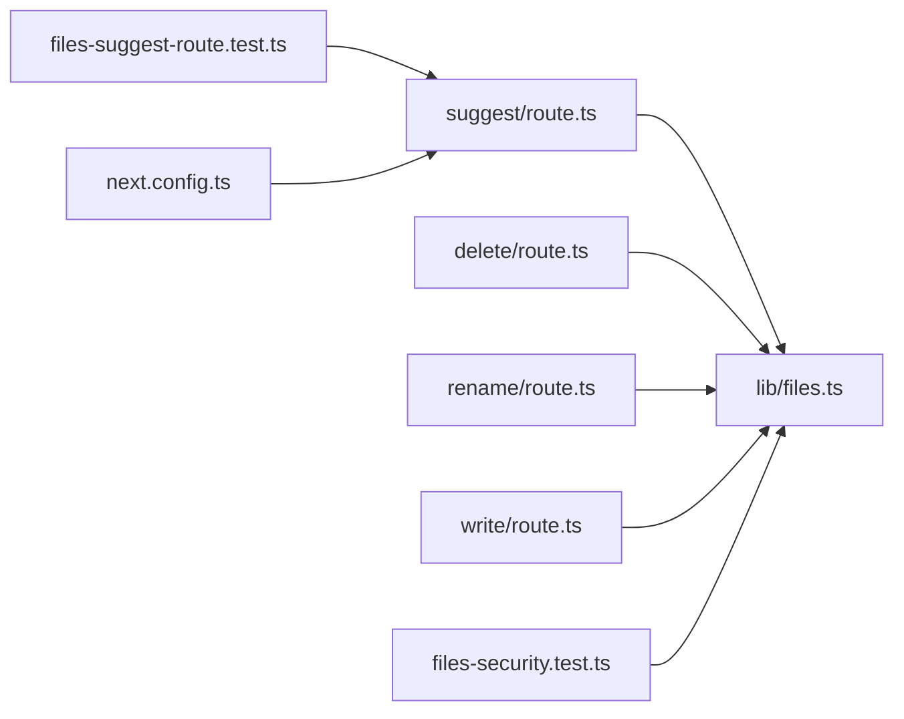

# 文件 API

<cite>
**本文引用的文件**
- [src/app/api/files/suggest/route.ts](file://src/app/api/files/suggest/route.ts)
- [src/app/api/files/delete/route.ts](file://src/app/api/files/delete/route.ts)
- [src/app/api/files/rename/route.ts](file://src/app/api/files/rename/route.ts)
- [src/app/api/files/write/route.ts](file://src/app/api/files/write/route.ts)
- [src/lib/files.ts](file://src/lib/files.ts)
- [src/lib/file-utils.ts](file://src/lib/file-utils.ts)
- [src/__tests__/unit/files-security.test.ts](file://src/__tests__/unit/files-security.test.ts)
- [src/__tests__/unit/files-suggest-route.test.ts](file://src/__tests__/unit/files-suggest-route.test.ts)
- [next.config.ts](file://next.config.ts)
</cite>

## 目录
1. [简介](#简介)
2. [项目结构](#项目结构)
3. [核心组件](#核心组件)
4. [架构总览](#架构总览)
5. [详细组件分析](#详细组件分析)
6. [依赖关系分析](#依赖关系分析)
7. [性能考量](#性能考量)
8. [故障排查指南](#故障排查指南)
9. [结论](#结论)
10. [附录](#附录)

## 简介
本文件 API 文档面向 CodePilot 的文件系统操作能力，覆盖以下端点与功能：
- 文件浏览与建议：基于工作区扫描与建议匹配，用于输入提示与文件选择。
- 文件预览：按扩展名与行数上限策略读取文件片段，支持二进制检测与截断。
- 写入文件：安全路径校验、父目录可选创建、覆盖策略控制。
- 删除文件：系统回收站策略，非空目录需显式确认。
- 重命名/移动：双端点安全校验，跨基座限制，类型一致性约束。

本文件提供每个端点的 HTTP 规范、请求/响应模型、认证要求、错误码映射、典型用法与最佳实践。

## 项目结构
文件 API 的路由位于应用层 API 目录，核心业务逻辑集中在共享库中，统一的安全与预览策略由通用模块提供。

图表来源
- [src/app/api/files/suggest/route.ts:55-109](file://src/app/api/files/suggest/route.ts#L55-L109)
- [src/app/api/files/delete/route.ts:37-110](file://src/app/api/files/delete/route.ts#L37-L110)
- [src/app/api/files/rename/route.ts:35-142](file://src/app/api/files/rename/route.ts#L35-L142)
- [src/app/api/files/write/route.ts:41-119](file://src/app/api/files/write/route.ts#L41-L119)
- [src/lib/files.ts:89-164](file://src/lib/files.ts#L89-L164)

章节来源
- [src/app/api/files/suggest/route.ts:1-110](file://src/app/api/files/suggest/route.ts#L1-L110)
- [src/app/api/files/delete/route.ts:1-128](file://src/app/api/files/delete/route.ts#L1-L128)
- [src/app/api/files/rename/route.ts:1-162](file://src/app/api/files/rename/route.ts#L1-L162)
- [src/app/api/files/write/route.ts:1-139](file://src/app/api/files/write/route.ts#L1-L139)
- [src/lib/files.ts:1-589](file://src/lib/files.ts#L1-L589)
- [src/lib/file-utils.ts:1-26](file://src/lib/file-utils.ts#L1-L26)

## 核心组件
- 安全与路径校验
  - 路径安全：防止逃逸基座目录、拒绝根路径、阻止受保护目录。
  - 符号链接防护：链路逐段检查与最终 realpath 校验，避免通过软链绕过限制。
  - 文件名校验：跨平台非法名称与保留字检查。
- 预览策略
  - 扩展名行数上限、绝对上限、字节上限、二进制检测、流式截断。
- 工作区扫描
  - 递归扫描、忽略特定目录、排序与深度控制、相对路径输出。

章节来源
- [src/lib/files.ts:74-87](file://src/lib/files.ts#L74-L87)
- [src/lib/files.ts:236-306](file://src/lib/files.ts#L236-L306)
- [src/lib/files.ts:348-365](file://src/lib/files.ts#L348-L365)
- [src/lib/files.ts:395-459](file://src/lib/files.ts#L395-L459)
- [src/lib/files.ts:487-588](file://src/lib/files.ts#L487-L588)
- [src/lib/files.ts:89-164](file://src/lib/files.ts#L89-L164)

## 架构总览
文件 API 的调用链从 Next.js 路由进入，经由共享库执行安全校验与文件系统操作，最后返回标准化的 JSON 响应；错误通过结构化错误对象映射为 HTTP 状态码。

图表来源
- [src/app/api/files/suggest/route.ts:55-109](file://src/app/api/files/suggest/route.ts#L55-L109)
- [src/app/api/files/delete/route.ts:37-110](file://src/app/api/files/delete/route.ts#L37-L110)
- [src/app/api/files/rename/route.ts:35-142](file://src/app/api/files/rename/route.ts#L35-L142)
- [src/app/api/files/write/route.ts:41-119](file://src/app/api/files/write/route.ts#L41-L119)
- [src/lib/files.ts:89-164](file://src/lib/files.ts#L89-L164)

## 详细组件分析

### 文件浏览与建议
- 端点
  - 方法：GET
  - URL：/api/files/suggest
  - 查询参数
    - sessionId: 会话 ID（二选一）
    - workingDirectory: 工作目录（二选一）
    - q: 搜索关键词
    - limit: 结果数量上限（默认 20，最大 100）
- 行为
  - 解析并校验工作区基座，拒绝根路径。
  - 递归扫描工作区（固定深度），扁平化为建议项，按相关性与类型排序，返回相对路径与显示名。
- 认证
  - 无内置认证要求；若使用 sessionId，需确保会话存在且包含工作目录。
- 响应
  - 成功：items（建议项数组）、root（工作区绝对路径）。
  - 失败：错误信息与状态码（400/403/404）。
- 示例
  - 请求：GET /api/files/suggest?sessionId=<id>&q=src&limit=2
  - 响应：包含 items 与 root 字段的 JSON 对象。

章节来源
- [src/app/api/files/suggest/route.ts:55-109](file://src/app/api/files/suggest/route.ts#L55-L109)
- [src/lib/files.ts:89-164](file://src/lib/files.ts#L89-L164)

### 文件预览
- 端点
  - 方法：GET（通过前端间接调用，后端提供服务端渲染/静态生成场景下的预览能力）
  - URL：/api/files/serve 或 /api/files?path=...
  - 注意：当前仓库未发现直接的“/api/files”入口；预览能力由共享库提供，建议端点用于输入提示。
- 行为
  - 安全检查：存在性、文件类型、字节上限、二进制检测。
  - 读取策略：按扩展名与行数上限截断，流式读取避免内存峰值。
  - 返回：路径、内容、语言、行数（精确/估算）、截断标记、字节统计。
- 认证
  - 无内置认证要求；建议结合会话或权限中间件使用。
- 响应
  - 成功：预览对象（含 content、language、line_count 等）。
  - 失败：错误码与状态码映射（404/400/403/500）。

章节来源
- [src/lib/files.ts:487-588](file://src/lib/files.ts#L487-L588)

### 写入文件
- 端点
  - 方法：POST
  - URL：/api/files/write
- 请求体字段
  - path: 目标路径（绝对或相对 baseDir）
  - baseDir: 基座目录（默认用户家目录）
  - content: UTF-8 文本内容
  - overwrite: 是否覆盖（默认 false）
  - createParents: 是否自动创建父目录（默认 false）
- 安全与行为
  - 文件名校验、路径安全、符号链接检查、真实路径约束。
  - 存在性与覆盖策略、父目录存在性与可选创建。
- 错误码与状态码映射
  - 400: invalid_filename
  - 403: path_unsafe/root_path/symlink_detected/blocked_directory
  - 404: parent_not_exists/not_found
  - 409: already_exists
  - 500: write_failed
- 响应
  - 成功：写入路径与字节数。
  - 失败：错误信息、代码与状态码。

章节来源
- [src/app/api/files/write/route.ts:41-119](file://src/app/api/files/write/route.ts#L41-L119)
- [src/lib/files.ts:297-306](file://src/lib/files.ts#L297-L306)
- [src/lib/files.ts:348-365](file://src/lib/files.ts#L348-L365)
- [src/lib/files.ts:395-459](file://src/lib/files.ts#L395-L459)
- [src/lib/files.ts:487-588](file://src/lib/files.ts#L487-L588)

### 删除文件
- 端点
  - 方法：POST
  - URL：/api/files/delete
- 请求体字段
  - path: 待删除路径
  - baseDir: 基座目录
  - recursive: 非空目录是否递归删除（默认 false）
- 安全与行为
  - 路径安全、符号链接检查、真实路径约束。
  - 非空目录需显式 recursive=true。
  - 通过系统回收站实现，失败时不回退到真实删除。
- 错误码与状态码映射
  - 400: 缺少参数
  - 403: path_unsafe/root_path/symlink_detected/blocked_directory
  - 404: not_found
  - 409: dir_not_empty
  - 500: trash_unavailable
- 响应
  - 成功：被删除路径与 trashed 标记。
  - 失败：错误信息、代码与状态码。

章节来源
- [src/app/api/files/delete/route.ts:37-110](file://src/app/api/files/delete/route.ts#L37-L110)
- [src/lib/files.ts:297-306](file://src/lib/files.ts#L297-L306)
- [src/lib/files.ts:348-365](file://src/lib/files.ts#L348-L365)
- [src/lib/files.ts:395-459](file://src/lib/files.ts#L395-L459)

### 重命名/移动
- 端点
  - 方法：POST
  - URL：/api/files/rename
- 请求体字段
  - from: 源路径
  - to: 目标路径
  - baseDir: 基座目录
  - overwrite: 是否覆盖（默认 false）
- 安全与行为
  - 双端点路径安全、符号链接检查、真实路径约束。
  - 跨基座移动拒绝；目标类型与源类型一致。
  - 目标存在性与覆盖策略。
- 错误码与状态码映射
  - 400: invalid_filename
  - 403: path_unsafe/root_path/symlink_detected/blocked_directory/cross_base_dir
  - 404: not_found
  - 409: already_exists
  - 500: 其他写入失败
- 响应
  - 成功：from 与 to 绝对路径。
  - 失败：错误信息、代码与状态码。

章节来源
- [src/app/api/files/rename/route.ts:35-142](file://src/app/api/files/rename/route.ts#L35-L142)
- [src/lib/files.ts:297-306](file://src/lib/files.ts#L297-L306)
- [src/lib/files.ts:348-365](file://src/lib/files.ts#L348-L365)
- [src/lib/files.ts:395-459](file://src/lib/files.ts#L395-L459)

### 数据 URL 转附件
- 功能
  - 将 data URL 转换为文件附件对象（含 id、name、type、size、data）。
- 用途
  - 与文件 API 协同，用于前端拖拽/粘贴图片等场景的临时存储与后续写入。
- 响应
  - 成功：附件对象。

章节来源
- [src/lib/file-utils.ts:7-25](file://src/lib/file-utils.ts#L7-L25)

## 依赖关系分析
- 路由到库
  - 所有文件 API 路由均依赖 src/lib/files.ts 中的安全校验与文件操作函数。
- 扫描与建议
  - 建议端点依赖扫描函数进行工作区遍历与扁平化。
- 回收站
  - 删除端点依赖第三方 trash 包实现跨平台回收站。
- 测试与配置
  - 单元测试覆盖安全策略与建议端点行为。
  - Next.js 配置中对扫描函数的打包影响进行注释说明。

图表来源
- [src/app/api/files/suggest/route.ts:1-110](file://src/app/api/files/suggest/route.ts#L1-L110)
- [src/app/api/files/delete/route.ts:1-128](file://src/app/api/files/delete/route.ts#L1-L128)
- [src/app/api/files/rename/route.ts:1-162](file://src/app/api/files/rename/route.ts#L1-L162)
- [src/app/api/files/write/route.ts:1-139](file://src/app/api/files/write/route.ts#L1-L139)
- [src/lib/files.ts:1-589](file://src/lib/files.ts#L1-L589)
- [src/__tests__/unit/files-security.test.ts:1-200](file://src/__tests__/unit/files-security.test.ts#L1-L200)
- [src/__tests__/unit/files-suggest-route.test.ts:1-120](file://src/__tests__/unit/files-suggest-route.test.ts#L1-L120)
- [next.config.ts:19-20](file://next.config.ts#L19-L20)

章节来源
- [src/app/api/files/suggest/route.ts:1-110](file://src/app/api/files/suggest/route.ts#L1-L110)
- [src/app/api/files/delete/route.ts:1-128](file://src/app/api/files/delete/route.ts#L1-L128)
- [src/app/api/files/rename/route.ts:1-162](file://src/app/api/files/rename/route.ts#L1-L162)
- [src/app/api/files/write/route.ts:1-139](file://src/app/api/files/write/route.ts#L1-L139)
- [src/lib/files.ts:1-589](file://src/lib/files.ts#L1-L589)
- [src/__tests__/unit/files-security.test.ts:1-200](file://src/__tests__/unit/files-security.test.ts#L1-L200)
- [src/__tests__/unit/files-suggest-route.test.ts:1-120](file://src/__tests__/unit/files-suggest-route.test.ts#L1-L120)
- [next.config.ts:19-20](file://next.config.ts#L19-L20)

## 性能考量
- 扫描与建议
  - 采用固定扫描深度与扁平化输出，避免一次性加载整树。
  - 排序与过滤在内存中完成，注意 limit 控制。
- 预览
  - 二进制采样与行数上限减少内存占用；大文件按估计行数返回。
- 写入
  - UTF-8 字节长度计算准确反映写入大小。
- 回收站
  - 通过系统回收站减少磁盘真实删除开销，提升可用性。

[本节为通用指导，无需具体文件分析]

## 故障排查指南
- 常见错误与定位
  - 403 路径相关错误：检查 baseDir、路径是否为根、是否命中受保护目录、是否存在符号链接。
  - 404/409 文件相关错误：确认目标存在性、覆盖策略、非空目录是否传入 recursive/overwrite。
  - 500 回收站不可用：检查运行环境是否支持系统回收站。
- 安全策略验证
  - 使用单测覆盖路径安全与建议端点边界条件。
- 打包与扫描
  - 扫描函数涉及动态路径读取，构建配置中已添加注释以避免不必要的全量追踪。

章节来源
- [src/app/api/files/delete/route.ts:112-127](file://src/app/api/files/delete/route.ts#L112-L127)
- [src/app/api/files/rename/route.ts:144-161](file://src/app/api/files/rename/route.ts#L144-L161)
- [src/app/api/files/write/route.ts:121-138](file://src/app/api/files/write/route.ts#L121-L138)
- [src/__tests__/unit/files-security.test.ts:1-200](file://src/__tests__/unit/files-security.test.ts#L1-L200)
- [src/__tests__/unit/files-suggest-route.test.ts:1-120](file://src/__tests__/unit/files-suggest-route.test.ts#L1-L120)
- [next.config.ts:19-20](file://next.config.ts#L19-L20)

## 结论
文件 API 通过统一的安全校验与清晰的错误映射，提供了稳健的文件浏览、预览、写入、删除与重命名能力。建议在生产环境中结合会话与权限中间件使用，并遵循路径安全与回收站策略的最佳实践。

[本节为总结，无需具体文件分析]

## 附录

### 端点一览与规范
- 文件浏览与建议
  - 方法：GET
  - URL：/api/files/suggest
  - 查询参数：sessionId 或 workingDirectory（二选一）、q、limit
  - 响应：items（建议项数组）、root（工作区绝对路径）
- 写入文件
  - 方法：POST
  - URL：/api/files/write
  - 请求体：path、baseDir、content、overwrite、createParents
  - 响应：path、bytes_written
- 删除文件
  - 方法：POST
  - URL：/api/files/delete
  - 请求体：path、baseDir、recursive
  - 响应：path、trashed
- 重命名/移动
  - 方法：POST
  - URL：/api/files/rename
  - 请求体：from、to、baseDir、overwrite
  - 响应：from、to

章节来源
- [src/app/api/files/suggest/route.ts:55-109](file://src/app/api/files/suggest/route.ts#L55-L109)
- [src/app/api/files/write/route.ts:41-119](file://src/app/api/files/write/route.ts#L41-L119)
- [src/app/api/files/delete/route.ts:37-110](file://src/app/api/files/delete/route.ts#L37-L110)
- [src/app/api/files/rename/route.ts:35-142](file://src/app/api/files/rename/route.ts#L35-L142)

### 错误码与状态码映射
- 写入：invalid_filename(400)、path_unsafe/root_path/symlink_detected/blocked_directory(403)、already_exists(409)、parent_not_exists/not_found(404)、write_failed(500)
- 删除：path_unsafe/root_path/symlink_detected/blocked_directory(403)、not_found(404)、dir_not_empty(409)、trash_unavailable(500)
- 重命名：invalid_filename(400)、path_unsafe/root_path/symlink_detected/blocked_directory/cross_base_dir(403)、not_found(404)、already_exists(409)

章节来源
- [src/app/api/files/write/route.ts:121-138](file://src/app/api/files/write/route.ts#L121-L138)
- [src/app/api/files/delete/route.ts:112-127](file://src/app/api/files/delete/route.ts#L112-L127)
- [src/app/api/files/rename/route.ts:144-161](file://src/app/api/files/rename/route.ts#L144-L161)

### 最佳实践
- 始终提供明确的 baseDir 并限制路径逃逸。
- 对外部输入进行文件名校验与符号链接检查。
- 非空目录删除前确认 recursive=true。
- 覆盖写入前检查目标存在性与类型一致性。
- 大文件预览使用扩展名行数上限与截断策略。

[本节为通用指导，无需具体文件分析]