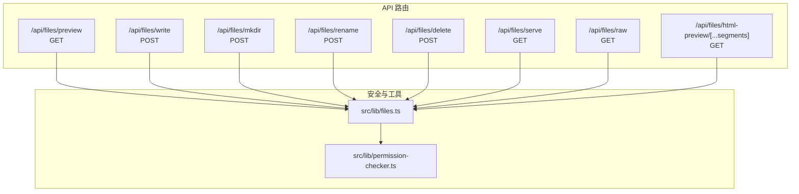
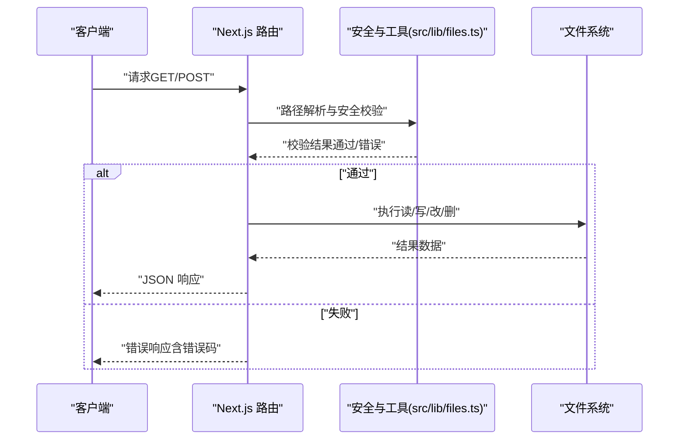
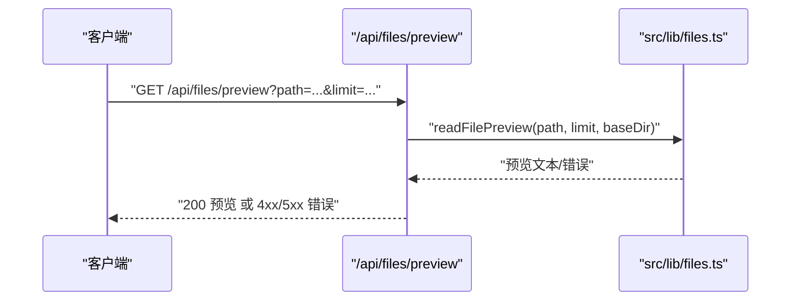
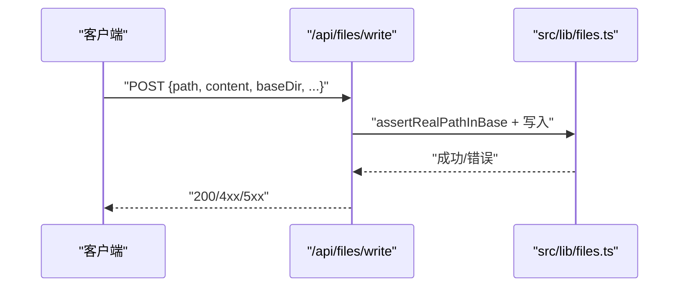
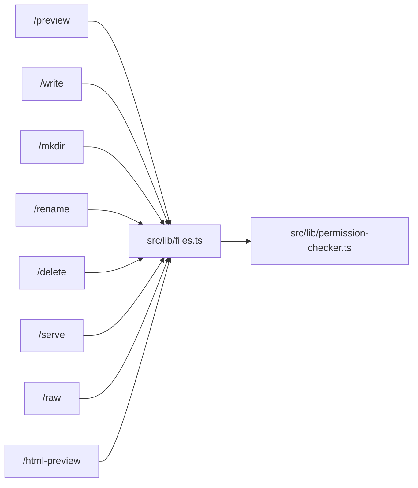

# 文件 API

<cite>
**本文引用的文件**
- [src/app/api/files/preview/route.ts](file://src/app/api/files/preview/route.ts)
- [src/app/api/files/write/route.ts](file://src/app/api/files/write/route.ts)
- [src/app/api/files/mkdir/route.ts](file://src/app/api/files/mkdir/route.ts)
- [src/app/api/files/rename/route.ts](file://src/app/api/files/rename/route.ts)
- [src/app/api/files/delete/route.ts](file://src/app/api/files/delete/route.ts)
- [src/app/api/files/serve/route.ts](file://src/app/api/files/serve/route.ts)
- [src/app/api/files/raw/route.ts](file://src/app/api/files/raw/route.ts)
- [src/app/api/files/html-preview/[...segments]/route.ts](file://src/app/api/files/html-preview/[...segments]/route.ts)
- [src/lib/files.ts](file://src/lib/files.ts)
- [src/lib/permission-checker.ts](file://src/lib/permission-checker.ts)
- [src/components/layout/panels/PreviewPanel.tsx](file://src/components/layout/panels/PreviewPanel.tsx)
- [src/components/project/FilePreview.tsx](file://src/components/project/FilePreview.tsx)
- [docs/handover/markdown-artifact-overhaul.md](file://docs/handover/markdown-artifact-overhaul.md)
- [docs/exec-plans/completed/phase-4-markdown-artifact.md](file://docs/exec-plans/completed/phase-4-markdown-artifact.md)
- [src/__tests__/unit/files-security.test.ts](file://src/__tests__/unit/files-security.test.ts)
</cite>

## 目录
1. [简介](#简介)
2. [项目结构](#项目结构)
3. [核心组件](#核心组件)
4. [架构总览](#架构总览)
5. [详细组件分析](#详细组件分析)
6. [依赖关系分析](#依赖关系分析)
7. [性能考量](#性能考量)
8. [故障排查指南](#故障排查指南)
9. [结论](#结论)
10. [附录](#附录)

## 简介
本文件 API 文档面向后端与前端开发者，系统性梳理文件管理相关接口，覆盖文件浏览（预览）、上传（写入）、目录创建、重命名、删除、原始文件访问与 HTML 预览等能力。文档详细说明每个端点的 HTTP 方法、URL 参数或请求体字段、响应内容、路径处理策略、权限与安全校验机制，并给出文件类型支持、大小限制与格式验证建议，以及批量操作、进度跟踪与错误处理的最佳实践。

## 项目结构
文件 API 主要位于 Next.js App Router 的 API 路由中，核心文件如下：
- 预览：GET /api/files/preview
- 写入：POST /api/files/write
- 创建目录：POST /api/files/mkdir
- 重命名：POST /api/files/rename
- 删除：POST /api/files/delete
- 服务端渲染预览：GET /api/files/serve
- 原始文件流：GET /api/files/raw
- HTML 预览：GET /api/files/html-preview/[...segments]

上述路由均通过统一的安全与路径校验工具进行约束，核心逻辑集中在 src/lib/files.ts 中。

图表来源
- [src/app/api/files/preview/route.ts:1-200](file://src/app/api/files/preview/route.ts#L1-L200)
- [src/app/api/files/write/route.ts:1-140](file://src/app/api/files/write/route.ts#L1-L140)
- [src/app/api/files/mkdir/route.ts:1-120](file://src/app/api/files/mkdir/route.ts#L1-L120)
- [src/app/api/files/rename/route.ts:1-170](file://src/app/api/files/rename/route.ts#L1-L170)
- [src/app/api/files/delete/route.ts:1-120](file://src/app/api/files/delete/route.ts#L1-L120)
- [src/app/api/files/serve/route.ts:1-120](file://src/app/api/files/serve/route.ts#L1-L120)
- [src/app/api/files/raw/route.ts:1-120](file://src/app/api/files/raw/route.ts#L1-L120)
- [src/app/api/files/html-preview/[...segments]/route.ts](file://src/app/api/files/html-preview/[...segments]/route.ts#L1-L200)
- [src/lib/files.ts:1-500](file://src/lib/files.ts#L1-L500)
- [src/lib/permission-checker.ts:1-120](file://src/lib/permission-checker.ts#L1-L120)

章节来源
- [src/app/api/files/preview/route.ts:1-200](file://src/app/api/files/preview/route.ts#L1-L200)
- [src/app/api/files/write/route.ts:1-140](file://src/app/api/files/write/route.ts#L1-L140)
- [src/app/api/files/mkdir/route.ts:1-120](file://src/app/api/files/mkdir/route.ts#L1-L120)
- [src/app/api/files/rename/route.ts:1-170](file://src/app/api/files/rename/route.ts#L1-L170)
- [src/app/api/files/delete/route.ts:1-120](file://src/app/api/files/delete/route.ts#L1-L120)
- [src/app/api/files/serve/route.ts:1-120](file://src/app/api/files/serve/route.ts#L1-L120)
- [src/app/api/files/raw/route.ts:1-120](file://src/app/api/files/raw/route.ts#L1-L120)
- [src/app/api/files/html-preview/[...segments]/route.ts](file://src/app/api/files/html-preview/[...segments]/route.ts#L1-L200)
- [src/lib/files.ts:1-500](file://src/lib/files.ts#L1-L500)
- [src/lib/permission-checker.ts:1-120](file://src/lib/permission-checker.ts#L1-L120)

## 核心组件
- 安全与路径校验工具：统一的路径安全检查、符号链接检测、禁止目录/文件名过滤、基础目录边界控制等。
- 错误模型：FileIOError 与 FilePreviewError，统一映射为 HTTP 状态码与业务错误码。
- 权限系统：基于模式（explore/normal/trust）与规则链的权限检查器，用于 Bash 与文件写入等高风险操作。
- 预览与媒体：Markdown 截断策略、二进制文件拒读、HTML 预览路由与 CSP 头设置。

章节来源
- [src/lib/files.ts:200-450](file://src/lib/files.ts#L200-L450)
- [src/lib/permission-checker.ts:1-120](file://src/lib/permission-checker.ts#L1-L120)
- [docs/handover/markdown-artifact-overhaul.md:200-220](file://docs/handover/markdown-artifact-overhaul.md#L200-L220)

## 架构总览
文件 API 的关键流程包括：请求进入 -> 参数解析 -> 安全校验 -> 文件系统操作 -> 响应构建。安全校验贯穿所有写入类路由，确保路径不越界、无符号链接、无禁止路径段、无危险文件名等。

图表来源
- [src/app/api/files/preview/route.ts:1-200](file://src/app/api/files/preview/route.ts#L1-L200)
- [src/app/api/files/write/route.ts:1-140](file://src/app/api/files/write/route.ts#L1-L140)
- [src/app/api/files/mkdir/route.ts:1-120](file://src/app/api/files/mkdir/route.ts#L1-L120)
- [src/app/api/files/rename/route.ts:1-170](file://src/app/api/files/rename/route.ts#L1-L170)
- [src/app/api/files/delete/route.ts:1-120](file://src/app/api/files/delete/route.ts#L1-L120)
- [src/lib/files.ts:380-470](file://src/lib/files.ts#L380-L470)

## 详细组件分析

### 预览接口：GET /api/files/preview
- 功能：读取文件内容并返回可预览片段，支持行数/字节数上限与二进制文件拒读。
- 请求参数（查询字符串）：
  - path：目标文件路径（建议配合 baseDir 使用）
  - limit：可选，限制返回行数或字节数
  - baseDir：可选，限定路径作用域
- 响应：
  - 成功：返回预览内容对象
  - 失败：返回错误对象（包含错误码与消息）
- 安全与限制：
  - 使用 assertRealPathInBase 保证路径在 baseDir 内
  - 对二进制文件拒读，超大文件截断
  - FilePreviewError 映射到 HTTP 状态码

图表来源
- [src/app/api/files/preview/route.ts:1-200](file://src/app/api/files/preview/route.ts#L1-L200)
- [src/lib/files.ts:200-260](file://src/lib/files.ts#L200-L260)

章节来源
- [src/app/api/files/preview/route.ts:1-200](file://src/app/api/files/preview/route.ts#L1-L200)
- [src/lib/files.ts:200-260](file://src/lib/files.ts#L200-L260)
- [docs/handover/markdown-artifact-overhaul.md:200-220](file://docs/handover/markdown-artifact-overhaul.md#L200-L220)

### 写入接口：POST /api/files/write
- 功能：向指定路径写入内容，支持覆盖与父目录自动创建。
- 请求体字段：
  - path：目标文件路径
  - content：要写入的内容（字符串）
  - baseDir：可选，限定路径作用域
  - overwrite：可选，是否允许覆盖
  - createParents：可选，是否自动创建父目录
- 响应：
  - 成功：返回写入路径与字节数
  - 失败：返回错误对象（包含错误码与消息）
- 安全与限制：
  - 符号链接拒绝
  - 路径越界、根路径、禁止目录段、无效文件名等校验
  - 已存在文件默认拒绝覆盖（overwrite=false）

图表来源
- [src/app/api/files/write/route.ts:1-140](file://src/app/api/files/write/route.ts#L1-L140)
- [src/lib/files.ts:380-470](file://src/lib/files.ts#L380-L470)

章节来源
- [src/app/api/files/write/route.ts:1-140](file://src/app/api/files/write/route.ts#L1-L140)
- [src/lib/files.ts:380-470](file://src/lib/files.ts#L380-L470)
- [docs/handover/markdown-artifact-overhaul.md:200-220](file://docs/handover/markdown-artifact-overhaul.md#L200-L220)

### 创建目录接口：POST /api/files/mkdir
- 功能：创建目录，支持递归创建父目录。
- 请求体字段：
  - path：目标目录路径
  - baseDir：可选，限定路径作用域
  - createParents：可选，是否递归创建
- 响应：
  - 成功：返回创建路径
  - 失败：返回错误对象
- 安全与限制：
  - 路径越界、符号链接、无效文件名、父目录不存在等校验

章节来源
- [src/app/api/files/mkdir/route.ts:1-120](file://src/app/api/files/mkdir/route.ts#L1-L120)
- [src/lib/files.ts:380-470](file://src/lib/files.ts#L380-L470)

### 重命名接口：POST /api/files/rename
- 功能：重命名文件或目录，保持类型一致且跨 baseDir 校验。
- 请求体字段：
  - old_path：源路径
  - new_path：目标路径
  - baseDir：可选，要求两端均在该范围内
  - overwrite：可选，是否允许覆盖
- 响应：
  - 成功：返回 from/to
  - 失败：返回错误对象
- 安全与限制：
  - 两端拒绝符号链接
  - 跨 baseDir 校验
  - 类型一致性（文件/目录不能互相转换）

章节来源
- [src/app/api/files/rename/route.ts:1-170](file://src/app/api/files/rename/route.ts#L1-L170)
- [src/lib/files.ts:380-470](file://src/lib/files.ts#L380-L470)

### 删除接口：POST /api/files/delete
- 功能：将文件或目录移入系统回收站（优先），不支持降级真删。
- 请求体字段：
  - path：目标路径
  - baseDir：可选，限定路径作用域
  - recursive：删除目录时是否递归
- 响应：
  - 成功：返回 trashed 标记
  - 失败：返回错误对象（如 trash_unavailable）
- 安全与限制：
  - 符号链接拒绝
  - 目录非空拒绝（409）
  - 回收站不可用时报错（500）

章节来源
- [src/app/api/files/delete/route.ts:1-120](file://src/app/api/files/delete/route.ts#L1-L120)
- [src/lib/files.ts:380-470](file://src/lib/files.ts#L380-L470)

### 服务端渲染预览：GET /api/files/serve
- 功能：根据会话工作目录解析并返回文件内容，严格限制在工作目录范围内。
- 请求参数（查询字符串）：
  - path：相对会话工作目录的文件路径
  - sessionId：会话标识
- 响应：
  - 成功：返回文件内容
  - 失败：返回错误（403/404/500）
- 安全与限制：
  - 仅允许在会话工作目录内解析
  - 路径越界直接拒绝

章节来源
- [src/app/api/files/serve/route.ts:1-120](file://src/app/api/files/serve/route.ts#L1-L120)

### 原始文件流：GET /api/files/raw
- 功能：以流式方式返回文件内容，适合大文件下载。
- 请求参数（查询字符串）：
  - path：目标文件路径
  - baseDir：可选，限定路径作用域
- 响应：
  - 成功：返回文件流
  - 失败：返回错误对象
- 安全与限制：
  - 使用路径安全检查与 MIME 推断

章节来源
- [src/app/api/files/raw/route.ts:1-120](file://src/app/api/files/raw/route.ts#L1-L120)

### HTML 预览：GET /api/files/html-preview/[...segments]
- 功能：将 HTML 文件作为独立页面预览，启用 CSP、nosniff、no-store 等安全头。
- 请求参数：
  - [...segments]：路径分段
- 响应：
  - 成功：返回 HTML 内容
  - 失败：返回错误对象
- 安全与限制：
  - realpath 边界检查
  - MIME 映射与安全头设置

章节来源
- [src/app/api/files/html-preview/[...segments]/route.ts](file://src/app/api/files/html-preview/[...segments]/route.ts#L1-L200)

## 依赖关系分析
- 所有写入类路由依赖 src/lib/files.ts 提供的路径安全与错误模型
- 预览与 HTML 预览依赖 MIME 判定与 CSP 设置
- 权限系统（explore/normal/trust）用于 Bash 与写入等高风险操作的决策

图表来源
- [src/app/api/files/preview/route.ts:1-200](file://src/app/api/files/preview/route.ts#L1-L200)
- [src/app/api/files/write/route.ts:1-140](file://src/app/api/files/write/route.ts#L1-L140)
- [src/app/api/files/mkdir/route.ts:1-120](file://src/app/api/files/mkdir/route.ts#L1-L120)
- [src/app/api/files/rename/route.ts:1-170](file://src/app/api/files/rename/route.ts#L1-L170)
- [src/app/api/files/delete/route.ts:1-120](file://src/app/api/files/delete/route.ts#L1-L120)
- [src/app/api/files/serve/route.ts:1-120](file://src/app/api/files/serve/route.ts#L1-L120)
- [src/app/api/files/raw/route.ts:1-120](file://src/app/api/files/raw/route.ts#L1-L120)
- [src/app/api/files/html-preview/[...segments]/route.ts](file://src/app/api/files/html-preview/[...segments]/route.ts#L1-L200)
- [src/lib/files.ts:1-500](file://src/lib/files.ts#L1-L500)
- [src/lib/permission-checker.ts:1-120](file://src/lib/permission-checker.ts#L1-L120)

## 性能考量
- 预览截断：服务端对长文本（如 Markdown）进行行数/字节数上限控制，避免一次性传输过多数据。
- 流式下载：raw 接口采用流式返回，适合大文件下载，降低内存占用。
- 媒体直预览：图片/视频/音频等扩展名直接在前端直预览，减少 API 调用。
- 批量操作建议：前端按需分批触发，避免同时发起大量请求；后端可考虑合并写入批次并设置背压。

章节来源
- [src/components/layout/panels/PreviewPanel.tsx:160-200](file://src/components/layout/panels/PreviewPanel.tsx#L160-L200)
- [src/app/api/files/preview/route.ts:1-200](file://src/app/api/files/preview/route.ts#L1-L200)
- [src/app/api/files/raw/route.ts:1-120](file://src/app/api/files/raw/route.ts#L1-L120)

## 故障排查指南
- 路径越界/符号链接：确认 baseDir 与路径解析是否正确，避免 ../、~、符号链接逃逸。
- 文件名非法：避免使用禁止的文件名段（如 .env* 前缀与特定保留名）。
- 目录不存在：创建目录前先开启 createParents 或手动创建父目录。
- 覆盖冲突：默认不允许覆盖，需要显式设置 overwrite=true。
- 回收站不可用：删除失败且返回 trash_unavailable 时，检查系统回收站状态。
- 预览失败：二进制文件无法预览；过大文件被截断；路径不在 baseDir 内。

章节来源
- [src/lib/files.ts:200-470](file://src/lib/files.ts#L200-L470)
- [src/__tests__/unit/files-security.test.ts:1-124](file://src/__tests__/unit/files-security.test.ts#L1-L124)
- [src/app/api/files/delete/route.ts:1-120](file://src/app/api/files/delete/route.ts#L1-L120)
- [src/app/api/files/preview/route.ts:1-200](file://src/app/api/files/preview/route.ts#L1-L200)

## 结论
文件 API 通过统一的安全与路径校验、清晰的错误模型与严格的权限控制，提供了安全可靠的文件浏览、写入、创建、重命名与删除能力。结合前端的媒体直预览与服务端的流式下载，能够满足大多数使用场景。建议在生产环境中始终使用 baseDir 限定范围、开启符号链接拒绝与禁止目录段检查，并针对大文件采用流式下载与分页预览策略。

## 附录

### 接口一览与最佳实践
- 预览（GET /api/files/preview）
  - 建议：limit 控制在合理范围；二进制文件不预览
- 写入（POST /api/files/write）
  - 建议：开启 createParents；显式设置 overwrite=true 时谨慎
- 创建目录（POST /api/files/mkdir）
  - 建议：递归创建父目录时注意 baseDir 边界
- 重命名（POST /api/files/rename）
  - 建议：两端路径均在 baseDir 内；类型一致
- 删除（POST /api/files/delete）
  - 建议：目录删除时设置 recursive=true；失败即刻停止
- 服务端渲染（GET /api/files/serve）
  - 建议：严格限定在会话工作目录内
- 原始文件流（GET /api/files/raw）
  - 建议：大文件采用流式下载
- HTML 预览（GET /api/files/html-preview/[...segments]）
  - 建议：启用 CSP 与安全头

章节来源
- [docs/handover/markdown-artifact-overhaul.md:200-220](file://docs/handover/markdown-artifact-overhaul.md#L200-L220)
- [docs/exec-plans/completed/phase-4-markdown-artifact.md:90-100](file://docs/exec-plans/completed/phase-4-markdown-artifact.md#L90-L100)