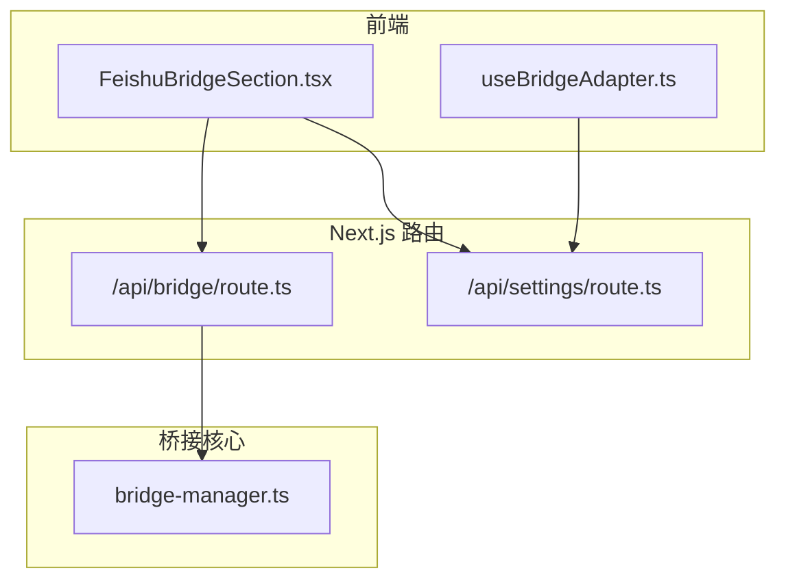
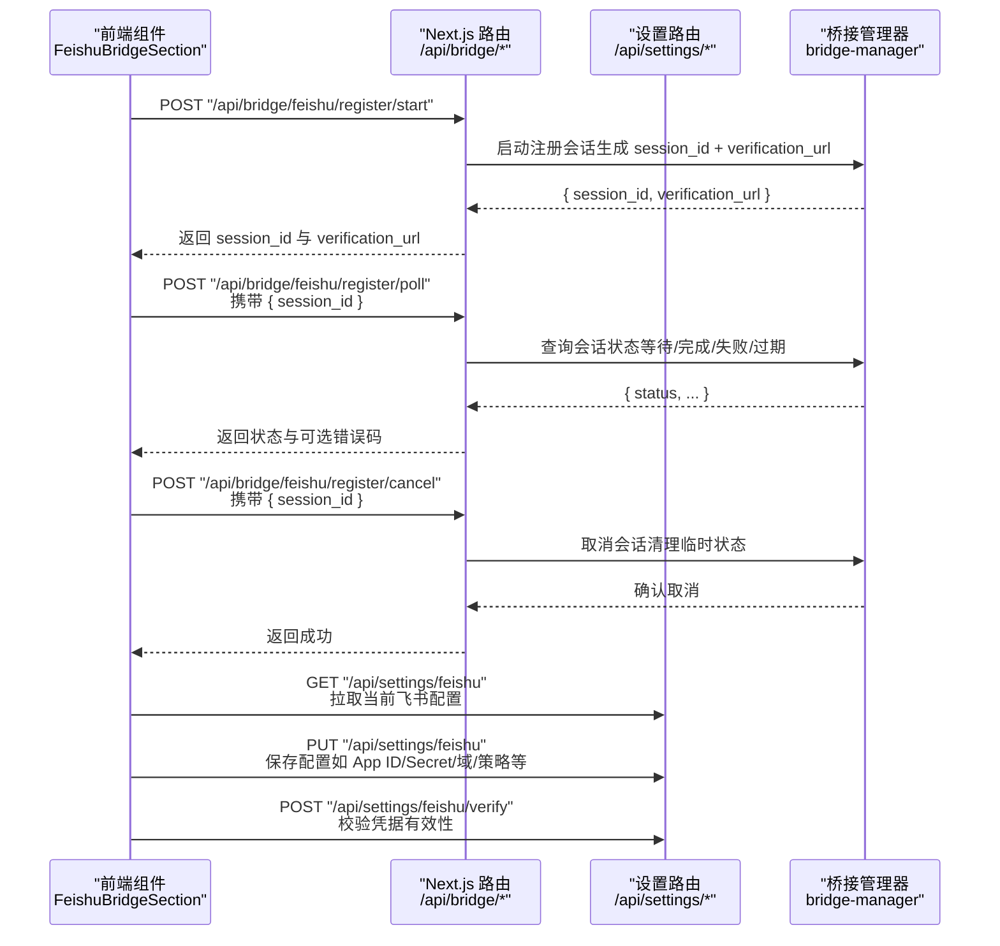
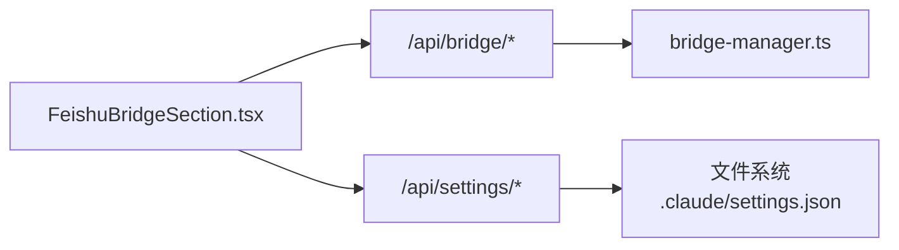

# 桥接 API

<cite>
**本文引用的文件**
- [src/app/api/bridge/route.ts](file://src/app/api/bridge/route.ts)
- [src/components/bridge/FeishuBridgeSection.tsx](file://src/components/bridge/FeishuBridgeSection.tsx)
- [src/hooks/useBridgeAdapter.ts](file://src/hooks/useBridgeAdapter.ts)
- [src/app/api/settings/route.ts](file://src/app/api/settings/route.ts)
- [src/lib/bridge/bridge-manager.ts](file://src/lib/bridge/bridge-manager.ts)
- [资料/package/dist/commands/install.js](file://资料/package/dist/commands/install.js)
- [资料/package/dist/commands/doctor.js](file://资料/package/dist/commands/doctor.js)
</cite>

## 目录
1. [简介](#简介)
2. [项目结构](#项目结构)
3. [核心组件](#核心组件)
4. [架构总览](#架构总览)
5. [详细组件分析](#详细组件分析)
6. [依赖关系分析](#依赖关系分析)
7. [性能考量](#性能考量)
8. [故障排查指南](#故障排查指南)
9. [结论](#结论)
10. [附录](#附录)

## 简介
本文件为 CodePilot 桥接 API 的权威参考文档，聚焦于飞书（Feishu）桥接通道的注册、轮询与取消等关键流程，覆盖 HTTP 方法、URL 模式、请求/响应格式、认证要求、错误处理策略以及第三方平台集成要点。同时给出桥接通道管理、状态查询、权限验证流程的端到端说明，并提供面向前端与后端开发者的最佳实践与排障建议。

## 项目结构
围绕桥接 API 的关键文件分布如下：
- Next.js 路由层：负责对外暴露桥接控制与状态接口
- 前端组件：封装飞书快速创建、轮询、取消、保存配置与校验
- 钩子：抽象通用的适配器设置读取/保存/校验逻辑
- 设置持久化：统一读写本地设置文件
- 桥接管理器：编排多通道桥接生命周期与消息处理

图表来源
- [src/app/api/bridge/route.ts:1-57](file://src/app/api/bridge/route.ts#L1-L57)
- [src/app/api/settings/route.ts:1-61](file://src/app/api/settings/route.ts#L1-L61)
- [src/components/bridge/FeishuBridgeSection.tsx:1-692](file://src/components/bridge/FeishuBridgeSection.tsx#L1-L692)
- [src/hooks/useBridgeAdapter.ts:1-107](file://src/hooks/useBridgeAdapter.ts#L1-L107)
- [src/lib/bridge/bridge-manager.ts:1-800](file://src/lib/bridge/bridge-manager.ts#L1-L800)

章节来源
- [src/app/api/bridge/route.ts:1-57](file://src/app/api/bridge/route.ts#L1-L57)
- [src/app/api/settings/route.ts:1-61](file://src/app/api/settings/route.ts#L1-L61)
- [src/components/bridge/FeishuBridgeSection.tsx:1-692](file://src/components/bridge/FeishuBridgeSection.tsx#L1-L692)
- [src/hooks/useBridgeAdapter.ts:1-107](file://src/hooks/useBridgeAdapter.ts#L1-L107)
- [src/lib/bridge/bridge-manager.ts:1-800](file://src/lib/bridge/bridge-manager.ts#L1-L800)

## 核心组件
- 桥接控制路由：提供桥接系统启停与状态查询的统一入口
- 飞书桥接前端组件：封装快速创建、轮询、取消、保存配置与校验
- 通用适配器钩子：抽象跨平台（飞书/电报/QQ/微信）设置读取/保存/校验
- 设置持久化路由：读写本地设置文件（用于桥接参数）
- 桥接管理器：启动/停止适配器、运行事件循环、处理消息与权限

章节来源
- [src/app/api/bridge/route.ts:14-56](file://src/app/api/bridge/route.ts#L14-L56)
- [src/components/bridge/FeishuBridgeSection.tsx:74-308](file://src/components/bridge/FeishuBridgeSection.tsx#L74-L308)
- [src/hooks/useBridgeAdapter.ts:13-106](file://src/hooks/useBridgeAdapter.ts#L13-L106)
- [src/app/api/settings/route.ts:28-60](file://src/app/api/settings/route.ts#L28-L60)
- [src/lib/bridge/bridge-manager.ts:263-438](file://src/lib/bridge/bridge-manager.ts#L263-L438)

## 架构总览
下图展示从浏览器到桥接管理器的调用链路，包括飞书快速创建的三段式交互（启动会话、轮询状态、取消清理）：

图表来源
- [src/components/bridge/FeishuBridgeSection.tsx:185-308](file://src/components/bridge/FeishuBridgeSection.tsx#L185-L308)
- [src/app/api/bridge/route.ts:30-56](file://src/app/api/bridge/route.ts#L30-L56)
- [src/app/api/settings/route.ts:28-60](file://src/app/api/settings/route.ts#L28-L60)
- [src/lib/bridge/bridge-manager.ts:263-438](file://src/lib/bridge/bridge-manager.ts#L263-L438)

## 详细组件分析

### 桥接控制 API（/api/bridge）
- 功能
  - GET /api/bridge：返回桥接系统状态（不触发探测），供前端每 5 秒轮询
  - POST /api/bridge：执行启动/停止/自动启动操作
- 请求体（POST /api/bridge）
  - 字段：action（枚举：start | stop | auto-start）
- 响应
  - start：返回 { ok, reason, status }
  - stop：返回 { ok, status }
  - auto-start：返回 { ok, status }
- 错误
  - 非法 action：400
  - 其他异常：500

章节来源
- [src/app/api/bridge/route.ts:7-24](file://src/app/api/bridge/route.ts#L7-L24)
- [src/app/api/bridge/route.ts:26-56](file://src/app/api/bridge/route.ts#L26-L56)

### 飞书注册 API（/api/bridge/feishu/register/*）
- 功能
  - POST /api/bridge/feishu/register/start：启动注册会话，返回 session_id 与 verification_url
  - POST /api/bridge/feishu/register/poll：轮询会话状态（waiting/completed/failed/expired）
  - POST /api/bridge/feishu/register/cancel：取消会话（清理临时状态）
- 请求体
  - start：无
  - poll：{ session_id }
  - cancel：{ session_id }
- 响应（poll）
  - waiting：{ status: "waiting", interval_ms? }
  - completed：{ status: "completed", bot_name?, verify_error?, bridge_restart_error? }
  - failed/expired：{ status: "failed"/"expired", error_code?, error_detail? }
- 错误
  - 会话不存在或已过期：404/非 2xx
  - 参数缺失：400
  - 其他异常：500

章节来源
- [src/components/bridge/FeishuBridgeSection.tsx:185-308](file://src/components/bridge/FeishuBridgeSection.tsx#L185-L308)

### 设置持久化 API（/api/settings/*）
- 功能
  - GET /api/settings：读取本地设置文件（默认位于用户主目录下的 .claude/settings.json）
  - PUT /api/settings：写入设置
  - GET /api/settings/:platform：读取平台特定设置（如 feishu）
  - PUT /api/settings/:platform：写入平台特定设置
  - POST /api/settings/:platform/verify：校验平台凭据（如飞书 App ID/Secret）
- 请求体（PUT /api/settings 或 /api/settings/:platform）
  - { settings: { ... } }
- 响应
  - 读取：{ settings: { ... } }
  - 写入：{ success: true }
  - 校验：{ verified: boolean, botName?, error? }
- 错误
  - 非法数据：400
  - 文件读写失败：500

章节来源
- [src/app/api/settings/route.ts:28-60](file://src/app/api/settings/route.ts#L28-L60)
- [src/hooks/useBridgeAdapter.ts:35-100](file://src/hooks/useBridgeAdapter.ts#L35-L100)

### 桥接管理器（bridge-manager）
- 功能
  - 启动/停止桥接系统，按配置启用各通道适配器
  - 运行适配器事件循环，处理消息、权限、流式预览/卡片渲染
  - 提供 getStatus 接口供前端轮询
- 关键行为
  - start：检查开关与配置，创建并启动适配器；至少一个适配器成功启动才标记运行中
  - stop：终止所有适配器与任务，恢复通知轮询
  - getStatus：返回运行状态、启动时间、各适配器连接与最近消息/错误

章节来源
- [src/lib/bridge/bridge-manager.ts:263-438](file://src/lib/bridge/bridge-manager.ts#L263-L438)

### 飞书桥接前端组件（FeishuBridgeSection）
- 功能
  - 快速创建：POST /api/bridge/feishu/register/start -> 打开 verification_url -> 轮询 /api/bridge/feishu/register/poll -> 完成后刷新设置
  - 取消：POST /api/bridge/feishu/register/cancel 清理会话
  - 保存配置：PUT /api/settings/feishu
  - 凭据校验：POST /api/settings/feishu/verify
- 轮询策略
  - 基于服务器返回的 interval_ms 自适应调整轮询间隔
  - 支持取消（AbortController）与过期检测（runId）

章节来源
- [src/components/bridge/FeishuBridgeSection.tsx:185-308](file://src/components/bridge/FeishuBridgeSection.tsx#L185-L308)

### 通用适配器钩子（useBridgeAdapter）
- 功能
  - 统一处理平台设置的读取/保存/校验流程
  - 适用于飞书、电报、QQ、微信等适配器
- 行为
  - refresh：GET /api/settings/:platform
  - save：PUT /api/settings/:platform
  - verify：POST /api/settings/:platform/verify

章节来源
- [src/hooks/useBridgeAdapter.ts:13-106](file://src/hooks/useBridgeAdapter.ts#L13-L106)

## 依赖关系分析
- 前端组件依赖 Next.js 路由与设置持久化 API
- Next.js 路由依赖桥接管理器进行启停与状态查询
- 设置持久化路由负责本地配置文件读写
- 飞书注册流程通过桥接管理器协调会话状态

图表来源
- [src/components/bridge/FeishuBridgeSection.tsx:185-308](file://src/components/bridge/FeishuBridgeSection.tsx#L185-L308)
- [src/app/api/bridge/route.ts:30-56](file://src/app/api/bridge/route.ts#L30-L56)
- [src/app/api/settings/route.ts:28-60](file://src/app/api/settings/route.ts#L28-L60)
- [src/lib/bridge/bridge-manager.ts:263-438](file://src/lib/bridge/bridge-manager.ts#L263-L438)

章节来源
- [src/app/api/bridge/route.ts:14-56](file://src/app/api/bridge/route.ts#L14-L56)
- [src/app/api/settings/route.ts:1-61](file://src/app/api/settings/route.ts#L1-L61)
- [src/components/bridge/FeishuBridgeSection.tsx:1-692](file://src/components/bridge/FeishuBridgeSection.tsx#L1-L692)
- [src/hooks/useBridgeAdapter.ts:1-107](file://src/hooks/useBridgeAdapter.ts#L1-L107)
- [src/lib/bridge/bridge-manager.ts:1-800](file://src/lib/bridge/bridge-manager.ts#L1-L800)

## 性能考量
- /api/bridge GET 采用“纯查询、无副作用”，避免探测开销，适合高频轮询（前端每 5 秒）
- 注册轮询使用自适应间隔（interval_ms），在等待阶段降低请求频率
- 桥接管理器在启动时仅在满足条件（至少一个适配器成功）后才标记运行，避免无效运行态
- 流式输出针对不同通道采用差异化节流与分片策略，兼顾实时性与平台限制

## 故障排查指南
- 注册流程常见问题
  - 会话过期/失败：轮询返回 expired/failed，需重新发起 start 并打开 verification_url
  - 用户拒绝授权：error_code 为 user_denied，提示用户重新授权
  - 凭据为空：error_code 为 empty_credentials/lark_empty_credentials，检查 App ID/Secret 是否填写
  - 服务器错误：轮询非 2xx 视为终端错误，前端停止轮询并提示失败
- 配置校验
  - 使用 /api/settings/:platform/verify 校验 App ID/Secret/域是否正确
  - 若配置缺失或不完整，可参考安装脚本中的默认项与修复逻辑
- 本地设置
  - 确认 .claude/settings.json 存在且可读写
  - 保存设置后立即生效，若出现异常，检查文件权限与磁盘空间

章节来源
- [src/components/bridge/FeishuBridgeSection.tsx:253-276](file://src/components/bridge/FeishuBridgeSection.tsx#L253-L276)
- [资料/package/dist/commands/doctor.js:108-136](file://资料/package/dist/commands/doctor.js#L108-L136)
- [资料/package/dist/commands/install.js:66-117](file://资料/package/dist/commands/install.js#L66-L117)

## 结论
本文档梳理了 CodePilot 桥接 API 的核心端点与流程，重点覆盖飞书注册、轮询与取消的完整规范，明确了请求/响应模式、错误处理策略与第三方平台集成要点。结合前端组件与通用钩子，开发者可快速实现跨平台桥接能力，并通过桥接管理器与设置持久化路由获得一致的运行时体验。

## 附录

### HTTP 端点一览（摘要）
- GET /api/bridge
  - 用途：查询桥接系统状态（轮询）
  - 认证：无
  - 响应：桥接状态对象
- POST /api/bridge
  - 用途：启动/停止/自动启动桥接
  - 请求体：{ action: "start"|"stop"|"auto-start" }
  - 响应：根据 action 返回对应结果
- POST /api/bridge/feishu/register/start
  - 用途：启动飞书注册会话
  - 响应：{ session_id, verification_url }
- POST /api/bridge/feishu/register/poll
  - 用途：轮询注册状态
  - 请求体：{ session_id }
  - 响应：{ status: "waiting"|"completed"|"failed"|"expired", ... }
- POST /api/bridge/feishu/register/cancel
  - 用途：取消注册会话
  - 请求体：{ session_id }
  - 响应：确认取消
- GET /api/settings
- PUT /api/settings
- GET /api/settings/:platform
- PUT /api/settings/:platform
- POST /api/settings/:platform/verify

章节来源
- [src/app/api/bridge/route.ts:7-56](file://src/app/api/bridge/route.ts#L7-L56)
- [src/app/api/settings/route.ts:28-60](file://src/app/api/settings/route.ts#L28-L60)
- [src/components/bridge/FeishuBridgeSection.tsx:185-308](file://src/components/bridge/FeishuBridgeSection.tsx#L185-L308)