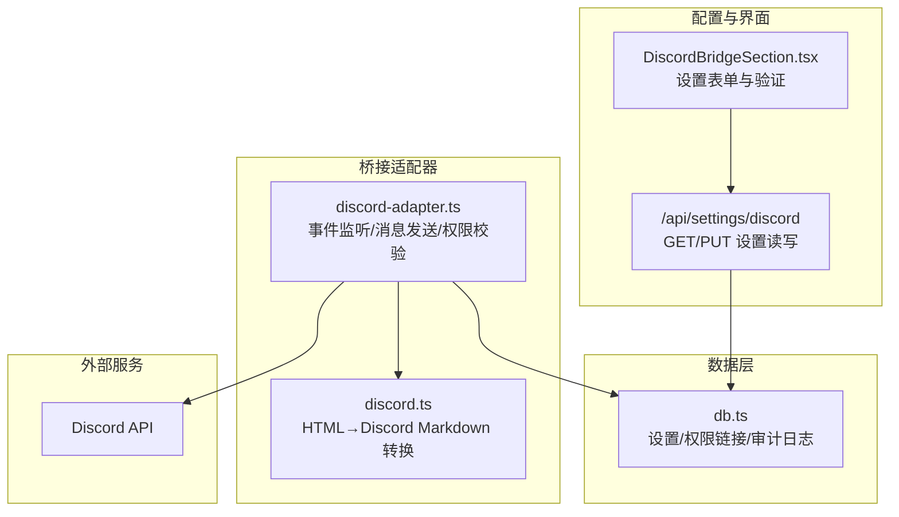
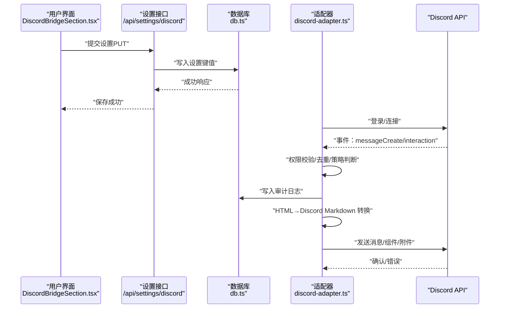
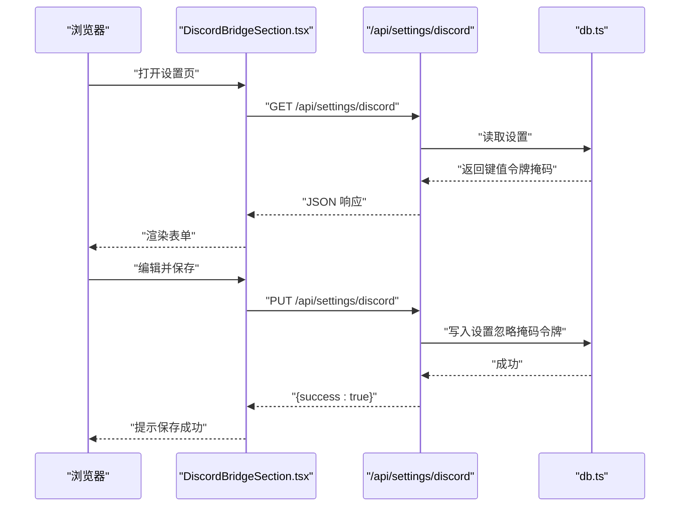
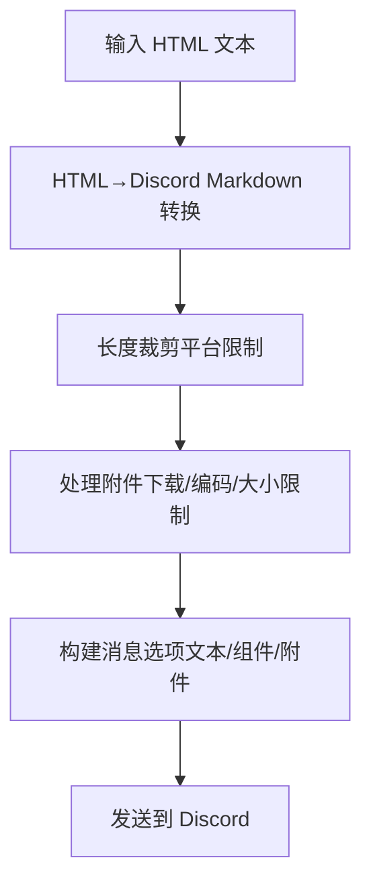
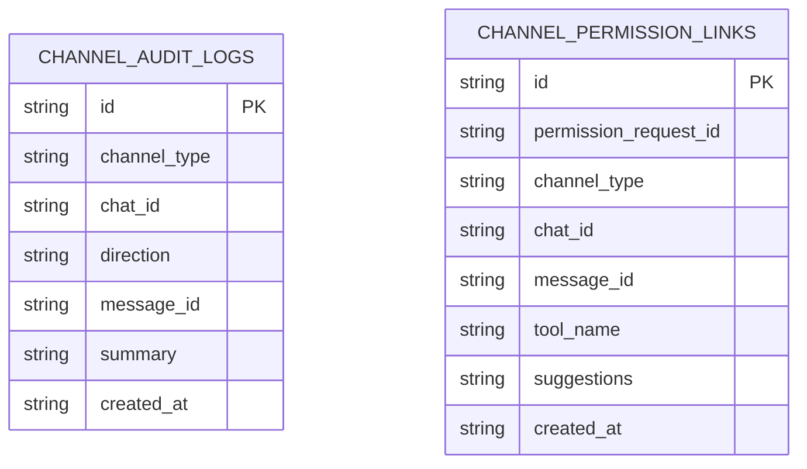
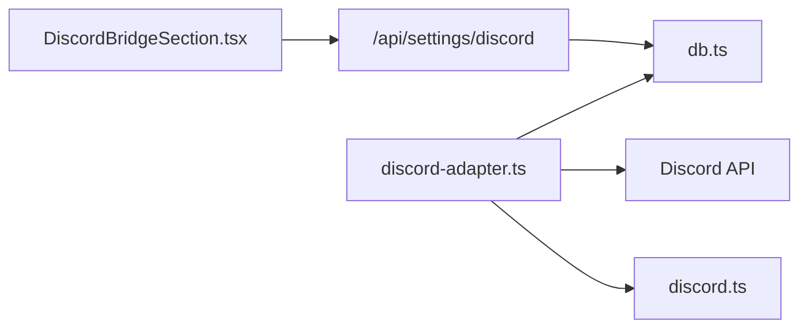

# Discord 桥接 API

<cite>
**本文引用的文件**
- [discord-adapter.ts](file://src/lib/bridge/adapters/discord-adapter.ts)
- [route.ts](file://src/app/api/settings/discord/route.ts)
- [DiscordBridgeSection.tsx](file://src/components/bridge/DiscordBridgeSection.tsx)
- [discord.ts](file://src/lib/bridge/markdown/discord.ts)
- [db.ts](file://src/lib/db.ts)
- [discord-bridge.test.ts](file://src/__tests__/unit/discord-bridge.test.ts)
</cite>

## 目录
1. [简介](#简介)
2. [项目结构](#项目结构)
3. [核心组件](#核心组件)
4. [架构总览](#架构总览)
5. [详细组件分析](#详细组件分析)
6. [依赖关系分析](#依赖关系分析)
7. [性能考量](#性能考量)
8. [故障排查指南](#故障排查指南)
9. [结论](#结论)
10. [附录](#附录)

## 简介
本文件系统性阐述本仓库中的 Discord 桥接 API 实现，覆盖机器人创建、OAuth 授权与服务器权限配置、Webhook 设置、消息事件监听与实时通信、频道管理与角色权限、消息解析与渲染、命令处理与交互式组件、API 端点规范、事件类型与数据格式、消息转发与嵌入消息及附件处理、服务器集成与用户认证、以及错误处理最佳实践。目标是帮助开发者快速理解并正确部署与维护 Discord 桥接能力。

## 项目结构
与 Discord 桥接相关的核心模块分布如下：
- 适配器层：负责与 Discord 平台交互，包括事件监听、消息发送、权限校验、去重与审计日志等
- 配置与 UI：提供设置页面与 API，用于管理桥接参数（如机器人令牌、允许用户/频道/服务器、@提及策略等）
- 数据层：提供设置存储、权限链接与审计日志持久化
- Markdown 渲染：将通用 HTML 标签转换为 Discord 支持的 Markdown
- 测试：单元测试覆盖桥接行为的关键路径



图表来源
- [DiscordBridgeSection.tsx:65-330](file://src/components/bridge/DiscordBridgeSection.tsx#L65-L330)
- [route.ts:1-73](file://src/app/api/settings/discord/route.ts#L1-L73)
- [discord-adapter.ts:76-105](file://src/lib/bridge/adapters/discord-adapter.ts#L76-L105)
- [discord.ts](file://src/lib/bridge/markdown/discord.ts)
- [db.ts:3261-3300](file://src/lib/db.ts#L3261-L3300)

章节来源
- [DiscordBridgeSection.tsx:65-330](file://src/components/bridge/DiscordBridgeSection.tsx#L65-L330)
- [route.ts:1-73](file://src/app/api/settings/discord/route.ts#L1-L73)
- [discord-adapter.ts:76-105](file://src/lib/bridge/adapters/discord-adapter.ts#L76-L105)
- [discord.ts](file://src/lib/bridge/markdown/discord.ts)
- [db.ts:3261-3300](file://src/lib/db.ts#L3261-L3300)

## 核心组件
- Discord 适配器（discord-adapter.ts）
  - 生命周期与启动：动态加载 Discord SDK，初始化客户端，注册事件处理器
  - 事件监听：消息创建、交互（按钮）回调
  - 发送消息：支持文本、Markdown/HTML、组件（按钮）、附件
  - 权限控制：基于用户 ID、频道 ID、服务器 ID 与策略（开放/禁用/@提及）
  - 去重与审计：按消息 ID 去重，入库审计日志
  - HTML→Discord Markdown 转换
- 设置 API（/api/settings/discord）
  - 提供 GET/PUT 接口读写桥接配置键值
  - 对机器人令牌进行安全掩码返回
- 设置界面（DiscordBridgeSection.tsx）
  - 表单字段：机器人令牌、允许用户/频道/服务器、@提及策略、流式输出开关等
  - 验证与保存逻辑
- 数据层（db.ts）
  - 设置读写
  - 审计日志查询
  - 权限链接插入
- Markdown 渲染（discord.ts）
  - 常见 HTML 标签到 Discord Markdown 的映射

章节来源
- [discord-adapter.ts:76-105](file://src/lib/bridge/adapters/discord-adapter.ts#L76-L105)
- [discord-adapter.ts:229-249](file://src/lib/bridge/adapters/discord-adapter.ts#L229-L249)
- [discord-adapter.ts:406-416](file://src/lib/bridge/adapters/discord-adapter.ts#L406-L416)
- [discord-adapter.ts:570-580](file://src/lib/bridge/adapters/discord-adapter.ts#L570-L580)
- [route.ts:1-73](file://src/app/api/settings/discord/route.ts#L1-L73)
- [DiscordBridgeSection.tsx:65-330](file://src/components/bridge/DiscordBridgeSection.tsx#L65-L330)
- [db.ts:3261-3300](file://src/lib/db.ts#L3261-L3300)
- [discord.ts](file://src/lib/bridge/markdown/discord.ts)

## 架构总览
下图展示了从设置到事件处理与消息发送的整体流程：



图表来源
- [DiscordBridgeSection.tsx:65-330](file://src/components/bridge/DiscordBridgeSection.tsx#L65-L330)
- [route.ts:47-73](file://src/app/api/settings/discord/route.ts#L47-L73)
- [discord-adapter.ts:76-105](file://src/lib/bridge/adapters/discord-adapter.ts#L76-L105)
- [discord-adapter.ts:406-416](file://src/lib/bridge/adapters/discord-adapter.ts#L406-L416)
- [discord-adapter.ts:229-249](file://src/lib/bridge/adapters/discord-adapter.ts#L229-L249)
- [db.ts:3261-3300](file://src/lib/db.ts#L3261-L3300)

## 详细组件分析

### 组件一：Discord 适配器（事件监听与消息发送）
- 启动与生命周期
  - 动态导入 Discord SDK，创建 Client 并注册事件处理器
  - 校验配置（启用开关、机器人令牌）
- 事件监听
  - messageCreate：处理消息入站，执行去重、权限校验、@提及策略、附件下载与解析
  - interaction（按钮）：处理交互回调，延迟响应避免超时，存储待回调的交互条目
- 发送消息
  - 文本：支持原生 Markdown；当 parseMode=HTML 时先转换为 Discord Markdown
  - 组件：构建交互式按钮组件
  - 附件：限制大小与数量，下载并转为 Base64
- 权限与策略
  - 允许用户/频道/服务器白名单
  - 服务器策略：开放、禁用、@提及强制
- 去重与审计
  - 基于消息 ID 的去重集合
  - 入站消息写入审计日志，便于追踪与排障

```mermaid
flowchart TD
Start(["进入 handleMessageCreate"]) --> BotCheck["过滤机器人消息"]
BotCheck --> Dedup["去重检查seenMessageIds"]
Dedup --> |重复| End
Dedup --> |新消息| Auth["权限校验用户/频道/服务器"]
Auth --> |未授权| End
Auth --> Policy["服务器策略开放/禁用/@提及"]
Policy --> |禁用或未@| End
Policy --> Parse["解析文本/附件/嵌入"]
Parse --> Audit["写入审计日志"]
Audit --> Enqueue["入队InboundMessage"]
Enqueue --> End(["结束"])
```

图表来源
- [discord-adapter.ts:406-416](file://src/lib/bridge/adapters/discord-adapter.ts#L406-L416)
- [discord-adapter.ts:418-460](file://src/lib/bridge/adapters/discord-adapter.ts#L418-L460)
- [discord-adapter.ts:554-567](file://src/lib/bridge/adapters/discord-adapter.ts#L554-L567)

章节来源
- [discord-adapter.ts:76-105](file://src/lib/bridge/adapters/discord-adapter.ts#L76-L105)
- [discord-adapter.ts:406-416](file://src/lib/bridge/adapters/discord-adapter.ts#L406-L416)
- [discord-adapter.ts:418-460](file://src/lib/bridge/adapters/discord-adapter.ts#L418-L460)
- [discord-adapter.ts:554-567](file://src/lib/bridge/adapters/discord-adapter.ts#L554-L567)

### 组件二：设置 API 与界面
- 设置 API
  - GET：读取所有桥接配置键值，对机器人令牌进行掩码保护
  - PUT：批量更新配置键值，忽略回传的掩码令牌
- 设置界面
  - 表单字段：启用开关、机器人令牌、允许用户/频道/服务器、@提及策略、流式输出开关等
  - 验证与保存：调用设置 API，显示结果状态



图表来源
- [route.ts:25-73](file://src/app/api/settings/discord/route.ts#L25-L73)
- [DiscordBridgeSection.tsx:84-95](file://src/components/bridge/DiscordBridgeSection.tsx#L84-L95)

章节来源
- [route.ts:1-73](file://src/app/api/settings/discord/route.ts#L1-L73)
- [DiscordBridgeSection.tsx:65-330](file://src/components/bridge/DiscordBridgeSection.tsx#L65-L330)

### 组件三：Markdown 渲染与消息解析
- HTML→Discord Markdown
  - 将常用标签（粗体、斜体等）转换为 Discord 支持的 Markdown
- 消息解析
  - 文本裁剪至平台限制
  - 附件下载与编码，生成统一的附件对象
  - 嵌入消息与附件组合发送



图表来源
- [discord-adapter.ts:251-269](file://src/lib/bridge/adapters/discord-adapter.ts#L251-L269)
- [discord-adapter.ts:521-534](file://src/lib/bridge/adapters/discord-adapter.ts#L521-L534)
- [discord.ts](file://src/lib/bridge/markdown/discord.ts)

章节来源
- [discord-adapter.ts:251-269](file://src/lib/bridge/adapters/discord-adapter.ts#L251-L269)
- [discord-adapter.ts:521-534](file://src/lib/bridge/adapters/discord-adapter.ts#L521-L534)
- [discord.ts](file://src/lib/bridge/markdown/discord.ts)

### 组件四：权限与审计
- 权限控制
  - 用户白名单、频道白名单、服务器白名单
  - 策略：开放、禁用、@提及强制
- 审计日志
  - 记录入站/出站消息摘要，支持按频道类型与聊天 ID 查询



图表来源
- [db.ts:3261-3300](file://src/lib/db.ts#L3261-L3300)

章节来源
- [discord-adapter.ts:381-402](file://src/lib/bridge/adapters/discord-adapter.ts#L381-L402)
- [db.ts:3261-3300](file://src/lib/db.ts#L3261-L3300)

## 依赖关系分析
- 适配器依赖
  - Discord SDK（动态导入）
  - 设置读取（getSetting）
  - 数据库（设置、审计日志、权限链接）
  - Markdown 渲染工具
- UI 依赖
  - 设置 API
  - 国际化文案
- 外部依赖
  - Discord API（事件、消息、交互）



图表来源
- [DiscordBridgeSection.tsx:65-330](file://src/components/bridge/DiscordBridgeSection.tsx#L65-L330)
- [route.ts:1-73](file://src/app/api/settings/discord/route.ts#L1-L73)
- [discord-adapter.ts:76-105](file://src/lib/bridge/adapters/discord-adapter.ts#L76-L105)
- [discord.ts](file://src/lib/bridge/markdown/discord.ts)
- [db.ts:3261-3300](file://src/lib/db.ts#L3261-L3300)

章节来源
- [DiscordBridgeSection.tsx:65-330](file://src/components/bridge/DiscordBridgeSection.tsx#L65-L330)
- [route.ts:1-73](file://src/app/api/settings/discord/route.ts#L1-L73)
- [discord-adapter.ts:76-105](file://src/lib/bridge/adapters/discord-adapter.ts#L76-L105)
- [discord.ts](file://src/lib/bridge/markdown/discord.ts)
- [db.ts:3261-3300](file://src/lib/db.ts#L3261-L3300)

## 性能考量
- 去重机制：使用固定容量的去重集合，避免内存无限增长
- 附件处理：限制最大附件大小与数量，下载失败时降级处理
- 流式输出：可配置流式发送间隔与字符阈值，平衡实时性与带宽
- 事件处理：对交互采用 deferUpdate 避免超时，降低失败率

章节来源
- [discord-adapter.ts:618-630](file://src/lib/bridge/adapters/discord-adapter.ts#L618-L630)
- [discord-adapter.ts:521-534](file://src/lib/bridge/adapters/discord-adapter.ts#L521-L534)
- [discord-adapter.ts:251-269](file://src/lib/bridge/adapters/discord-adapter.ts#L251-L269)

## 故障排查指南
- 启动失败
  - 检查启用开关与机器人令牌是否配置
  - 查看控制台警告与错误日志
- 无法接收消息
  - 确认允许用户/频道/服务器白名单
  - 检查服务器策略与@提及要求
- 无法发送消息
  - 确认目标频道存在且可发送
  - 检查文本长度与附件限制
- 交互按钮无响应
  - 确认 deferUpdate 是否成功
  - 检查交互条目是否过期清理
- 审计日志缺失
  - 确认写入逻辑未被异常吞掉
  - 使用查询接口核对日志

章节来源
- [discord-adapter.ts:79-83](file://src/lib/bridge/adapters/discord-adapter.ts#L79-L83)
- [discord-adapter.ts:231-246](file://src/lib/bridge/adapters/discord-adapter.ts#L231-L246)
- [discord-adapter.ts:570-580](file://src/lib/bridge/adapters/discord-adapter.ts#L570-L580)
- [db.ts:3261-3300](file://src/lib/db.ts#L3261-L3300)

## 结论
本实现提供了完整的 Discord 桥接能力：从配置与 UI、事件监听与消息发送、权限与审计，到 Markdown 渲染与附件处理。通过严格的权限控制、去重与审计机制，以及可配置的流式输出策略，能够在保证安全性的同时提供良好的实时通信体验。建议在生产环境中结合监控与告警，持续优化性能与稳定性。

## 附录

### API 端点规范
- GET /api/settings/discord
  - 返回：包含所有桥接配置键值的对象；机器人令牌仅返回掩码后的部分
  - 状态码：200 成功；500 错误
- PUT /api/settings/discord
  - 请求体：{ settings: { 键: 值 } }
  - 行为：仅接受受支持的键；忽略回传的掩码令牌
  - 状态码：200 成功；400 参数无效；500 错误

章节来源
- [route.ts:25-73](file://src/app/api/settings/discord/route.ts#L25-L73)

### 事件类型与数据格式
- 事件类型
  - messageCreate：消息入站
  - interaction（按钮）：交互回调
- 入站消息结构（简化）
  - messageId: string
  - address: { channelType: 'discord', chatId, userId, displayName }
  - text: string
  - timestamp: number
  - attachments?: 数组（name/type/size/data）
- 出站消息结构（简化）
  - address: { chatId }
  - text: string
  - parseMode: 'HTML' | 'Markdown'
  - components?: 数组（按钮等）
  - attachments?: 数组（name/type/size/data）

章节来源
- [discord-adapter.ts:418-460](file://src/lib/bridge/adapters/discord-adapter.ts#L418-L460)
- [discord-adapter.ts:545-551](file://src/lib/bridge/adapters/discord-adapter.ts#L545-L551)
- [discord-adapter.ts:229-249](file://src/lib/bridge/adapters/discord-adapter.ts#L229-L249)

### 服务器权限配置要点
- 允许用户/频道/服务器白名单
- 服务器策略：open（开放）、disabled（禁用）、require_mention（@提及）
- 机器人所需权限（示例）
  - 消息读取、发送、更新、表情回复、资源访问等

章节来源
- [discord-adapter.ts:381-402](file://src/lib/bridge/adapters/discord-adapter.ts#L381-L402)
- [discord-adapter.ts:436-460](file://src/lib/bridge/adapters/discord-adapter.ts#L436-L460)

### 命令处理与交互式组件
- 命令处理
  - 通过消息解析与策略判断识别命令入口
- 交互式组件
  - 按钮组件：通过 deferUpdate 延迟响应，存储交互条目，后续回调处理

章节来源
- [discord-adapter.ts:570-612](file://src/lib/bridge/adapters/discord-adapter.ts#L570-L612)

### 消息转发、嵌入与附件处理
- 消息转发
  - 入站消息经解析与权限校验后入队，由上层处理转发
- 嵌入消息
  - 通过 Markdown 与 HTML 转换实现富文本展示
- 附件处理
  - 下载并编码为 Base64，限制大小与数量，生成统一附件对象

章节来源
- [discord-adapter.ts:521-534](file://src/lib/bridge/adapters/discord-adapter.ts#L521-L534)
- [discord-adapter.ts:251-269](file://src/lib/bridge/adapters/discord-adapter.ts#L251-L269)

### 最佳实践
- 安全性
  - 令牌掩码返回与不回写掩码令牌
  - 白名单优先，最小权限原则
- 可靠性
  - deferUpdate 避免超时
  - 去重与审计日志保障一致性
- 性能
  - 合理配置流式输出参数
  - 控制附件大小与数量

章节来源
- [route.ts:31-37](file://src/app/api/settings/discord/route.ts#L31-L37)
- [discord-adapter.ts:570-580](file://src/lib/bridge/adapters/discord-adapter.ts#L570-L580)
- [discord-adapter.ts:618-630](file://src/lib/bridge/adapters/discord-adapter.ts#L618-L630)