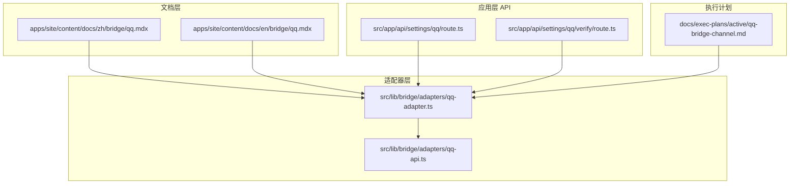
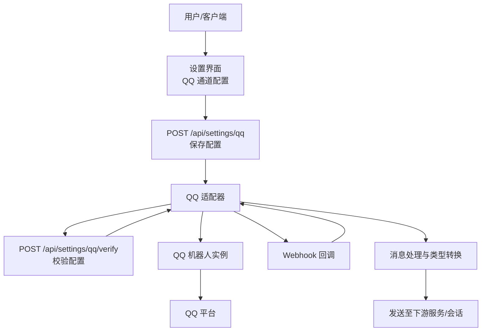
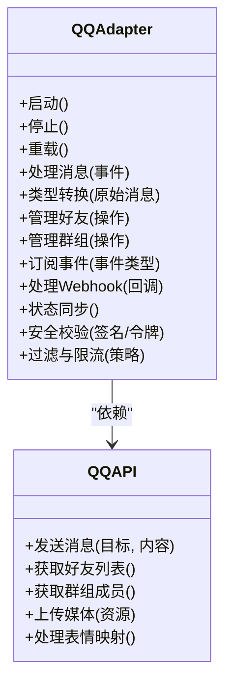
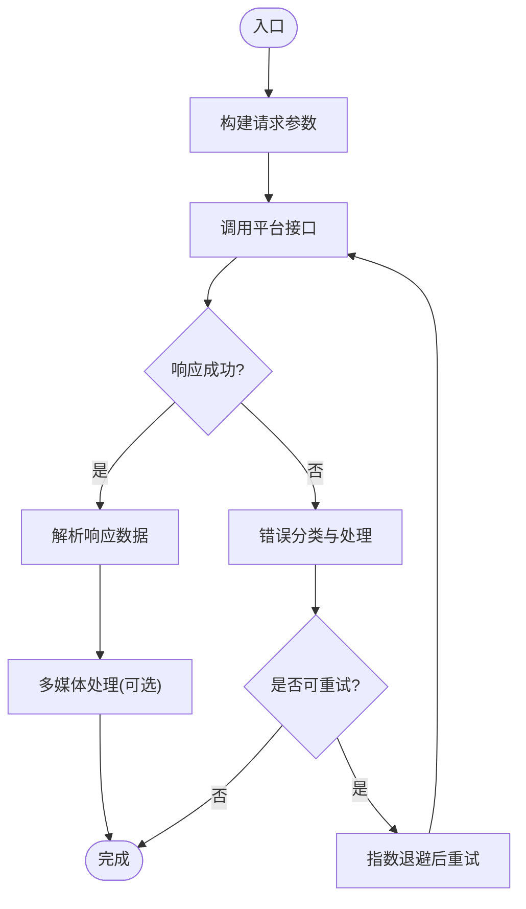
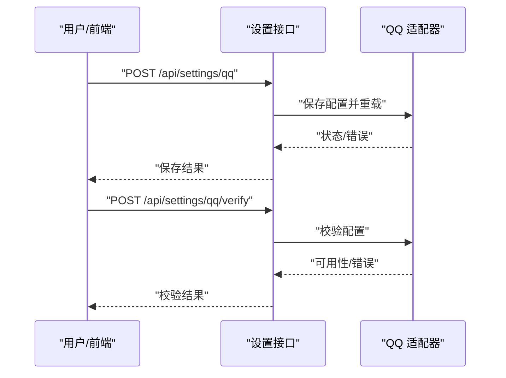
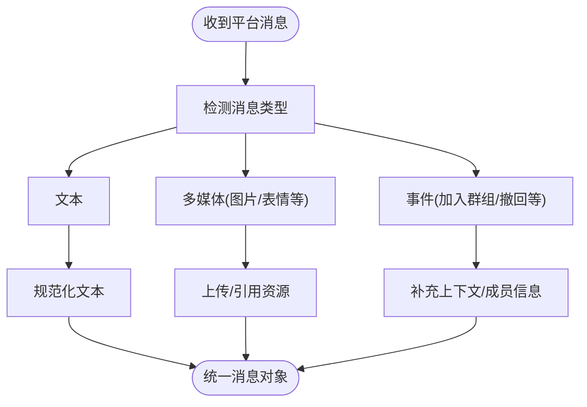
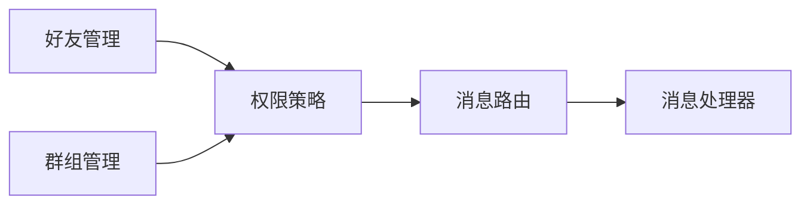
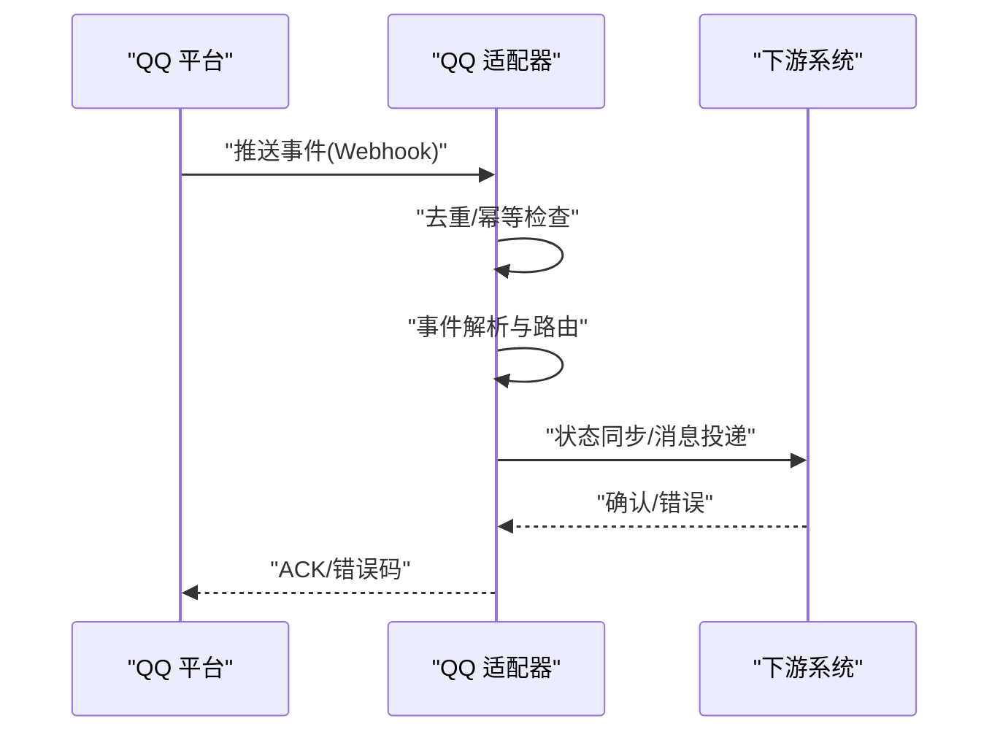
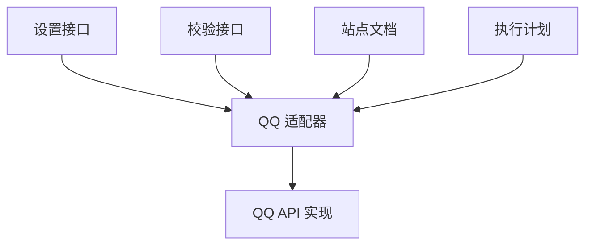

# QQ 桥接 API

<cite>
**本文引用的文件**
- [qq.mdx](file://apps/site/content/docs/zh/bridge/qq.mdx)
- [qq.mdx](file://apps/site/content/docs/en/bridge/qq.mdx)
- [qq-adapter.ts](file://src/lib/bridge/adapters/qq-adapter.ts)
- [qq-api.ts](file://src/lib/bridge/adapters/qq-api.ts)
- [route.ts](file://src/app/api/settings/qq/route.ts)
- [route.ts](file://src/app/api/settings/qq/verify/route.ts)
- [qq-bridge-channel.md](file://docs/exec-plans/active/qq-bridge-channel.md)
</cite>

## 目录
1. [简介](#简介)
2. [项目结构](#项目结构)
3. [核心组件](#核心组件)
4. [架构总览](#架构总览)
5. [详细组件分析](#详细组件分析)
6. [依赖分析](#依赖分析)
7. [性能考虑](#性能考虑)
8. [故障排除指南](#故障排除指南)
9. [结论](#结论)
10. [附录](#附录)

## 简介
本文件为 QQ 桥接 API 的完整技术文档，面向需要在 CodePilot 中集成 QQ 机器人、实现消息接收与转发、群组管理、好友关系处理、消息类型转换、表情与多媒体支持、事件订阅与 Webhook 回调、状态同步、API 端点规范、请求/响应格式、消息过滤、频率限制与安全校验、以及群聊与私聊权限控制的开发者与运维人员。文档基于仓库中的现有实现与文档进行系统化整理，并提供可视化图示帮助理解。

## 项目结构
与 QQ 桥接相关的核心位置包括：
- 文档层：站点文档中包含 QQ 桥接的用户指引与功能说明
- 应用层：设置接口用于保存与校验 QQ 通道配置
- 适配器层：QQ 适配器与 QQ API 封装，负责消息桥接与平台交互
- 执行计划：关于 QQ 桥接通道的活动执行计划与设计要点

**图表来源**
- [qq.mdx](file://apps/site/content/docs/zh/bridge/qq.mdx)
- [qq.mdx](file://apps/site/content/docs/en/bridge/qq.mdx)
- [qq-adapter.ts](file://src/lib/bridge/adapters/qq-adapter.ts)
- [qq-api.ts](file://src/lib/bridge/adapters/qq-api.ts)
- [route.ts](file://src/app/api/settings/qq/route.ts)
- [route.ts](file://src/app/api/settings/qq/verify/route.ts)
- [qq-bridge-channel.md](file://docs/exec-plans/active/qq-bridge-channel.md)

**章节来源**
- [qq.mdx](file://apps/site/content/docs/zh/bridge/qq.mdx)
- [qq.mdx](file://apps/site/content/docs/en/bridge/qq.mdx)
- [qq-adapter.ts](file://src/lib/bridge/adapters/qq-adapter.ts)
- [qq-api.ts](file://src/lib/bridge/adapters/qq-api.ts)
- [route.ts](file://src/app/api/settings/qq/route.ts)
- [route.ts](file://src/app/api/settings/qq/verify/route.ts)
- [qq-bridge-channel.md](file://docs/exec-plans/active/qq-bridge-channel.md)

## 核心组件
- QQ 适配器：封装 QQ 机器人与平台交互的业务逻辑，负责消息接收、类型转换、群组与好友关系处理、事件订阅与回调、状态同步等
- QQ API 实现：对底层 QQ 平台接口的封装，提供统一的请求/响应模型与错误处理
- 设置路由：提供 QQ 通道配置的保存与校验端点，确保令牌与参数有效
- 文档与执行计划：提供用户侧的配置指引与系统设计要点

**章节来源**
- [qq-adapter.ts](file://src/lib/bridge/adapters/qq-adapter.ts)
- [qq-api.ts](file://src/lib/bridge/adapters/qq-api.ts)
- [route.ts](file://src/app/api/settings/qq/route.ts)
- [route.ts](file://src/app/api/settings/qq/verify/route.ts)
- [qq.mdx](file://apps/site/content/docs/zh/bridge/qq.mdx)

## 架构总览
下图展示了从用户侧到平台侧的消息桥接路径，以及配置与校验流程：

**图表来源**
- [route.ts](file://src/app/api/settings/qq/route.ts)
- [route.ts](file://src/app/api/settings/qq/verify/route.ts)
- [qq-adapter.ts](file://src/lib/bridge/adapters/qq-adapter.ts)

## 详细组件分析

### QQ 适配器（qq-adapter.ts）
职责与能力概览：
- 机器人生命周期管理：启动、停止、重载与状态查询
- 消息接收与分发：处理来自 QQ 平台的消息事件，区分群聊与私聊
- 类型转换：将平台消息转换为内部统一消息模型，支持文本、表情、图片等
- 好友与群组管理：维护好友列表、群组成员、权限与白名单
- 事件订阅与 Webhook：注册事件回调，处理平台推送
- 状态同步：与下游系统保持状态一致，处理断线重连与幂等
- 安全与鉴权：校验回调签名、令牌有效性与来源合法性
- 过滤与限流：按策略过滤消息、限制速率与频率

**图表来源**
- [qq-adapter.ts](file://src/lib/bridge/adapters/qq-adapter.ts)
- [qq-api.ts](file://src/lib/bridge/adapters/qq-api.ts)

**章节来源**
- [qq-adapter.ts](file://src/lib/bridge/adapters/qq-adapter.ts)

### QQ API 实现（qq-api.ts）
职责与能力概览：
- 统一请求/响应模型：定义消息体、错误码与状态码
- 平台接口封装：提供发送消息、拉取好友/群组信息、上传媒体等方法
- 多媒体支持：图片、表情等资源的上传与引用
- 错误处理：对平台异常进行分类与标准化输出
- 超时与重试：针对网络波动与平台限流的退避策略

**图表来源**
- [qq-api.ts](file://src/lib/bridge/adapters/qq-api.ts)

**章节来源**
- [qq-api.ts](file://src/lib/bridge/adapters/qq-api.ts)

### 设置与校验 API（/api/settings/qq 与 /api/settings/qq/verify）
- 保存配置（POST /api/settings/qq）
  - 接收参数：机器人令牌、平台参数、启用开关等
  - 校验与持久化：写入配置存储，触发适配器重载
- 校验配置（POST /api/settings/qq/verify）
  - 参数：待校验的配置项
  - 行为：模拟连接或轻量测试，返回可用性与错误信息

**图表来源**
- [route.ts](file://src/app/api/settings/qq/route.ts)
- [route.ts](file://src/app/api/settings/qq/verify/route.ts)
- [qq-adapter.ts](file://src/lib/bridge/adapters/qq-adapter.ts)

**章节来源**
- [route.ts](file://src/app/api/settings/qq/route.ts)
- [route.ts](file://src/app/api/settings/qq/verify/route.ts)

### 消息接收与类型转换
- 入站消息：平台推送或 Webhook 回调
- 类型识别：文本、图片、表情、语音、视频、文件等
- 转换规则：表情映射、图片链接替换、多媒体资源引用
- 输出：统一消息对象，包含来源、目标、内容、时间戳与元数据

**图表来源**
- [qq-adapter.ts](file://src/lib/bridge/adapters/qq-adapter.ts)
- [qq-api.ts](file://src/lib/bridge/adapters/qq-api.ts)

**章节来源**
- [qq-adapter.ts](file://src/lib/bridge/adapters/qq-adapter.ts)
- [qq-api.ts](file://src/lib/bridge/adapters/qq-api.ts)

### 群组管理与好友关系
- 好友关系：添加、删除、黑名单、白名单策略
- 群组管理：创建、解散、成员增删、管理员/群主权限
- 权限控制：按群组/个人维度配置访问与命令权限
- 会话路由：根据聊天类型（群聊/私聊）选择不同处理分支

**图表来源**
- [qq-adapter.ts](file://src/lib/bridge/adapters/qq-adapter.ts)

**章节来源**
- [qq-adapter.ts](file://src/lib/bridge/adapters/qq-adapter.ts)

### 事件订阅、Webhook 回调与状态同步
- 订阅事件：消息、加群、退群、禁言、撤回、名片更新等
- Webhook：平台主动推送事件，适配器进行幂等处理
- 状态同步：与下游系统保持一致，处理断线恢复与重放

**图表来源**
- [qq-adapter.ts](file://src/lib/bridge/adapters/qq-adapter.ts)

**章节来源**
- [qq-adapter.ts](file://src/lib/bridge/adapters/qq-adapter.ts)

### API 端点规范
- 保存配置
  - 方法：POST
  - 路径：/api/settings/qq
  - 请求体：包含机器人令牌、平台参数、启用状态等字段
  - 响应：保存结果与错误信息
- 校验配置
  - 方法：POST
  - 路径：/api/settings/qq/verify
  - 请求体：待校验配置项
  - 响应：可用性与错误信息

**章节来源**
- [route.ts](file://src/app/api/settings/qq/route.ts)
- [route.ts](file://src/app/api/settings/qq/verify/route.ts)

### 消息过滤、频率限制与安全验证
- 消息过滤：关键词过滤、来源白名单/黑名单、命令前缀匹配
- 频率限制：单位时间内消息数与字节数上限，超限降级或阻断
- 安全验证：回调签名校验、令牌有效期与来源 IP 白名单

**章节来源**
- [qq-adapter.ts](file://src/lib/bridge/adapters/qq-adapter.ts)

### 群聊集成与私聊处理、权限控制
- 群聊：按群组维度配置命令权限、消息模板、通知策略
- 私聊：默认开放，可按用户白名单控制
- 权限控制：管理员/群主/普通成员权限差异，命令授权与二次确认

**章节来源**
- [qq-adapter.ts](file://src/lib/bridge/adapters/qq-adapter.ts)

## 依赖分析
- 适配器依赖 API 层进行平台交互
- 设置接口驱动适配器生命周期与配置变更
- 文档与执行计划为设计与使用提供参考

**图表来源**
- [qq-adapter.ts](file://src/lib/bridge/adapters/qq-adapter.ts)
- [qq-api.ts](file://src/lib/bridge/adapters/qq-api.ts)
- [route.ts](file://src/app/api/settings/qq/route.ts)
- [route.ts](file://src/app/api/settings/qq/verify/route.ts)
- [qq.mdx](file://apps/site/content/docs/zh/bridge/qq.mdx)
- [qq-bridge-channel.md](file://docs/exec-plans/active/qq-bridge-channel.md)

**章节来源**
- [qq-adapter.ts](file://src/lib/bridge/adapters/qq-adapter.ts)
- [qq-api.ts](file://src/lib/bridge/adapters/qq-api.ts)
- [route.ts](file://src/app/api/settings/qq/route.ts)
- [route.ts](file://src/app/api/settings/qq/verify/route.ts)
- [qq.mdx](file://apps/site/content/docs/zh/bridge/qq.mdx)
- [qq-bridge-channel.md](file://docs/exec-plans/active/qq-bridge-channel.md)

## 性能考虑
- 异步处理：消息与事件采用异步队列，避免阻塞主线程
- 缓存策略：好友/群组信息与权限缓存，降低重复查询
- 超时与重试：对平台不稳定接口采用指数退避与最大重试次数
- 流量整形：速率限制与突发窗口控制，防止被平台限流
- 日志采样：高并发场景下降低日志级别或采样，减少 I/O

## 故障排除指南
- 配置无法保存
  - 检查令牌与参数格式，查看设置接口返回的错误信息
  - 触适配器重载，确认状态
- 校验失败
  - 使用校验接口进行轻量测试，定位网络或权限问题
- 消息不达
  - 检查消息过滤规则与权限策略
  - 查看 Webhook 回调日志与平台 ACK
- 媒体资源异常
  - 确认上传接口与资源链接有效性
  - 检查平台对媒体大小与格式的限制

**章节来源**
- [route.ts](file://src/app/api/settings/qq/route.ts)
- [route.ts](file://src/app/api/settings/qq/verify/route.ts)
- [qq-adapter.ts](file://src/lib/bridge/adapters/qq-adapter.ts)
- [qq-api.ts](file://src/lib/bridge/adapters/qq-api.ts)

## 结论
本文件系统性梳理了 QQ 桥接 API 的架构与实现要点，覆盖从配置、认证、消息处理到事件订阅与安全校验的全流程。建议在生产环境中结合频率限制、消息过滤与权限策略，确保稳定性与安全性；同时配合日志与监控体系，持续优化性能与用户体验。

## 附录
- 用户文档与配置指引：参见站点文档中的 QQ 桥接章节
- 设计与执行计划：参见执行计划文档中的 QQ 桥接通道说明

**章节来源**
- [qq.mdx](file://apps/site/content/docs/zh/bridge/qq.mdx)
- [qq.mdx](file://apps/site/content/docs/en/bridge/qq.mdx)
- [qq-bridge-channel.md](file://docs/exec-plans/active/qq-bridge-channel.md)