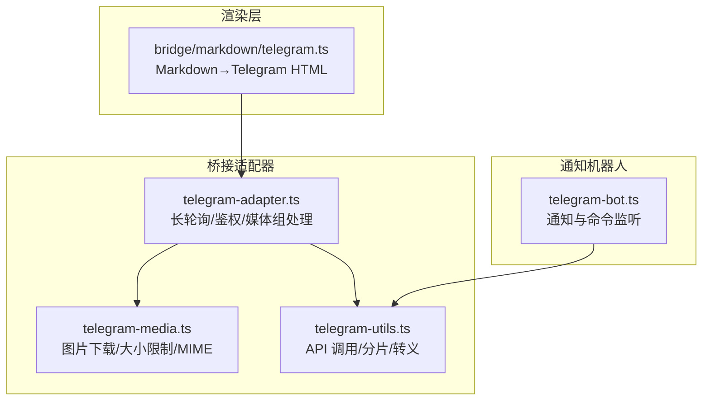
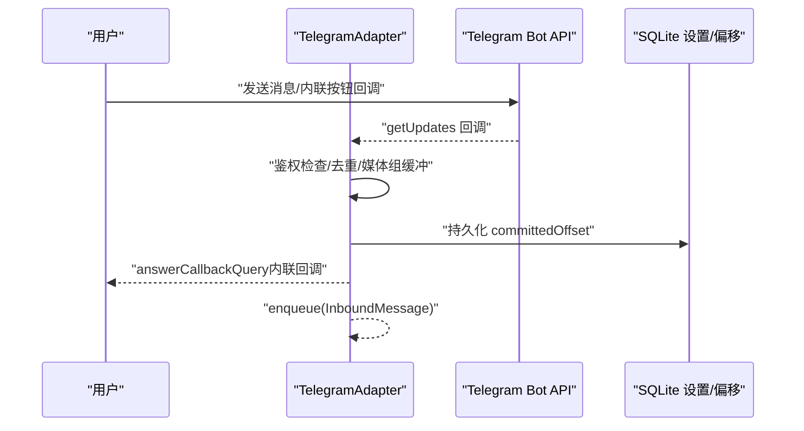
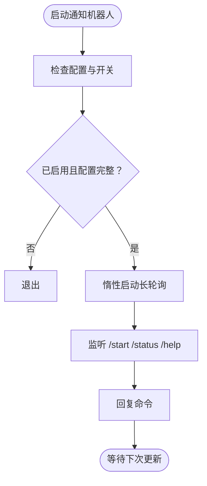
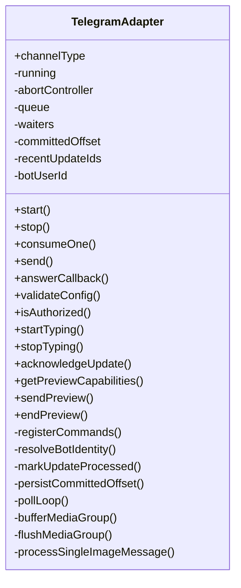
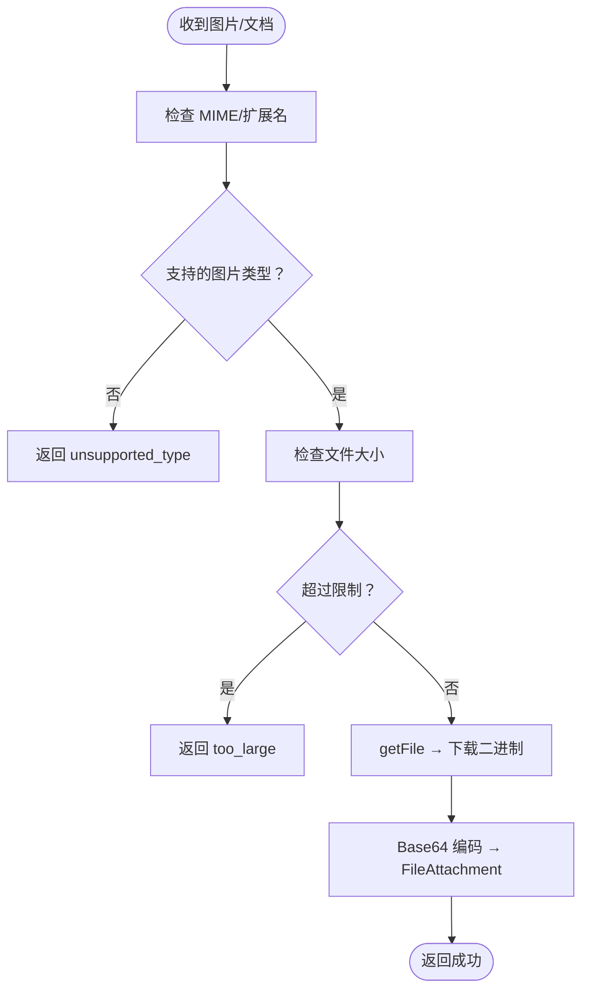
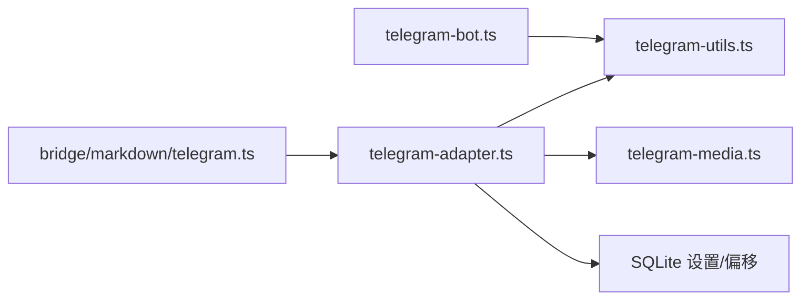

# Telegram 桥接 API

<cite>
**本文引用的文件**
- [telegram-bot.ts](file://src/lib/telegram-bot.ts)
- [telegram-adapter.ts](file://src/lib/bridge/adapters/telegram-adapter.ts)
- [telegram-media.ts](file://src/lib/bridge/adapters/telegram-media.ts)
- [telegram-utils.ts](file://src/lib/bridge/adapters/telegram-utils.ts)
- [telegram.ts](file://src/lib/bridge/markdown/telegram.ts)
</cite>

## 目录
1. [简介](#简介)
2. [项目结构](#项目结构)
3. [核心组件](#核心组件)
4. [架构总览](#架构总览)
5. [详细组件分析](#详细组件分析)
6. [依赖关系分析](#依赖关系分析)
7. [性能与可靠性](#性能与可靠性)
8. [故障排查指南](#故障排查指南)
9. [结论](#结论)
10. [附录：API 规范与最佳实践](#附录api-规范与最佳实践)

## 简介
本文件系统性梳理 CodePilot 中的 Telegram 桥接能力，覆盖以下主题：
- 机器人创建、配置与认证流程
- Webhook 与长轮询两种接入模式（当前实现为长轮询）
- 消息接收与转发机制
- 消息格式转换（Markdown → Telegram HTML）
- 用户身份验证与权限控制
- 机器人命令处理、内联键盘与回调交互
- API 端点与请求响应格式
- 安全配置、速率限制与消息过滤
- 完整集成示例与常见问题解答

## 项目结构
与 Telegram 桥接相关的核心模块分布如下：
- 通知机器人：负责发送任务状态通知、/status 命令长轮询监听
- 桥接适配器：负责从 Telegram 接收消息、解析媒体、转发到桥接系统
- 工具与媒体：统一调用 Telegram Bot API、图片下载与大小限制
- Markdown 渲染：将 Markdown 转换为 Telegram 兼容的 HTML，并进行文件引用包裹

图表来源
- [telegram-bot.ts:1-578](file://src/lib/telegram-bot.ts#L1-L578)
- [telegram-adapter.ts:1-867](file://src/lib/bridge/adapters/telegram-adapter.ts#L1-L867)
- [telegram-media.ts:1-300](file://src/lib/bridge/adapters/telegram-media.ts#L1-L300)
- [telegram-utils.ts:1-142](file://src/lib/bridge/adapters/telegram-utils.ts#L1-L142)
- [telegram.ts:1-359](file://src/lib/bridge/markdown/telegram.ts#L1-L359)

章节来源
- [telegram-bot.ts:1-578](file://src/lib/telegram-bot.ts#L1-L578)
- [telegram-adapter.ts:1-867](file://src/lib/bridge/adapters/telegram-adapter.ts#L1-L867)
- [telegram-media.ts:1-300](file://src/lib/bridge/adapters/telegram-media.ts#L1-L300)
- [telegram-utils.ts:1-142](file://src/lib/bridge/adapters/telegram-utils.ts#L1-L142)
- [telegram.ts:1-359](file://src/lib/bridge/markdown/telegram.ts#L1-L359)

## 核心组件
- 通知机器人（telegram-bot.ts）
  - 功能：发送任务开始/完成/错误/权限请求通知；长轮询监听 /status 等命令；自动检测聊天 ID；验证机器人令牌
  - 关键点：避免与桥接适配器冲突（桥接模式下停止轮询）；支持 HTML/Markdown 消息与分片；内置会话头格式化
- 桥接适配器（telegram-adapter.ts）
  - 功能：作为 BaseChannelAdapter 实现，长轮询消费更新；鉴权白名单；内联键盘回调；媒体组去抖；预览草稿流式发送
  - 关键点：稳定的 bot 用户 ID 用于偏移量迁移；去重集合与连续水位推进；媒体下载失败直接反馈给用户
- 媒体处理（telegram-media.ts）
  - 功能：按最优尺寸选择照片；下载文件；MIME 类型校验；大小限制；重试与错误码
  - 关键点：最大 20MB；支持 jpeg/png/gif/webp；按长边 ≥ 1568px 选择最优版本
- 工具函数（telegram-utils.ts）
  - 功能：统一调用 Telegram Bot API；发送草稿预览；HTML 转义；消息分片；会话头格式化
- Markdown 渲染（bridge/markdown/telegram.ts）
  - 功能：Markdown → IR → Telegram HTML；文件引用包裹；渲染优先的分块策略
  - 关键点：避免 Telegram 生成域名预览；保持样式与链接正确性

章节来源
- [telegram-bot.ts:1-578](file://src/lib/telegram-bot.ts#L1-L578)
- [telegram-adapter.ts:1-867](file://src/lib/bridge/adapters/telegram-adapter.ts#L1-L867)
- [telegram-media.ts:1-300](file://src/lib/bridge/adapters/telegram-media.ts#L1-L300)
- [telegram-utils.ts:1-142](file://src/lib/bridge/adapters/telegram-utils.ts#L1-L142)
- [telegram.ts:1-359](file://src/lib/bridge/markdown/telegram.ts#L1-L359)

## 架构总览
Telegram 桥接采用“通知机器人 + 桥接适配器”的双层设计：
- 通知机器人：独立运行，负责对外通知与命令监听，避免与桥接冲突
- 桥接适配器：在桥接模式下接管长轮询，负责入站消息、鉴权、媒体处理与转发

图表来源
- [telegram-adapter.ts:459-619](file://src/lib/bridge/adapters/telegram-adapter.ts#L459-L619)
- [telegram-adapter.ts:509-540](file://src/lib/bridge/adapters/telegram-adapter.ts#L509-L540)
- [telegram-adapter.ts:452-457](file://src/lib/bridge/adapters/telegram-adapter.ts#L452-L457)

## 详细组件分析

### 通知机器人（telegram-bot.ts）
- 配置项
  - telegram_bot_token：BotFather 分配的令牌
  - telegram_chat_id：目标聊天/群组/频道 ID
  - telegram_enabled：是否启用
  - telegram_notify_start/complete/error/permission：各类通知开关
- 核心流程
  - 启动时惰性初始化长轮询，仅当已配置且未处于桥接模式
  - 发送通知前自动分片（≤4000 字符），HTML/Markdown 可选
  - /status 命令构建当前会话状态摘要
  - verifyBot 支持令牌验证与可选测试消息发送
  - detectChatId 支持通过 getUpdates 自动发现最近聊天 ID
- 安全与冲突
  - setBridgeModeActive 切换桥接模式时主动停止轮询
  - 全局变量保存轮询状态，避免开发热重载导致的状态丢失

图表来源
- [telegram-bot.ts:86-114](file://src/lib/telegram-bot.ts#L86-L114)
- [telegram-bot.ts:466-577](file://src/lib/telegram-bot.ts#L466-L577)

章节来源
- [telegram-bot.ts:1-578](file://src/lib/telegram-bot.ts#L1-L578)

### 桥接适配器（telegram-adapter.ts）
- 配置校验
  - 必须设置 telegram_bot_token
  - 必须开启 bridge_telegram_enabled
- 长轮询与偏移管理
  - 使用 getMe 获取稳定 bot 用户 ID，迁移旧的 token 哈希偏移键
  - committedOffset 连续推进，避免媒体组消息丢失
  - 去重集合维护最近 1000 个 update_id
- 鉴权与白名单
  - 优先使用 telegram_bridge_allowed_users（支持用户 ID 或聊天 ID）
  - 若未配置，则回退到 telegram_chat_id 对比
- 内联键盘与回调
  - answerCallbackQuery 即时响应，消除加载态
  - callbackData 透传至桥接系统
- 媒体组与单图处理
  - 媒体组 500ms 去抖后一次性处理
  - 单图立即下载并生成附件，失败时向用户发送拒绝原因
- 预览草稿与流式发送
  - sendMessageDraft 用于流式预览（需 Telegram Bot API 9.5 支持）
  - 私聊优先，群组/频道可按配置限制
  - 429 限流时跳过，400/404 永久降级

图表来源
- [telegram-adapter.ts:74-155](file://src/lib/bridge/adapters/telegram-adapter.ts#L74-L155)
- [telegram-adapter.ts:342-358](file://src/lib/bridge/adapters/telegram-adapter.ts#L342-L358)
- [telegram-adapter.ts:459-619](file://src/lib/bridge/adapters/telegram-adapter.ts#L459-L619)

章节来源
- [telegram-adapter.ts:1-867](file://src/lib/bridge/adapters/telegram-adapter.ts#L1-L867)

### 媒体处理（telegram-media.ts）
- 图片下载策略
  - 优先选择长边 ≥ 1568px 的最小可用版本；否则选择最大版本
  - 下载前检查文件大小与 MIME 类型
  - 最大 20MB，默认可配置
- 错误分类
  - too_large：超过大小限制
  - unsupported_type：不支持的 MIME
  - download_failed：下载失败（含网络/超时）
- 重试机制
  - 最多重试 3 次，指数回退

图表来源
- [telegram-media.ts:148-184](file://src/lib/bridge/adapters/telegram-media.ts#L148-L184)
- [telegram-media.ts:193-288](file://src/lib/bridge/adapters/telegram-media.ts#L193-L288)

章节来源
- [telegram-media.ts:1-300](file://src/lib/bridge/adapters/telegram-media.ts#L1-L300)

### 工具与通用函数（telegram-utils.ts）
- 统一 API 调用：callTelegramApi 返回标准化结果，包含 httpStatus 与 retry_after
- 草稿预览：sendMessageDraft 用于流式预览（纯文本，长度截断）
- HTML 转义与消息分片：escapeHtml、splitMessage
- 会话头格式化：formatSessionHeader

章节来源
- [telegram-utils.ts:1-142](file://src/lib/bridge/adapters/telegram-utils.ts#L1-L142)

### Markdown 渲染（bridge/markdown/telegram.ts）
- 渲染管线：Markdown → IR → Telegram HTML
- 文件引用包裹：对特定扩展名的独立文件引用加 <code>，避免 Telegram 生成域名预览
- 分块策略：先按 IR 文本长度切分，再渲染为 HTML，若超出限制则按比例再次切分

章节来源
- [telegram.ts:1-359](file://src/lib/bridge/markdown/telegram.ts#L1-L359)

## 依赖关系分析
- 通知机器人依赖工具函数与数据库设置
- 桥接适配器同时依赖工具函数、媒体模块与数据库（偏移与审计日志）
- Markdown 渲染独立于 Telegram API，但被桥接适配器调用以生成 Telegram HTML

图表来源
- [telegram-bot.ts:18-24](file://src/lib/telegram-bot.ts#L18-L24)
- [telegram-adapter.ts:17-28](file://src/lib/bridge/adapters/telegram-adapter.ts#L17-L28)
- [telegram.ts:10-11](file://src/lib/bridge/markdown/telegram.ts#L10-L11)

章节来源
- [telegram-bot.ts:1-578](file://src/lib/telegram-bot.ts#L1-L578)
- [telegram-adapter.ts:1-867](file://src/lib/bridge/adapters/telegram-adapter.ts#L1-L867)
- [telegram-media.ts:1-300](file://src/lib/bridge/adapters/telegram-media.ts#L1-L300)
- [telegram-utils.ts:1-142](file://src/lib/bridge/adapters/telegram-utils.ts#L1-L142)
- [telegram.ts:1-359](file://src/lib/bridge/markdown/telegram.ts#L1-L359)

## 性能与可靠性
- 长轮询参数
  - timeout=30s，allowed_updates 限定为 message/callback_query，降低无关事件开销
- 偏移与去重
  - committedOffset 连续推进，recentUpdateIds 去重集合上限 1000，避免重启重复消费
- 媒体组去抖
  - 500ms 去抖窗口，合并多图上传，减少下游压力
- 流式预览
  - sendMessageDraft 在支持的环境下启用，429 限流时自动跳过，400/404 永久降级
- 通知分片
  - splitMessage 尽可能按行分割，避免截断半行

章节来源
- [telegram-adapter.ts:459-619](file://src/lib/bridge/adapters/telegram-adapter.ts#L459-L619)
- [telegram-adapter.ts:719-746](file://src/lib/bridge/adapters/telegram-adapter.ts#L719-L746)
- [telegram-adapter.ts:305-321](file://src/lib/bridge/adapters/telegram-adapter.ts#L305-L321)
- [telegram-bot.ts:122-142](file://src/lib/telegram-bot.ts#L122-L142)
- [telegram-utils.ts:101-123](file://src/lib/bridge/adapters/telegram-utils.ts#L101-L123)

## 故障排查指南
- 无法接收命令或消息
  - 检查 telegram_enabled 与 telegram_bot_token 是否配置
  - 确认未处于桥接模式（通知机器人会自动停止轮询）
  - 确保 telegram_chat_id 正确，且消息来自该聊天
- /status 无响应
  - 确认通知机器人已启动且未被桥接模式抑制
  - 检查 getUpdates 返回是否正常
- 图片无法接收或过大
  - 检查 bridge_telegram_image_enabled 与 bridge_telegram_max_image_size
  - 确认图片 MIME 与扩展名受支持
- 429 限流
  - 预览草稿模式下会自动跳过；建议降低发送频率或禁用预览
- 权限控制问题
  - 检查 telegram_bridge_allowed_users 或 telegram_chat_id 白名单
- 令牌验证失败
  - 使用 verifyBot 校验令牌有效性；如需测试消息，提供 chat_id 并确保机器人可向该聊天发送消息

章节来源
- [telegram-bot.ts:276-307](file://src/lib/telegram-bot.ts#L276-L307)
- [telegram-bot.ts:314-357](file://src/lib/telegram-bot.ts#L314-L357)
- [telegram-adapter.ts:220-248](file://src/lib/bridge/adapters/telegram-adapter.ts#L220-L248)
- [telegram-media.ts:166-184](file://src/lib/bridge/adapters/telegram-media.ts#L166-L184)
- [telegram-utils.ts:37-67](file://src/lib/bridge/adapters/telegram-utils.ts#L37-L67)

## 结论
本实现提供了完整的 Telegram 桥接能力：从机器人创建、配置与认证，到消息接收、鉴权与媒体处理，再到 Markdown 渲染与流式预览。通知机器人与桥接适配器分工明确，既保证了对外通知的稳定性，又满足了桥接场景下的高可靠与高性能需求。

## 附录：API 规范与最佳实践

### 配置项清单
- telegram_bot_token：机器人令牌（必填）
- telegram_chat_id：目标聊天 ID（必填）
- telegram_enabled：启用通知（'true'/'false'）
- telegram_notify_start/complete/error/permission：各类通知开关
- bridge_telegram_enabled：启用桥接（'true'/'false'）
- bridge_telegram_allowed_users：允许的用户/聊天 ID 列表（逗号分隔）
- bridge_telegram_stream_enabled：启用流式预览（'true'/'false'）
- bridge_telegram_stream_private_only：私聊才启用预览（'true'/'false'）
- bridge_telegram_image_enabled：启用图片接收（'true'/'false'，默认启用）
- bridge_telegram_max_image_size：最大图片大小（字节，默认 20MB）

章节来源
- [telegram-bot.ts:8-16](file://src/lib/telegram-bot.ts#L8-L16)
- [telegram-adapter.ts:220-248](file://src/lib/bridge/adapters/telegram-adapter.ts#L220-L248)
- [telegram-media.ts:67-83](file://src/lib/bridge/adapters/telegram-media.ts#L67-L83)

### 命令与交互
- /start：欢迎信息与可用命令列表
- /status：当前会话状态摘要
- /help：帮助信息
- 内联键盘：callback_data 透传，answerCallbackQuery 即时响应

章节来源
- [telegram-bot.ts:532-565](file://src/lib/telegram-bot.ts#L532-L565)
- [telegram-adapter.ts:509-540](file://src/lib/bridge/adapters/telegram-adapter.ts#L509-L540)
- [telegram-adapter.ts:210-218](file://src/lib/bridge/adapters/telegram-adapter.ts#L210-L218)

### 消息格式与渲染
- 通知消息：HTML/Markdown 可选，自动分片
- Markdown → Telegram HTML：保留粗体/斜体/代码/表格等，包裹独立文件引用
- 长消息：渲染优先分块，避免 HTML 超限

章节来源
- [telegram-bot.ts:122-142](file://src/lib/telegram-bot.ts#L122-L142)
- [telegram.ts:329-358](file://src/lib/bridge/markdown/telegram.ts#L329-L358)

### 安全与权限
- 鉴权优先级：允许列表 > 通知聊天 ID
- 桥接模式下通知机器人停止轮询，避免冲突
- 预览降级：400/404 永久降级，429 跳过

章节来源
- [telegram-adapter.ts:230-248](file://src/lib/bridge/adapters/telegram-adapter.ts#L230-L248)
- [telegram-bot.ts:73-82](file://src/lib/telegram-bot.ts#L73-L82)
- [telegram-adapter.ts:305-321](file://src/lib/bridge/adapters/telegram-adapter.ts#L305-L321)

### Webhook 与长轮询
- 当前实现为长轮询（getUpdates），无需配置 webhook
- 如需 webhook，请参考 Telegram Bot API 文档自行部署反向代理与校验

章节来源
- [telegram-adapter.ts:459-619](file://src/lib/bridge/adapters/telegram-adapter.ts#L459-L619)
- [telegram-bot.ts:466-577](file://src/lib/telegram-bot.ts#L466-L577)

### 速率限制与错误处理
- 429：返回 retry_after，预览模式自动跳过
- 400/404：永久降级（预览不可用）
- 网络异常：统一捕获并返回 error 字段

章节来源
- [telegram-utils.ts:37-67](file://src/lib/bridge/adapters/telegram-utils.ts#L37-L67)
- [telegram-adapter.ts:312-321](file://src/lib/bridge/adapters/telegram-adapter.ts#L312-L321)

### 集成步骤（概要）
- 在 @BotFather 创建机器人并获取 token
- 在 Telegram 中向机器人发送 /start 或任意消息以获取聊天 ID
- 使用 verifyBot 校验 token 并可选发送测试消息
- 在设置中填写 telegram_bot_token、telegram_chat_id、telegram_enabled
- 如需桥接：设置 bridge_telegram_enabled='true'，必要时配置 allowed_users
- 如需图片：设置 bridge_telegram_image_enabled='true'，可调整 bridge_telegram_max_image_size

章节来源
- [telegram-bot.ts:276-307](file://src/lib/telegram-bot.ts#L276-L307)
- [telegram-bot.ts:314-357](file://src/lib/telegram-bot.ts#L314-L357)
- [telegram-adapter.ts:220-228](file://src/lib/bridge/adapters/telegram-adapter.ts#L220-L228)