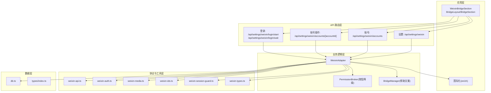
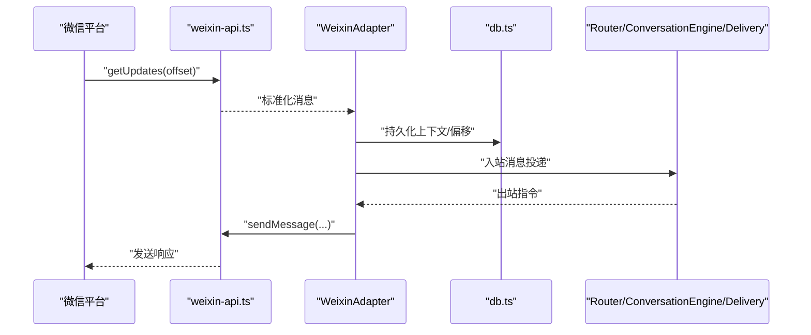
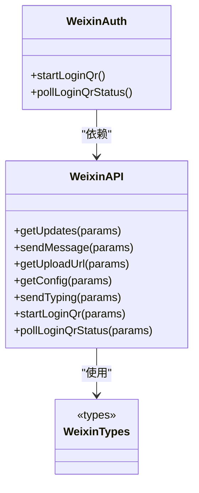
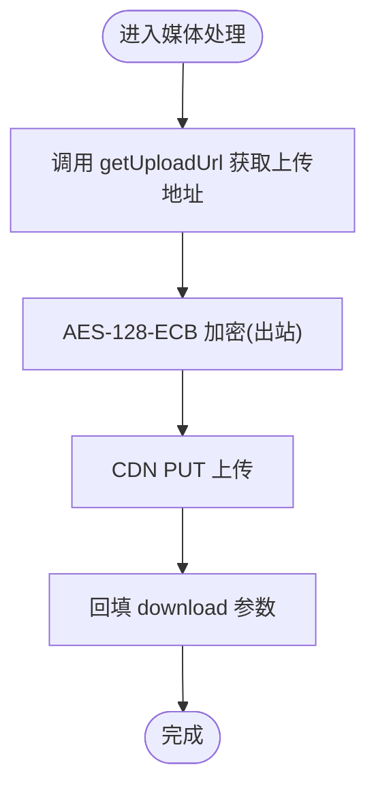
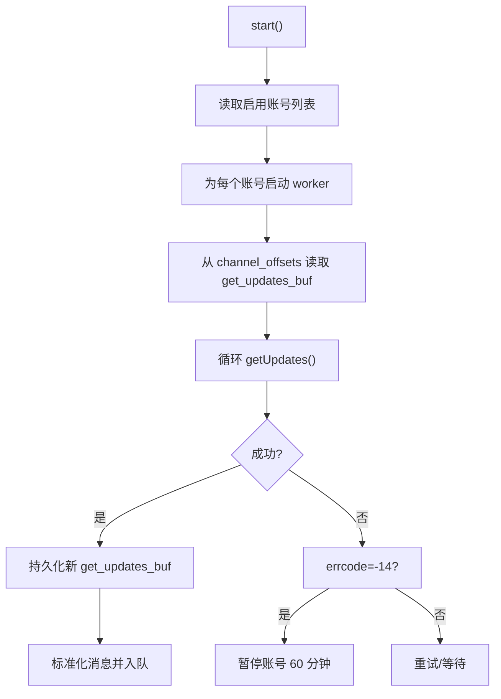
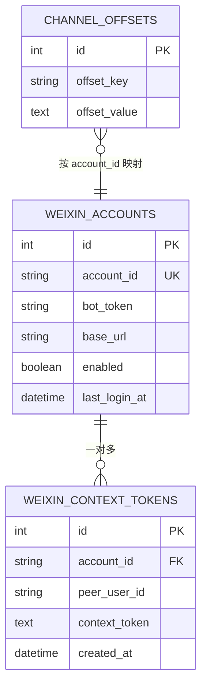
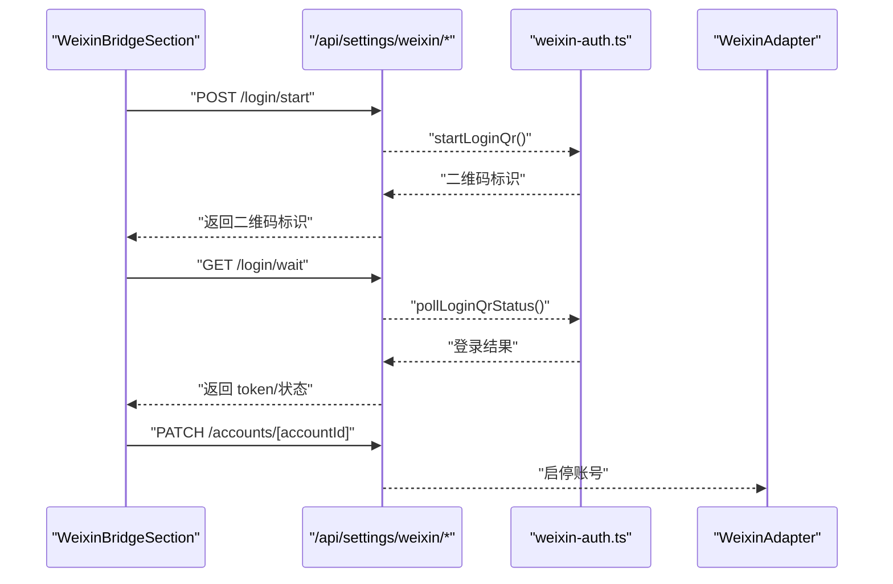
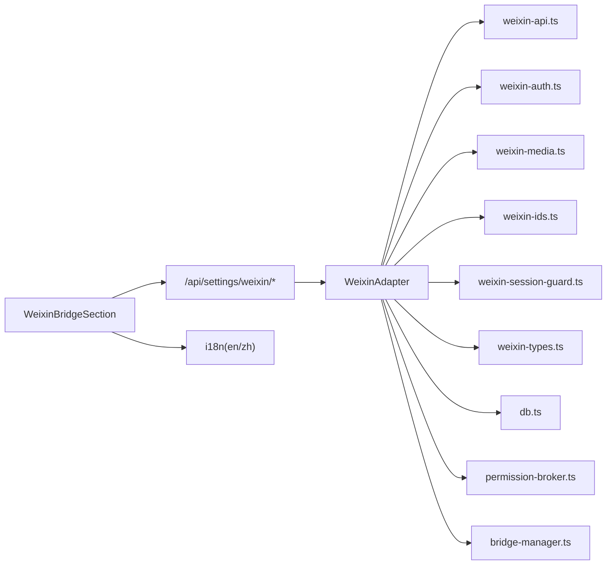

# 微信桥接 API

<cite>
**本文引用的文件**
- [weixin-bridge-channel.md](file://docs/exec-plans/active/weixin-bridge-channel.md)
- [bridge-system.md](file://docs/handover/bridge-system.md)
- [weixin-api.ts](file://src/lib/bridge/adapters/weixin/weixin-api.ts)
- [weixin-auth.ts](file://src/lib/bridge/adapters/weixin/weixin-auth.ts)
- [weixin-media.ts](file://src/lib/bridge/adapters/weixin/weixin-media.ts)
- [weixin-ids.ts](file://src/lib/bridge/adapters/weixin/weixin-ids.ts)
- [weixin-session-guard.ts](file://src/lib/bridge/adapters/weixin/weixin-session-guard.ts)
- [weixin-types.ts](file://src/lib/bridge/adapters/weixin/weixin-types.ts)
- [weixin-adapter.ts](file://src/lib/bridge/adapters/weixin-adapter.ts)
- [route.ts（微信设置）](file://src/app/api/settings/weixin/route.ts)
- [route.ts（微信账号列表）](file://src/app/api/settings/weixin/accounts/route.ts)
- [route.ts（微信账号操作）](file://src/app/api/settings/weixin/accounts/[accountId]/route.ts)
- [route.ts（开始登录二维码）](file://src/app/api/settings/weixin/login/start/route.ts)
- [route.ts（等待登录结果）](file://src/app/api/settings/weixin/login/wait/route.ts)
- [db.ts](file://src/lib/db.ts)
- [types/index.ts](file://src/types/index.ts)
- [permission-broker.ts](file://src/lib/bridge/permission-broker.ts)
- [bridge-manager.ts](file://src/lib/bridge/bridge-manager.ts)
- [BridgeLayout.tsx](file://src/components/bridge/BridgeLayout.tsx)
- [BridgeSection.tsx](file://src/components/bridge/BridgeSection.tsx)
- [WeixinBridgeSection.tsx](file://src/components/bridge/WeixinBridgeSection.tsx)
- [en.ts（国际化）](file://src/i18n/en.ts)
- [zh.ts（国际化）](file://src/i18n/zh.ts)
- [weixin-api.test.ts](file://src/__tests__/unit/weixin-api.test.ts)
- [weixin-ids.test.ts](file://src/__tests__/unit/weixin-ids.test.ts)
- [weixin-media.test.ts](file://src/__tests__/unit/weixin-media.test.ts)
- [weixin-session-guard.test.ts](file://src/__tests__/unit/weixin-session-guard.test.ts)
</cite>

## 目录
1. [简介](#简介)
2. [项目结构](#项目结构)
3. [核心组件](#核心组件)
4. [架构总览](#架构总览)
5. [详细组件分析](#详细组件分析)
6. [依赖关系分析](#依赖关系分析)
7. [性能考量](#性能考量)
8. [故障排查指南](#故障排查指南)
9. [结论](#结论)
10. [附录](#附录)

## 简介
本文件系统性梳理微信桥接 API 的设计与实现，覆盖微信公众号/企业微信的配置、认证、接口调用、消息接收与事件处理、用户管理、签名与加密、模板消息与菜单配置、二维码登录、消息转发与富文本/多媒体处理、以及与 CodePilot 桥接系统的集成与安全策略。目标是帮助开发者快速理解并正确对接微信生态。

## 项目结构
微信桥接相关模块围绕“数据库层 → 协议层 → 适配器 → API 路由 → UI 组件”的分层组织，遵循 CodePilot 现有桥接体系，保证与 Router/ConversationEngine/Delivery 主链路无缝衔接。

图表来源
- [weixin-adapter.ts](file://src/lib/bridge/adapters/weixin-adapter.ts)
- [weixin-api.ts](file://src/lib/bridge/adapters/weixin/weixin-api.ts)
- [weixin-auth.ts](file://src/lib/bridge/adapters/weixin/weixin-auth.ts)
- [weixin-media.ts](file://src/lib/bridge/adapters/weixin/weixin-media.ts)
- [weixin-ids.ts](file://src/lib/bridge/adapters/weixin/weixin-ids.ts)
- [weixin-session-guard.ts](file://src/lib/bridge/adapters/weixin/weixin-session-guard.ts)
- [weixin-types.ts](file://src/lib/bridge/adapters/weixin/weixin-types.ts)
- [db.ts](file://src/lib/db.ts)
- [types/index.ts](file://src/types/index.ts)
- [permission-broker.ts](file://src/lib/bridge/permission-broker.ts)
- [bridge-manager.ts](file://src/lib/bridge/bridge-manager.ts)
- [BridgeLayout.tsx](file://src/components/bridge/BridgeLayout.tsx)
- [BridgeSection.tsx](file://src/components/bridge/BridgeSection.tsx)
- [WeixinBridgeSection.tsx](file://src/components/bridge/WeixinBridgeSection.tsx)
- [en.ts（国际化）](file://src/i18n/en.ts)
- [zh.ts（国际化）](file://src/i18n/zh.ts)

章节来源
- [weixin-bridge-channel.md:97-120](file://docs/exec-plans/active/weixin-bridge-channel.md#L97-L120)
- [bridge-system.md:143-159](file://docs/handover/bridge-system.md#L143-L159)

## 核心组件
- 协议与认证
  - weixin-api.ts：实现微信协议客户端，提供获取更新、发送消息、获取上传地址、配置查询、输入状态等接口。
  - weixin-auth.ts：二维码登录流程，包括发起登录、轮询状态、会话管理。
  - weixin-types.ts：定义微信相关数据类型与常量。
- 媒体与加密
  - weixin-media.ts：CDN 媒体上传/下载与 AES-128-ECB 加密/解密。
  - weixin-session-guard.ts：会话异常保护，如 errcode=-14 时暂停账号。
- 身份与路由
  - weixin-ids.ts：合成 chatId 与 peerUserId 编解码，支持多账号隔离。
- 适配器与生命周期
  - weixin-adapter.ts：单实例多 worker 模型，负责长轮询、消息标准化、出站文本、typing 指示与状态跟踪。
- 数据与类型
  - db.ts：新增微信账户、上下文 token、偏移量等持久化 helper。
  - types/index.ts：新增微信账户与上下文 token记录类型。
- API 路由与 UI
  - /api/settings/weixin*：全局设置、账号列表、账号启停/断开、二维码登录。
  - WeixinBridgeSection.tsx、BridgeLayout.tsx、BridgeSection.tsx：微信桥接 UI。
  - i18n：英文/中文文案。
- 权限与帮助
  - permission-broker.ts：将 weixin 归类为“无按钮渠道”，避免按钮卡片误发。
  - bridge-manager.ts：帮助文案中增加 weixin 说明。

章节来源
- [weixin-bridge-channel.md:206-216](file://docs/exec-plans/active/weixin-bridge-channel.md#L206-L216)
- [weixin-bridge-channel.md:286-297](file://docs/exec-plans/active/weixin-bridge-channel.md#L286-L297)
- [weixin-bridge-channel.md:298-324](file://docs/exec-plans/active/weixin-bridge-channel.md#L298-L324)
- [bridge-system.md:143-159](file://docs/handover/bridge-system.md#L143-L159)

## 架构总览
微信桥接遵循 CodePilot 桥接体系，通过 Adapter 将微信协议抽象为统一的消息模型，接入 Router/ConversationEngine/Delivery 主链路。多账号通过合成 chatId 隔离，避免 schema 变更。

图表来源
- [weixin-api.ts](file://src/lib/bridge/adapters/weixin/weixin-api.ts)
- [weixin-adapter.ts](file://src/lib/bridge/adapters/weixin-adapter.ts)
- [db.ts](file://src/lib/db.ts)

## 详细组件分析

### 协议与认证组件
- weixin-api.ts
  - 关键职责：对齐 OpenClaw 微信插件协议，封装 getUpdates、sendMessage、getUploadUrl、getConfig、sendTyping、startLoginQr、pollLoginQrStatus 等。
  - 输入输出：请求参数与响应结构严格遵循微信协议约定，便于与微信服务端互通。
  - 错误码：对常见错误进行分类处理，配合会话保护模块暂停账号。
- weixin-auth.ts
  - 二维码登录：startLoginQr 返回二维码标识，pollLoginQrStatus 轮询登录状态，成功后返回 token。
  - 会话管理：使用全局对象保存活跃登录会话，避免热重载丢失状态。
- weixin-types.ts
  - 定义微信账户、消息类型、上传/下载参数、错误码等类型，确保编译期安全。

图表来源
- [weixin-api.ts](file://src/lib/bridge/adapters/weixin/weixin-api.ts)
- [weixin-auth.ts](file://src/lib/bridge/adapters/weixin/weixin-auth.ts)
- [weixin-types.ts](file://src/lib/bridge/adapters/weixin/weixin-types.ts)

章节来源
- [weixin-bridge-channel.md:217-227](file://docs/exec-plans/active/weixin-bridge-channel.md#L217-L227)
- [weixin-bridge-channel.md:396-399](file://docs/exec-plans/active/weixin-bridge-channel.md#L396-L399)

### 媒体与加密组件
- weixin-media.ts
  - 功能：提供 CDN 上传/下载、AES-128-ECB 加密/解密，保障入站/出站媒体安全。
  - 与 weixin-api.ts 协作：通过 getUploadUrl 获取上传地址，完成媒体资源落盘与回填。
- weixin-session-guard.ts
  - 功能：当出现特定错误码（如 -14）时暂停账号轮询，避免无限重试，提升稳定性。

图表来源
- [weixin-media.ts](file://src/lib/bridge/adapters/weixin/weixin-media.ts)
- [weixin-api.ts](file://src/lib/bridge/adapters/weixin/weixin-api.ts)

章节来源
- [weixin-bridge-channel.md:288-297](file://docs/exec-plans/active/weixin-bridge-channel.md#L288-L297)

### 身份与路由组件
- weixin-ids.ts
  - 合成 chatId：weixin::<accountId>::<peerUserId>，确保同一 peerUserId 在不同账号下上下文隔离。
  - 编解码：提供合成与解析函数，用于路由与权限模块复用原单 chat 抽象。
- weixin-adapter.ts
  - 生命周期：start() 读取启用账号并为每个账号启动长轮询 worker；stop() 终止所有 worker 并清理状态。
  - 工作模型：从 channel_offsets 读取账号专属 get_updates_buf，循环调用 getUpdates，成功后持久化新偏移，逐条标准化消息入队。

图表来源
- [weixin-adapter.ts](file://src/lib/bridge/adapters/weixin-adapter.ts)
- [weixin-session-guard.ts](file://src/lib/bridge/adapters/weixin/weixin-session-guard.ts)

章节来源
- [weixin-bridge-channel.md:114-119](file://docs/exec-plans/active/weixin-bridge-channel.md#L114-L119)
- [weixin-bridge-channel.md:302-324](file://docs/exec-plans/active/weixin-bridge-channel.md#L302-L324)

### 数据与类型组件
- db.ts
  - 新增 helper：listWeixinAccounts、getWeixinAccount、upsertWeixinAccount、deleteWeixinAccount、setWeixinAccountEnabled、getWeixinContextToken、upsertWeixinContextToken、deleteWeixinContextTokensByAccount。
  - 偏移量策略：将 per-account 的 offset_key 改为 weixin:<accountId>，复用 get_updates_buf 字段。
- types/index.ts
  - 新增 WeixinAccount、WeixinContextTokenRecord 类型，确保数据一致性。

图表来源
- [db.ts](file://src/lib/db.ts)
- [types/index.ts](file://src/types/index.ts)

章节来源
- [weixin-bridge-channel.md:187-205](file://docs/exec-plans/active/weixin-bridge-channel.md#L187-L205)

### API 路由与 UI 组件
- /api/settings/weixin*
  - 设置：GET/PUT 全局微信配置（开关、基础 URL、CDN 基础 URL、媒体开关、日志上传地址等）。
  - 账号：GET 账号列表；DELETE 断开账号；PATCH 启停账号。
  - 登录：POST /login/start 生成二维码；GET /login/wait 轮询登录结果。
- WeixinBridgeSection.tsx、BridgeLayout.tsx、BridgeSection.tsx
  - UI 包含：总开关、基础 URL/CDN 配置、连接按钮、二维码展示/轮询状态、已登录账号列表、每账号启停与断开、状态提示。
- i18n
  - 英文/中文文案完善，确保用户界面一致。

图表来源
- [route.ts（开始登录二维码）](file://src/app/api/settings/weixin/login/start/route.ts)
- [route.ts（等待登录结果）](file://src/app/api/settings/weixin/login/wait/route.ts)
- [weixin-auth.ts](file://src/lib/bridge/adapters/weixin/weixin-auth.ts)
- [weixin-adapter.ts](file://src/lib/bridge/adapters/weixin-adapter.ts)

章节来源
- [weixin-bridge-channel.md:385-419](file://docs/exec-plans/active/weixin-bridge-channel.md#L385-L419)
- [weixin-bridge-channel.md:420-456](file://docs/exec-plans/active/weixin-bridge-channel.md#L420-L456)

### 权限与帮助降级
- permission-broker.ts
  - 将 weixin 归类为“无按钮渠道”，避免将权限消息误发为带按钮的卡片。
- bridge-manager.ts
  - 在帮助文案中增加 weixin 说明，提升用户可见性。

章节来源
- [weixin-bridge-channel.md:457-478](file://docs/exec-plans/active/weixin-bridge-channel.md#L457-L478)

## 依赖关系分析
- 组件耦合
  - WeixinAdapter 依赖 weixin-api.ts、weixin-auth.ts、weixin-media.ts、weixin-ids.ts、weixin-session-guard.ts、weixin-types.ts。
  - API 路由层依赖 Adapter 与 db.ts/types/index.ts。
  - UI 层依赖路由层与 i18n。
- 外部依赖
  - 微信服务端 API（通过 weixin-api.ts 封装）。
  - Next.js API 路由与数据库访问。
- 潜在循环依赖
  - 通过分层与接口抽象避免循环依赖；各模块仅向下依赖。

图表来源
- [weixin-adapter.ts](file://src/lib/bridge/adapters/weixin-adapter.ts)
- [weixin-api.ts](file://src/lib/bridge/adapters/weixin/weixin-api.ts)
- [weixin-auth.ts](file://src/lib/bridge/adapters/weixin/weixin-auth.ts)
- [weixin-media.ts](file://src/lib/bridge/adapters/weixin/weixin-media.ts)
- [weixin-ids.ts](file://src/lib/bridge/adapters/weixin/weixin-ids.ts)
- [weixin-session-guard.ts](file://src/lib/bridge/adapters/weixin/weixin-session-guard.ts)
- [weixin-types.ts](file://src/lib/bridge/adapters/weixin/weixin-types.ts)
- [db.ts](file://src/lib/db.ts)
- [permission-broker.ts](file://src/lib/bridge/permission-broker.ts)
- [bridge-manager.ts](file://src/lib/bridge/bridge-manager.ts)
- [WeixinBridgeSection.tsx](file://src/components/bridge/WeixinBridgeSection.tsx)
- [en.ts（国际化）](file://src/i18n/en.ts)
- [zh.ts（国际化）](file://src/i18n/zh.ts)

## 性能考量
- 长轮询与批量处理
  - 每个账号独立 worker，降低相互影响；成功后批量持久化偏移，减少数据库写入频率。
- 会话保护
  - 对 errcode=-14 实施暂停策略，避免高频重试导致资源浪费。
- 媒体处理
  - AES-128-ECB 加解密与 CDN 上传/下载分离，尽量减少主线程阻塞。
- UI 与路由
  - 二维码轮询采用轻量轮询策略，避免频繁请求；UI 状态与数据库保持一致，减少无效刷新。

## 故障排查指南
- 常见问题定位
  - 登录失败：检查 /api/settings/weixin/login/start 与 /login/wait 是否正常返回二维码与登录结果；确认 weixin-auth.ts 会话状态是否被热重载清空。
  - 账号启停无效：检查 /accounts/[accountId] 的 PATCH 请求是否正确传递启停参数；确认 WeixinAdapter 的 start()/stop() 生命周期。
  - 偏移量异常：核对 channel_offsets 中 weixin:<accountId> 的 offset_key 与值是否随 getUpdates 成功而更新。
  - 媒体上传失败：确认 getUploadUrl 返回有效地址，CDN PUT 是否成功，download 参数是否回填。
  - 会话暂停：若 errcode=-14，确认 weixin-session-guard 是否生效，账号是否暂停 60 分钟。
- 单元测试辅助
  - weixin-api.test.ts、weixin-ids.test.ts、weixin-media.test.ts、weixin-session-guard.test.ts 提供关键场景覆盖，便于回归验证。

章节来源
- [weixin-session-guard.ts](file://src/lib/bridge/adapters/weixin/weixin-session-guard.ts)
- [weixin-api.test.ts](file://src/__tests__/unit/weixin-api.test.ts)
- [weixin-ids.test.ts](file://src/__tests__/unit/weixin-ids.test.ts)
- [weixin-media.test.ts](file://src/__tests__/unit/weixin-media.test.ts)
- [weixin-session-guard.test.ts](file://src/__tests__/unit/weixin-session-guard.test.ts)

## 结论
微信桥接 API 通过清晰的分层设计与严格的协议封装，实现了与微信生态的稳定对接。多账号隔离、会话保护、媒体加解密与 UI 集成共同构成了可维护、可扩展的桥接方案。建议在生产环境中结合单元测试与端到端验证，持续优化长轮询与媒体处理性能，并完善权限与帮助文案的用户体验。

## 附录

### API 规范与参数说明
- 全局设置
  - GET /api/settings/weixin：获取全局微信配置（开关、基础 URL、CDN 基础 URL、媒体开关、日志上传地址等）。
  - PUT /api/settings/weixin：更新全局微信配置。
- 账号管理
  - GET /api/settings/weixin/accounts：获取账号列表。
  - DELETE /api/settings/weixin/accounts/[accountId]：断开指定账号。
  - PATCH /api/settings/weixin/accounts/[accountId]：启停指定账号。
- 二维码登录
  - POST /api/settings/weixin/login/start：生成二维码标识。
  - GET /api/settings/weixin/login/wait：轮询登录结果。

章节来源
- [weixin-bridge-channel.md:385-419](file://docs/exec-plans/active/weixin-bridge-channel.md#L385-L419)

### 错误码与处理建议
- errcode=-14：会话失效，触发暂停策略，避免无限重试。
- 其他错误：根据 weixin-api.ts 的错误分类进行重试/降级处理。

章节来源
- [weixin-bridge-channel.md:320-324](file://docs/exec-plans/active/weixin-bridge-channel.md#L320-L324)
- [weixin-session-guard.ts](file://src/lib/bridge/adapters/weixin/weixin-session-guard.ts)

### 模板消息、菜单配置与二维码处理
- 模板消息与菜单配置：建议通过微信服务端 API（由 weixin-api.ts 封装）进行调用，参数与返回结构遵循微信协议。
- 二维码处理：startLoginQr 生成二维码标识，pollLoginQrStatus 轮询登录状态，成功后返回 token 用于后续鉴权。

章节来源
- [weixin-bridge-channel.md:226-227](file://docs/exec-plans/active/weixin-bridge-channel.md#L226-L227)
- [weixin-bridge-channel.md:396-399](file://docs/exec-plans/active/weixin-bridge-channel.md#L396-L399)

### 消息转发、富文本与多媒体处理
- 文本消息：WeixinAdapter 负责标准化与出站发送。
- 富文本与多媒体：通过 weixin-media.ts 的加解密与 CDN 上传/下载能力实现；当前版本优先实现文本出站，媒体能力预留接口以便后续扩展。

章节来源
- [weixin-bridge-channel.md:279-297](file://docs/exec-plans/active/weixin-bridge-channel.md#L279-L297)
- [weixin-media.ts](file://src/lib/bridge/adapters/weixin/weixin-media.ts)

### 用户授权与安全防护
- 授权降级：permission-broker.ts 将 weixin 归类为“无按钮渠道”，避免按钮卡片误发。
- 安全防护：AES-128-ECB 加解密、会话保护、偏移量持久化与 UI 状态同步，共同保障数据与通信安全。

章节来源
- [weixin-bridge-channel.md:457-478](file://docs/exec-plans/active/weixin-bridge-channel.md#L457-L478)