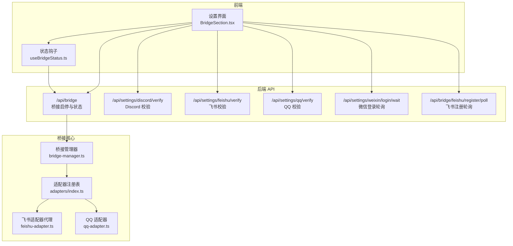
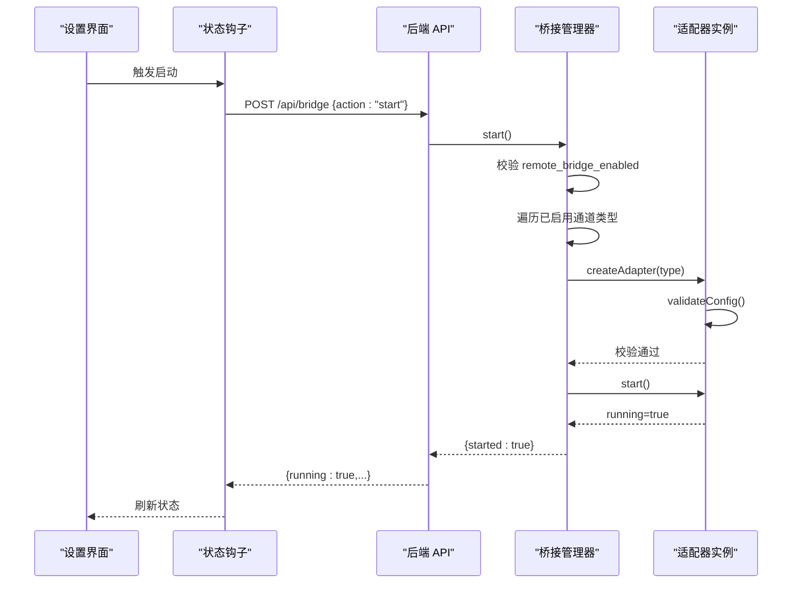
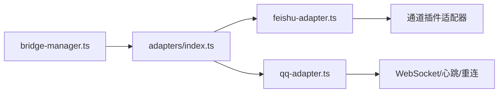

# 桥接 API

<cite>
**本文引用的文件**
- [bridge-manager.ts](file://src/lib/bridge/bridge-manager.ts)
- [index.ts](file://src/lib/bridge/adapters/index.ts)
- [feishu-adapter.ts](file://src/lib/bridge/adapters/feishu-adapter.ts)
- [qq-adapter.ts](file://src/lib/bridge/adapters/qq-adapter.ts)
- [useBridgeStatus.ts](file://src/hooks/useBridgeStatus.ts)
- [BridgeSection.tsx](file://src/components/bridge/BridgeSection.tsx)
- [route.ts](file://src/app/api/bridge/feishu/register/poll/route.ts)
- [route.ts](file://src/app/api/settings/weixin/login/wait/route.ts)
- [route.ts](file://src/app/api/settings/discord/verify/route.ts)
- [route.ts](file://src/app/api/settings/feishu/verify/route.ts)
- [route.ts](file://src/app/api/settings/qq/verify/route.ts)
- [bridge-system.md](file://docs/handover/bridge-system.md)
- [approval-bridge.ts](file://src/lib/codex/approval-bridge.ts)
- [permission-registry.ts](file://src/lib/permission-registry.ts)
- [merge-forward.js](file://资料/feishu-openclaw-plugin/package/src/messaging/converters/merge-forward.js)
- [system.js](file://资料/feishu-openclaw-plugin/package/src/messaging/converters/system.js)
</cite>

## 目录
1. [简介](#简介)
2. [项目结构](#项目结构)
3. [核心组件](#核心组件)
4. [架构总览](#架构总览)
5. [详细组件分析](#详细组件分析)
6. [依赖关系分析](#依赖关系分析)
7. [性能考量](#性能考量)
8. [故障排除指南](#故障排除指南)
9. [结论](#结论)
10. [附录](#附录)

## 简介
本文件系统化梳理即时通讯（IM）桥接 API 的设计与实现，覆盖 Telegram、飞书、QQ、Discord、微信等平台的接入方式，重点说明桥接通道的配置、认证与连接管理，消息路由、格式转换与状态同步机制，并给出平台特定的 API 规范、Webhook 处理与错误重试策略，以及安全、权限验证与消息过滤的配置选项。文档同时提供各平台集成示例与常见问题排查建议。

## 项目结构
桥接系统采用“适配器注册 + 通道插件”的分层设计：
- 适配器注册表负责集中加载各平台适配器，统一由桥接管理器驱动启停与状态上报。
- 各平台适配器通过“通道插件适配器”封装具体通道实现，便于统一生命周期与错误处理。
- 前端通过状态钩子轮询桥接状态，支持手动启停与自动启动策略。
- 后端提供平台校验与注册轮询接口，保障配置正确性与运行稳定性。

图表来源
- [bridge-manager.ts](file://src/lib/bridge/bridge-manager.ts)
- [index.ts](file://src/lib/bridge/adapters/index.ts)
- [feishu-adapter.ts](file://src/lib/bridge/adapters/feishu-adapter.ts)
- [qq-adapter.ts](file://src/lib/bridge/adapters/qq-adapter.ts)
- [useBridgeStatus.ts](file://src/hooks/useBridgeStatus.ts)
- [BridgeSection.tsx](file://src/components/bridge/BridgeSection.tsx)
- [route.ts](file://src/app/api/bridge/feishu/register/poll/route.ts)
- [route.ts](file://src/app/api/settings/weixin/login/wait/route.ts)
- [route.ts](file://src/app/api/settings/discord/verify/route.ts)
- [route.ts](file://src/app/api/settings/feishu/verify/route.ts)
- [route.ts](file://src/app/api/settings/qq/verify/route.ts)

章节来源
- [bridge-manager.ts](file://src/lib/bridge/bridge-manager.ts)
- [index.ts](file://src/lib/bridge/adapters/index.ts)
- [feishu-adapter.ts](file://src/lib/bridge/adapters/feishu-adapter.ts)
- [qq-adapter.ts](file://src/lib/bridge/adapters/qq-adapter.ts)
- [useBridgeStatus.ts](file://src/hooks/useBridgeStatus.ts)
- [BridgeSection.tsx](file://src/components/bridge/BridgeSection.tsx)

## 核心组件
- 桥接管理器：负责读取配置、按通道类型创建适配器、校验配置、启动/停止适配器、维护运行状态与错误信息，并提供状态查询接口。
- 适配器注册表：集中导入各平台适配器，形成统一的注册入口，便于扩展新平台。
- 通道插件适配器：对具体通道实现进行薄封装，屏蔽差异，统一生命周期与错误处理。
- 前端状态钩子：定时轮询桥接状态，支持手动启停与自动启动策略。
- 平台校验与注册轮询接口：提供令牌有效性校验、网关可达性验证与注册流程轮询，确保配置正确与运行稳定。

章节来源
- [bridge-manager.ts](file://src/lib/bridge/bridge-manager.ts)
- [index.ts](file://src/lib/bridge/adapters/index.ts)
- [feishu-adapter.ts](file://src/lib/bridge/adapters/feishu-adapter.ts)
- [qq-adapter.ts](file://src/lib/bridge/adapters/qq-adapter.ts)
- [useBridgeStatus.ts](file://src/hooks/useBridgeStatus.ts)

## 架构总览
桥接系统以“配置驱动 + 生命周期管理 + 统一适配器模式”为核心，围绕以下关键流程展开：
- 启动流程：读取开关与配置 -> 创建并校验适配器 -> 启动轮询/连接 -> 上报状态。
- 运行流程：各适配器按平台协议处理入站消息、转换格式、路由到会话 -> 发送出站消息 -> 更新状态与错误。
- 停止流程：关闭连接/轮询 -> 清理资源 -> 回滚状态。

图表来源
- [bridge-manager.ts](file://src/lib/bridge/bridge-manager.ts)
- [useBridgeStatus.ts](file://src/hooks/useBridgeStatus.ts)
- [BridgeSection.tsx](file://src/components/bridge/BridgeSection.tsx)

## 详细组件分析

### 桥接管理器（bridge-manager.ts）
- 功能职责
  - 读取开关与配置项，决定是否启用桥接系统。
  - 遍历已注册的通道类型，按配置创建适配器并执行配置校验。
  - 维护运行状态、适配器集合、最后消息时间与错误信息。
  - 提供启动/停止、状态查询、自动启动检查等能力。
- 关键点
  - 启动前检查总开关，未启用则返回失败原因。
  - 自动启动策略：若开启自动启动且系统未运行，则尝试启动。
  - 状态聚合：将各适配器的运行状态、连接时间、最后消息时间与错误合并为统一视图。
- 错误处理
  - 配置校验失败时记录错误并跳过该通道。
  - 启动异常捕获并记录，避免影响其他通道。

章节来源
- [bridge-manager.ts](file://src/lib/bridge/bridge-manager.ts)

### 适配器注册表（adapters/index.ts）
- 功能职责
  - 通过导入各平台适配器文件，触发其自注册逻辑。
  - 保持最小改动即可新增平台适配器，降低耦合。
- 扩展方式
  - 新增适配器文件并在注册表中添加导入行。
  - 在桥接管理器中按约定读取配置项并创建实例。

章节来源
- [index.ts](file://src/lib/bridge/adapters/index.ts)

### 飞书适配器代理（feishu-adapter.ts）
- 功能职责
  - 将飞书适配器注册为“通道插件适配器”，委托给飞书通道插件实现具体协议细节。
  - 保持与桥接管理器的统一交互接口。
- 作用
  - 作为薄代理，隔离平台差异，便于后续扩展与替换。

章节来源
- [feishu-adapter.ts](file://src/lib/bridge/adapters/feishu-adapter.ts)

### QQ 适配器（qq-adapter.ts）
- 连接与心跳
  - 通过获取访问令牌与网关地址建立 WebSocket 连接。
  - 维护心跳定时器、序列号、会话 ID 与重连次数。
- 消息去重与队列
  - 使用消息 ID 映射避免重复处理。
  - 内部队列与等待者模式用于顺序化处理入站消息。
- 重连策略
  - 支持指数退避与最大重连次数限制，保证网络抖动下的稳定性。
- 配置项
  - 应用 ID、应用密钥、最大重连次数等，通过设置中心读取。

章节来源
- [qq-adapter.ts](file://src/lib/bridge/adapters/qq-adapter.ts)

### 前端桥接状态（useBridgeStatus.ts 与 BridgeSection.tsx）
- 状态轮询
  - 每 5 秒轮询一次桥接状态，显示各通道运行状态、连接时间、最后消息时间与错误。
- 控制操作
  - 支持手动启动/停止桥接，启动失败时返回原因码。
- 自动刷新
  - 当桥接运行时自动开始轮询，停止后停止轮询，避免资源浪费。

章节来源
- [useBridgeStatus.ts](file://src/hooks/useBridgeStatus.ts)
- [BridgeSection.tsx](file://src/components/bridge/BridgeSection.tsx)

### 平台校验与注册轮询接口
- Discord 校验（/api/settings/discord/verify）
  - 使用提供的 Bot Token 调用 Discord 用户信息接口进行验证。
  - 若未提供或被掩码，则回退到存储中的令牌。
  - 返回验证结果与机器人名称。
- 飞书校验（/api/settings/feishu/verify）
  - 获取租户访问令牌并查询机器人信息，返回验证结果与机器人名称。
- QQ 校验（/api/settings/qq/verify）
  - 获取访问令牌并验证网关 URL 可达性，返回验证结果与网关地址。
- 微信登录轮询（/api/settings/weixin/login/wait）
  - 轮询二维码登录状态，完成或失败后延迟清理会话。
  - 当登录确认时自动重启桥接，使新账号生效。
- 飞书注册轮询（/api/bridge/feishu/register/poll）
  - 轮询飞书注册状态，必要时自动重启桥接以应用新配置。
  - 返回当前状态、应用 ID、域名、机器人名称、验证错误与慢速轮询间隔。

章节来源
- [route.ts](file://src/app/api/settings/discord/verify/route.ts)
- [route.ts](file://src/app/api/settings/feishu/verify/route.ts)
- [route.ts](file://src/app/api/settings/qq/verify/route.ts)
- [route.ts](file://src/app/api/settings/weixin/login/wait/route.ts)
- [route.ts](file://src/app/api/bridge/feishu/register/poll/route.ts)

### 消息路由、格式转换与状态同步
- 消息路由
  - 依据平台消息中的 chatId/rootId 等标识构建会话上下文，支持线程/话题维度的会话隔离。
  - 飞书场景下，当启用线程会话时，根据 root_id 生成合成地址，实现每话题独立上下文。
- 格式转换
  - 飞书侧提供多种内容转换器，如系统消息模板替换、转发消息树展开、地理位置解析等。
  - 转换器遵循统一签名，输入原始内容，输出标准化的文本与资源列表。
- 状态同步
  - 适配器在每次成功处理消息后更新“最后消息时间”，桥接管理器汇总为统一状态。
  - 错误信息记录在适配器元数据中，便于前端展示与诊断。

章节来源
- [bridge-system.md](file://docs/handover/bridge-system.md)
- [merge-forward.js](file://资料/feishu-openclaw-plugin/package/src/messaging/converters/merge-forward.js)
- [system.js](file://资料/feishu-openclaw-plugin/package/src/messaging/converters/system.js)

### 权限验证与消息过滤
- 权限映射
  - 将本地权限决策映射为 Codex 批准响应格式，支持会话级授权与一次性授权。
- 权限注册与超时
  - 维护待决权限映射，超时或中断时写入数据库以便审计。
- 消息过滤
  - 通过配置项控制允许来源（如飞书允许的 open_id、群组白名单等）与策略（开放/配对/白名单/禁用）。
  - 支持私聊与群聊的不同策略，以及@触发等行为控制。

章节来源
- [approval-bridge.ts](file://src/lib/codex/approval-bridge.ts)
- [permission-registry.ts](file://src/lib/permission-registry.ts)
- [bridge-system.md](file://docs/handover/bridge-system.md)

## 依赖关系分析
- 组件耦合
  - 桥接管理器依赖适配器注册表与各平台适配器，但不关心具体实现细节。
  - 适配器通过通道插件适配器与平台协议解耦，便于替换与扩展。
- 外部依赖
  - 各平台 API（Discord、飞书、QQ、微信）与网关服务。
  - 数据库设置项与权限注册表。
- 潜在循环依赖
  - 注册表通过导入适配器文件触发自注册，属于单向依赖，无循环风险。

图表来源
- [bridge-manager.ts](file://src/lib/bridge/bridge-manager.ts)
- [index.ts](file://src/lib/bridge/adapters/index.ts)
- [feishu-adapter.ts](file://src/lib/bridge/adapters/feishu-adapter.ts)
- [qq-adapter.ts](file://src/lib/bridge/adapters/qq-adapter.ts)

章节来源
- [bridge-manager.ts](file://src/lib/bridge/bridge-manager.ts)
- [index.ts](file://src/lib/bridge/adapters/index.ts)
- [feishu-adapter.ts](file://src/lib/bridge/adapters/feishu-adapter.ts)
- [qq-adapter.ts](file://src/lib/bridge/adapters/qq-adapter.ts)

## 性能考量
- 轮询与长连接
  - 对于需要轮询的平台，合理设置轮询间隔与超时，避免频繁请求造成平台限流。
  - 对于 WebSocket 类通道，维持心跳与断线重连，减少连接抖动带来的延迟。
- 消息批处理与去重
  - 使用消息 ID 去重与队列机制，避免重复处理与并发冲突。
- 资源释放
  - 停止桥接时及时关闭连接、清理定时器与等待者，防止内存泄漏。

## 故障排除指南
- 启动失败
  - 检查总开关与各通道开关是否开启。
  - 查看配置项是否完整（如 App ID/Secret、域名、策略等）。
  - 关注适配器错误字段，定位具体通道问题。
- 连接异常
  - 对于 QQ 通道，关注重连次数与心跳定时器状态。
  - 对于飞书/微信，优先使用对应校验接口确认令牌与网关可达性。
- 权限与过滤问题
  - 检查允许来源与策略配置，确认白名单是否正确。
  - 关注权限映射与超时处理，避免长时间阻塞。
- Webhook/注册轮询
  - 飞书注册轮询在状态变化时可自动重启桥接，确认轮询间隔与错误码提示。

章节来源
- [bridge-manager.ts](file://src/lib/bridge/bridge-manager.ts)
- [qq-adapter.ts](file://src/lib/bridge/adapters/qq-adapter.ts)
- [route.ts](file://src/app/api/settings/feishu/verify/route.ts)
- [route.ts](file://src/app/api/settings/qq/verify/route.ts)
- [route.ts](file://src/app/api/settings/weixin/login/wait/route.ts)
- [route.ts](file://src/app/api/bridge/feishu/register/poll/route.ts)
- [bridge-system.md](file://docs/handover/bridge-system.md)

## 结论
本桥接系统通过“配置驱动 + 统一适配器 + 平台校验”的设计，实现了多平台消息桥接的可扩展与高可用。结合消息路由、格式转换与状态同步机制，以及完善的权限与过滤策略，能够满足企业级 IM 互通需求。建议在生产环境中配合监控与告警，持续优化轮询与重连参数，并定期校验平台令牌与网关状态。

## 附录

### 平台配置与开关清单（摘要）
- 通用开关
  - remote_bridge_enabled：总开关
  - bridge_auto_start：服务启动时自动拉起桥接
- Telegram
  - bridge_telegram_enabled：通道开关
  - telegram_bridge_allowed_users：白名单用户 ID
  - bridge_telegram_image_enabled：图片接收开关
  - bridge_telegram_max_image_size：图片大小上限
  - bridge_telegram_stream_enabled：流式预览总开关
  - bridge_telegram_stream_interval_ms：预览节流间隔
  - bridge_telegram_stream_min_delta_chars：最小增量字符数
  - bridge_telegram_stream_max_chars：草稿截断阈值
  - bridge_telegram_stream_private_only：仅私聊启用预览
- 飞书
  - bridge_feishu_enabled：通道开关
  - bridge_feishu_app_id / bridge_feishu_app_secret：应用凭据
  - bridge_feishu_domain：平台域名（feishu/lark）
  - bridge_feishu_allow_from：允许的 open_id（* 表示不限）
  - bridge_feishu_dm_policy：私信策略（open/pairing/allowlist/disabled）
  - bridge_feishu_thread_session：每话题独立上下文
  - bridge_feishu_group_policy：群消息策略（open/allowlist/disabled）
  - bridge_feishu_group_allow_from：群聊白名单 chat_id
  - bridge_feishu_require_mention：群聊需要 @bot 才触发
- QQ
  - bridge_qq_app_id / bridge_qq_app_secret：应用凭据
  - 通道内部维护重连次数与心跳定时器
- 微信
  - 登录轮询接口用于确认账号绑定与自动重启桥接

章节来源
- [bridge-system.md](file://docs/handover/bridge-system.md)
- [route.ts](file://src/app/api/settings/weixin/login/wait/route.ts)