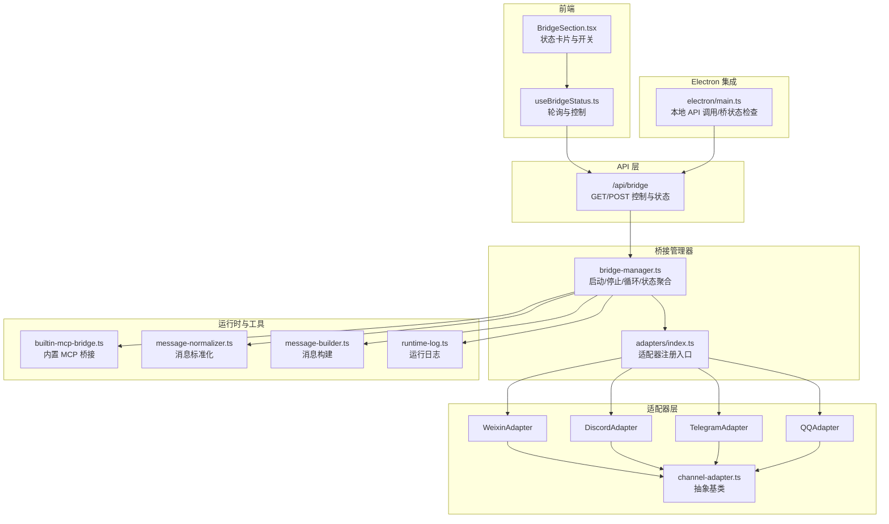
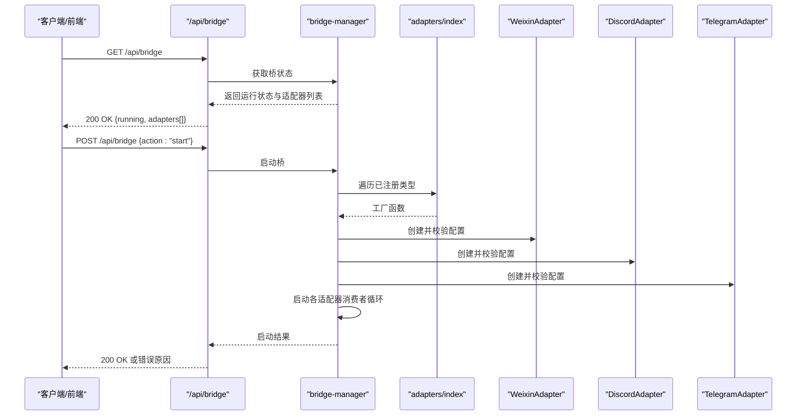
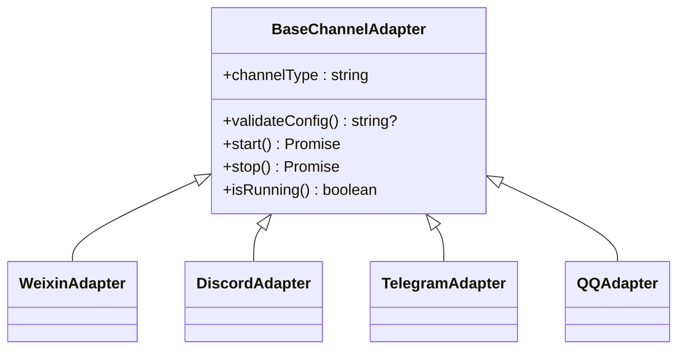
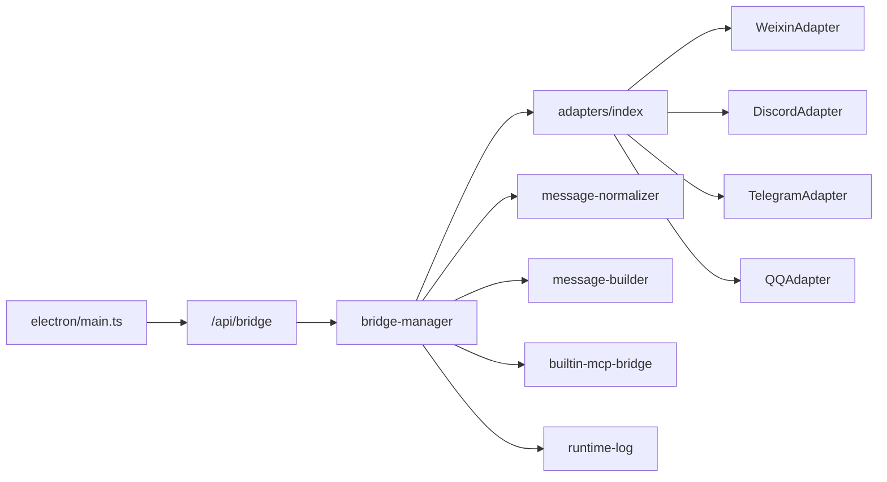

# 桥接通用 API

<cite>
**本文引用的文件**
- [src/app/api/bridge/route.ts](file://src/app/api/bridge/route.ts)
- [src/lib/bridge/bridge-manager.ts](file://src/lib/bridge/bridge-manager.ts)
- [src/lib/bridge/channel-adapter.ts](file://src/lib/bridge/channel-adapter.ts)
- [src/lib/bridge/adapters/index.ts](file://src/lib/bridge/adapters/index.ts)
- [src/lib/bridge/adapters/weixin-adapter.ts](file://src/lib/bridge/adapters/weixin-adapter.ts)
- [src/lib/bridge/adapters/discord-adapter.ts](file://src/lib/bridge/adapters/discord-adapter.ts)
- [src/lib/bridge/adapters/telegram-adapter.ts](file://src/lib/bridge/adapters/telegram-adapter.ts)
- [src/lib/bridge/adapters/qq-adapter.ts](file://src/lib/bridge/adapters/qq-adapter.ts)
- [src/hooks/useBridgeStatus.ts](file://src/hooks/useBridgeStatus.ts)
- [src/components/bridge/BridgeSection.tsx](file://src/components/bridge/BridgeSection.tsx)
- [electron/main.ts](file://electron/main.ts)
- [src/lib/builtin-mcp-bridge.ts](file://src/lib/builtin-mcp-bridge.ts)
- [src/lib/message-normalizer.ts](file://src/lib/message-normalizer.ts)
- [src/lib/message-builder.ts](file://src/lib/message-builder.ts)
- [src/lib/stream-session-manager.ts](file://src/lib/stream-session-manager.ts)
- [src/lib/parallel-safety.ts](file://src/lib/parallel-safety.ts)
- [src/lib/runtime-log.ts](file://src/lib/runtime-log.ts)
</cite>

## 目录
1. [引言](#引言)
2. [项目结构](#项目结构)
3. [核心组件](#核心组件)
4. [架构总览](#架构总览)
5. [详细组件分析](#详细组件分析)
6. [依赖关系分析](#依赖关系分析)
7. [性能考量](#性能考量)
8. [故障排查指南](#故障排查指南)
9. [结论](#结论)
10. [附录：通用 API 规范](#附录通用-api-规范)

## 引言
本文件面向桥接系统的通用 API 文档，聚焦于桥接通道的统一接口、配置管理与状态监控；消息路由、格式标准化与错误处理机制；桥接适配器的注册、发现与生命周期管理；跨平台消息转换、元数据处理与会话同步；通用 API 端点、请求格式与响应规范；以及性能优化、并发控制与资源管理策略，并提供扩展性设计与自定义适配器开发指南。

## 项目结构
桥接系统由“适配器层”“桥接管理器”“API 层”“前端状态钩子与界面”“Electron 集成”等模块组成，形成“适配器注册 → 管理器调度 → API 控制 → 前端监控”的闭环。

图表来源
- [src/app/api/bridge/route.ts:1-30](file://src/app/api/bridge/route.ts#L1-L30)
- [src/lib/bridge/bridge-manager.ts:263-322](file://src/lib/bridge/bridge-manager.ts#L263-L322)
- [src/lib/bridge/adapters/index.ts:1-20](file://src/lib/bridge/adapters/index.ts#L1-L20)
- [src/lib/bridge/channel-adapter.ts:15-122](file://src/lib/bridge/channel-adapter.ts#L15-L122)
- [src/lib/bridge/adapters/weixin-adapter.ts:1-120](file://src/lib/bridge/adapters/weixin-adapter.ts#L1-L120)
- [src/lib/bridge/adapters/discord-adapter.ts:1-80](file://src/lib/bridge/adapters/discord-adapter.ts#L1-L80)
- [src/lib/bridge/adapters/telegram-adapter.ts:1-120](file://src/lib/bridge/adapters/telegram-adapter.ts#L1-L120)
- [src/lib/bridge/adapters/qq-adapter.ts:1-80](file://src/lib/bridge/adapters/qq-adapter.ts#L1-L80)
- [src/hooks/useBridgeStatus.ts:1-50](file://src/hooks/useBridgeStatus.ts#L1-L50)
- [electron/main.ts:134-175](file://electron/main.ts#L134-L175)

章节来源
- [src/app/api/bridge/route.ts:1-30](file://src/app/api/bridge/route.ts#L1-L30)
- [src/lib/bridge/bridge-manager.ts:263-322](file://src/lib/bridge/bridge-manager.ts#L263-L322)
- [src/lib/bridge/adapters/index.ts:1-20](file://src/lib/bridge/adapters/index.ts#L1-L20)
- [src/lib/bridge/channel-adapter.ts:15-122](file://src/lib/bridge/channel-adapter.ts#L15-L122)

## 核心组件
- 统一适配器接口：所有通道适配器继承统一抽象基类，提供一致的生命周期与能力契约（启动、停止、运行态查询、配置校验、消息处理等）。
- 适配器注册与发现：通过注册表集中管理适配器工厂，按通道类型动态创建实例。
- 桥接管理器：负责全局状态、自动启动、并发控制（会话锁）、消费者循环、错误聚合与恢复。
- API 控制面：提供纯查询的桥状态端点与动作控制端点，支持启动/停止/自动启动。
- 前端状态钩子与界面：轮询状态、显示各适配器运行状态与错误信息、提供开关与自动启动设置。
- 运行时工具：消息标准化、消息构建、流式会话管理、并行安全策略、运行日志。

章节来源
- [src/lib/bridge/channel-adapter.ts:15-122](file://src/lib/bridge/channel-adapter.ts#L15-L122)
- [src/lib/bridge/bridge-manager.ts:263-322](file://src/lib/bridge/bridge-manager.ts#L263-L322)
- [src/app/api/bridge/route.ts:1-30](file://src/app/api/bridge/route.ts#L1-L30)
- [src/hooks/useBridgeStatus.ts:1-50](file://src/hooks/useBridgeStatus.ts#L1-L50)
- [src/lib/message-normalizer.ts](file://src/lib/message-normalizer.ts)
- [src/lib/message-builder.ts](file://src/lib/message-builder.ts)
- [src/lib/stream-session-manager.ts](file://src/lib/stream-session-manager.ts)
- [src/lib/parallel-safety.ts](file://src/lib/parallel-safety.ts)
- [src/lib/runtime-log.ts](file://src/lib/runtime-log.ts)

## 架构总览
桥接系统采用“适配器即插件”的架构：适配器通过注册表被桥接管理器发现与创建；管理器统一调度各适配器的启动/停止与消费循环；API 层提供外部控制与状态查询；前端通过钩子轮询状态并进行交互。

图表来源
- [src/app/api/bridge/route.ts:1-30](file://src/app/api/bridge/route.ts#L1-L30)
- [src/lib/bridge/bridge-manager.ts:263-322](file://src/lib/bridge/bridge-manager.ts#L263-L322)
- [src/lib/bridge/adapters/index.ts:1-20](file://src/lib/bridge/adapters/index.ts#L1-L20)
- [src/lib/bridge/adapters/weixin-adapter.ts:1-120](file://src/lib/bridge/adapters/weixin-adapter.ts#L1-L120)
- [src/lib/bridge/adapters/discord-adapter.ts:1-80](file://src/lib/bridge/adapters/discord-adapter.ts#L1-L80)
- [src/lib/bridge/adapters/telegram-adapter.ts:1-120](file://src/lib/bridge/adapters/telegram-adapter.ts#L1-L120)

## 详细组件分析

### 统一适配器接口与生命周期
- 抽象基类定义了统一的生命周期方法与能力契约，确保不同通道适配器具备一致的行为模型。
- 注册机制通过工厂函数映射通道类型到具体适配器构造器，便于集中管理与扩展。

图表来源
- [src/lib/bridge/channel-adapter.ts:15-122](file://src/lib/bridge/channel-adapter.ts#L15-L122)
- [src/lib/bridge/adapters/weixin-adapter.ts:1-120](file://src/lib/bridge/adapters/weixin-adapter.ts#L1-L120)
- [src/lib/bridge/adapters/discord-adapter.ts:1-80](file://src/lib/bridge/adapters/discord-adapter.ts#L1-L80)
- [src/lib/bridge/adapters/telegram-adapter.ts:1-120](file://src/lib/bridge/adapters/telegram-adapter.ts#L1-L120)
- [src/lib/bridge/adapters/qq-adapter.ts:1-80](file://src/lib/bridge/adapters/qq-adapter.ts#L1-L80)

章节来源
- [src/lib/bridge/channel-adapter.ts:15-122](file://src/lib/bridge/channel-adapter.ts#L15-L122)
- [src/lib/bridge/adapters/weixin-adapter.ts:1-120](file://src/lib/bridge/adapters/weixin-adapter.ts#L1-L120)
- [src/lib/bridge/adapters/discord-adapter.ts:1-80](file://src/lib/bridge/adapters/discord-adapter.ts#L1-L80)
- [src/lib/bridge/adapters/telegram-adapter.ts:1-120](file://src/lib/bridge/adapters/telegram-adapter.ts#L1-L120)
- [src/lib/bridge/adapters/qq-adapter.ts:1-80](file://src/lib/bridge/adapters/qq-adapter.ts#L1-L80)

### 适配器注册、发现与生命周期管理
- 注册表集中维护通道类型到工厂的映射，新增适配器只需在注册表中添加条目并导出工厂。
- 管理器启动时遍历已注册类型，读取对应设置项决定是否启用，创建适配器并校验配置，随后启动消费者循环。
- 生命周期钩子由管理器统一调用，适配器内部实现各自的具体逻辑（如 Telegram 的更新水位推进、微信的消息批处理确认等）。

章节来源
- [src/lib/bridge/adapters/index.ts:1-20](file://src/lib/bridge/adapters/index.ts#L1-L20)
- [src/lib/bridge/bridge-manager.ts:263-322](file://src/lib/bridge/bridge-manager.ts#L263-L322)
- [src/lib/bridge/adapters/telegram-adapter.ts:326-360](file://src/lib/bridge/adapters/telegram-adapter.ts#L326-L360)
- [src/lib/bridge/adapters/weixin-adapter.ts:56-120](file://src/lib/bridge/adapters/weixin-adapter.ts#L56-L120)

### 消息路由、格式标准化与错误处理
- 消息标准化：对来自不同通道的消息进行统一归一化，保证上层处理一致性。
- 消息构建：将标准化后的消息转换为系统内部可识别的结构，便于后续路由与处理。
- 错误处理：管理器在消费者循环中捕获异常，记录每适配器最后错误信息，并在出现错误时短暂退避以避免紧循环。

章节来源
- [src/lib/message-normalizer.ts](file://src/lib/message-normalizer.ts)
- [src/lib/message-builder.ts](file://src/lib/message-builder.ts)
- [src/lib/bridge/bridge-manager.ts:485-508](file://src/lib/bridge/bridge-manager.ts#L485-L508)

### 并发控制与会话同步
- 会话锁：同一会话内的消息处理串行化，不同会话并发执行，提升吞吐同时避免会话内乱序。
- 活跃任务与中断：管理器跟踪活跃任务与取消信号，支持优雅停止与资源回收。
- 并行安全：通过并行安全策略与会话锁协同，保障多适配器、多会话场景下的稳定性。

章节来源
- [src/lib/bridge/bridge-manager.ts:239-251](file://src/lib/bridge/bridge-manager.ts#L239-L251)
- [src/lib/parallel-safety.ts](file://src/lib/parallel-safety.ts)

### 跨平台消息转换与元数据处理
- 元数据聚合：管理器为每个适配器维护最后消息时间与最后错误，用于状态面板展示与诊断。
- 转换链路：消息经标准化后进入转换与路由阶段，最终由内置 MCP 桥接或业务处理器消费。

章节来源
- [src/lib/bridge/bridge-manager.ts:422-438](file://src/lib/bridge/bridge-manager.ts#L422-L438)
- [src/lib/builtin-mcp-bridge.ts:1-40](file://src/lib/builtin-mcp-bridge.ts#L1-L40)

### 状态监控与前端集成
- 状态端点：GET /api/bridge 返回桥整体运行状态与各适配器运行状态、最近消息时间与错误信息。
- 前端钩子：轮询状态并根据运行状态渲染适配器卡片，支持手动启停与自动启动设置。
- Electron 集成：应用启动时检查本地桥状态，必要时触发自动启动。

章节来源
- [src/app/api/bridge/route.ts:1-30](file://src/app/api/bridge/route.ts#L1-L30)
- [src/hooks/useBridgeStatus.ts:1-50](file://src/hooks/useBridgeStatus.ts#L1-L50)
- [src/components/bridge/BridgeSection.tsx:457-491](file://src/components/bridge/BridgeSection.tsx#L457-L491)
- [electron/main.ts:134-175](file://electron/main.ts#L134-L175)

## 依赖关系分析
- 低耦合：适配器通过统一接口与注册表解耦；管理器不直接依赖具体通道实现。
- 可扩展：新增通道仅需实现适配器接口并通过注册表暴露工厂。
- 外部集成：API 层与 Electron 主进程通过本地 HTTP 接口交互，便于桌面应用集成。

图表来源
- [src/app/api/bridge/route.ts:1-30](file://src/app/api/bridge/route.ts#L1-L30)
- [src/lib/bridge/bridge-manager.ts:263-322](file://src/lib/bridge/bridge-manager.ts#L263-L322)
- [src/lib/bridge/adapters/index.ts:1-20](file://src/lib/bridge/adapters/index.ts#L1-L20)
- [src/lib/builtin-mcp-bridge.ts:1-40](file://src/lib/builtin-mcp-bridge.ts#L1-L40)
- [src/lib/message-normalizer.ts](file://src/lib/message-normalizer.ts)
- [src/lib/message-builder.ts](file://src/lib/message-builder.ts)
- [src/lib/runtime-log.ts](file://src/lib/runtime-log.ts)
- [electron/main.ts:134-175](file://electron/main.ts#L134-L175)

## 性能考量
- 并发模型：会话级串行、会话间并发，兼顾吞吐与一致性。
- 错误退避：异常时短暂延迟，避免 CPU 空转与抖动。
- 资源管理：活跃任务与取消控制器配合，确保停止流程可控。
- 日志与可观测：运行日志与状态端点结合，便于定位瓶颈与异常。

章节来源
- [src/lib/bridge/bridge-manager.ts:485-508](file://src/lib/bridge/bridge-manager.ts#L485-L508)
- [src/lib/parallel-safety.ts](file://src/lib/parallel-safety.ts)
- [src/lib/runtime-log.ts](file://src/lib/runtime-log.ts)

## 故障排查指南
- 状态查看：通过 /api/bridge 查询桥与各适配器运行状态、最近消息时间与错误信息。
- 启动失败：检查“远程桥启用”设置与各适配器配置校验结果；关注管理器返回的启动原因。
- 适配器错误：查看适配器最后错误信息；若频繁报错，观察是否有退避延迟。
- 停止与重启：通过 API 执行停止后再启动，或依赖自动启动策略。
- 桌面集成：确认 Electron 主进程对本地 API 的访问与桥状态检查逻辑。

章节来源
- [src/app/api/bridge/route.ts:1-30](file://src/app/api/bridge/route.ts#L1-L30)
- [src/lib/bridge/bridge-manager.ts:263-322](file://src/lib/bridge/bridge-manager.ts#L263-L322)
- [src/lib/bridge/bridge-manager.ts:485-508](file://src/lib/bridge/bridge-manager.ts#L485-L508)
- [electron/main.ts:134-175](file://electron/main.ts#L134-L175)

## 结论
桥接系统通过统一适配器接口、集中注册与管理器调度，实现了跨平台消息通道的标准化接入与统一控制。配合完善的 API、前端状态监控与错误处理机制，系统在保证扩展性的同时，提供了良好的可观测性与可维护性。建议在新增适配器时遵循统一接口与注册模式，并在生产环境启用自动启动与健康检查。

## 附录：通用 API 规范

### 通用端点
- GET /api/bridge
  - 功能：返回桥整体运行状态与各适配器状态（运行中、连接时间、最近消息时间、错误信息）。
  - 成功响应：200 OK，JSON 包含 running、startedAt、adapters[]。
  - 无副作用：纯查询，不改变系统状态。
- POST /api/bridge
  - 功能：执行启动/停止/自动启动等动作。
  - 请求体字段：action（枚举："start"|"stop"|"auto-start"），可选参数随动作而定。
  - 成功响应：200 OK，可能包含启动原因或状态摘要。
  - 失败响应：4xx/5xx，包含错误码与原因字符串。

章节来源
- [src/app/api/bridge/route.ts:1-30](file://src/app/api/bridge/route.ts#L1-L30)

### 请求与响应示例（路径）
- GET /api/bridge
  - 请求：无
  - 响应：[示例 JSON 结构参考:1-30](file://src/app/api/bridge/route.ts#L1-L30)
- POST /api/bridge
  - 请求体：action 字段必填，例如 {"action":"start"} 或 {"action":"auto-start"}
  - 响应：[示例 JSON 结构参考:26-30](file://src/app/api/bridge/route.ts#L26-L30)

章节来源
- [src/app/api/bridge/route.ts:1-30](file://src/app/api/bridge/route.ts#L1-L30)

### 状态数据结构
- 桥状态
  - running: 布尔，是否已启动
  - startedAt: 时间戳或空
  - adapters: 数组，元素为适配器状态
- 适配器状态
  - channelType: 通道类型（字符串）
  - running: 布尔，是否运行
  - connectedAt: 连接时间
  - lastMessageAt: 最近消息时间
  - error: 最后错误信息或空

章节来源
- [src/lib/bridge/bridge-manager.ts:422-438](file://src/lib/bridge/bridge-manager.ts#L422-L438)

### 配置与设置键
- remote_bridge_enabled: "true"/"false"，控制桥是否启用
- bridge_auto_start: "true"/"false"，控制启动时是否自动启动
- bridge_{channelType}_enabled: "true"/"false"，控制特定通道是否启用
- 说明：管理器在启动时读取上述设置，决定是否创建与启动对应适配器。

章节来源
- [src/lib/bridge/bridge-manager.ts:267-291](file://src/lib/bridge/bridge-manager.ts#L267-L291)

### 自定义适配器开发指南
- 实现步骤
  - 新建适配器类，继承统一基类，实现必需生命周期方法与能力契约。
  - 在注册表中导出工厂函数，将通道类型映射到工厂。
  - 提供配置校验方法，确保关键参数有效。
  - 在启动时建立与上游通道的连接与消费循环，在停止时释放资源。
- 关键点
  - 保持会话内串行、会话间并发的处理模型。
  - 记录最后错误与最后消息时间，便于状态监控。
  - 在异常时进行短暂退避，避免紧循环。
- 参考实现
  - [WeixinAdapter:1-120](file://src/lib/bridge/adapters/weixin-adapter.ts#L1-L120)
  - [DiscordAdapter:1-80](file://src/lib/bridge/adapters/discord-adapter.ts#L1-L80)
  - [TelegramAdapter:1-120](file://src/lib/bridge/adapters/telegram-adapter.ts#L1-L120)
  - [QQAdapter:1-80](file://src/lib/bridge/adapters/qq-adapter.ts#L1-L80)

章节来源
- [src/lib/bridge/channel-adapter.ts:15-122](file://src/lib/bridge/channel-adapter.ts#L15-L122)
- [src/lib/bridge/adapters/index.ts:1-20](file://src/lib/bridge/adapters/index.ts#L1-L20)
- [src/lib/bridge/bridge-manager.ts:239-251](file://src/lib/bridge/bridge-manager.ts#L239-L251)
- [src/lib/bridge/bridge-manager.ts:485-508](file://src/lib/bridge/bridge-manager.ts#L485-L508)