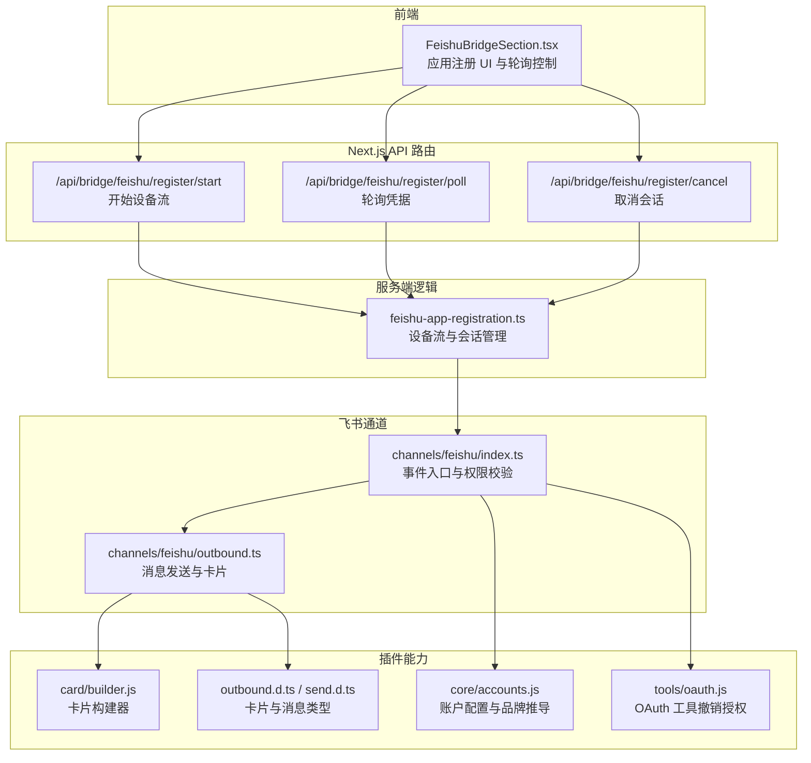
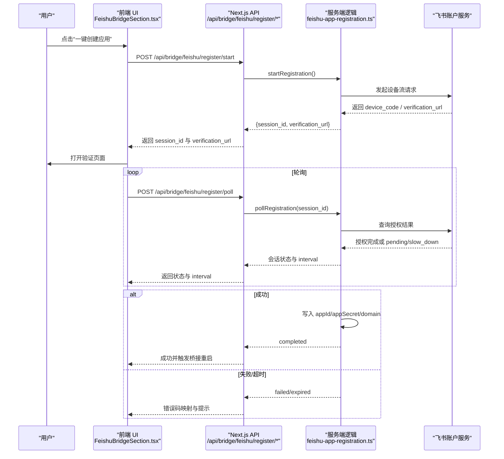
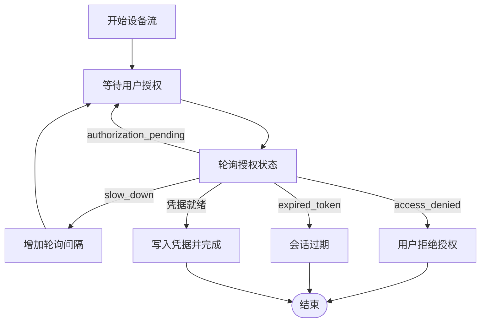
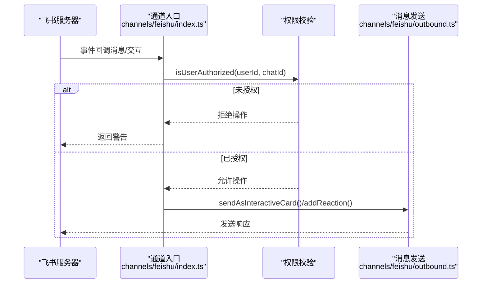
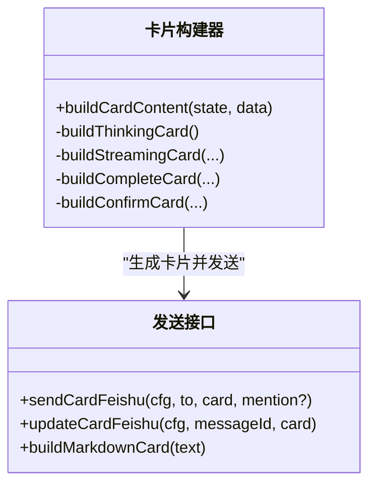
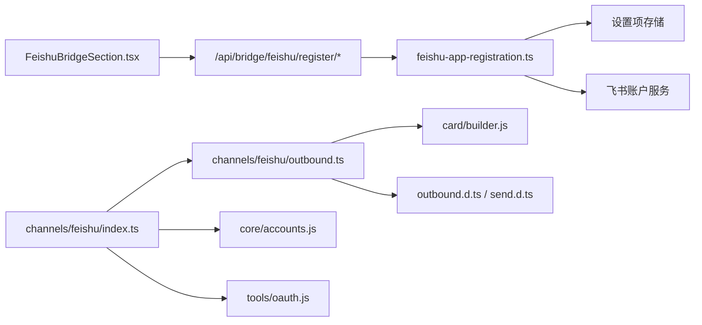

# 飞书桥接 API

<cite>
**本文引用的文件**
- [src/lib/bridge/feishu-app-registration.ts](file://src/lib/bridge/feishu-app-registration.ts)
- [src/app/api/bridge/feishu/register/start/route.ts](file://src/app/api/bridge/feishu/register/start/route.ts)
- [src/app/api/bridge/feishu/register/poll/route.ts](file://src/app/api/bridge/feishu/register/poll/route.ts)
- [src/app/api/bridge/feishu/register/cancel/route.ts](file://src/app/api/bridge/feishu/register/cancel/route.ts)
- [src/components/bridge/FeishuBridgeSection.tsx](file://src/components/bridge/FeishuBridgeSection.tsx)
- [src/lib/channels/feishu/index.ts](file://src/lib/channels/feishu/index.ts)
- [src/lib/channels/feishu/outbound.ts](file://src/lib/channels/feishu/outbound.ts)
- [资料/feishu-openclaw-plugin/package/src/messaging/outbound/outbound.d.ts](file://资料/feishu-openclaw-plugin/package/src/messaging/outbound/outbound.d.ts)
- [资料/feishu-openclaw-plugin/package/src/messaging/outbound/send.d.ts](file://资料/feishu-openclaw-plugin/package/src/messaging/outbound/send.d.ts)
- [资料/feishu-openclaw-plugin/package/src/card/builder.js](file://资料/feishu-openclaw-plugin/package/src/card/builder.js)
- [资料/feishu-openclaw-plugin/package/src/core/accounts.js](file://资料/feishu-openclaw-plugin/package/src/core/accounts.js)
- [资料/feishu-openclaw-plugin/package/src/tools/oauth.js](file://资料/feishu-openclaw-plugin/package/src/tools/oauth.js)
- [docs/handover/bridge-system.md](file://docs/handover/bridge-system.md)
- [src/__tests__/unit/feishu-app-registration.test.ts](file://src/__tests__/unit/feishu-app-registration.test.ts)
</cite>

## 目录
1. [简介](#简介)
2. [项目结构](#项目结构)
3. [核心组件](#核心组件)
4. [架构总览](#架构总览)
5. [详细组件分析](#详细组件分析)
6. [依赖关系分析](#依赖关系分析)
7. [性能考量](#性能考量)
8. [故障排查指南](#故障排查指南)
9. [结论](#结论)
10. [附录](#附录)

## 简介
本文件面向飞书桥接 API 的设计与实现，覆盖飞书应用创建、企业内部应用配置、OAuth 授权流程、事件订阅与消息回调、用户授权与群组管理、机器人权限控制、消息类型处理与富文本/多媒体、API 端点规范、签名验证与重试机制、企业微信兼容性、消息去重与状态同步、以及飞书卡片组件与交互按钮的集成方法。文档以仓库中现有实现为依据，结合测试与接口定义，帮助开发者快速理解并正确接入。

## 项目结构
飞书桥接相关能力主要分布在以下模块：
- 应用注册与设备流：服务端设备流发起与轮询、前端 UI 与轮询控制
- 通道适配层：飞书通道入口、事件解析、消息发送与卡片构建
- 插件侧能力：卡片构建器、消息发送接口、账户配置与 OAuth 工具

图表来源
- [src/components/bridge/FeishuBridgeSection.tsx](file://src/components/bridge/FeishuBridgeSection.tsx)
- [src/app/api/bridge/feishu/register/start/route.ts](file://src/app/api/bridge/feishu/register/start/route.ts)
- [src/app/api/bridge/feishu/register/poll/route.ts](file://src/app/api/bridge/feishu/register/poll/route.ts)
- [src/app/api/bridge/feishu/register/cancel/route.ts](file://src/app/api/bridge/feishu/register/cancel/route.ts)
- [src/lib/bridge/feishu-app-registration.ts](file://src/lib/bridge/feishu-app-registration.ts)
- [src/lib/channels/feishu/index.ts](file://src/lib/channels/feishu/index.ts)
- [src/lib/channels/feishu/outbound.ts](file://src/lib/channels/feishu/outbound.ts)
- [资料/feishu-openclaw-plugin/package/src/card/builder.js](file://资料/feishu-openclaw-plugin/package/src/card/builder.js)
- [资料/feishu-openclaw-plugin/package/src/messaging/outbound/outbound.d.ts](file://资料/feishu-openclaw-plugin/package/src/messaging/outbound/outbound.d.ts)
- [资料/feishu-openclaw-plugin/package/src/messaging/outbound/send.d.ts](file://资料/feishu-openclaw-plugin/package/src/messaging/outbound/send.d.ts)
- [资料/feishu-openclaw-plugin/package/src/core/accounts.js](file://资料/feishu-openclaw-plugin/package/src/core/accounts.js)
- [资料/feishu-openclaw-plugin/package/src/tools/oauth.js](file://资料/feishu-openclaw-plugin/package/src/tools/oauth.js)

章节来源
- [docs/handover/bridge-system.md](file://docs/handover/bridge-system.md)

## 核心组件
- 应用注册与设备流：通过设备流在飞书后台完成应用创建与权限授权，自动写入凭据并触发桥接重启
- 通道适配层：统一解析飞书事件，执行访问控制与权限校验，负责消息与卡片的发送
- 卡片与消息：提供富文本、按钮、表单等交互元素，支持多版本卡片协议
- 账户与品牌：支持自定义域名与品牌推导，兼容飞书与 Lark
- OAuth 工具：提供授权撤销能力，辅助处理 Token 失效场景

章节来源
- [src/lib/bridge/feishu-app-registration.ts](file://src/lib/bridge/feishu-app-registration.ts)
- [src/lib/channels/feishu/index.ts](file://src/lib/channels/feishu/index.ts)
- [src/lib/channels/feishu/outbound.ts](file://src/lib/channels/feishu/outbound.ts)
- [资料/feishu-openclaw-plugin/package/src/messaging/outbound/outbound.d.ts](file://资料/feishu-openclaw-plugin/package/src/messaging/outbound/outbound.d.ts)
- [资料/feishu-openclaw-plugin/package/src/messaging/outbound/send.d.ts](file://资料/feishu-openclaw-plugin/package/src/messaging/outbound/send.d.ts)
- [资料/feishu-openclaw-plugin/package/src/card/builder.js](file://资料/feishu-openclaw-plugin/package/src/card/builder.js)
- [资料/feishu-openclaw-plugin/package/src/core/accounts.js](file://资料/feishu-openclaw-plugin/package/src/core/accounts.js)
- [资料/feishu-openclaw-plugin/package/src/tools/oauth.js](file://资料/feishu-openclaw-plugin/package/src/tools/oauth.js)

## 架构总览
飞书桥接采用“前端发起 + 服务端设备流 + 通道适配 + 卡片渲染”的分层架构。前端负责用户交互与轮询控制；服务端负责与飞书账户服务通信，完成应用注册与凭据落库；通道层负责事件解析与消息发送；插件侧提供卡片构建与消息类型定义。

图表来源
- [src/components/bridge/FeishuBridgeSection.tsx](file://src/components/bridge/FeishuBridgeSection.tsx)
- [src/app/api/bridge/feishu/register/start/route.ts](file://src/app/api/bridge/feishu/register/start/route.ts)
- [src/app/api/bridge/feishu/register/poll/route.ts](file://src/app/api/bridge/feishu/register/poll/route.ts)
- [src/lib/bridge/feishu-app-registration.ts](file://src/lib/bridge/feishu-app-registration.ts)

## 详细组件分析

### 应用注册与设备流（飞书一键创建）
- 设备流端点：使用飞书官方账户服务的设备流接口，配合特定原型参数自动配置 Bot 能力、IM 权限与事件订阅
- 前端流程：启动 -> 打开验证页 -> 轮询 -> 成功/失败/过期
- 会话状态机：waiting/completed/failed/expired，支持慢速退避与 Lark 回切
- 错误码契约：timeout/user_denied/empty_credentials/lark_empty_credentials
- 取消语义：支持取消并清理服务端会话，避免孤儿应用

图表来源
- [src/lib/bridge/feishu-app-registration.ts](file://src/lib/bridge/feishu-app-registration.ts)
- [src/app/api/bridge/feishu/register/start/route.ts](file://src/app/api/bridge/feishu/register/start/route.ts)
- [src/app/api/bridge/feishu/register/poll/route.ts](file://src/app/api/bridge/feishu/register/poll/route.ts)
- [src/app/api/bridge/feishu/register/cancel/route.ts](file://src/app/api/bridge/feishu/register/cancel/route.ts)
- [src/components/bridge/FeishuBridgeSection.tsx](file://src/components/bridge/FeishuBridgeSection.tsx)

章节来源
- [docs/handover/bridge-system.md](file://docs/handover/bridge-system.md)
- [src/__tests__/unit/feishu-app-registration.test.ts](file://src/__tests__/unit/feishu-app-registration.test.ts)

### 通道适配层（事件订阅与消息回调）
- 事件入口：统一解析飞书事件，提取 chatId/messageId/userId，并进行访问控制与权限校验
- 交互按钮：支持 callback_data 类型识别（权限、工作目录、询问等），并校验操作者是否被允许
- 消息发送：支持普通文本、富文本、表情反应、交互卡片等

图表来源
- [src/lib/channels/feishu/index.ts](file://src/lib/channels/feishu/index.ts)
- [src/lib/channels/feishu/outbound.ts](file://src/lib/channels/feishu/outbound.ts)

章节来源
- [src/lib/channels/feishu/index.ts](file://src/lib/channels/feishu/index.ts)
- [src/lib/channels/feishu/outbound.ts](file://src/lib/channels/feishu/outbound.ts)

### 卡片组件与交互按钮
- 卡片版本：支持 v1（Message Card）与 v2（CardKit），通过 schema 字段区分
- 元素类型：markdown/div/action/button/button_group/note 等
- 构建器：根据状态（思考/流式/完成/确认）生成不同布局
- 发送接口：支持更新已有卡片、构建 Markdown 卡片并发送

图表来源
- [资料/feishu-openclaw-plugin/package/src/card/builder.js](file://资料/feishu-openclaw-plugin/package/src/card/builder.js)
- [资料/feishu-openclaw-plugin/package/src/messaging/outbound/outbound.d.ts](file://资料/feishu-openclaw-plugin/package/src/messaging/outbound/outbound.d.ts)
- [资料/feishu-openclaw-plugin/package/src/messaging/outbound/send.d.ts](file://资料/feishu-openclaw-plugin/package/src/messaging/outbound/send.d.ts)

章节来源
- [资料/feishu-openclaw-plugin/package/src/card/builder.js](file://资料/feishu-openclaw-plugin/package/src/card/builder.js)
- [资料/feishu-openclaw-plugin/package/src/messaging/outbound/outbound.d.ts](file://资料/feishu-openclaw-plugin/package/src/messaging/outbound/outbound.d.ts)
- [资料/feishu-openclaw-plugin/package/src/messaging/outbound/send.d.ts](file://资料/feishu-openclaw-plugin/package/src/messaging/outbound/send.d.ts)

### 账户配置与品牌回切
- 账户合并：基础配置与账户覆盖合并，支持显式 enabled 与配置完整性判断
- 品牌推导：支持自定义域名，通过 open.X 推导 accounts.X 作为设备流端点
- Lark 兼容：当租户品牌为 lark 且凭据为空时，切换到 lark 域名继续轮询

章节来源
- [资料/feishu-openclaw-plugin/package/src/core/accounts.js](file://资料/feishu-openclaw-plugin/package/src/core/accounts.js)
- [src/lib/bridge/feishu-app-registration.ts](file://src/lib/bridge/feishu-app-registration.ts)

### OAuth 授权与撤销
- 授权工具：提供 feishu_oauth 工具，描述为“飞书用户授权（OAuth）管理工具”，用于撤销当前用户的授权
- Token 失效处理：当返回 token_expired 错误时，调用 revoke 撤销后系统自动重新发起授权流程

章节来源
- [资料/feishu-openclaw-plugin/package/src/tools/oauth.js](file://资料/feishu-openclaw-plugin/package/src/tools/oauth.js)

## 依赖关系分析
- 前端 UI 依赖 Next.js API 路由进行设备流控制
- API 路由依赖服务端注册逻辑与数据库设置项
- 通道适配层依赖飞书 SDK 与账户配置
- 卡片与消息发送依赖插件侧类型定义与构建器

图表来源
- [src/components/bridge/FeishuBridgeSection.tsx](file://src/components/bridge/FeishuBridgeSection.tsx)
- [src/app/api/bridge/feishu/register/start/route.ts](file://src/app/api/bridge/feishu/register/start/route.ts)
- [src/app/api/bridge/feishu/register/poll/route.ts](file://src/app/api/bridge/feishu/register/poll/route.ts)
- [src/app/api/bridge/feishu/register/cancel/route.ts](file://src/app/api/bridge/feishu/register/cancel/route.ts)
- [src/lib/bridge/feishu-app-registration.ts](file://src/lib/bridge/feishu-app-registration.ts)
- [src/lib/channels/feishu/index.ts](file://src/lib/channels/feishu/index.ts)
- [src/lib/channels/feishu/outbound.ts](file://src/lib/channels/feishu/outbound.ts)
- [资料/feishu-openclaw-plugin/package/src/card/builder.js](file://资料/feishu-openclaw-plugin/package/src/card/builder.js)
- [资料/feishu-openclaw-plugin/package/src/messaging/outbound/outbound.d.ts](file://资料/feishu-openclaw-plugin/package/src/messaging/outbound/outbound.d.ts)
- [资料/feishu-openclaw-plugin/package/src/messaging/outbound/send.d.ts](file://资料/feishu-openclaw-plugin/package/src/messaging/outbound/send.d.ts)
- [资料/feishu-openclaw-plugin/package/src/core/accounts.js](file://资料/feishu-openclaw-plugin/package/src/core/accounts.js)
- [资料/feishu-openclaw-plugin/package/src/tools/oauth.js](file://资料/feishu-openclaw-plugin/package/src/tools/oauth.js)

## 性能考量
- 轮询退避：服务端返回 interval_ms，前端采用递归 setTimeout 动态调整轮询间隔，避免集中请求
- 并发与竞态：前端使用 AbortController 与单调递增 runId，确保取消后不会产生竞态状态更新
- 卡片更新：支持 update_multi 控制多接收方可见的批量更新，减少重复消息

章节来源
- [src/components/bridge/FeishuBridgeSection.tsx](file://src/components/bridge/FeishuBridgeSection.tsx)
- [src/lib/channels/feishu/outbound.ts](file://src/lib/channels/feishu/outbound.ts)

## 故障排查指南
- 设备流失败
  - 用户拒绝：错误码 user_denied，前端映射为中文提示
  - 会话过期：错误码 timeout，前端提示超时
  - Lark 凭据为空：错误码 lark_empty_credentials，需检查租户品牌与域名
- 交互按钮被拒
  - 未授权用户点击：通道层会拒绝并返回警告
- 卡片发送失败
  - 检查卡片 schema 与元素类型是否符合 v1/v2 规范
  - 确认 update_multi 配置与消息 ID 正确

章节来源
- [src/lib/bridge/feishu-app-registration.ts](file://src/lib/bridge/feishu-app-registration.ts)
- [src/lib/channels/feishu/index.ts](file://src/lib/channels/feishu/index.ts)
- [资料/feishu-openclaw-plugin/package/src/messaging/outbound/outbound.d.ts](file://资料/feishu-openclaw-plugin/package/src/messaging/outbound/outbound.d.ts)

## 结论
飞书桥接 API 通过设备流实现“一键创建应用”，结合通道层的事件解析与权限校验，以及插件侧的卡片与消息能力，形成完整的消息与交互闭环。前端轮询与服务端退避策略保证了稳定性，类型定义与构建器提升了可维护性。建议在生产环境关注错误码映射、Lark 兼容与卡片版本一致性。

## 附录

### API 端点规范
- POST /api/bridge/feishu/register/start
  - 请求体：无
  - 响应：{ session_id, verification_url }
- POST /api/bridge/feishu/register/poll
  - 请求体：{ session_id }
  - 响应：会话状态与 interval_ms（用于前端退避）
- POST /api/bridge/feishu/register/cancel
  - 请求体：{ session_id }
  - 响应：取消结果

章节来源
- [src/app/api/bridge/feishu/register/start/route.ts](file://src/app/api/bridge/feishu/register/start/route.ts)
- [src/app/api/bridge/feishu/register/poll/route.ts](file://src/app/api/bridge/feishu/register/poll/route.ts)
- [src/app/api/bridge/feishu/register/cancel/route.ts](file://src/app/api/bridge/feishu/register/cancel/route.ts)

### 签名验证与重试机制
- 签名验证：通道层对事件来源进行校验（具体实现参考通道入口）
- 重试机制：设备流轮询遵循服务端返回的 interval_ms，前端采用递归定时器动态退避

章节来源
- [src/lib/channels/feishu/index.ts](file://src/lib/channels/feishu/index.ts)
- [src/components/bridge/FeishuBridgeSection.tsx](file://src/components/bridge/FeishuBridgeSection.tsx)

### 企业微信兼容性
- 当前实现聚焦飞书/Lark，未见企业微信桥接相关代码

章节来源
- [资料/feishu-openclaw-plugin/package/src/core/accounts.js](file://资料/feishu-openclaw-plugin/package/src/core/accounts.js)

### 消息去重与状态同步
- 去重：通道层基于事件上下文提取 open_chat_id/open_message_id/open_id，结合权限校验避免重复或越权操作
- 状态同步：设备流完成后写入凭据并触发桥接重启，前端状态 Banner 提示成功或警告（凭据已存但运行时有问题）

章节来源
- [src/lib/channels/feishu/index.ts](file://src/lib/channels/feishu/index.ts)
- [src/lib/bridge/feishu-app-registration.ts](file://src/lib/bridge/feishu-app-registration.ts)
- [src/components/bridge/FeishuBridgeSection.tsx](file://src/components/bridge/FeishuBridgeSection.tsx)