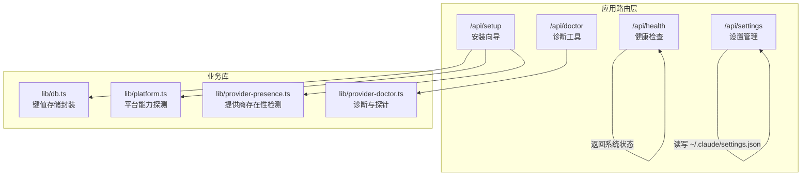
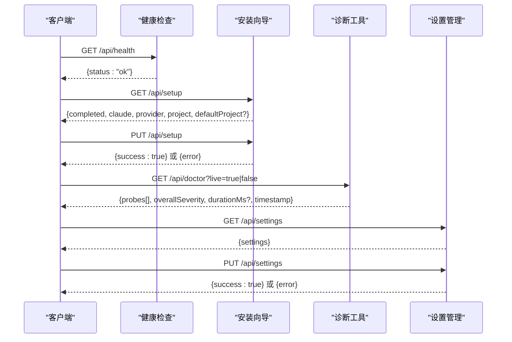
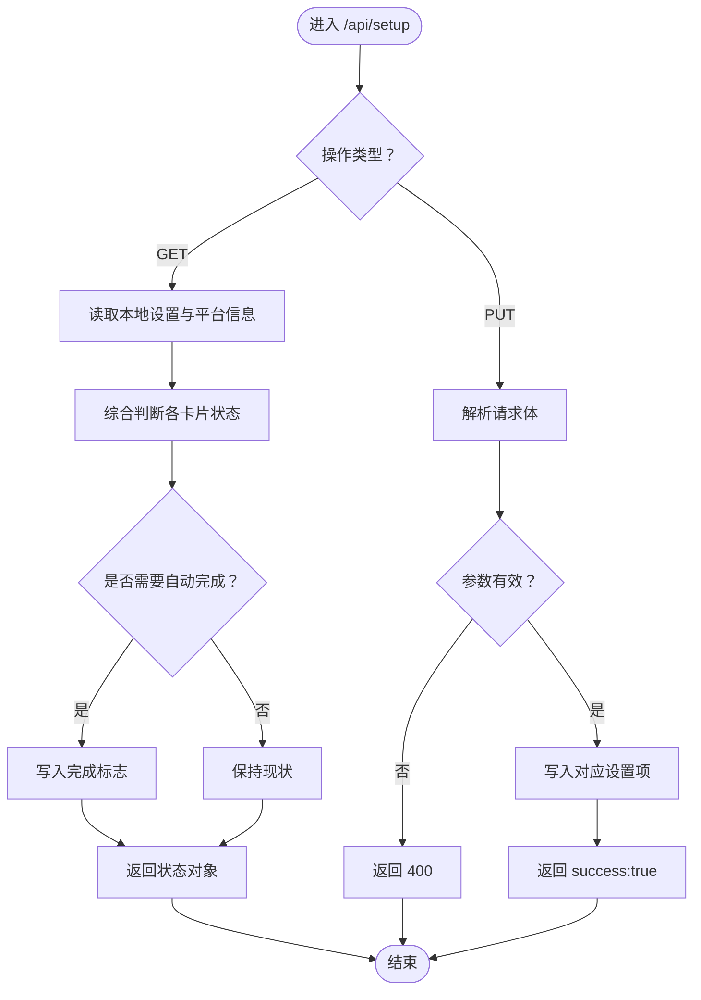
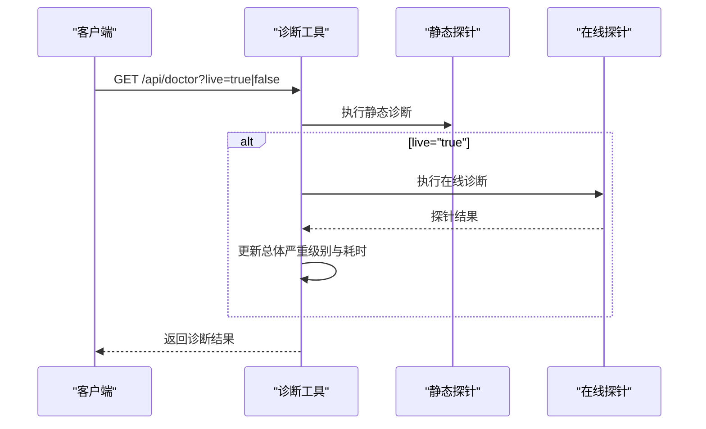
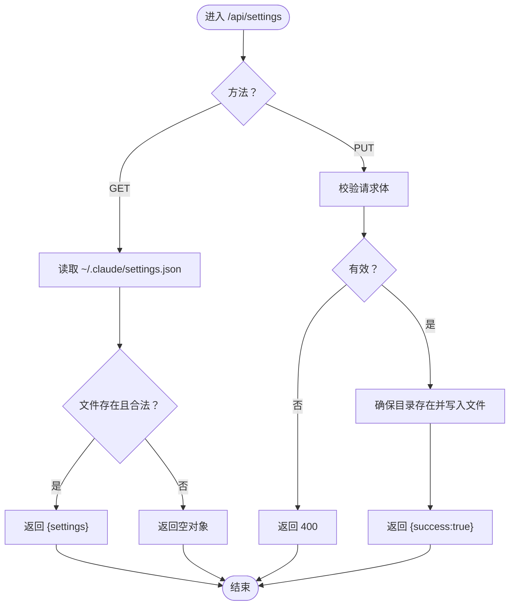
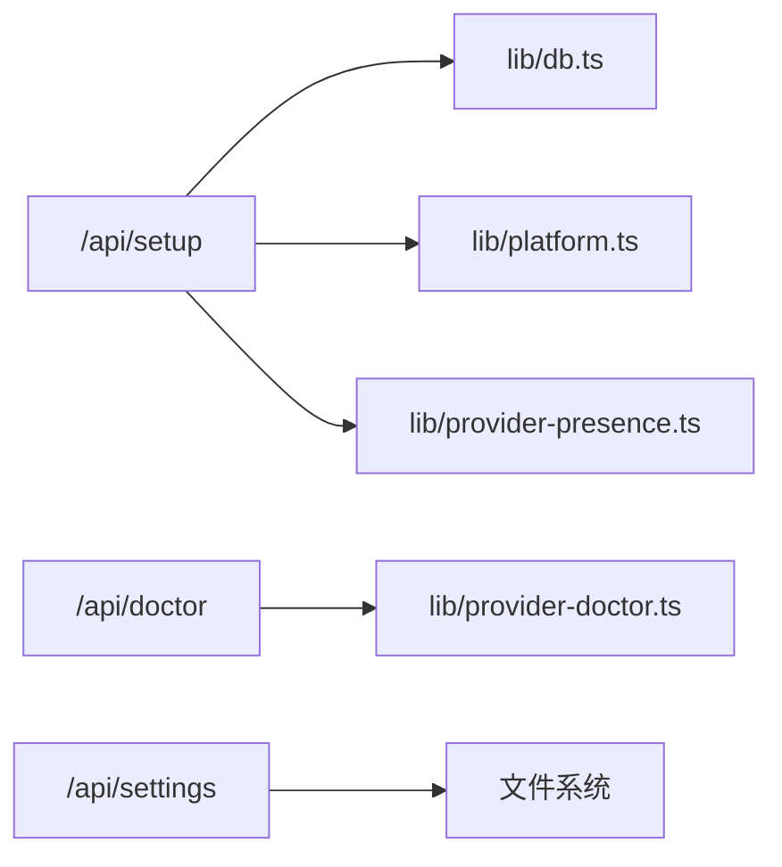

# 系统 API

<cite>
**本文引用的文件**
- [src/app/api/health/route.ts](file://src/app/api/health/route.ts)
- [src/app/api/setup/route.ts](file://src/app/api/setup/route.ts)
- [src/app/api/doctor/route.ts](file://src/app/api/doctor/route.ts)
- [src/app/api/settings/route.ts](file://src/app/api/settings/route.ts)
- [src/lib/db.ts](file://src/lib/db.ts)
- [src/lib/platform.ts](file://src/lib/platform.ts)
- [src/lib/provider-presence.ts](file://src/lib/provider-presence.ts)
- [src/lib/provider-doctor.ts](file://src/lib/provider-doctor.ts)
</cite>

## 目录
1. [简介](#简介)
2. [项目结构](#项目结构)
3. [核心组件](#核心组件)
4. [架构总览](#架构总览)
5. [详细组件分析](#详细组件分析)
6. [依赖关系分析](#依赖关系分析)
7. [性能考量](#性能考量)
8. [故障排查指南](#故障排查指南)
9. [结论](#结论)

## 简介
本文件为 CodePilot 系统 API 的权威参考，覆盖以下核心能力：
- 设置管理：读取与写入用户本地设置文件
- 健康检查：系统可用性探针
- 安装向导：引导完成 Claude 集成、提供商配置与默认工程目录
- 诊断工具：离线与在线诊断探针，辅助定位问题

文档严格依据仓库中现有实现，给出每个端点的 HTTP 方法、URL 模式、请求/响应结构、认证要求、错误处理策略与使用建议。

## 项目结构
系统 API 位于应用路由层，采用 Next.js App Router 的约定式路由组织方式，按功能域划分目录，便于扩展与维护。

图表来源
- [src/app/api/health/route.ts:1-6](file://src/app/api/health/route.ts#L1-L6)
- [src/app/api/setup/route.ts:1-123](file://src/app/api/setup/route.ts#L1-L123)
- [src/app/api/doctor/route.ts:1-38](file://src/app/api/doctor/route.ts#L1-L38)
- [src/app/api/settings/route.ts:1-61](file://src/app/api/settings/route.ts#L1-L61)
- [src/lib/db.ts](file://src/lib/db.ts)
- [src/lib/platform.ts](file://src/lib/platform.ts)
- [src/lib/provider-presence.ts](file://src/lib/provider-presence.ts)
- [src/lib/provider-doctor.ts](file://src/lib/provider-doctor.ts)

章节来源
- [src/app/api/health/route.ts:1-6](file://src/app/api/health/route.ts#L1-L6)
- [src/app/api/setup/route.ts:1-123](file://src/app/api/setup/route.ts#L1-L123)
- [src/app/api/doctor/route.ts:1-38](file://src/app/api/doctor/route.ts#L1-L38)
- [src/app/api/settings/route.ts:1-61](file://src/app/api/settings/route.ts#L1-L61)

## 核心组件
- 健康检查：提供最小化可用性反馈，用于外部监控与自愈机制
- 安装向导：聚合 Claude、提供商与工程目录三类卡片状态，支持查询与更新
- 诊断工具：执行静态与可选的在线探针，汇总严重级别与耗时
- 设置管理：读取与写入用户本地设置文件，确保目录存在与数据安全

章节来源
- [src/app/api/health/route.ts:1-6](file://src/app/api/health/route.ts#L1-L6)
- [src/app/api/setup/route.ts:1-123](file://src/app/api/setup/route.ts#L1-L123)
- [src/app/api/doctor/route.ts:1-38](file://src/app/api/doctor/route.ts#L1-L38)
- [src/app/api/settings/route.ts:1-61](file://src/app/api/settings/route.ts#L1-L61)

## 架构总览
下图展示系统 API 的调用链与依赖关系，帮助理解各端点如何协同工作。

图表来源
- [src/app/api/health/route.ts:1-6](file://src/app/api/health/route.ts#L1-L6)
- [src/app/api/setup/route.ts:1-123](file://src/app/api/setup/route.ts#L1-L123)
- [src/app/api/doctor/route.ts:1-38](file://src/app/api/doctor/route.ts#L1-L38)
- [src/app/api/settings/route.ts:1-61](file://src/app/api/settings/route.ts#L1-L61)

## 详细组件分析

### 健康检查 /api/health
- 方法与路径
  - GET /api/health
- 认证要求
  - 无（公开端点）
- 请求参数
  - 无
- 成功响应
  - 返回系统可用性状态对象
- 错误处理
  - 无运行时异常路径；若出现异常，由框架层统一处理
- 使用场景
  - 健康探针、容器编排自愈、前端心跳

章节来源
- [src/app/api/health/route.ts:1-6](file://src/app/api/health/route.ts#L1-L6)

### 安装向导 /api/setup
- 方法与路径
  - GET /api/setup：查询当前向导完成状态与各卡片状态
  - PUT /api/setup：更新某卡片或整体完成状态
- 认证要求
  - 无（公开端点）
- 查询参数（GET）
  - 无
- 请求体（PUT）
  - card：字符串，取值范围包括 claude、provider、project、completed
  - status：字符串，取值范围包括 skipped、completed
  - value：当 card 为 project 且 status 为 completed 时必填，表示工程目录路径
- 成功响应（GET）
  - completed：布尔，整体是否已完成
  - claude：枚举，not-configured | completed | skipped | needs-fix
  - provider：枚举，not-configured | completed | skipped | needs-fix
  - project：枚举，not-configured | completed | skipped | needs-fix
  - defaultProject：字符串（可选），默认工程目录
- 成功响应（PUT）
  - success：布尔，更新成功
- 错误处理
  - 缺少必要字段：400
  - 其他异常：500
- 行为要点
  - GET 会基于本地设置与平台能力进行综合判断，并在必要时自动标记完成
  - PUT 支持对单卡片状态与完成标志位进行原子更新

图表来源
- [src/app/api/setup/route.ts:1-123](file://src/app/api/setup/route.ts#L1-L123)
- [src/lib/db.ts](file://src/lib/db.ts)
- [src/lib/platform.ts](file://src/lib/platform.ts)
- [src/lib/provider-presence.ts](file://src/lib/provider-presence.ts)

章节来源
- [src/app/api/setup/route.ts:1-123](file://src/app/api/setup/route.ts#L1-L123)

### 诊断工具 /api/doctor
- 方法与路径
  - GET /api/doctor
- 认证要求
  - 无（公开端点）
- 查询参数
  - live：字符串，取值 "true" 时启用在线探针；省略或非 "true" 仅执行静态探针
- 成功响应
  - probes：数组，包含若干探针结果
  - overallSeverity：枚举，ok | warn | error
  - durationMs：数字（可选），在线探针启用时返回
  - timestamp：时间戳（可选），用于计算耗时
- 错误处理
  - 运行时异常：500 并返回错误消息
- 行为要点
  - 默认执行快速静态探针
  - 可选在线探针会触发外部 CLI 启动，耗时较长，需谨慎使用

图表来源
- [src/app/api/doctor/route.ts:1-38](file://src/app/api/doctor/route.ts#L1-L38)
- [src/lib/provider-doctor.ts](file://src/lib/provider-doctor.ts)

章节来源
- [src/app/api/doctor/route.ts:1-38](file://src/app/api/doctor/route.ts#L1-L38)

### 设置管理 /api/settings
- 方法与路径
  - GET /api/settings：读取用户本地设置
  - PUT /api/settings：写入用户本地设置
- 认证要求
  - 无（公开端点）
- 请求体（GET）
  - 无
- 成功响应（GET）
  - settings：对象，表示当前设置
- 请求体（PUT）
  - settings：对象，要保存的设置
- 成功响应（PUT）
  - success：布尔，保存成功
- 错误处理
  - 参数无效：400
  - 文件读写异常：500
- 行为要点
  - 读取 ~/.claude/settings.json
  - 若目录不存在则自动创建
  - 写入时以缩进格式化，保证可读性

图表来源
- [src/app/api/settings/route.ts:1-61](file://src/app/api/settings/route.ts#L1-L61)

章节来源
- [src/app/api/settings/route.ts:1-61](file://src/app/api/settings/route.ts#L1-L61)

## 依赖关系分析
- 安装向导依赖本地设置存储、平台能力探测与提供商存在性检测
- 诊断工具依赖诊断与探针库
- 设置管理直接读写用户本地文件

图表来源
- [src/app/api/setup/route.ts:1-123](file://src/app/api/setup/route.ts#L1-L123)
- [src/app/api/doctor/route.ts:1-38](file://src/app/api/doctor/route.ts#L1-L38)
- [src/app/api/settings/route.ts:1-61](file://src/app/api/settings/route.ts#L1-L61)
- [src/lib/db.ts](file://src/lib/db.ts)
- [src/lib/platform.ts](file://src/lib/platform.ts)
- [src/lib/provider-presence.ts](file://src/lib/provider-presence.ts)
- [src/lib/provider-doctor.ts](file://src/lib/provider-doctor.ts)

章节来源
- [src/app/api/setup/route.ts:1-123](file://src/app/api/setup/route.ts#L1-L123)
- [src/app/api/doctor/route.ts:1-38](file://src/app/api/doctor/route.ts#L1-L38)
- [src/app/api/settings/route.ts:1-61](file://src/app/api/settings/route.ts#L1-L61)

## 性能考量
- 健康检查为纯内存返回，延迟极低
- 安装向导在 GET 中可能触发文件系统与外部二进制探测，建议在前端做节流与缓存
- 诊断工具默认执行静态探针，耗时约数毫秒；启用在线探针会启动外部进程，建议仅在需要时使用并设置超时
- 设置管理涉及磁盘 IO，建议批量写入与去抖动

## 故障排查指南
- 健康检查失败
  - 检查服务进程与网络连通性
  - 查看应用日志定位异常
- 安装向导状态不一致
  - 确认本地设置项是否正确写入
  - 核对平台探测逻辑与提供商存在性判断
- 诊断工具无输出或报错
  - 确认探针库可用与权限充足
  - 尝试移除 live 参数以排除在线探针影响
- 设置管理无法读写
  - 检查用户主目录权限与 ~/.claude 目录是否存在
  - 确保 JSON 格式合法

章节来源
- [src/app/api/health/route.ts:1-6](file://src/app/api/health/route.ts#L1-L6)
- [src/app/api/setup/route.ts:1-123](file://src/app/api/setup/route.ts#L1-L123)
- [src/app/api/doctor/route.ts:1-38](file://src/app/api/doctor/route.ts#L1-L38)
- [src/app/api/settings/route.ts:1-61](file://src/app/api/settings/route.ts#L1-L61)

## 结论
本文档基于仓库现有实现，给出了系统 API 的端点规范、数据模型与行为边界。建议在生产环境中：
- 对外暴露的端点增加必要的鉴权与速率限制
- 在前端侧对高频调用进行缓存与去抖
- 诊断工具默认禁用在线探针，仅在问题定位时开启
- 对设置管理做好备份与回滚策略