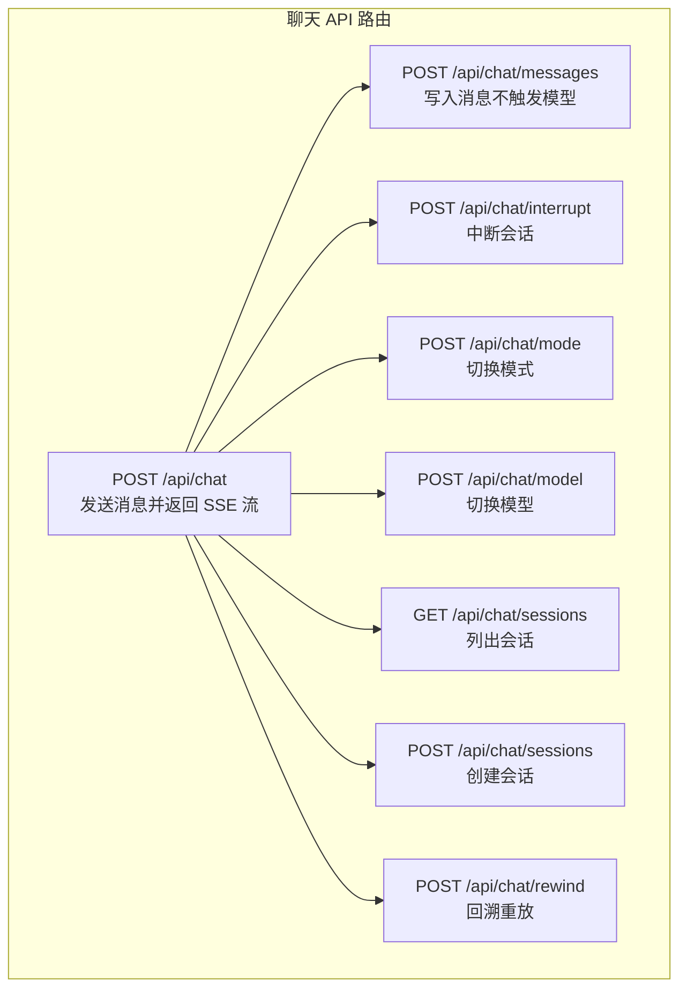
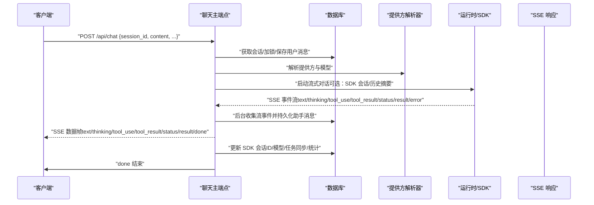
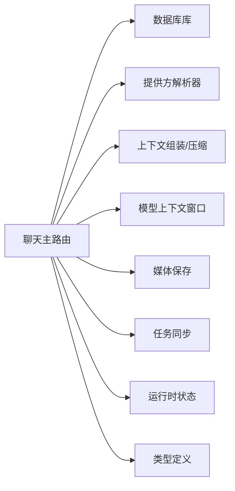

# 聊天 API

<cite>
**本文引用的文件**
- [src/app/api/chat/route.ts](file://src/app/api/chat/route.ts)
- [src/app/api/chat/messages/route.ts](file://src/app/api/chat/messages/route.ts)
- [src/app/api/chat/interrupt/route.ts](file://src/app/api/chat/interrupt/route.ts)
- [src/app/api/chat/mode/route.ts](file://src/app/api/chat/mode/route.ts)
- [src/app/api/chat/model/route.ts](file://src/app/api/chat/model/route.ts)
- [src/app/api/chat/sessions/route.ts](file://src/app/api/chat/sessions/route.ts)
- [src/app/api/chat/rewind/route.ts](file://src/app/api/chat/rewind/route.ts)
- [src/types/index.ts](file://src/types/index.ts)
</cite>

## 目录
1. [简介](#简介)
2. [项目结构](#项目结构)
3. [核心组件](#核心组件)
4. [架构总览](#架构总览)
5. [详细组件分析](#详细组件分析)
6. [依赖关系分析](#依赖关系分析)
7. [性能考量](#性能考量)
8. [故障排查指南](#故障排查指南)
9. [结论](#结论)
10. [附录](#附录)

## 简介
本文件为 CodePilot 聊天 API 的权威参考文档，覆盖消息发送与流式传输、会话管理、消息中断、模式切换、模型切换、消息持久化、回溯重放等端点的完整规范。文档提供每个端点的 HTTP 方法、URL、请求/响应结构、认证要求、错误码与处理策略，并结合代码级流程图与序列图解释消息流式传输机制、SSE 连接处理、会话状态管理与权限控制。

## 项目结构
聊天 API 的后端路由集中在应用层的聊天子路径下，按功能拆分为多个独立的 Next.js 路由处理器：
- 主聊天入口：发送消息并返回 SSE 流
- 消息持久化：直接写入用户/助手消息（不触发模型）
- 中断：中止当前运行中的会话（原生或 SDK）
- 模式切换：在会话中切换“编码/规划”模式
- 模型切换：在会话中切换模型
- 会话管理：列出与创建会话
- 回溯重放：将会话与工作区文件回退到指定用户消息

图表来源
- [src/app/api/chat/route.ts:27-630](file://src/app/api/chat/route.ts#L27-L630)
- [src/app/api/chat/messages/route.ts:11-39](file://src/app/api/chat/messages/route.ts#L11-L39)
- [src/app/api/chat/interrupt/route.ts:13-44](file://src/app/api/chat/interrupt/route.ts#L13-L44)
- [src/app/api/chat/mode/route.ts:13-28](file://src/app/api/chat/mode/route.ts#L13-L28)
- [src/app/api/chat/model/route.ts:13-28](file://src/app/api/chat/model/route.ts#L13-L28)
- [src/app/api/chat/sessions/route.ts:6-56](file://src/app/api/chat/sessions/route.ts#L6-L56)
- [src/app/api/chat/rewind/route.ts:16-64](file://src/app/api/chat/rewind/route.ts#L16-L64)

章节来源
- [src/app/api/chat/route.ts:27-630](file://src/app/api/chat/route.ts#L27-L630)
- [src/app/api/chat/messages/route.ts:11-39](file://src/app/api/chat/messages/route.ts#L11-L39)
- [src/app/api/chat/interrupt/route.ts:13-44](file://src/app/api/chat/interrupt/route.ts#L13-L44)
- [src/app/api/chat/mode/route.ts:13-28](file://src/app/api/chat/mode/route.ts#L13-L28)
- [src/app/api/chat/model/route.ts:13-28](file://src/app/api/chat/model/route.ts#L13-L28)
- [src/app/api/chat/sessions/route.ts:6-56](file://src/app/api/chat/sessions/route.ts#L6-L56)
- [src/app/api/chat/rewind/route.ts:16-64](file://src/app/api/chat/rewind/route.ts#L16-L64)

## 核心组件
- 主聊天端点（SSE 流）：负责接收用户消息、解析/压缩上下文、调用上游模型、收集流事件并持久化助手消息、通知与内存提取等。
- 消息持久化端点：用于图像生成等场景，直接写入用户/助手消息而不触发模型。
- 中断端点：尝试原生运行时与 SDK 运行时两种中断方式。
- 模式/模型切换端点：仅更新会话记录，下次循环读取生效。
- 会话管理端点：列出与创建会话，创建时校验工作目录存在性。
- 回溯重放端点：优先使用 SDK 会话进行文件回滚，否则本地截断消息并恢复文件检查点。

章节来源
- [src/app/api/chat/route.ts:27-630](file://src/app/api/chat/route.ts#L27-L630)
- [src/app/api/chat/messages/route.ts:11-39](file://src/app/api/chat/messages/route.ts#L11-L39)
- [src/app/api/chat/interrupt/route.ts:13-44](file://src/app/api/chat/interrupt/route.ts#L13-L44)
- [src/app/api/chat/mode/route.ts:13-28](file://src/app/api/chat/mode/route.ts#L13-L28)
- [src/app/api/chat/model/route.ts:13-28](file://src/app/api/chat/model/route.ts#L13-L28)
- [src/app/api/chat/sessions/route.ts:6-56](file://src/app/api/chat/sessions/route.ts#L6-L56)
- [src/app/api/chat/rewind/route.ts:16-64](file://src/app/api/chat/rewind/route.ts#L16-L64)

## 架构总览
下图展示一次典型聊天请求从客户端到模型、再到 SSE 返回与后台持久化的整体流程。

图表来源
- [src/app/api/chat/route.ts:27-630](file://src/app/api/chat/route.ts#L27-L630)
- [src/app/api/chat/messages/route.ts:11-39](file://src/app/api/chat/messages/route.ts#L11-L39)

章节来源
- [src/app/api/chat/route.ts:27-630](file://src/app/api/chat/route.ts#L27-L630)

## 详细组件分析

### 主聊天端点：POST /api/chat
- 功能概述
  - 接收用户消息，执行预条件校验（提供方配置、会话存在、并发锁）、构建上下文、估计上下文长度并按需压缩、调用上游模型、以 SSE 流返回增量结果、后台收集并持久化助手消息、通知与记忆提取。
- 请求体字段
  - 必填：session_id、content
  - 可选：model、mode、provider_id、files、toolTimeout、systemPromptAppend、autoTrigger、thinking、effort、enableFileCheckpointing、displayOverride、context_1m
- 响应
  - 成功：text/event-stream，逐帧返回 SSE 事件；最终返回 done。
  - 失败：JSON 错误对象，含机器可读 code 字段。
- 并发与锁
  - 使用会话级独占锁防止并发请求；长任务周期性续期；异常时释放锁并重置运行时状态。
- 上下文压缩
  - 预估上下文占用，超过阈值时对历史消息进行压缩，生成摘要并更新边界；必要时强制清空 SDK 会话以便新摘要生效。
- SSE 事件类型
  - text、thinking、tool_use、tool_result、tool_output、tool_timeout、status、result、error、permission_request、mode_changed、task_update、keep_alive、rewind_point、rate_limit、context_usage、done。
- 后台持久化
  - 收集流事件，按结构化块存储；支持思维内容前置、媒体块落盘与替换、令牌用量统计、完成检测与通知、心跳与记忆提取等。

章节来源
- [src/app/api/chat/route.ts:27-630](file://src/app/api/chat/route.ts#L27-L630)
- [src/types/index.ts:519-522](file://src/types/index.ts#L519-L522)
- [src/types/index.ts:1078-1127](file://src/types/index.ts#L1078-L1127)

### 消息持久化端点：POST /api/chat/messages
- 功能概述
  - 直接将一条消息写入数据库，不触发模型推理；用于图像生成等场景。
- 请求体字段
  - 必填：session_id、role、content；可选：token_usage
- 响应
  - 返回新增消息对象；失败返回 JSON 错误。

章节来源
- [src/app/api/chat/messages/route.ts:11-39](file://src/app/api/chat/messages/route.ts#L11-L39)

### 消息更新端点：PUT /api/chat/messages
- 功能概述
  - 更新现有消息内容；优先按消息 ID 直接更新，失败则按会话+提示块或提示文本回溯定位更新。
- 请求体字段
  - 至少提供其一：message_id 或（session_id 与 raw_request_block 或 prompt_hint）
  - 必填：content
- 响应
  - 返回更新成功信息与最终使用的消息 ID；未找到返回 404。

章节来源
- [src/app/api/chat/messages/route.ts:49-98](file://src/app/api/chat/messages/route.ts#L49-L98)

### 中断端点：POST /api/chat/interrupt
- 功能概述
  - 尝试两种中断方式：原生运行时（AbortController）与 SDK 运行时（conversation.interrupt）。
- 请求体字段
  - 必填：sessionId
- 响应
  - 返回是否中断成功；失败时包含错误信息。

章节来源
- [src/app/api/chat/interrupt/route.ts:13-44](file://src/app/api/chat/interrupt/route.ts#L13-L44)

### 模式切换端点：POST /api/chat/mode
- 功能概述
  - 切换会话模式（code/plan），前端先更新会话记录，该端点仅确认生效。
- 请求体字段
  - 必填：sessionId、mode
- 响应
  - 返回是否应用成功；失败时包含错误信息。

章节来源
- [src/app/api/chat/mode/route.ts:13-28](file://src/app/api/chat/mode/route.ts#L13-L28)

### 模型切换端点：POST /api/chat/model
- 功能概述
  - 切换会话模型，前端先更新会话记录，该端点仅确认生效。
- 请求体字段
  - 必填：sessionId、model
- 响应
  - 返回是否应用成功；失败时包含错误信息。

章节来源
- [src/app/api/chat/model/route.ts:13-28](file://src/app/api/chat/model/route.ts#L13-L28)

### 会话列表端点：GET /api/chat/sessions
- 功能概述
  - 返回所有聊天会话。
- 响应
  - 返回 sessions 数组；失败返回 JSON 错误。

章节来源
- [src/app/api/chat/sessions/route.ts:6-16](file://src/app/api/chat/sessions/route.ts#L6-L16)

### 会话创建端点：POST /api/chat/sessions
- 功能概述
  - 创建新会话，校验工作目录存在性。
- 请求体字段
  - 必填：working_directory；其他可选：title、model、system_prompt、mode、provider_id、permission_profile
- 响应
  - 返回新建会话；失败返回 JSON 错误及 code（如 MISSING_DIRECTORY、INVALID_DIRECTORY）。

章节来源
- [src/app/api/chat/sessions/route.ts:18-56](file://src/app/api/chat/sessions/route.ts#L18-L56)

### 回溯重放端点：POST /api/chat/rewind
- 功能概述
  - 若存在 SDK 会话，则使用 SDK 的文件回滚能力；否则本地截断消息并恢复文件检查点。
- 请求体字段
  - 必填：sessionId、userMessageId；可选：dryRun
- 响应
  - 返回 canRewind、filesChanged（dryRun 时为空数组）；失败返回 JSON 错误。

章节来源
- [src/app/api/chat/rewind/route.ts:16-64](file://src/app/api/chat/rewind/route.ts#L16-L64)

## 依赖关系分析
- 路由到库函数
  - 主聊天端点依赖数据库操作（会话、消息、设置、锁）、提供方解析、上下文组装与压缩、模型上下文窗口、媒体保存、任务同步、运行时状态更新等。
- 类型与契约
  - SSE 事件类型、消息内容块、流会话快照、流选项等类型定义集中于类型文件，确保前后端一致。
- 错误分类
  - 通过 JSON 响应中的 error 与 code 字段区分语义化错误，便于客户端分支处理。

图表来源
- [src/app/api/chat/route.ts:1-25](file://src/app/api/chat/route.ts#L1-L25)
- [src/types/index.ts:519-522](file://src/types/index.ts#L519-L522)

章节来源
- [src/app/api/chat/route.ts:1-25](file://src/app/api/chat/route.ts#L1-L25)
- [src/types/index.ts:519-522](file://src/types/index.ts#L519-L522)

## 性能考量
- 上下文压缩
  - 在发送前估算上下文占用，超过阈值时对近期消息进行压缩，减少后续往返成本。
- 流式传输
  - 使用 SSE 逐步返回增量内容，降低首字节延迟；客户端可边渲染边消费。
- 并发控制
  - 会话级独占锁避免并发冲突；长任务定期续期，异常时释放锁。
- 媒体与文件
  - 工具结果中的媒体落地磁盘并替换为本地路径，减少内存占用与网络传输。

## 故障排查指南
- 常见错误与处理
  - 缺少提供方配置：返回 NEEDS_PROVIDER_SETUP，引导打开设置中心。
  - 会话不存在：返回 404。
  - 会话繁忙：返回 SESSION_BUSY，稍后重试。
  - 内部错误：返回 500，包含错误信息。
- 客户端实现建议
  - 使用 AbortController 监听取消；在 done 前保持连接；对 permission_request 事件进行权限处理；对 status 事件更新 UI 状态。
  - 对工具结果中的媒体块进行降级处理（保留原始数据）。
  - 对 rate_limit 与 context_usage 事件进行可视化提示与限速控制。
- 日志与可观测性
  - 关注主路由中的日志输出，定位上下文估计、压缩、流事件解析等问题。

章节来源
- [src/app/api/chat/route.ts:38-62](file://src/app/api/chat/route.ts#L38-L62)
- [src/app/api/chat/route.ts:615-629](file://src/app/api/chat/route.ts#L615-L629)
- [src/types/index.ts:519-522](file://src/types/index.ts#L519-L522)

## 结论
CodePilot 的聊天 API 以 SSE 流为核心，结合上下文压缩、权限控制、媒体落盘与任务同步，提供了稳定高效的对话体验。通过会话级锁与运行时状态管理，保证并发安全与可观测性。客户端应遵循 SSE 事件契约，妥善处理权限请求、速率限制与上下文使用提示，以获得最佳交互效果。

## 附录

### 端点一览与规范

- POST /api/chat
  - 请求体：SendMessageRequest + 可选扩展字段
  - 响应：text/event-stream，事件类型参见类型定义
  - 认证：无内置鉴权头；由上层网关或中间件控制
  - 示例：见“请求/响应示例”章节

- POST /api/chat/messages
  - 请求体：{ session_id, role, content, token_usage? }
  - 响应：{ message }
  - 示例：见“请求/响应示例”章节

- PUT /api/chat/messages
  - 请求体：{ message_id, content } 或 { session_id, prompt_hint, content }
  - 响应：{ ok, updated_message_id, fallback_used }

- POST /api/chat/interrupt
  - 请求体：{ sessionId }
  - 响应：{ interrupted: true/false, error? }

- POST /api/chat/mode
  - 请求体：{ sessionId, mode }
  - 响应：{ applied: true/false, error? }

- POST /api/chat/model
  - 请求体：{ sessionId, model }
  - 响应：{ applied: true/false, error? }

- GET /api/chat/sessions
  - 响应：{ sessions }

- POST /api/chat/sessions
  - 请求体：CreateSessionRequest（必填 working_directory）
  - 响应：{ session }，状态 201
  - 错误码：MISSING_DIRECTORY、INVALID_DIRECTORY

- POST /api/chat/rewind
  - 请求体：{ sessionId, userMessageId, dryRun? }
  - 响应：{ canRewind, filesChanged? }

章节来源
- [src/app/api/chat/route.ts:27-630](file://src/app/api/chat/route.ts#L27-L630)
- [src/app/api/chat/messages/route.ts:11-39](file://src/app/api/chat/messages/route.ts#L11-L39)
- [src/app/api/chat/messages/route.ts:49-98](file://src/app/api/chat/messages/route.ts#L49-L98)
- [src/app/api/chat/interrupt/route.ts:13-44](file://src/app/api/chat/interrupt/route.ts#L13-L44)
- [src/app/api/chat/mode/route.ts:13-28](file://src/app/api/chat/mode/route.ts#L13-L28)
- [src/app/api/chat/model/route.ts:13-28](file://src/app/api/chat/model/route.ts#L13-L28)
- [src/app/api/chat/sessions/route.ts:6-56](file://src/app/api/chat/sessions/route.ts#L6-L56)
- [src/app/api/chat/rewind/route.ts:16-64](file://src/app/api/chat/rewind/route.ts#L16-L64)

### 请求/响应示例

- 发送消息（SSE）
  - 请求
    - 方法：POST
    - 路径：/api/chat
    - 请求体：包含 session_id、content、可选 model、mode、provider_id、files、toolTimeout、thinking、effort、enableFileCheckpointing、displayOverride、context_1m
  - 响应
    - Content-Type：text/event-stream
    - 事件帧：按顺序出现 text、thinking、tool_use、tool_result、status、result、error、done 等
    - 最终 done 表示流结束
  - 示例路径
    - [src/app/api/chat/route.ts:27-630](file://src/app/api/chat/route.ts#L27-L630)

- 写入消息（不触发模型）
  - 请求
    - 方法：POST
    - 路径：/api/chat/messages
    - 请求体：{ session_id, role, content, token_usage? }
  - 响应
    - JSON：{ message }
  - 示例路径
    - [src/app/api/chat/messages/route.ts:11-39](file://src/app/api/chat/messages/route.ts#L11-L39)

- 更新消息
  - 请求
    - 方法：PUT
    - 路径：/api/chat/messages
    - 请求体：{ message_id, content } 或 { session_id, prompt_hint, content }
  - 响应
    - JSON：{ ok, updated_message_id, fallback_used }
  - 示例路径
    - [src/app/api/chat/messages/route.ts:49-98](file://src/app/api/chat/messages/route.ts#L49-L98)

- 中断会话
  - 请求
    - 方法：POST
    - 路径：/api/chat/interrupt
    - 请求体：{ sessionId }
  - 响应
    - JSON：{ interrupted: true/false, error? }
  - 示例路径
    - [src/app/api/chat/interrupt/route.ts:13-44](file://src/app/api/chat/interrupt/route.ts#L13-L44)

- 切换模式
  - 请求
    - 方法：POST
    - 路径：/api/chat/mode
    - 请求体：{ sessionId, mode }
  - 响应
    - JSON：{ applied: true/false, error? }
  - 示例路径
    - [src/app/api/chat/mode/route.ts:13-28](file://src/app/api/chat/mode/route.ts#L13-L28)

- 切换模型
  - 请求
    - 方法：POST
    - 路径：/api/chat/model
    - 请求体：{ sessionId, model }
  - 响应
    - JSON：{ applied: true/false, error? }
  - 示例路径
    - [src/app/api/chat/model/route.ts:13-28](file://src/app/api/chat/model/route.ts#L13-L28)

- 列出会话
  - 请求
    - 方法：GET
    - 路径：/api/chat/sessions
  - 响应
    - JSON：{ sessions }
  - 示例路径
    - [src/app/api/chat/sessions/route.ts:6-16](file://src/app/api/chat/sessions/route.ts#L6-L16)

- 创建会话
  - 请求
    - 方法：POST
    - 路径：/api/chat/sessions
    - 请求体：CreateSessionRequest（必填 working_directory）
  - 响应
    - JSON：{ session }，状态 201
    - 错误：{ error, code }，code 可能为 MISSING_DIRECTORY 或 INVALID_DIRECTORY
  - 示例路径
    - [src/app/api/chat/sessions/route.ts:18-56](file://src/app/api/chat/sessions/route.ts#L18-L56)

- 回溯重放
  - 请求
    - 方法：POST
    - 路径：/api/chat/rewind
    - 请求体：{ sessionId, userMessageId, dryRun? }
  - 响应
    - JSON：{ canRewind, filesChanged? }
  - 示例路径
    - [src/app/api/chat/rewind/route.ts:16-64](file://src/app/api/chat/rewind/route.ts#L16-L64)

### SSE 事件类型与含义
- text：文本增量
- thinking：思维内容增量（可能包含分段标记）
- tool_use：工具调用元数据
- tool_result：工具执行结果（可能包含媒体块）
- tool_output：工具输出（来自 SDK 进程 stderr）
- tool_timeout：工具执行超时
- status：状态更新（如压缩完成、SDK 会话ID、模型变更）
- result：最终结果，包含 token usage、是否错误、SDK 会话ID等
- error：错误信息
- permission_request：需要权限审批
- mode_changed：SDK 权限模式变更
- task_update：SDK 任务同步
- keep_alive：SDK 保活心跳
- rewind_point：SDK 用户消息带重放检查点
- rate_limit：订阅速率限制遥测
- context_usage：上下文使用快照
- done：流结束

章节来源
- [src/types/index.ts:519-522](file://src/types/index.ts#L519-L522)