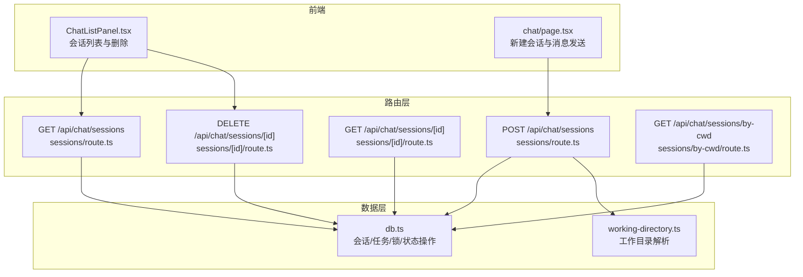
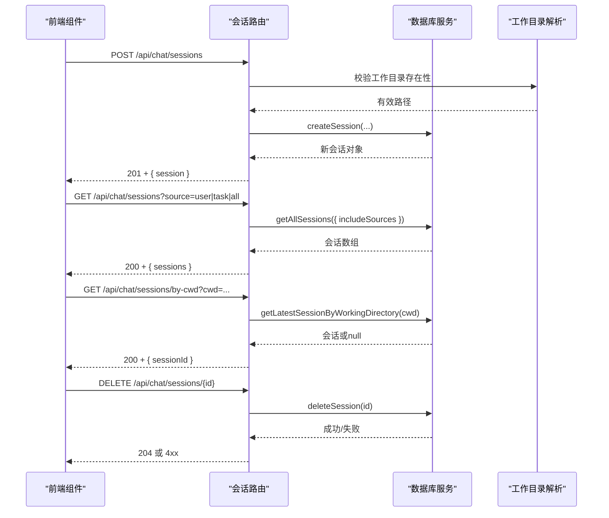
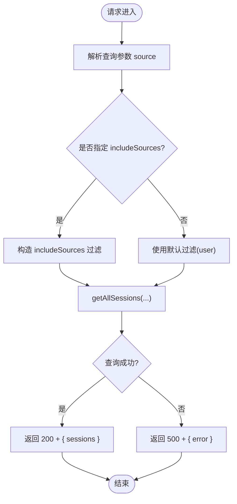
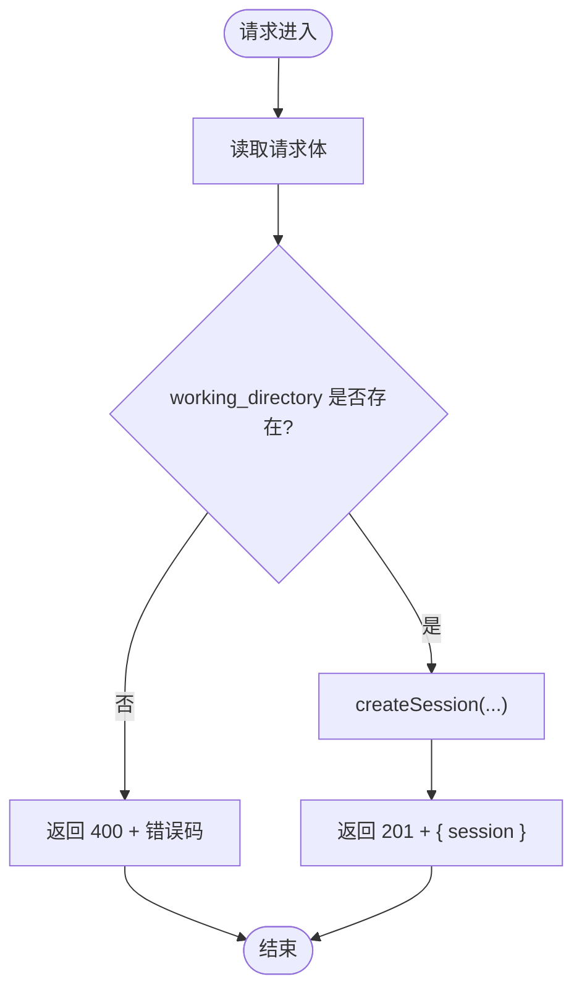
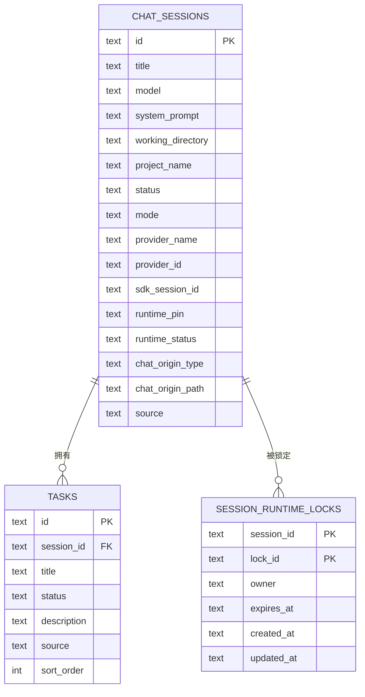
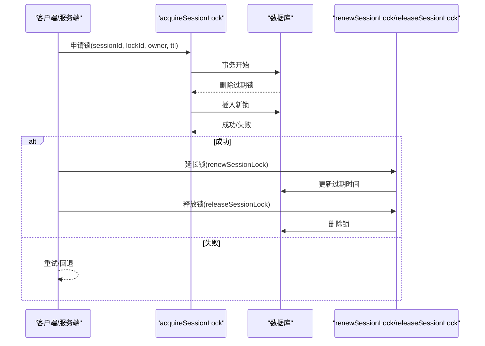
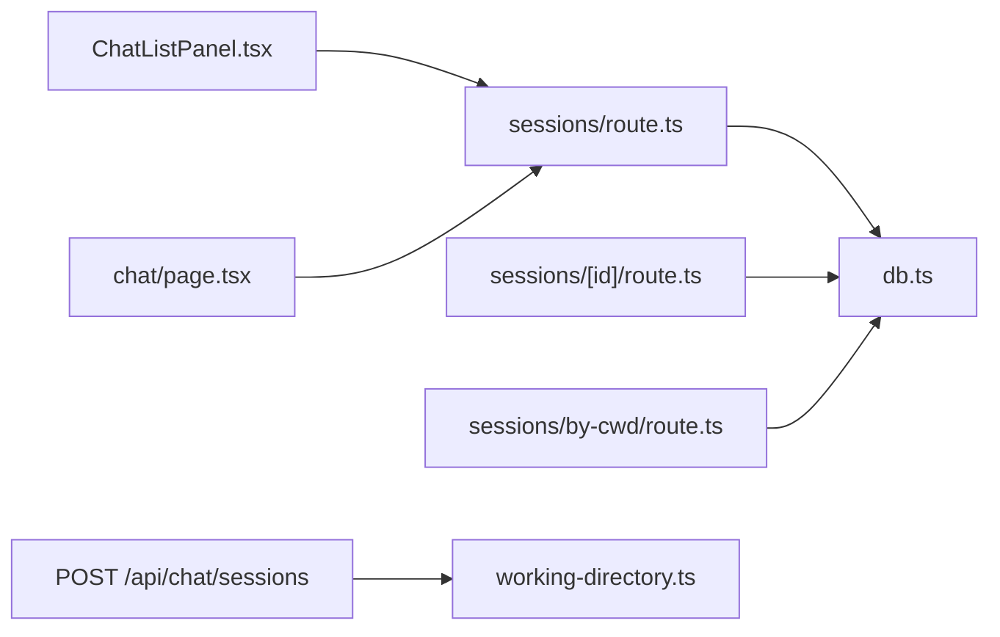

# 会话管理

<cite>
**本文档引用的文件**
- [src/app/api/chat/sessions/route.ts](file://src/app/api/chat/sessions/route.ts)
- [src/app/api/chat/sessions/[id]/route.ts](file://src/app/api/chat/sessions/[id]/route.ts)
- [src/app/api/chat/sessions/by-cwd/route.ts](file://src/app/api/chat/sessions/by-cwd/route.ts)
- [src/lib/db.ts](file://src/lib/db.ts)
- [src/lib/working-directory.ts](file://src/lib/working-directory.ts)
- [src/lib/stream-session-manager.ts](file://src/lib/stream-session-manager.ts)
- [src/components/layout/ChatListPanel.tsx](file://src/components/layout/ChatListPanel.tsx)
- [src/types/index.ts](file://src/types/index.ts)
- [src/app/chat/page.tsx](file://src/app/chat/page.tsx)
</cite>

## 目录
1. [简介](#简介)
2. [项目结构](#项目结构)
3. [核心组件](#核心组件)
4. [架构总览](#架构总览)
5. [详细组件分析](#详细组件分析)
6. [依赖关系分析](#依赖关系分析)
7. [性能考量](#性能考量)
8. [故障排查指南](#故障排查指南)
9. [结论](#结论)
10. [附录](#附录)

## 简介
本文件系统性梳理“会话管理”API的设计与实现，覆盖以下接口规范与运行机制：
- 获取会话列表：GET /api/chat/sessions
- 创建会话：POST /api/chat/sessions
- 获取特定会话详情：GET /api/chat/sessions/[id]
- 删除会话：DELETE /api/chat/sessions/[id]
- 按工作目录查找会话：GET /api/chat/sessions/by-cwd

重点说明会话状态管理、上下文保持、持久化机制、工作目录关联、会话元数据管理以及并发访问控制（会话运行时锁）。并提供生命周期管理最佳实践与性能优化建议。

## 项目结构
围绕会话管理的核心文件组织如下：
- 路由层：Next.js App Router 路由处理器，负责请求解析、参数校验与响应封装
- 数据层：SQLite 封装与迁移逻辑，提供会话 CRUD、任务、运行时锁与状态维护
- 工作目录解析：候选路径解析与有效性校验
- 流式会话管理：会话流订阅、快照与强制中断
- 前端集成：聊天页与侧边面板对会话 API 的调用与联动

图表来源
- [src/app/api/chat/sessions/route.ts:1-75](file://src/app/api/chat/sessions/route.ts#L1-L75)
- [src/app/api/chat/sessions/[id]/route.ts](file://src/app/api/chat/sessions/[id]/route.ts)
- [src/app/api/chat/sessions/by-cwd/route.ts:1-15](file://src/app/api/chat/sessions/by-cwd/route.ts#L1-L15)
- [src/lib/db.ts:125-1717](file://src/lib/db.ts#L125-L1717)
- [src/lib/working-directory.ts:1-53](file://src/lib/working-directory.ts#L1-L53)
- [src/components/layout/ChatListPanel.tsx:276-301](file://src/components/layout/ChatListPanel.tsx#L276-L301)
- [src/app/chat/page.tsx:810-830](file://src/app/chat/page.tsx#L810-L830)

章节来源
- [src/app/api/chat/sessions/route.ts:1-75](file://src/app/api/chat/sessions/route.ts#L1-L75)
- [src/app/api/chat/sessions/by-cwd/route.ts:1-15](file://src/app/api/chat/sessions/by-cwd/route.ts#L1-L15)
- [src/lib/db.ts:125-1717](file://src/lib/db.ts#L125-L1717)
- [src/lib/working-directory.ts:1-53](file://src/lib/working-directory.ts#L1-L53)
- [src/components/layout/ChatListPanel.tsx:276-301](file://src/components/layout/ChatListPanel.tsx#L276-L301)
- [src/app/chat/page.tsx:810-830](file://src/app/chat/page.tsx#L810-L830)

## 核心组件
- 会话路由处理器：统一处理会话的查询、创建、删除与按工作目录检索
- 数据库服务：提供会话 CRUD、任务管理、运行时状态与锁管理
- 工作目录解析器：从多源候选中解析有效的工作目录
- 流式会话管理器：维护会话流订阅、快照与超时中断
- 前端组件：会话列表面板与聊天页对会话 API 的调用

章节来源
- [src/app/api/chat/sessions/route.ts:1-75](file://src/app/api/chat/sessions/route.ts#L1-L75)
- [src/lib/db.ts:125-1717](file://src/lib/db.ts#L125-L1717)
- [src/lib/working-directory.ts:1-53](file://src/lib/working-directory.ts#L1-L53)
- [src/lib/stream-session-manager.ts:953-997](file://src/lib/stream-session-manager.ts#L953-L997)
- [src/components/layout/ChatListPanel.tsx:276-301](file://src/components/layout/ChatListPanel.tsx#L276-L301)
- [src/app/chat/page.tsx:810-830](file://src/app/chat/page.tsx#L810-L830)

## 架构总览
会话管理采用“路由层-数据层-前端组件”的分层设计：
- 路由层负责输入校验、参数解析与错误处理
- 数据层封装 SQLite 操作、迁移与事务，保证一致性
- 前端通过标准 HTTP 调用与会话 API 交互，配合事件与轮询保持 UI 与后端状态同步

图表来源
- [src/app/api/chat/sessions/route.ts:1-75](file://src/app/api/chat/sessions/route.ts#L1-L75)
- [src/app/api/chat/sessions/by-cwd/route.ts:1-15](file://src/app/api/chat/sessions/by-cwd/route.ts#L1-L15)
- [src/lib/db.ts:125-1717](file://src/lib/db.ts#L125-L1717)
- [src/lib/working-directory.ts:1-53](file://src/lib/working-directory.ts#L1-L53)

## 详细组件分析

### 会话列表查询 GET /api/chat/sessions
- 查询参数
  - source: 可选，'user' | 'task' | 'all'。默认为 'user'，用于区分用户会话与任务执行会话
- 处理流程
  - 解析 source 参数并构造过滤条件
  - 调用数据库服务获取会话列表
  - 统一返回格式 { sessions: Session[] }
- 错误处理
  - 服务器内部错误返回 500 与错误信息

图表来源
- [src/app/api/chat/sessions/route.ts:6-35](file://src/app/api/chat/sessions/route.ts#L6-L35)

章节来源
- [src/app/api/chat/sessions/route.ts:6-35](file://src/app/api/chat/sessions/route.ts#L6-L35)

### 会话创建 POST /api/chat/sessions
- 请求体 CreateSessionRequest
  - working_directory: 必填，且必须存在于磁盘
  - title、model、system_prompt、mode、provider_id、permission_profile 等可选
- 处理流程
  - 校验 working_directory 存在性
  - 调用 createSession(...) 创建会话
  - 返回 201 与 { session }
- 错误处理
  - 缺少目录：400 + MISSING_DIRECTORY
  - 目录不存在：400 + INVALID_DIRECTORY
  - 其他异常：500 + 错误信息

图表来源
- [src/app/api/chat/sessions/route.ts:37-75](file://src/app/api/chat/sessions/route.ts#L37-L75)
- [src/lib/working-directory.ts:27-37](file://src/lib/working-directory.ts#L27-L37)

章节来源
- [src/app/api/chat/sessions/route.ts:37-75](file://src/app/api/chat/sessions/route.ts#L37-L75)
- [src/lib/working-directory.ts:27-37](file://src/lib/working-directory.ts#L27-L37)

### 特定会话详情 GET /api/chat/sessions/[id]
- 功能：根据会话 ID 返回会话详情
- 数据来源：数据库服务
- 返回：200 + { session }；若不存在返回 404（由数据库层决定）

章节来源
- [src/app/api/chat/sessions/[id]/route.ts](file://src/app/api/chat/sessions/[id]/route.ts)

### 会话删除 DELETE /api/chat/sessions/[id]
- 功能：删除指定会话
- 数据来源：数据库服务
- 返回：204 无内容；若不存在返回 404
- 前端联动：删除后从列表移除并重定向至 /chat

章节来源
- [src/app/api/chat/sessions/[id]/route.ts](file://src/app/api/chat/sessions/[id]/route.ts)
- [src/components/layout/ChatListPanel.tsx:276-301](file://src/components/layout/ChatListPanel.tsx#L276-L301)

### 按工作目录查找会话 GET /api/chat/sessions/by-cwd
- 查询参数
  - cwd: 必填，工作目录绝对路径
- 处理流程
  - 调用 getLatestSessionByWorkingDirectory(cwd)
  - 返回 { sessionId: string | null }
- 用途：在打开工作树或切换工作目录时快速定位最近会话

章节来源
- [src/app/api/chat/sessions/by-cwd/route.ts:1-15](file://src/app/api/chat/sessions/by-cwd/route.ts#L1-L15)

### 会话状态管理与持久化
- 数据表与列
  - chat_sessions：会话主表，包含 model、system_prompt、sdk_session_id、project_name、status、mode、provider_name、provider_id、runtime_pin、runtime_status、chat_origin_type、chat_origin_path、source 等
  - tasks：任务表，外键关联 chat_sessions
  - session_runtime_locks：会话运行时锁表
- 关键操作
  - 更新会话状态：updateSessionStatus
  - 设置运行时状态：setSessionRuntimeStatus
  - 会话锁：acquireSessionLock、renewSessionLock、releaseSessionLock
  - 任务：getTasksBySession、createTask、updateTask

图表来源
- [src/lib/db.ts:125-1717](file://src/lib/db.ts#L125-L1717)

章节来源
- [src/lib/db.ts:125-1717](file://src/lib/db.ts#L125-L1717)

### 上下文保持与工作目录关联
- 工作目录来源解析
  - 支持多源候选：requested、binding、session_sdk_cwd、session_working_directory、setting、home、process
  - 优先选择存在的有效目录
- 会话与工作目录
  - createSession 时写入 working_directory
  - getLatestSessionByWorkingDirectory 提供按目录快速检索
- 任务继承
  - 任务执行时可从会话继承 working_directory、provider_id、model、permission_profile 等

章节来源
- [src/lib/working-directory.ts:1-53](file://src/lib/working-directory.ts#L1-L53)
- [src/lib/db.ts:125-1717](file://src/lib/db.ts#L125-L1717)
- [src/lib/agent-task-runner.ts:128-162](file://src/lib/agent-task-runner.ts#L128-L162)

### 并发访问控制（会话运行时锁）
- 设计目标：避免多个进程/线程同时写入同一会话导致冲突
- 锁机制
  - acquireSessionLock：尝试插入锁，PK 冲突表示已被占用
  - renewSessionLock：延长锁有效期
  - releaseSessionLock：释放锁
  - 事务内清理过期锁，保证一致性
- 使用场景：在执行长耗时操作（如生成/保存媒体、批量导入）时获取会话锁

图表来源
- [src/lib/db.ts:2835-2912](file://src/lib/db.ts#L2835-L2912)

章节来源
- [src/lib/db.ts:2835-2912](file://src/lib/db.ts#L2835-L2912)

### 会话生命周期管理最佳实践
- 创建
  - 必须提供有效的 working_directory
  - 合理设置 mode、provider_id、permission_profile
  - 对于任务驱动的会话，使用 source='task' 并在任务页面单独展示
- 查询
  - 列表查询使用 source=user|task|all 控制可见范围
  - 定期轮询或监听事件刷新 UI
- 更新
  - 通过 PATCH 接口更新 runtime_pin、权限等，避免跨运行时的 SDK 会话失效
- 删除
  - 删除前确认不再需要历史上下文
  - 前端删除后应同步更新 UI 并处理拆分视图

章节来源
- [src/app/api/chat/sessions/route.ts:6-35](file://src/app/api/chat/sessions/route.ts#L6-L35)
- [src/app/api/chat/sessions/[id]/route.ts](file://src/app/api/chat/sessions/[id]/route.ts)
- [src/components/layout/ChatListPanel.tsx:276-301](file://src/components/layout/ChatListPanel.tsx#L276-L301)

### 性能优化建议
- 列表查询
  - 使用 source 过滤减少扫描量
  - 对高频查询建立索引（如 working_directory、created_at）
- 创建会话
  - 预检查 working_directory 存在性，避免失败重试
  - 批量创建时合并请求以降低开销
- 流式会话
  - 合理设置超时与强制中断策略，避免悬挂连接
  - 使用订阅模式按需推送，减少广播

章节来源
- [src/lib/stream-session-manager.ts:953-997](file://src/lib/stream-session-manager.ts#L953-L997)

## 依赖关系分析
- 路由依赖数据层：所有会话操作均委托 db.ts
- 工作目录依赖文件系统：创建时进行存在性校验
- 前端依赖路由：列表面板与聊天页通过 HTTP 调用与会话 API 交互
- 事件与轮询：前端监听会话变更事件并定期轮询，保证 UI 与后端一致

图表来源
- [src/app/api/chat/sessions/route.ts:1-75](file://src/app/api/chat/sessions/route.ts#L1-L75)
- [src/app/api/chat/sessions/[id]/route.ts](file://src/app/api/chat/sessions/[id]/route.ts)
- [src/app/api/chat/sessions/by-cwd/route.ts:1-15](file://src/app/api/chat/sessions/by-cwd/route.ts#L1-L15)
- [src/lib/db.ts:125-1717](file://src/lib/db.ts#L125-L1717)
- [src/lib/working-directory.ts:1-53](file://src/lib/working-directory.ts#L1-L53)
- [src/components/layout/ChatListPanel.tsx:276-301](file://src/components/layout/ChatListPanel.tsx#L276-L301)
- [src/app/chat/page.tsx:810-830](file://src/app/chat/page.tsx#L810-L830)

章节来源
- [src/app/api/chat/sessions/route.ts:1-75](file://src/app/api/chat/sessions/route.ts#L1-L75)
- [src/app/api/chat/sessions/[id]/route.ts](file://src/app/api/chat/sessions/[id]/route.ts)
- [src/app/api/chat/sessions/by-cwd/route.ts:1-15](file://src/app/api/chat/sessions/by-cwd/route.ts#L1-L15)
- [src/lib/db.ts:125-1717](file://src/lib/db.ts#L125-L1717)
- [src/lib/working-directory.ts:1-53](file://src/lib/working-directory.ts#L1-L53)
- [src/components/layout/ChatListPanel.tsx:276-301](file://src/components/layout/ChatListPanel.tsx#L276-L301)
- [src/app/chat/page.tsx:810-830](file://src/app/chat/page.tsx#L810-L830)

## 性能考量
- I/O 优化
  - 工作目录存在性检查在创建阶段集中处理，避免重复 I/O
  - 使用事务批量写入，减少磁盘同步次数
- 查询优化
  - 为常用过滤字段建立索引，降低全表扫描
  - 分页与限制结果集大小，避免一次性加载过多会话
- 流式处理
  - 为流式会话设置合理的超时与中断策略，防止资源泄漏
  - 按需订阅，避免不必要的广播

## 故障排查指南
- 创建失败
  - 确认 working_directory 存在且可访问
  - 检查服务端日志中的错误堆栈
- 列表为空
  - 检查 source 参数是否正确
  - 确认会话状态与可见性规则
- 删除无效
  - 确认会话 ID 正确
  - 检查前端是否正确处理响应并更新 UI
- 并发冲突
  - 检查会话锁是否正确获取/释放
  - 避免长时间持有锁

章节来源
- [src/app/api/chat/sessions/route.ts:30-34](file://src/app/api/chat/sessions/route.ts#L30-L34)
- [src/app/api/chat/sessions/[id]/route.ts](file://src/app/api/chat/sessions/[id]/route.ts)
- [src/lib/db.ts:2835-2912](file://src/lib/db.ts#L2835-L2912)

## 结论
会话管理 API 通过清晰的路由职责、完善的数据库模型与并发控制，提供了稳定可靠的会话生命周期支持。结合工作目录解析与运行时锁机制，能够满足多场景下的上下文保持与并发安全需求。建议在生产环境中配合索引优化、流式超时策略与事件轮询机制，持续提升用户体验与系统稳定性。

## 附录
- 类型定义参考
  - CreateSessionRequest、SessionsResponse、SessionResponse
- 前端集成要点
  - 新建会话后及时刷新列表
  - 删除会话后处理拆分视图与路由跳转

章节来源
- [src/types/index.ts:713-827](file://src/types/index.ts#L713-L827)
- [src/app/chat/page.tsx:810-830](file://src/app/chat/page.tsx#L810-L830)