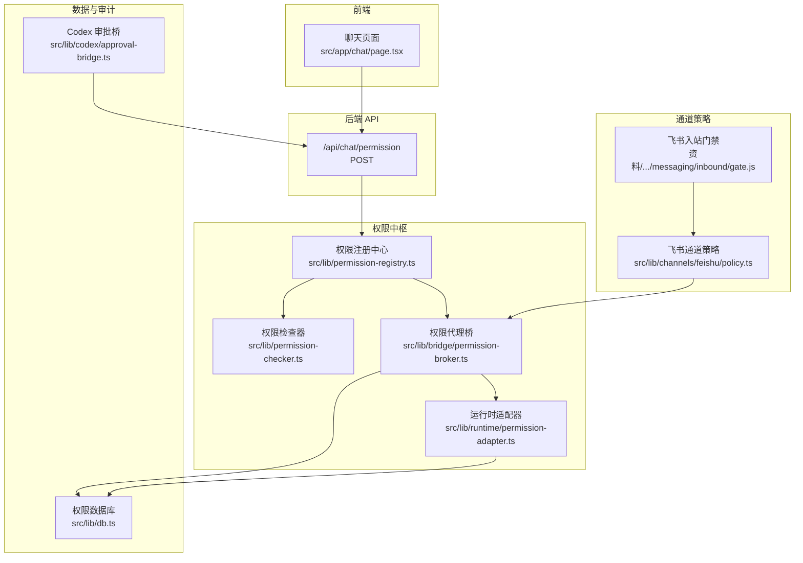
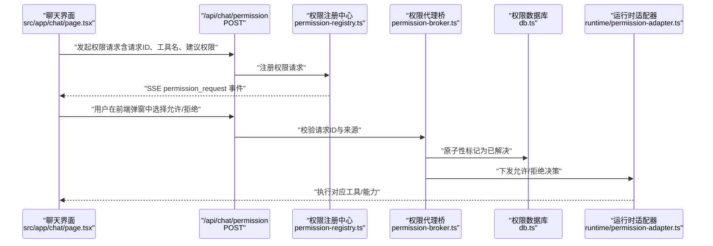
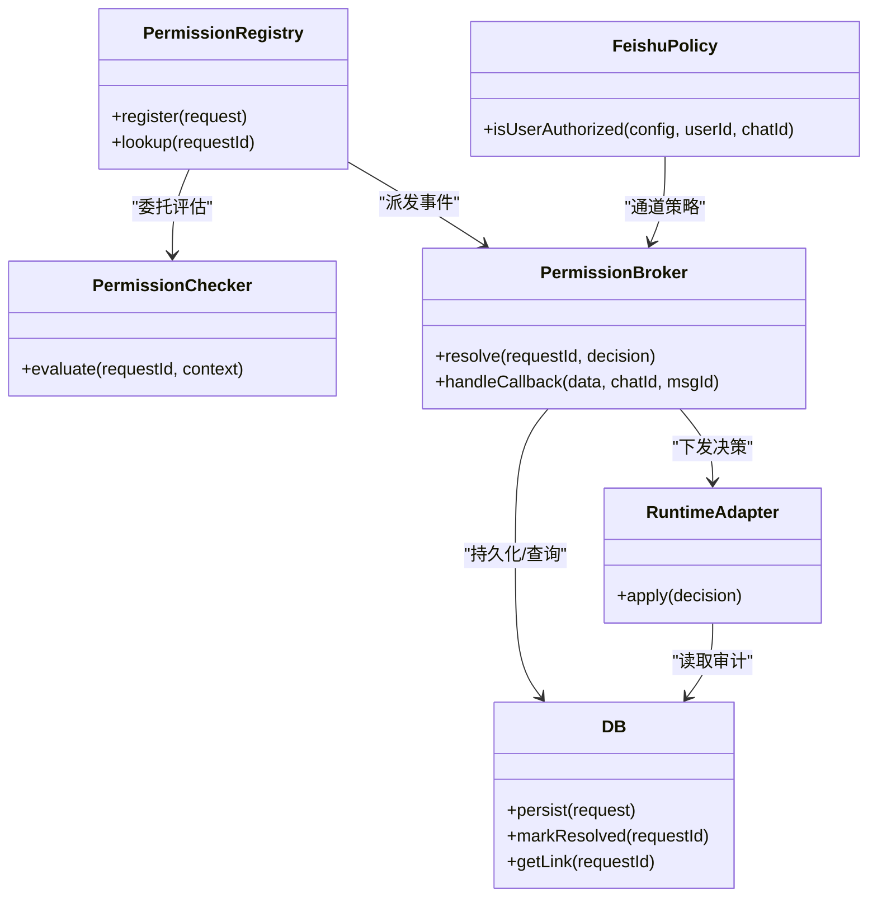

# 权限控制

<cite>
**本文引用的文件**
- [src/lib/permission-checker.ts](file://src/lib/permission-checker.ts)
- [src/lib/permission-registry.ts](file://src/lib/permission-registry.ts)
- [src/lib/bridge/permission-broker.ts](file://src/lib/bridge/permission-broker.ts)
- [src/lib/runtime/permission-adapter.ts](file://src/lib/runtime/permission-adapter.ts)
- [src/lib/db.ts](file://src/lib/db.ts)
- [src/lib/codex/approval-bridge.ts](file://src/lib/codex/approval-bridge.ts)
- [src/lib/stream-session-manager.ts](file://src/lib/stream-session-manager.ts)
- [src/app/chat/page.tsx](file://src/app/chat/page.tsx)
- [src/lib/channels/feishu/policy.ts](file://src/lib/channels/feishu/policy.ts)
- [docs/research/permission-system-decoupling.md](file://docs/research/permission-system-decoupling.md)
- [docs/exec-plans/active/agent-runtime-abstraction-revision.md](file://docs/exec-plans/active/agent-runtime-abstraction-revision.md)
- [资料/feishu-openclaw-plugin/package/src/messaging/inbound/gate.js](file://资料/feishu-openclaw-plugin/package/src/messaging/inbound/gate.js)
- [资料/feishu-openclaw-plugin/package/src/core/tool-scopes.js](file://资料/feishu-openclaw-plugin/package/src/core/tool-scopes.js)
- [apps/site/content/docs/en/bridge/feishu.mdx](file://apps/site/content/docs/en/bridge/feishu.mdx)
</cite>

## 目录
1. [简介](#简介)
2. [项目结构](#项目结构)
3. [核心组件](#核心组件)
4. [架构总览](#架构总览)
5. [详细组件分析](#详细组件分析)
6. [依赖关系分析](#依赖关系分析)
7. [性能考量](#性能考量)
8. [故障排查指南](#故障排查指南)
9. [结论](#结论)
10. [附录](#附录)

## 简介
本文件面向“聊天功能访问权限管理与安全控制”的 API 文档，聚焦于 /api/chat/permission 端点的实现机制，涵盖权限级别定义、角色权限矩阵、动态权限评估算法、敏感内容过滤、访问日志与审计、以及与系统其他模块的权限集成与统一认证机制。文档同时提供权限配置示例、安全最佳实践与常见问题的解决方案。

## 项目结构
权限控制体系围绕“权限注册与评估”“权限请求与审批”“通道级策略”“数据库持久化与审计”四个维度展开，并通过统一的 API 端点完成前后端协作闭环。

图表来源
- [src/app/chat/page.tsx:706](file://src/app/chat/page.tsx#L706)
- [src/lib/permission-registry.ts:1-200](file://src/lib/permission-registry.ts#L1-L200)
- [src/lib/permission-checker.ts:1-200](file://src/lib/permission-checker.ts#L1-L200)
- [src/lib/bridge/permission-broker.ts:360-395](file://src/lib/bridge/permission-broker.ts#L360-L395)
- [src/lib/runtime/permission-adapter.ts:1-200](file://src/lib/runtime/permission-adapter.ts#L1-L200)
- [src/lib/db.ts:3300-3339](file://src/lib/db.ts#L3300-L3339)
- [src/lib/codex/approval-bridge.ts:16-225](file://src/lib/codex/approval-bridge.ts#L16-L225)
- [src/lib/channels/feishu/policy.ts:1-50](file://src/lib/channels/feishu/policy.ts#L1-L50)
- [资料/feishu-openclaw-plugin/package/src/messaging/inbound/gate.js:108-136](file://资料/feishu-openclaw-plugin/package/src/messaging/inbound/gate.js#L108-L136)

章节来源
- [src/lib/permission-registry.ts:1-200](file://src/lib/permission-registry.ts#L1-L200)
- [src/lib/permission-checker.ts:1-200](file://src/lib/permission-checker.ts#L1-L200)
- [src/lib/bridge/permission-broker.ts:360-395](file://src/lib/bridge/permission-broker.ts#L360-L395)
- [src/lib/runtime/permission-adapter.ts:1-200](file://src/lib/runtime/permission-adapter.ts#L1-L200)
- [src/lib/db.ts:3300-3339](file://src/lib/db.ts#L3300-L3339)
- [src/lib/codex/approval-bridge.ts:16-225](file://src/lib/codex/approval-bridge.ts#L16-L225)
- [src/lib/channels/feishu/policy.ts:1-50](file://src/lib/channels/feishu/policy.ts#L1-L50)
- [资料/feishu-openclaw-plugin/package/src/messaging/inbound/gate.js:108-136](file://资料/feishu-openclaw-plugin/package/src/messaging/inbound/gate.js#L108-L136)

## 核心组件
- 权限注册中心：负责接收权限请求、生成请求 ID、维护等待队列与事件分发。
- 权限检查器：对工具/能力进行动态评估，结合角色权限矩阵与上下文信息决定是否允许。
- 权限代理桥：协调前端弹窗、SSE 事件、后端审批与运行时执行，处理幂等与去重。
- 运行时适配器：将权限决策映射到具体运行时（如 Codex、MCP）的执行层。
- 数据与审计：持久化权限请求、通道关联、决策结果与时间戳，支持审计与回放。
- 通道策略：针对不同通信渠道（如飞书）实施访问控制与白名单/黑名单策略。
- 统一认证与审批桥：与外部系统（如 Codex）对接，确保审批一致性与幂等性。

章节来源
- [src/lib/permission-registry.ts:1-200](file://src/lib/permission-registry.ts#L1-L200)
- [src/lib/permission-checker.ts:1-200](file://src/lib/permission-checker.ts#L1-L200)
- [src/lib/bridge/permission-broker.ts:360-395](file://src/lib/bridge/permission-broker.ts#L360-L395)
- [src/lib/runtime/permission-adapter.ts:1-200](file://src/lib/runtime/permission-adapter.ts#L1-L200)
- [src/lib/db.ts:3300-3339](file://src/lib/db.ts#L3300-L3339)
- [src/lib/codex/approval-bridge.ts:16-225](file://src/lib/codex/approval-bridge.ts#L16-L225)

## 架构总览
下图展示从前端触发权限请求到后端审批、再到运行时执行的整体流程，以及与通道策略、数据库与审计的交互。

图表来源
- [src/app/chat/page.tsx:706](file://src/app/chat/page.tsx#L706)
- [src/lib/permission-registry.ts:1-200](file://src/lib/permission-registry.ts#L1-L200)
- [src/lib/bridge/permission-broker.ts:360-395](file://src/lib/bridge/permission-broker.ts#L360-L395)
- [src/lib/db.ts:3300-3339](file://src/lib/db.ts#L3300-L3339)
- [src/lib/runtime/permission-adapter.ts:1-200](file://src/lib/runtime/permission-adapter.ts#L1-L200)

## 详细组件分析

### /api/chat/permission 端点
- 请求方法与路径：POST /api/chat/permission
- 请求体字段
  - permissionRequestId：权限请求唯一标识（字符串）
  - decision.behavior：行为类型，允许为 "allow"，拒绝为 "deny"
  - decision.message：拒绝原因（当 behavior 为 "deny" 时可选）
  - decision.updatedPermissions：当行为为 "allow" 且存在建议权限时，可返回更新后的权限集合
  - decision.updatedInput：当行为为 "allow_session" 时，可返回更新后的输入（如问答答案）
- 响应
  - 成功：200 OK，返回已解析的权限请求摘要
  - 幂等错误：409 ALREADY_RESOLVED（请求已被处理）
  - 参数错误：400 BAD REQUEST
  - 未找到：404 NOT FOUND
- 审计与日志
  - 记录请求 ID、来源渠道、聊天 ID、消息 ID、工具名、决策者、决策时间、决策结果
  - 支持回放与重放（基于存储的决策）

章节来源
- [docs/research/permission-system-decoupling.md:38-73](file://docs/research/permission-system-decoupling.md#L38-L73)
- [docs/exec-plans/active/agent-runtime-abstraction-revision.md:175-204](file://docs/exec-plans/active/agent-runtime-abstraction-revision.md#L175-L204)
- [src/lib/db.ts:3300-3339](file://src/lib/db.ts#L3300-L3339)

### 权限级别与角色权限矩阵
- 权限级别
  - 允许（allow）：直接执行工具/能力
  - 拒绝（deny）：阻止执行
  - 允许会话（allow_session）：在当前会话内临时授权，可附带 updatedInput
  - 更新权限（updatedPermissions）：在允许后调整后续权限集合
- 角色权限矩阵
  - 基于用户角色、工具类别、通道类型、聊天上下文（群聊/私聊）构建布尔判定
  - 动态评估：结合实时上下文（如是否为管理员、是否在白名单、是否为敏感工具）进行判定
- 动态权限评估算法
  - 输入：请求 ID、工具名、建议权限、上下文（渠道、聊天 ID、消息 ID、用户 ID）
  - 步骤：
    1) 校验请求 ID 是否存在且未被解决
    2) 解析通道策略（如飞书 DM/群组策略）
    3) 查询角色与上下文权限
    4) 敏感工具检测（如以用户身份发送消息）
    5) 生成最终决策（allow/allow_session/deny），必要时附带 updatedPermissions 或 updatedInput
  - 输出：决策行为与附加信息

章节来源
- [src/lib/permission-checker.ts:1-200](file://src/lib/permission-checker.ts#L1-L200)
- [src/lib/channels/feishu/policy.ts:1-50](file://src/lib/channels/feishu/policy.ts#L1-L50)
- [资料/feishu-openclaw-plugin/package/src/core/tool-scopes.js:493-512](file://资料/feishu-openclaw-plugin/package/src/core/tool-scopes.js#L493-L512)

### 通道级访问控制（以飞书为例）
- DM（私聊）策略
  - disabled：禁止
  - open：允许来自 allowFrom 列表（支持通配符 "*" 或特定用户 ID）
  - allowlist：仅允许 allowFrom 中的用户
  - pairing：配对模式（由其他机制处理）
- 群组（chatId 以 oc_ 开头）策略
  - disabled：禁止
  - allowlist：仅允许 groupAllowFrom 中的群组
  - open：允许
- 入站门禁（Gate）
  - 支持 per-group 配置覆盖全局策略
  - 兼容旧版 chat_id 白名单（legacyChatIds）
  - 日志记录拒绝原因（如 group_not_allowed、group_disabled）

章节来源
- [src/lib/channels/feishu/policy.ts:1-50](file://src/lib/channels/feishu/policy.ts#L1-L50)
- [资料/feishu-openclaw-plugin/package/src/messaging/inbound/gate.js:108-136](file://资料/feishu-openclaw-plugin/package/src/messaging/inbound/gate.js#L108-L136)
- [apps/site/content/docs/en/bridge/feishu.mdx:36-66](file://apps/site/content/docs/en/bridge/feishu.mdx#L36-L66)

### 前端审批与 API 回调
- 前端触发：聊天界面在需要权限时发起 /api/chat/permission 请求
- SSE 事件：permission_request 事件携带请求详情，前端弹窗展示
- 回调处理：用户选择后，前端调用 /api/chat/permission 提交决策
- 幂等与去重：后端通过原子性写入防止重复解决同一请求

章节来源
- [docs/exec-plans/active/agent-runtime-abstraction-revision.md:175-204](file://docs/exec-plans/active/agent-runtime-abstraction-revision.md#L175-L204)
- [src/app/chat/page.tsx:706](file://src/app/chat/page.tsx#L706)
- [src/lib/bridge/permission-broker.ts:360-395](file://src/lib/bridge/permission-broker.ts#L360-L395)

### 数据持久化与审计
- 表结构要点（简化）
  - 权限请求表：请求 ID、渠道类型、聊天 ID、消息 ID、工具名、建议权限、创建时间、是否已解决
  - 通道权限链接表：请求 ID、通道类型、聊天 ID、消息 ID、工具名、建议权限、是否已解决、创建时间
- 审计字段
  - 决策者（用户/系统）、决策时间、决策结果、拒绝原因、updatedPermissions/updatedInput
- 原子性与一致性
  - 通过“已解决标志位”在 WHERE 子句中进行 CAS，避免竞态

章节来源
- [src/lib/db.ts:3300-3339](file://src/lib/db.ts#L3300-L3339)

### 与系统其他模块的集成
- Codex 审批桥：在 Codex 侧通过 approval-bridge 协调 /api/chat/permission 的幂等性与回放
- 运行时适配器：将权限决策转换为运行时可执行的指令
- 流式会话管理：在流式输出过程中，根据权限决策更新会话快照并提交 /api/chat/permission

章节来源
- [src/lib/codex/approval-bridge.ts:16-225](file://src/lib/codex/approval-bridge.ts#L16-L225)
- [src/lib/runtime/permission-adapter.ts:1-200](file://src/lib/runtime/permission-adapter.ts#L1-L200)
- [src/lib/stream-session-manager.ts:1036-1082](file://src/lib/stream-session-manager.ts#L1036-L1082)

## 依赖关系分析

图表来源
- [src/lib/permission-registry.ts:1-200](file://src/lib/permission-registry.ts#L1-L200)
- [src/lib/permission-checker.ts:1-200](file://src/lib/permission-checker.ts#L1-L200)
- [src/lib/bridge/permission-broker.ts:360-395](file://src/lib/bridge/permission-broker.ts#L360-L395)
- [src/lib/runtime/permission-adapter.ts:1-200](file://src/lib/runtime/permission-adapter.ts#L1-L200)
- [src/lib/db.ts:3300-3339](file://src/lib/db.ts#L3300-L3339)
- [src/lib/channels/feishu/policy.ts:1-50](file://src/lib/channels/feishu/policy.ts#L1-L50)

## 性能考量
- 原子性写入：使用 CAS 防止重复解决，减少锁竞争与回滚成本
- 缓存与去重：在内存中维护等待队列与去重表，降低数据库压力
- 异步事件：SSE 事件与 API 回调解耦，提升用户体验与吞吐
- 通道策略预判：在进入运行时前进行通道策略快速过滤，减少无效请求

## 故障排查指南
- 409 ALREADY_RESOLVED
  - 现象：同一请求被重复提交
  - 处理：确认前端幂等逻辑与后端 CAS 实现一致；查看数据库已解决标志位
- 拒绝原因
  - 群组未允许：检查 groupPolicy 与 groupAllowFrom
  - 发送者不在白名单：检查 allowFrom 与用户 ID
  - 敏感工具：确认是否命中敏感权限清单
- 审计与回放
  - 通过数据库审计记录定位决策时间线与决策者
  - 对已解决请求进行回放测试，验证运行时适配器行为

章节来源
- [资料/feishu-openclaw-plugin/package/src/core/tool-scopes.js:493-512](file://资料/feishu-openclaw-plugin/package/src/core/tool-scopes.js#L493-L512)
- [资料/feishu-openclaw-plugin/package/src/messaging/inbound/gate.js:108-136](file://资料/feishu-openclaw-plugin/package/src/messaging/inbound/gate.js#L108-L136)
- [src/lib/db.ts:3300-3339](file://src/lib/db.ts#L3300-L3339)

## 结论
本权限控制体系通过“注册—评估—审批—执行—审计”的闭环，实现了跨通道、跨运行时的一致性权限管理。/api/chat/permission 端点作为统一入口，配合通道策略、敏感工具过滤与审计日志，确保了安全性与可追溯性。建议在生产环境中启用严格的通道白名单、最小权限原则与定期审计。

## 附录

### 权限配置示例
- 飞书 DM 策略
  - open：允许来自 allowFrom 列表（支持 "*" 或特定用户 ID）
  - allowlist：仅允许 allowFrom 中的用户
  - disabled：禁止
- 群组策略
  - open：允许
  - allowlist：仅允许 groupAllowFrom 中的群组
  - disabled：禁止
- 敏感权限
  - 以用户身份发送消息（高风险）需单独授权，不参与批量授权

章节来源
- [apps/site/content/docs/en/bridge/feishu.mdx:36-66](file://apps/site/content/docs/en/bridge/feishu.mdx#L36-L66)
- [资料/feishu-openclaw-plugin/package/src/core/tool-scopes.js:493-512](file://资料/feishu-openclaw-plugin/package/src/core/tool-scopes.js#L493-L512)

### 安全最佳实践
- 最小权限：默认拒绝，按需授予
- 敏感工具隔离：对高风险工具单独授权与审计
- 通道白名单：严格限制允许的群组与用户
- 幂等与去重：确保同一请求不会被重复解决
- 审计留痕：完整记录决策者、时间、原因与变更

### 常见问题与解决方案
- 重复弹窗：检查前端幂等与后端 CAS 是否一致
- 拒绝率过高：核查通道策略与敏感权限清单
- 审批延迟：优化数据库索引与事件分发链路