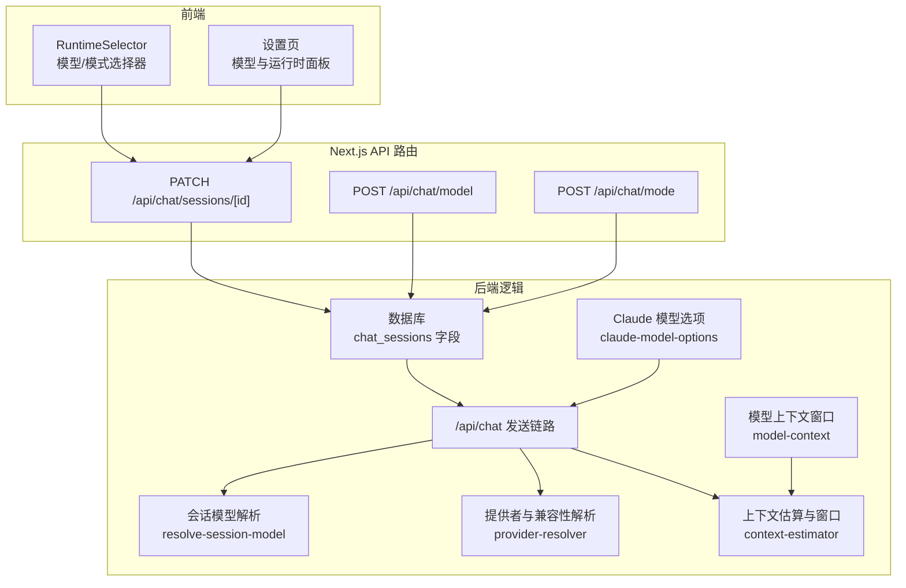
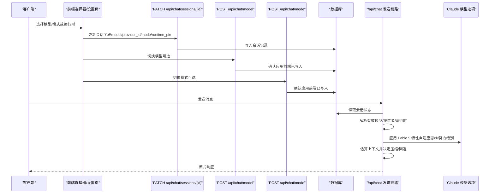
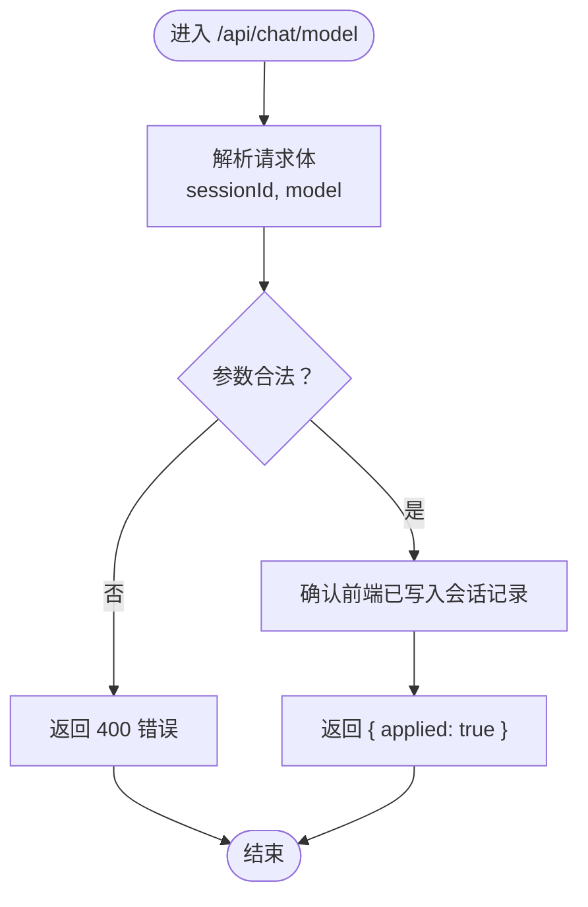
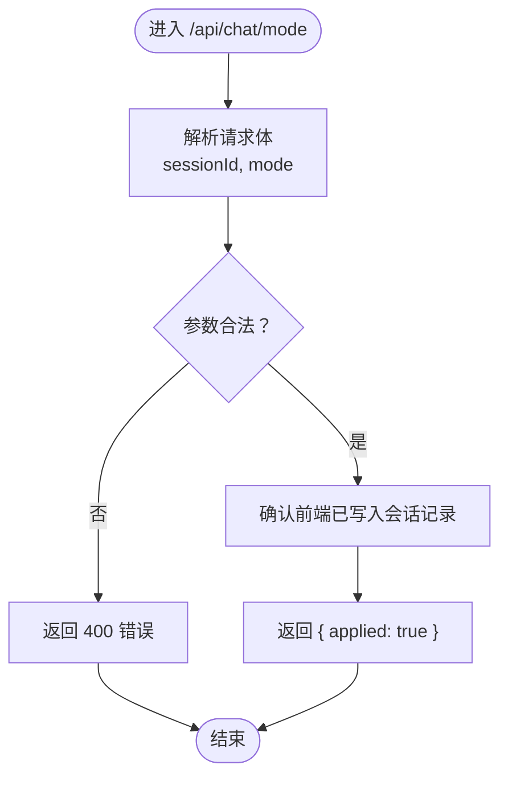
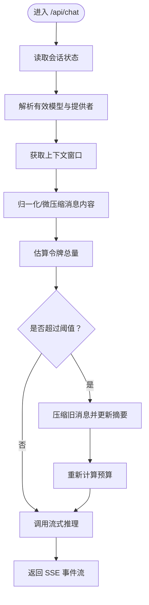
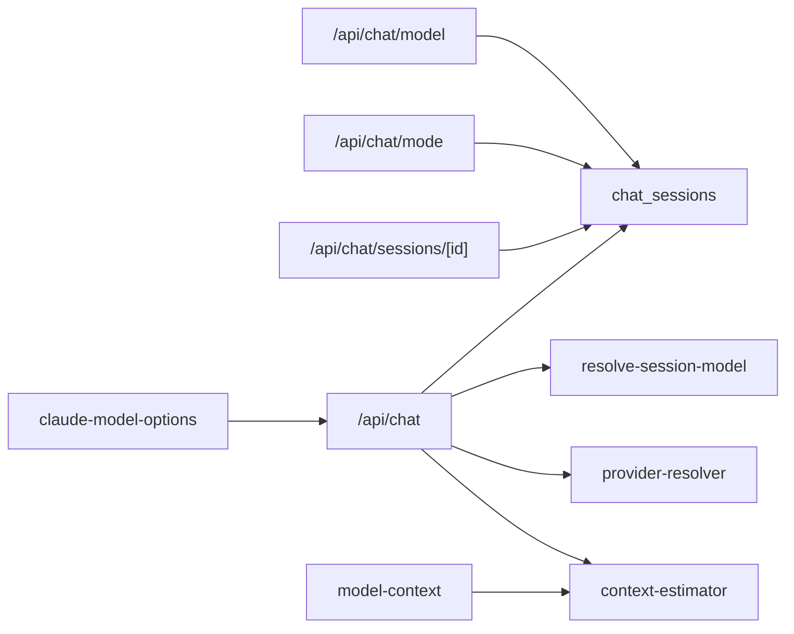

# 模型与模式控制

<cite>
**本文引用的文件**
- [src/app/api/chat/model/route.ts](file://src/app/api/chat/model/route.ts)
- [src/app/api/chat/mode/route.ts](file://src/app/api/chat/mode/route.ts)
- [src/app/api/chat/sessions/[id]/route.ts](file://src/app/api/chat/sessions/[id]/route.ts)
- [src/lib/db.ts](file://src/lib/db.ts)
- [src/app/api/chat/route.ts](file://src/app/api/chat/route.ts)
- [src/lib/resolve-session-model.ts](file://src/lib/resolve-session-model.ts)
- [src/lib/provider-resolver.ts](file://src/lib/provider-resolver.ts)
- [src/lib/context-estimator.ts](file://src/lib/context-estimator.ts)
- [src/lib/chat-runtime.ts](file://src/lib/chat-runtime.ts)
- [src/components/settings/ModelsSection.tsx](file://src/components/settings/ModelsSection.tsx)
- [src/hooks/useProviderModels.ts](file://src/hooks/useProviderModels.ts)
- [src/components/settings/RuntimePanel.tsx](file://src/components/settings/RuntimePanel.tsx)
- [src/components/chat/RuntimeSelector.tsx](file://src/components/chat/RuntimeSelector.tsx)
- [src/lib/claude-model-options.ts](file://src/lib/claude-model-options.ts)
- [src/lib/model-context.ts](file://src/lib/model-context.ts)
- [src/__tests__/unit/fable-5-model.test.ts](file://src/__tests__/unit/fable-5-model.test.ts)
- [docs/exec-plans/completed/refactor-phase-2-runtime-session.md](file://docs/exec-plans/completed/refactor-phase-2-runtime-session.md)
</cite>

## 更新摘要
**所做更改**
- 新增 Claude Fable 5 (claude-fable-5) 模型支持章节
- 更新模型能力查询与默认模型配置部分，包含 Fable 5 的特性
- 新增自适应思维模式和努力级别支持说明
- 更新上下文窗口管理和定价模式相关信息

## 目录
1. [简介](#简介)
2. [项目结构](#项目结构)
3. [核心组件](#核心组件)
4. [架构总览](#架构总览)
5. [详细组件分析](#详细组件分析)
6. [依赖分析](#依赖分析)
7. [性能考量](#性能考量)
8. [故障排查指南](#故障排查指南)
9. [结论](#结论)
10. [附录](#附录)

## 简介
本文件聚焦于"模型与模式控制"的 API 与运行机制，涵盖以下关键目标：
- 使用 POST /api/chat/model 在会话中动态切换当前使用的 AI 模型。
- 使用 POST /api/chat/mode 在会话中切换运行模式（例如聊天、思维、编码等）。
- 解释模型兼容性检查、上下文窗口限制与性能影响评估。
- 提供模型能力查询、默认模型配置与模型切换的回滚机制。
- 给出不同场景下的模型选择建议与最佳实践。

**更新** 新增对 Claude Fable 5 (claude-fable-5) 模型的支持，包括 1M 上下文窗口、新的定价模式、自适应思维模式和努力级别支持。

## 项目结构
围绕模型与模式控制的关键目录与文件如下：
- API 路由：负责接收前端请求并持久化会话状态，等待运行时在下一次循环读取。
- 会话持久化：通过数据库更新会话字段（模型、模式、运行时等）。
- 运行时解析：在发送链路中读取会话状态，结合运行时与兼容性进行解析与过滤。
- 上下文估算与窗口管理：在发送前估算令牌用量，决定是否压缩或回退。
- 设置与选择器：提供模型与运行时的选择入口，支持默认模型与回滚提示。

**图表来源**
- [src/components/chat/RuntimeSelector.tsx](file://src/components/chat/RuntimeSelector.tsx)
- [src/app/api/chat/model/route.ts](file://src/app/api/chat/model/route.ts)
- [src/app/api/chat/mode/route.ts](file://src/app/api/chat/mode/route.ts)
- [src/app/api/chat/sessions/[id]/route.ts](file://src/app/api/chat/sessions/[id]/route.ts)
- [src/lib/db.ts](file://src/lib/db.ts)
- [src/app/api/chat/route.ts](file://src/app/api/chat/route.ts)
- [src/lib/resolve-session-model.ts](file://src/lib/resolve-session-model.ts)
- [src/lib/provider-resolver.ts](file://src/lib/provider-resolver.ts)
- [src/lib/context-estimator.ts](file://src/lib/context-estimator.ts)
- [src/lib/claude-model-options.ts](file://src/lib/claude-model-options.ts)
- [src/lib/model-context.ts](file://src/lib/model-context.ts)

**章节来源**
- [src/app/api/chat/model/route.ts:1-29](file://src/app/api/chat/model/route.ts#L1-L29)
- [src/app/api/chat/mode/route.ts:1-29](file://src/app/api/chat/mode/route.ts#L1-L29)
- [src/app/api/chat/sessions/[id]/route.ts:1-L36](file://src/app/api/chat/sessions/[id]/route.ts#L1-L36)
- [src/lib/db.ts:1387-1390](file://src/lib/db.ts#L1387-L1390)

## 核心组件
- 模型切换 API：POST /api/chat/model
  - 接收参数：sessionId、model
  - 行为：前端先持久化模型到会话记录，该接口仅确认应用成功
- 模式切换 API：POST /api/chat/mode
  - 接收参数：sessionId、mode
  - 行为：前端先持久化模式到会话记录，该接口仅确认应用成功
- 会话持久化：PATCH /api/chat/sessions/[id]
  - 更新字段：model、provider_id、mode、runtime_pin、permission_profile 等
  - 当模型/提供者/运行时发生变化时，清理 SDK 会话引用以确保一致性
- 发送链路：/api/chat
  - 读取会话状态，解析有效模型与提供者
  - 计算上下文窗口与使用率，必要时压缩历史并回退
  - 选择运行时（如 Claude Code SDK 或 CodePilot Runtime）

**更新** 新增对 Claude Fable 5 模型的支持，包括自适应思维模式和努力级别配置。

**章节来源**
- [src/app/api/chat/model/route.ts:6-29](file://src/app/api/chat/model/route.ts#L6-L29)
- [src/app/api/chat/mode/route.ts:6-29](file://src/app/api/chat/mode/route.ts#L6-L29)
- [src/app/api/chat/sessions/[id]/route.ts:24-L36](file://src/app/api/chat/sessions/[id]/route.ts#L24-L36)
- [src/lib/db.ts:1387-1390](file://src/lib/db.ts#L1387-L1390)
- [src/app/api/chat/route.ts:94-125](file://src/app/api/chat/route.ts#L94-L125)

## 架构总览
模型与模式控制的端到端流程如下：

**图表来源**
- [src/components/chat/RuntimeSelector.tsx](file://src/components/chat/RuntimeSelector.tsx)
- [src/app/api/chat/sessions/[id]/route.ts](file://src/app/api/chat/sessions/[id]/route.ts#L24-L36)
- [src/app/api/chat/model/route.ts](file://src/app/api/chat/model/route.ts)
- [src/app/api/chat/mode/route.ts](file://src/app/api/chat/mode/route.ts)
- [src/app/api/chat/route.ts](file://src/app/api/chat/route.ts)
- [src/lib/claude-model-options.ts](file://src/lib/claude-model-options.ts)

## 详细组件分析

### 模型切换 API：POST /api/chat/model
- 请求体字段
  - sessionId：必需，目标会话 ID
  - model：必需，目标模型标识
- 行为说明
  - 该接口不直接操作运行时，而是确认前端已将模型写入会话记录
  - 下一次运行时循环将从会话记录读取模型，无需 SDK 会话对象参与
- 错误处理
  - 缺少必要参数时返回 400
  - 其他异常记录日志并返回失败状态

**图表来源**
- [src/app/api/chat/model/route.ts:13-29](file://src/app/api/chat/model/route.ts#L13-L29)

**章节来源**
- [src/app/api/chat/model/route.ts:6-29](file://src/app/api/chat/model/route.ts#L6-L29)

### 模式切换 API：POST /api/chat/mode
- 请求体字段
  - sessionId：必需，目标会话 ID
  - mode：必需，目标运行模式（如 code/plan/chat 等）
- 行为说明
  - 该接口不直接操作运行时，而是确认前端已将模式写入会话记录
  - 下一次运行时循环将从会话记录读取模式，传递给权限系统
- 错误处理
  - 缺少必要参数时返回 400
  - 其他异常记录日志并返回失败状态

**图表来源**
- [src/app/api/chat/mode/route.ts:13-29](file://src/app/api/chat/mode/route.ts#L13-L29)

**章节来源**
- [src/app/api/chat/mode/route.ts:6-29](file://src/app/api/chat/mode/route.ts#L6-L29)

### 会话持久化：PATCH /api/chat/sessions/[id]
- 更新字段
  - model：当前会话使用的模型
  - provider_id：当前会话使用的提供者
  - mode：当前会话的运行模式
  - runtime_pin：会话级运行时固定（空表示跟随全局）
  - permission_profile：权限配置
- 关键约束
  - 当模型/提供者/运行时发生变化时，清理 SDK 会话引用，确保后续调用使用新的运行时环境
- 返回
  - 成功返回会话对象，失败返回错误信息

**章节来源**
- [src/app/api/chat/sessions/[id]/route.ts:24-L36](file://src/app/api/chat/sessions/[id]/route.ts#L24-L36)
- [src/lib/db.ts:1387-1390](file://src/lib/db.ts#L1387-L1390)
- [docs/exec-plans/completed/refactor-phase-2-runtime-session.md:247-274](file://docs/exec-plans/completed/refactor-phase-2-runtime-session.md#L247-L274)

### 发送链路：/api/chat（模型/提供者/运行时解析与上下文管理）
- 会话状态读取
  - 读取会话的 model、provider_id、runtime_pin、mode 等字段
- 有效模型解析
  - 优先使用会话存储的模型；否则回退到全局默认模型（受限于提供者与运行时兼容性）
  - CLI 禁用且模型为环境内置模型时，进一步回退到全局默认模型（排除环境内置模型）
- 运行时解析
  - 会话级 runtime_pin 优先于全局 agent_runtime
  - 服务器侧解析运行时标签，与前端选择保持一致
- 上下文窗口与估算
  - 获取模型上下文窗口（考虑上游别名与提供者差异）
  - 归一化与微压缩消息内容，估算总令牌数
  - 计算使用率与警告状态（正常/预警/危险），必要时压缩历史并更新摘要
- 流式调用
  - 成功 resume 则忽略回退；失败则构建回退上下文并继续流式输出
  - 如发生压缩，发送上下文压缩事件

**图表来源**
- [src/app/api/chat/route.ts:94-125](file://src/app/api/chat/route.ts#L94-L125)
- [src/app/api/chat/route.ts:344-367](file://src/app/api/chat/route.ts#L344-L367)
- [src/app/api/chat/route.ts:510-533](file://src/app/api/chat/route.ts#L510-L533)
- [src/lib/context-estimator.ts:73-114](file://src/lib/context-estimator.ts#L73-L114)

**章节来源**
- [src/app/api/chat/route.ts:94-125](file://src/app/api/chat/route.ts#L94-L125)
- [src/app/api/chat/route.ts:344-367](file://src/app/api/chat/route.ts#L344-L367)
- [src/app/api/chat/route.ts:510-533](file://src/app/api/chat/route.ts#L510-L533)
- [src/lib/context-estimator.ts:73-114](file://src/lib/context-estimator.ts#L73-L114)

### 模型能力查询与默认模型配置
- 模型能力查询
  - 前端通过 /api/providers/models 查询当前运行时可用的模型列表
  - 服务器根据运行时与提供者兼容性过滤模型，返回分组与模型选项
- 默认模型配置
  - 会话优先使用已存储模型；否则使用全局默认模型（受限于提供者与运行时）
  - 本地存储的最后使用模型作为跨会话回退
  - 硬编码回退模型（如 sonnet）作为最终兜底
- 模型解析优先级
  - 1) 会话存储的模型
  - 2) 全局默认模型（需属于会话提供者）
  - 3) 会话提供者内的首个可用模型
  - 4) 全局默认模型+提供者
  - 5) 本地存储的最后使用模型
  - 6) 硬编码回退模型

**更新** 新增对 Claude Fable 5 模型的支持，包括：
- 自适应思维模式：Fable 5 采用自适应思维模式，无法关闭思考功能
- 努力级别支持：支持 low、medium、high、xhigh、max 等努力级别
- 1M 上下文窗口：默认 1M 上下文窗口，无需 1M beta 标头
- 新的定价模式：$10/$50 每百万令牌

**章节来源**
- [src/components/settings/ModelsSection.tsx:838-864](file://src/components/settings/ModelsSection.tsx#L838-L864)
- [src/lib/resolve-session-model.ts:1-41](file://src/lib/resolve-session-model.ts#L1-L41)
- [src/lib/provider-resolver.ts:1064-1092](file://src/lib/provider-resolver.ts#L1064-L1092)
- [src/hooks/useProviderModels.ts:368-391](file://src/hooks/useProviderModels.ts#L368-L391)

### Claude Fable 5 模型支持
- 模型特性
  - 上下文窗口：1,000,000 tokens（1M）
  - 最大输出：131,072 tokens（128K）
  - 定价：$10/$50 每百万令牌
  - 思维模式：自适应思维（adaptive thinking），无法禁用
  - 努力级别：支持 low、medium、high、xhigh、max
- 兼容性检查
  - 属于 Opus 4.7+ 自适应思维家族
  - 共享相同的请求契约（采样参数移除；1M 默认）
  - 与 claude-opus-4-7 和 claude-opus-4-8 共享兼容性
- 特殊行为
  - 思维禁用参数会被转换为自适应思维
  - 省略思维参数时仍会运行自适应思维
  - 明确禁用思维时会返回 400 错误

**新增** Claude Fable 5 (claude-fable-5) 模型的完整支持，包括其独特的自适应思维模式和努力级别配置。

**章节来源**
- [src/lib/claude-model-options.ts:73-96](file://src/lib/claude-model-options.ts#L73-L96)
- [src/lib/model-context.ts:20-22](file://src/lib/model-context.ts#L20-L22)
- [src/__tests__/unit/fable-5-model.test.ts:3-18](file://src/__tests__/unit/fable-5-model.test.ts#L3-L18)

### 运行时选择与回滚机制
- 运行时选择
  - RuntimeSelector 提供会话级运行时固定（runtime_pin），支持 Claude Code SDK 与 CodePilot Runtime
  - 会话级 runtime_pin 优先于全局 agent_runtime
- 回滚机制
  - 当会话指向的提供者不存在或不兼容时，返回 409 并携带原因码
  - 前端显示横幅提示，引导用户更换提供者；切换后自动清除无效状态
  - 会话首次发送时进行 lazy-seed，将当前运行时固化到 runtime_pin，避免全局变更影响旧会话

**章节来源**
- [src/components/chat/RuntimeSelector.tsx:60-86](file://src/components/chat/RuntimeSelector.tsx#L60-L86)
- [src/lib/chat-runtime.ts:49-81](file://src/lib/chat-runtime.ts#L49-L81)
- [src/app/api/chat/route.ts:94-125](file://src/app/api/chat/route.ts#L94-L125)
- [docs/exec-plans/completed/refactor-phase-2-runtime-session.md:247-274](file://docs/exec-plans/completed/refactor-phase-2-runtime-session.md#L247-L274)

## 依赖分析
- 组件耦合
  - /api/chat/model 与 /api/chat/mode 仅依赖会话持久化，不直接操作运行时
  - /api/chat 发送链路依赖会话状态、模型解析、提供者兼容性与上下文估算
  - 运行时解析与设置页联动，确保前后端一致
  - Claude 模型选项处理新增的 Fable 5 特性
- 外部依赖
  - 数据库：chat_sessions 字段（model、provider_id、mode、runtime_pin、permission_profile 等）
  - 提供者解析：根据运行时与提供者兼容性过滤模型
  - 上下文估算：基于消息内容归一化与微压缩估算令牌使用
  - 模型上下文窗口：支持 1M 上下文窗口的模型配置

**图表来源**
- [src/app/api/chat/model/route.ts](file://src/app/api/chat/model/route.ts)
- [src/app/api/chat/mode/route.ts](file://src/app/api/chat/mode/route.ts)
- [src/app/api/chat/sessions/[id]/route.ts](file://src/app/api/chat/sessions/[id]/route.ts)
- [src/app/api/chat/route.ts](file://src/app/api/chat/route.ts)
- [src/lib/resolve-session-model.ts](file://src/lib/resolve-session-model.ts)
- [src/lib/provider-resolver.ts](file://src/lib/provider-resolver.ts)
- [src/lib/context-estimator.ts](file://src/lib/context-estimator.ts)
- [src/lib/claude-model-options.ts](file://src/lib/claude-model-options.ts)
- [src/lib/model-context.ts](file://src/lib/model-context.ts)

**章节来源**
- [src/app/api/chat/model/route.ts:1-29](file://src/app/api/chat/model/route.ts#L1-L29)
- [src/app/api/chat/mode/route.ts:1-29](file://src/app/api/chat/mode/route.ts#L1-L29)
- [src/app/api/chat/sessions/[id]/route.ts:1-L36](file://src/app/api/chat/sessions/[id]/route.ts#L1-L36)
- [src/app/api/chat/route.ts:94-125](file://src/app/api/chat/route.ts#L94-L125)

## 性能考量
- 上下文窗口与估算
  - 使用消息内容归一化与微压缩减少估算偏差，提高预算准确性
  - 超过阈值时进行压缩，降低后续调用延迟与成本
- 运行时解析
  - 会话级 runtime_pin 固化运行时，避免全局变更带来的额外解析开销
- 流式调用
  - 成功 resume 则忽略回退，减少不必要的上下文重建
- 模型选择
  - 优先使用会话存储模型，减少提供者与兼容性检查的开销
- Claude Fable 5 优化
  - 1M 上下文窗口减少压缩频率，提高长文本处理效率
  - 自适应思维模式优化推理过程，减少不必要的思考步骤

**更新** 新增 Claude Fable 5 的性能优势说明。

**章节来源**
- [src/app/api/chat/route.ts:510-533](file://src/app/api/chat/route.ts#L510-L533)
- [src/lib/context-estimator.ts:73-114](file://src/lib/context-estimator.ts#L73-L114)
- [src/lib/chat-runtime.ts:49-81](file://src/lib/chat-runtime.ts#L49-L81)

## 故障排查指南
- 409 INVALID_SESSION_PROVIDER
  - 现象：会话指向的提供者不存在或不兼容
  - 处理：前端显示横幅提示，引导用户更换提供者；切换后自动清除无效状态
- 会话模型/提供者/运行时变更
  - 现象：切换后 SDK 会话引用失效，需重新建立
  - 处理：PATCH /api/chat/sessions/[id] 时清理 SDK 会话引用
- 上下文超限
  - 现象：使用率接近或超过阈值，触发压缩
  - 处理：关注压缩事件，必要时调整模型或缩短历史
- Claude Fable 5 特定问题
  - 现象：思维禁用参数返回 400 错误
  - 处理：使用自适应思维模式替代禁用思维，系统会自动检测并转换
  - 现象：省略思维参数时仍会运行自适应思维
  - 处理：这是预期行为，系统会通过 thinkingForcedOn 标志通知用户

**更新** 新增 Claude Fable 5 特定的故障排查指导。

**章节来源**
- [src/app/api/chat/route.ts:94-125](file://src/app/api/chat/route.ts#L94-L125)
- [src/app/api/chat/sessions/[id]/route.ts:120-L120](file://src/app/api/chat/sessions/[id]/route.ts#L120-L120)
- [docs/exec-plans/completed/refactor-phase-2-runtime-session.md:247-274](file://docs/exec-plans/completed/refactor-phase-2-runtime-session.md#L247-L274)

## 结论
- 模型与模式控制通过"前端持久化 + 后端读取"的方式实现，确保一致性与可回滚性
- 发送链路在解析模型与提供者的同时，综合运行时与上下文窗口进行优化
- 提供者与运行时兼容性检查贯穿前端选择器与后端解析，保障可用性
- 上下文估算与压缩机制有效控制延迟与成本，提升用户体验
- **新增** Claude Fable 5 模型提供 1M 上下文窗口和自适应思维模式，显著提升长文本处理能力和推理效率

## 附录
- 最佳实践
  - 优先在会话中固定模型与提供者，避免全局变更影响旧会话
  - 在高复杂度任务中选择更大上下文窗口的模型，并关注使用率状态
  - 切换运行时后清理 SDK 会话引用，确保后续调用使用新的运行时环境
  - **新增** 对于 Claude Fable 5，优先使用自适应思维模式，合理配置努力级别
- 场景建议
  - 编码与工具调用：优先选择具备工具调用能力的模型
  - 长上下文任务：选择更大上下文窗口的模型，并启用压缩策略
  - 稳定性优先：在提供者不可用或不兼容时，优先切换到可用提供者
  - **新增** 高级推理任务：推荐使用 Claude Fable 5，利用其 1M 上下文窗口和自适应思维模式
  - **新增** 成本敏感任务：考虑使用较低努力级别的配置，平衡性能和成本

**更新** 新增 Claude Fable 5 的最佳实践和场景建议。