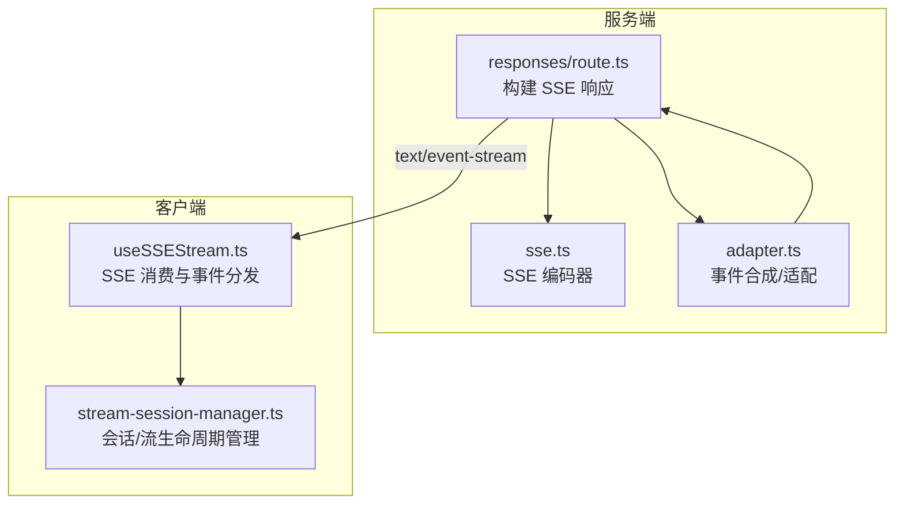
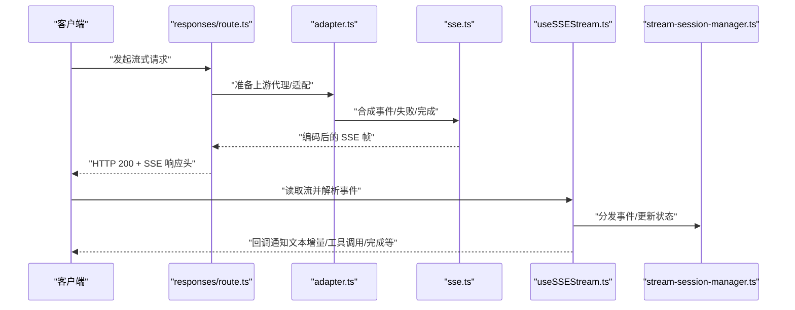
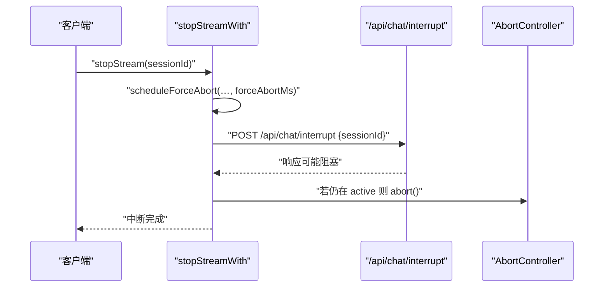
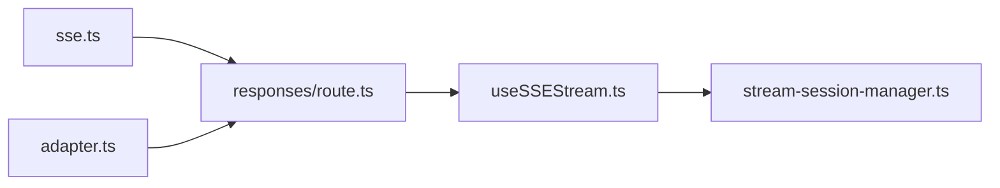

# 流式响应

<cite>
**本文引用的文件**
- [src/app/api/codex/proxy/v1/responses/route.ts](file://src/app/api/codex/proxy/v1/responses/route.ts)
- [src/lib/codex/proxy/sse.ts](file://src/lib/codex/proxy/sse.ts)
- [src/lib/codex/proxy/adapter.ts](file://src/lib/codex/proxy/adapter.ts)
- [src/hooks/useSSEStream.ts](file://src/hooks/useSSEStream.ts)
- [src/lib/stream-session-manager.ts](file://src/lib/stream-session-manager.ts)
- [src/__tests__/unit/sse-stream.test.ts](file://src/__tests__/unit/sse-stream.test.ts)
- [src/__tests__/unit/stop-stream-force-abort.test.ts](file://src/__tests__/unit/stop-stream-force-abort.test.ts)
- [src/__tests__/unit/codex-proxy-sdk-fixture.test.ts](file://src/__tests__/unit/codex-proxy-sdk-fixture.test.ts)
</cite>

## 目录
1. [简介](#简介)
2. [项目结构](#项目结构)
3. [核心组件](#核心组件)
4. [架构总览](#架构总览)
5. [组件详解](#组件详解)
6. [依赖关系分析](#依赖关系分析)
7. [性能考量](#性能考量)
8. [故障排查指南](#故障排查指南)
9. [结论](#结论)
10. [附录](#附录)

## 简介
本文件系统性记录流式响应 API 的设计与实现，重点覆盖以下方面：
- SSE（服务器推送事件）连接的建立、维护与中断机制
- 流式数据格式、事件类型与消息分片处理
- /api/chat/interrupt 端点用于中断当前流式响应的实现原理
- 连接超时处理、断线重连策略与错误恢复机制
- 客户端连接示例、事件监听代码与错误处理最佳实践
- 性能优化技巧与内存管理策略

## 项目结构
围绕流式响应的关键文件分布如下：
- 服务端路由与 SSE 编码：/src/app/api/codex/proxy/v1/responses/route.ts、/src/lib/codex/proxy/sse.ts
- 适配器与事件合成：/src/lib/codex/proxy/adapter.ts
- 客户端消费与状态管理：/src/hooks/useSSEStream.ts、/src/lib/stream-session-manager.ts
- 单元测试与契约校验：/src/__tests__/unit/sse-stream.test.ts、/src/__tests__/unit/stop-stream-force-abort.test.ts、/src/__tests__/unit/codex-proxy-sdk-fixture.test.ts

图表来源
- [src/app/api/codex/proxy/v1/responses/route.ts:90-114](file://src/app/api/codex/proxy/v1/responses/route.ts#L90-L114)
- [src/lib/codex/proxy/sse.ts:1-68](file://src/lib/codex/proxy/sse.ts#L1-L68)
- [src/lib/codex/proxy/adapter.ts:309-344](file://src/lib/codex/proxy/adapter.ts#L309-L344)
- [src/hooks/useSSEStream.ts:418-468](file://src/hooks/useSSEStream.ts#L418-L468)
- [src/lib/stream-session-manager.ts:882-954](file://src/lib/stream-session-manager.ts#L882-L954)

章节来源
- [src/app/api/codex/proxy/v1/responses/route.ts:90-114](file://src/app/api/codex/proxy/v1/responses/route.ts#L90-L114)
- [src/lib/codex/proxy/sse.ts:1-68](file://src/lib/codex/proxy/sse.ts#L1-L68)
- [src/lib/codex/proxy/adapter.ts:309-344](file://src/lib/codex/proxy/adapter.ts#L309-L344)
- [src/hooks/useSSEStream.ts:418-468](file://src/hooks/useSSEStream.ts#L418-L468)
- [src/lib/stream-session-manager.ts:882-954](file://src/lib/stream-session-manager.ts#L882-L954)

## 核心组件
- 服务端路由：负责将上游代理结果转换为 SSE 响应，设置正确的 Content-Type、缓存与连接头。
- SSE 编码器：严格遵循 OpenAI Responses 的 SSE 帧格式，要求每帧包含 event: 类型行与 data: JSON 行，并以空行结尾；提供 [DONE] 终止标记。
- 适配器：在上游开始前合成 response.created 事件；在错误路径合成 response.failed 事件；在结束时合成 response.completed 事件。
- 客户端钩子：以流式方式读取 SSE，按行解析事件，累积文本与令牌用量，分发不同事件类型回调。
- 会话管理器：维护流生命周期、阶段状态、超时与强制中断安全网。

章节来源
- [src/app/api/codex/proxy/v1/responses/route.ts:90-114](file://src/app/api/codex/proxy/v1/responses/route.ts#L90-L114)
- [src/lib/codex/proxy/sse.ts:1-68](file://src/lib/codex/proxy/sse.ts#L1-L68)
- [src/lib/codex/proxy/adapter.ts:309-344](file://src/lib/codex/proxy/adapter.ts#L309-L344)
- [src/hooks/useSSEStream.ts:418-468](file://src/hooks/useSSEStream.ts#L418-L468)
- [src/lib/stream-session-manager.ts:882-954](file://src/lib/stream-session-manager.ts#L882-L954)

## 架构总览
下图展示从服务端到客户端的完整数据流与控制流：

图表来源
- [src/app/api/codex/proxy/v1/responses/route.ts:90-114](file://src/app/api/codex/proxy/v1/responses/route.ts#L90-L114)
- [src/lib/codex/proxy/adapter.ts:309-344](file://src/lib/codex/proxy/adapter.ts#L309-L344)
- [src/lib/codex/proxy/sse.ts:1-68](file://src/lib/codex/proxy/sse.ts#L1-L68)
- [src/hooks/useSSEStream.ts:418-468](file://src/hooks/useSSEStream.ts#L418-L468)
- [src/lib/stream-session-manager.ts:882-954](file://src/lib/stream-session-manager.ts#L882-L954)

## 组件详解

### 服务端路由与 SSE 响应
- 路由根据上游代理结果选择返回 JSON 或 SSE。SSE 场景下设置 Content-Type 为 text/event-stream，并禁用缓存与变换，保持长连接。
- 错误路径统一转换为非流式 JSON 错误响应，便于客户端一致处理。

章节来源
- [src/app/api/codex/proxy/v1/responses/route.ts:90-114](file://src/app/api/codex/proxy/v1/responses/route.ts#L90-L114)

### SSE 编码器与事件格式
- 每个事件帧包含 event: 类型行与 data: JSON 行，最后以空行结尾；终止帧为 data: [DONE] 后跟空行。
- 提供 encodeEvent、encodeDone 以及 makeFailureStream 辅助函数，确保客户端解析器可正确识别与收尾。

章节来源
- [src/lib/codex/proxy/sse.ts:1-68](file://src/lib/codex/proxy/sse.ts#L1-L68)

### 适配器：事件合成与错误映射
- 在上游开始前合成 response.created 事件，携带响应 ID、模型与时间戳。
- 在错误路径合成 response.failed 事件，使用 response.error.code 作为分类依据，确保服务端解析器可识别结构化错误。
- 在结束时合成 response.completed 事件，携带最终响应信息。

章节来源
- [src/lib/codex/proxy/adapter.ts:309-344](file://src/lib/codex/proxy/adapter.ts#L309-L344)

### 客户端钩子：SSE 消费与事件分发
- 使用 ReadableStreamDefaultReader 逐块读取字节，TextDecoder 流式解码，按行切分并解析 data: JSON 事件。
- 累积文本与令牌用量，分发不同事件类型回调（如文本增量、思考片段、工具调用、工具结果、完成等）。
- 提供稳定的 consumeSSEStream 函数绑定最新回调，避免闭包捕获陈旧状态。

章节来源
- [src/hooks/useSSEStream.ts:418-468](file://src/hooks/useSSEStream.ts#L418-L468)

### 会话管理器：生命周期、超时与中断
- 维护流的阶段状态（如 active、completed），在完成时触发回调并调度垃圾回收。
- 提供 stopStreamWith 与 stopStream，确保“强制中断安全网”优先于优雅中断请求执行，防止阻塞导致的长期占用。
- /api/chat/interrupt 端点通过 POST 请求触发优雅中断，同时在超时后进行强制中断（AbortController.abort）。

章节来源
- [src/lib/stream-session-manager.ts:882-954](file://src/lib/stream-session-manager.ts#L882-L954)
- [src/__tests__/unit/stop-stream-force-abort.test.ts:1-32](file://src/__tests__/unit/stop-stream-force-abort.test.ts#L1-L32)

### /api/chat/interrupt 端点：中断实现原理
- 客户端调用 /api/chat/interrupt，携带 sessionId，服务端据此定位当前流并尝试优雅中断。
- 为避免阻塞，先安排强制中断安全网（scheduleForceAbort），再发起优雅中断请求（requestInterrupt）。即使优雅中断失败或超时，强制中断仍会触发 AbortController.abort，确保资源释放。

图表来源
- [src/lib/stream-session-manager.ts:916-942](file://src/lib/stream-session-manager.ts#L916-L942)
- [src/lib/stream-session-manager.ts:944-954](file://src/lib/stream-session-manager.ts#L944-L954)

章节来源
- [src/lib/stream-session-manager.ts:916-942](file://src/lib/stream-session-manager.ts#L916-L942)
- [src/lib/stream-session-manager.ts:944-954](file://src/lib/stream-session-manager.ts#L944-L954)

### 数据格式、事件类型与消息分片
- 事件格式：每帧以 event: <type> 开头，随后 data: <JSON>，最后以空行结尾；终止帧为 data: [DONE]。
- 事件类型：response.created、response.output_text.delta、response.output_item.done、response.completed、response.failed 等。
- 消息分片：客户端按行解析，忽略非 data: 行；对 JSON 解析异常的行进行跳过，保证健壮性。

章节来源
- [src/lib/codex/proxy/sse.ts:1-68](file://src/lib/codex/proxy/sse.ts#L1-L68)
- [src/hooks/useSSEStream.ts:418-468](file://src/hooks/useSSEStream.ts#L418-L468)
- [src/__tests__/unit/codex-proxy-sdk-fixture.test.ts:74-89](file://src/__tests__/unit/codex-proxy-sdk-fixture.test.ts#L74-L89)

### 连接超时处理、断线重连策略与错误恢复
- 超时处理：会话管理器内置空闲超时阈值与定时检查，超过阈值则触发中断与清理。
- 断线重连：客户端在流结束后可重新发起请求；服务端路由对错误路径统一返回非流式 JSON，便于前端判定并决定是否重试。
- 错误恢复：错误路径使用 response.failed 事件，客户端据此触发恢复动作（如打开设置、提示重试等）。

章节来源
- [src/lib/stream-session-manager.ts:882-954](file://src/lib/stream-session-manager.ts#L882-L954)
- [src/lib/codex/proxy/sse.ts:47-68](file://src/lib/codex/proxy/sse.ts#L47-L68)
- [src/app/api/codex/proxy/v1/responses/route.ts:90-114](file://src/app/api/codex/proxy/v1/responses/route.ts#L90-L114)

### 客户端连接示例、事件监听与最佳实践
- 连接示例：使用 fetch 获取 ReadableStream，构造 ReadableStreamDefaultReader，循环读取并解析事件。
- 事件监听：在回调中区分事件类型（文本增量、工具调用、完成等），累积文本与令牌用量，必要时触发 UI 更新。
- 最佳实践：
  - 使用 TextDecoder 流式解码，避免一次性解码大块数据。
  - 对非 data: 行与 JSON 解析异常进行容错处理。
  - 将回调通过 ref 包装，避免陈旧闭包导致的状态不一致。
  - 在完成或错误时关闭流并清理资源。

章节来源
- [src/hooks/useSSEStream.ts:418-468](file://src/hooks/useSSEStream.ts#L418-L468)
- [src/__tests__/unit/sse-stream.test.ts](file://src/__tests__/unit/sse-stream.test.ts)

## 依赖关系分析
- 路由依赖适配器与 SSE 编码器输出可读流；客户端依赖路由提供的 SSE 响应；会话管理器依赖客户端钩子的事件分发。
- 关键耦合点：
  - SSE 编码器与客户端解析器之间的契约（事件行格式、终止帧）。
  - 适配器与路由之间的事件合成与返回路径一致性。
  - 客户端钩子与会话管理器之间的事件分发与状态同步。

图表来源
- [src/lib/codex/proxy/sse.ts:1-68](file://src/lib/codex/proxy/sse.ts#L1-L68)
- [src/lib/codex/proxy/adapter.ts:309-344](file://src/lib/codex/proxy/adapter.ts#L309-L344)
- [src/app/api/codex/proxy/v1/responses/route.ts:90-114](file://src/app/api/codex/proxy/v1/responses/route.ts#L90-L114)
- [src/hooks/useSSEStream.ts:418-468](file://src/hooks/useSSEStream.ts#L418-L468)
- [src/lib/stream-session-manager.ts:882-954](file://src/lib/stream-session-manager.ts#L882-L954)

章节来源
- [src/lib/codex/proxy/sse.ts:1-68](file://src/lib/codex/proxy/sse.ts#L1-L68)
- [src/lib/codex/proxy/adapter.ts:309-344](file://src/lib/codex/proxy/adapter.ts#L309-L344)
- [src/app/api/codex/proxy/v1/responses/route.ts:90-114](file://src/app/api/codex/proxy/v1/responses/route.ts#L90-L114)
- [src/hooks/useSSEStream.ts:418-468](file://src/hooks/useSSEStream.ts#L418-L468)
- [src/lib/stream-session-manager.ts:882-954](file://src/lib/stream-session-manager.ts#L882-L954)

## 性能考量
- 流式解码与累积：使用 TextDecoder 流式解码与行缓冲，避免一次性解码大块数据，降低内存峰值。
- 事件解析容错：跳过非 data: 行与解析异常行，提升鲁棒性，减少因单行异常导致的整流中断。
- 资源释放：在完成或错误时及时关闭流与清理会话，避免内存泄漏。
- 超时与强制中断：通过安全网与 AbortController 保障长时间无响应的流能被及时终止，释放资源。

章节来源
- [src/hooks/useSSEStream.ts:418-468](file://src/hooks/useSSEStream.ts#L418-L468)
- [src/lib/stream-session-manager.ts:916-942](file://src/lib/stream-session-manager.ts#L916-L942)

## 故障排查指南
- SSE 帧格式问题：确认每帧包含 event: 类型行与 data: JSON 行，终止帧为 data: [DONE]。
- 事件类型缺失：检查适配器是否正确合成 response.created、response.failed、response.completed。
- 中断无效：确认 stopStreamWith 先安排强制中断安全网，再发起优雅中断请求；检查 /api/chat/interrupt 是否可达且超时上限合理。
- 客户端解析异常：检查 useSSEStream 的行解析与 JSON 解析逻辑，确保对异常行进行跳过处理。
- 单元测试参考：通过 sse-stream.test.ts 与 stop-stream-force-abort.test.ts 锁定事件分发与中断顺序契约。

章节来源
- [src/__tests__/unit/sse-stream.test.ts](file://src/__tests__/unit/sse-stream.test.ts)
- [src/__tests__/unit/stop-stream-force-abort.test.ts:1-32](file://src/__tests__/unit/stop-stream-force-abort.test.ts#L1-L32)
- [src/__tests__/unit/codex-proxy-sdk-fixture.test.ts:74-89](file://src/__tests__/unit/codex-proxy-sdk-fixture.test.ts#L74-L89)

## 结论
本文档梳理了流式响应 API 的端到端实现，明确了 SSE 帧格式、事件类型与客户端解析策略，阐述了 /api/chat/interrupt 的中断机制与安全网设计，并提供了性能优化与故障排查建议。通过严格的契约测试与会话管理，系统在复杂网络环境下仍能保持稳定与高效。

## 附录
- 事件类型与含义（示例）：response.created（响应创建）、response.output_text.delta（文本增量）、response.output_item.done（单项完成）、response.completed（响应完成）、response.failed（响应失败）。
- 客户端事件监听要点：区分事件类型、累积文本与令牌用量、处理错误与恢复动作、及时关闭流与清理资源。