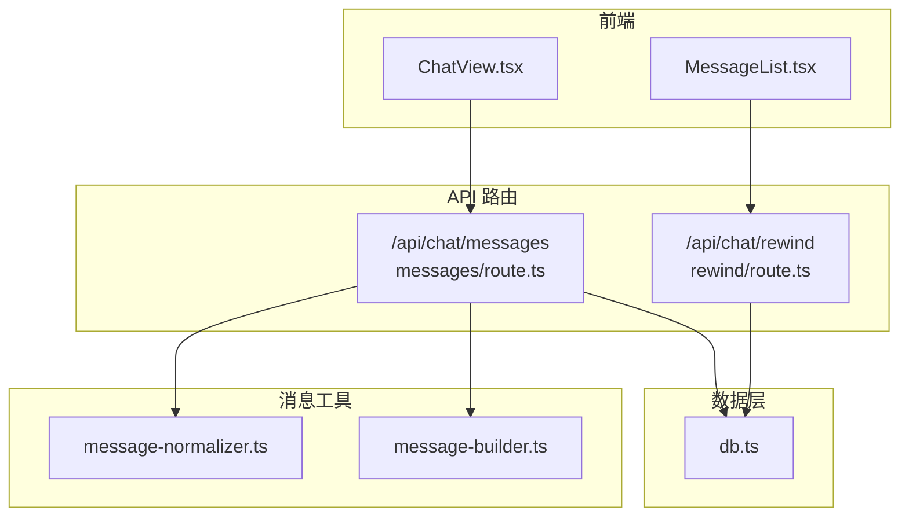
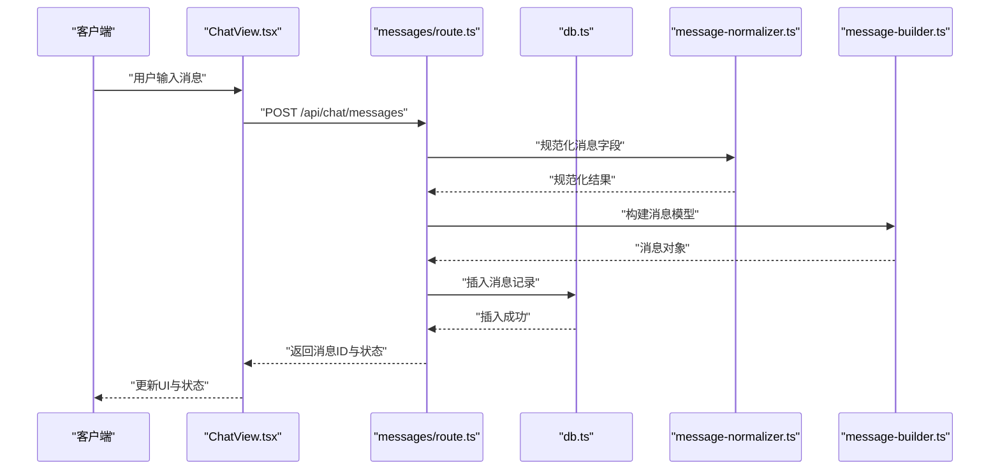
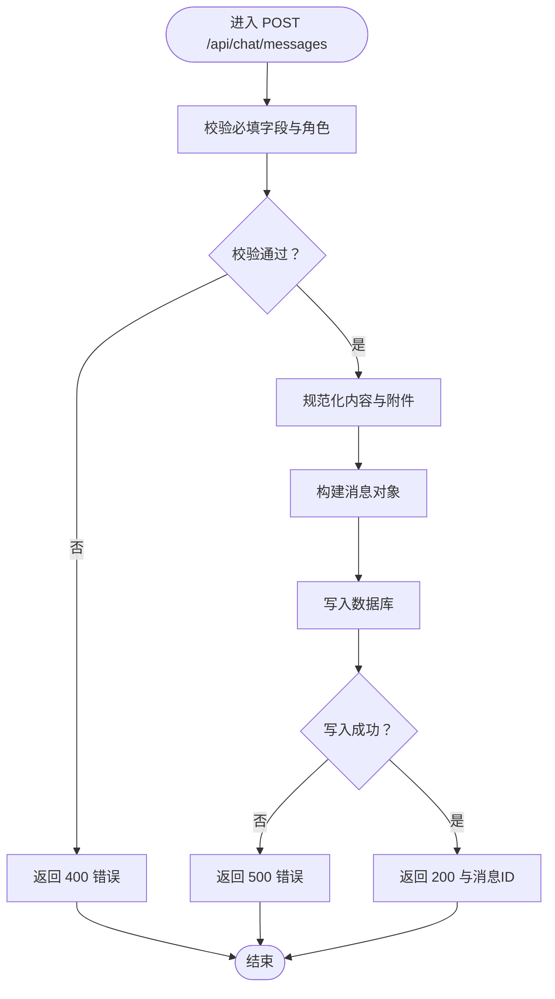
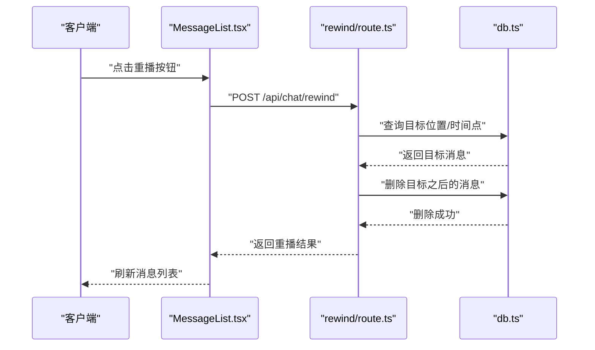
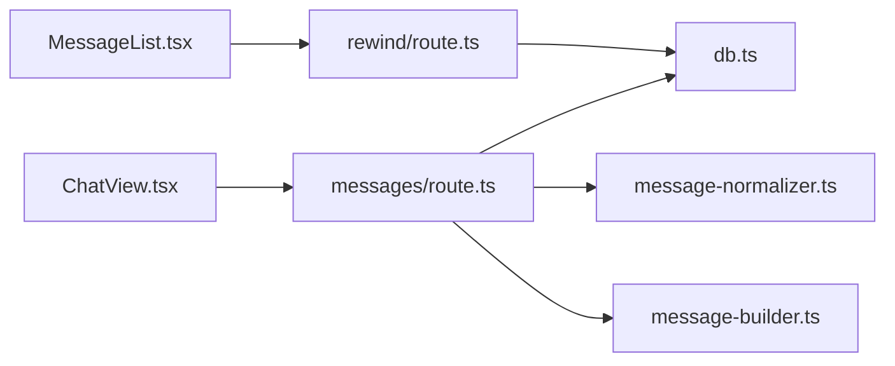

# 消息管理

<cite>
**本文引用的文件**
- [messages/route.ts](file://src/app/api/chat/messages/route.ts)
- [rewind/route.ts](file://src/app/api/chat/rewind/route.ts)
- [ChatView.tsx](file://src/components/chat/ChatView.tsx)
- [MessageList.tsx](file://src/components/chat/MessageList.tsx)
- [db.ts](file://src/lib/db.ts)
- [message-normalizer.ts](file://src/lib/message-normalizer.ts)
- [message-builder.ts](file://src/lib/message-builder.ts)
- [ARCHITECTURE.md](file://ARCHITECTURE.md)
</cite>

## 目录
1. [简介](#简介)
2. [项目结构](#项目结构)
3. [核心组件](#核心组件)
4. [架构总览](#架构总览)
5. [详细组件分析](#详细组件分析)
6. [依赖关系分析](#依赖关系分析)
7. [性能考量](#性能考量)
8. [故障排查指南](#故障排查指南)
9. [结论](#结论)
10. [附录](#附录)

## 简介
本文件系统性梳理消息管理 API 的设计与实现，覆盖以下能力：
- 发送新消息：POST /api/chat/messages
- 获取消息列表：GET /api/chat/messages
- 消息重播：POST /api/chat/rewind
- 删除消息：DELETE /api/chat/messages（由前端调用 DELETE /api/chat/messages 实现，见 ChatView.tsx）

文档重点说明消息格式规范、内容验证规则、错误处理机制、消息 ID 生成策略、时间戳处理与消息状态跟踪，并提供请求与响应示例路径及不同消息类型的处理流程。

## 项目结构
消息管理相关代码主要分布在以下位置：
- Next.js App Router API 路由：/src/app/api/chat/messages/route.ts、/src/app/api/chat/rewind/route.ts
- 前端聊天视图与消息列表：/src/components/chat/ChatView.tsx、/src/components/chat/MessageList.tsx
- 数据持久化与查询：/src/lib/db.ts
- 消息规范化与构建：/src/lib/message-normalizer.ts、/src/lib/message-builder.ts
- 架构文档：/ARCHITECTURE.md

图表来源
- [messages/route.ts](file://src/app/api/chat/messages/route.ts)
- [rewind/route.ts](file://src/app/api/chat/rewind/route.ts)
- [ChatView.tsx](file://src/components/chat/ChatView.tsx)
- [MessageList.tsx](file://src/components/chat/MessageList.tsx)
- [db.ts](file://src/lib/db.ts)
- [message-normalizer.ts](file://src/lib/message-normalizer.ts)
- [message-builder.ts](file://src/lib/message-builder.ts)

章节来源
- [messages/route.ts](file://src/app/api/chat/messages/route.ts)
- [rewind/route.ts](file://src/app/api/chat/rewind/route.ts)
- [ChatView.tsx](file://src/components/chat/ChatView.tsx)
- [MessageList.tsx](file://src/components/chat/MessageList.tsx)
- [db.ts](file://src/lib/db.ts)
- [message-normalizer.ts](file://src/lib/message-normalizer.ts)
- [message-builder.ts](file://src/lib/message-builder.ts)
- [ARCHITECTURE.md](file://ARCHITECTURE.md)

## 核心组件
- 消息发送路由：负责接收客户端发送的新消息，进行规范化与持久化，返回标准响应。
- 消息重播路由：根据指定时间点或用户消息位置，回滚对话历史，重新触发后续消息流。
- 消息列表路由：支持分页与游标查询，返回会话内的消息集合。
- 数据层：提供消息的读取、分页、过滤与更新能力。
- 消息工具：规范化输入、构建消息模型、生成消息 ID 与时间戳等。

章节来源
- [messages/route.ts](file://src/app/api/chat/messages/route.ts)
- [rewind/route.ts](file://src/app/api/chat/rewind/route.ts)
- [db.ts](file://src/lib/db.ts)
- [message-normalizer.ts](file://src/lib/message-normalizer.ts)
- [message-builder.ts](file://src/lib/message-builder.ts)

## 架构总览
消息管理 API 的整体交互如下：

图表来源
- [messages/route.ts](file://src/app/api/chat/messages/route.ts)
- [ChatView.tsx](file://src/components/chat/ChatView.tsx)
- [db.ts](file://src/lib/db.ts)
- [message-normalizer.ts](file://src/lib/message-normalizer.ts)
- [message-builder.ts](file://src/lib/message-builder.ts)

## 详细组件分析

### 消息发送：POST /api/chat/messages
- 功能概述
  - 接收客户端提交的新消息，进行字段规范化与校验，生成消息 ID 与时间戳，写入数据库，返回标准响应。
- 请求体字段
  - 会话标识：sessionId（字符串）
  - 消息角色：role（枚举："user"|"assistant"|"system"）
  - 内容主体：content（字符串或富文本结构，依据实现）
  - 可选附件：attachments（数组，元素结构见“消息格式规范”）
  - 可选元数据：metadata（键值对，用于扩展属性）
- 响应体字段
  - 成功：返回消息 ID、写入时间、状态码 200
  - 失败：返回错误码与错误信息，状态码 4xx/5xx
- 内容验证规则
  - 必填字段缺失：返回 400
  - 角色非法：返回 400
  - 内容为空或超长：返回 400 或 413
  - 附件格式不合法：返回 400
- 错误处理机制
  - 参数校验失败：返回 400
  - 数据库写入异常：返回 500
  - 并发冲突或唯一约束冲突：返回 409
- 消息 ID 生成策略
  - 使用全局唯一标识生成器（如 UUID v4），确保跨会话与跨实例唯一
- 时间戳处理
  - 服务端生成 UTC 时间戳，存储为数据库时间类型
- 消息状态跟踪
  - 发送成功即标记为“已接收”，后续流式响应或工具调用状态通过独立字段或事件更新

图表来源
- [messages/route.ts](file://src/app/api/chat/messages/route.ts)
- [message-normalizer.ts](file://src/lib/message-normalizer.ts)
- [message-builder.ts](file://src/lib/message-builder.ts)
- [db.ts](file://src/lib/db.ts)

章节来源
- [messages/route.ts](file://src/app/api/chat/messages/route.ts)
- [message-normalizer.ts](file://src/lib/message-normalizer.ts)
- [message-builder.ts](file://src/lib/message-builder.ts)
- [db.ts](file://src/lib/db.ts)

### 消息列表：GET /api/chat/messages
- 功能概述
  - 查询指定会话的消息列表，支持分页与游标查询，可排除心跳确认消息
- 查询参数
  - limit：每页数量（默认 100）
  - beforeRowId：游标，用于向更早方向分页
  - excludeHeartbeatAck：是否排除心跳确认消息（布尔，默认 false）
- 响应体字段
  - messages：消息数组（按 rowid 降序）
  - hasMore：是否存在更多历史
- 性能特性
  - 使用 rowid 进行高效分页与游标定位
  - 可选过滤心跳确认消息，减少无关数据传输

章节来源
- [db.ts](file://src/lib/db.ts)

### 消息重播：POST /api/chat/rewind
- 功能概述
  - 将对话回滚到指定时间点或最近一次用户消息处，重新触发后续消息流
- 请求体字段
  - 会话标识：sessionId（字符串）
  - 回滚目标：可为时间戳或消息 ID
  - 可选重放范围：起止消息 ID 或时间窗口
- 响应体字段
  - 成功：返回重播状态与受影响消息数
  - 失败：返回错误码与错误信息
- 处理流程
  - 校验会话存在性与权限
  - 查找目标消息位置或时间点
  - 删除目标之后的所有消息
  - 重新触发后续消息流（如工具调用、流式响应等）
- 错误处理机制
  - 会话不存在：返回 404
  - 目标位置无效：返回 400
  - 数据库事务失败：返回 500

图表来源
- [MessageList.tsx](file://src/components/chat/MessageList.tsx)
- [rewind/route.ts](file://src/app/api/chat/rewind/route.ts)
- [db.ts](file://src/lib/db.ts)

章节来源
- [rewind/route.ts](file://src/app/api/chat/rewind/route.ts)
- [MessageList.tsx](file://src/components/chat/MessageList.tsx)
- [db.ts](file://src/lib/db.ts)

### 消息删除：DELETE /api/chat/messages
- 功能概述
  - 前端通过调用 DELETE /api/chat/messages 删除单条或多条消息
- 请求体字段
  - 消息 ID 数组：ids（字符串数组）
  - 会话标识：sessionId（字符串）
- 响应体字段
  - 成功：返回删除数量与状态码 200
  - 失败：返回错误码与错误信息
- 错误处理机制
  - 会话不存在或无权限：返回 404/403
  - 消息不存在：返回 404
  - 数据库删除异常：返回 500

章节来源
- [ChatView.tsx](file://src/components/chat/ChatView.tsx)

### 消息格式规范与数据模型
- 消息对象字段
  - id：消息 ID（UUID）
  - sessionId：会话 ID（UUID）
  - role：角色（"user"|"assistant"|"system"）
  - content：内容（字符串或富文本结构）
  - attachments：附件数组（可选）
  - metadata：元数据（可选）
  - isHeartbeatAck：是否为心跳确认（布尔）
  - createdAt：创建时间（UTC）
  - updatedAt：更新时间（UTC）
- 附件对象字段
  - id：附件 ID（UUID）
  - name：文件名
  - type：MIME 类型
  - size：字节数
  - url：下载地址
- 元数据字段建议
  - toolCalls：工具调用列表
  - toolResults：工具执行结果
  - usage：token 使用统计
  - runtime：执行引擎标识

章节来源
- [message-normalizer.ts](file://src/lib/message-normalizer.ts)
- [message-builder.ts](file://src/lib/message-builder.ts)
- [db.ts](file://src/lib/db.ts)

### 消息 ID 生成策略与时间戳处理
- 消息 ID
  - 使用 UUID v4 生成全局唯一标识，保证跨实例与跨会话唯一
- 时间戳
  - 创建与更新时间均使用 UTC 时间，存储为数据库时间类型，便于跨时区一致性
- 状态跟踪
  - 发送成功即标记为“已接收”
  - 流式响应或工具调用完成后更新状态字段（如“已完成”、“失败”）

章节来源
- [messages/route.ts](file://src/app/api/chat/messages/route.ts)
- [db.ts](file://src/lib/db.ts)

### 不同类型消息的处理流程
- 用户消息
  - 触发工具调用与流式响应
  - 支持重播至该消息处
- 助手消息
  - 可包含工具调用结果与流式片段
  - 支持删除与重播
- 系统消息
  - 用于引导或提示，通常不可删除
- 心跳确认消息
  - 可在列表查询中选择排除

章节来源
- [messages/route.ts](file://src/app/api/chat/messages/route.ts)
- [db.ts](file://src/lib/db.ts)

## 依赖关系分析
消息管理 API 的关键依赖关系如下：

图表来源
- [ChatView.tsx](file://src/components/chat/ChatView.tsx)
- [MessageList.tsx](file://src/components/chat/MessageList.tsx)
- [messages/route.ts](file://src/app/api/chat/messages/route.ts)
- [rewind/route.ts](file://src/app/api/chat/rewind/route.ts)
- [db.ts](file://src/lib/db.ts)
- [message-normalizer.ts](file://src/lib/message-normalizer.ts)
- [message-builder.ts](file://src/lib/message-builder.ts)

章节来源
- [messages/route.ts](file://src/app/api/chat/messages/route.ts)
- [rewind/route.ts](file://src/app/api/chat/rewind/route.ts)
- [ChatView.tsx](file://src/components/chat/ChatView.tsx)
- [MessageList.tsx](file://src/components/chat/MessageList.tsx)
- [db.ts](file://src/lib/db.ts)
- [message-normalizer.ts](file://src/lib/message-normalizer.ts)
- [message-builder.ts](file://src/lib/message-builder.ts)

## 性能考量
- 分页与游标
  - 使用 rowid 与 limit 实现高效分页，避免全表扫描
  - beforeRowId 游标支持向更早方向增量加载
- 过滤策略
  - 提供排除心跳确认消息选项，降低传输与渲染压力
- 并发控制
  - 消息发送采用幂等写入策略，结合消息 ID 与唯一索引避免重复
- 缓存与去重
  - 建议在应用层对高频查询结果进行短期缓存，结合 ETag/Last-Modified 实现条件请求

## 故障排查指南
- 常见错误与处理
  - 400 参数错误：检查必填字段与角色合法性
  - 404 会话不存在：确认 sessionId 是否正确
  - 409 并发冲突：重试请求或使用幂等写入
  - 500 数据库异常：查看数据库日志与连接池状态
- 日志与监控
  - 记录请求参数、响应状态与耗时
  - 对重播操作进行审计日志记录
- 前端调试
  - 检查 fetch 请求与响应体
  - 在 ChatView.tsx 与 MessageList.tsx 中设置断点验证调用链

章节来源
- [messages/route.ts](file://src/app/api/chat/messages/route.ts)
- [rewind/route.ts](file://src/app/api/chat/rewind/route.ts)
- [ChatView.tsx](file://src/components/chat/ChatView.tsx)
- [MessageList.tsx](file://src/components/chat/MessageList.tsx)

## 结论
消息管理 API 以清晰的路由职责、严谨的数据模型与完善的错误处理机制为基础，支撑了消息发送、列表查询、重播与删除等核心能力。通过规范化与构建工具确保消息质量，借助数据库的高效分页与过滤策略提升性能，配合前端的实时更新与重播体验，形成完整的消息生命周期管理方案。

## 附录
- 请求与响应示例路径
  - 发送消息：[POST /api/chat/messages](file://src/app/api/chat/messages/route.ts)
  - 获取列表：[GET /api/chat/messages](file://src/lib/db.ts)
  - 重播对话：[POST /api/chat/rewind](file://src/app/api/chat/rewind/route.ts)
  - 删除消息：[DELETE /api/chat/messages](file://src/components/chat/ChatView.tsx)
- 架构参考
  - [架构文档](file://ARCHITECTURE.md)