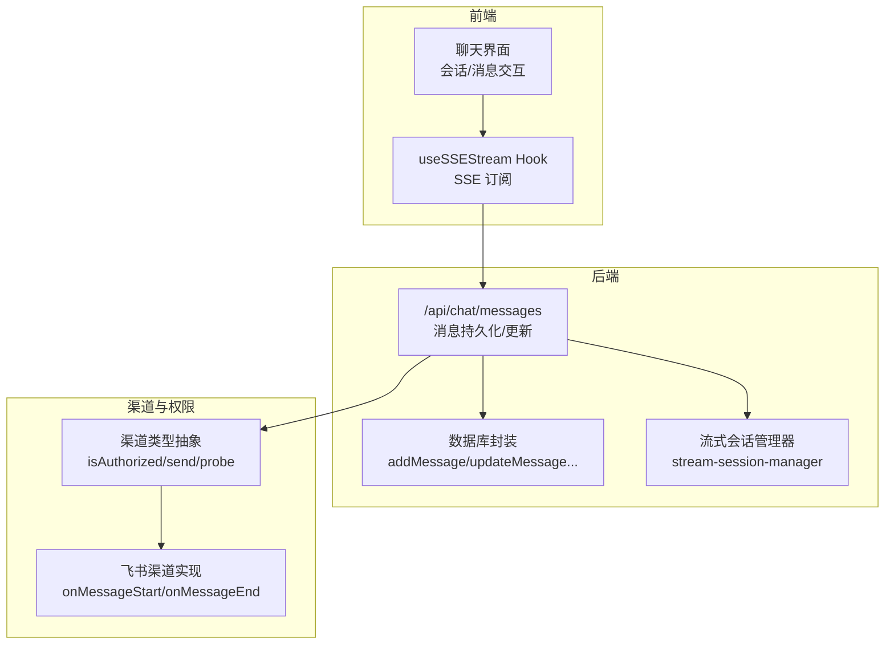
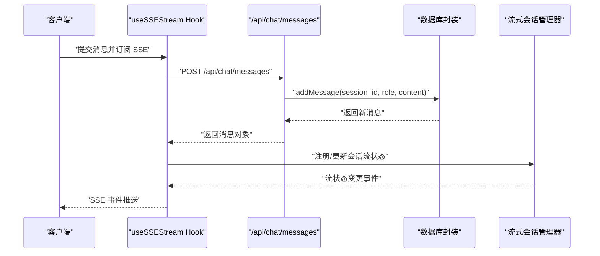
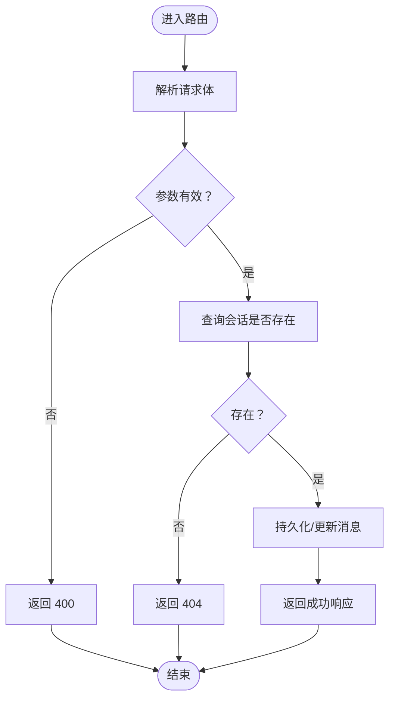
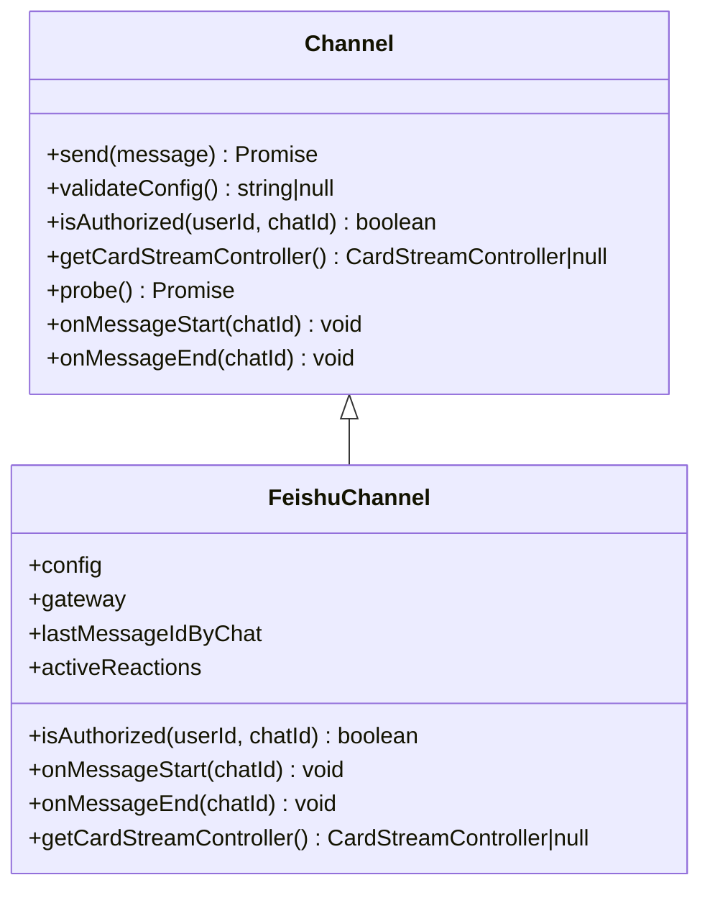
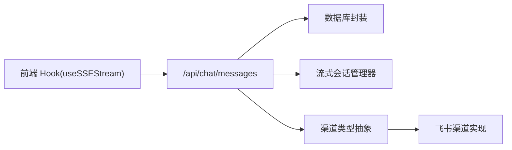

# 聊天 API

<cite>
**本文引用的文件**
- [src/app/api/chat/messages/route.ts](file://src/app/api/chat/messages/route.ts)
- [src/lib/db.ts](file://src/lib/db.ts)
- [src/hooks/useSSEStream.ts](file://src/hooks/useSSEStream.ts)
- [src/lib/stream-session-manager.ts](file://src/lib/stream-session-manager.ts)
- [src/lib/channels/types.ts](file://src/lib/channels/types.ts)
- [src/lib/channels/feishu/index.ts](file://src/lib/channels/feishu/index.ts)
- [src/__tests__/e2e/context-chips-send-clear.spec.ts](file://src/__tests__/e2e/context-chips-send-clear.spec.ts)
- [src/__tests__/e2e/global-search-file-seek.spec.ts](file://src/__tests__/e2e/global-search-file-seek.spec.ts)
- [src/__tests__/e2e/chat.spec.ts](file://src/__tests__/e2e/chat.spec.ts)
</cite>

## 目录
1. [简介](#简介)
2. [项目结构](#项目结构)
3. [核心组件](#核心组件)
4. [架构总览](#架构总览)
5. [详细组件分析](#详细组件分析)
6. [依赖关系分析](#依赖关系分析)
7. [性能考量](#性能考量)
8. [故障排查指南](#故障排查指南)
9. [结论](#结论)
10. [附录](#附录)

## 简介
本文件系统性梳理聊天相关 REST API 的端点定义、请求/响应规范、流式响应机制（SSE）、会话与消息持久化、权限控制与重播能力，并结合仓库中的测试用例给出典型使用场景与最佳实践。目标读者既包括前端/后端开发者，也包括需要理解接口行为的产品与测试人员。

## 项目结构
与聊天 API 直接相关的模块分布如下：
- 后端路由层：Next.js App Router 中的聊天消息路由
- 数据访问层：数据库封装函数（会话、消息 CRUD）
- 流式会话管理：会话级流式状态管理器
- 前端流式订阅：SSE 订阅 Hook
- 渠道适配与权限：渠道抽象与授权检查
- 端到端测试：覆盖会话创建、消息发送、历史查询等关键路径

图表来源
- [src/app/api/chat/messages/route.ts:1-81](file://src/app/api/chat/messages/route.ts#L1-L81)
- [src/lib/db.ts](file://src/lib/db.ts)
- [src/lib/stream-session-manager.ts](file://src/lib/stream-session-manager.ts)
- [src/lib/channels/types.ts:106-125](file://src/lib/channels/types.ts#L106-L125)
- [src/lib/channels/feishu/index.ts:412-437](file://src/lib/channels/feishu/index.ts#L412-L437)

章节来源
- [src/app/api/chat/messages/route.ts:1-81](file://src/app/api/chat/messages/route.ts#L1-L81)
- [src/lib/db.ts](file://src/lib/db.ts)
- [src/lib/stream-session-manager.ts](file://src/lib/stream-session-manager.ts)
- [src/lib/channels/types.ts:106-125](file://src/lib/channels/types.ts#L106-L125)
- [src/lib/channels/feishu/index.ts:412-437](file://src/lib/channels/feishu/index.ts#L412-L437)

## 核心组件
- 消息持久化与更新路由：提供消息写入与内容更新能力，支持图片生成模式等直写场景。
- 数据库封装：提供会话查询、消息新增与内容更新等基础操作。
- 流式会话管理器：负责会话级流式状态跟踪与生命周期管理。
- 前端 SSE 订阅 Hook：统一处理 SSE 连接、事件解析与断线重连。
- 渠道抽象与飞书实现：定义渠道通用能力与授权检查，并在消息开始/结束时进行交互反馈。

章节来源
- [src/app/api/chat/messages/route.ts:1-81](file://src/app/api/chat/messages/route.ts#L1-L81)
- [src/lib/db.ts](file://src/lib/db.ts)
- [src/lib/stream-session-manager.ts](file://src/lib/stream-session-manager.ts)
- [src/hooks/useSSEStream.ts](file://src/hooks/useSSEStream.ts)
- [src/lib/channels/types.ts:106-125](file://src/lib/channels/types.ts#L106-L125)
- [src/lib/channels/feishu/index.ts:412-437](file://src/lib/channels/feishu/index.ts#L412-L437)

## 架构总览
下图展示了从前端发起消息到后端持久化与流式输出的整体流程，以及渠道侧的授权与反馈钩子。

图表来源
- [src/app/api/chat/messages/route.ts:11-39](file://src/app/api/chat/messages/route.ts#L11-L39)
- [src/lib/db.ts](file://src/lib/db.ts)
- [src/lib/stream-session-manager.ts](file://src/lib/stream-session-manager.ts)
- [src/hooks/useSSEStream.ts](file://src/hooks/useSSEStream.ts)

## 详细组件分析

### 组件一：消息持久化与更新路由
- 功能定位：提供消息写入与内容更新的 REST 接口，支持图片生成等直写场景；同时提供消息内容更新能力，兼容临时 ID 到真实 ID 的回填。
- 关键端点
  - POST /api/chat/messages
    - 请求体字段：session_id（字符串，必填）、role（枚举 'user' | 'assistant'，必填）、content（字符串，必填）、token_usage（字符串，可选）
    - 成功响应：返回 message 对象（包含持久化后的消息信息）
    - 错误码：400（缺少必要字段）、404（会话不存在）、500（内部错误）
  - PUT /api/chat/messages
    - 请求体字段：message_id（字符串，优先使用）、content（字符串，必填）、session_id（字符串，与 prompt_hint 或 raw_request_block 至少其一）、prompt_hint（字符串，可选）、raw_request_block（字符串，可选）
    - 更新策略：优先按 message_id 直接更新；若无影响行则按 session_id + prompt_hint/raw_request_block 回溯匹配更新
    - 成功响应：返回更新后的消息标识与变更计数
    - 错误码：400（缺少 content）、500（内部错误）

- 处理逻辑要点
  - 参数校验：确保 session_id、role、content 存在；PUT 请求中 content 必填
  - 会话存在性检查：通过 getSession 校验会话有效性
  - 写入与更新：addMessage 与 updateMessageContent/updateMessageBySessionAndHint
  - 兼容性：当 message_id 为临时值时，通过提示/块内容回溯定位真实消息并完成替换

图表来源
- [src/app/api/chat/messages/route.ts:11-39](file://src/app/api/chat/messages/route.ts#L11-L39)
- [src/app/api/chat/messages/route.ts:49-81](file://src/app/api/chat/messages/route.ts#L49-L81)

章节来源
- [src/app/api/chat/messages/route.ts:1-81](file://src/app/api/chat/messages/route.ts#L1-L81)
- [src/lib/db.ts](file://src/lib/db.ts)

### 组件二：流式会话管理器
- 功能定位：维护会话级流式状态，协调模型输出与前端 SSE 推送，支持中断、重播与状态恢复。
- 关键职责
  - 会话状态跟踪：记录当前流式阶段、中断标记、重播计数等
  - 生命周期钩子：开始/结束时触发回调，便于渠道侧反馈（如飞书“正在输入”反应）
  - 与前端 Hook 协作：通过 SSE 事件向客户端推送增量内容与最终结果

章节来源
- [src/lib/stream-session-manager.ts](file://src/lib/stream-session-manager.ts)
- [src/lib/channels/feishu/index.ts:412-437](file://src/lib/channels/feishu/index.ts#L412-L437)

### 组件三：前端 SSE 订阅 Hook
- 功能定位：统一处理 SSE 连接、事件解析、断线重连与错误上报。
- 关键行为
  - 建立连接：根据服务端返回的会话标识订阅对应 SSE 流
  - 事件解析：按事件类型分发（数据、错误、完成等）
  - 断线重连：指数退避或固定间隔重试，避免频繁抖动
  - 与流式会话管理器协作：在收到完成事件后清理本地状态

章节来源
- [src/hooks/useSSEStream.ts](file://src/hooks/useSSEStream.ts)

### 组件四：渠道抽象与权限控制
- 渠道类型抽象
  - 定义通用能力：send（发送消息）、validateConfig（配置校验）、isAuthorized（用户授权）、probe（连通性探测）、生命周期钩子（onMessageStart/onMessageEnd）等
- 飞书渠道实现
  - 授权检查：isAuthorized(userId, chatId) 基于配置判断
  - 反馈钩子：onMessageStart 添加“正在输入”反应，onMessageEnd 移除反应
  - 可选能力：getCardStreamController 提供卡片流控制器

图表来源
- [src/lib/channels/types.ts:106-125](file://src/lib/channels/types.ts#L106-L125)
- [src/lib/channels/feishu/index.ts:412-437](file://src/lib/channels/feishu/index.ts#L412-L437)

章节来源
- [src/lib/channels/types.ts:106-125](file://src/lib/channels/types.ts#L106-L125)
- [src/lib/channels/feishu/index.ts:412-437](file://src/lib/channels/feishu/index.ts#L412-L437)

### 组件五：会话与消息历史查询（基于测试用例）
- 会话管理
  - 创建会话：POST /api/chat/sessions（由测试用例调用）
  - 查询会话列表：GET /api/chat/sessions（由测试用例路由拦截）
  - 获取单一会话详情：GET /api/chat/sessions/{id}
  - 删除会话：DELETE /api/chat/sessions/{id}
- 消息历史
  - 获取消息列表：GET /api/chat/sessions/{id}/messages
  - 分页参数：page_size、page_token（由测试用例参数约束）
- 使用场景
  - 在聊天页面加载历史、切换会话、清理会话等

章节来源
- [src/__tests__/e2e/context-chips-send-clear.spec.ts:128-155](file://src/__tests__/e2e/context-chips-send-clear.spec.ts#L128-L155)
- [src/__tests__/e2e/context-chips-send-clear.spec.ts:255-294](file://src/__tests__/e2e/context-chips-send-clear.spec.ts#L255-L294)
- [src/__tests__/e2e/global-search-file-seek.spec.ts:6-40](file://src/__tests__/e2e/global-search-file-seek.spec.ts#L6-L40)
- [src/__tests__/e2e/chat.spec.ts:95-150](file://src/__tests__/e2e/chat.spec.ts#L95-L150)

## 依赖关系分析
- 路由层依赖数据库封装进行消息持久化
- 路由层与流式会话管理器协作，驱动前端 SSE 推送
- 渠道抽象与具体实现（如飞书）解耦，便于扩展其他渠道
- 前端 Hook 与路由层通过 SSE 协议对接，具备断线重连能力

图表来源
- [src/app/api/chat/messages/route.ts:1-81](file://src/app/api/chat/messages/route.ts#L1-L81)
- [src/lib/db.ts](file://src/lib/db.ts)
- [src/lib/stream-session-manager.ts](file://src/lib/stream-session-manager.ts)
- [src/lib/channels/types.ts:106-125](file://src/lib/channels/types.ts#L106-L125)
- [src/lib/channels/feishu/index.ts:412-437](file://src/lib/channels/feishu/index.ts#L412-L437)
- [src/hooks/useSSEStream.ts](file://src/hooks/useSSEStream.ts)

章节来源
- [src/app/api/chat/messages/route.ts:1-81](file://src/app/api/chat/messages/route.ts#L1-L81)
- [src/lib/db.ts](file://src/lib/db.ts)
- [src/lib/stream-session-manager.ts](file://src/lib/stream-session-manager.ts)
- [src/lib/channels/types.ts:106-125](file://src/lib/channels/types.ts#L106-L125)
- [src/lib/channels/feishu/index.ts:412-437](file://src/lib/channels/feishu/index.ts#L412-L437)
- [src/hooks/useSSEStream.ts](file://src/hooks/useSSEStream.ts)

## 性能考量
- 流式传输：采用 SSE 将增量内容推送到前端，降低长轮询开销
- 断线重连：前端 Hook 实现指数退避或固定间隔重试，减少网络抖动对体验的影响
- 会话状态：流式会话管理器集中管理状态，避免重复拉取与并发冲突
- 数据库写入：消息写入采用最小必要字段，避免冗余存储；更新支持回溯匹配，减少二次查询

## 故障排查指南
- 常见错误与处理
  - 400 缺少必要字段：检查请求体是否包含 session_id、role、content；PUT 请求需包含 content
  - 404 会话不存在：确认会话 ID 是否正确，或先创建会话再发送消息
  - 500 内部错误：查看后端日志，定位数据库写入或更新异常
- 断线重连
  - 前端 Hook 自动重连：观察重连次数与间隔；若长时间无法恢复，检查网络与服务端可达性
  - 渠道侧授权失败：确认 isAuthorized 返回值与配置一致
- 会话与历史
  - 历史为空：确认会话 ID 正确且消息已持久化；检查分页参数 page_size/page_token
  - 重播问题：确认流式会话管理器状态与前端订阅状态一致

章节来源
- [src/app/api/chat/messages/route.ts:21-38](file://src/app/api/chat/messages/route.ts#L21-L38)
- [src/hooks/useSSEStream.ts](file://src/hooks/useSSEStream.ts)
- [src/lib/channels/types.ts:106-125](file://src/lib/channels/types.ts#L106-L125)

## 结论
本文档梳理了聊天 API 的核心端点、流式响应机制、会话与消息历史查询、权限控制与重播能力。通过路由层、数据库封装、流式会话管理器与前端 Hook 的协同，实现了稳定高效的聊天体验。建议在生产环境中配合完善的监控与告警体系，持续优化网络与数据库性能，并完善渠道扩展与安全策略。

## 附录

### A. 端点清单与规范
- POST /api/chat/messages
  - 请求体字段：session_id、role、content、token_usage（可选）
  - 成功响应：message 对象
  - 错误码：400、404、500
- PUT /api/chat/messages
  - 请求体字段：message_id（优先）、content、session_id（与 prompt_hint/raw_request_block 至少其一）、prompt_hint、raw_request_block
  - 成功响应：更新后的消息标识与变更计数
  - 错误码：400、500

章节来源
- [src/app/api/chat/messages/route.ts:11-39](file://src/app/api/chat/messages/route.ts#L11-L39)
- [src/app/api/chat/messages/route.ts:49-81](file://src/app/api/chat/messages/route.ts#L49-L81)

### B. 流式响应（SSE）实现要点
- 连接建立：前端通过 Hook 订阅对应会话的 SSE 流
- 事件格式：按事件类型分发（数据、错误、完成），前端据此渲染与恢复
- 断线重连：指数退避或固定间隔重试，避免频繁抖动
- 与渠道集成：渠道侧可在消息开始/结束时触发反馈（如飞书“正在输入”反应）

章节来源
- [src/hooks/useSSEStream.ts](file://src/hooks/useSSEStream.ts)
- [src/lib/channels/feishu/index.ts:412-437](file://src/lib/channels/feishu/index.ts#L412-L437)

### C. 会话与消息历史查询（基于测试用例）
- 会话管理：POST/GET/DELETE /api/chat/sessions（及 /sessions/{id}）
- 消息历史：GET /api/chat/sessions/{id}/messages，支持分页参数 page_size、page_token
- 场景示例：测试用例展示了会话创建、消息发送、历史查询与页面跳转的完整链路

章节来源
- [src/__tests__/e2e/context-chips-send-clear.spec.ts:128-155](file://src/__tests__/e2e/context-chips-send-clear.spec.ts#L128-L155)
- [src/__tests__/e2e/context-chips-send-clear.spec.ts:255-294](file://src/__tests__/e2e/context-chips-send-clear.spec.ts#L255-L294)
- [src/__tests__/e2e/global-search-file-seek.spec.ts:6-40](file://src/__tests__/e2e/global-search-file-seek.spec.ts#L6-L40)
- [src/__tests__/e2e/chat.spec.ts:95-150](file://src/__tests__/e2e/chat.spec.ts#L95-L150)