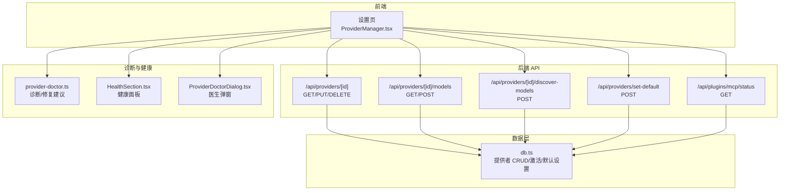
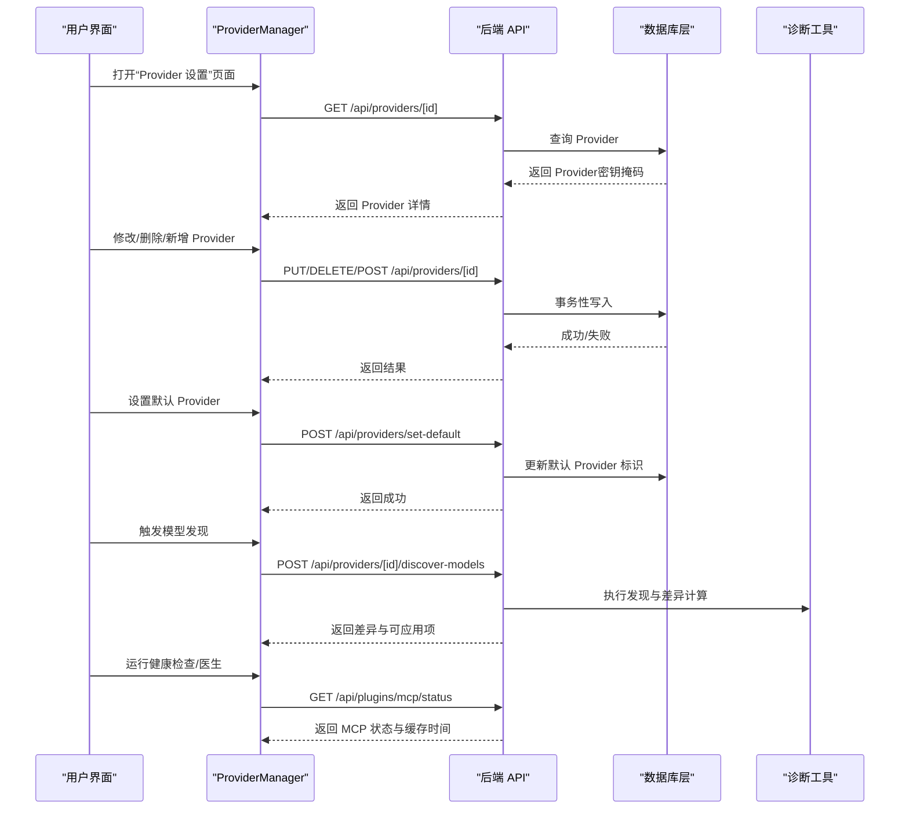
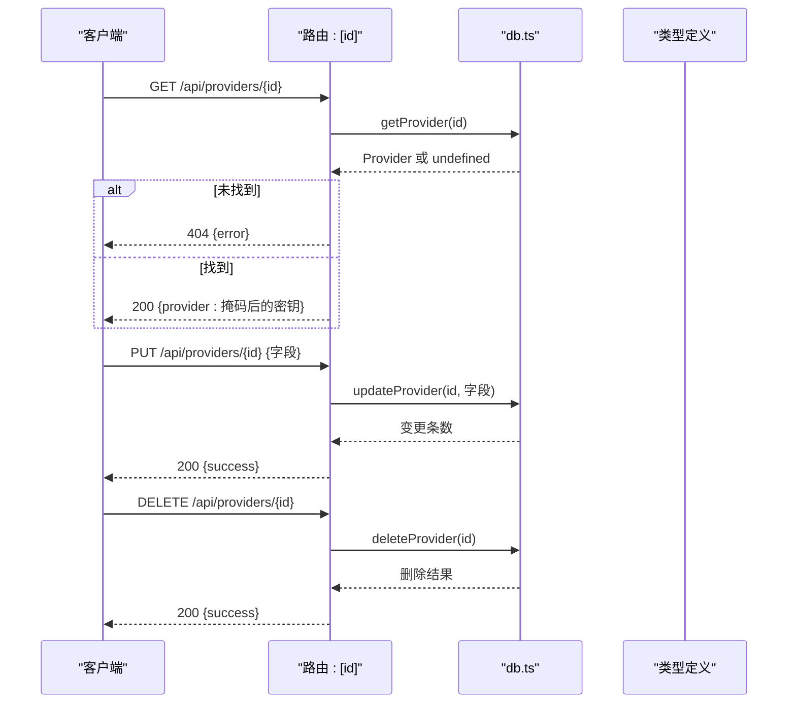
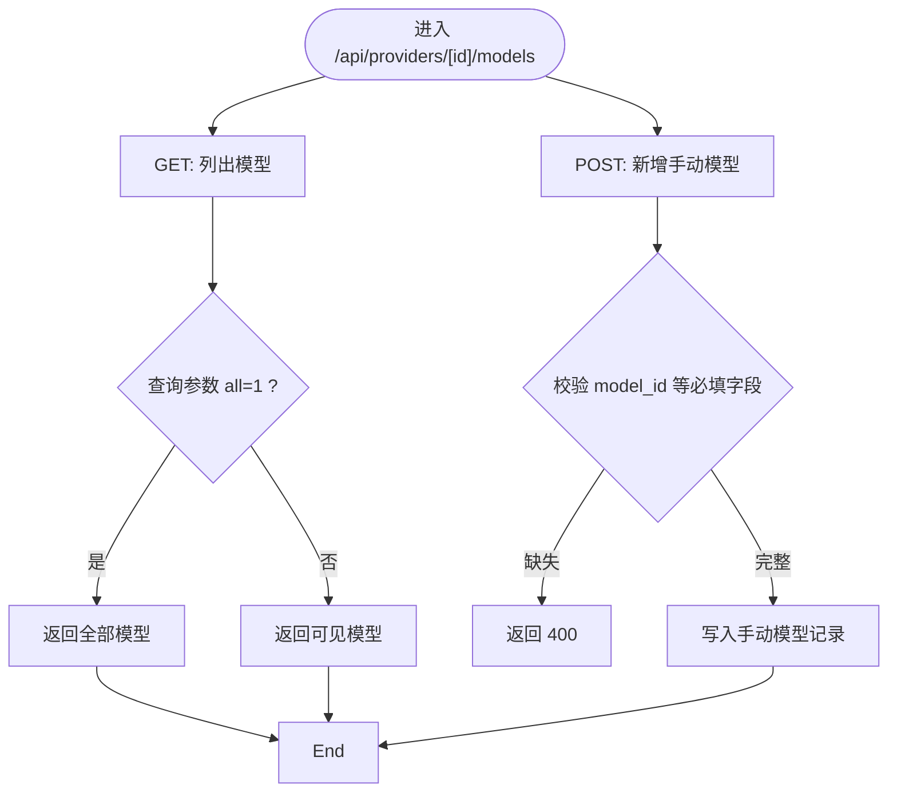
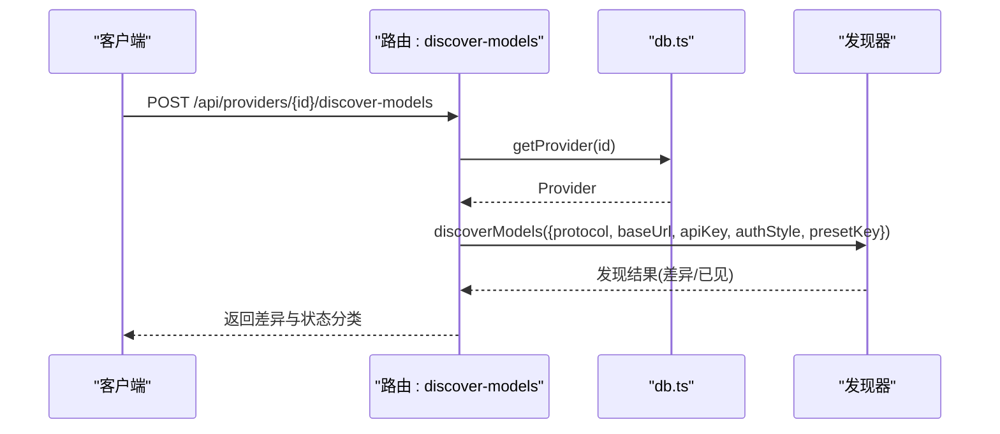
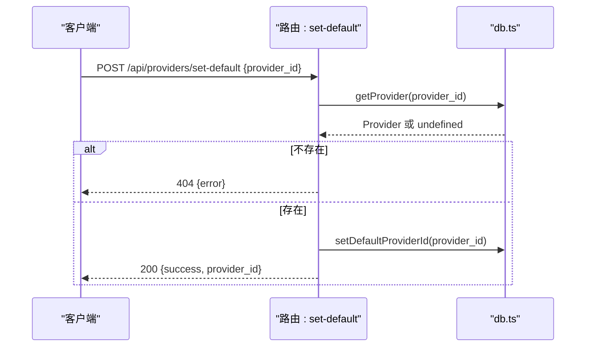
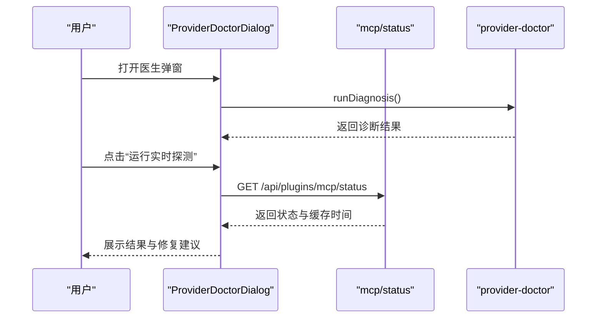
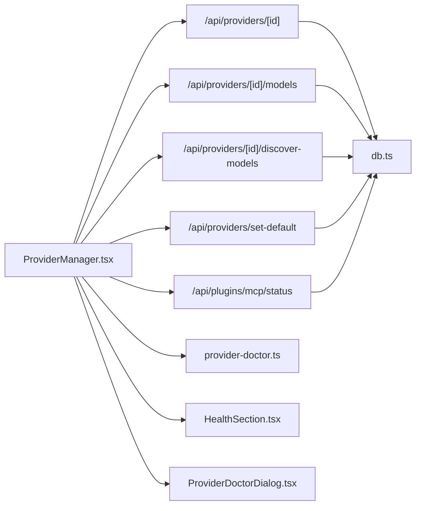

# Provider 设置 API

<cite>
**本文引用的文件**
- [src/app/api/providers/[id]/route.ts](file://src/app/api/providers/[id]/route.ts)
- [src/app/api/providers/[id]/models/route.ts](file://src/app/api/providers/[id]/models/route.ts)
- [src/app/api/providers/[id]/discover-models/route.ts](file://src/app/api/providers/[id]/discover-models/route.ts)
- [src/app/api/providers/set-default/route.ts](file://src/app/api/providers/set-default/route.ts)
- [src/lib/db.ts](file://src/lib/db.ts)
- [src/components/settings/ProviderManager.tsx](file://src/components/settings/ProviderManager.tsx)
- [src/lib/provider-doctor.ts](file://src/lib/provider-doctor.ts)
- [src/app/settings/providers/page.tsx](file://src/app/settings/providers/page.tsx)
- [src/app/api/plugins/mcp/status/route.ts](file://src/app/api/plugins/mcp/status/route.ts)
- [src/components/settings/HealthSection.tsx](file://src/components/settings/HealthSection.tsx)
- [src/components/settings/ProviderDoctorDialog.tsx](file://src/components/settings/ProviderDoctorDialog.tsx)
- [docs/guardrails/ProviderManagement.md](file://docs/guardrails/ProviderManagement.md)
</cite>

## 目录
1. [简介](#简介)
2. [项目结构](#项目结构)
3. [核心组件](#核心组件)
4. [架构总览](#架构总览)
5. [详细组件分析](#详细组件分析)
6. [依赖关系分析](#依赖关系分析)
7. [性能考量](#性能考量)
8. [故障排查指南](#故障排查指南)
9. [结论](#结论)
10. [附录](#附录)

## 简介
本文件系统化梳理“Provider 设置 API”的设计与实现，覆盖 Provider 的增删改查、激活/停用、默认 Provider 设置、模型发现与管理、认证方式与端点配置、错误处理、生命周期与健康监测、以及验证/测试连接与故障诊断流程。同时给出多厂商配置示例与最佳实践，并说明 Provider 切换、优先级与负载均衡的实现思路。

## 项目结构
围绕 Provider 的前端页面与后端 API 路由分布如下：
- 前端入口：设置页 Provider 管理组件
- 后端路由：按资源划分（单个 Provider、模型列表、模型发现、默认 Provider 设置）
- 数据层：数据库访问与事务控制
- 诊断与健康：内置医生与健康面板联动

图表来源
- [src/app/settings/providers/page.tsx:1-7](file://src/app/settings/providers/page.tsx#L1-L7)
- [src/components/settings/ProviderManager.tsx:788-815](file://src/components/settings/ProviderManager.tsx#L788-L815)
- [src/app/api/providers/[id]/route.ts](file://src/app/api/providers/[id]/route.ts#L1-L39)
- [src/app/api/providers/[id]/models/route.ts](file://src/app/api/providers/[id]/models/route.ts#L36-L73)
- [src/app/api/providers/[id]/discover-models/route.ts](file://src/app/api/providers/[id]/discover-models/route.ts#L61-L98)
- [src/app/api/providers/set-default/route.ts:1-24](file://src/app/api/providers/set-default/route.ts#L1-L24)
- [src/app/api/plugins/mcp/status/route.ts:1-36](file://src/app/api/plugins/mcp/status/route.ts#L1-L36)
- [src/lib/db.ts:1783-1815](file://src/lib/db.ts#L1783-L1815)
- [src/lib/provider-doctor.ts:1042-1077](file://src/lib/provider-doctor.ts#L1042-L1077)
- [src/components/settings/HealthSection.tsx:107-140](file://src/components/settings/HealthSection.tsx#L107-L140)
- [src/components/settings/ProviderDoctorDialog.tsx:168-423](file://src/components/settings/ProviderDoctorDialog.tsx#L168-L423)

章节来源
- [src/app/settings/providers/page.tsx:1-7](file://src/app/settings/providers/page.tsx#L1-L7)
- [src/components/settings/ProviderManager.tsx:788-815](file://src/components/settings/ProviderManager.tsx#L788-L815)

## 核心组件
- Provider 单资源路由：支持查询、更新、删除单个 Provider，返回时对密钥进行掩码处理，避免泄露。
- Provider 模型路由：支持列出模型、新增手动模型；与模型发现/应用流程配合。
- 模型发现路由：基于 Provider 的协议、基础地址与认证风格，执行模型发现并生成差异。
- 默认 Provider 设置路由：设置全局默认 Provider，校验存在性并返回结果。
- 数据层封装：统一提供者 CRUD、激活/停用、默认 Provider 设置、模型相关操作等。
- 诊断与健康：内置医生（诊断/修复建议）、健康面板（连接状态提示）、医生弹窗（交互式诊断）。

章节来源
- [src/app/api/providers/[id]/route.ts](file://src/app/api/providers/[id]/route.ts#L1-L39)
- [src/app/api/providers/[id]/models/route.ts](file://src/app/api/providers/[id]/models/route.ts#L36-L73)
- [src/app/api/providers/[id]/discover-models/route.ts](file://src/app/api/providers/[id]/discover-models/route.ts#L61-L98)
- [src/app/api/providers/set-default/route.ts:1-24](file://src/app/api/providers/set-default/route.ts#L1-L24)
- [src/lib/db.ts:1783-1815](file://src/lib/db.ts#L1783-L1815)

## 架构总览
Provider 设置 API 的调用链路与职责划分如下：

图表来源
- [src/components/settings/ProviderManager.tsx:788-815](file://src/components/settings/ProviderManager.tsx#L788-L815)
- [src/app/api/providers/[id]/route.ts](file://src/app/api/providers/[id]/route.ts#L1-L39)
- [src/app/api/providers/[id]/models/route.ts](file://src/app/api/providers/[id]/models/route.ts#L36-L73)
- [src/app/api/providers/[id]/discover-models/route.ts](file://src/app/api/providers/[id]/discover-models/route.ts#L61-L98)
- [src/app/api/providers/set-default/route.ts:1-24](file://src/app/api/providers/set-default/route.ts#L1-L24)
- [src/app/api/plugins/mcp/status/route.ts:1-36](file://src/app/api/plugins/mcp/status/route.ts#L1-L36)
- [src/lib/db.ts:1783-1815](file://src/lib/db.ts#L1783-L1815)
- [src/lib/provider-doctor.ts:1042-1077](file://src/lib/provider-doctor.ts#L1042-L1077)

## 详细组件分析

### Provider 单资源 API（查询/更新/删除）
- 功能要点
  - 查询：根据 ID 获取 Provider，对密钥进行掩码返回，避免泄露。
  - 更新：接收请求体中的字段，进行参数校验与更新。
  - 删除：删除 Provider 记录，清理默认 Provider 逻辑在 API 层处理。
- 错误处理
  - 未找到 Provider 返回 404。
  - 其他异常返回 500。
- 安全与合规
  - 密钥掩码策略仅保留尾部有限字符，其余以星号替代。
  - 不允许在更新中变更 provider_type，防止协议漂移风险。

图表来源
- [src/app/api/providers/[id]/route.ts](file://src/app/api/providers/[id]/route.ts#L1-L39)
- [src/lib/db.ts:1783-1815](file://src/lib/db.ts#L1783-L1815)

章节来源
- [src/app/api/providers/[id]/route.ts](file://src/app/api/providers/[id]/route.ts#L1-L39)
- [src/lib/db.ts:1783-1815](file://src/lib/db.ts#L1783-L1815)

### Provider 模型管理 API（列表/新增）
- 功能要点
  - 列表：支持是否包含隐藏模型的查询参数，返回模型集合。
  - 新增：新增手动模型，设置来源为“手动”，并标记用户编辑与启用来源，确保刷新策略不覆盖用户自定义。
- 数据一致性
  - 用户编辑标记与启用来源共同保护用户自定义模型不被后续刷新覆盖。
- 参数与约束
  - 新增模型需提供 model_id 等关键字段，否则返回 400。

图表来源
- [src/app/api/providers/[id]/models/route.ts](file://src/app/api/providers/[id]/models/route.ts#L36-L73)

章节来源
- [src/app/api/providers/[id]/models/route.ts](file://src/app/api/providers/[id]/models/route.ts#L36-L73)

### Provider 模型发现 API（差异与应用）
- 功能要点
  - 基于 Provider 的协议、基础地址与认证风格，执行模型发现。
  - 生成与当前数据库状态的差异（含状态分类），支持预览与确认应用。
  - 与“模型发现/应用”演进文档保持一致，保守自动应用策略保证安全。
- 关键输入
  - 协议、基础地址、API Key（可选）、认证风格（来自预设或 Provider）。
- 输出
  - 差异集合与“已见集合”，用于 UI 展示与后续应用。

图表来源
- [src/app/api/providers/[id]/discover-models/route.ts](file://src/app/api/providers/[id]/discover-models/route.ts#L61-L98)
- [src/lib/db.ts:1783-1815](file://src/lib/db.ts#L1783-L1815)

章节来源
- [src/app/api/providers/[id]/discover-models/route.ts](file://src/app/api/providers/[id]/discover-models/route.ts#L61-L98)

### 默认 Provider 设置 API
- 功能要点
  - 设置全局默认 Provider，要求提供有效的 provider_id。
  - 校验 Provider 存在性，不存在则返回 404。
  - 成功后返回设置成功的 provider_id。
- 业务规则
  - 不允许设置不存在的 Provider。
  - 与数据库层的默认 Provider 标识保持一致。

图表来源
- [src/app/api/providers/set-default/route.ts:1-24](file://src/app/api/providers/set-default/route.ts#L1-L24)
- [src/lib/db.ts:1783-1815](file://src/lib/db.ts#L1783-L1815)

章节来源
- [src/app/api/providers/set-default/route.ts:1-24](file://src/app/api/providers/set-default/route.ts#L1-L24)

### 数据层能力（Provider/模型/激活/默认）
- 提供者 CRUD
  - 创建：生成唯一 ID，插入排序序号，记录创建/更新时间。
  - 更新：按 ID 更新字段。
  - 删除：按 ID 删除。
  - 查询：按 ID、活动状态、全部列表查询。
- 激活/停用
  - 激活：将指定 Provider 设为活动，其他 Provider 停用。
  - 停用全部：清空活动标记。
- 默认 Provider
  - 设置/读取全局默认 Provider 标识。
- 模型管理
  - 按 Provider 查询模型列表。
  - 模型发现与差异应用（内部事务与批量更新）。

章节来源
- [src/lib/db.ts:1783-1815](file://src/lib/db.ts#L1783-L1815)
- [src/lib/db.ts:2487-2503](file://src/lib/db.ts#L2487-L2503)

### 前端集成与用户体验
- 设置页入口
  - 设置页直接渲染 Provider 管理组件，承载 Provider 卡片、编辑、删除、模型管理与健康检查入口。
- Provider 卡片
  - 展示图标、名称、状态、兼容性与信息摘要。
  - 编辑/删除回调驱动后端 API。
- 健康面板
  - 当未配置 Provider 时，提示严重问题并引导至 Providers 页面。
  - 已配置时显示 OK 状态与跳转按钮。

章节来源
- [src/app/settings/providers/page.tsx:1-7](file://src/app/settings/providers/page.tsx#L1-L7)
- [src/components/settings/ProviderManager.tsx:788-815](file://src/components/settings/ProviderManager.tsx#L788-L815)
- [src/components/settings/HealthSection.tsx:107-140](file://src/components/settings/HealthSection.tsx#L107-L140)

### 诊断与健康监测
- 医生（Provider Doctor）
  - 综合运行 CLI、认证、Provider、特性、网络探测，汇总整体严重级别与修复建议。
  - 支持单独运行“实时探测”，耗时较长，UI 中通过按钮触发。
- MCP 状态
  - 支持按会话或 Provider 获取 MCP 服务器状态，返回缓存时间戳。
- 医生弹窗
  - 展示诊断结果、修复动作、导出日志与社区支持指引。

图表来源
- [src/components/settings/ProviderDoctorDialog.tsx:168-423](file://src/components/settings/ProviderDoctorDialog.tsx#L168-L423)
- [src/app/api/plugins/mcp/status/route.ts:1-36](file://src/app/api/plugins/mcp/status/route.ts#L1-L36)
- [src/lib/provider-doctor.ts:1042-1077](file://src/lib/provider-doctor.ts#L1042-L1077)

章节来源
- [src/lib/provider-doctor.ts:1042-1077](file://src/lib/provider-doctor.ts#L1042-L1077)
- [src/app/api/plugins/mcp/status/route.ts:1-36](file://src/app/api/plugins/mcp/status/route.ts#L1-L36)
- [src/components/settings/ProviderDoctorDialog.tsx:168-423](file://src/components/settings/ProviderDoctorDialog.tsx#L168-L423)

## 依赖关系分析
- 组件耦合
  - 前端 ProviderManager 依赖后端各路由；路由依赖数据层；诊断模块独立但与路由/数据层交互。
- 外部依赖
  - Next.js 路由与响应对象；SQLite 数据库（通过数据层封装）。
- 潜在循环依赖
  - 无直接循环；路由与组件通过类型与数据层解耦。

图表来源
- [src/components/settings/ProviderManager.tsx:788-815](file://src/components/settings/ProviderManager.tsx#L788-L815)
- [src/app/api/providers/[id]/route.ts](file://src/app/api/providers/[id]/route.ts#L1-L39)
- [src/app/api/providers/[id]/models/route.ts](file://src/app/api/providers/[id]/models/route.ts#L36-L73)
- [src/app/api/providers/[id]/discover-models/route.ts](file://src/app/api/providers/[id]/discover-models/route.ts#L61-L98)
- [src/app/api/providers/set-default/route.ts:1-24](file://src/app/api/providers/set-default/route.ts#L1-L24)
- [src/app/api/plugins/mcp/status/route.ts:1-36](file://src/app/api/plugins/mcp/status/route.ts#L1-L36)
- [src/lib/db.ts:1783-1815](file://src/lib/db.ts#L1783-L1815)
- [src/lib/provider-doctor.ts:1042-1077](file://src/lib/provider-doctor.ts#L1042-L1077)
- [src/components/settings/HealthSection.tsx:107-140](file://src/components/settings/HealthSection.tsx#L107-L140)
- [src/components/settings/ProviderDoctorDialog.tsx:168-423](file://src/components/settings/ProviderDoctorDialog.tsx#L168-L423)

## 性能考量
- 模型列表加载
  - 建议在设置页延迟加载模型列表，避免阻塞首屏。
  - 对于大型模型集，提供分页或虚拟滚动。
- 模型发现
  - 发现过程可能较慢，建议在后台异步执行并在 UI 中显示进度。
- 默认 Provider 设置
  - 设置为 O(1) 操作，仅更新标识位。
- 诊断与健康
  - 实时探测耗时较长，应提供取消与重试机制。

## 故障排查指南
- 常见问题与定位
  - Provider 未配置：健康面板提示严重问题，引导至 Providers 页面。
  - 未找到 Provider：查询接口返回 404，检查 ID 是否正确。
  - 认证失败：医生运行认证探测，查看具体失败原因与修复建议。
  - 网络异常：医生运行网络探测，检查代理、DNS 与防火墙。
- 修复建议
  - 使用医生弹窗执行诊断并应用修复动作。
  - 导出日志后在社区渠道反馈问题。
- 最佳实践
  - 为每个 Provider 保留最小权限的 API Key。
  - 定期运行健康检查与模型发现，保持模型清单最新。
  - 使用“手动启用”的模型标记保护用户自定义模型。

章节来源
- [src/components/settings/HealthSection.tsx:107-140](file://src/components/settings/HealthSection.tsx#L107-L140)
- [src/lib/provider-doctor.ts:1042-1077](file://src/lib/provider-doctor.ts#L1042-L1077)
- [src/components/settings/ProviderDoctorDialog.tsx:168-423](file://src/components/settings/ProviderDoctorDialog.tsx#L168-L423)

## 结论
Provider 设置 API 通过清晰的资源划分与严谨的数据层封装，提供了完整的 Provider 生命周期管理能力。结合内置医生与健康面板，能够有效支撑多厂商接入、模型治理与运行稳定性保障。建议在生产环境中配合定期健康检查、模型发现与最小权限原则，确保系统的可靠性与可维护性。

## 附录

### API 规范概览
- 查询 Provider
  - 方法：GET
  - 路径：/api/providers/[id]
  - 响应：包含掩码后的 Provider 详情
  - 错误：404（未找到）
- 更新 Provider
  - 方法：PUT
  - 路径：/api/providers/[id]
  - 请求体：Provider 字段（provider_type 不可变）
  - 响应：成功
- 删除 Provider
  - 方法：DELETE
  - 路径：/api/providers/[id]
  - 响应：成功
- 列出模型
  - 方法：GET
  - 路径：/api/providers/[id]/models
  - 查询参数：all=1（包含隐藏模型）
  - 响应：模型数组
- 新增手动模型
  - 方法：POST
  - 路径：/api/providers/[id]/models
  - 请求体：模型字段（需提供 model_id 等）
  - 响应：成功
- 模型发现
  - 方法：POST
  - 路径：/api/providers/[id]/discover-models
  - 请求体：空
  - 响应：差异与状态分类
- 设置默认 Provider
  - 方法：POST
  - 路径：/api/providers/set-default
  - 请求体：{ provider_id }
  - 响应：成功与 provider_id
  - 错误：400/404/500

章节来源
- [src/app/api/providers/[id]/route.ts](file://src/app/api/providers/[id]/route.ts#L1-L39)
- [src/app/api/providers/[id]/models/route.ts](file://src/app/api/providers/[id]/models/route.ts#L36-L73)
- [src/app/api/providers/[id]/discover-models/route.ts](file://src/app/api/providers/[id]/discover-models/route.ts#L61-L98)
- [src/app/api/providers/set-default/route.ts:1-24](file://src/app/api/providers/set-default/route.ts#L1-L24)

### 认证方式与端点配置
- 认证方式
  - API Key：适用于大多数云厂商。
  - Bearer Token：部分厂商支持。
  - 无端点：特定云厂商（如 Anthropic/Bedrock/Vertex）无需用户配置 base_url。
- 端点配置
  - 基础地址（base_url）与协议（protocol）决定访问路径与行为。
  - 若缺少 base_url，医生会给出警告并提供修复建议。

章节来源
- [src/lib/provider-doctor.ts:372-399](file://src/lib/provider-doctor.ts#L372-L399)

### 模型映射与刷新策略
- 模型来源
  - 自动发现：基于协议与认证风格拉取远端模型清单。
  - 手动添加：用户自定义模型，标记为“手动启用”，不受刷新覆盖。
- 刷新策略
  - 保留用户已编辑行，仅对未编辑行应用刷新。
  - 通过“启用来源”与“用户编辑”双信号确保一致性。

章节来源
- [src/app/api/providers/[id]/models/route.ts](file://src/app/api/providers/[id]/models/route.ts#L47-L73)
- [src/lib/db.ts:2471-2485](file://src/lib/db.ts#L2471-L2485)

### 生命周期管理与状态检查
- 生命周期
  - 创建：生成 ID，初始化排序与时间戳。
  - 激活：仅允许一个 Provider 处于活动状态。
  - 停用：清空活动标记。
  - 删除：清理记录并处理默认 Provider 清理。
- 状态检查
  - 健康面板：未配置 Provider 时提示严重问题。
  - 医生：综合探测与修复建议。
  - MCP 状态：按 Provider 或会话查询状态与缓存时间。

章节来源
- [src/lib/db.ts:1783-1815](file://src/lib/db.ts#L1783-L1815)
- [src/lib/db.ts:2487-2503](file://src/lib/db.ts#L2487-L2503)
- [src/components/settings/HealthSection.tsx:107-140](file://src/components/settings/HealthSection.tsx#L107-L140)
- [src/app/api/plugins/mcp/status/route.ts:1-36](file://src/app/api/plugins/mcp/status/route.ts#L1-L36)

### 验证、测试连接与故障诊断
- 验证
  - 使用医生运行认证与网络探测，查看结果与修复建议。
- 测试连接
  - 通过 MCP 状态接口获取实时连接状态与缓存时间。
- 故障诊断
  - 导出日志并参考医生弹窗中的社区支持指引。

章节来源
- [src/lib/provider-doctor.ts:1042-1077](file://src/lib/provider-doctor.ts#L1042-L1077)
- [src/app/api/plugins/mcp/status/route.ts:1-36](file://src/app/api/plugins/mcp/status/route.ts#L1-L36)
- [src/components/settings/ProviderDoctorDialog.tsx:168-423](file://src/components/settings/ProviderDoctorDialog.tsx#L168-L423)

### 不同 AI 服务提供商的配置示例与最佳实践
- 示例（概念性）
  - OpenAI：提供 base_url 与 API Key；定期刷新模型清单。
  - OpenRouter：提供 base_url 与 API Key；使用模型发现与差异应用。
  - Claude：Anthropic 协议，可选择是否配置 base_url；医生对空 base_url 提示风险。
  - Bedrock/Vertex：云厂商，无需配置 base_url；认证通过 IAM/ADC。
- 最佳实践
  - 为每个供应商单独创建 Provider，避免混用。
  - 使用“手动启用”保护关键模型。
  - 定期运行健康检查与模型发现。
  - 严格最小权限原则，定期轮换 API Key。

章节来源
- [docs/guardrails/ProviderManagement.md:142-157](file://docs/guardrails/ProviderManagement.md#L142-L157)
- [src/lib/provider-doctor.ts:372-399](file://src/lib/provider-doctor.ts#L372-L399)

### Provider 切换、优先级设置与负载均衡
- 切换
  - 通过设置默认 Provider 实现切换；仅允许一个活动 Provider。
- 优先级
  - 默认 Provider 作为首选；其他 Provider 作为备选。
- 负载均衡
  - 建议在上游网关或代理层实现；Provider 层暂不直接提供 LB 能力。

章节来源
- [src/app/api/providers/set-default/route.ts:1-24](file://src/app/api/providers/set-default/route.ts#L1-L24)
- [src/lib/db.ts:2487-2503](file://src/lib/db.ts#L2487-L2503)