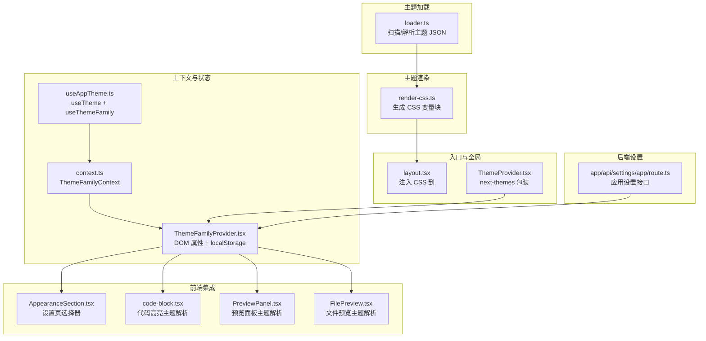
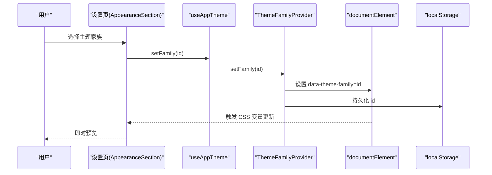
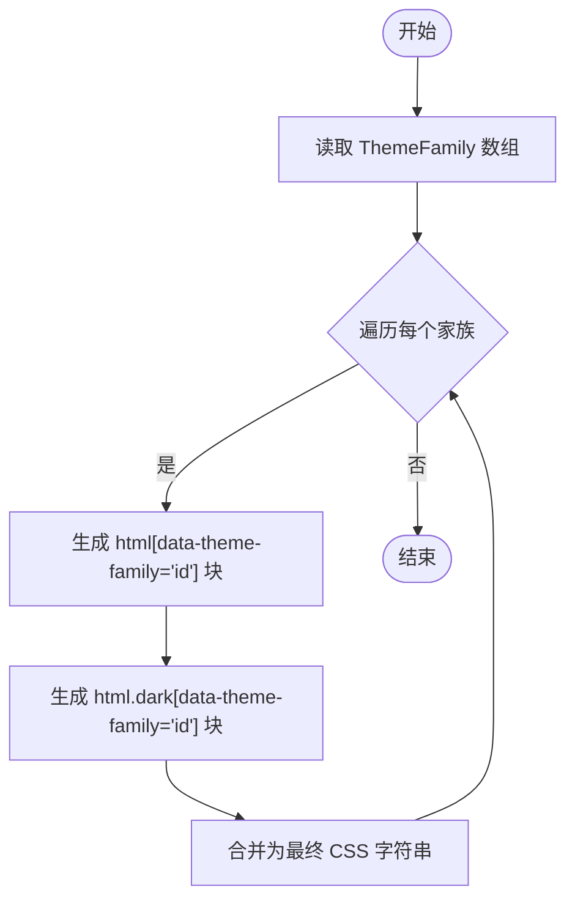
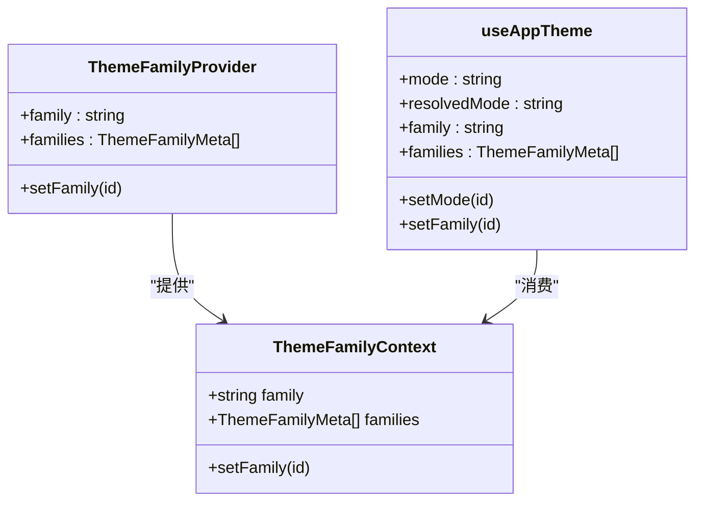
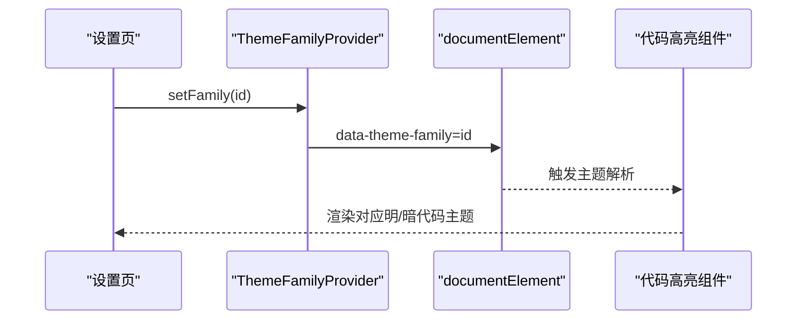
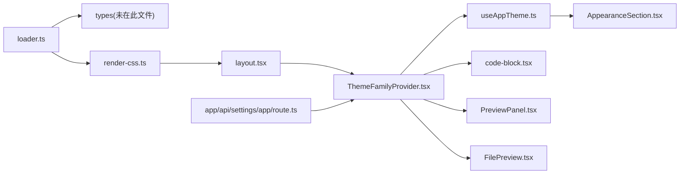

# 主题设置 API

<cite>
**本文引用的文件**
- [src/lib/theme/render-css.ts](file://src/lib/theme/render-css.ts)
- [src/lib/theme/loader.ts](file://src/lib/theme/loader.ts)
- [src/lib/theme/context.ts](file://src/lib/theme/context.ts)
- [src/hooks/useAppTheme.ts](file://src/hooks/useAppTheme.ts)
- [src/components/layout/ThemeFamilyProvider.tsx](file://src/components/layout/ThemeFamilyProvider.tsx)
- [src/components/settings/AppearanceSection.tsx](file://src/components/settings/AppearanceSection.tsx)
- [src/app/api/settings/app/route.ts](file://src/app/api/settings/app/route.ts)
- [src/app/layout.tsx](file://src/app/layout.tsx)
- [src/components/layout/ThemeProvider.tsx](file://src/components/layout/ThemeProvider.tsx)
- [src/components/ai-elements/code-block.tsx](file://src/components/ai-elements/code-block.tsx)
- [src/components/layout/panels/PreviewPanel.tsx](file://src/components/layout/panels/PreviewPanel.tsx)
- [src/components/project/FilePreview.tsx](file://src/components/project/FilePreview.tsx)
- [src/lib/theme/code-themes.ts](file://src/lib/theme/code-themes.ts)
- [src/__tests__/unit/theme-render-css.test.ts](file://src/__tests__/unit/theme-render-css.test.ts)
- [src/__tests__/unit/theme-loader.test.ts](file://src/__tests__/unit/theme-loader.test.ts)
- [themes/default.json](file://themes/default.json)
- [themes/github.json](file://themes/github.json)
- [themes/nord.json](file://themes/nord.json)
</cite>

## 目录
1. [简介](#简介)
2. [项目结构](#项目结构)
3. [核心组件](#核心组件)
4. [架构总览](#架构总览)
5. [详细组件分析](#详细组件分析)
6. [依赖关系分析](#依赖关系分析)
7. [性能考量](#性能考量)
8. [故障排查指南](#故障排查指南)
9. [结论](#结论)
10. [附录](#附录)

## 简介
本文件为“主题设置 API”的权威技术文档，覆盖主题切换、颜色配置、字体与代码高亮主题、布局适配等能力。文档从数据模型、渲染机制、上下文与状态管理、到前端 UI 与后端设置接口，全面阐述主题系统的实现方式，并提供导入导出、备份恢复、版本管理与自定义主题创建的规范建议。

## 项目结构
主题系统围绕“主题家族（ThemeFamily）”展开，通过一组颜色变量映射到 CSS 自定义属性，再由 DOM 属性选择器在运行时应用到页面。核心文件分布如下：
- 渲染层：将主题家族的颜色映射转换为 CSS 变量块
- 加载层：扫描并解析主题 JSON 文件，生成主题家族元数据与实例
- 上下文层：提供主题家族的选择与持久化
- 前端集成：在设置页、编辑器、预览面板中应用主题家族与代码高亮主题
- 后端设置：提供应用级主题家族设置的 API

图表来源
- [src/lib/theme/render-css.ts:1-46](file://src/lib/theme/render-css.ts#L1-L46)
- [src/lib/theme/loader.ts:1-34](file://src/lib/theme/loader.ts#L1-L34)
- [src/lib/theme/context.ts:1-18](file://src/lib/theme/context.ts#L1-L18)
- [src/hooks/useAppTheme.ts:1-16](file://src/hooks/useAppTheme.ts#L1-L16)
- [src/components/layout/ThemeFamilyProvider.tsx:34-60](file://src/components/layout/ThemeFamilyProvider.tsx#L34-L60)
- [src/components/settings/AppearanceSection.tsx:201-241](file://src/components/settings/AppearanceSection.tsx#L201-L241)
- [src/app/api/settings/app/route.ts](file://src/app/api/settings/app/route.ts#L16)
- [src/app/layout.tsx:8-9](file://src/app/layout.tsx#L8-L9)
- [src/components/layout/ThemeProvider.tsx](file://src/components/layout/ThemeProvider.tsx#L2)

章节来源
- [src/app/layout.tsx:8-9](file://src/app/layout.tsx#L8-L9)
- [src/lib/theme/render-css.ts:22-46](file://src/lib/theme/render-css.ts#L22-L46)
- [src/lib/theme/loader.ts:1-34](file://src/lib/theme/loader.ts#L1-L34)

## 核心组件
- 主题家族（ThemeFamily）
  - 每个主题家族包含唯一标识、显示标签、排序权重以及两套颜色映射：light 与 dark
  - 颜色键名采用 camelCase，渲染时转换为 CSS 变量名（如 cardForeground → --card-foreground）
- CSS 变量渲染器（render-css.ts）
  - 将 ThemeFamily 的颜色映射转换为 CSS 块，分别作用于 html[data-theme-family="..."] 与 html.dark[data-theme-family="..."]
  - 保证在无 data-theme-family 时回退到 :root 与 .dark
- 主题加载器（loader.ts）
  - 扫描 themes 目录下的 JSON 文件，构建 ThemeFamily 实例与元数据数组
  - 提供默认回退颜色集以匹配全局样式中的 :root 值
- 主题上下文（context.ts + ThemeFamilyProvider.tsx）
  - 使用 React Context 暴露 family、setFamily、families
  - 通过 document.documentElement.setAttribute 设置 data-theme-family，立即生效
  - 通过 localStorage 持久化主题家族选择
- 应用主题钩子（useAppTheme.ts）
  - 统一暴露 next-themes 的 theme/setTheme 与自定义 family/setFamily/families
- 前端集成点
  - 设置页 AppearanceSection.tsx：提供主题家族选择器与预览
  - 代码高亮：code-block.tsx、PreviewPanel.tsx、FilePreview.tsx 解析当前主题家族对应的代码高亮主题
- 后端设置接口（app/api/settings/app/route.ts）
  - 在应用设置中支持写入 theme_family 字段，用于服务端持久化用户偏好

章节来源
- [src/lib/theme/render-css.ts:3-46](file://src/lib/theme/render-css.ts#L3-L46)
- [src/lib/theme/loader.ts:5-34](file://src/lib/theme/loader.ts#L5-L34)
- [src/lib/theme/context.ts:4-18](file://src/lib/theme/context.ts#L4-L18)
- [src/components/layout/ThemeFamilyProvider.tsx:34-60](file://src/components/layout/ThemeFamilyProvider.tsx#L34-L60)
- [src/hooks/useAppTheme.ts:4-16](file://src/hooks/useAppTheme.ts#L4-L16)
- [src/components/settings/AppearanceSection.tsx:201-241](file://src/components/settings/AppearanceSection.tsx#L201-L241)
- [src/app/api/settings/app/route.ts](file://src/app/api/settings/app/route.ts#L16)

## 架构总览
主题系统采用“JSON 定义 + 运行时 CSS 变量 + DOM 属性选择器”的架构：
- 设计期：开发者维护 themes/*.json，定义 ThemeFamily
- 构建期：loader.ts 读取并缓存主题家族；render-css.ts 生成 CSS 变量块
- 运行期：ThemeFamilyProvider.tsx 将 family 写入 documentElement 的 data-theme-family；next-themes 控制明暗模式；UI 组件根据 family 选择代码高亮主题
- 设置期：AppearanceSection.tsx 与后端 API 共同完成用户偏好的持久化

图表来源
- [src/components/settings/AppearanceSection.tsx:201-241](file://src/components/settings/AppearanceSection.tsx#L201-L241)
- [src/hooks/useAppTheme.ts:8-16](file://src/hooks/useAppTheme.ts#L8-L16)
- [src/components/layout/ThemeFamilyProvider.tsx:43-53](file://src/components/layout/ThemeFamilyProvider.tsx#L43-L53)

## 详细组件分析

### 数据模型与颜色变量
- 主题家族（ThemeFamily）
  - 字段：id（字符串）、label（字符串）、order（数字）、light/dark（ThemeColors 映射）
  - ThemeColors 键名采用 camelCase，渲染时转为 CSS 变量（如 primaryForeground → --primary-foreground）
- 颜色值格式
  - 使用 oklch 表达式，确保跨设备一致的色彩感知
- 默认回退
  - loader.ts 中提供与全局样式 :root 对齐的默认 light 颜色集，保障无主题家族时的可用性

章节来源
- [src/lib/theme/render-css.ts:3-12](file://src/lib/theme/render-css.ts#L3-L12)
- [src/lib/theme/loader.ts:5-34](file://src/lib/theme/loader.ts#L5-L34)

### CSS 变量渲染流程
- colorKeyToCssVar：将 camelCase 键转换为 CSS 变量名，处理数字后缀（如 chart1 → --chart-1）
- renderColorBlock：遍历 ThemeColors，输出形如 "--variable: value;" 的多行文本
- renderThemeFamilyCSS：为每个 ThemeFamily 生成两组选择器块：
  - html[data-theme-family="id"]：普通模式
  - html.dark[data-theme-family="id"]：暗黑模式
- 特异性策略：data-theme-family 选择器优先级高于 :root 与 .dark，确保主题家族覆盖全局默认

图表来源
- [src/lib/theme/render-css.ts:31-46](file://src/lib/theme/render-css.ts#L31-L46)

章节来源
- [src/lib/theme/render-css.ts:22-46](file://src/lib/theme/render-css.ts#L22-L46)

### 主题加载与排序
- 扫描策略：遍历 themes 目录下的 JSON 文件，解析为 ThemeFamily
- 排序规则：按 order 字段升序排列，确保 UI 顺序稳定
- 缓存与容错：测试用例表明存在缓存重置逻辑，异常 JSON 不影响有效文件加载
- 默认主题：default.json 作为基础家族，其他家族可基于其扩展或覆盖

章节来源
- [src/__tests__/unit/theme-loader.test.ts:52-62](file://src/__tests__/unit/theme-loader.test.ts#L52-L62)
- [src/lib/theme/loader.ts:1-34](file://src/lib/theme/loader.ts#L1-L34)
- [themes/default.json](file://themes/default.json)

### 主题上下文与状态管理
- ThemeFamilyContext：提供 family、setFamily、families
- ThemeFamilyProvider：
  - 初始化：从 localStorage 读取 last family，否则使用默认值
  - 更新：setFamily 立即写入 DOM 属性并持久化到 localStorage
  - 与 next-themes 协作：明暗模式由 next-themes 控制，主题家族由 DOM 属性控制
- useAppTheme：统一暴露 theme/mode、setTheme、resolvedTheme、family、setFamily、families

图表来源
- [src/lib/theme/context.ts:4-18](file://src/lib/theme/context.ts#L4-L18)
- [src/components/layout/ThemeFamilyProvider.tsx:34-60](file://src/components/layout/ThemeFamilyProvider.tsx#L34-L60)
- [src/hooks/useAppTheme.ts:4-16](file://src/hooks/useAppTheme.ts#L4-L16)

章节来源
- [src/lib/theme/context.ts:1-18](file://src/lib/theme/context.ts#L1-L18)
- [src/components/layout/ThemeFamilyProvider.tsx:34-60](file://src/components/layout/ThemeFamilyProvider.tsx#L34-L60)
- [src/hooks/useAppTheme.ts:1-16](file://src/hooks/useAppTheme.ts#L1-L16)

### 前端集成与主题预览
- 设置页（AppearanceSection.tsx）
  - 下拉选择器绑定 families 与 setFamily
  - 预览区域包含 UI 预览与代码片段预览，即时反映主题家族变化
- 代码高亮主题解析
  - code-block.tsx、PreviewPanel.tsx、FilePreview.tsx 通过主题家族解析对应代码高亮主题（含明/暗双主题）
- 代码高亮主题映射（code-themes.ts）
  - 每个主题家族可声明 codeTheme: { light, dark }，用于编辑器与预览场景
  - 支持默认明/暗主题回退（如 SHIKI_DEFAULT_LIGHT/DARK）

图表来源
- [src/components/settings/AppearanceSection.tsx:201-241](file://src/components/settings/AppearanceSection.tsx#L201-L241)
- [src/components/layout/ThemeFamilyProvider.tsx:43-53](file://src/components/layout/ThemeFamilyProvider.tsx#L43-L53)
- [src/components/ai-elements/code-block.tsx:20-21](file://src/components/ai-elements/code-block.tsx#L20-L21)
- [src/components/layout/panels/PreviewPanel.tsx:11-12](file://src/components/layout/panels/PreviewPanel.tsx#L11-L12)
- [src/components/project/FilePreview.tsx:7-10](file://src/components/project/FilePreview.tsx#L7-L10)
- [src/lib/theme/code-themes.ts](file://src/lib/theme/code-themes.ts#L3)

章节来源
- [src/components/settings/AppearanceSection.tsx:201-241](file://src/components/settings/AppearanceSection.tsx#L201-L241)
- [src/components/ai-elements/code-block.tsx:20-21](file://src/components/ai-elements/code-block.tsx#L20-L21)
- [src/components/layout/panels/PreviewPanel.tsx:11-12](file://src/components/layout/panels/PreviewPanel.tsx#L11-L12)
- [src/components/project/FilePreview.tsx:7-10](file://src/components/project/FilePreview.tsx#L7-L10)
- [src/lib/theme/code-themes.ts](file://src/lib/theme/code-themes.ts#L3)

### 后端设置 API（应用级主题家族）
- 接口路径：/api/settings/app
- 支持字段：theme_family（字符串，主题家族 id）
- 语义：写入应用设置，用于服务端持久化用户偏好；前端仍以 localStorage 为准（DOM 属性即时生效）
- 注意：该接口仅写入应用设置，不直接修改 DOM 属性；若需即时生效，应同时更新前端状态

章节来源
- [src/app/api/settings/app/route.ts](file://src/app/api/settings/app/route.ts#L16)

### 动态主题切换、暗黑模式与高对比度
- 动态主题切换
  - 通过 setFamily(id) 立即写入 data-theme-family，触发 CSS 变量更新
- 暗黑模式
  - 由 next-themes 控制，配合 html.dark 选择器，使暗黑模式下的主题家族颜色生效
- 高对比度
  - 可通过新增主题家族并在代码高亮解析处映射高对比度主题实现；具体映射逻辑参考 code-themes.ts

章节来源
- [src/components/layout/ThemeFamilyProvider.tsx:43-53](file://src/components/layout/ThemeFamilyProvider.tsx#L43-L53)
- [src/components/layout/ThemeProvider.tsx](file://src/components/layout/ThemeProvider.tsx#L2)
- [src/lib/theme/code-themes.ts](file://src/lib/theme/code-themes.ts#L3)

### 主题导入导出、备份恢复与版本管理
- 导入
  - 将自定义主题 JSON 放入 themes 目录，重启应用或刷新页面后即可在设置页中选择
  - JSON 结构需满足 ThemeFamily 要求（id、label、order、light/dark）
- 导出
  - 备份 themes 目录中的 JSON 文件；可复制内置主题（如 default.json、github.json、nord.json）作为模板
- 备份恢复
  - 通过备份/还原 themes 目录实现；若出现冲突，可删除无效 JSON 或修正 order 字段
- 版本管理
  - 建议在主题 JSON 中加入版本号字段（如 version），以便后续迁移与兼容性检查
  - 通过 order 字段控制 UI 显示顺序；新增主题时合理设置 order

章节来源
- [src/lib/theme/loader.ts:1-34](file://src/lib/theme/loader.ts#L1-L34)
- [src/__tests__/unit/theme-loader.test.ts:52-62](file://src/__tests__/unit/theme-loader.test.ts#L52-L62)
- [themes/default.json](file://themes/default.json)
- [themes/github.json](file://themes/github.json)
- [themes/nord.json](file://themes/nord.json)

### 自定义主题创建与验证规则
- 创建步骤
  - 复制内置主题 JSON（如 default.json）为模板
  - 修改 id、label、order，以及 light/dark 中的颜色映射
  - 将文件放入 themes 目录
- 验证规则
  - id 必须唯一且非空
  - order 必须为数字，用于排序
  - light/dark 必须为合法的颜色映射对象（camelCase 键 → oklch 值）
  - 可选：在 codeTheme 中声明明/暗代码高亮主题映射
- 测试建议
  - 使用单元测试验证 colorKeyToCssVar 与 renderThemeFamilyCSS 的行为
  - 使用 loader 测试验证排序与容错

章节来源
- [src/lib/theme/render-css.ts:3-12](file://src/lib/theme/render-css.ts#L3-L12)
- [src/__tests__/unit/theme-render-css.test.ts:12-30](file://src/__tests__/unit/theme-render-css.test.ts#L12-L30)
- [src/__tests__/unit/theme-loader.test.ts:52-62](file://src/__tests__/unit/theme-loader.test.ts#L52-L62)

### 内置主题列表与模板
- 内置主题（示例）
  - default.json：默认主题
  - github.json：GitHub 风格
  - nord.json：Nord 冷色调
- 模板建议
  - 以 default.json 为蓝本，按需调整颜色与代码高亮映射
  - 保持 camelCase 键命名与 oklch 颜色值格式

章节来源
- [themes/default.json](file://themes/default.json)
- [themes/github.json](file://themes/github.json)
- [themes/nord.json](file://themes/nord.json)

## 依赖关系分析
- 组件耦合
  - ThemeFamilyProvider 与 useAppTheme 低耦合，通过 Context 解耦
  - 渲染器与加载器独立，便于替换与扩展
- 外部依赖
  - next-themes：提供明暗模式切换
  - DOM 属性选择器：通过 data-theme-family 与 html.dark 实现主题家族与模式的组合
- 潜在循环依赖
  - 当前模块间为单向依赖（加载器 → 渲染器 → 布局），未见循环

图表来源
- [src/lib/theme/loader.ts:1-34](file://src/lib/theme/loader.ts#L1-L34)
- [src/lib/theme/render-css.ts:1-46](file://src/lib/theme/render-css.ts#L1-L46)
- [src/app/layout.tsx:8-9](file://src/app/layout.tsx#L8-L9)
- [src/components/layout/ThemeFamilyProvider.tsx:34-60](file://src/components/layout/ThemeFamilyProvider.tsx#L34-L60)
- [src/hooks/useAppTheme.ts:1-16](file://src/hooks/useAppTheme.ts#L1-L16)
- [src/components/settings/AppearanceSection.tsx:201-241](file://src/components/settings/AppearanceSection.tsx#L201-L241)
- [src/components/ai-elements/code-block.tsx:20-21](file://src/components/ai-elements/code-block.tsx#L20-L21)
- [src/components/layout/panels/PreviewPanel.tsx:11-12](file://src/components/layout/panels/PreviewPanel.tsx#L11-L12)
- [src/components/project/FilePreview.tsx:7-10](file://src/components/project/FilePreview.tsx#L7-L10)
- [src/app/api/settings/app/route.ts](file://src/app/api/settings/app/route.ts#L16)

章节来源
- [src/app/layout.tsx:8-9](file://src/app/layout.tsx#L8-L9)
- [src/lib/theme/loader.ts:1-34](file://src/lib/theme/loader.ts#L1-L34)
- [src/lib/theme/render-css.ts:1-46](file://src/lib/theme/render-css.ts#L1-L46)

## 性能考量
- CSS 变量块生成成本低，适合在应用启动时一次性注入
- DOM 属性切换即时生效，避免重排与重绘
- 代码高亮主题解析在需要时进行，减少不必要的计算
- 建议：对主题家族数量较多时，考虑懒加载与缓存策略

## 故障排查指南
- 主题不生效
  - 检查是否正确设置了 data-theme-family（ThemeFamilyProvider 已自动设置）
  - 确认明暗模式选择器 html.dark 是否存在（next-themes 控制）
- 颜色异常
  - 检查 ThemeFamily JSON 中的颜色键是否为 camelCase，渲染器会转换为 CSS 变量
  - 确认颜色值格式为 oklch 表达式
- 代码高亮不随主题变化
  - 确认主题家族 JSON 中已声明 codeTheme 映射
  - 检查组件是否调用主题解析函数（resolveShikiTheme/resolveCodeTheme/resolveHljsStyle）
- 设置无法持久化
  - 检查 localStorage 是否可用；ThemeFamilyProvider 已包含异常捕获
  - 后端设置接口仅写入应用设置，前端仍以 localStorage 为准

章节来源
- [src/components/layout/ThemeFamilyProvider.tsx:34-60](file://src/components/layout/ThemeFamilyProvider.tsx#L34-L60)
- [src/lib/theme/render-css.ts:3-12](file://src/lib/theme/render-css.ts#L3-L12)
- [src/lib/theme/code-themes.ts](file://src/lib/theme/code-themes.ts#L3)

## 结论
主题系统通过“JSON 定义 + CSS 变量 + DOM 属性选择器”的组合，实现了灵活、可扩展的主题体系。结合 next-themes 的明暗模式与代码高亮主题解析，能够满足多场景下的视觉需求。通过导入导出、备份恢复与版本管理规范，可安全地扩展与维护自定义主题。

## 附录
- 关键实现路径
  - 渲染器：[render-css.ts:1-46](file://src/lib/theme/render-css.ts#L1-L46)
  - 加载器：[loader.ts:1-34](file://src/lib/theme/loader.ts#L1-L34)
  - 上下文与 Provider：[context.ts:1-18](file://src/lib/theme/context.ts#L1-L18)、[ThemeFamilyProvider.tsx:34-60](file://src/components/layout/ThemeFamilyProvider.tsx#L34-L60)
  - 前端集成：[AppearanceSection.tsx:201-241](file://src/components/settings/AppearanceSection.tsx#L201-L241)、[code-block.tsx:20-21](file://src/components/ai-elements/code-block.tsx#L20-L21)、[PreviewPanel.tsx:11-12](file://src/components/layout/panels/PreviewPanel.tsx#L11-L12)、[FilePreview.tsx:7-10](file://src/components/project/FilePreview.tsx#L7-L10)
  - 后端设置：[app/api/settings/app/route.ts](file://src/app/api/settings/app/route.ts#L16)
  - 入口注入：[layout.tsx:8-9](file://src/app/layout.tsx#L8-L9)
  - 单元测试参考：[theme-render-css.test.ts:1-107](file://src/__tests__/unit/theme-render-css.test.ts#L1-L107)、[theme-loader.test.ts:1-65](file://src/__tests__/unit/theme-loader.test.ts#L1-L65)