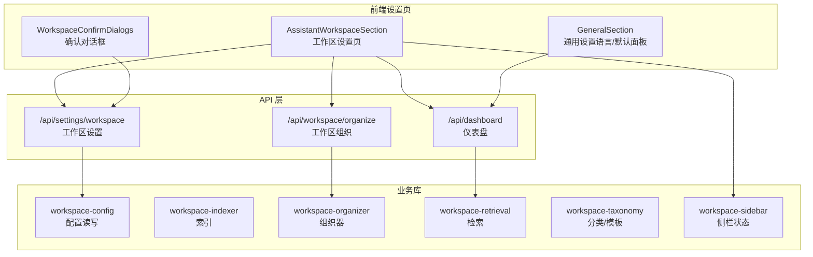
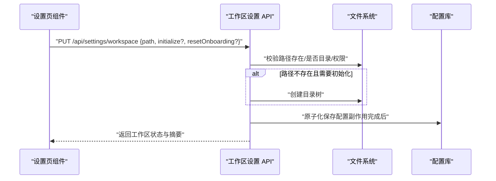
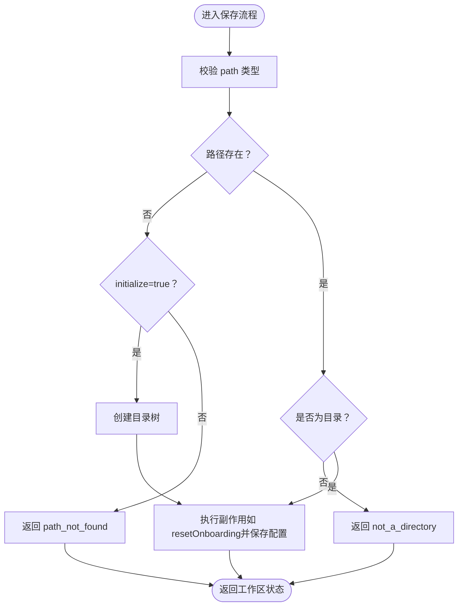
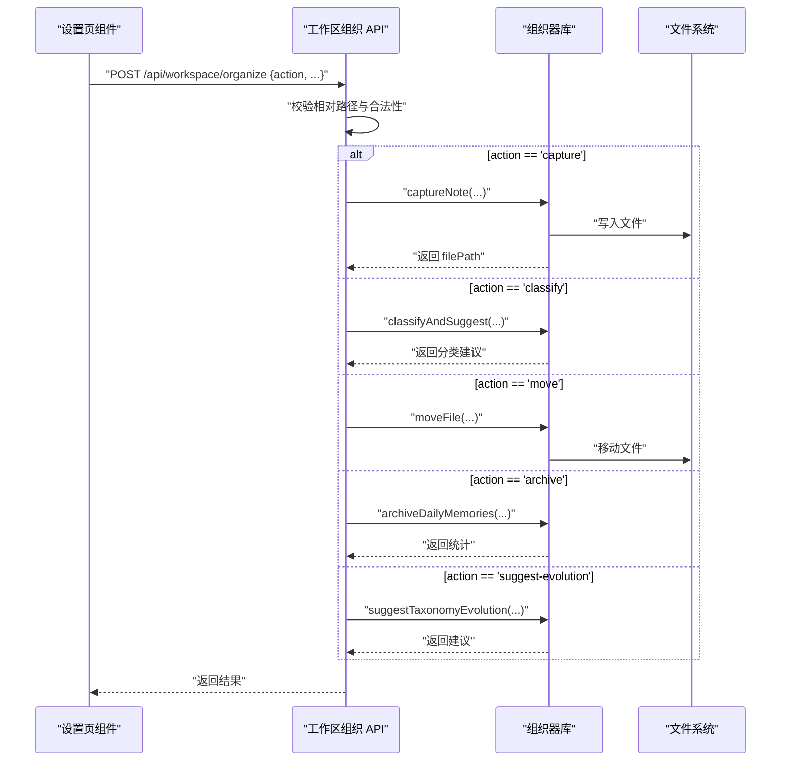
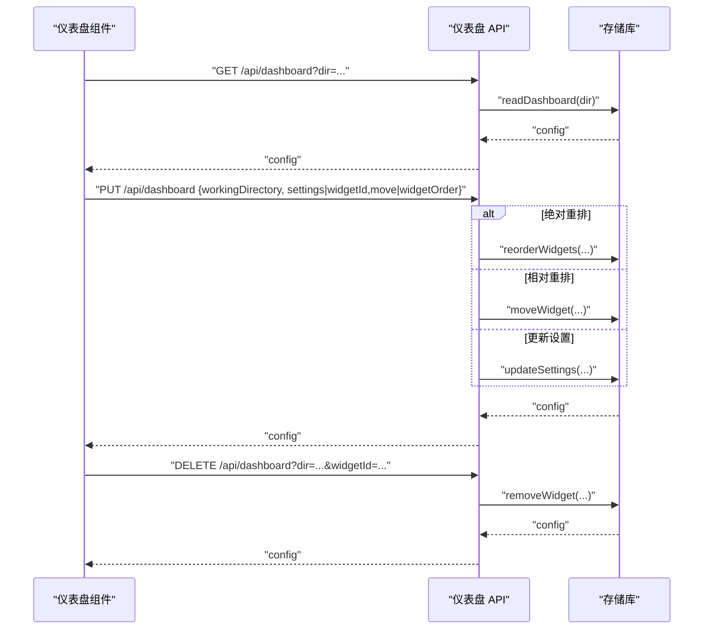
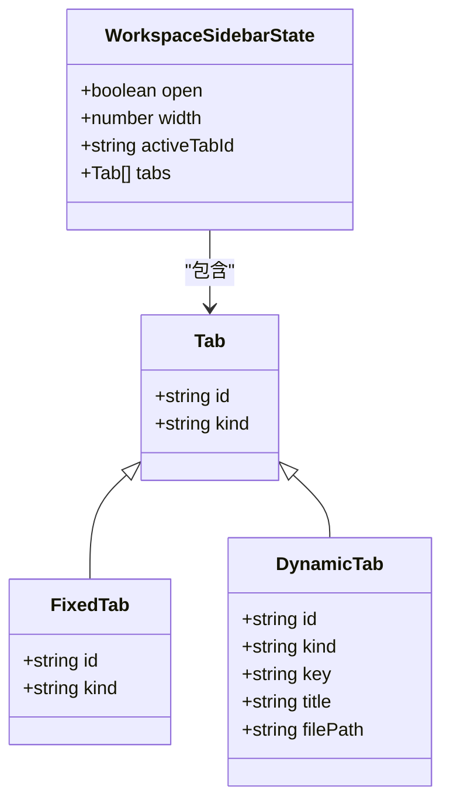
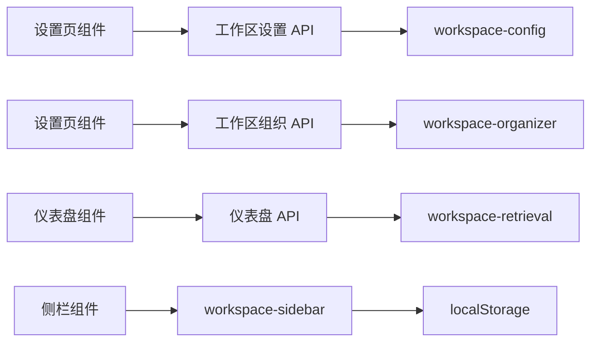

# 工作区设置 API

<cite>
**本文引用的文件**
- [src/app/api/settings/workspace/route.ts](file://src/app/api/settings/workspace/route.ts)
- [src/app/api/workspace/organize/route.ts](file://src/app/api/workspace/organize/route.ts)
- [src/app/api/dashboard/route.ts](file://src/app/api/dashboard/route.ts)
- [src/lib/workspace-sidebar.ts](file://src/lib/workspace-sidebar.ts)
- [src/hooks/useWorkspaceSidebar.tsx](file://src/hooks/useWorkspaceSidebar.tsx)
- [src/components/settings/AssistantWorkspaceSection.tsx](file://src/components/settings/AssistantWorkspaceSection.tsx)
- [src/components/settings/WorkspaceConfirmDialogs.tsx](file://src/components/settings/WorkspaceConfirmDialogs.tsx)
- [src/components/settings/GeneralSection.tsx](file://src/components/settings/GeneralSection.tsx)
- [src/lib/assistant-workspace.ts](file://src/lib/assistant-workspace.ts)
- [src/lib/workspace-config.ts](file://src/lib/workspace-config.ts)
- [src/lib/workspace-indexer.ts](file://src/lib/workspace-indexer.ts)
- [src/lib/workspace-organizer.ts](file://src/lib/workspace-organizer.ts)
- [src/lib/workspace-retrieval.ts](file://src/lib/workspace-retrieval.ts)
- [src/lib/workspace-taxonomy.ts](file://src/lib/workspace-taxonomy.ts)
- [docs/handover/assistant-workspace.md](file://docs/handover/assistant-workspace.md)
</cite>

## 目录
1. [简介](#简介)
2. [项目结构](#项目结构)
3. [核心组件](#核心组件)
4. [架构总览](#架构总览)
5. [详细组件分析](#详细组件分析)
6. [依赖关系分析](#依赖关系分析)
7. [性能考量](#性能考量)
8. [故障排查指南](#故障排查指南)
9. [结论](#结论)
10. [附录](#附录)

## 简介
本文件面向“工作区设置 API”的设计与实现，覆盖工作区配置、面板布局、快捷方式与个性化设置等能力。内容基于仓库中的实际接口与实现，重点说明：
- 工作区路径选择与初始化流程
- 工作区仪表盘（Dashboard）的读取、更新与小部件管理
- 右侧工作区侧栏的状态持久化与交互逻辑
- 工作区组织与索引、检索、分类等能力
- 工作区模板、共享与版本控制的现状与扩展建议
- 导入导出、备份恢复与迁移升级的 API 规范与最佳实践

## 项目结构
工作区相关能力主要分布在以下区域：
- API 层：工作区设置、工作区组织、仪表盘
- 业务库：工作区配置、索引、组织器、检索、分类
- 前端设置页与侧栏：工作区设置 UI、确认对话框、侧栏状态管理
- 文档：工作区端点与流程说明

图表来源
- [src/components/settings/AssistantWorkspaceSection.tsx](file://src/components/settings/AssistantWorkspaceSection.tsx)
- [src/components/settings/WorkspaceConfirmDialogs.tsx](file://src/components/settings/WorkspaceConfirmDialogs.tsx)
- [src/components/settings/GeneralSection.tsx](file://src/components/settings/GeneralSection.tsx)
- [src/app/api/settings/workspace/route.ts](file://src/app/api/settings/workspace/route.ts)
- [src/app/api/workspace/organize/route.ts](file://src/app/api/workspace/organize/route.ts)
- [src/app/api/dashboard/route.ts](file://src/app/api/dashboard/route.ts)
- [src/lib/workspace-config.ts](file://src/lib/workspace-config.ts)
- [src/lib/workspace-indexer.ts](file://src/lib/workspace-indexer.ts)
- [src/lib/workspace-organizer.ts](file://src/lib/workspace-organizer.ts)
- [src/lib/workspace-retrieval.ts](file://src/lib/workspace-retrieval.ts)
- [src/lib/workspace-taxonomy.ts](file://src/lib/workspace-taxonomy.ts)
- [src/lib/workspace-sidebar.ts](file://src/lib/workspace-sidebar.ts)

章节来源
- [src/components/settings/AssistantWorkspaceSection.tsx](file://src/components/settings/AssistantWorkspaceSection.tsx)
- [src/components/settings/WorkspaceConfirmDialogs.tsx](file://src/components/settings/WorkspaceConfirmDialogs.tsx)
- [src/components/settings/GeneralSection.tsx](file://src/components/settings/GeneralSection.tsx)
- [src/app/api/settings/workspace/route.ts](file://src/app/api/settings/workspace/route.ts)
- [src/app/api/workspace/organize/route.ts](file://src/app/api/workspace/organize/route.ts)
- [src/app/api/dashboard/route.ts](file://src/app/api/dashboard/route.ts)
- [src/lib/workspace-sidebar.ts](file://src/lib/workspace-sidebar.ts)

## 核心组件
- 工作区设置 API：负责工作区路径的读取、校验、初始化与保存，支持原子化副作用（初始化/重置引导）
- 工作区组织 API：提供 capture/classify/move/archive/suggest-evolution 等组织动作，并进行路径安全校验
- 仪表盘 API：读取/更新/移动/删除仪表盘小部件，支持绝对顺序重排与相对顺序重排
- 工作区侧栏：右侧面板的打开/关闭、宽度、活动标签页与动态标签页列表的持久化
- 通用设置：语言、默认面板等个性化选项

章节来源
- [src/app/api/settings/workspace/route.ts](file://src/app/api/settings/workspace/route.ts)
- [src/app/api/workspace/organize/route.ts](file://src/app/api/workspace/organize/route.ts)
- [src/app/api/dashboard/route.ts](file://src/app/api/dashboard/route.ts)
- [src/lib/workspace-sidebar.ts](file://src/lib/workspace-sidebar.ts)
- [src/components/settings/GeneralSection.tsx](file://src/components/settings/GeneralSection.tsx)

## 架构总览
下图展示了工作区设置与组织的关键调用链路及数据流。

图表来源
- [src/app/api/settings/workspace/route.ts](file://src/app/api/settings/workspace/route.ts)
- [src/lib/workspace-config.ts](file://src/lib/workspace-config.ts)

## 详细组件分析

### 工作区设置 API
- 功能要点
  - GET：返回当前工作区路径、有效性、状态与分类体系（taxonomy）
  - PUT：原子保存工作区路径，支持 initialize（创建目录）与 resetOnboarding（重置引导）
  - 预检接口：/api/workspace/inspect 提供存在性、可读写性、工作区状态与摘要
- 数据结构
  - 请求体字段：path（字符串）、initialize（布尔，可选）、resetOnboarding（布尔，可选）
  - 返回体字段：valid（布尔）、reason（字符串，可选）、status（字符串）、summary（对象，可选）、taxonomy（对象，可选）
- 错误码
  - path_not_found：路径不存在
  - not_a_directory：非目录
  - not_readable / not_writable：权限不足
- 安全性
  - 初始化仅在显式请求 initialize=true 时创建目录
  - 所有副作用在配置写入成功后才生效，保证原子性

图表来源
- [src/app/api/settings/workspace/route.ts](file://src/app/api/settings/workspace/route.ts)

章节来源
- [src/app/api/settings/workspace/route.ts](file://src/app/api/settings/workspace/route.ts)
- [src/components/settings/AssistantWorkspaceSection.tsx](file://src/components/settings/AssistantWorkspaceSection.tsx)
- [src/components/settings/WorkspaceConfirmDialogs.tsx](file://src/components/settings/WorkspaceConfirmDialogs.tsx)
- [docs/handover/assistant-workspace.md](file://docs/handover/assistant-workspace.md)

### 工作区组织 API
- 功能要点
  - 支持的动作：capture（捕获笔记）、classify（分类与建议）、move（移动文件）、archive（归档记忆）、suggest-evolution（建议分类演进）
  - 路径校验：强制相对路径、防止逃逸工作区根目录
- 数据结构
  - 请求体字段：action（枚举）、title/content（用于 capture）、filePath（用于 classify/move）、fromPath/toPath（用于 move）
  - 返回体字段：success（布尔）、filePath（当 capture 成功时）、suggestions（当 suggest-evolution 成功时）、统计结果（当 archive 成功时）
- 错误处理
  - 路径逃逸或不允许访问时返回 400
  - 其他异常返回 500

图表来源
- [src/app/api/workspace/organize/route.ts](file://src/app/api/workspace/organize/route.ts)
- [src/lib/workspace-organizer.ts](file://src/lib/workspace-organizer.ts)

章节来源
- [src/app/api/workspace/organize/route.ts](file://src/app/api/workspace/organize/route.ts)
- [src/lib/workspace-organizer.ts](file://src/lib/workspace-organizer.ts)

### 仪表盘 API
- 功能要点
  - GET：按工作区目录读取仪表盘配置
  - PUT：支持三种模式
    - 绝对顺序重排：传入 widgetOrder
    - 相对顺序重排：传入 widgetId + move
    - 更新设置：传入 settings
  - DELETE：按工作区目录与 widgetId 删除小部件
- 数据结构
  - 请求体字段：workingDirectory（必需）、settings（可选）、widgetId（可选）、move（可选）、widgetOrder（可选）
  - 返回体字段：config（仪表盘配置对象）

图表来源
- [src/app/api/dashboard/route.ts](file://src/app/api/dashboard/route.ts)

章节来源
- [src/app/api/dashboard/route.ts](file://src/app/api/dashboard/route.ts)

### 工作区侧栏状态管理
- 功能要点
  - 状态持久化：以 localStorage 为后端，键名为 workspace::cwd::sessionId
  - 状态字段：open（布尔）、width（数值）、activeTabId（字符串）、tabs（数组）
  - 固定标签与动态标签：固定标签（如 git、widget）与动态标签（按打开文件生成）
  - 宽度约束：最小/最大/默认宽度
- 生命周期
  - 初始状态：关闭、默认宽度、固定标签、git 激活
  - 打开/关闭、调整宽度、切换活动标签、关闭动态标签、新增动态标签

图表来源
- [src/lib/workspace-sidebar.ts](file://src/lib/workspace-sidebar.ts)

章节来源
- [src/lib/workspace-sidebar.ts](file://src/lib/workspace-sidebar.ts)
- [src/hooks/useWorkspaceSidebar.tsx](file://src/hooks/useWorkspaceSidebar.tsx)

### 通用设置与个性化
- 语言选择：通过 Select 组件切换 locale，并持久化到设置
- 默认面板：可选择 none/file_tree/git 等作为默认打开的面板
- Sentry 错误上报开关：可按语言环境启用/禁用

章节来源
- [src/components/settings/GeneralSection.tsx](file://src/components/settings/GeneralSection.tsx)

## 依赖关系分析
- 前端设置页依赖 API 层与业务库，API 层再依赖文件系统与配置存储
- 仪表盘 API 依赖检索与存储库
- 工作区侧栏状态依赖浏览器 localStorage 与 React 状态管理
- 组织器 API 依赖组织器库与文件系统

图表来源
- [src/components/settings/AssistantWorkspaceSection.tsx](file://src/components/settings/AssistantWorkspaceSection.tsx)
- [src/app/api/settings/workspace/route.ts](file://src/app/api/settings/workspace/route.ts)
- [src/app/api/workspace/organize/route.ts](file://src/app/api/workspace/organize/route.ts)
- [src/app/api/dashboard/route.ts](file://src/app/api/dashboard/route.ts)
- [src/lib/workspace-sidebar.ts](file://src/lib/workspace-sidebar.ts)
- [src/lib/workspace-config.ts](file://src/lib/workspace-config.ts)
- [src/lib/workspace-organizer.ts](file://src/lib/workspace-organizer.ts)
- [src/lib/workspace-retrieval.ts](file://src/lib/workspace-retrieval.ts)

章节来源
- [src/components/settings/AssistantWorkspaceSection.tsx](file://src/components/settings/AssistantWorkspaceSection.tsx)
- [src/app/api/settings/workspace/route.ts](file://src/app/api/settings/workspace/route.ts)
- [src/app/api/workspace/organize/route.ts](file://src/app/api/workspace/organize/route.ts)
- [src/app/api/dashboard/route.ts](file://src/app/api/dashboard/route.ts)
- [src/lib/workspace-sidebar.ts](file://src/lib/workspace-sidebar.ts)

## 性能考量
- 仪表盘绝对重排：通过一次性传入完整顺序避免多次往返，降低竞态风险
- 侧栏状态：仅在切换工作区/会话时从 localStorage 水合，减少不必要的 IO
- 组织器动作：move/capture/archive 等操作涉及文件系统 IO，建议在后台任务中执行并提供进度反馈
- 检索与索引：索引重建为重量级操作，应限制触发频率并提供取消机制

## 故障排查指南
- 工作区设置
  - 路径不存在：检查 initialize 参数是否为 true；若为 false 将返回 path_not_found
  - 非目录：确保传入的是目录而非文件
  - 权限问题：确认目录具备读写权限
- 仪表盘
  - 重排失败：确认 widgetOrder 是否为完整顺序；相对重排需提供 widgetId 与 move
  - 删除失败：确认 dir 与 widgetId 参数是否齐全
- 侧栏
  - 切换会话后标签丢失：确认 localStorage 中的键名是否包含 sessionId；确保在挂载后进行水合
- 组织器
  - 路径逃逸错误：确保所有相对路径均位于工作区根目录内

章节来源
- [src/app/api/settings/workspace/route.ts](file://src/app/api/settings/workspace/route.ts)
- [src/app/api/dashboard/route.ts](file://src/app/api/dashboard/route.ts)
- [src/lib/workspace-sidebar.ts](file://src/lib/workspace-sidebar.ts)
- [src/app/api/workspace/organize/route.ts](file://src/app/api/workspace/organize/route.ts)

## 结论
工作区设置 API 已形成较为完整的闭环：从路径选择与初始化，到仪表盘与侧栏的个性化，再到组织与索引检索能力。建议后续在以下方面完善：
- 模板系统与共享：引入 taxonomy.json 的标准化模板与共享协议
- 版本控制：为配置与索引增加版本号与变更日志
- 导入导出：提供工作区配置与数据的打包导出/导入
- 协作同步：基于版本控制与冲突解决策略实现多用户同步

## 附录

### API 规范与示例（路径与方法）
- 工作区设置
  - GET /api/settings/workspace：返回工作区状态与分类体系
  - PUT /api/settings/workspace：保存工作区路径，支持 initialize 与 resetOnboarding
- 工作区组织
  - POST /api/workspace/organize：支持 capture/classify/move/archive/suggest-evolution
- 仪表盘
  - GET /api/dashboard?dir=...：读取配置
  - PUT /api/dashboard：支持绝对/相对重排与设置更新
  - DELETE /api/dashboard?dir=...&widgetId=...：删除小部件

章节来源
- [src/app/api/settings/workspace/route.ts](file://src/app/api/settings/workspace/route.ts)
- [src/app/api/workspace/organize/route.ts](file://src/app/api/workspace/organize/route.ts)
- [src/app/api/dashboard/route.ts](file://src/app/api/dashboard/route.ts)
- [docs/handover/assistant-workspace.md](file://docs/handover/assistant-workspace.md)