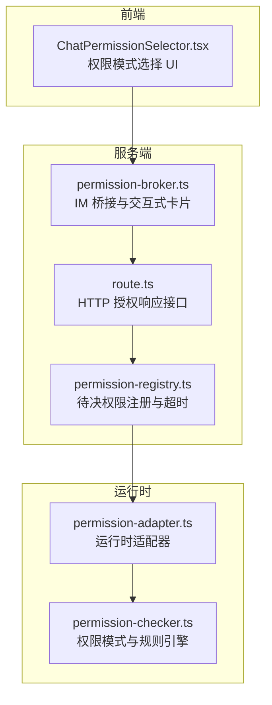
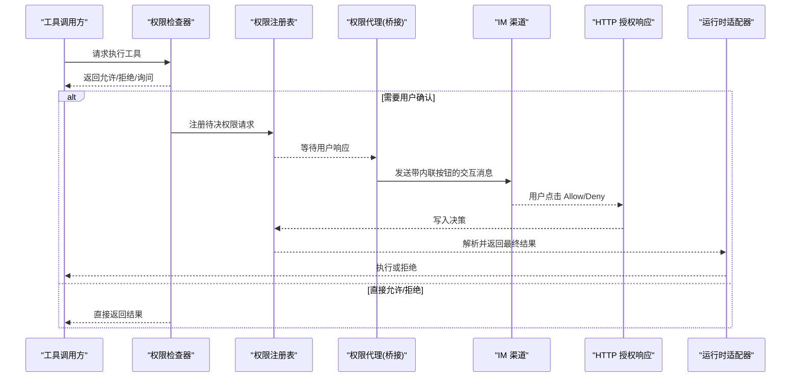
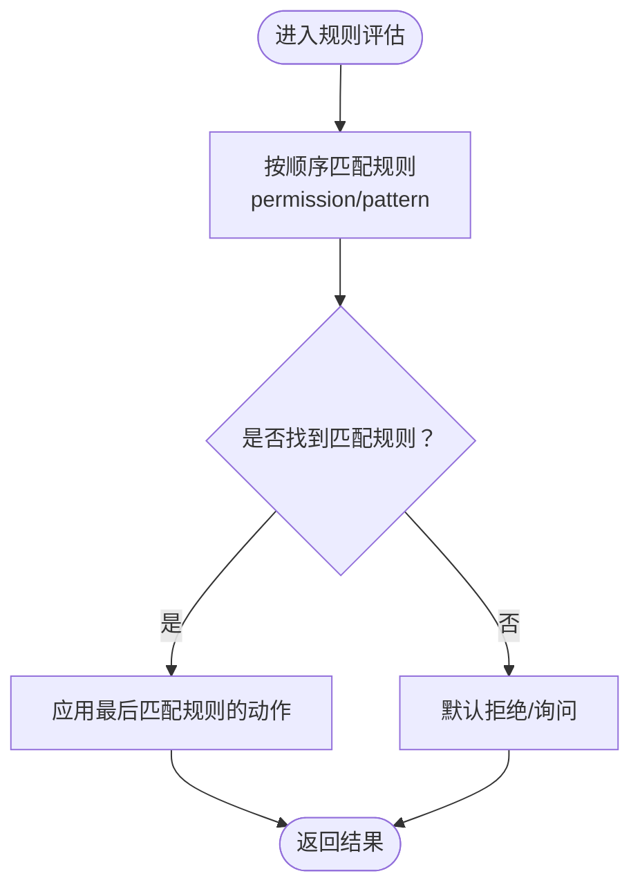
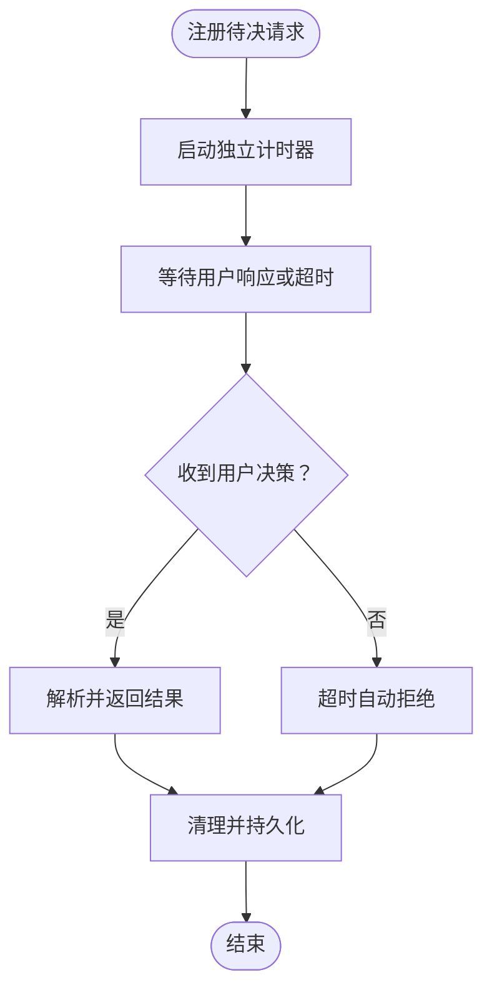
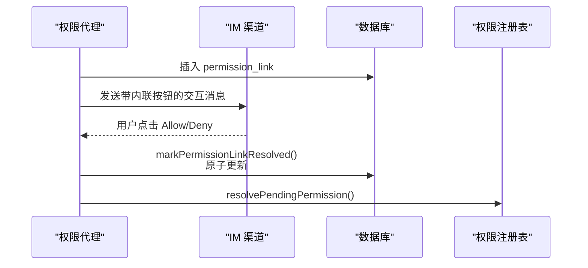
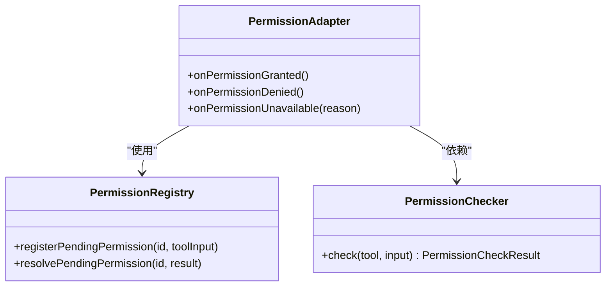
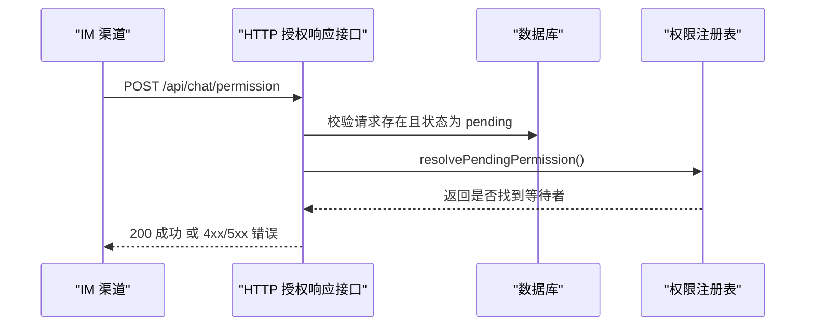
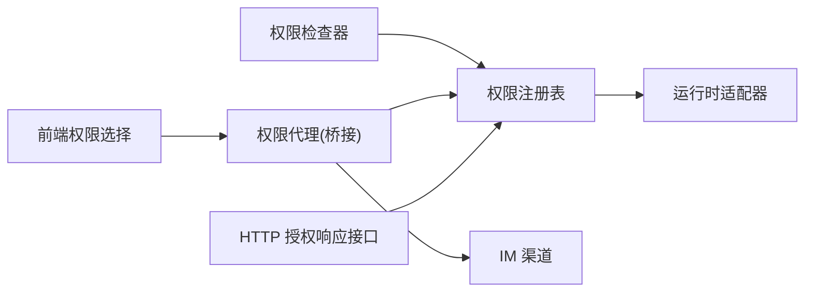

# 权限设置 API

<cite>
**本文引用的文件**
- [permission-checker.ts](file://src/lib/permission-checker.ts)
- [permission-registry.ts](file://src/lib/permission-registry.ts)
- [permission-broker.ts](file://src/lib/bridge/permission-broker.ts)
- [permission-adapter.ts](file://src/lib/runtime/permission-adapter.ts)
- [route.ts](file://src/app/api/chat/permission/route.ts)
- [ChatPermissionSelector.tsx](file://src/components/chat/ChatPermissionSelector.tsx)
- [permission-adapter.test.ts](file://src/__tests__/unit/permission-adapter.test.ts)
- [permission-broker-bridge.manual-test.ts](file://src/__tests__/unit/permission-broker-bridge.manual-test.ts)
- [permission-event-contract.test.ts](file://src/__tests__/unit/permission-event-contract.test.ts)
- [agent-tools-permission-allowlist.test.ts](file://src/__tests__/unit/agent-tools-permission-allowlist.test.ts)
- [permission-system-decoupling.md](file://docs/research/permission-system-decoupling.md)
- [bridge-system.md](file://docs/handover/bridge-system.md)
</cite>

## 目录
1. [简介](#简介)
2. [项目结构](#项目结构)
3. [核心组件](#核心组件)
4. [架构总览](#架构总览)
5. [详细组件分析](#详细组件分析)
6. [依赖分析](#依赖分析)
7. [性能考虑](#性能考虑)
8. [故障排查指南](#故障排查指南)
9. [结论](#结论)
10. [附录](#附录)

## 简介
本文件系统化梳理权限设置 API 的设计与实现，覆盖权限分配、角色管理、访问控制与安全策略等能力。重点说明权限数据结构、层级关系与继承规则；解释动态验证机制、上下文感知与条件授权；给出权限审计、日志记录与合规检查的 API 规范；提供角色模板、权限矩阵与批量授权的操作指南；展示细粒度权限控制、临时授权与权限回收的实现方法。

## 项目结构
权限体系由三层组成：
- 运行时权限检查器：定义权限模式与规则引擎，负责对工具调用进行即时判定。
- 权限注册表：维护待决权限请求的生命周期，支持超时自动拒绝与内存/数据库持久化。
- 权限代理与桥接层：在 IM 渠道中转发交互式权限卡片，处理用户响应并回传运行时。

图表来源
- [permission-checker.ts:1-120](file://src/lib/permission-checker.ts#L1-L120)
- [permission-registry.ts:34-120](file://src/lib/permission-registry.ts#L34-L120)
- [permission-broker.ts:1-185](file://src/lib/bridge/permission-broker.ts#L1-L185)
- [permission-adapter.ts:1-200](file://src/lib/runtime/permission-adapter.ts#L1-L200)
- [route.ts:1-74](file://src/app/api/chat/permission/route.ts#L1-L74)
- [ChatPermissionSelector.tsx:104-154](file://src/components/chat/ChatPermissionSelector.tsx#L104-L154)

章节来源
- [permission-checker.ts:1-120](file://src/lib/permission-checker.ts#L1-L120)
- [permission-registry.ts:34-120](file://src/lib/permission-registry.ts#L34-L120)
- [permission-broker.ts:1-185](file://src/lib/bridge/permission-broker.ts#L1-L185)
- [permission-adapter.ts:1-200](file://src/lib/runtime/permission-adapter.ts#L1-L200)
- [route.ts:1-74](file://src/app/api/chat/permission/route.ts#L1-L74)
- [ChatPermissionSelector.tsx:104-154](file://src/components/chat/ChatPermissionSelector.tsx#L104-L154)

## 核心组件
- 权限模式与规则引擎
  - 模式：探索(explore)、标准(normal)、信任(trust)三级模式，分别对应只读、标准授权与全量放行。
  - 规则：基于 OpenCode 风格的规则数组，采用 findLast 语义，最后匹配规则优先。
  - 安全基线：危险命令在信任模式下仍需显式允许或确认。
- 待决权限注册与超时
  - 为每个权限请求生成唯一 ID，并在超时后自动拒绝。
  - 支持内存态与数据库态双写，保证进程重启后的可恢复性。
- IM 桥接与交互式卡片
  - 将权限请求以带内联按钮的交互消息发送至 IM 渠道。
  - 基于 permission_link 原子更新防止重复审批与跨会话伪造。
- 运行时适配器
  - 将桥接层的用户决策转换为运行时可用的权限结果，支持更新权限集合与输入裁剪。

章节来源
- [permission-checker.ts:1-120](file://src/lib/permission-checker.ts#L1-L120)
- [permission-registry.ts:34-120](file://src/lib/permission-registry.ts#L34-L120)
- [permission-broker.ts:1-185](file://src/lib/bridge/permission-broker.ts#L1-L185)
- [permission-adapter.ts:1-200](file://src/lib/runtime/permission-adapter.ts#L1-L200)

## 架构总览
权限从“工具调用”到“用户确认”的完整链路如下：

图表来源
- [permission-checker.ts:1-120](file://src/lib/permission-checker.ts#L1-L120)
- [permission-registry.ts:34-120](file://src/lib/permission-registry.ts#L34-L120)
- [permission-broker.ts:1-185](file://src/lib/bridge/permission-broker.ts#L1-L185)
- [route.ts:1-74](file://src/app/api/chat/permission/route.ts#L1-L74)
- [permission-adapter.ts:1-200](file://src/lib/runtime/permission-adapter.ts#L1-L200)

## 详细组件分析

### 组件一：权限模式与规则引擎
- 数据结构
  - 权限模式：explore、normal、trust
  - 权限动作：allow、deny、ask
  - 权限规则：permission、pattern、action
- 规则继承与覆盖
  - 采用 findLast 语义，后匹配规则覆盖前匹配规则，形成“具体优先”的继承规则。
- 危险命令安全
  - 即使在 trust 模式下，危险命令仍需显式允许或经确认流程。

图表来源
- [permission-checker.ts:1-120](file://src/lib/permission-checker.ts#L1-L120)

章节来源
- [permission-checker.ts:1-120](file://src/lib/permission-checker.ts#L1-L120)

### 组件二：待决权限注册与超时
- 生命周期
  - 注册：为每个请求生成唯一 ID，启动独立计时器，超时后自动拒绝。
  - 超时：TIMEOUT_MS 后自动拒绝，同时持久化状态。
  - 拒绝：可由外部触发，清理内存并持久化。
- 存储一致性
  - 内存态与数据库态双写，避免进程重启导致的状态丢失。

图表来源
- [permission-registry.ts:34-120](file://src/lib/permission-registry.ts#L34-L120)

章节来源
- [permission-registry.ts:34-120](file://src/lib/permission-registry.ts#L34-L120)

### 组件三：IM 桥接与交互式卡片
- 交互流程
  - 将权限请求格式化为带内联按钮的交互消息，发送至 IM 渠道。
  - 通过 permission_link 原子更新确保同一请求不被重复审批。
  - 对不支持内联按钮的渠道（如 QQ、微信），采用文本命令方式处理。
- 自动放行
  - 当会话配置为 full_access 时，自动批准该请求。

图表来源
- [permission-broker.ts:1-185](file://src/lib/bridge/permission-broker.ts#L1-L185)
- [bridge-system.md:246-253](file://docs/handover/bridge-system.md#L246-L253)

章节来源
- [permission-broker.ts:1-185](file://src/lib/bridge/permission-broker.ts#L1-L185)
- [bridge-system.md:246-253](file://docs/handover/bridge-system.md#L246-L253)

### 组件四：运行时适配器
- 职责
  - 将用户决策转换为运行时可用的权限结果。
  - 支持更新权限集合与输入裁剪，满足细粒度控制需求。
- 事件契约
  - 提供 permission_granted、permission_denied、permission_unavailable 等事件类型，确保未知语义时保守默认。

图表来源
- [permission-adapter.ts:1-200](file://src/lib/runtime/permission-adapter.ts#L1-L200)
- [permission-checker.ts:1-120](file://src/lib/permission-checker.ts#L1-L120)
- [permission-registry.ts:34-120](file://src/lib/permission-registry.ts#L34-L120)

章节来源
- [permission-adapter.ts:1-200](file://src/lib/runtime/permission-adapter.ts#L1-L200)
- [permission-adapter.test.ts:158-187](file://src/__tests__/unit/permission-adapter.test.ts#L158-L187)

### 组件五：HTTP 授权响应接口
- 接口职责
  - 处理来自 IM 的用户授权响应，校验请求存在且未被处理，写入最终决策并返回成功。
- 错误处理
  - 缺少必要字段、请求不存在、已处理、等待者消失、服务器错误等场景均有明确状态码与错误信息。

图表来源
- [route.ts:1-74](file://src/app/api/chat/permission/route.ts#L1-L74)
- [permission-registry.ts:34-120](file://src/lib/permission-registry.ts#L34-L120)

章节来源
- [route.ts:1-74](file://src/app/api/chat/permission/route.ts#L1-L74)

### 组件六：前端权限模式选择
- 功能
  - 提供“默认”和“完全访问”两种权限模式选择，其中“完全访问”带有警告弹窗确认。
- 交互
  - 选择后触发应用变更流程，结合后端桥接层完成权限生效。

章节来源
- [ChatPermissionSelector.tsx:104-154](file://src/components/chat/ChatPermissionSelector.tsx#L104-L154)

## 依赖分析
- 组件耦合
  - 权限检查器与规则引擎低耦合，便于扩展新权限类别与规则。
  - 权限注册表与运行时适配器通过统一结果接口解耦。
  - 桥接层与 IM 渠道通过适配器抽象解耦。
- 外部依赖
  - 数据库用于持久化权限请求与链接状态。
  - IM 渠道提供内联按钮交互能力，不支持时采用文本命令降级。

图表来源
- [permission-checker.ts:1-120](file://src/lib/permission-checker.ts#L1-L120)
- [permission-registry.ts:34-120](file://src/lib/permission-registry.ts#L34-L120)
- [permission-broker.ts:1-185](file://src/lib/bridge/permission-broker.ts#L1-L185)
- [route.ts:1-74](file://src/app/api/chat/permission/route.ts#L1-L74)
- [ChatPermissionSelector.tsx:104-154](file://src/components/chat/ChatPermissionSelector.tsx#L104-L154)

章节来源
- [permission-checker.ts:1-120](file://src/lib/permission-checker.ts#L1-L120)
- [permission-registry.ts:34-120](file://src/lib/permission-registry.ts#L34-L120)
- [permission-broker.ts:1-185](file://src/lib/bridge/permission-broker.ts#L1-L185)
- [route.ts:1-74](file://src/app/api/chat/permission/route.ts#L1-L74)
- [ChatPermissionSelector.tsx:104-154](file://src/components/chat/ChatPermissionSelector.tsx#L104-L154)

## 性能考虑
- 计时器优化
  - 使用 .unref() 避免超时计时器阻止进程优雅退出。
- 去重与缓存
  - 最近转发去重表，30 秒窗口内抑制重复转发，降低 IM 流量与重复交互。
- 并发模型
  - 同会话串行、跨会话并行，减少资源竞争与冲突。

章节来源
- [permission-registry.ts:34-120](file://src/lib/permission-registry.ts#L34-L120)
- [permission-broker.ts:1-185](file://src/lib/bridge/permission-broker.ts#L1-L185)
- [bridge-system.md:240-253](file://docs/handover/bridge-system.md#L240-L253)

## 故障排查指南
- 常见错误与定位
  - 参数缺失：检查请求体是否包含 permissionRequestId 与 decision。
  - 请求不存在：确认数据库中是否存在该 ID 的权限请求。
  - 已处理：确认请求状态是否仍为 pending。
  - 等待者消失：进程重启导致内存等待者丢失，需重新发起请求。
  - 服务器错误：查看后端异常堆栈与日志。
- 事件契约与测试
  - 使用单元测试验证 permission_unavailable 的保守默认行为与 permission_event_contract。
  - agent-tools-permission-allowlist 测试确保工具白名单与权限矩阵一致。

章节来源
- [route.ts:1-74](file://src/app/api/chat/permission/route.ts#L1-L74)
- [permission-adapter.test.ts:158-187](file://src/__tests__/unit/permission-adapter.test.ts#L158-L187)
- [permission-event-contract.test.ts:1-200](file://src/__tests__/unit/permission-event-contract.test.ts#L1-L200)
- [agent-tools-permission-allowlist.test.ts:1-200](file://src/__tests__/unit/agent-tools-permission-allowlist.test.ts#L1-L200)

## 结论
本权限体系通过“模式+规则+注册表+桥接+适配器”的分层设计，实现了从工具调用到用户确认的闭环控制。其特性包括：
- 明确的权限模式与规则继承，支持细粒度控制与安全基线。
- 待决请求的超时与持久化保障，提升可靠性。
- IM 交互式卡片与原子更新，确保审批安全与防重。
- 事件契约与测试覆盖，保证未知语义下的保守默认。

## 附录

### API 规范：HTTP 授权响应接口
- 方法与路径
  - POST /api/chat/permission
- 请求头
  - Content-Type: application/json
- 请求体
  - permissionRequestId: 字符串，必填
  - decision: 对象，必填
    - behavior: 字符串，枚举值 'allow' 或 'deny'
    - updatedPermissions: 数组，可选，当 behavior='allow' 时可包含更新后的权限集合
    - updatedInput: 对象，可选，当 behavior='allow' 时可包含更新后的输入
    - message: 字符串，deny 时可选
- 响应
  - 200 OK：{ success: true }
  - 400 Bad Request：缺少必要字段
  - 404 Not Found：权限请求不存在
  - 409 Conflict：权限请求已处理
  - 410 Gone：请求存在但内存等待者丢失
  - 500 Internal Server Error：服务器内部错误

章节来源
- [route.ts:1-74](file://src/app/api/chat/permission/route.ts#L1-L74)

### 权限数据结构与规则
- 权限模式
  - explore：只读，禁止写入与危险命令
  - normal：标准授权，自动允许读取与编辑，bash 命令需确认
  - trust：全量放行，但仍受危险命令显式允许约束
- 权限规则
  - permission：工具名或通配符 '*'
  - pattern：工具输入的 glob 模式，如 'rm *'、'*.env'
  - action：allow/deny/ask

章节来源
- [permission-checker.ts:1-120](file://src/lib/permission-checker.ts#L1-L120)

### 角色模板与权限矩阵
- 角色模板
  - 默认：explore 模式，仅允许读取与常见只读 bash 命令
  - 完全访问：trust 模式，自动放行（需谨慎）
- 权限矩阵示例
  - Read/Glob/Grep：explore 下允许，其余模式通常允许
  - Write/Edit/Bash：explore 下拒绝，normal/trust 下根据规则与确认决定

章节来源
- [permission-checker.ts:36-55](file://src/lib/permission-checker.ts#L36-L55)
- [ChatPermissionSelector.tsx:104-154](file://src/components/chat/ChatPermissionSelector.tsx#L104-L154)

### 批量授权操作指南
- 前置条件
  - 确认目标会话与工具集
  - 准备权限规则与输入模式
- 步骤
  1) 在 UI 中选择目标权限模式
  2) 桥接层将批量请求转化为多个单次请求
  3) 用户逐项确认或批量自动放行（视渠道与配置而定）
  4) 通过 HTTP 接口提交决策，注册表解析并返回结果

章节来源
- [permission-broker.ts:1-185](file://src/lib/bridge/permission-broker.ts#L1-L185)
- [route.ts:1-74](file://src/app/api/chat/permission/route.ts#L1-L74)

### 细粒度权限控制、临时授权与权限回收
- 细粒度控制
  - 通过规则中的 pattern 精准限定工具输入范围，如仅允许特定文件后缀或特定命令组合。
- 临时授权
  - 使用独立计时器的待决请求，在超时后自动拒绝，避免长期悬挂。
- 权限回收
  - 通过运行时适配器更新权限集合，移除不再需要的权限条目；或在 UI 中切换回更严格的模式。

章节来源
- [permission-checker.ts:1-120](file://src/lib/permission-checker.ts#L1-L120)
- [permission-registry.ts:34-120](file://src/lib/permission-registry.ts#L34-L120)
- [permission-adapter.ts:1-200](file://src/lib/runtime/permission-adapter.ts#L1-L200)

### 审计、日志与合规检查
- 审计点
  - 权限请求创建、超时、拒绝、允许、更新权限集合、更新输入等关键事件均应记录。
- 日志
  - 桥接层记录最近转发去重、原子更新失败等告警日志。
- 合规
  - 严格遵循 permission_unavailable 的保守默认契约，确保未知语义不被误判为允许。

章节来源
- [permission-broker.ts:1-185](file://src/lib/bridge/permission-broker.ts#L1-L185)
- [permission-adapter.test.ts:158-187](file://src/__tests__/unit/permission-adapter.test.ts#L158-L187)
- [permission-event-contract.test.ts:1-200](file://src/__tests__/unit/permission-event-contract.test.ts#L1-L200)

### 设计文档参考
- 权限系统解耦研究
  - 关注权限系统的模块化与可演进性设计
- 桥接系统安全要点
  - 包含并发模型、权限回调安全与输入校验等安全实践

章节来源
- [permission-system-decoupling.md:1-200](file://docs/research/permission-system-decoupling.md#L1-L200)
- [bridge-system.md:240-253](file://docs/handover/bridge-system.md#L240-L253)