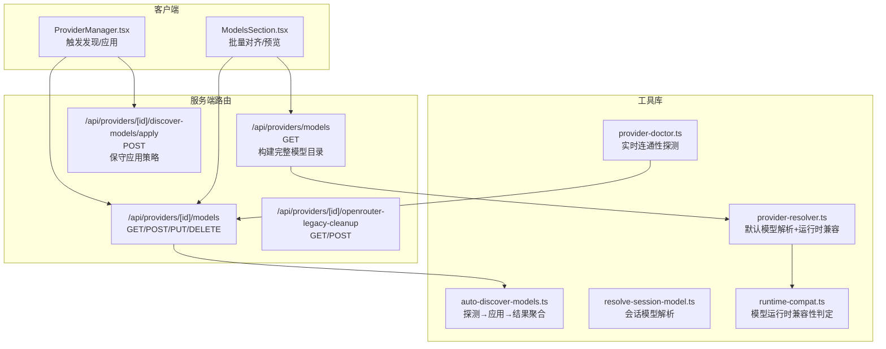
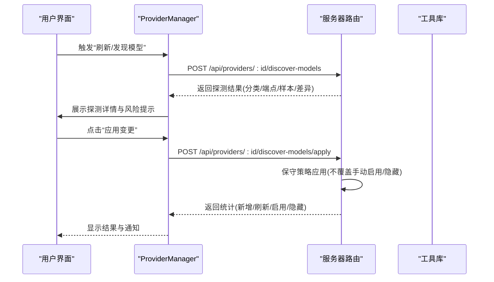
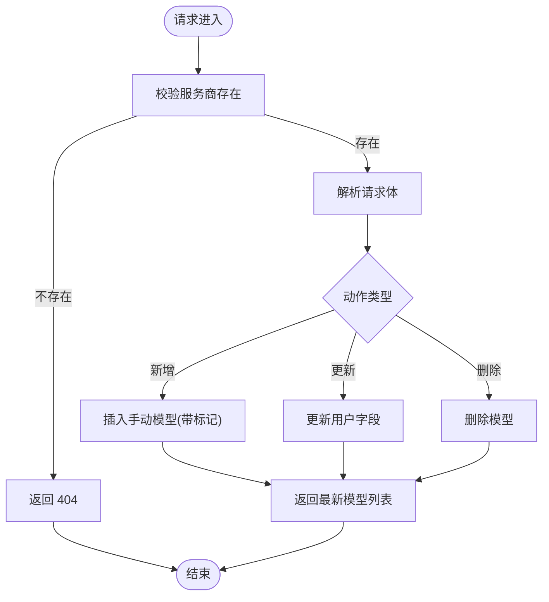
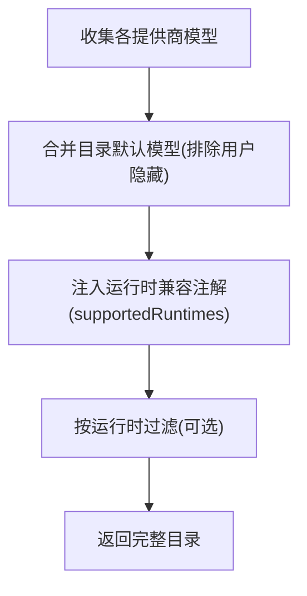
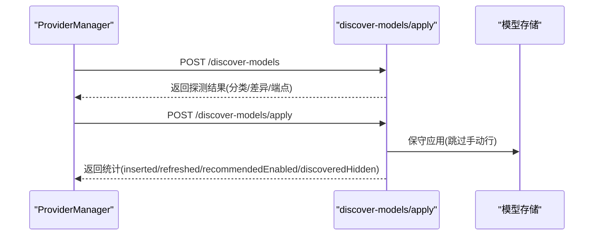
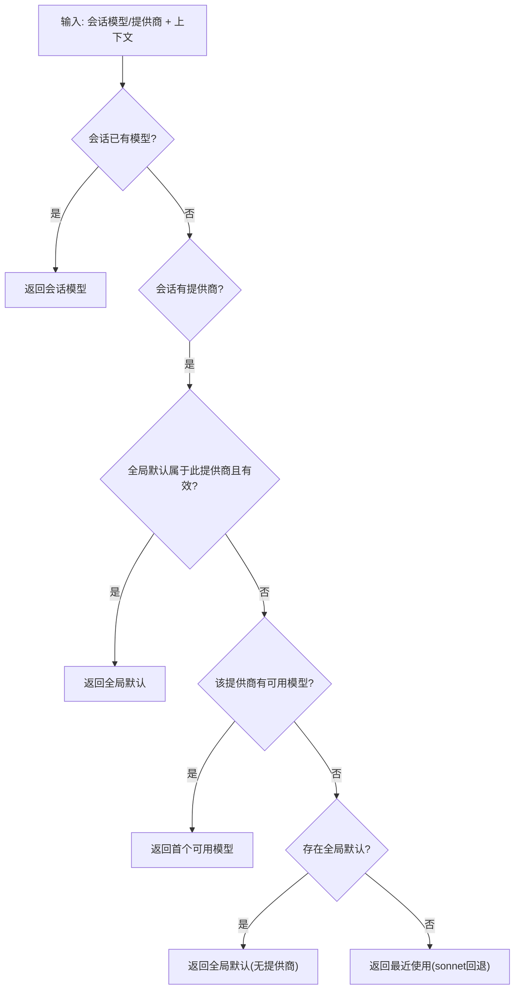
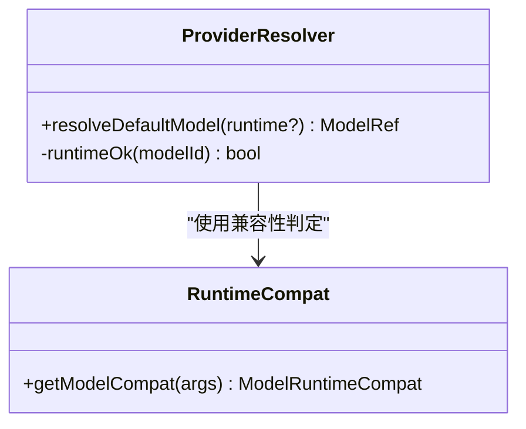
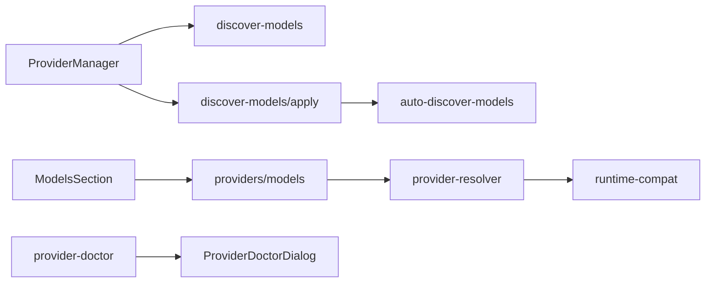

# 模型设置 API

<cite>
**本文档引用的文件**
- [src/app/api/providers/[id]/discover-models/apply/route.ts](file://src/app/api/providers/[id]/discover-models/apply/route.ts)
- [src/app/api/providers/[id]/models/route.ts](file://src/app/api/providers/[id]/models/route.ts)
- [src/app/api/providers/models/route.ts](file://src/app/api/providers/models/route.ts)
- [src/lib/auto-discover-models.ts](file://src/lib/auto-discover-models.ts)
- [src/lib/resolve-session-model.ts](file://src/lib/resolve-session-model.ts)
- [src/lib/provider-resolver.ts](file://src/lib/provider-resolver.ts)
- [src/lib/runtime-compat.ts](file://src/lib/runtime-compat.ts)
- [src/components/settings/ProviderManager.tsx](file://src/components/settings/ProviderManager.tsx)
- [src/components/settings/ModelsSection.tsx](file://src/components/settings/ModelsSection.tsx)
- [src/lib/provider-doctor.ts](file://src/lib/provider-doctor.ts)
- [src/components/settings/ProviderDoctorDialog.tsx](file://src/components/settings/ProviderDoctorDialog.tsx)
- [src/app/api/providers/[id]/openrouter-legacy-cleanup/route.ts](file://src/app/api/providers/[id]/openrouter-legacy-cleanup/route.ts)
</cite>

## 目录
1. [简介](#简介)
2. [项目结构](#项目结构)
3. [核心组件](#核心组件)
4. [架构总览](#架构总览)
5. [详细组件分析](#详细组件分析)
6. [依赖关系分析](#依赖关系分析)
7. [性能考虑](#性能考虑)
8. [故障排除指南](#故障排除指南)
9. [结论](#结论)
10. [附录](#附录)

## 简介
本文件系统化梳理“模型设置 API”的设计与实现，覆盖以下主题：
- 模型选择、默认模型设置、模型偏好配置
- 模型元数据结构、能力标识与兼容性检查
- 动态发现机制、版本管理与自动更新流程
- 模型测试、基准评估与性能监控 API 规范
- 模型切换、回滚与批量配置操作指南
- 不同使用场景下的模型推荐算法与智能选择策略

目标是帮助开发者与运维人员快速理解并正确使用模型设置相关接口。

## 项目结构
模型设置 API 主要由三类模块构成：
- 服务端路由：提供模型查询、新增、更新、删除与自动发现应用等接口
- 客户端组件：负责触发自动发现、展示差异与执行应用
- 工具库：负责会话模型解析、运行时兼容性判断、推荐策略与诊断

图表来源
- [src/components/settings/ProviderManager.tsx:170-209](file://src/components/settings/ProviderManager.tsx#L170-L209)
- [src/components/settings/ModelsSection.tsx:2166-2187](file://src/components/settings/ModelsSection.tsx#L2166-L2187)
- [src/app/api/providers/[id]/models/route.ts](file://src/app/api/providers/[id]/models/route.ts#L36-L160)
- [src/app/api/providers/models/route.ts:205-232](file://src/app/api/providers/models/route.ts#L205-L232)
- [src/app/api/providers/[id]/discover-models/apply/route.ts](file://src/app/api/providers/[id]/discover-models/apply/route.ts#L38-L62)
- [src/lib/auto-discover-models.ts:1-37](file://src/lib/auto-discover-models.ts#L1-L37)
- [src/lib/resolve-session-model.ts:1-78](file://src/lib/resolve-session-model.ts#L1-L78)
- [src/lib/provider-resolver.ts:1064-1092](file://src/lib/provider-resolver.ts#L1064-L1092)
- [src/lib/runtime-compat.ts:106-140](file://src/lib/runtime-compat.ts#L106-L140)
- [src/lib/provider-doctor.ts:849-890](file://src/lib/provider-doctor.ts#L849-L890)

章节来源
- [src/app/api/providers/[id]/models/route.ts](file://src/app/api/providers/[id]/models/route.ts#L36-L160)
- [src/app/api/providers/models/route.ts:205-232](file://src/app/api/providers/models/route.ts#L205-L232)
- [src/lib/auto-discover-models.ts:1-37](file://src/lib/auto-discover-models.ts#L1-L37)

## 核心组件
- 服务端路由层
  - 服务商模型管理：提供模型列表、新增、更新、删除接口
  - 全局模型目录：聚合各提供商模型，支持运行时兼容过滤
  - 自动发现应用：保守策略应用上游变更，避免覆盖用户手动配置
  - OpenRouter 清理：清理历史遗留推荐行
- 客户端组件层
  - ProviderManager：触发探测与应用，展示分类、端点、差异等信息
  - ModelsSection：批量对齐与预览，支持“仅启用推荐、其余隐藏”
- 工具库层
  - 会话模型解析：按优先级解析当前会话有效模型
  - 默认模型解析：结合全局默认与运行时兼容性
  - 运行时兼容性：基于能力标志与上游兼容性判定
  - 诊断工具：实时连通性探测与错误分类

章节来源
- [src/app/api/providers/[id]/models/route.ts](file://src/app/api/providers/[id]/models/route.ts#L36-L160)
- [src/app/api/providers/models/route.ts:205-232](file://src/app/api/providers/models/route.ts#L205-L232)
- [src/app/api/providers/[id]/discover-models/apply/route.ts](file://src/app/api/providers/[id]/discover-models/apply/route.ts#L38-L62)
- [src/components/settings/ProviderManager.tsx:170-209](file://src/components/settings/ProviderManager.tsx#L170-L209)
- [src/components/settings/ModelsSection.tsx:2166-2187](file://src/components/settings/ModelsSection.tsx#L2166-L2187)
- [src/lib/resolve-session-model.ts:1-78](file://src/lib/resolve-session-model.ts#L1-L78)
- [src/lib/provider-resolver.ts:1064-1092](file://src/lib/provider-resolver.ts#L1064-L1092)
- [src/lib/runtime-compat.ts:106-140](file://src/lib/runtime-compat.ts#L106-L140)
- [src/lib/provider-doctor.ts:849-890](file://src/lib/provider-doctor.ts#L849-L890)

## 架构总览
模型设置 API 的整体交互链路如下：

图表来源
- [src/components/settings/ProviderManager.tsx:170-209](file://src/components/settings/ProviderManager.tsx#L170-L209)
- [src/app/api/providers/[id]/discover-models/apply/route.ts](file://src/app/api/providers/[id]/discover-models/apply/route.ts#L38-L62)

章节来源
- [src/components/settings/ProviderManager.tsx:170-209](file://src/components/settings/ProviderManager.tsx#L170-L209)
- [src/app/api/providers/[id]/discover-models/apply/route.ts](file://src/app/api/providers/[id]/discover-models/apply/route.ts#L38-L62)

## 详细组件分析

### 1) 服务商模型管理接口
- GET /api/providers/[id]/models
  - 查询某服务商模型列表，支持 includeHidden 参数
  - 返回模型数组，包含显示名、上游模型 ID、能力标记、排序等
- POST /api/providers/[id]/models
  - 新增“手动模型”，标记 source='manual'、enable_source='manual_enabled'
  - 保护机制：避免被后续刷新覆盖
- PUT /api/providers/[id]/models
  - 更新模型用户字段：display_name、enabled、sort_order、capabilities_json
- DELETE /api/providers/[id]/models
  - 删除指定模型，并返回更新后的模型列表

图表来源
- [src/app/api/providers/[id]/models/route.ts](file://src/app/api/providers/[id]/models/route.ts#L36-L160)

章节来源
- [src/app/api/providers/[id]/models/route.ts](file://src/app/api/providers/[id]/models/route.ts#L36-L160)

### 2) 全局模型目录与运行时兼容
- GET /api/providers/models
  - 构建完整模型目录，合并数据库已存模型与目录默认模型
  - 过滤用户显式隐藏的模型
  - 服务端统一输出 per-model 的运行时兼容注解，UI 侧据此禁用不可用项

图表来源
- [src/app/api/providers/models/route.ts:205-232](file://src/app/api/providers/models/route.ts#L205-L232)
- [src/app/api/providers/models/route.ts:386-414](file://src/app/api/providers/models/route.ts#L386-L414)

章节来源
- [src/app/api/providers/models/route.ts:205-232](file://src/app/api/providers/models/route.ts#L205-L232)
- [src/app/api/providers/models/route.ts:386-414](file://src/app/api/providers/models/route.ts#L386-L414)

### 3) 自动发现与保守应用
- POST /api/providers/[id]/discover-models
  - 对指定服务商进行探测，返回分类、协议、端点、模型数量、样本与差异
- POST /api/providers/[id]/discover-models/apply
  - 保守策略应用上游变更：
    - 不覆盖用户手动启用/隐藏的行
    - 统计新增、刷新、默认启用、隐藏数量，用于结果提示
  - OpenRouter 特殊处理：禁止直接应用，需使用搜索添加 SKU

图表来源
- [src/components/settings/ProviderManager.tsx:170-209](file://src/components/settings/ProviderManager.tsx#L170-L209)
- [src/app/api/providers/[id]/discover-models/apply/route.ts](file://src/app/api/providers/[id]/discover-models/apply/route.ts#L38-L62)
- [src/lib/auto-discover-models.ts:1-37](file://src/lib/auto-discover-models.ts#L1-L37)

章节来源
- [src/app/api/providers/[id]/discover-models/apply/route.ts](file://src/app/api/providers/[id]/discover-models/apply/route.ts#L38-L62)
- [src/lib/auto-discover-models.ts:1-37](file://src/lib/auto-discover-models.ts#L1-L37)

### 4) OpenRouter 历史遗留清理
- GET /api/providers/[id]/openrouter-legacy-cleanup
  - 列出候选行(未编辑的推荐行)，便于预览
- POST /api/providers/[id]/openrouter-legacy-cleanup
  - 提交清理：将未编辑的推荐行隐藏，返回隐藏数量

章节来源
- [src/app/api/providers/[id]/openrouter-legacy-cleanup/route.ts](file://src/app/api/providers/[id]/openrouter-legacy-cleanup/route.ts#L75-L96)

### 5) 会话模型解析与默认模型策略
- resolveSessionModelPure
  - 解析优先级：会话已选模型 > 全局默认(同提供商) > 该提供商首个可用 > 全局默认(无提供商) > 最近使用 > 固定回退
- resolveSessionModel
  - 组件封装，拉取上下文后调用纯函数

图表来源
- [src/lib/resolve-session-model.ts:1-78](file://src/lib/resolve-session-model.ts#L1-L78)

章节来源
- [src/lib/resolve-session-model.ts:1-78](file://src/lib/resolve-session-model.ts#L1-L78)

### 6) 默认模型解析与运行时兼容
- provider-resolver.ts
  - 在给定运行时约束下，从可用模型中选择合适的默认模型
  - 使用运行时兼容性判定函数，确保所选模型在目标运行时可用
- runtime-compat.ts
  - 将 provider 兼容性、模型能力标志与上游能力映射为 supportedRuntimes
  - 支持工具使用、思考能力等标注

图表来源
- [src/lib/provider-resolver.ts:1064-1092](file://src/lib/provider-resolver.ts#L1064-L1092)
- [src/lib/runtime-compat.ts:106-140](file://src/lib/runtime-compat.ts#L106-L140)

章节来源
- [src/lib/provider-resolver.ts:1064-1092](file://src/lib/provider-resolver.ts#L1064-L1092)
- [src/lib/runtime-compat.ts:106-140](file://src/lib/runtime-compat.ts#L106-L140)

### 7) 模型测试、基准评估与性能监控
- 实时连通性探测
  - provider-doctor.ts 提供 live probe，检测响应时间、空响应与错误分类
  - ProviderDoctorDialog.tsx 将探测结果映射为 UI 可视化诊断
- 基准评估与性能监控
  - 文档与测试中体现对“契约 + 测试”驱动的实践，强调在生产前通过契约与测试验证
  - 建议在实际环境中扩展：定义基准任务集、吞吐/延迟指标采集与告警

章节来源
- [src/lib/provider-doctor.ts:849-890](file://src/lib/provider-doctor.ts#L849-L890)
- [src/components/settings/ProviderDoctorDialog.tsx:56-82](file://src/components/settings/ProviderDoctorDialog.tsx#L56-L82)

### 8) 批量配置与智能推荐
- ModelsSection.tsx
  - 支持“仅启用推荐、其余隐藏”的批量对齐
  - 预览阶段计算变更总数，确认后写入
- catalog-recommend.ts
  - 目录默认模型推荐策略(文件存在，但具体实现不在本次搜索范围内)
  - 与“保守应用”策略协同，避免覆盖用户手动配置

章节来源
- [src/components/settings/ModelsSection.tsx:2166-2187](file://src/components/settings/ModelsSection.tsx#L2166-L2187)

## 依赖关系分析
- 客户端组件依赖服务端路由：
  - ProviderManager 依赖 discover-models 与 discover-models/apply
  - ModelsSection 依赖 providers/models 以构建目录与执行批量对齐
- 服务端路由依赖工具库：
  - providers/models 路由依赖 provider-resolver 与 runtime-compat
  - discover-models/apply 路由依赖 auto-discover-models 的保守策略
- 诊断与健康检查：
  - provider-doctor.ts 与 ProviderDoctorDialog.tsx 形成闭环，提供实时连通性反馈

图表来源
- [src/components/settings/ProviderManager.tsx:170-209](file://src/components/settings/ProviderManager.tsx#L170-L209)
- [src/components/settings/ModelsSection.tsx:2166-2187](file://src/components/settings/ModelsSection.tsx#L2166-L2187)
- [src/app/api/providers/models/route.ts:205-232](file://src/app/api/providers/models/route.ts#L205-L232)
- [src/lib/provider-resolver.ts:1064-1092](file://src/lib/provider-resolver.ts#L1064-L1092)
- [src/lib/runtime-compat.ts:106-140](file://src/lib/runtime-compat.ts#L106-L140)
- [src/lib/auto-discover-models.ts:1-37](file://src/lib/auto-discover-models.ts#L1-L37)
- [src/lib/provider-doctor.ts:849-890](file://src/lib/provider-doctor.ts#L849-L890)
- [src/components/settings/ProviderDoctorDialog.tsx:56-82](file://src/components/settings/ProviderDoctorDialog.tsx#L56-L82)

章节来源
- [src/components/settings/ProviderManager.tsx:170-209](file://src/components/settings/ProviderManager.tsx#L170-L209)
- [src/components/settings/ModelsSection.tsx:2166-2187](file://src/components/settings/ModelsSection.tsx#L2166-L2187)
- [src/app/api/providers/models/route.ts:205-232](file://src/app/api/providers/models/route.ts#L205-L232)
- [src/lib/provider-resolver.ts:1064-1092](file://src/lib/provider-resolver.ts#L1064-L1092)
- [src/lib/runtime-compat.ts:106-140](file://src/lib/runtime-compat.ts#L106-L140)
- [src/lib/auto-discover-models.ts:1-37](file://src/lib/auto-discover-models.ts#L1-L37)
- [src/lib/provider-doctor.ts:849-890](file://src/lib/provider-doctor.ts#L849-L890)
- [src/components/settings/ProviderDoctorDialog.tsx:56-82](file://src/components/settings/ProviderDoctorDialog.tsx#L56-L82)

## 性能考虑
- 保守应用策略降低冲突与回滚成本，适合生产环境稳定推进
- 运行时兼容性判定在需要时才构建索引，避免不必要的开销
- 批量对齐采用预览与一次性写入，减少多次往返
- 建议在大规模刷新时使用“滚动进度”提示，提升用户体验

## 故障排除指南
- OpenRouter 应用被拒绝
  - 现象：POST /discover-models/apply 返回错误，提示使用 /search-models 添加 SKU
  - 处理：遵循提示，改用搜索添加所需 SKU
- 404 Provider not found
  - 现象：服务商不存在或 ID 错误
  - 处理：核对服务商 ID，确保已正确注册
- 模型未生效
  - 现象：更新 enabled/sort_order 后未见变化
  - 处理：确认未被保守策略保护(手动启用/隐藏行不会被刷新覆盖)
- 实时探测失败
  - 现象：超时/空响应/错误
  - 处理：查看 ProviderDoctorDialog 的诊断结果，根据严重级别采取修复措施

章节来源
- [src/app/api/providers/[id]/discover-models/apply/route.ts](file://src/app/api/providers/[id]/discover-models/apply/route.ts#L38-L62)
- [src/lib/provider-doctor.ts:849-890](file://src/lib/provider-doctor.ts#L849-L890)
- [src/components/settings/ProviderDoctorDialog.tsx:56-82](file://src/components/settings/ProviderDoctorDialog.tsx#L56-L82)

## 结论
模型设置 API 通过“保守应用 + 运行时兼容 + 诊断反馈”的组合，提供了安全、可控且可扩展的模型管理能力。配合会话模型解析与默认策略，可在多场景下实现智能选择与稳定回退。建议在生产环境中结合契约与测试，持续完善基准评估与性能监控体系。

## 附录

### A. 模型元数据结构与能力标识
- 关键字段
  - model_id：模型唯一标识
  - upstream_model_id：上游模型 ID
  - display_name：显示名称
  - capabilities：能力标记(JSON)
  - variants：变体(JSON)
  - enabled：是否启用
  - sort_order：排序权重
  - source：数据来源(manual/api)
  - enable_source：启用来源(manual_enabled/默认)
- 兼容性注解
  - supportedRuntimes：支持的运行时集合
  - unsupportedReasonByRuntime：各运行时不支持原因

章节来源
- [src/app/api/providers/[id]/models/route.ts](file://src/app/api/providers/[id]/models/route.ts#L36-L160)
- [src/app/api/providers/models/route.ts:205-232](file://src/app/api/providers/models/route.ts#L205-L232)

### B. 操作指南

#### B.1 模型切换
- 会话内切换：依赖 resolveSessionModelPure 的优先级逻辑
- 全局默认切换：通过 provider-resolver 与 runtime-compat 确保在目标运行时可用

章节来源
- [src/lib/resolve-session-model.ts:1-78](file://src/lib/resolve-session-model.ts#L1-L78)
- [src/lib/provider-resolver.ts:1064-1092](file://src/lib/provider-resolver.ts#L1064-L1092)
- [src/lib/runtime-compat.ts:106-140](file://src/lib/runtime-compat.ts#L106-L140)

#### B.2 回滚
- 若因刷新导致意外变更，可利用“保守应用”策略避免覆盖手动行
- 如需恢复历史状态，建议结合版本管理与备份策略

#### B.3 批量配置
- 使用 ModelsSection 的“仅启用推荐、其余隐藏”批量对齐
- 预览阶段计算变更总数，确认后写入

章节来源
- [src/components/settings/ModelsSection.tsx:2166-2187](file://src/components/settings/ModelsSection.tsx#L2166-L2187)

### C. 推荐算法与智能选择策略
- 目录默认模型：结合 catalog 默认与用户隐藏策略
- 会话优先：优先使用会话已选模型
- 运行时兼容：在目标运行时下选择可用模型
- 回退策略：最近使用 → 固定回退

章节来源
- [src/app/api/providers/models/route.ts:205-232](file://src/app/api/providers/models/route.ts#L205-L232)
- [src/lib/resolve-session-model.ts:1-78](file://src/lib/resolve-session-model.ts#L1-L78)
- [src/lib/provider-resolver.ts:1064-1092](file://src/lib/provider-resolver.ts#L1064-L1092)