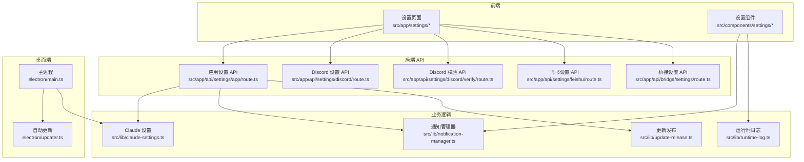
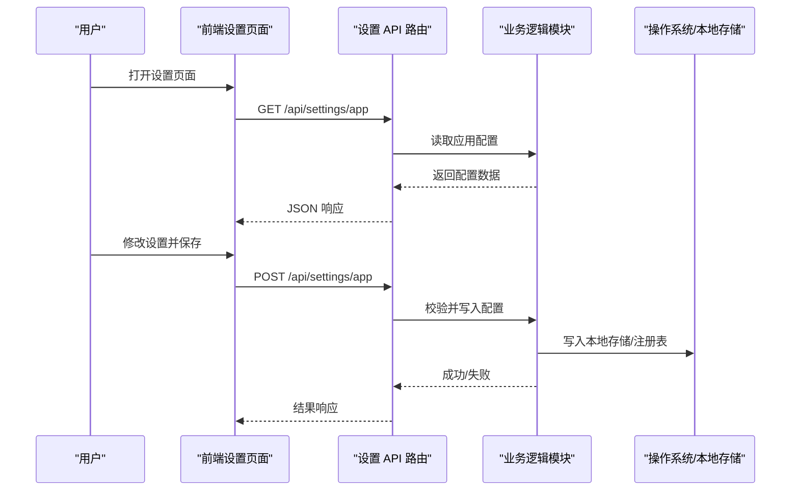
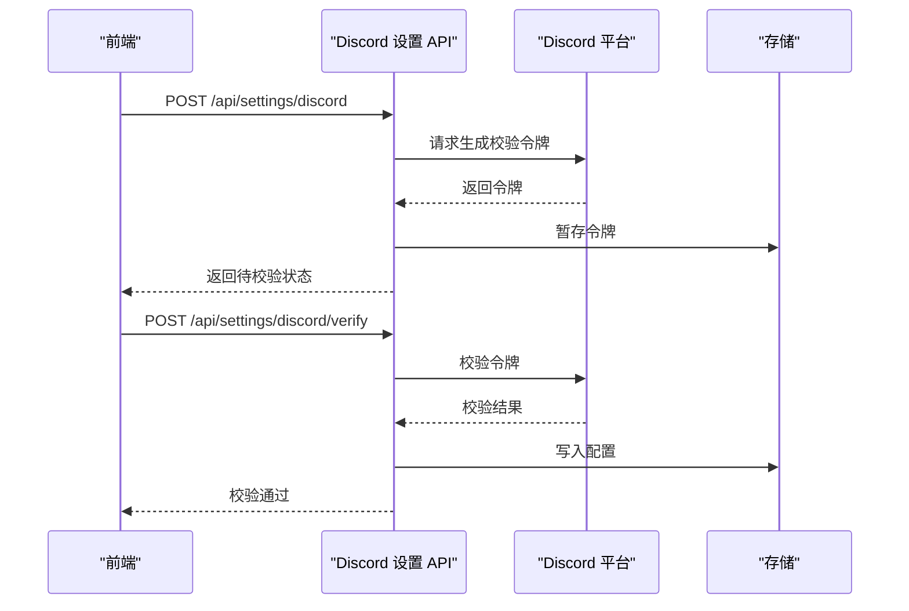
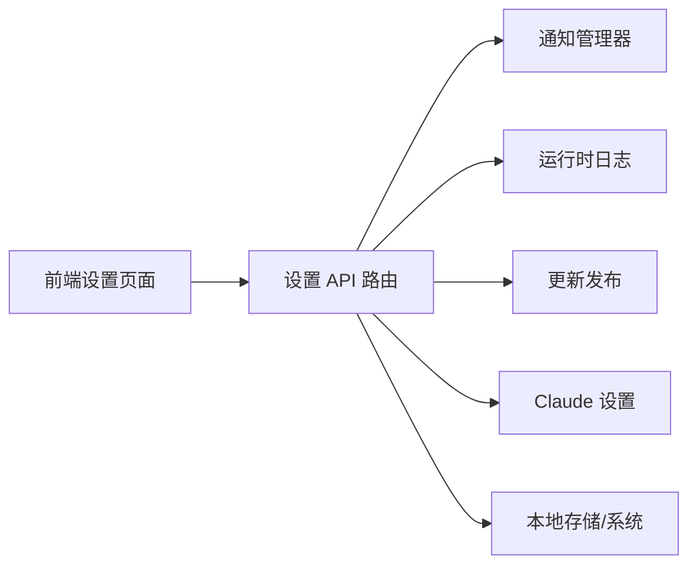

# 系统设置 API

<cite>
**本文引用的文件**
- [src/app/api/settings/app/route.ts](file://src/app/api/settings/app/route.ts)
- [src/app/api/settings/discord/route.ts](file://src/app/api/settings/discord/route.ts)
- [src/app/api/settings/discord/verify/route.ts](file://src/app/api/settings/discord/verify/route.ts)
- [src/app/api/settings/feishu/route.ts](file://src/app/api/settings/feishu/route.ts)
- [src/app/api/bridge/settings/route.ts](file://src/app/api/bridge/settings/route.ts)
- [src/lib/claude-settings.ts](file://src/lib/claude-settings.ts)
- [src/lib/notification-manager.ts](file://src/lib/notification-manager.ts)
- [src/lib/runtime-log.ts](file://src/lib/runtime-log.ts)
- [src/lib/update-release.ts](file://src/lib/update-release.ts)
- [src/hooks/useSettings.ts](file://src/hooks/useSettings.ts)
- [src/components/settings/HealthSection.tsx](file://src/components/settings/HealthSection.tsx)
- [src/app/settings/health/page.tsx](file://src/app/settings/health/page.tsx)
- [electron/main.ts](file://electron/main.ts)
- [electron/updater.ts](file://electron/updater.ts)
- [src/__tests__/e2e/settings.spec.ts](file://src/__tests__/e2e/settings.spec.ts)
- [src/__tests__/unit/settings-routes-shape.test.ts](file://src/__tests__/unit/settings-routes-shape.test.ts)
- [src/__tests__/unit/settings-effective-provider.test.ts](file://src/__tests__/unit/settings-effective-provider.test.ts)
- [src/__tests__/unit/claude-settings-credentials.test.ts](file://src/__tests__/unit/claude-settings-credentials.test.ts)
</cite>

## 目录
1. [简介](#简介)
2. [项目结构](#项目结构)
3. [核心组件](#核心组件)
4. [架构总览](#架构总览)
5. [详细组件分析](#详细组件分析)
6. [依赖关系分析](#依赖关系分析)
7. [性能考量](#性能考量)
8. [故障排查指南](#故障排查指南)
9. [结论](#结论)
10. [附录](#附录)

## 简介
本文件系统性梳理与“系统设置”相关的 API 与实现，覆盖应用配置、第三方服务集成（如 Discord、飞书）、通知策略、系统健康诊断、自动更新与日志管理等能力。文档同时给出数据类型、默认值与校验规则的约束说明，解释启动配置、运行时调整与持久化机制，并提供系统重置、配置修复与故障排除的操作指南，以及自动更新、通知策略与系统优化的最佳实践。

## 项目结构
系统设置相关的后端 API 主要位于 Next.js App Router 的路由层，前端设置页面与组件位于 src/app/settings 与 src/components/settings 下，部分设置逻辑在 src/lib 中实现，桌面端 Electron 集成负责本地存储与自动更新。

图表来源
- [src/app/api/settings/app/route.ts](file://src/app/api/settings/app/route.ts)
- [src/app/api/settings/discord/route.ts](file://src/app/api/settings/discord/route.ts)
- [src/app/api/settings/discord/verify/route.ts](file://src/app/api/settings/discord/verify/route.ts)
- [src/app/api/settings/feishu/route.ts](file://src/app/api/settings/feishu/route.ts)
- [src/app/api/bridge/settings/route.ts](file://src/app/api/bridge/settings/route.ts)
- [src/lib/claude-settings.ts](file://src/lib/claude-settings.ts)
- [src/lib/notification-manager.ts](file://src/lib/notification-manager.ts)
- [src/lib/runtime-log.ts](file://src/lib/runtime-log.ts)
- [src/lib/update-release.ts](file://src/lib/update-release.ts)
- [electron/main.ts](file://electron/main.ts)
- [electron/updater.ts](file://electron/updater.ts)

章节来源
- [src/app/api/settings/app/route.ts](file://src/app/api/settings/app/route.ts)
- [src/app/api/settings/discord/route.ts](file://src/app/api/settings/discord/route.ts)
- [src/app/api/settings/discord/verify/route.ts](file://src/app/api/settings/discord/verify/route.ts)
- [src/app/api/settings/feishu/route.ts](file://src/app/api/settings/feishu/route.ts)
- [src/app/api/bridge/settings/route.ts](file://src/app/api/bridge/settings/route.ts)
- [src/lib/claude-settings.ts](file://src/lib/claude-settings.ts)
- [src/lib/notification-manager.ts](file://src/lib/notification-manager.ts)
- [src/lib/runtime-log.ts](file://src/lib/runtime-log.ts)
- [src/lib/update-release.ts](file://src/lib/update-release.ts)
- [electron/main.ts](file://electron/main.ts)
- [electron/updater.ts](file://electron/updater.ts)

## 核心组件
- 应用设置 API：提供应用级配置的读取、更新与校验，涉及 Claude 凭据、通知策略、主题与语言等。
- 第三方服务设置 API：支持 Discord 与飞书的设置与校验流程。
- 桥接设置 API：用于桥接层的配置管理。
- 通知管理器：封装通知策略、去重与轮询。
- 运行时日志：提供日志采集与导出能力。
- 更新发布：负责版本检查与发布信息管理。
- 健康诊断页面：集中展示系统健康状态与诊断入口。

章节来源
- [src/app/api/settings/app/route.ts](file://src/app/api/settings/app/route.ts)
- [src/app/api/settings/discord/route.ts](file://src/app/api/settings/discord/route.ts)
- [src/app/api/settings/discord/verify/route.ts](file://src/app/api/settings/discord/verify/route.ts)
- [src/app/api/settings/feishu/route.ts](file://src/app/api/settings/feishu/route.ts)
- [src/app/api/bridge/settings/route.ts](file://src/app/api/bridge/settings/route.ts)
- [src/lib/notification-manager.ts](file://src/lib/notification-manager.ts)
- [src/lib/runtime-log.ts](file://src/lib/runtime-log.ts)
- [src/lib/update-release.ts](file://src/lib/update-release.ts)
- [src/app/settings/health/page.tsx](file://src/app/settings/health/page.tsx)

## 架构总览
系统设置 API 采用前后端分离的职责划分：前端负责用户交互与路由跳转，后端 API 提供数据访问与业务处理；部分设置通过 Electron 主进程进行本地持久化与系统级操作。

图表来源
- [src/app/api/settings/app/route.ts](file://src/app/api/settings/app/route.ts)
- [src/lib/claude-settings.ts](file://src/lib/claude-settings.ts)
- [electron/main.ts](file://electron/main.ts)

## 详细组件分析

### 应用设置 API
- 接口目标：统一管理应用级配置，包括 Claude 凭据、通知策略、主题、语言、自动更新开关等。
- 数据类型与默认值：
  - Claude 凭据：字符串类型，为空表示未配置。
  - 通知策略：布尔或枚举类型，具体取决于策略项；默认值依据业务模块初始化。
  - 主题与语言：字符串类型，合法值由前端与后端共同约束。
  - 自动更新：布尔类型，默认开启或关闭视平台而定。
- 校验规则：
  - 必填字段必须非空。
  - 字段值需符合预定义集合（如主题、语言）。
  - 对外部凭据（如 Claude 凭据）进行格式与可达性校验。
- 启动配置：应用启动时从本地存储加载默认配置，若缺失则回退到内置默认值。
- 运行时调整：前端提交变更后，后端执行校验与持久化，随后触发相关模块的热更新或重启。
- 持久化机制：优先使用 Electron 主进程的本地存储；Web 环境下使用浏览器存储；必要时同步至服务器以实现多端一致。

章节来源
- [src/app/api/settings/app/route.ts](file://src/app/api/settings/app/route.ts)
- [src/lib/claude-settings.ts](file://src/lib/claude-settings.ts)
- [electron/main.ts](file://electron/main.ts)

### Discord 设置 API
- 接口目标：配置与校验 Discord 通知通道与权限。
- 数据类型与默认值：
  - 服务器 ID：字符串类型。
  - 通道 ID：字符串类型。
  - 校验令牌：字符串类型，为空表示未完成校验。
- 校验规则：
  - 服务器与通道 ID 必须为有效标识符。
  - 校验令牌需通过 Discord API 验证有效性。
- 流程：
  1) 前端请求生成校验令牌。
  2) 用户授权后，后端调用 Discord API 完成校验。
  3) 校验成功后，持久化配置并返回结果。

图表来源
- [src/app/api/settings/discord/route.ts](file://src/app/api/settings/discord/route.ts)
- [src/app/api/settings/discord/verify/route.ts](file://src/app/api/settings/discord/verify/route.ts)

章节来源
- [src/app/api/settings/discord/route.ts](file://src/app/api/settings/discord/route.ts)
- [src/app/api/settings/discord/verify/route.ts](file://src/app/api/settings/discord/verify/route.ts)

### 飞书设置 API
- 接口目标：配置飞书通知通道与权限。
- 数据类型与默认值：
  - 群 ID：字符串类型。
  - 应用 ID：字符串类型。
  - 应用密钥：字符串类型，建议加密存储。
- 校验规则：
  - 群 ID 与应用 ID 必须为有效标识符。
  - 应用密钥需通过飞书 API 验证有效性。
- 流程：
  1) 前端请求生成授权链接。
  2) 用户授权后，后端调用飞书 API 获取令牌。
  3) 校验成功后，持久化配置并返回结果。

章节来源
- [src/app/api/settings/feishu/route.ts](file://src/app/api/settings/feishu/route.ts)

### 桥接设置 API
- 接口目标：管理桥接层的配置，如 MCP 服务器、桥接通道等。
- 数据类型与默认值：
  - 服务器列表：对象数组，包含名称、命令、环境变量等字段。
  - 启用状态：布尔类型，默认启用。
- 校验规则：
  - 服务器名称唯一且非空。
  - 命令与环境变量需可解析。
- 运行时调整：支持按项目或全局覆盖，UI 层可禁用特定服务器。

章节来源
- [src/app/api/bridge/settings/route.ts](file://src/app/api/bridge/settings/route.ts)
- [src/__tests__/unit/project-mcp-injection.test.ts](file://src/__tests__/unit/project-mcp-injection.test.ts)

### 通知管理器
- 功能：统一管理通知策略、去重与轮询，支持多种渠道（桌面、邮件、IM 等）。
- 数据类型与默认值：
  - 通知开关：布尔类型。
  - 去重键：字符串类型。
  - 轮询间隔：整数类型（秒）。
- 校验规则：
  - 开关与间隔需为合法范围。
  - 去重键需唯一。
- 性能：缓存最近通知，避免重复推送；支持批量去重与延迟合并。

章节来源
- [src/lib/notification-manager.ts](file://src/lib/notification-manager.ts)

### 运行时日志
- 功能：采集运行时日志，支持过滤、导出与上传。
- 数据类型与默认值：
  - 日志级别：枚举类型（如 debug、info、warn、error）。
  - 导出格式：字符串类型（如 json、txt）。
- 校验规则：
  - 级别需在允许范围内。
  - 导出格式需受支持。
- 持久化：本地临时存储，支持分片与压缩。

章节来源
- [src/lib/runtime-log.ts](file://src/lib/runtime-log.ts)

### 更新发布
- 功能：检查新版本、下载与安装，支持静默更新与用户确认。
- 数据类型与默认值：
  - 版本号：字符串类型。
  - 发布说明：字符串类型。
  - 更新策略：枚举类型（立即、延迟、手动）。
- 校验规则：
  - 版本号需符合语义化规范。
  - 发布说明需可读。
- 桌面端：Electron 主进程负责下载与安装，渲染进程负责提示与确认。

章节来源
- [src/lib/update-release.ts](file://src/lib/update-release.ts)
- [electron/updater.ts](file://electron/updater.ts)

### 健康诊断页面
- 功能：集中展示系统健康状态、性能指标与诊断入口。
- 页面组成：健康卡片、日志摘要、更新状态、通知测试等。
- 交互：点击卡片可进入对应设置页或执行诊断任务。

章节来源
- [src/app/settings/health/page.tsx](file://src/app/settings/health/page.tsx)
- [src/components/settings/HealthSection.tsx](file://src/components/settings/HealthSection.tsx)

## 依赖关系分析
- 组件耦合：
  - 设置 API 依赖业务逻辑模块（通知、日志、更新），并与 Electron 主进程交互。
  - 前端设置页面依赖路由与 Hook，后者负责状态管理与持久化。
- 外部依赖：
  - Discord/飞书 API：用于授权与校验。
  - 操作系统：本地存储、托盘菜单、系统通知。
- 可能的循环依赖：
  - 设置 API 与业务模块之间为单向依赖，无循环风险。

图表来源
- [src/app/api/settings/app/route.ts](file://src/app/api/settings/app/route.ts)
- [src/lib/notification-manager.ts](file://src/lib/notification-manager.ts)
- [src/lib/runtime-log.ts](file://src/lib/runtime-log.ts)
- [src/lib/update-release.ts](file://src/lib/update-release.ts)
- [src/lib/claude-settings.ts](file://src/lib/claude-settings.ts)
- [electron/main.ts](file://electron/main.ts)

章节来源
- [src/app/api/settings/app/route.ts](file://src/app/api/settings/app/route.ts)
- [src/lib/notification-manager.ts](file://src/lib/notification-manager.ts)
- [src/lib/runtime-log.ts](file://src/lib/runtime-log.ts)
- [src/lib/update-release.ts](file://src/lib/update-release.ts)
- [src/lib/claude-settings.ts](file://src/lib/claude-settings.ts)
- [electron/main.ts](file://electron/main.ts)

## 性能考量
- 缓存策略：对频繁读取的配置与日志进行缓存，减少磁盘与网络 IO。
- 异步处理：通知与更新采用异步队列，避免阻塞主线程。
- 分页与限流：日志导出与通知轮询需限制频率，防止资源占用过高。
- 启动优化：仅加载必要的设置模块，延迟初始化非关键功能。

## 故障排查指南
- 设置无法保存：
  - 检查必填字段是否完整。
  - 校验第三方凭据是否有效。
  - 查看本地存储是否可用。
- 通知不生效：
  - 确认通知策略与去重键配置正确。
  - 检查轮询间隔与网络连通性。
- 日志异常：
  - 确认日志级别与导出格式。
  - 检查磁盘空间与权限。
- 更新失败：
  - 检查网络与代理设置。
  - 查看更新日志与错误码。
- 健康诊断：
  - 使用健康页面的诊断卡片定位问题。
  - 导出日志并提交给支持团队。

章节来源
- [src/lib/notification-manager.ts](file://src/lib/notification-manager.ts)
- [src/lib/runtime-log.ts](file://src/lib/runtime-log.ts)
- [src/lib/update-release.ts](file://src/lib/update-release.ts)
- [src/app/settings/health/page.tsx](file://src/app/settings/health/page.tsx)

## 结论
系统设置 API 通过清晰的职责划分与严格的校验机制，实现了应用配置、通知策略、第三方服务集成与系统健康诊断的统一管理。结合 Electron 的本地持久化与自动更新能力，为用户提供稳定、可诊断、可优化的系统体验。建议在生产环境中持续完善配置校验、日志采样与更新策略，确保系统安全与性能。

## 附录

### API 规范概览
- 应用设置
  - 方法：GET/POST
  - 路径：/api/settings/app
  - 请求体字段：凭据、通知策略、主题、语言、自动更新等
  - 响应：配置对象或错误信息
- Discord 设置
  - 方法：POST
  - 路径：/api/settings/discord
  - 请求体字段：服务器 ID、通道 ID、回调地址
  - 响应：待校验状态
- Discord 校验
  - 方法：POST
  - 路径：/api/settings/discord/verify
  - 请求体字段：校验令牌
  - 响应：校验结果
- 飞书设置
  - 方法：POST
  - 路径：/api/settings/feishu
  - 请求体字段：群 ID、应用 ID、应用密钥
  - 响应：校验结果
- 桥接设置
  - 方法：GET/POST
  - 路径：/api/bridge/settings
  - 请求体字段：服务器列表、覆盖策略
  - 响应：配置对象或错误信息

章节来源
- [src/app/api/settings/app/route.ts](file://src/app/api/settings/app/route.ts)
- [src/app/api/settings/discord/route.ts](file://src/app/api/settings/discord/route.ts)
- [src/app/api/settings/discord/verify/route.ts](file://src/app/api/settings/discord/verify/route.ts)
- [src/app/api/settings/feishu/route.ts](file://src/app/api/settings/feishu/route.ts)
- [src/app/api/bridge/settings/route.ts](file://src/app/api/bridge/settings/route.ts)

### 最佳实践
- 自动更新
  - 采用静默更新策略，配合健康检查与回滚机制。
  - 在非工作时间推送更新，降低对用户的影响。
- 通知策略
  - 启用去重与延迟合并，避免噪声。
  - 支持用户自定义阈值与渠道偏好。
- 系统优化
  - 定期清理日志与缓存，控制磁盘占用。
  - 对敏感配置进行加密存储，定期轮换密钥。
- 配置修复
  - 提供一键重置为默认值的功能。
  - 支持导入/导出配置，便于迁移与备份。