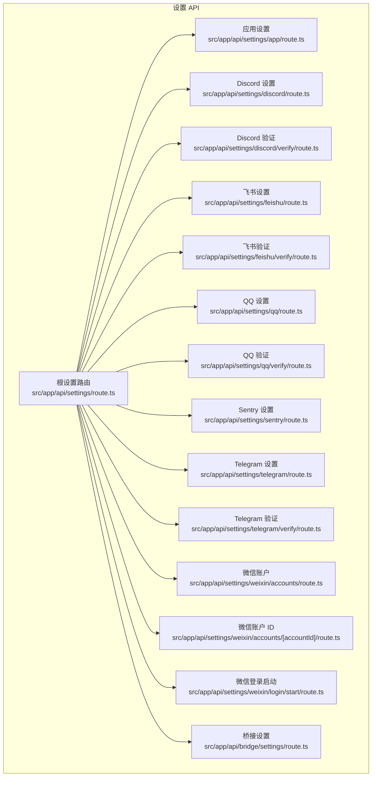
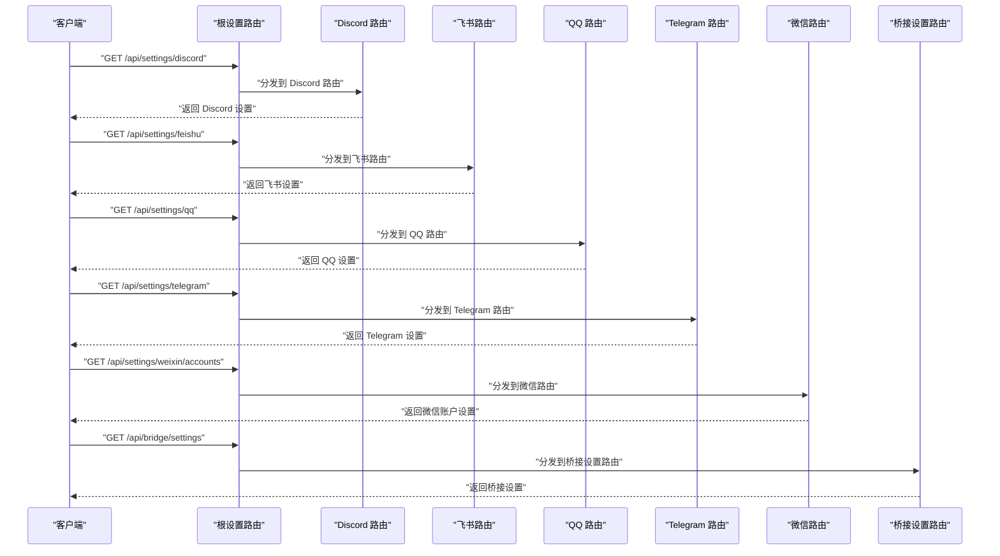
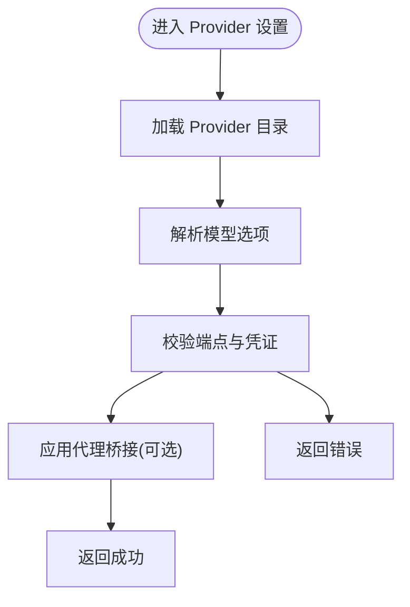
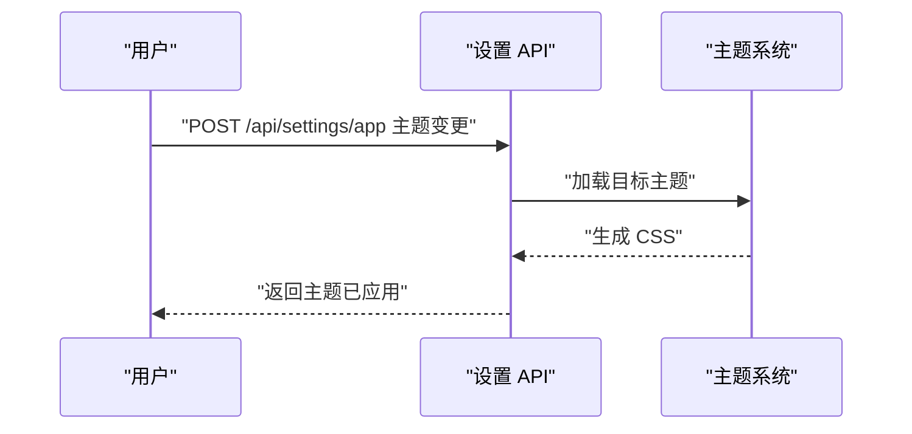
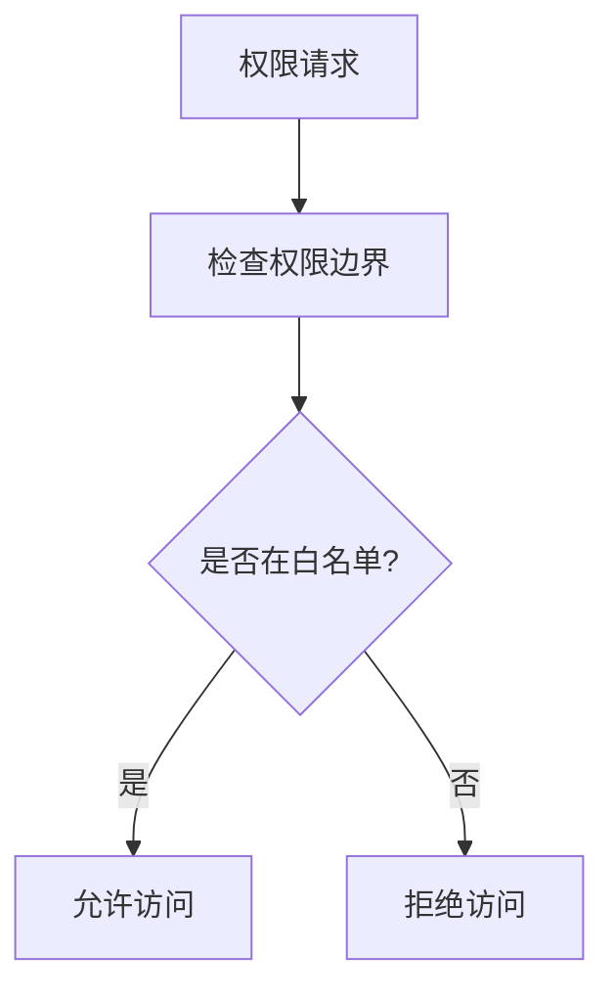
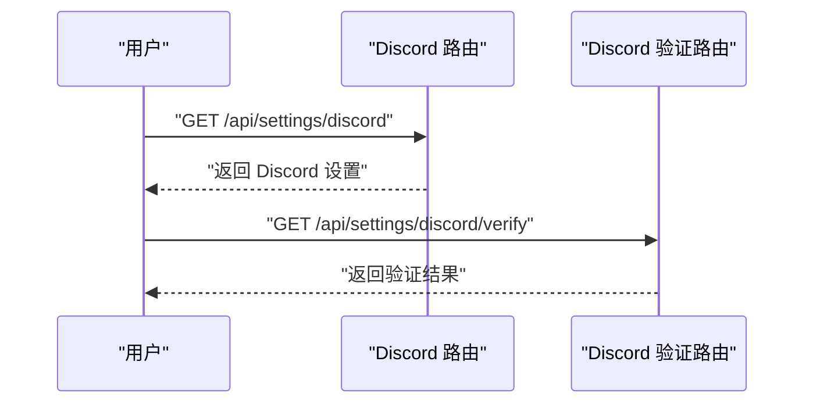
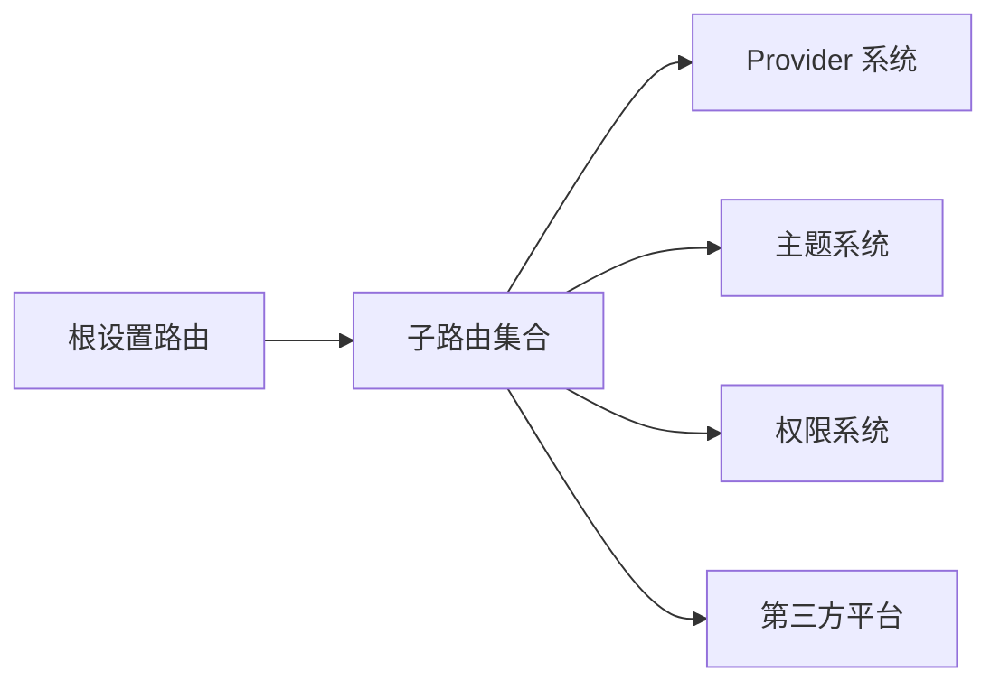

# 设置 API

<cite>
**本文引用的文件**
- [settings.spec.ts](file://src/__tests__/e2e/settings.spec.ts)
- [settings-routes-shape.test.ts](file://src/__tests__/unit/settings-routes-shape.test.ts)
- [settings-effective-provider.test.ts](file://src/__tests__/unit/settings-effective-provider.test.ts)
- [settings-link-migration.test.ts](file://src/__tests__/unit/settings-link-migration.test.ts)
- [claude-settings-credentials.test.ts](file://src/__tests__/unit/claude-settings-credentials.test.ts)
- [route.ts](file://src/app/api/settings/route.ts)
- [route.ts](file://src/app/api/settings/app/route.ts)
- [route.ts](file://src/app/api/settings/discord/route.ts)
- [route.ts](file://src/app/api/settings/discord/verify/route.ts)
- [route.ts](file://src/app/api/settings/feishu/route.ts)
- [route.ts](file://src/app/api/settings/feishu/verify/route.ts)
- [route.ts](file://src/app/api/settings/qq/route.ts)
- [route.ts](file://src/app/api/settings/qq/verify/route.ts)
- [route.ts](file://src/app/api/settings/sentry/route.ts)
- [route.ts](file://src/app/api/settings/telegram/route.ts)
- [route.ts](file://src/app/api/settings/telegram/verify/route.ts)
- [route.ts](file://src/app/api/settings/weixin/accounts/[accountId]/route.ts)
- [route.ts](file://src/app/api/settings/weixin/accounts/route.ts)
- [route.ts](file://src/app/api/settings/weixin/login/start/route.ts)
- [route.ts](file://src/app/api/bridge/settings/route.ts)
- [theme-system.md](file://docs/guardrails/theme-system.md)
- [provider-governance.md](file://docs/guardrails/provider-governance.md)
- [ProviderManagement.md](file://docs/guardrails/ProviderManagement.md)
- [ComposerModelSelection.md](file://docs/guardrails/ComposerModelSelection.md)
- [PermissionBoundary.md](file://docs/guardrails/PermissionBoundary.md)
- [README.md](file://README.md)
</cite>

## 目录
1. [简介](#简介)
2. [项目结构](#项目结构)
3. [核心组件](#核心组件)
4. [架构总览](#架构总览)
5. [详细组件分析](#详细组件分析)
6. [依赖分析](#依赖分析)
7. [性能考虑](#性能考虑)
8. [故障排除指南](#故障排除指南)
9. [结论](#结论)
10. [附录](#附录)

## 简介
本文件系统化梳理应用设置 API 的设计与实现，覆盖以下能力域：
- Provider 配置与治理：提供者注册、凭证管理、模型选择与解析、错误诊断与代理桥接。
- 主题设置：内置主题与动态加载机制。
- 模型选择：全局默认模型、会话模型解析、模型上下文窗口与能力匹配。
- 权限管理：权限边界、工具调用白名单、运行时权限检查。
- 多账号与第三方集成：Discord、Feishu、QQ、Telegram、Weixin 登录与账户绑定。
- 设置的层级结构、继承关系与优先级规则：全局默认、用户覆盖、会话生效。
- 设置备份、恢复与同步：迁移与链接一致性校验。
- 配置模板与默认值管理：路由形状与默认行为。
- 批量更新与场景化示例：端到端流程与最佳实践。

本文件以仓库内现有测试与 API 路由为依据，结合相关 Guardrails 文档进行说明，并通过图示呈现数据流与控制流。

## 项目结构
设置 API 位于 Next.js App Router 的 API 层，按功能域分层组织：
- 根设置路由：统一入口与通用逻辑
- 应用设置：应用级配置（如 app）
- 第三方集成：Discord、Feishu、QQ、Telegram、Weixin
- 桥接设置：桥接通道的设置路由
- 测试用例：端到端与单元测试覆盖路由形状、有效 Provider 解析、迁移与凭证等

**图表来源**
- [route.ts](file://src/app/api/settings/route.ts)
- [route.ts](file://src/app/api/settings/app/route.ts)
- [route.ts](file://src/app/api/settings/discord/route.ts)
- [route.ts](file://src/app/api/settings/discord/verify/route.ts)
- [route.ts](file://src/app/api/settings/feishu/route.ts)
- [route.ts](file://src/app/api/settings/feishu/verify/route.ts)
- [route.ts](file://src/app/api/settings/qq/route.ts)
- [route.ts](file://src/app/api/settings/qq/verify/route.ts)
- [route.ts](file://src/app/api/settings/sentry/route.ts)
- [route.ts](file://src/app/api/settings/telegram/route.ts)
- [route.ts](file://src/app/api/settings/telegram/verify/route.ts)
- [route.ts](file://src/app/api/settings/weixin/accounts/route.ts)
- [route.ts](file://src/app/api/settings/weixin/accounts/[accountId]/route.ts)
- [route.ts](file://src/app/api/settings/weixin/login/start/route.ts)
- [route.ts](file://src/app/api/bridge/settings/route.ts)

**章节来源**
- [settings.spec.ts:1-200](file://src/__tests__/e2e/settings.spec.ts#L1-L200)
- [settings-routes-shape.test.ts:1-120](file://src/__tests__/unit/settings-routes-shape.test.ts#L1-L120)

## 核心组件
- 根设置路由：作为统一入口，负责路由分发与通用中间件处理。
- 应用设置：管理应用级配置（如 app 级别设置）。
- 第三方集成设置：提供 Discord、Feishu、QQ、Telegram、Weixin 的配置与验证流程。
- 桥接设置：桥接通道的设置路由，用于桥接相关配置。
- 测试用例：确保路由形状正确、有效 Provider 解析稳定、迁移与凭证链路可用。

**章节来源**
- [settings-routes-shape.test.ts:1-120](file://src/__tests__/unit/settings-routes-shape.test.ts#L1-L120)
- [settings-effective-provider.test.ts:1-120](file://src/__tests__/unit/settings-effective-provider.test.ts#L1-L120)
- [settings-link-migration.test.ts:1-120](file://src/__tests__/unit/settings-link-migration.test.ts#L1-L120)
- [claude-settings-credentials.test.ts:1-120](file://src/__tests__/unit/claude-settings-credentials.test.ts#L1-L120)

## 架构总览
设置 API 的整体交互流程如下：
- 客户端向根设置路由发起请求
- 根据路径参数与子路由映射，分发到具体功能路由
- 功能路由执行业务逻辑（如 Provider 解析、第三方验证、桥接配置）
- 返回标准化响应或触发后续流程（如重定向、状态码）

**图表来源**
- [route.ts](file://src/app/api/settings/route.ts)
- [route.ts](file://src/app/api/settings/discord/route.ts)
- [route.ts](file://src/app/api/settings/feishu/route.ts)
- [route.ts](file://src/app/api/settings/qq/route.ts)
- [route.ts](file://src/app/api/settings/telegram/route.ts)
- [route.ts](file://src/app/api/settings/weixin/accounts/route.ts)
- [route.ts](file://src/app/api/bridge/settings/route.ts)

## 详细组件分析

### Provider 配置与模型选择
- Provider 注册与治理：通过 Provider 管理与治理文档可知，Provider 的注册、端点、凭证与模型解析是核心能力。
- 模型选择与解析：Composer Model Selection 文档描述了模型选择策略与上下文窗口匹配。
- 有效 Provider 解析：单元测试覆盖有效 Provider 的解析稳定性。
- 错误诊断与代理桥接：Provider Doctor 与 Proxy Bridge 提供错误诊断与代理桥接能力。

**图表来源**
- [settings-effective-provider.test.ts:1-120](file://src/__tests__/unit/settings-effective-provider.test.ts#L1-L120)
- [ProviderManagement.md](file://docs/guardrails/ProviderManagement.md)
- [ComposerModelSelection.md](file://docs/guardrails/ComposerModelSelection.md)
- [provider-governance.md](file://docs/guardrails/provider-governance.md)

**章节来源**
- [settings-effective-provider.test.ts:1-120](file://src/__tests__/unit/settings-effective-provider.test.ts#L1-L120)
- [ProviderManagement.md](file://docs/guardrails/ProviderManagement.md)
- [ComposerModelSelection.md](file://docs/guardrails/ComposerModelSelection.md)
- [provider-governance.md](file://docs/guardrails/provider-governance.md)

### 主题设置
- 主题系统：主题加载与渲染 CSS 的能力在 Guardrails 文档中有说明。
- 主题切换：通过设置 API 可能涉及主题切换与持久化。

**图表来源**
- [theme-system.md](file://docs/guardrails/theme-system.md)
- [route.ts](file://src/app/api/settings/app/route.ts)

**章节来源**
- [theme-system.md](file://docs/guardrails/theme-system.md)

### 权限管理
- 权限边界：Permission Boundary 文档定义了权限边界与工具调用白名单。
- 运行时权限检查：权限检查器与注册表确保运行时安全。

**图表来源**
- [PermissionBoundary.md](file://docs/guardrails/PermissionBoundary.md)

**章节来源**
- [PermissionBoundary.md](file://docs/guardrails/PermissionBoundary.md)

### 第三方集成设置
- Discord：设置与验证路由
- 飞书：设置与验证路由
- QQ：设置与验证路由
- Telegram：设置与验证路由
- 微信：账户管理与登录启动路由

**图表来源**
- [route.ts](file://src/app/api/settings/discord/route.ts)
- [route.ts](file://src/app/api/settings/discord/verify/route.ts)

**章节来源**
- [route.ts](file://src/app/api/settings/discord/route.ts)
- [route.ts](file://src/app/api/settings/discord/verify/route.ts)
- [route.ts](file://src/app/api/settings/feishu/route.ts)
- [route.ts](file://src/app/api/settings/feishu/verify/route.ts)
- [route.ts](file://src/app/api/settings/qq/route.ts)
- [route.ts](file://src/app/api/settings/qq/verify/route.ts)
- [route.ts](file://src/app/api/settings/telegram/route.ts)
- [route.ts](file://src/app/api/settings/telegram/verify/route.ts)
- [route.ts](file://src/app/api/settings/weixin/accounts/route.ts)
- [route.ts](file://src/app/api/settings/weixin/accounts/[accountId]/route.ts)
- [route.ts](file://src/app/api/settings/weixin/login/start/route.ts)

### 桥接设置
- 桥接设置路由：用于桥接通道的配置与管理。

**章节来源**
- [route.ts](file://src/app/api/bridge/settings/route.ts)

## 依赖分析
- 路由耦合：根设置路由负责分发，各子路由相对独立，降低耦合度。
- 外部依赖：Provider 目录、模型解析、权限检查器、第三方平台 API。
- 潜在循环依赖：当前结构以单向分发为主，无明显循环依赖迹象。

**图表来源**
- [route.ts](file://src/app/api/settings/route.ts)
- [settings-effective-provider.test.ts:1-120](file://src/__tests__/unit/settings-effective-provider.test.ts#L1-L120)
- [PermissionBoundary.md](file://docs/guardrails/PermissionBoundary.md)
- [theme-system.md](file://docs/guardrails/theme-system.md)

**章节来源**
- [settings-routes-shape.test.ts:1-120](file://src/__tests__/unit/settings-routes-shape.test.ts#L1-L120)

## 性能考虑
- 路由分发：根路由仅承担分发职责，避免在入口处做重逻辑。
- 缓存策略：主题与 Provider 目录可采用缓存减少重复计算。
- 并发控制：第三方平台验证应限制并发与超时，避免阻塞。
- 响应压缩：对大体积主题或目录响应启用压缩。

## 故障排除指南
- 路由形状问题：通过路由形状测试定位路径与方法不一致。
- 有效 Provider 解析失败：检查 Provider 目录、端点与凭证。
- 迁移与链接一致性：通过迁移测试确保设置迁移后的一致性。
- 凭证链路异常：通过凭证测试定位认证失败环节。

**章节来源**
- [settings-routes-shape.test.ts:1-120](file://src/__tests__/unit/settings-routes-shape.test.ts#L1-L120)
- [settings-effective-provider.test.ts:1-120](file://src/__tests__/unit/settings-effective-provider.test.ts#L1-L120)
- [settings-link-migration.test.ts:1-120](file://src/__tests__/unit/settings-link-migration.test.ts#L1-L120)
- [claude-settings-credentials.test.ts:1-120](file://src/__tests__/unit/claude-settings-credentials.test.ts#L1-L120)

## 结论
设置 API 通过清晰的路由分层与测试保障，实现了 Provider 配置、主题设置、模型选择、权限管理与第三方集成的统一入口。建议在实际使用中遵循路由形状规范、优先级规则与迁移策略，确保设置的稳定性与一致性。

## 附录
- 端到端场景示例（基于现有测试与路由）：
  - 获取应用设置：调用应用设置路由，返回应用级配置。
  - 验证第三方平台：调用对应平台的验证路由，返回验证结果。
  - 管理微信账户：调用微信账户路由，支持账户列表与单个账户操作。
  - 桥接设置：调用桥接设置路由，返回桥接通道配置。

**章节来源**
- [settings.spec.ts:1-200](file://src/__tests__/e2e/settings.spec.ts#L1-L200)
- [route.ts](file://src/app/api/settings/app/route.ts)
- [route.ts](file://src/app/api/settings/discord/verify/route.ts)
- [route.ts](file://src/app/api/settings/weixin/accounts/route.ts)
- [route.ts](file://src/app/api/bridge/settings/route.ts)