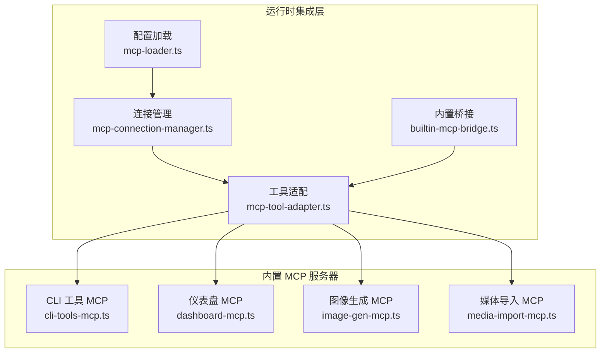
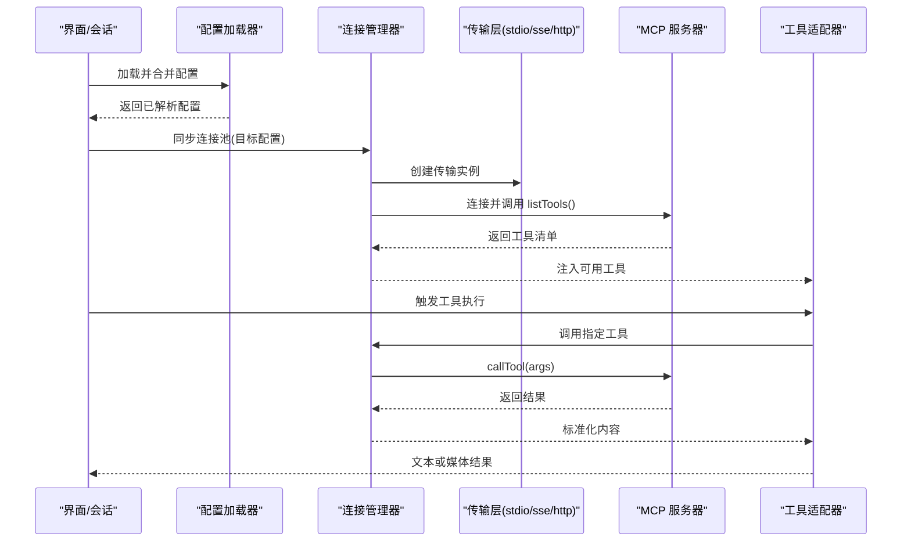
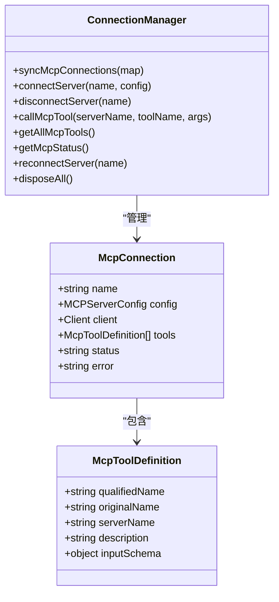
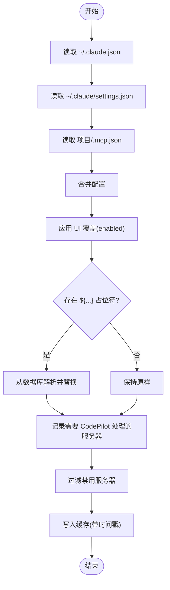
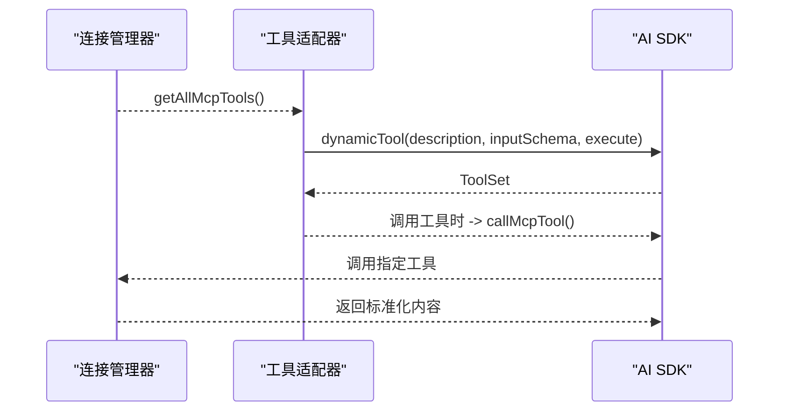
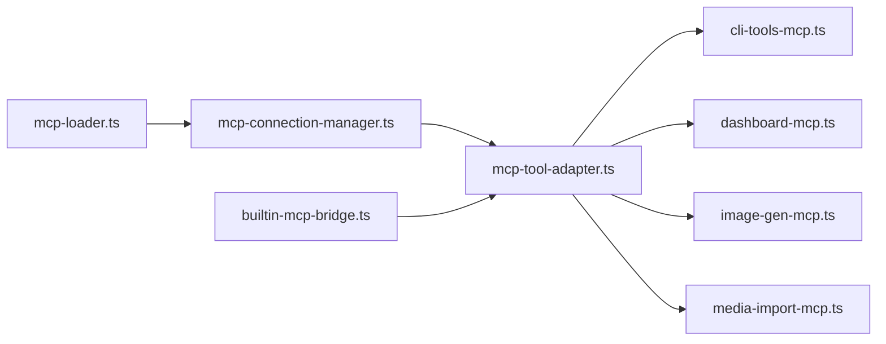

# MCP 协议规范

<cite>
**本文引用的文件**
- [mcp-connection-manager.ts](file://src/lib/mcp-connection-manager.ts)
- [mcp-loader.ts](file://src/lib/mcp-loader.ts)
- [mcp-tool-adapter.ts](file://src/lib/mcp-tool-adapter.ts)
- [builtin-mcp-bridge.ts](file://src/lib/builtin-mcp-bridge.ts)
- [cli-tools-mcp.ts](file://src/lib/cli-tools-mcp.ts)
- [dashboard-mcp.ts](file://src/lib/dashboard-mcp.ts)
- [image-gen-mcp.ts](file://src/lib/image-gen-mcp.ts)
- [media-import-mcp.ts](file://src/lib/media-import-mcp.ts)
- [mcp-config.test.ts](file://src/__tests__/unit/mcp-config.test.ts)
- [mcp-loader.test.ts](file://src/__tests__/unit/mcp-loader.test.ts)
- [shared.js](file://资料/feishu-openclaw-plugin/package/src/tools/mcp/shared.js)
- [shared.d.ts](file://资料/feishu-openclaw-plugin/package/src/tools/mcp/shared.d.ts)
</cite>

## 目录
1. [简介](#简介)
2. [项目结构](#项目结构)
3. [核心组件](#核心组件)
4. [架构总览](#架构总览)
5. [详细组件分析](#详细组件分析)
6. [依赖关系分析](#依赖关系分析)
7. [性能考量](#性能考量)
8. [故障排查指南](#故障排查指南)
9. [结论](#结论)
10. [附录](#附录)

## 简介
本文件面向 MCP（Model Context Protocol）协议规范，结合仓库中的实现，系统阐述 MCP 的核心概念、消息格式与通信机制，并重点说明 stdio、sse、http 三种传输协议的工作原理、适用场景与配置要求。同时覆盖协议版本兼容性、认证机制、错误处理与超时管理，并提供协议交互示例与最佳实践建议。

## 项目结构
本仓库围绕 MCP 的运行时集成，提供了以下关键模块：
- 连接管理：负责发现工具、建立连接、调用工具与状态查询
- 配置加载：合并用户/项目/本地配置，支持环境变量占位符解析
- 工具适配：将 MCP 工具转换为 AI SDK 动态工具
- 内置 MCP 服务：以 SDK 格式定义的内置工具集合
- 具体 MCP 服务器：CLI 工具、仪表盘、图像生成、媒体导入等

**图表来源**
- [mcp-connection-manager.ts:1-221](file://src/lib/mcp-connection-manager.ts#L1-L221)
- [mcp-loader.ts:1-212](file://src/lib/mcp-loader.ts#L1-L212)
- [mcp-tool-adapter.ts:1-70](file://src/lib/mcp-tool-adapter.ts#L1-L70)
- [builtin-mcp-bridge.ts:1-84](file://src/lib/builtin-mcp-bridge.ts#L1-L84)
- [cli-tools-mcp.ts:1-866](file://src/lib/cli-tools-mcp.ts#L1-L866)
- [dashboard-mcp.ts:1-298](file://src/lib/dashboard-mcp.ts#L1-L298)
- [image-gen-mcp.ts:1-81](file://src/lib/image-gen-mcp.ts#L1-L81)
- [media-import-mcp.ts:1-123](file://src/lib/media-import-mcp.ts#L1-L123)

**章节来源**
- [mcp-connection-manager.ts:1-221](file://src/lib/mcp-connection-manager.ts#L1-L221)
- [mcp-loader.ts:1-212](file://src/lib/mcp-loader.ts#L1-L212)
- [mcp-tool-adapter.ts:1-70](file://src/lib/mcp-tool-adapter.ts#L1-L70)
- [builtin-mcp-bridge.ts:1-84](file://src/lib/builtin-mcp-bridge.ts#L1-L84)
- [cli-tools-mcp.ts:1-866](file://src/lib/cli-tools-mcp.ts#L1-L866)
- [dashboard-mcp.ts:1-298](file://src/lib/dashboard-mcp.ts#L1-L298)
- [image-gen-mcp.ts:1-81](file://src/lib/image-gen-mcp.ts#L1-L81)
- [media-import-mcp.ts:1-123](file://src/lib/media-import-mcp.ts#L1-L123)

## 核心组件
- 连接管理器：负责与外部 MCP 服务器建立连接（stdio/sse/http），发现工具列表，统一调用工具并暴露状态
- 配置加载器：合并用户级、项目级与本地配置，解析环境变量占位符，缓存配置并支持失效
- 工具适配器：将 MCP 工具定义转换为 AI SDK 动态工具，供流式对话使用
- 内置桥接：将 SDK 格式的内置 MCP 工具转换为 AI SDK 工具，避免重复实现
- 具体 MCP 服务器：以 SDK 工具形式提供 CLI 管理、仪表盘、图像生成、媒体导入等能力

**章节来源**
- [mcp-connection-manager.ts:1-221](file://src/lib/mcp-connection-manager.ts#L1-L221)
- [mcp-loader.ts:1-212](file://src/lib/mcp-loader.ts#L1-L212)
- [mcp-tool-adapter.ts:1-70](file://src/lib/mcp-tool-adapter.ts#L1-L70)
- [builtin-mcp-bridge.ts:1-84](file://src/lib/builtin-mcp-bridge.ts#L1-L84)

## 架构总览
下图展示了 MCP 在运行时的整体交互流程：配置加载器合并配置并解析占位符；连接管理器根据传输类型创建传输层并连接；工具适配器将可用工具注入到 AI SDK 流式对话中；内置桥接补充内置工具；具体 MCP 服务器提供领域能力。

**图表来源**
- [mcp-loader.ts:40-99](file://src/lib/mcp-loader.ts#L40-L99)
- [mcp-connection-manager.ts:69-108](file://src/lib/mcp-connection-manager.ts#L69-L108)
- [mcp-tool-adapter.ts:17-69](file://src/lib/mcp-tool-adapter.ts#L17-L69)

**章节来源**
- [mcp-loader.ts:40-99](file://src/lib/mcp-loader.ts#L40-L99)
- [mcp-connection-manager.ts:69-108](file://src/lib/mcp-connection-manager.ts#L69-L108)
- [mcp-tool-adapter.ts:17-69](file://src/lib/mcp-tool-adapter.ts#L17-L69)

## 详细组件分析

### 连接管理器（MCP 连接池）
- 职责：维护连接池、按需连接/断开、发现工具、统一调用工具、查询状态
- 关键点：
  - 支持 stdio、sse、http 三种传输类型
  - 使用延迟加载 SDK，避免未使用时的导入开销
  - 工具名称采用“mcp__{serverName}__{toolName}”全限定名，避免冲突
  - 提供重连与全局释放接口

**图表来源**
- [mcp-connection-manager.ts:15-35](file://src/lib/mcp-connection-manager.ts#L15-L35)
- [mcp-connection-manager.ts:45-187](file://src/lib/mcp-connection-manager.ts#L45-L187)

**章节来源**
- [mcp-connection-manager.ts:1-221](file://src/lib/mcp-connection-manager.ts#L1-L221)

### 配置加载器（合并与解析）
- 职责：合并用户级、设置级、项目级与本地配置；解析环境变量占位符；缓存与失效；过滤禁用项
- 关键点：
  - 缓存 TTL 30 秒，命中则返回同一引用
  - 对 ${...} 形式的占位符从数据库读取值替换
  - 支持对项目级配置按工作目录动态读取
  - 应用 UI 层面的启用/禁用覆盖

**图表来源**
- [mcp-loader.ts:40-99](file://src/lib/mcp-loader.ts#L40-L99)
- [mcp-loader.ts:162-211](file://src/lib/mcp-loader.ts#L162-L211)

**章节来源**
- [mcp-loader.ts:1-212](file://src/lib/mcp-loader.ts#L1-L212)

### 工具适配器（MCP → AI SDK）
- 职责：将连接管理器提供的工具定义转换为 AI SDK 的动态工具，统一执行入口
- 关键点：
  - 输入模式严格遵循 JSON Schema，确保类型安全
  - 输出统一提取文本内容，必要时回退为字符串或 JSON
  - 工具名全限定，避免跨服务器冲突

**图表来源**
- [mcp-tool-adapter.ts:17-69](file://src/lib/mcp-tool-adapter.ts#L17-L69)
- [mcp-connection-manager.ts:124-140](file://src/lib/mcp-connection-manager.ts#L124-L140)

**章节来源**
- [mcp-tool-adapter.ts:1-70](file://src/lib/mcp-tool-adapter.ts#L1-L70)

### 内置桥接（SDK 工具 → AI SDK 工具）
- 职责：将 SDK 格式的内置 MCP 工具转换为 AI SDK 工具，便于在原生运行时直接使用
- 关键点：
  - 保持处理器逻辑不变，仅包装为 AI SDK 可执行形式
  - 统一错误处理与文本提取

**章节来源**
- [builtin-mcp-bridge.ts:1-84](file://src/lib/builtin-mcp-bridge.ts#L1-L84)

### 具体 MCP 服务器

#### CLI 工具 MCP
- 能力：列出、安装、注册、移除、检查更新、更新 CLI 工具
- 关键点：
  - 基于 SDK 的工具定义与 Zod 参数校验
  - 自动解析安装方法与包名，支持多包管理器
  - 安装后自动检测二进制路径与版本
  - 提供帮助输出用于生成双语描述与兼容性评估

**章节来源**
- [cli-tools-mcp.ts:1-866](file://src/lib/cli-tools-mcp.ts#L1-L866)

#### 仪表盘 MCP
- 能力：固定/列出/刷新/更新/移除仪表盘小部件
- 关键点：
  - 支持文件、MCP 工具、CLI 三类数据源
  - 刷新时区分不同数据源并给出后续操作指引
  - 严格的数据契约与可视化设计约束

**章节来源**
- [dashboard-mcp.ts:1-298](file://src/lib/dashboard-mcp.ts#L1-L298)

#### 图像生成 MCP
- 能力：通过 Gemini 生成图像并内联展示
- 关键点：
  - 结果中包含媒体标记，前端据此渲染媒体块
  - 错误类型明确，便于前端提示

**章节来源**
- [image-gen-mcp.ts:1-81](file://src/lib/image-gen-mcp.ts#L1-L81)

#### 媒体导入 MCP
- 能力：将本地媒体文件导入媒体库并内联展示
- 关键点：
  - 自动推断媒体类型与 MIME
  - 结果中包含媒体标记，前端据此渲染媒体块

**章节来源**
- [media-import-mcp.ts:1-123](file://src/lib/media-import-mcp.ts#L1-L123)

## 依赖关系分析
- 连接管理器依赖 MCP SDK 的传输层（stdio/sse/streamableHttp），并在首次使用时惰性加载
- 配置加载器依赖数据库设置进行占位符解析，并与 UI 覆盖逻辑协同
- 工具适配器依赖连接管理器提供的工具清单与调用接口
- 内置桥接依赖各内置 MCP 服务器的工具处理器
- 具体 MCP 服务器依赖 SDK 的工具定义与参数校验框架

**图表来源**
- [mcp-loader.ts:1-212](file://src/lib/mcp-loader.ts#L1-L212)
- [mcp-connection-manager.ts:1-221](file://src/lib/mcp-connection-manager.ts#L1-L221)
- [mcp-tool-adapter.ts:1-70](file://src/lib/mcp-tool-adapter.ts#L1-L70)
- [builtin-mcp-bridge.ts:1-84](file://src/lib/builtin-mcp-bridge.ts#L1-L84)
- [cli-tools-mcp.ts:1-866](file://src/lib/cli-tools-mcp.ts#L1-L866)
- [dashboard-mcp.ts:1-298](file://src/lib/dashboard-mcp.ts#L1-L298)
- [image-gen-mcp.ts:1-81](file://src/lib/image-gen-mcp.ts#L1-L81)
- [media-import-mcp.ts:1-123](file://src/lib/media-import-mcp.ts#L1-L123)

**章节来源**
- [mcp-loader.ts:1-212](file://src/lib/mcp-loader.ts#L1-L212)
- [mcp-connection-manager.ts:1-221](file://src/lib/mcp-connection-manager.ts#L1-L221)
- [mcp-tool-adapter.ts:1-70](file://src/lib/mcp-tool-adapter.ts#L1-L70)
- [builtin-mcp-bridge.ts:1-84](file://src/lib/builtin-mcp-bridge.ts#L1-L84)
- [cli-tools-mcp.ts:1-866](file://src/lib/cli-tools-mcp.ts#L1-L866)
- [dashboard-mcp.ts:1-298](file://src/lib/dashboard-mcp.ts#L1-L298)
- [image-gen-mcp.ts:1-81](file://src/lib/image-gen-mcp.ts#L1-L81)
- [media-import-mcp.ts:1-123](file://src/lib/media-import-mcp.ts#L1-L123)

## 性能考量
- 连接池与缓存
  - 连接管理器按需连接与断开，避免常驻进程
  - 配置加载器 30 秒缓存，减少频繁 IO
- 工具调用
  - 工具适配器统一执行入口，减少重复封装成本
  - 工具输入严格校验，降低运行期异常开销
- I/O 与超时
  - CLI 工具相关操作设置了合理超时（如安装、版本查询、过时检查）
  - 建议在自定义 MCP 服务器中同样设置超时与重试策略

[本节为通用指导，无需特定文件引用]

## 故障排查指南
- 连接失败
  - 检查传输类型与必要字段：stdio 需要命令；sse/http 需要 URL
  - 查看连接状态与错误信息，必要时触发重连
- 工具不可用
  - 确认服务器已连接且工具清单非空
  - 检查工具名称是否使用全限定名
- 配置问题
  - 确认占位符已正确解析
  - 检查 UI 覆盖是否导致服务器被禁用
- 结果格式异常
  - 某些网关/代理可能包裹 JSON-RPC envelope，需递归解包
  - 媒体结果需识别特定标记以便前端渲染

**章节来源**
- [mcp-connection-manager.ts:103-107](file://src/lib/mcp-connection-manager.ts#L103-L107)
- [mcp-config.test.ts:180-216](file://src/__tests__/unit/mcp-config.test.ts#L180-L216)
- [shared.js:43-64](file://资料/feishu-openclaw-plugin/package/src/tools/mcp/shared.js#L43-L64)

## 结论
本仓库完整实现了 MCP 的运行时集成：从配置加载、连接管理、工具适配到内置与领域 MCP 服务器，形成了可扩展、可维护的 MCP 生态。通过明确的传输类型、严格的参数校验与统一的结果格式，既保证了与 MCP 协议的兼容性，也提升了实际使用体验。

[本节为总结，无需特定文件引用]

## 附录

### 传输协议详解与配置要求

- stdio
  - 适用场景：本地子进程、自研工具服务
  - 配置要点：command 必填；args/env 可选
  - 连接方式：通过 stdio 通道建立双向流
  - 超时与稳定性：建议在工具侧设置超时，避免阻塞

- sse
  - 适用场景：远程服务、事件推送
  - 配置要点：url 必填；headers 可选
  - 连接方式：基于 URL 建立 SSE 连接
  - 认证机制：通过 headers 传递令牌

- http
  - 适用场景：REST 风格的 MCP 服务
  - 配置要点：url 必填；headers 可选
  - 连接方式：基于 URL 建立 HTTP 传输
  - 认证机制：通过 headers 传递令牌

**章节来源**
- [mcp-connection-manager.ts:191-220](file://src/lib/mcp-connection-manager.ts#L191-L220)
- [mcp-config.test.ts:36-76](file://src/__tests__/unit/mcp-config.test.ts#L36-L76)

### 协议版本兼容性
- 连接管理器使用 MCP SDK 的客户端与传输层，遵循 SDK 的版本约定
- 建议在升级 SDK 时同步验证工具清单与调用行为

**章节来源**
- [mcp-connection-manager.ts:81-86](file://src/lib/mcp-connection-manager.ts#L81-L86)

### 认证机制
- SSE/HTTP：通过 headers 传递认证信息（如 Authorization）
- stdio：通过 env 注入密钥或令牌
- 网关/代理：若返回嵌套 JSON-RPC envelope，需递归解包

**章节来源**
- [mcp-config.test.ts:129-178](file://src/__tests__/unit/mcp-config.test.ts#L129-L178)
- [shared.js:43-64](file://资料/feishu-openclaw-plugin/package/src/tools/mcp/shared.js#L43-L64)

### 错误处理与超时管理
- 连接失败：记录错误并标记状态，支持重连
- 工具调用：捕获异常并返回可读错误信息
- CLI 工具：为安装、版本查询、过时检查设置超时
- 媒体导入：识别媒体标记，前端据此渲染

**章节来源**
- [mcp-connection-manager.ts:103-107](file://src/lib/mcp-connection-manager.ts#L103-L107)
- [cli-tools-mcp.ts:274-427](file://src/lib/cli-tools-mcp.ts#L274-L427)
- [media-import-mcp.ts:58-118](file://src/lib/media-import-mcp.ts#L58-L118)

### 协议交互示例与最佳实践
- 示例：通过 SSE 连接远程 MCP 服务器并调用工具
  - 步骤：配置 URL 与 headers → 创建 SSE 传输 → 连接 → listTools → callTool
  - 最佳实践：为每次调用设置超时；对工具输入进行严格校验；在 UI 中展示工具清单与状态
- 示例：通过 stdio 连接本地工具并进行 CLI 管理
  - 步骤：配置命令与环境 → 连接 → 发现工具 → 调用安装/注册/更新工具
  - 最佳实践：安装后立即检测二进制路径与版本；生成双语描述与兼容性评估

**章节来源**
- [mcp-connection-manager.ts:69-108](file://src/lib/mcp-connection-manager.ts#L69-L108)
- [cli-tools-mcp.ts:115-800](file://src/lib/cli-tools-mcp.ts#L115-L800)