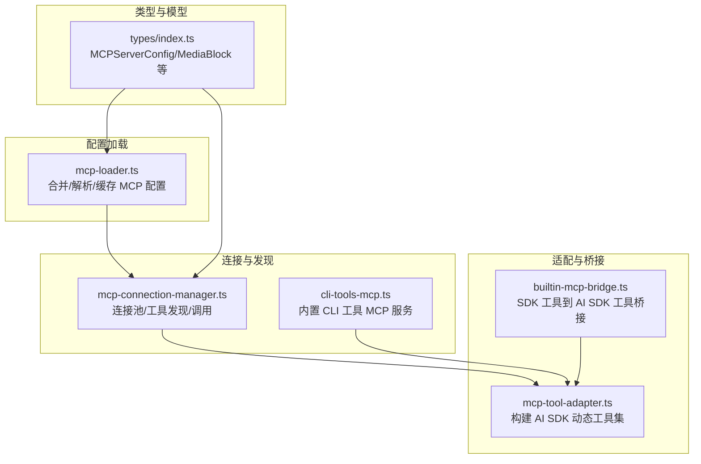
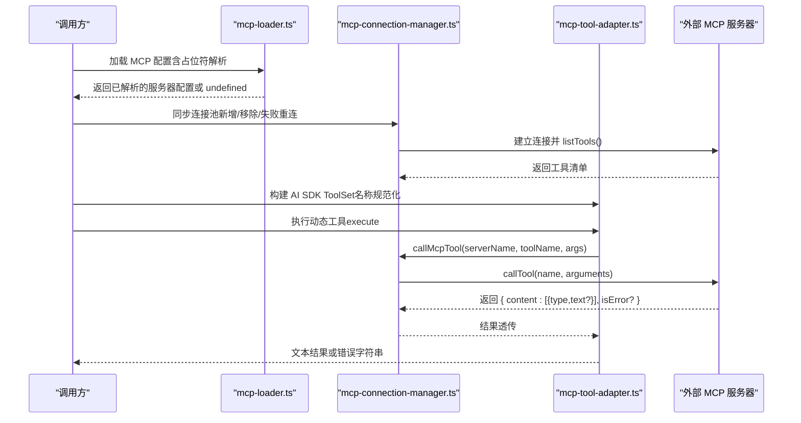
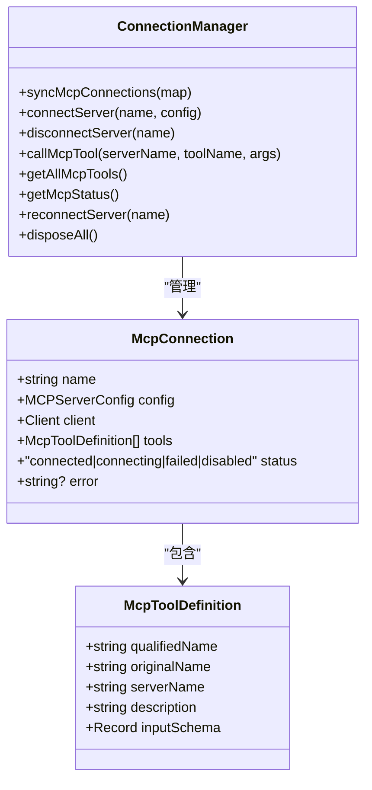
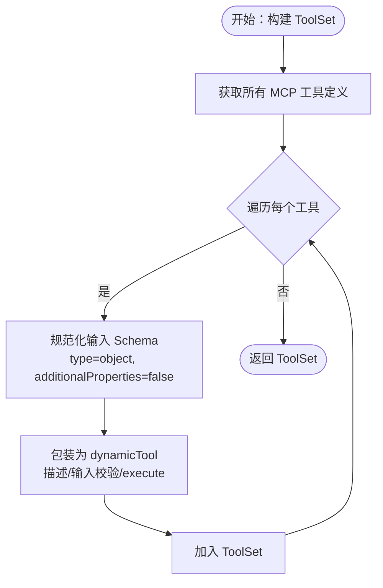
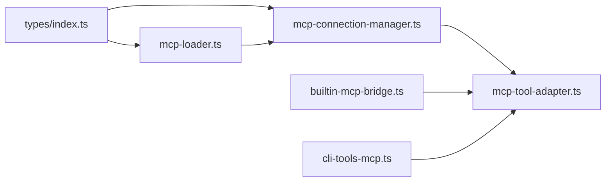

# MCP 工具适配器

<cite>
**本文引用的文件**
- [mcp-tool-adapter.ts](file://src/lib/mcp-tool-adapter.ts)
- [mcp-connection-manager.ts](file://src/lib/mcp-connection-manager.ts)
- [mcp-loader.ts](file://src/lib/mcp-loader.ts)
- [builtin-mcp-bridge.ts](file://src/lib/builtin-mcp-bridge.ts)
- [cli-tools-mcp.ts](file://src/lib/cli-tools-mcp.ts)
- [mcp-loader.test.ts](file://src/__tests__/unit/mcp-loader.test.ts)
- [cli-tools-mcp.test.ts](file://src/__tests__/unit/cli-tools-mcp.test.ts)
- [index.ts](file://src/types/index.ts)
</cite>

## 目录
1. [简介](#简介)
2. [项目结构](#项目结构)
3. [核心组件](#核心组件)
4. [架构总览](#架构总览)
5. [组件详解](#组件详解)
6. [依赖关系分析](#依赖关系分析)
7. [性能与可靠性](#性能与可靠性)
8. [故障排查](#故障排查)
9. [结论](#结论)
10. [附录](#附录)

## 简介
本文件系统性阐述 MCP 工具适配器在本项目中的设计与实现，覆盖以下主题：
- 工具适配器的设计原理与职责边界
- 工具注册流程与名称规范化策略
- 参数映射机制与输入校验
- 工具调用协议、返回值处理与错误传播
- 重试与容错建议
- 自定义工具开发指南、接口规范、类型定义与验证规则
- 完整开发示例与调试技巧

## 项目结构
围绕 MCP 的关键模块分布如下：
- 连接与发现：负责连接外部 MCP 服务器、列举工具、执行工具调用
- 适配层：将 MCP 工具转换为 Vercel AI SDK 的动态工具集
- 内置桥接：将 SDK 风格的内置 MCP 工具转换为 AI SDK 工具
- CLI 工具 MCP：内置的 CLI 工具管理 MCP 服务
- 配置加载：合并用户/项目/本地 MCP 配置，支持占位符解析与缓存
- 类型定义：统一的 MCP 服务器配置与消息模型

图表来源
- [mcp-tool-adapter.ts:1-70](file://src/lib/mcp-tool-adapter.ts#L1-L70)
- [mcp-connection-manager.ts:1-221](file://src/lib/mcp-connection-manager.ts#L1-L221)
- [mcp-loader.ts:1-212](file://src/lib/mcp-loader.ts#L1-L212)
- [builtin-mcp-bridge.ts:1-84](file://src/lib/builtin-mcp-bridge.ts#L1-L84)
- [cli-tools-mcp.ts:1-866](file://src/lib/cli-tools-mcp.ts#L1-L866)
- [index.ts:576-593](file://src/types/index.ts#L576-L593)

章节来源
- [mcp-tool-adapter.ts:1-70](file://src/lib/mcp-tool-adapter.ts#L1-L70)
- [mcp-connection-manager.ts:1-221](file://src/lib/mcp-connection-manager.ts#L1-L221)
- [mcp-loader.ts:1-212](file://src/lib/mcp-loader.ts#L1-L212)
- [builtin-mcp-bridge.ts:1-84](file://src/lib/builtin-mcp-bridge.ts#L1-L84)
- [cli-tools-mcp.ts:1-866](file://src/lib/cli-tools-mcp.ts#L1-L866)
- [index.ts:576-593](file://src/types/index.ts#L576-L593)

## 核心组件
- 连接管理器：维护 MCP 服务器连接池，按需建立/断开连接，列举工具，执行工具调用；支持多种传输方式（stdio/sse/http）。
- 工具适配器：将 MCP 工具定义转换为 AI SDK 的 dynamicTool，自动注入描述、JSON Schema 输入校验与结果文本抽取。
- 内置桥接：将 SDK 风格的内置 MCP 工具转换为 AI SDK 工具，保持逻辑一致性与运行时无 SDK 依赖。
- CLI 工具 MCP：内置 MCP 服务，提供 CLI 工具的安装、注册、更新、检测与列表能力。
- 配置加载器：合并用户/项目/本地 MCP 配置，解析环境变量占位符，应用持久化启用状态覆盖，带 TTL 缓存。

章节来源
- [mcp-connection-manager.ts:1-221](file://src/lib/mcp-connection-manager.ts#L1-L221)
- [mcp-tool-adapter.ts:1-70](file://src/lib/mcp-tool-adapter.ts#L1-L70)
- [builtin-mcp-bridge.ts:1-84](file://src/lib/builtin-mcp-bridge.ts#L1-L84)
- [cli-tools-mcp.ts:1-866](file://src/lib/cli-tools-mcp.ts#L1-L866)
- [mcp-loader.ts:1-212](file://src/lib/mcp-loader.ts#L1-L212)

## 架构总览
下图展示从配置加载到工具调用的全链路：

图表来源
- [mcp-loader.ts:103-136](file://src/lib/mcp-loader.ts#L103-L136)
- [mcp-connection-manager.ts:45-140](file://src/lib/mcp-connection-manager.ts#L45-L140)
- [mcp-tool-adapter.ts:17-69](file://src/lib/mcp-tool-adapter.ts#L17-L69)

## 组件详解

### 连接管理器（mcp-connection-manager.ts）
- 职责
  - 维护连接池，按需连接/断开
  - 通过 transport（stdio/sse/http）建立连接
  - 调用 listTools 发现工具，生成标准化的工具定义
  - 提供 callMcpTool 执行工具调用
  - 提供状态查询与重连、释放能力
- 关键点
  - 工具名称规范化：使用“mcp__{serverName}__{toolName}”避免冲突
  - 输入 Schema 规范化：强制 type=object、additionalProperties=false
  - 错误处理：连接失败记录错误信息，调用失败抛出异常
  - 传输抽象：延迟加载 MCP SDK，按配置选择 transport

图表来源
- [mcp-connection-manager.ts:15-35](file://src/lib/mcp-connection-manager.ts#L15-L35)
- [mcp-connection-manager.ts:45-187](file://src/lib/mcp-connection-manager.ts#L45-L187)

章节来源
- [mcp-connection-manager.ts:1-221](file://src/lib/mcp-connection-manager.ts#L1-L221)

### 工具适配器（mcp-tool-adapter.ts）
- 职责
  - 将连接管理器提供的工具定义转换为 AI SDK 的 dynamicTool
  - 注入描述、JSON Schema 输入校验
  - 执行时调用 callMcpTool 并将 MCP 结果转换为文本
- 关键点
  - 名称规范化：工具名前缀“mcp__{serverName}__”
  - 输入校验：基于 inputSchema 生成 jsonSchema
  - 结果处理：过滤 type=text 的内容拼接；若 isError=true 则返回错误提示；否则返回文本或 JSON 字符串

图表来源
- [mcp-tool-adapter.ts:17-44](file://src/lib/mcp-tool-adapter.ts#L17-L44)
- [mcp-tool-adapter.ts:44-69](file://src/lib/mcp-tool-adapter.ts#L44-L69)

章节来源
- [mcp-tool-adapter.ts:1-70](file://src/lib/mcp-tool-adapter.ts#L1-L70)

### 内置桥接（builtin-mcp-bridge.ts）
- 职责
  - 将 SDK 风格的 MCP 工具（tool(name, description, schema, handler)）转换为 AI SDK 工具（tool({ description, inputSchema, execute }))
  - handler 返回格式为 { content: [{ type: 'text', text }] }，桥接层抽取文本作为工具输出
  - 异常捕获：将错误转为“Error: ...”字符串
- 应用场景
  - 用于内置 MCP 服务器（通知、内存、仪表盘、CLI 工具、媒体、图像生成、小部件等）在原 SDK 中定义，但在 Native Runtime 中以 AI SDK 工具形式可用

章节来源
- [builtin-mcp-bridge.ts:1-84](file://src/lib/builtin-mcp-bridge.ts#L1-L84)

### CLI 工具 MCP（cli-tools-mcp.ts）
- 职责
  - 提供一组 CLI 工具管理工具：列出、安装、添加、删除、检查更新、更新
  - 通过 SDK 工厂创建 MCP 服务器，暴露多个 tool
  - 支持帮助输出解析、版本探测、安装方法识别、更新命令生成
- 关键点
  - 系统提示词注入：当涉及 CLI 工具管理时注入 capability 提示
  - 输出格式：默认文本，支持 format=json 返回结构化数据
  - 权限与安全：安装/更新需要用户确认；对可执行文件进行权限检查
  - 兼容性评估：支持 agentFriendly/supportsJson/supportsSchema/supportsDryRun/contextFriendly 等维度

章节来源
- [cli-tools-mcp.ts:1-866](file://src/lib/cli-tools-mcp.ts#L1-L866)

### 配置加载器（mcp-loader.ts）
- 职责
  - 合并用户级 ~/.claude.json、~/.claude/settings.json、项目级 .mcp.json 的 mcpServers
  - 解析 env 中以 ${...} 表达的占位符，从数据库读取对应设置值
  - 应用持久化启用覆盖（来自 settings.mcpServerOverrides）
  - 过滤禁用服务器，返回可用于 SDK 的配置或用于 UI 展示的完整配置
  - TTL 缓存（30 秒），支持显式失效
- 关键点
  - 仅返回需要 CodePilot 特殊处理的服务器（即包含占位符且已解析）
  - 项目级配置支持按实际工作目录读取，解决桌面应用工作目录与项目目录不一致的问题

章节来源
- [mcp-loader.ts:1-212](file://src/lib/mcp-loader.ts#L1-L212)

### 类型定义（types/index.ts）
- 关键类型
  - MCPServerConfig：服务器配置（command/args/env/type/url/headers/enabled）
  - MessageContentBlock：消息内容块（含 tool_result，支持 is_error 与媒体）
  - MediaBlock：图片/音频/视频媒体块
- 作用
  - 统一 MCP 服务器配置与消息模型，保证跨模块一致性

章节来源
- [index.ts:576-593](file://src/types/index.ts#L576-L593)
- [index.ts:160-176](file://src/types/index.ts#L160-L176)

## 依赖关系分析
- mcp-loader.ts 依赖 types/index.ts 中的 MCPServerConfig 定义
- mcp-connection-manager.ts 依赖 types/index.ts 的 MCPServerConfig，并根据配置创建不同 transport
- mcp-tool-adapter.ts 依赖 mcp-connection-manager.ts 提供的工具定义与调用接口
- builtin-mcp-bridge.ts 与 cli-tools-mcp.ts 为独立的 MCP 服务实现，前者用于桥接 SDK 工具，后者为内置 CLI 工具服务
- 测试文件验证配置加载行为与 CLI 工具辅助函数的正确性

图表来源
- [index.ts:576-593](file://src/types/index.ts#L576-L593)
- [mcp-loader.ts:1-212](file://src/lib/mcp-loader.ts#L1-L212)
- [mcp-connection-manager.ts:1-221](file://src/lib/mcp-connection-manager.ts#L1-L221)
- [mcp-tool-adapter.ts:1-70](file://src/lib/mcp-tool-adapter.ts#L1-L70)
- [builtin-mcp-bridge.ts:1-84](file://src/lib/builtin-mcp-bridge.ts#L1-L84)
- [cli-tools-mcp.ts:1-866](file://src/lib/cli-tools-mcp.ts#L1-L866)

章节来源
- [index.ts:576-593](file://src/types/index.ts#L576-L593)
- [mcp-loader.ts:1-212](file://src/lib/mcp-loader.ts#L1-L212)
- [mcp-connection-manager.ts:1-221](file://src/lib/mcp-connection-manager.ts#L1-L221)
- [mcp-tool-adapter.ts:1-70](file://src/lib/mcp-tool-adapter.ts#L1-L70)
- [builtin-mcp-bridge.ts:1-84](file://src/lib/builtin-mcp-bridge.ts#L1-L84)
- [cli-tools-mcp.ts:1-866](file://src/lib/cli-tools-mcp.ts#L1-L866)

## 性能与可靠性
- 缓存策略
  - mcp-loader.ts 使用 30 秒 TTL 缓存合并后的配置，减少重复读取与解析成本
- 连接复用
  - mcp-connection-manager.ts 维护连接池，避免频繁建立/销毁连接
- 传输选择
  - 根据配置选择最优传输（stdio/sse/http），降低延迟与资源占用
- 错误隔离
  - 连接失败与工具调用失败分别处理，便于定位问题
- 可观测性
  - 提供 getMcpStatus 查询各服务器状态、工具数量与错误信息

章节来源
- [mcp-loader.ts:25-99](file://src/lib/mcp-loader.ts#L25-L99)
- [mcp-connection-manager.ts:158-168](file://src/lib/mcp-connection-manager.ts#L158-L168)

## 故障排查
- 常见问题与定位
  - 服务器未连接：检查连接状态与错误信息；必要时触发重连
  - 工具不可用：确认工具是否在当前服务器上被发现；检查名称规范化前缀
  - 输入校验失败：核对输入 Schema 是否与工具定义一致
  - 占位符未解析：确认配置中 ${...} 是否存在对应设置项；检查缓存是否过期
- 单元测试参考
  - 验证配置加载：占位符解析、禁用服务器过滤、缓存命中与失效
  - 验证 CLI 工具辅助函数：安装方法识别、包规格提取、更新命令生成、二进制候选解析

章节来源
- [mcp-loader.test.ts:1-79](file://src/__tests__/unit/mcp-loader.test.ts#L1-L79)
- [cli-tools-mcp.test.ts:1-217](file://src/__tests__/unit/cli-tools-mcp.test.ts#L1-L217)

## 结论
本系统的 MCP 工具适配器通过“配置加载 + 连接管理 + 工具适配”的分层设计，实现了对外部 MCP 服务器的统一接入与对 AI SDK 的无缝适配。内置桥接与 CLI 工具 MCP 进一步增强了生态能力。整体方案具备良好的扩展性、可观测性与可维护性。

## 附录

### 工具调用协议与返回值处理
- 调用入口
  - 由 AI SDK 的 dynamicTool.execute 触发
- 协议约定
  - 输入：JSON Schema 校验后的参数对象
  - 输出：MCP 服务器返回 { content: [{ type: 'text', text? }], isError? }
- 处理流程
  - 仅保留 type='text' 的片段并拼接
  - 若 isError=true，返回“Error: ...”字符串
  - 否则返回拼接文本或原始 JSON 字符串

章节来源
- [mcp-tool-adapter.ts:44-69](file://src/lib/mcp-tool-adapter.ts#L44-L69)
- [mcp-connection-manager.ts:124-140](file://src/lib/mcp-connection-manager.ts#L124-L140)

### 参数映射机制与输入校验
- 名称规范化
  - 工具名前缀“mcp__{serverName}__{toolName}”，避免多服务器同名冲突
- 输入校验
  - 基于工具定义的 inputSchema 生成 jsonSchema，确保类型安全
- Schema 规范化
  - 强制 type=object，additionalProperties=false，提升安全性

章节来源
- [mcp-tool-adapter.ts:31-44](file://src/lib/mcp-tool-adapter.ts#L31-L44)
- [mcp-connection-manager.ts:94-100](file://src/lib/mcp-connection-manager.ts#L94-L100)

### 错误传播与重试建议
- 错误传播
  - 连接失败：记录错误信息，状态标记为 failed
  - 调用失败：抛出异常，由上层捕获并转换为错误字符串
- 重试建议
  - 对瞬时网络/进程错误可考虑指数退避重试
  - 对工具调用失败，建议在上层 UI 层提示用户并允许重新尝试

章节来源
- [mcp-connection-manager.ts:103-107](file://src/lib/mcp-connection-manager.ts#L103-L107)
- [mcp-tool-adapter.ts:59-61](file://src/lib/mcp-tool-adapter.ts#L59-L61)

### 自定义工具开发指南
- 开发步骤
  - 实现 MCP 服务器（支持 stdio/sse/http 传输）
  - 在服务器中定义工具，提供描述、输入 Schema 与处理器
  - 将服务器配置写入 ~/.claude.json 或项目 .mcp.json 的 mcpServers
  - 如需占位符解析，使用 ${key} 形式并在设置中提供对应值
- 接口规范
  - 工具名称必须唯一（同一服务器内）
  - 输入 Schema 必须为 JSON Schema 对象
  - 处理器返回格式应遵循 { content: [{ type: 'text', text? }], isError? }
- 类型与模型
  - 使用 MCPServerConfig 描述服务器配置
  - 使用 MessageContentBlock/ MediaBlock 描述消息与媒体内容

章节来源
- [index.ts:576-593](file://src/types/index.ts#L576-L593)
- [index.ts:160-176](file://src/types/index.ts#L160-L176)
- [mcp-loader.ts:64-83](file://src/lib/mcp-loader.ts#L64-L83)

### 工具接口规范与验证规则
- 工具接口
  - listTools：返回工具清单（name/description/inputSchema）
  - callTool：执行工具，返回内容数组与可选错误标记
- 验证规则
  - 输入必须满足 JSON Schema
  - 输出必须包含 text 类型片段；可选 isError 标记
  - 名称规范化：mcp__{serverName}__{toolName}

章节来源
- [mcp-connection-manager.ts:93-100](file://src/lib/mcp-connection-manager.ts#L93-L100)
- [mcp-tool-adapter.ts:14-23](file://src/lib/mcp-tool-adapter.ts#L14-L23)

### 完整开发示例（步骤化）
- 示例：新增一个 stdio 传输的 MCP 工具服务器
  1) 在 ~/.claude.json 中添加 mcpServers 条目，指定 type=stdio、command、args、env
  2) 在服务器中实现 listTools 与 callTool
  3) 在 UI 或配置中启用该服务器（如需持久化覆盖）
  4) 通过 mcp-tool-adapter.ts 生成的 ToolSet 使用该工具
- 示例：内置 CLI 工具 MCP 的使用
  - 使用 codepilot_cli_tools_list 获取工具清单（支持 format=json）
  - 使用 codepilot_cli_tools_install 执行安装并自动注册
  - 使用 codepilot_cli_tools_add 保存描述与兼容性评估
  - 使用 codepilot_cli_tools_check_updates 与 codepilot_cli_tools_update 管理更新

章节来源
- [cli-tools-mcp.ts:101-111](file://src/lib/cli-tools-mcp.ts#L101-L111)
- [cli-tools-mcp.ts:115-866](file://src/lib/cli-tools-mcp.ts#L115-L866)

### 调试技巧
- 启用日志
  - 观察连接管理器的状态变化与错误信息
- 验证配置
  - 使用 mcp-loader 的 loadAllMcpServers 与 loadCodePilotMcpServers 验证合并与解析结果
- 单元测试
  - 运行 mcp-loader.test.ts 与 cli-tools-mcp.test.ts 验证关键逻辑
- 本地验证
  - 在本地启动 MCP 服务器，使用最小配置快速验证工具发现与调用

章节来源
- [mcp-loader.test.ts:1-79](file://src/__tests__/unit/mcp-loader.test.ts#L1-L79)
- [cli-tools-mcp.test.ts:1-217](file://src/__tests__/unit/cli-tools-mcp.test.ts#L1-L217)