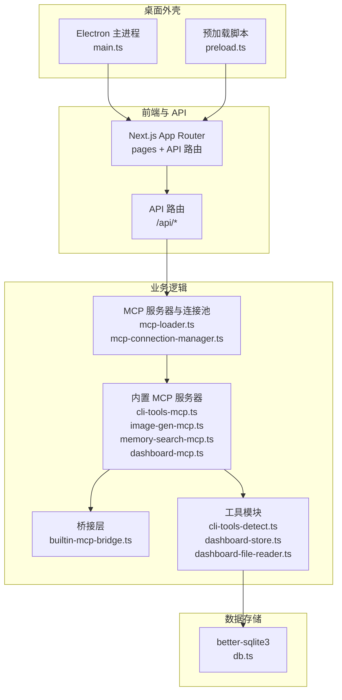
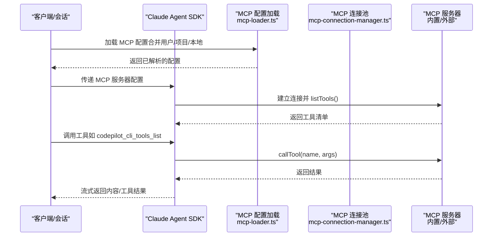
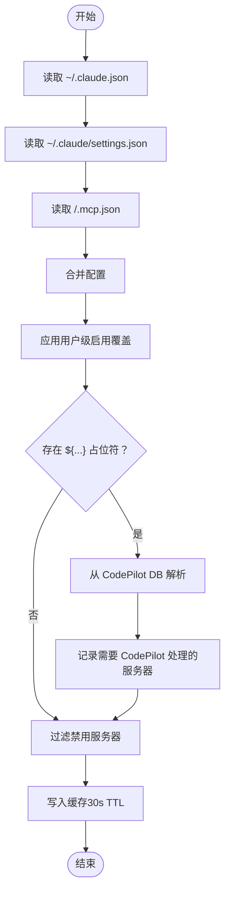
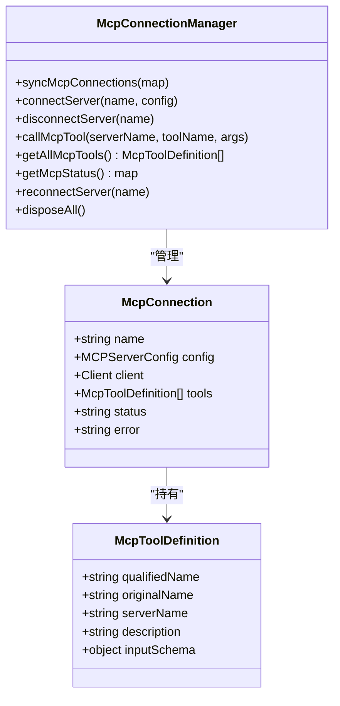
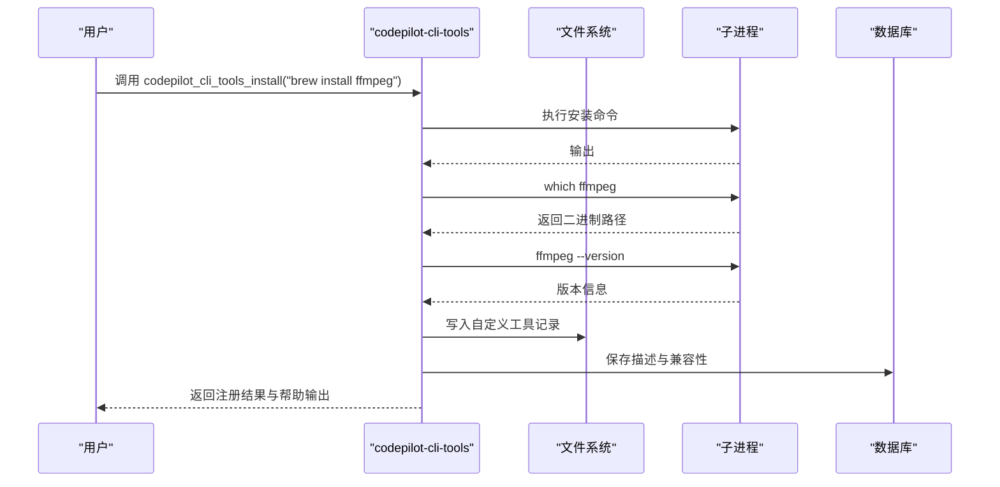
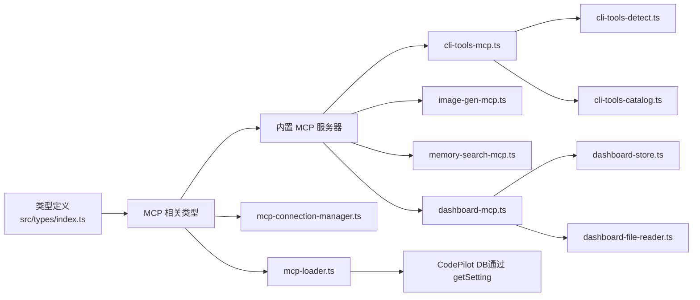

# MCP 开发指南

<cite>
**本文档引用的文件**
- [package.json](file://package.json)
- [ARCHITECTURE.md](file://ARCHITECTURE.md)
- [mcp-loader.ts](file://src/lib/mcp-loader.ts)
- [mcp-connection-manager.ts](file://src/lib/mcp-connection-manager.ts)
- [builtin-mcp-bridge.ts](file://src/lib/builtin-mcp-bridge.ts)
- [cli-tools-mcp.ts](file://src/lib/cli-tools-mcp.ts)
- [image-gen-mcp.ts](file://src/lib/image-gen-mcp.ts)
- [memory-search-mcp.ts](file://src/lib/memory-search-mcp.ts)
- [dashboard-mcp.ts](file://src/lib/dashboard-mcp.ts)
- [cli-tools-detect.ts](file://src/lib/cli-tools-detect.ts)
- [cli-tools-catalog.ts](file://src/lib/cli-tools-catalog.ts)
- [dashboard-store.ts](file://src/lib/dashboard-store.ts)
- [dashboard-file-reader.ts](file://src/lib/dashboard-file-reader.ts)
- [index.ts](file://src/types/index.ts)
- [page.tsx](file://src/app/plugins/mcp/page.tsx)
</cite>

## 目录
1. [简介](#简介)
2. [项目结构](#项目结构)
3. [核心组件](#核心组件)
4. [架构总览](#架构总览)
5. [详细组件分析](#详细组件分析)
6. [依赖关系分析](#依赖关系分析)
7. [性能考量](#性能考量)
8. [故障排查指南](#故障排查指南)
9. [结论](#结论)
10. [附录](#附录)

## 简介
本指南面向希望基于现有代码库开发自定义 MCP（Model Context Protocol）服务器的工程师。文档涵盖开发步骤、项目结构建议、依赖管理与构建配置、开发环境搭建、调试工具使用、测试策略、部署流程、常见开发模式、性能优化技巧、安全考虑与最佳实践，并提供可直接参考的实现路径与模板。

## 项目结构
该项目采用前后端分离与桌面应用打包的混合架构：
- 前端与 API：Next.js App Router（页面 + API 路由）
- 桌面外壳：Electron（主进程与预加载）
- 数据层：better-sqlite3（本地数据库）
- AI 集成：Claude Agent SDK、@ai-sdk 系列
- MCP 支持：内置 MCP 服务器与连接池管理

**图表来源**
- [ARCHITECTURE.md:1-183](file://ARCHITECTURE.md#L1-L183)
- [mcp-loader.ts:1-212](file://src/lib/mcp-loader.ts#L1-L212)
- [mcp-connection-manager.ts:1-221](file://src/lib/mcp-connection-manager.ts#L1-L221)
- [cli-tools-mcp.ts:1-866](file://src/lib/cli-tools-mcp.ts#L1-L866)
- [image-gen-mcp.ts:1-81](file://src/lib/image-gen-mcp.ts#L1-L81)
- [memory-search-mcp.ts:1-349](file://src/lib/memory-search-mcp.ts#L1-L349)
- [dashboard-mcp.ts:1-298](file://src/lib/dashboard-mcp.ts#L1-L298)

**章节来源**
- [ARCHITECTURE.md:1-183](file://ARCHITECTURE.md#L1-L183)

## 核心组件
- MCP 配置加载与缓存：负责从用户/项目/本地配置源合并 MCP 服务器配置，并处理环境变量占位符解析与缓存失效。
- MCP 连接池：管理外部 MCP 服务器（stdio/sse/http）的连接、工具发现与调用。
- 内置 MCP 服务器：提供 CLI 工具管理、图像生成、记忆检索、仪表盘管理等能力。
- 桥接层：将 SDK 风格的 MCP 工具转换为 Vercel AI SDK 工具，便于在原生运行时使用。
- 工具与存储：CLI 工具检测与目录、仪表盘配置与文件读取等辅助模块。

**章节来源**
- [mcp-loader.ts:1-212](file://src/lib/mcp-loader.ts#L1-L212)
- [mcp-connection-manager.ts:1-221](file://src/lib/mcp-connection-manager.ts#L1-L221)
- [builtin-mcp-bridge.ts:1-84](file://src/lib/builtin-mcp-bridge.ts#L1-L84)
- [cli-tools-mcp.ts:1-866](file://src/lib/cli-tools-mcp.ts#L1-L866)
- [image-gen-mcp.ts:1-81](file://src/lib/image-gen-mcp.ts#L1-L81)
- [memory-search-mcp.ts:1-349](file://src/lib/memory-search-mcp.ts#L1-L349)
- [dashboard-mcp.ts:1-298](file://src/lib/dashboard-mcp.ts#L1-L298)

## 架构总览
MCP 在本项目中的角色分为两类：
- SDK 驱动：通过 Claude Agent SDK 的 Options 注入 MCP 服务器配置，SDK 负责连接与工具调用。
- 原生运行时：通过连接池直接管理 MCP 服务器，发现工具并调用，用于需要更细粒度控制的场景。

**图表来源**
- [mcp-loader.ts:40-99](file://src/lib/mcp-loader.ts#L40-L99)
- [mcp-connection-manager.ts:45-108](file://src/lib/mcp-connection-manager.ts#L45-L108)
- [cli-tools-mcp.ts:115-136](file://src/lib/cli-tools-mcp.ts#L115-L136)

**章节来源**
- [mcp-loader.ts:1-212](file://src/lib/mcp-loader.ts#L1-L212)
- [mcp-connection-manager.ts:1-221](file://src/lib/mcp-connection-manager.ts#L1-L221)

## 详细组件分析

### MCP 配置加载与缓存（mcp-loader.ts）
- 合并来源：用户级 ~/.claude.json、用户级 ~/.claude/settings.json、项目级 .mcp.json。
- 占位符解析：对 env 中以 ${...} 形式的键进行 CodePilot DB 查询解析。
- 缓存策略：30 秒 TTL；提供显式失效接口。
- 项目级补偿：针对 DB 提供者请求路径差异，提供按实际工作目录读取项目 .mcp.json 的方法。

**图表来源**
- [mcp-loader.ts:40-99](file://src/lib/mcp-loader.ts#L40-L99)

**章节来源**
- [mcp-loader.ts:1-212](file://src/lib/mcp-loader.ts#L1-L212)

### MCP 连接池（mcp-connection-manager.ts）
- 单例连接池：维护每个服务器的连接状态、工具清单。
- 连接管理：新增/更新/断开连接；失败重连；关闭清理。
- 工具发现与调用：listTools() 后生成带前缀的 qualifiedName；callTool() 执行工具。
- 传输类型：stdio、sse、http；按配置动态创建传输。

**图表来源**
- [mcp-connection-manager.ts:15-187](file://src/lib/mcp-connection-manager.ts#L15-L187)

**章节来源**
- [mcp-connection-manager.ts:1-221](file://src/lib/mcp-connection-manager.ts#L1-L221)

### 内置 MCP 服务器

#### CLI 工具 MCP（cli-tools-mcp.ts）
- 工具集：列出、安装、添加、删除、检查更新、更新 CLI 工具。
- 关键特性：自动解析安装命令、提取包名、执行 --help 获取帮助信息、生成双语描述、评估代理友好性。
- 系统提示：提供 CLI 工具能力说明，指导使用最佳实践（agentFriendly、supportsJson、supportsSchema、supportsDryRun、contextFriendly）。

**图表来源**
- [cli-tools-mcp.ts:260-428](file://src/lib/cli-tools-mcp.ts#L260-L428)
- [cli-tools-detect.ts:1-156](file://src/lib/cli-tools-detect.ts#L1-L156)
- [cli-tools-catalog.ts:1-452](file://src/lib/cli-tools-catalog.ts#L1-L452)

**章节来源**
- [cli-tools-mcp.ts:1-866](file://src/lib/cli-tools-mcp.ts#L1-L866)
- [cli-tools-detect.ts:1-156](file://src/lib/cli-tools-detect.ts#L1-L156)
- [cli-tools-catalog.ts:1-452](file://src/lib/cli-tools-catalog.ts#L1-L452)

#### 图像生成 MCP（image-gen-mcp.ts）
- 工具：生成单张图片，保存至磁盘与数据库，返回本地路径以便前端渲染。
- 标记：通过固定前缀在结果中标注媒体块，前端注入媒体展示。

**章节来源**
- [image-gen-mcp.ts:1-81](file://src/lib/image-gen-mcp.ts#L1-L81)

#### 记忆检索 MCP（memory-search-mcp.ts）
- 工具：搜索记忆、读取文件、获取近期记忆。
- 安全：路径白名单与符号链接解析校验，防止越权访问。
- 搜索：时间衰减、标签过滤、AI 重排序（超时保护）。

**章节来源**
- [memory-search-mcp.ts:1-349](file://src/lib/memory-search-mcp.ts#L1-L349)

#### 仪表盘 MCP（dashboard-mcp.ts）
- 工具：钉住、列出、刷新、更新、移除仪表盘小部件。
- 数据源：文件、MCP 工具、CLI 命令；刷新时返回原始 HTML 以便保持视觉一致性。

**章节来源**
- [dashboard-mcp.ts:1-298](file://src/lib/dashboard-mcp.ts#L1-L298)
- [dashboard-store.ts:1-120](file://src/lib/dashboard-store.ts#L1-L120)
- [dashboard-file-reader.ts:1-89](file://src/lib/dashboard-file-reader.ts#L1-L89)

### 桥接层（builtin-mcp-bridge.ts）
- 目标：将 SDK 风格的 MCP 工具处理器转换为 Vercel AI SDK 工具，避免重复实现。
- 方案：包装 SDK 工具 handler，提取文本内容作为 execute 返回值。

**章节来源**
- [builtin-mcp-bridge.ts:1-84](file://src/lib/builtin-mcp-bridge.ts#L1-L84)

## 依赖关系分析

**图表来源**
- [index.ts:576-589](file://src/types/index.ts#L576-L589)
- [mcp-loader.ts:14-15](file://src/lib/mcp-loader.ts#L14-L15)
- [mcp-connection-manager.ts:9-12](file://src/lib/mcp-connection-manager.ts#L9-L12)
- [cli-tools-mcp.ts:15-29](file://src/lib/cli-tools-mcp.ts#L15-L29)
- [dashboard-mcp.ts:10-20](file://src/lib/dashboard-mcp.ts#L10-L20)

**章节来源**
- [index.ts:576-589](file://src/types/index.ts#L576-L589)

## 性能考量
- 配置加载缓存：30 秒 TTL，减少频繁 IO 与解析成本。
- CLI 工具检测缓存：2 分钟 TTL，避免重复扫描 PATH。
- 连接池复用：避免频繁建立/销毁连接，降低延迟。
- 搜索与读取限制：记忆检索对文件大小与行数进行截断，仪表盘文件读取设置上限，防止内存溢出。
- 异步与超时：仪表盘 AI 重排序设置 5 秒超时，失败回退。

**章节来源**
- [mcp-loader.ts:25-31](file://src/lib/mcp-loader.ts#L25-L31)
- [cli-tools-detect.ts:9-12](file://src/lib/cli-tools-detect.ts#L9-L12)
- [memory-search-mcp.ts:244-260](file://src/lib/memory-search-mcp.ts#L244-L260)
- [dashboard-file-reader.ts:9-11](file://src/lib/dashboard-file-reader.ts#L9-L11)

## 故障排查指南
- MCP 服务器不可达
  - 检查连接池状态与错误信息：[getMcpStatus:158-168](file://src/lib/mcp-connection-manager.ts#L158-L168)
  - 重新连接：[reconnectServer:173-178](file://src/lib/mcp-connection-manager.ts#L173-L178)
- 配置未生效
  - 清理缓存：[invalidateMcpCache:29-31](file://src/lib/mcp-loader.ts#L29-L31)
  - 确认用户/项目/本地配置合并顺序与覆盖规则：[loadAndMerge:40-99](file://src/lib/mcp-loader.ts#L40-L99)
- 工具调用失败
  - 查看工具发现与调用链路：[connectServer:69-108](file://src/lib/mcp-connection-manager.ts#L69-L108)、[callMcpTool:124-140](file://src/lib/mcp-connection-manager.ts#L124-L140)
- CLI 工具检测异常
  - 检查 PATH 扩展与权限：[detectAllCliTools:125-148](file://src/lib/cli-tools-detect.ts#L125-L148)
  - 清理检测缓存：[invalidateDetectCache:153-156](file://src/lib/cli-tools-detect.ts#L153-L156)
- 记忆检索越权
  - 校验路径与符号链接解析：[getFileTags:265-274](file://src/lib/memory-search-mcp.ts#L265-L274)

**章节来源**
- [mcp-connection-manager.ts:158-178](file://src/lib/mcp-connection-manager.ts#L158-L178)
- [mcp-loader.ts:29-31](file://src/lib/mcp-loader.ts#L29-L31)
- [cli-tools-detect.ts:153-156](file://src/lib/cli-tools-detect.ts#L153-L156)
- [memory-search-mcp.ts:265-274](file://src/lib/memory-search-mcp.ts#L265-L274)

## 结论
本指南提供了基于现有代码库开发自定义 MCP 服务器的完整路径：从配置加载与缓存、连接池管理，到内置 MCP 服务器的实现模式与桥接策略。遵循本文档的开发步骤、性能与安全建议，可快速构建稳定、可扩展的 MCP 能力，并与现有前端、桌面外壳与数据库生态无缝集成。

## 附录

### 开发环境搭建
- Node.js 与包管理：使用项目提供的脚本与依赖声明。
- Next.js 开发：[dev 脚本:17-28](file://package.json#L17-L28)
- Electron 开发：[electron:dev 脚本:31-36](file://package.json#L31-L36)
- 类型检查与测试：[typecheck:22-28](file://package.json#L22-L28)、[test:unit:22-28](file://package.json#L22-L28)

**章节来源**
- [package.json:17-36](file://package.json#L17-L36)

### 调试工具使用
- 单元测试：tsx + node:test（参考测试入口与计划）
- E2E 测试：Playwright（参考测试脚本）
- 日志与错误：运行时环形缓冲与错误分类（参见 ARCHITECTURE.md）

**章节来源**
- [package.json:22-28](file://package.json#L22-L28)
- [ARCHITECTURE.md:1-183](file://ARCHITECTURE.md#L1-L183)

### 测试策略
- 单元测试：针对 MCP 服务器工具函数与工具处理器的边界条件与错误路径。
- 集成测试：模拟 MCP 服务器连接、工具调用与结果解析。
- 端到端测试：覆盖从聊天到工具调用的完整链路。

**章节来源**
- [package.json:22-28](file://package.json#L22-L28)

### 部署流程
- Next.js 构建与启动：[build:18-20](file://package.json#L18-L20)
- Electron 打包：[electron:build:32-36](file://package.json#L32-L36)
- 平台打包：mac/win/linux 分别的 electron-builder 脚本

**章节来源**
- [package.json:18-36](file://package.json#L18-L36)

### 常见开发模式
- 关键字触发：CLI 工具 MCP 使用关键字触发注册，避免无谓加载。
- 系统提示注入：内置 MCP 服务器在激活时注入系统提示，引导模型正确使用工具。
- 项目级补偿：针对 DB 提供者请求路径差异，按实际工作目录读取项目 .mcp.json。

**章节来源**
- [cli-tools-mcp.ts:12-13](file://src/lib/cli-tools-mcp.ts#L12-L13)
- [mcp-loader.ts:138-161](file://src/lib/mcp-loader.ts#L138-L161)

### 性能优化技巧
- 缓存：配置加载与 CLI 检测缓存，减少重复 IO。
- 连接池：共享连接，避免频繁握手。
- 截断与超时：对大文件与长耗时操作设置上限与超时保护。
- 并行：检测与读取采用 Promise.all 并行化。

**章节来源**
- [mcp-loader.ts:25-31](file://src/lib/mcp-loader.ts#L25-L31)
- [cli-tools-detect.ts:125-148](file://src/lib/cli-tools-detect.ts#L125-L148)
- [memory-search-mcp.ts:302-348](file://src/lib/memory-search-mcp.ts#L302-L348)

### 安全考虑
- 路径安全：记忆检索严格校验相对路径与符号链接解析，防止越权访问。
- 权限提示：SDK 侧提供权限请求事件，UI 层展示与处理。
- 环境变量：仅解析明确的 ${...} 占位符，避免任意替换。

**章节来源**
- [memory-search-mcp.ts:123-144](file://src/lib/memory-search-mcp.ts#L123-L144)
- [index.ts:535-556](file://src/types/index.ts#L535-L556)
- [mcp-loader.ts:64-83](file://src/lib/mcp-loader.ts#L64-L83)

### 最佳实践
- 类型先行：统一使用 MCPServerConfig 与工具输入输出的 Zod 校验。
- 系统提示：为每个 MCP 服务器提供清晰的能力说明与使用规则。
- 错误处理：工具调用捕获异常并返回可读错误信息。
- 可观测性：记录连接状态、工具数量与错误详情。

**章节来源**
- [index.ts:576-589](file://src/types/index.ts#L576-L589)
- [cli-tools-mcp.ts:101-111](file://src/lib/cli-tools-mcp.ts#L101-L111)
- [mcp-connection-manager.ts:158-168](file://src/lib/mcp-connection-manager.ts#L158-L168)

### 开发示例与模板
- 自定义 MCP 服务器模板：参考内置服务器的工厂函数与工具定义方式。
  - 示例路径：[createCliToolsMcpServer:115-136](file://src/lib/cli-tools-mcp.ts#L115-L136)
  - 示例路径：[createImageGenMcpServer:22-80](file://src/lib/image-gen-mcp.ts#L22-L80)
  - 示例路径：[createMemorySearchMcpServer:42-238](file://src/lib/memory-search-mcp.ts#L42-L238)
  - 示例路径：[createDashboardMcpServer:46-297](file://src/lib/dashboard-mcp.ts#L46-L297)
- 配置加载与缓存：参考 [loadCodePilotMcpServers:112-119](file://src/lib/mcp-loader.ts#L112-L119) 与 [loadAllMcpServers:129-136](file://src/lib/mcp-loader.ts#L129-L136)
- 连接池管理：参考 [syncMcpConnections:45-64](file://src/lib/mcp-connection-manager.ts#L45-L64) 与 [callMcpTool:124-140](file://src/lib/mcp-connection-manager.ts#L124-L140)

**章节来源**
- [cli-tools-mcp.ts:115-136](file://src/lib/cli-tools-mcp.ts#L115-L136)
- [image-gen-mcp.ts:22-80](file://src/lib/image-gen-mcp.ts#L22-L80)
- [memory-search-mcp.ts:42-238](file://src/lib/memory-search-mcp.ts#L42-L238)
- [dashboard-mcp.ts:46-297](file://src/lib/dashboard-mcp.ts#L46-L297)
- [mcp-loader.ts:112-136](file://src/lib/mcp-loader.ts#L112-L136)
- [mcp-connection-manager.ts:45-140](file://src/lib/mcp-connection-manager.ts#L45-L140)