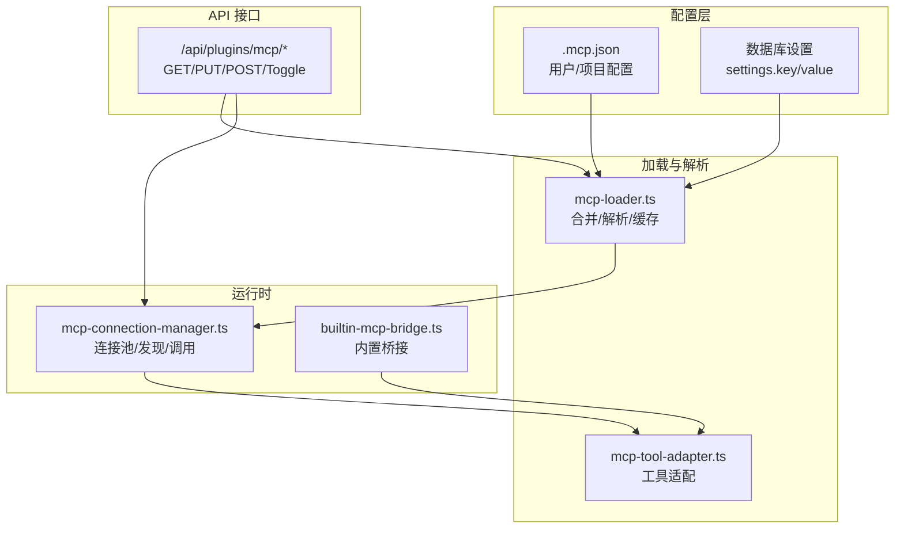
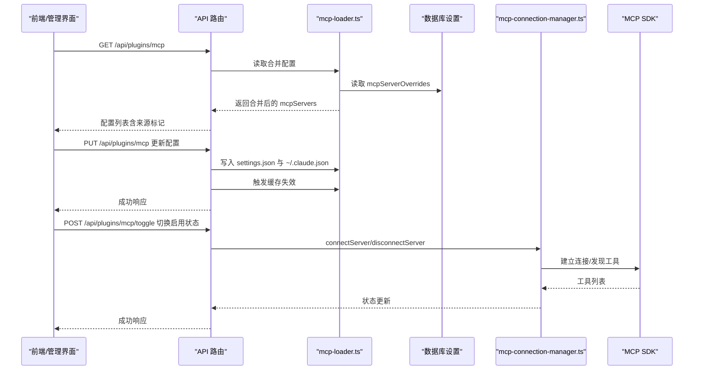
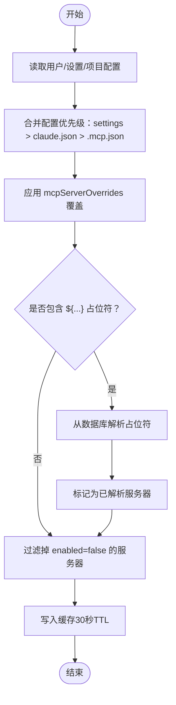
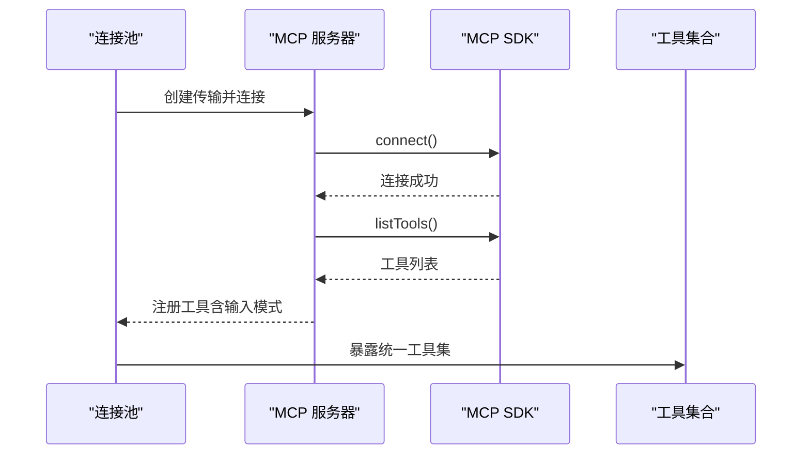
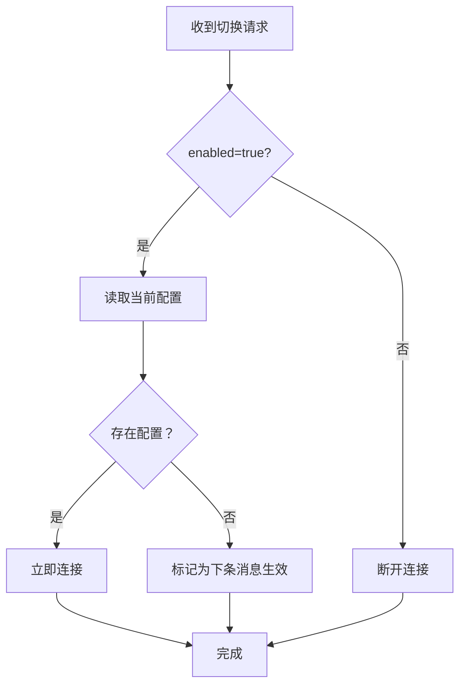
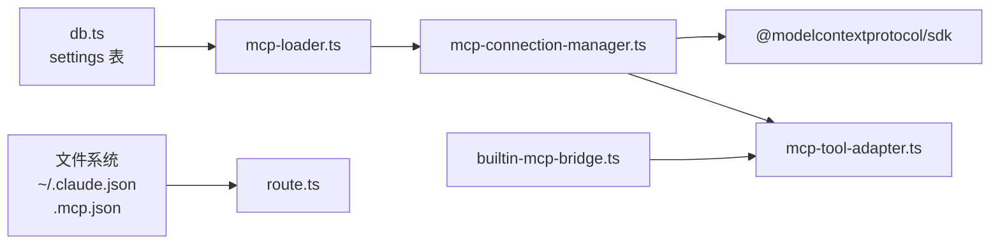

# MCP 服务器管理

<cite>
**本文档引用的文件**
- [.mcp.json](file://.mcp.json)
- [mcp-loader.ts](file://src/lib/mcp-loader.ts)
- [mcp-connection-manager.ts](file://src/lib/mcp-connection-manager.ts)
- [mcp-tool-adapter.ts](file://src/lib/mcp-tool-adapter.ts)
- [builtin-mcp-bridge.ts](file://src/lib/builtin-mcp-bridge.ts)
- [route.ts](file://src/app/api/plugins/mcp/route.ts)
- [toggle/route.ts](file://src/app/api/plugins/mcp/toggle/route.ts)
- [mcp-config.test.ts](file://src/__tests__/unit/mcp-config.test.ts)
- [mcp-loader.test.ts](file://src/__tests__/unit/mcp-loader.test.ts)
- [db.ts](file://src/lib/db.ts)
- [cli-tools-mcp.ts](file://src/lib/cli-tools-mcp.ts)
- [dashboard-mcp.ts](file://src/lib/dashboard-mcp.ts)
- [image-gen-mcp.ts](file://src/lib/image-gen-mcp.ts)
- [media-import-mcp.ts](file://src/lib/media-import-mcp.ts)
- [memory-search-mcp.ts](file://src/lib/memory-search-mcp.ts)
</cite>

## 目录
1. [简介](#简介)
2. [项目结构](#项目结构)
3. [核心组件](#核心组件)
4. [架构总览](#架构总览)
5. [详细组件分析](#详细组件分析)
6. [依赖关系分析](#依赖关系分析)
7. [性能考虑](#性能考虑)
8. [故障排除指南](#故障排除指南)
9. [结论](#结论)
10. [附录](#附录)

## 简介
本文件系统性阐述 CodePilot 中的 MCP（Model Context Protocol）服务器管理能力，涵盖配置文件格式、环境变量占位符解析、服务器发现与连接、启用/禁用状态管理、持久化覆盖机制、缓存策略，并提供配置模板、验证规则与故障排除建议。目标是帮助开发者与使用者高效地部署、调试与优化 MCP 服务器。

## 项目结构
围绕 MCP 的核心代码分布在以下模块：
- 配置加载与合并：mcp-loader.ts
- 运行时连接池：mcp-connection-manager.ts
- 工具适配层：mcp-tool-adapter.ts
- 内置 MCP 桥接：builtin-mcp-bridge.ts
- API 管理接口：route.ts、toggle/route.ts
- 配置转换与校验：mcp-config.test.ts
- 数据库设置访问：db.ts
- 内置 MCP 服务器：cli-tools-mcp.ts、dashboard-mcp.ts、image-gen-mcp.ts、media-import-mcp.ts、memory-search-mcp.ts

图表来源
- [mcp-loader.ts:1-212](file://src/lib/mcp-loader.ts#L1-L212)
- [mcp-connection-manager.ts:1-221](file://src/lib/mcp-connection-manager.ts#L1-L221)
- [mcp-tool-adapter.ts:1-70](file://src/lib/mcp-tool-adapter.ts#L1-L70)
- [builtin-mcp-bridge.ts:1-84](file://src/lib/builtin-mcp-bridge.ts#L1-L84)
- [route.ts:1-189](file://src/app/api/plugins/mcp/route.ts#L1-L189)

章节来源
- [mcp-loader.ts:1-212](file://src/lib/mcp-loader.ts#L1-L212)
- [route.ts:1-189](file://src/app/api/plugins/mcp/route.ts#L1-L189)

## 核心组件
- 配置加载器（mcp-loader.ts）
  - 合并用户级、设置级与项目级配置
  - 解析环境变量占位符（${key}），仅对包含占位符且处于启用状态的服务器进行处理
  - 应用持久化覆盖（settings.json 中的 mcpServerOverrides）
  - 提供缓存（30 秒 TTL），支持失效刷新
  - 支持按项目目录单独读取 .mcp.json 并应用覆盖
- 连接管理器（mcp-connection-manager.ts）
  - 基于配置建立连接池，支持 stdio/sse/http 传输
  - 自动发现工具并生成统一工具定义
  - 提供连接/断开、重连、状态查询、工具调用
- 工具适配器（mcp-tool-adapter.ts）
  - 将 MCP 工具转换为 Vercel AI SDK 的 dynamicTool，保证名称唯一性避免冲突
- 内置 MCP 桥接（builtin-mcp-bridge.ts）
  - 将 SDK 风格的 MCP 工具处理器桥接到 AI SDK 工具，便于原生运行时使用
- API 管理（route.ts、toggle/route.ts）
  - 提供 MCP 配置的增删改查与启用/禁用切换
  - 支持多源配置合并显示与持久化

章节来源
- [mcp-loader.ts:103-136](file://src/lib/mcp-loader.ts#L103-L136)
- [mcp-connection-manager.ts:45-108](file://src/lib/mcp-connection-manager.ts#L45-L108)
- [mcp-tool-adapter.ts:17-69](file://src/lib/mcp-tool-adapter.ts#L17-L69)
- [builtin-mcp-bridge.ts:71-83](file://src/lib/builtin-mcp-bridge.ts#L71-L83)
- [route.ts:44-84](file://src/app/api/plugins/mcp/route.ts#L44-L84)
- [toggle/route.ts:13-44](file://src/app/api/plugins/mcp/toggle/route.ts#L13-L44)

## 架构总览
下图展示 MCP 服务器管理从配置到运行时的完整流程：

图表来源
- [route.ts:44-141](file://src/app/api/plugins/mcp/route.ts#L44-L141)
- [toggle/route.ts:13-44](file://src/app/api/plugins/mcp/toggle/route.ts#L13-L44)
- [mcp-loader.ts:40-99](file://src/lib/mcp-loader.ts#L40-L99)
- [mcp-connection-manager.ts:69-108](file://src/lib/mcp-connection-manager.ts#L69-L108)

## 详细组件分析

### 配置文件格式与解析
- 配置来源与优先级
  - 用户级：~/.claude.json（mcpServers）
  - 设置级：~/.claude/settings.json（mcpServers、mcpServerOverrides）
  - 项目级：项目根目录 .mcp.json（mcpServers）
  - 合并顺序：settings.json > ~/.claude.json > .mcp.json（项目级）
- 环境变量占位符解析
  - 仅对 env 中值形如 ${key} 的字段进行解析
  - 解析来源：数据库 settings 表中的 key/value
  - 仅当服务器处于启用状态时才进行解析；禁用服务器不会出现在最终配置中
- 持久化覆盖机制
  - mcpServerOverrides 中的 enabled 字段可覆盖项目级服务器的启用状态
  - UI 在保存时将覆盖写入 settings.json，读取时优先应用该覆盖
- 缓存策略
  - 30 秒 TTL 的内存缓存，命中则直接返回相同引用
  - 显式缓存失效接口用于 UI 操作后立即生效

图表来源
- [mcp-loader.ts:40-99](file://src/lib/mcp-loader.ts#L40-L99)
- [route.ts:55-75](file://src/app/api/plugins/mcp/route.ts#L55-L75)

章节来源
- [mcp-loader.ts:40-99](file://src/lib/mcp-loader.ts#L40-L99)
- [route.ts:55-75](file://src/app/api/plugins/mcp/route.ts#L55-L75)
- [.mcp.json:1-14](file://.mcp.json#L1-L14)

### 服务器发现与连接流程
- 连接池管理
  - 按需连接新服务器，移除不再配置中的服务器
  - 支持 stdio/sse/http 三种传输方式
  - 连接成功后调用 listTools 发现工具，生成统一工具定义
- 工具调用
  - 通过 qualifiedName（mcp__{serverName}__{toolName}）定位工具
  - 统一执行入口，返回文本或结构化结果
- 状态与错误
  - 状态包括 connecting/connected/failed/disabled
  - 失败时保留错误信息，便于诊断

图表来源
- [mcp-connection-manager.ts:45-108](file://src/lib/mcp-connection-manager.ts#L45-L108)
- [mcp-tool-adapter.ts:17-69](file://src/lib/mcp-tool-adapter.ts#L17-L69)

章节来源
- [mcp-connection-manager.ts:45-108](file://src/lib/mcp-connection-manager.ts#L45-L108)
- [mcp-tool-adapter.ts:17-69](file://src/lib/mcp-tool-adapter.ts#L17-L69)

### 启用/禁用状态管理与切换
- UI 层
  - GET /api/plugins/mcp 返回合并后的配置，含来源标记
  - PUT /api/plugins/mcp 更新配置并写入对应文件
  - POST /api/plugins/mcp/toggle 切换单个服务器的启用状态
- 运行时层
  - 启用：尝试读取当前配置并立即连接
  - 禁用：断开连接
  - 若配置不存在或连接失败，提示“将在下一条消息生效”

图表来源
- [toggle/route.ts:13-44](file://src/app/api/plugins/mcp/toggle/route.ts#L13-L44)
- [route.ts:143-189](file://src/app/api/plugins/mcp/route.ts#L143-L189)

章节来源
- [toggle/route.ts:13-44](file://src/app/api/plugins/mcp/toggle/route.ts#L13-L44)
- [route.ts:143-189](file://src/app/api/plugins/mcp/route.ts#L143-L189)

### 内置 MCP 服务器与桥接
- 内置服务器
  - CLI 工具管理、仪表盘、图像生成、媒体导入、记忆检索等
  - 采用 SDK createSdkMcpServer + tool() 定义，关键词触发注册
- 桥接层
  - 将 SDK 风格工具处理器转换为 AI SDK 工具，便于原生运行时使用
  - 保持处理器逻辑不变，仅包装执行接口

章节来源
- [cli-tools-mcp.ts:115-800](file://src/lib/cli-tools-mcp.ts#L115-L800)
- [dashboard-mcp.ts:46-298](file://src/lib/dashboard-mcp.ts#L46-L298)
- [image-gen-mcp.ts:22-81](file://src/lib/image-gen-mcp.ts#L22-L81)
- [media-import-mcp.ts:40-123](file://src/lib/media-import-mcp.ts#L40-L123)
- [memory-search-mcp.ts:42-349](file://src/lib/memory-search-mcp.ts#L42-L349)
- [builtin-mcp-bridge.ts:25-83](file://src/lib/builtin-mcp-bridge.ts#L25-L83)

## 依赖关系分析
- 配置来源依赖
  - mcp-loader 依赖数据库设置表读取占位符值
  - API 路由依赖文件系统读写 ~/.claude.json 与 .mcp.json
- 运行时依赖
  - 连接管理器依赖 MCP SDK 的不同传输实现
  - 工具适配器依赖 AI SDK 的 dynamicTool
- 测试与验证
  - mcp-config.test.ts 验证配置转换（stdio/sse/http）与缺失字段处理
  - mcp-loader.test.ts 验证缓存、禁用过滤与占位符解析行为

图表来源
- [db.ts:1-800](file://src/lib/db.ts#L1-L800)
- [mcp-loader.ts:14-15](file://src/lib/mcp-loader.ts#L14-L15)
- [route.ts:13-42](file://src/app/api/plugins/mcp/route.ts#L13-L42)
- [mcp-connection-manager.ts:11-14](file://src/lib/mcp-connection-manager.ts#L11-L14)

章节来源
- [mcp-config.test.ts:29-76](file://src/__tests__/unit/mcp-config.test.ts#L29-L76)
- [mcp-loader.test.ts:17-79](file://src/__tests__/unit/mcp-loader.test.ts#L17-L79)

## 性能考虑
- 缓存优化
  - 30 秒 TTL 的内存缓存显著降低重复读取成本
  - 连续调用命中同一缓存，减少 IO 与解析开销
- 连接复用
  - 连接池按需维护，避免频繁重建
  - 工具发现仅在连接成功后执行一次
- 资源限制
  - 工具调用返回内容进行截断与结构化处理，避免大文本传输
  - 内置服务器工具参数严格校验，减少无效调用

[本节为通用指导，无需特定文件引用]

## 故障排除指南
- 无法连接 MCP 服务器
  - 检查服务器类型与必要字段：stdio 需要 command；sse/http 需要 url
  - 查看连接状态与错误信息（getMcpStatus）
  - 使用 reconnectServer 重试
- 占位符未解析
  - 确认 settings 表中存在对应的 key
  - 仅对 enabled 为真且包含 ${key} 的服务器进行解析
- 配置未生效
  - 确认 PUT 请求已写入正确文件（settings.json 或 ~/.claude.json）
  - 调用 invalidateMcpCache 或重启服务使缓存失效
- 工具不可用
  - 确认服务器已连接且 listTools 成功
  - 检查工具名称是否为 mcp__{serverName}__{toolName} 格式

章节来源
- [mcp-config.test.ts:106-111](file://src/__tests__/unit/mcp-config.test.ts#L106-L111)
- [mcp-connection-manager.ts:158-168](file://src/lib/mcp-connection-manager.ts#L158-L168)
- [route.ts:150-157](file://src/app/api/plugins/mcp/route.ts#L150-L157)

## 结论
MCP 服务器管理在 CodePilot 中实现了“配置即服务”的闭环：从多源配置合并、占位符解析、缓存优化，到运行时连接池与工具适配，再到 API 管理与状态切换，形成一套稳定、可扩展且易于维护的体系。通过内置桥接与测试覆盖，进一步提升了开发效率与运行可靠性。

[本节为总结性内容，无需特定文件引用]

## 附录

### 配置文件模板与验证规则
- 配置文件模板（.mcp.json）
  - 示例路径：[.mcp.json](file://.mcp.json)
  - 关键字段：mcpServers（服务器映射）、每台服务器的 type/command/args/env/url/headers/enabled
- 验证规则
  - stdio：必须提供 command
  - sse/http：必须提供 url
  - headers 为空时不输出
  - 默认传输类型为 stdio
  - 混合传输类型可共存

章节来源
- [.mcp.json:1-14](file://.mcp.json#L1-L14)
- [mcp-config.test.ts:79-270](file://src/__tests__/unit/mcp-config.test.ts#L79-L270)

### 服务器配置示例（不含具体命令）
- stdio 类型
  - 适用：本地可执行程序
  - 必填：command
  - 可选：args、env（支持 ${key} 占位符）
- sse 类型
  - 适用：远程 SSE 服务
  - 必填：url
  - 可选：headers
- http 类型
  - 适用：远程 HTTP 服务
  - 必填：url
  - 可选：headers

章节来源
- [mcp-config.test.ts:113-178](file://src/__tests__/unit/mcp-config.test.ts#L113-L178)

### 环境变量占位符解析机制
- 解析范围
  - 仅解析 env 中值为 ${key} 的字段
  - 解析来源：数据库 settings 表
- 生效条件
  - 服务器 enabled 必须为真
  - 仅在需要 CodePilot 特定处理时解析（即包含占位符的服务器）

章节来源
- [mcp-loader.ts:64-83](file://src/lib/mcp-loader.ts#L64-L83)
- [db.ts:121-125](file://src/lib/db.ts#L121-L125)

### 启用/禁用状态管理与持久化覆盖
- UI 操作
  - GET：返回合并配置（含来源标记）
  - PUT：写入 settings.json 与 ~/.claude.json，支持覆盖 enabled
  - POST /toggle：切换单个服务器启用状态
- 运行时行为
  - 启用：立即连接（若配置存在）
  - 禁用：断开连接
  - 未找到配置或连接失败：提示“将在下一条消息生效”

章节来源
- [route.ts:44-141](file://src/app/api/plugins/mcp/route.ts#L44-L141)
- [toggle/route.ts:13-44](file://src/app/api/plugins/mcp/toggle/route.ts#L13-L44)

### 缓存策略
- 缓存键：合并后的服务器配置
- TTL：30 秒
- 失效：invalidateMcpCache 或 UI 操作后自动刷新
- 命中：连续调用返回同一引用，提升性能

章节来源
- [mcp-loader.ts:25-31](file://src/lib/mcp-loader.ts#L25-L31)
- [mcp-loader.ts:42-44](file://src/lib/mcp-loader.ts#L42-L44)
- [mcp-loader.test.ts:57-77](file://src/__tests__/unit/mcp-loader.test.ts#L57-L77)