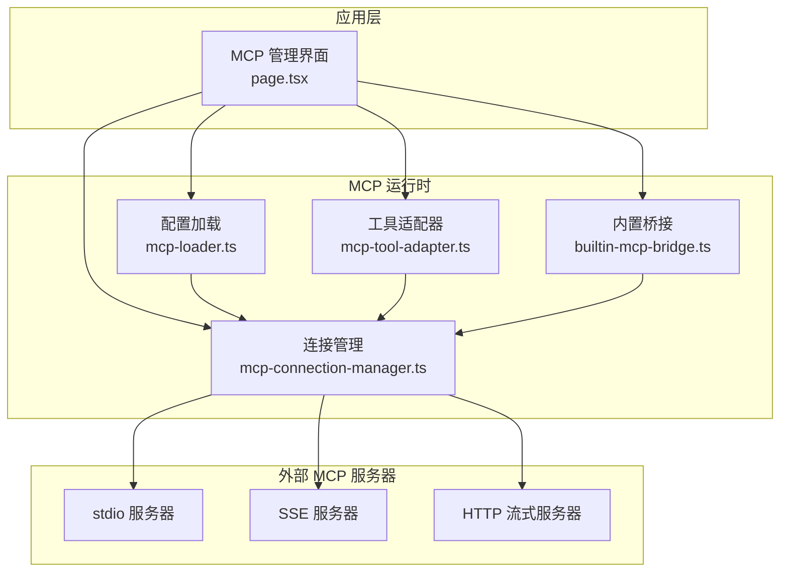
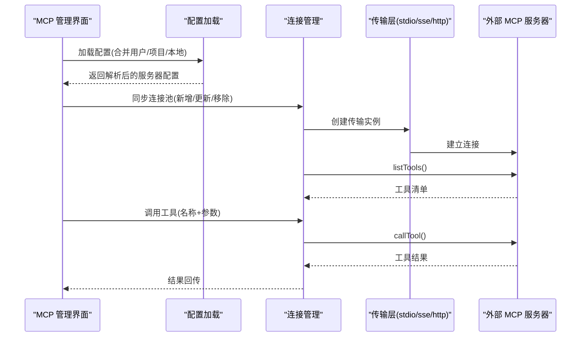
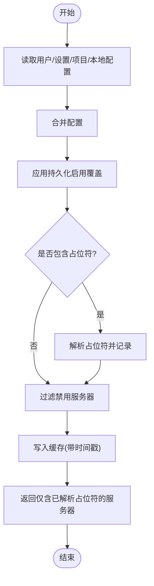
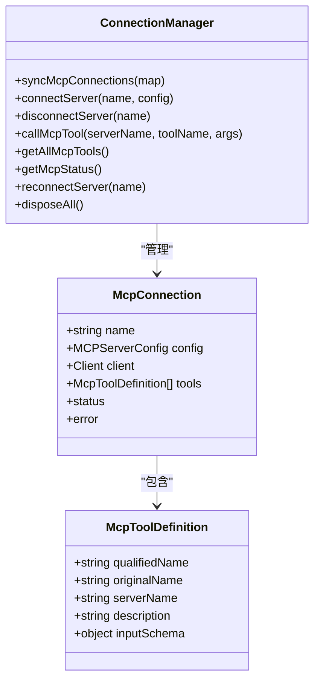
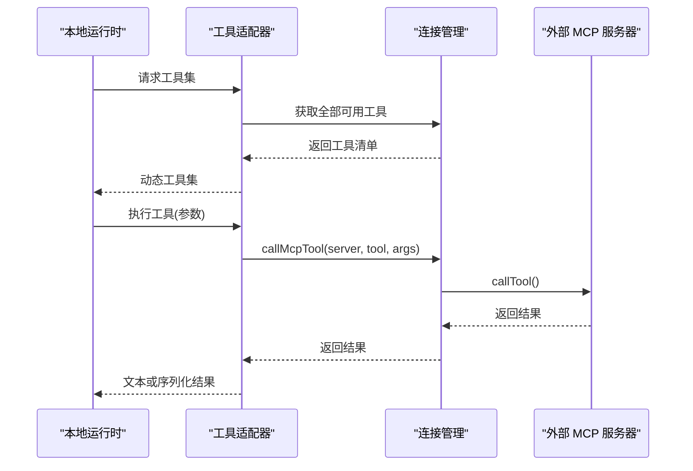
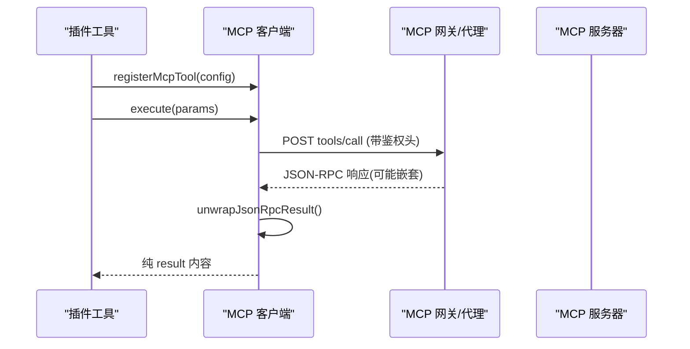
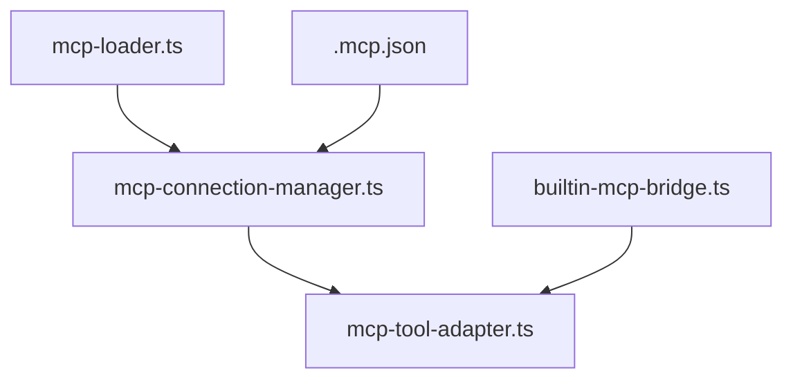

# MCP 服务器系统

<cite>
**本文引用的文件**
- [builtin-mcp-bridge.ts](file://src/lib/builtin-mcp-bridge.ts)
- [mcp-connection-manager.ts](file://src/lib/mcp-connection-manager.ts)
- [mcp-loader.ts](file://src/lib/mcp-loader.ts)
- [mcp-tool-adapter.ts](file://src/lib/mcp-tool-adapter.ts)
- [.mcp.json](file://.mcp.json)
- [page.tsx](file://src/app/mcp/page.tsx)
- [shared.js](file://资料/feishu-openclaw-plugin/package/src/tools/mcp/shared.js)
- [shared.d.ts](file://资料/feishu-openclaw-plugin/package/src/tools/mcp/shared.d.ts)
</cite>

## 目录
1. [简介](#简介)
2. [项目结构](#项目结构)
3. [核心组件](#核心组件)
4. [架构总览](#架构总览)
5. [详细组件分析](#详细组件分析)
6. [依赖关系分析](#依赖关系分析)
7. [性能考量](#性能考量)
8. [故障排查指南](#故障排查指南)
9. [结论](#结论)
10. [附录](#附录)

## 简介
本文件面向 CodePilot 的 MCP（Model Context Protocol）服务器系统，提供从协议规范到运行时集成的完整文档。内容涵盖：
- MCP 协议在 CodePilot 中的使用方式与职责边界
- 服务器发现与连接机制（支持 stdio、sse、http 三种传输）
- 工具适配器与桥接层，将外部 MCP 工具注入到本地运行时
- 自定义 MCP 服务器开发指南、工具注册流程与运行时监控建议
- 开发示例与调试技巧

## 项目结构
围绕 MCP 的核心代码位于 src/lib 下，配合应用入口页面与示例配置文件共同构成系统能力：
- 连接管理：负责连接池、工具发现、调用转发
- 配置加载：合并用户/项目/本地配置，处理环境变量占位符
- 工具适配：将 MCP 工具转换为本地运行时可用的动态工具集
- 桥接层：将 SDK 风格的工具处理器桥接到本地运行时
- 示例配置：演示如何声明一个 stdio 类型的 MCP 服务器

图表来源
- [page.tsx:1-12](file://src/app/mcp/page.tsx#L1-L12)
- [mcp-loader.ts:1-212](file://src/lib/mcp-loader.ts#L1-L212)
- [mcp-connection-manager.ts:1-221](file://src/lib/mcp-connection-manager.ts#L1-L221)
- [mcp-tool-adapter.ts:1-70](file://src/lib/mcp-tool-adapter.ts#L1-L70)
- [builtin-mcp-bridge.ts:1-84](file://src/lib/builtin-mcp-bridge.ts#L1-L84)

章节来源
- [page.tsx:1-12](file://src/app/mcp/page.tsx#L1-L12)
- [mcp-loader.ts:1-212](file://src/lib/mcp-loader.ts#L1-L212)
- [mcp-connection-manager.ts:1-221](file://src/lib/mcp-connection-manager.ts#L1-L221)
- [mcp-tool-adapter.ts:1-70](file://src/lib/mcp-tool-adapter.ts#L1-L70)
- [builtin-mcp-bridge.ts:1-84](file://src/lib/builtin-mcp-bridge.ts#L1-L84)

## 核心组件
- 配置加载模块：合并用户、项目、本地三层配置，解析环境变量占位符，过滤禁用项，并缓存以降低开销
- 连接管理模块：按配置创建传输层，建立客户端连接，列举工具，统一暴露调用接口
- 工具适配模块：将 MCP 工具输入 JSON Schema 转换为本地动态工具，执行时转发至 MCP 服务器
- 桥接模块：将 SDK 风格的工具处理器桥接到本地运行时，保持逻辑一致性
- 示例配置：展示如何声明 stdio 类型的 MCP 服务器

章节来源
- [mcp-loader.ts:1-212](file://src/lib/mcp-loader.ts#L1-L212)
- [mcp-connection-manager.ts:1-221](file://src/lib/mcp-connection-manager.ts#L1-L221)
- [mcp-tool-adapter.ts:1-70](file://src/lib/mcp-tool-adapter.ts#L1-L70)
- [builtin-mcp-bridge.ts:1-84](file://src/lib/builtin-mcp-bridge.ts#L1-L84)
- [.mcp.json:1-14](file://.mcp.json#L1-L14)

## 架构总览
下图展示了 MCP 服务器系统在 CodePilot 中的整体交互：UI 触发配置加载与连接管理；连接管理负责与外部 MCP 服务器通信；工具适配器将 MCP 工具注入到本地运行时；桥接层保证 SDK 与本地运行时的一致性。

图表来源
- [mcp-loader.ts:40-99](file://src/lib/mcp-loader.ts#L40-L99)
- [mcp-connection-manager.ts:69-108](file://src/lib/mcp-connection-manager.ts#L69-L108)
- [mcp-connection-manager.ts:191-220](file://src/lib/mcp-connection-manager.ts#L191-L220)

## 详细组件分析

### 组件一：配置加载与合并（mcp-loader.ts）
职责
- 合并用户级、设置级、项目级与本地配置
- 解析环境变量占位符（如 ${key}），并区分需要 CodePilot 处理的服务器
- 应用持久化启用覆盖，过滤禁用服务器
- 提供缓存机制，降低频繁读取成本

关键点
- 缓存 TTL 为 30 秒，避免重复解析
- 对项目级 .mcp.json 的读取路径采用请求上下文中的实际工作目录，确保桌面应用场景正确解析
- 返回两类配置：仅包含已解析占位符的服务器集合，以及全量合并后的配置（用于 UI 展示）

图表来源
- [mcp-loader.ts:40-99](file://src/lib/mcp-loader.ts#L40-L99)
- [mcp-loader.ts:162-211](file://src/lib/mcp-loader.ts#L162-L211)

章节来源
- [mcp-loader.ts:1-212](file://src/lib/mcp-loader.ts#L1-L212)

### 组件二：连接管理与工具发现（mcp-connection-manager.ts）
职责
- 维护连接池，按需连接/断开/重连
- 支持三种传输：stdio、sse、http
- 发现工具并生成统一的工具定义，提供调用入口

关键点
- 使用延迟加载 MCP SDK，避免未使用时的导入开销
- 工具名采用“mcp__{serverName}__{toolName}”的全限定命名，避免冲突
- 输入 JSON Schema 强制补充必需字段，确保与本地工具系统兼容

图表来源
- [mcp-connection-manager.ts:15-35](file://src/lib/mcp-connection-manager.ts#L15-L35)
- [mcp-connection-manager.ts:45-64](file://src/lib/mcp-connection-manager.ts#L45-L64)

章节来源
- [mcp-connection-manager.ts:1-221](file://src/lib/mcp-connection-manager.ts#L1-L221)

### 组件三：工具适配器（mcp-tool-adapter.ts）
职责
- 将已发现的 MCP 工具转换为本地动态工具集
- 在执行时调用连接管理器的工具调用接口
- 统一处理返回内容（文本拼接或序列化）

图表来源
- [mcp-tool-adapter.ts:17-26](file://src/lib/mcp-tool-adapter.ts#L17-L26)
- [mcp-tool-adapter.ts:44-68](file://src/lib/mcp-tool-adapter.ts#L44-L68)
- [mcp-connection-manager.ts:124-140](file://src/lib/mcp-connection-manager.ts#L124-L140)

章节来源
- [mcp-tool-adapter.ts:1-70](file://src/lib/mcp-tool-adapter.ts#L1-L70)

### 组件四：内置桥接（builtin-mcp-bridge.ts）
职责
- 将 SDK 风格的 MCP 工具处理器桥接到本地运行时
- 保持 SDK 文件作为逻辑源，避免重复实现
- 为内置服务器（通知、内存、仪表盘、CLI 工具、媒体、图像生成、小部件）提供统一接入点

图表来源
- [builtin-mcp-bridge.ts:25-48](file://src/lib/builtin-mcp-bridge.ts#L25-L48)
- [builtin-mcp-bridge.ts:71-83](file://src/lib/builtin-mcp-bridge.ts#L71-L83)

章节来源
- [builtin-mcp-bridge.ts:1-84](file://src/lib/builtin-mcp-bridge.ts#L1-L84)

### 组件五：示例配置（.mcp.json）
示例展示如何声明一个 stdio 类型的 MCP 服务器，命令通过 npx 启动，支持参数与环境变量。

章节来源
- [.mcp.json:1-14](file://.mcp.json#L1-L14)

### 组件六：MCP 客户端（跨域插件共享模块）
该模块提供了 MCP 工具调用的通用客户端能力，包括：
- JSON-RPC 响应解包（递归处理嵌套 envelope）
- 从配置中提取 endpoint
- 通过 HTTP 调用 MCP 工具并处理错误
- 通用工具注册函数（结合权限检查 invoke 机制）

图表来源
- [shared.js:107-154](file://资料/feishu-openclaw-plugin/package/src/tools/mcp/shared.js#L107-L154)
- [shared.js:43-64](file://资料/feishu-openclaw-plugin/package/src/tools/mcp/shared.js#L43-L64)
- [shared.d.ts:10-58](file://资料/feishu-openclaw-plugin/package/src/tools/mcp/shared.d.ts#L10-L58)

章节来源
- [shared.js:1-220](file://资料/feishu-openclaw-plugin/package/src/tools/mcp/shared.js#L1-L220)
- [shared.d.ts:1-58](file://资料/feishu-openclaw-plugin/package/src/tools/mcp/shared.d.ts#L1-L58)

## 依赖关系分析
- 配置加载依赖文件系统与设置存储，输出两类配置集合
- 连接管理依赖 MCP SDK 的传输实现，按配置选择 stdio/sse/http
- 工具适配器依赖连接管理器提供的工具清单与调用接口
- 桥接模块依赖 SDK 工具处理器，输出本地运行时工具集
- 示例配置文件为 stdio 服务器提供最小可用样例

图表来源
- [mcp-loader.ts:1-212](file://src/lib/mcp-loader.ts#L1-L212)
- [mcp-connection-manager.ts:1-221](file://src/lib/mcp-connection-manager.ts#L1-L221)
- [mcp-tool-adapter.ts:1-70](file://src/lib/mcp-tool-adapter.ts#L1-L70)
- [builtin-mcp-bridge.ts:1-84](file://src/lib/builtin-mcp-bridge.ts#L1-L84)
- [.mcp.json:1-14](file://.mcp.json#L1-L14)

章节来源
- [mcp-loader.ts:1-212](file://src/lib/mcp-loader.ts#L1-L212)
- [mcp-connection-manager.ts:1-221](file://src/lib/mcp-connection-manager.ts#L1-L221)
- [mcp-tool-adapter.ts:1-70](file://src/lib/mcp-tool-adapter.ts#L1-L70)
- [builtin-mcp-bridge.ts:1-84](file://src/lib/builtin-mcp-bridge.ts#L1-L84)
- [.mcp.json:1-14](file://.mcp.json#L1-L14)

## 性能考量
- 延迟加载 MCP SDK：仅在首次连接时加载，减少冷启动开销
- 配置缓存：30 秒 TTL，避免频繁解析与 IO
- 工具命名去重：全限定名避免同名冲突，减少查找与映射成本
- 传输选择：根据场景选择 stdio（本地进程）、sse（事件流）、http（可扩展）以平衡延迟与吞吐

## 故障排查指南
常见问题与定位建议
- 连接失败
  - 检查服务器配置（命令/URL、参数、环境变量）是否正确
  - 查看连接状态与错误信息（连接池提供状态查询）
- 工具不可用
  - 确认服务器已成功连接且工具列表非空
  - 检查工具输入 JSON Schema 是否符合预期
- 调用异常
  - 关注工具返回内容格式（文本拼接或序列化）
  - 若出现网关/代理嵌套 envelope，确认响应解包逻辑生效
- 配置未生效
  - 确认占位符解析是否完成
  - 检查持久化启用覆盖是否影响了服务器状态

章节来源
- [mcp-connection-manager.ts:158-168](file://src/lib/mcp-connection-manager.ts#L158-L168)
- [mcp-loader.ts:28-31](file://src/lib/mcp-loader.ts#L28-L31)
- [shared.js:43-64](file://资料/feishu-openclaw-plugin/package/src/tools/mcp/shared.js#L43-L64)

## 结论
CodePilot 的 MCP 服务器系统通过清晰的分层设计实现了对多种传输协议的支持与统一的工具接入。配置加载与连接管理模块分别承担“配置解析”和“连接生命周期”的职责，工具适配器与桥接模块则确保外部工具能够无缝融入本地运行时。配合示例配置与通用客户端能力，开发者可以快速构建与集成自定义 MCP 服务器，并在生产环境中稳定运行与监控。

## 附录

### MCP 协议与传输说明
- 协议规范
  - 使用标准 MCP JSON-RPC 接口（tools/list、tools/call 等）
  - 工具返回内容通常包含 content 数组，其中 text 类型用于文本输出
- 传输类型
  - stdio：适合本地进程，便于调试与部署
  - sse：适合事件驱动场景，支持服务端推送
  - http：适合远程服务与可扩展场景，支持流式响应

章节来源
- [mcp-connection-manager.ts:191-220](file://src/lib/mcp-connection-manager.ts#L191-L220)
- [shared.js:107-154](file://资料/feishu-openclaw-plugin/package/src/tools/mcp/shared.js#L107-L154)

### 自定义 MCP 服务器开发指南
- 服务器实现
  - 实现标准 MCP 工具接口，返回符合规范的内容结构
  - 可选：支持 SSE 或 HTTP 以满足不同部署需求
- 配置与部署
  - 在用户/项目/本地配置中声明服务器，指定传输类型与必要参数
  - 使用占位符解析机制注入敏感信息（如令牌）
- 工具注册与调用
  - 通过连接管理器自动发现工具并生成全限定名
  - 在本地运行时以动态工具形式调用，参数校验与错误处理由适配器统一处理

章节来源
- [mcp-loader.ts:64-83](file://src/lib/mcp-loader.ts#L64-L83)
- [mcp-tool-adapter.ts:31-38](file://src/lib/mcp-tool-adapter.ts#L31-L38)
- [mcp-connection-manager.ts:92-100](file://src/lib/mcp-connection-manager.ts#L92-L100)

### 运行时监控与可观测性建议
- 连接状态监控
  - 定期查询连接池状态，关注连接/失败计数与错误详情
- 工具调用监控
  - 记录工具调用耗时与成功率，识别慢调用与异常
- 日志与告警
  - 对连接失败、工具调用异常、响应解包失败等关键事件进行日志记录与告警

章节来源
- [mcp-connection-manager.ts:158-168](file://src/lib/mcp-connection-manager.ts#L158-L168)
- [shared.js:43-64](file://资料/feishu-openclaw-plugin/package/src/tools/mcp/shared.js#L43-L64)

### 开发示例与调试技巧
- 示例配置
  - 参考示例文件声明 stdio 服务器，验证基本连通性
- 调试步骤
  - 先确认配置解析与占位符替换
  - 再验证连接与工具发现
  - 最后测试工具调用与结果格式
- 常用工具
  - 使用连接池状态接口与工具适配器的错误回退策略

章节来源
- [.mcp.json:1-14](file://.mcp.json#L1-L14)
- [mcp-loader.ts:112-136](file://src/lib/mcp-loader.ts#L112-L136)
- [mcp-tool-adapter.ts:44-68](file://src/lib/mcp-tool-adapter.ts#L44-L68)