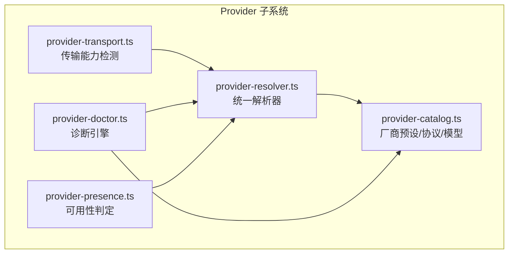
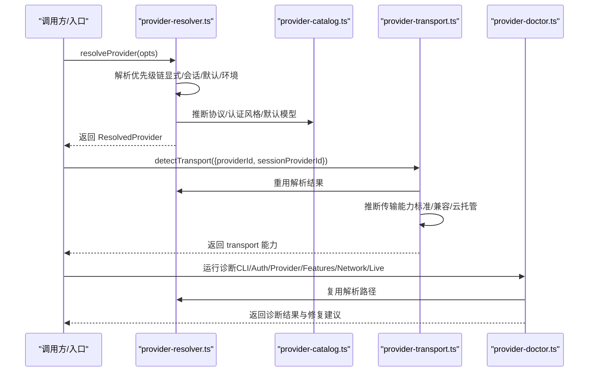
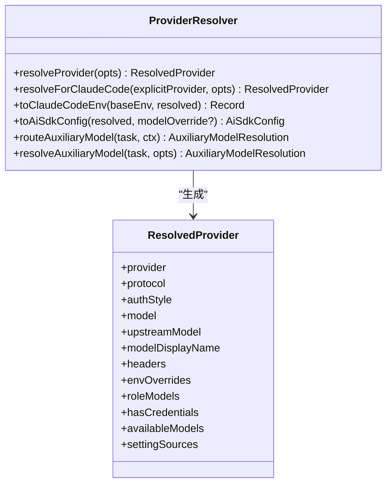
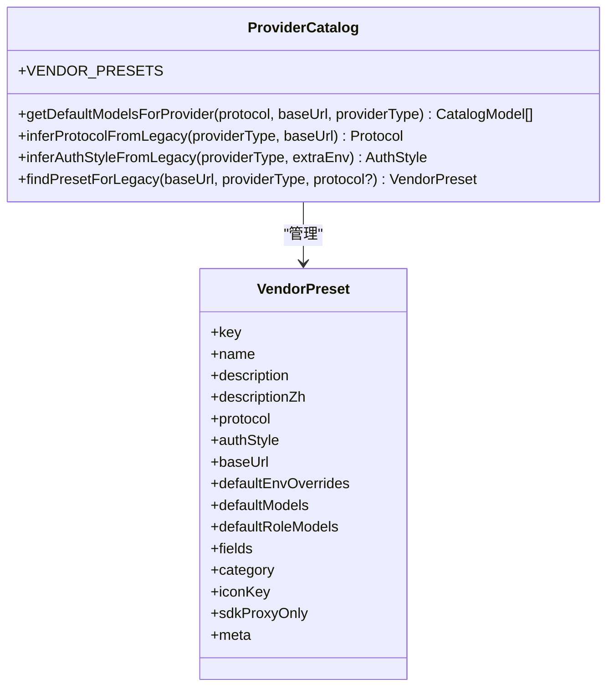
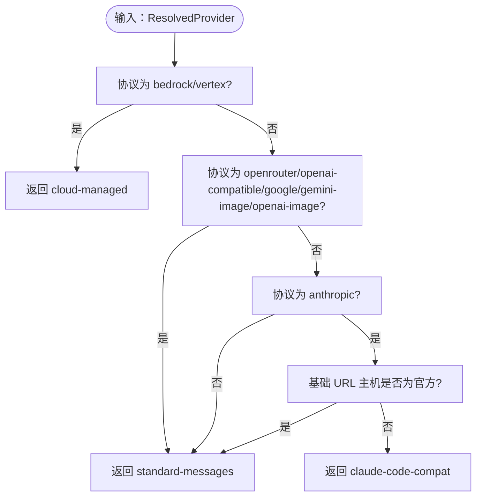
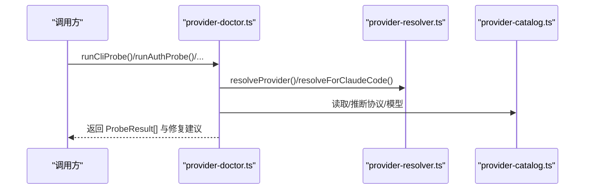
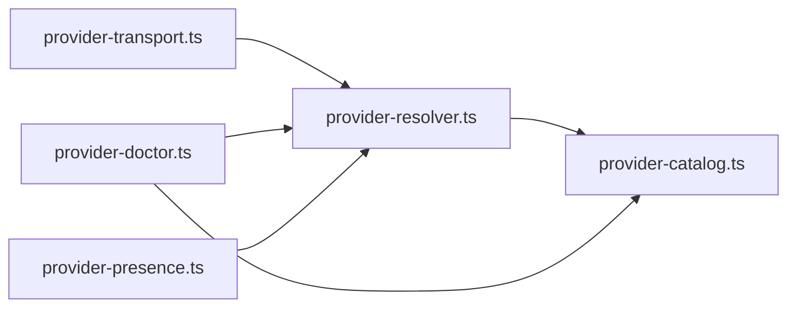

# Providers 文档

<cite>
**本文档引用的文件**
- [provider-resolver.ts](file://src/lib/provider-resolver.ts)
- [provider-catalog.ts](file://src/lib/provider-catalog.ts)
- [provider-transport.ts](file://src/lib/provider-transport.ts)
- [provider-doctor.ts](file://src/lib/provider-doctor.ts)
- [provider-presence.ts](file://src/lib/provider-presence.ts)
- [providers.mdx](file://apps/site/content/docs/zh/providers.mdx)
</cite>

## 目录
1. [简介](#简介)
2. [项目结构](#项目结构)
3. [核心组件](#核心组件)
4. [架构总览](#架构总览)
5. [详细组件分析](#详细组件分析)
6. [依赖关系分析](#依赖关系分析)
7. [性能考虑](#性能考虑)
8. [故障排除指南](#故障排除指南)
9. [结论](#结论)

## 简介
本文件系统性阐述 CodePilot 的 Provider（服务商）体系，涵盖认证方式、协议适配、模型解析、诊断与修复、以及与文档站点中用户指南的对应关系。目标是帮助开发者与用户理解如何配置、切换与排障各类 LLM 服务商，并掌握底层解析与传输机制。

## 项目结构
Provider 相关逻辑主要集中在 src/lib 目录下的四个核心模块：
- provider-resolver.ts：统一的提供商与模型解析器，决定“用哪个提供商、哪个模型、如何注入凭据”
- provider-catalog.ts：厂商预设、协议定义、默认模型目录与元数据
- provider-transport.ts：传输能力检测，区分标准 Messages API、Claude 兼容适配器与云托管（Bedrock/Vertex）
- provider-doctor.ts：诊断引擎，执行 CLI、认证、提供商、特性、网络与实时探测
- provider-presence.ts：判断 CodePilot 是否具备可调度的可用提供商

**图表来源**
- [provider-resolver.ts:1-1189](file://src/lib/provider-resolver.ts#L1-L1189)
- [provider-catalog.ts:1-1121](file://src/lib/provider-catalog.ts#L1-L1121)
- [provider-transport.ts:1-74](file://src/lib/provider-transport.ts#L1-L74)
- [provider-doctor.ts:1-1078](file://src/lib/provider-doctor.ts#L1-L1078)
- [provider-presence.ts:1-105](file://src/lib/provider-presence.ts#L1-L105)

**章节来源**
- [provider-resolver.ts:1-1189](file://src/lib/provider-resolver.ts#L1-L1189)
- [provider-catalog.ts:1-1121](file://src/lib/provider-catalog.ts#L1-L1121)
- [provider-transport.ts:1-74](file://src/lib/provider-transport.ts#L1-L74)
- [provider-doctor.ts:1-1078](file://src/lib/provider-doctor.ts#L1-L1078)
- [provider-presence.ts:1-105](file://src/lib/provider-presence.ts#L1-L105)

## 核心组件
- 统一解析器（resolveProvider/resolveForClaudeCode）：遵循严格优先级链，支持显式指定、会话保留、全局默认、环境变量回退，并生成 ResolvedProvider 结果对象，包含协议、认证风格、模型映射、额外头部与环境覆盖等
- 厂商目录（VENDOR_PRESETS）：集中定义协议、认证方式、默认模型、角色映射、环境覆盖、图标与元信息（计费模式、文档链接、注意事项等）
- 传输能力检测（detectTransport/isNativeCompatible）：根据协议与基础 URL 判断使用标准 Messages API、Claude 兼容适配器或云托管 SDK
- 诊断引擎（runCliProbe/runAuthProbe/runProviderProbe/runFeaturesProbe/runNetworkProbe/runLiveProbe）：多维度健康检查，输出结构化诊断与修复建议
- 可用性判定（hasCodePilotProvider）：判断当前是否具备可调度的可用提供商（含环境变量、历史设置、OAuth 虚拟提供商）

**章节来源**
- [provider-resolver.ts:80-196](file://src/lib/provider-resolver.ts#L80-L196)
- [provider-catalog.ts:87-137](file://src/lib/provider-catalog.ts#L87-L137)
- [provider-transport.ts:20-74](file://src/lib/provider-transport.ts#L20-L74)
- [provider-doctor.ts:100-687](file://src/lib/provider-doctor.ts#L100-L687)
- [provider-presence.ts:74-104](file://src/lib/provider-presence.ts#L74-L104)

## 架构总览
Provider 解析与传输的关键流程如下：

**图表来源**
- [provider-resolver.ts:91-159](file://src/lib/provider-resolver.ts#L91-L159)
- [provider-catalog.ts:902-979](file://src/lib/provider-catalog.ts#L902-L979)
- [provider-transport.ts:23-65](file://src/lib/provider-transport.ts#L23-L65)
- [provider-doctor.ts:102-750](file://src/lib/provider-doctor.ts#L102-L750)

## 详细组件分析

### 组件A：统一解析器（Provider Resolver）
- 优先级链：显式 providerId → 会话 providerId → 全局默认 → 环境变量（'env' 特殊值）
- 关键能力：
  - 构建 ResolvedProvider：协议、认证风格、模型与上游模型映射、显示名、额外头部、环境覆盖、角色模型映射、凭据可用性、可用模型清单、设置来源
  - toClaudeCodeEnv：安全注入凭据与环境变量，清理跨提供商泄漏
  - toAiSdkConfig：构建 Vercel AI SDK 配置，处理第三方代理与 OpenAI Responses API
  - 辅助模型路由：为压缩、视觉、摘要、网页抽取等任务选择小模型或回退策略
- 特殊虚拟提供商：OpenAI OAuth（Codex API）以虚拟 providerId 'openai-oauth' 形式参与解析

**图表来源**
- [provider-resolver.ts:36-63](file://src/lib/provider-resolver.ts#L36-L63)
- [provider-resolver.ts:91-196](file://src/lib/provider-resolver.ts#L91-L196)
- [provider-resolver.ts:661-883](file://src/lib/provider-resolver.ts#L661-L883)
- [provider-resolver.ts:1082-1143](file://src/lib/provider-resolver.ts#L1082-L1143)

**章节来源**
- [provider-resolver.ts:80-196](file://src/lib/provider-resolver.ts#L80-L196)
- [provider-resolver.ts:208-331](file://src/lib/provider-resolver.ts#L208-L331)
- [provider-resolver.ts:358-622](file://src/lib/provider-resolver.ts#L358-L622)
- [provider-resolver.ts:930-1143](file://src/lib/provider-resolver.ts#L930-L1143)

### 组件B：厂商目录（Provider Catalog）
- 协议类型：anthropic、openai-compatible、openrouter、bedrock、vertex、google、gemini-image、openai-image
- 认证风格：api_key、auth_token、env_only、custom_header
- 预设结构：包含协议、认证风格、默认基础 URL、默认环境覆盖、默认模型目录、角色映射、字段可见性、分类（chat/media）、图标键、sdkProxyOnly 标记、元信息（API Key 链接、文档、计费模式、注意事项）
- 默认模型目录：针对第一方 Anthropic、第三方代理、Bedrock/Vertex、媒体类模型分别提供目录
- 推断逻辑：从旧 provider_type 与 base_url 推断协议与认证风格，匹配厂商预设

**图表来源**
- [provider-catalog.ts:87-137](file://src/lib/provider-catalog.ts#L87-L137)
- [provider-catalog.ts:1050-1121](file://src/lib/provider-catalog.ts#L1050-L1121)
- [provider-catalog.ts:925-979](file://src/lib/provider-catalog.ts#L925-L979)
- [provider-catalog.ts:988-1037](file://src/lib/provider-catalog.ts#L988-L1037)

**章节来源**
- [provider-catalog.ts:14-137](file://src/lib/provider-catalog.ts#L14-L137)
- [provider-catalog.ts:313-865](file://src/lib/provider-catalog.ts#L313-L865)
- [provider-catalog.ts:1050-1121](file://src/lib/provider-catalog.ts#L1050-L1121)

### 组件C：传输能力检测（Provider Transport）
- 传输能力三态：standard-messages（官方 Messages API）、claude-code-compat（第三方代理）、cloud-managed（Bedrock/Vertex）
- 判定依据：
  - bedrock/vertex → cloud-managed
  - openrouter/openai-compatible/google/gemini-image/openai-image → standard-messages
  - anthropic：若基础 URL 非官方主机（api.anthropic.com 或 .anthropic.com）→ 兼容适配器；否则标准 Messages API
- 兼容性：所有传输均与 NativeRuntime 兼容（通过 ClaudeCodeCompatAdapter）

**图表来源**
- [provider-transport.ts:23-65](file://src/lib/provider-transport.ts#L23-L65)

**章节来源**
- [provider-transport.ts:20-74](file://src/lib/provider-transport.ts#L20-L74)

### 组件D：诊断引擎（Provider Doctor）
- 诊断维度：
  - CLI 探测：查找 Claude CLI、版本查询、多实例警告、Windows Git Bash
  - 认证探测：环境变量、DB 存储的 auth token、OpenAI OAuth 状态、解析后凭据可用性与样式冲突
  - 提供商探测：数量、默认提供商、缺失模型、第三方代理缺少显式模型、特性兼容性
  - 特性探测：Thinking 模式、1M 上下文窗口兼容性、过期会话 ID
  - 网络探测：对 Anthropic API 与各提供商基础 URL 发起 HEAD 请求
  - 实时探测：通过 Claude SDK 子进程实际验证可用性
- 输出：结构化诊断、严重级别、修复动作

**图表来源**
- [provider-doctor.ts:102-750](file://src/lib/provider-doctor.ts#L102-L750)
- [provider-resolver.ts:91-159](file://src/lib/provider-resolver.ts#L91-L159)
- [provider-catalog.ts:902-979](file://src/lib/provider-catalog.ts#L902-L979)

**章节来源**
- [provider-doctor.ts:100-687](file://src/lib/provider-doctor.ts#L100-L687)

### 组件E：可用性判定（Provider Presence）
- 判定条件（任一满足即为真）：
  - 进程环境变量存在 ANTHROPIC_API_KEY / ANTHROPIC_AUTH_TOKEN
  - DB 设置项 anthropic_auth_token 存在
  - OpenAI OAuth 可用（虚拟提供商）
  - 至少一个 DB 提供商具备可用 CodePilot 认证（api_key 或 env_overrides_json 中的 Bedrock/Vertex 标志）
- 设计原则：与解析器的 env_overrides_json/extra_env 优先级保持一致，避免误判

**章节来源**
- [provider-presence.ts:74-104](file://src/lib/provider-presence.ts#L74-L104)

## 依赖关系分析
- provider-resolver.ts 依赖 provider-catalog.ts（协议/认证/模型推断）、db 层（读取提供商、默认值、设置）
- provider-transport.ts 依赖 provider-resolver.ts 的解析结果
- provider-doctor.ts 依赖 provider-resolver.ts 与 provider-catalog.ts，并调用平台与 SDK 工具
- provider-presence.ts 依赖 db 层与 OAuth 管理器

**图表来源**
- [provider-resolver.ts:1-40](file://src/lib/provider-resolver.ts#L1-L40)
- [provider-transport.ts:16-34](file://src/lib/provider-transport.ts#L16-L34)
- [provider-doctor.ts:8-37](file://src/lib/provider-doctor.ts#L8-L37)
- [provider-presence.ts:25-27](file://src/lib/provider-presence.ts#L25-L27)

**章节来源**
- [provider-resolver.ts:1-40](file://src/lib/provider-resolver.ts#L1-L40)
- [provider-transport.ts:16-34](file://src/lib/provider-transport.ts#L16-L34)
- [provider-doctor.ts:8-37](file://src/lib/provider-doctor.ts#L8-L37)
- [provider-presence.ts:25-27](file://src/lib/provider-presence.ts#L25-L27)

## 性能考虑
- 解析链路尽量避免重复 IO：解析结果可复用，传输检测与诊断均基于同一 ResolvedProvider
- 传输能力判定为纯函数式分支，复杂度低
- 诊断引擎采用并发探测（网络 HEAD 请求），并在缓存最近一次诊断结果以避免重复计算
- 辅助模型路由为纯函数，输入来自已解析上下文，无 IO

## 故障排除指南
- 环境变量未被识别
  - 确认变量在 CodePilot 启动时的 shell 环境中可用
  - macOS 通过 Launchpad 启动的应用可能不继承终端环境变量，建议从终端启动或手动添加提供商
- API Key 有效但请求失败
  - 检查账户余额与模型访问权限
  - 国内服务商检查网络可达性
  - AWS Bedrock 检查 IAM 权限包含 bedrock:InvokeModel
- 切换提供商后对话异常
  - 不同提供商上下文窗口不同，切换可能导致上下文过长
  - 部分提供商不支持 Claude Code 的全部功能（如工具使用）
- 本地模型使用
  - 推荐使用 Ollama 预设；也可使用 LiteLLM 接入其他本地推理框架

**章节来源**
- [providers.mdx:144-167](file://apps/site/content/docs/zh/providers.mdx#L144-L167)

## 结论
CodePilot 的 Provider 子系统通过统一解析器、厂商目录、传输检测与诊断引擎，实现了对多协议、多认证风格、多地域服务商的一致支持。其设计强调“同一输入、同一行为”的解析一致性，辅以结构化的诊断与修复建议，既满足高级用户的灵活配置需求，也保障了日常使用的稳定性与可维护性。