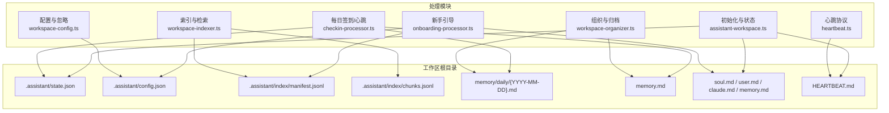
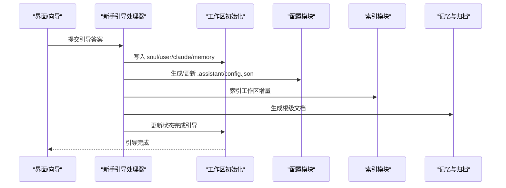
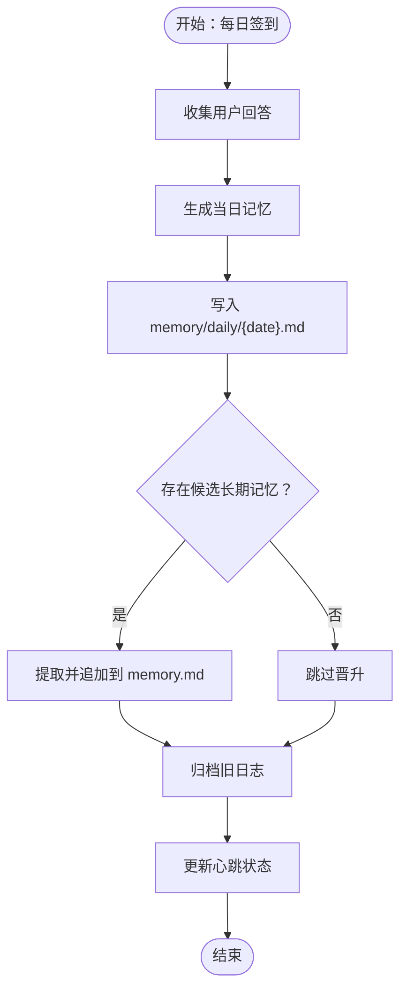
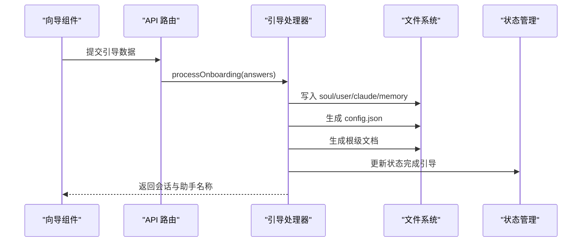
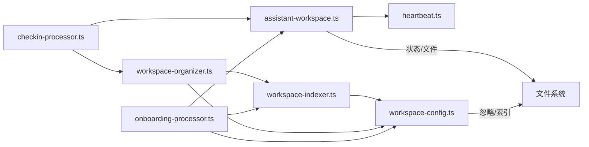

# 助手工作区

<cite>
**本文档引用的文件**
- [assistant-workspace.ts](file://src/lib/assistant-workspace.ts)
- [workspace-config.ts](file://src/lib/workspace-config.ts)
- [workspace-organizer.ts](file://src/lib/workspace-organizer.ts)
- [workspace-indexer.ts](file://src/lib/workspace-indexer.ts)
- [checkin-processor.ts](file://src/lib/checkin-processor.ts)
- [onboarding-processor.ts](file://src/lib/onboarding-processor.ts)
- [heartbeat.ts](file://src/lib/heartbeat.ts)
- [OnboardingWizard.tsx](file://src/components/assistant/OnboardingWizard.tsx)
</cite>

## 目录
1. [简介](#简介)
2. [项目结构](#项目结构)
3. [核心组件](#核心组件)
4. [架构总览](#架构总览)
5. [详细组件分析](#详细组件分析)
6. [依赖关系分析](#依赖关系分析)
7. [性能考量](#性能考量)
8. [故障排查指南](#故障排查指南)
9. [结论](#结论)
10. [附录](#附录)

## 简介
本文件面向 CodePilot 的“助手工作区”功能，系统性说明 persona 文件（soul.md、user.md、claude.md、memory.md）的作用与配置方法；解释持久化记忆、每日签到（现称为“心跳”）、新手引导流程；给出工作区目录结构、文件组织规则、数据导入导出思路；并提供个性化配置建议与最佳实践。

## 项目结构
助手工作区围绕一个本地 Markdown 工作区构建，核心由以下模块协同：
- 初始化与状态管理：负责工作区初始化、状态迁移、心跳开关与周期判断
- 个人资料生成：通过新手引导生成 persona 文件，并写入工作区
- 记忆与归档：每日记忆（episodic）与长期记忆（长期 fact），以及自动归档与晋升
- 索引与检索：对 Markdown 文件进行分块、元数据提取与增量索引
- 配置与忽略规则：控制索引范围、忽略模式、归档策略等
- 心跳协议：用于定期提醒与去重

图表来源
- [assistant-workspace.ts:1-666](file://src/lib/assistant-workspace.ts#L1-L666)
- [workspace-config.ts:1-119](file://src/lib/workspace-config.ts#L1-L119)
- [workspace-organizer.ts:1-295](file://src/lib/workspace-organizer.ts#L1-L295)
- [workspace-indexer.ts:1-428](file://src/lib/workspace-indexer.ts#L1-L428)
- [checkin-processor.ts:1-169](file://src/lib/checkin-processor.ts#L1-L169)
- [onboarding-processor.ts:1-270](file://src/lib/onboarding-processor.ts#L1-L270)
- [heartbeat.ts:1-140](file://src/lib/heartbeat.ts#L1-L140)

章节来源
- [assistant-workspace.ts:1-666](file://src/lib/assistant-workspace.ts#L1-L666)
- [workspace-config.ts:1-119](file://src/lib/workspace-config.ts#L1-L119)
- [workspace-organizer.ts:1-295](file://src/lib/workspace-organizer.ts#L1-L295)
- [workspace-indexer.ts:1-428](file://src/lib/workspace-indexer.ts#L1-L428)
- [checkin-processor.ts:1-169](file://src/lib/checkin-processor.ts#L1-L169)
- [onboarding-processor.ts:1-270](file://src/lib/onboarding-processor.ts#L1-L270)
- [heartbeat.ts:1-140](file://src/lib/heartbeat.ts#L1-L140)

## 核心组件
- 初始化与状态管理
  - 负责检测/创建工作区、生成根级文档、维护状态文件（含多版本迁移）、组装系统提示中的身份层内容
- 新手引导
  - 基于用户回答生成 persona 文件（soul/user/claude/memory），写入工作区并生成初始配置与分类体系
- 每日签到/心跳
  - 自动生成每日记忆、晋升稳定事实、更新用户档案、归档旧日志并尝试晋升
- 组织与归档
  - 提供捕获、分类建议、移动文件、归档旧日志、晋升候选至长期记忆、建议分类演进
- 索引与检索
  - 对 Markdown 文件进行分块、提取元数据、增量索引，支持检索工具调用
- 配置与忽略
  - 定义索引参数、忽略规则、归档策略、默认捕获位置等
- 心跳协议
  - 规范心跳触发条件、活跃时间段、去重逻辑与模板

章节来源
- [assistant-workspace.ts:1-666](file://src/lib/assistant-workspace.ts#L1-L666)
- [onboarding-processor.ts:1-270](file://src/lib/onboarding-processor.ts#L1-L270)
- [checkin-processor.ts:1-169](file://src/lib/checkin-processor.ts#L1-L169)
- [workspace-organizer.ts:1-295](file://src/lib/workspace-organizer.ts#L1-L295)
- [workspace-indexer.ts:1-428](file://src/lib/workspace-indexer.ts#L1-L428)
- [workspace-config.ts:1-119](file://src/lib/workspace-config.ts#L1-L119)
- [heartbeat.ts:1-140](file://src/lib/heartbeat.ts#L1-L140)

## 架构总览
助手工作区采用“本地知识库 + AI 生成”的混合架构：
- 本地持久化：工作区根目录下保存 persona 文件、每日记忆、长期记忆、状态与索引
- 生成式处理：通过外部模型生成 persona、每日记忆、晋升内容与用户档案
- 协同模块：配置、索引、组织、心跳协议共同保障工作区可用性与可维护性

图表来源
- [onboarding-processor.ts:21-270](file://src/lib/onboarding-processor.ts#L21-L270)
- [assistant-workspace.ts:336-412](file://src/lib/assistant-workspace.ts#L336-L412)
- [workspace-config.ts:59-77](file://src/lib/workspace-config.ts#L59-L77)
- [workspace-indexer.ts:300-371](file://src/lib/workspace-indexer.ts#L300-L371)
- [workspace-organizer.ts:595-665](file://src/lib/workspace-organizer.ts#L595-L665)

## 详细组件分析

### persona 文件与作用
- soul.md：定义助手“灵魂”，包括核心个性、沟通风格、行为边界与与用户的关系定位
- user.md：记录用户基本信息、当前目标、偏好与工作习惯，作为长期参考
- claude.md：系统预设规则与个性化规则的集合，指导助手如何组织文档、记忆与安全约束
- memory.md：长期事实库，只追加不覆写，沉淀稳定偏好与重要关系

这些文件由新手引导处理器根据用户回答生成，或在每日签到后增量更新 user.md 与晋升稳定事实到 memory.md。

章节来源
- [onboarding-processor.ts:63-161](file://src/lib/onboarding-processor.ts#L63-L161)
- [checkin-processor.ts:105-137](file://src/lib/checkin-processor.ts#L105-L137)
- [assistant-workspace.ts:28-33](file://src/lib/assistant-workspace.ts#L28-L33)

### 持久化记忆与每日签到（心跳）
- 每日记忆（Episodic）
  - 以“YYYY-MM-DD.md”形式存放在 memory/daily 下，记录当日工作、优先级变化与待记住事项
  - 支持“候选长期记忆”区块，用于后续晋升
- 长期记忆（Stable）
  - 追加写入 memory.md，保持只增不改
- 归档与晋升
  - 自动归档超过保留天数的日志
  - 晋升：扫描最近日志中“候选长期记忆”区块，提取稳定事实并追加到 memory.md
- 心跳机制
  - 通过 HEARTBEAT.md 模板与心跳协议，按活跃时间段与去重策略触发
  - 状态文件记录 lastHeartbeatDate 与 heartbeatEnabled

图表来源
- [checkin-processor.ts:28-169](file://src/lib/checkin-processor.ts#L28-L169)
- [workspace-organizer.ts:137-223](file://src/lib/workspace-organizer.ts#L137-L223)
- [heartbeat.ts:124-140](file://src/lib/heartbeat.ts#L124-L140)

章节来源
- [checkin-processor.ts:1-169](file://src/lib/checkin-processor.ts#L1-L169)
- [workspace-organizer.ts:137-223](file://src/lib/workspace-organizer.ts#L137-L223)
- [heartbeat.ts:1-140](file://src/lib/heartbeat.ts#L1-L140)

### 新手引导流程
- 步骤
  - 第一步：收集用户姓名与角色
  - 第二步：设定助手名称、沟通风格与边界
  - 第三步：完成生成与确认，可选孵化伙伴
- 生成内容
  - 写入 soul.md、user.md、claude.md、memory.md
  - 生成 .assistant/config.json（组织风格、默认捕获位置等）
  - 生成根级文档（README.ai.md、PATH.ai.md）
  - 初始化分类体系与索引
- 状态更新
  - 标记引导完成，设置 lastHeartbeatDate，schema 版本升级

图表来源
- [OnboardingWizard.tsx:106-172](file://src/components/assistant/OnboardingWizard.tsx#L106-L172)
- [onboarding-processor.ts:21-270](file://src/lib/onboarding-processor.ts#L21-L270)
- [assistant-workspace.ts:336-412](file://src/lib/assistant-workspace.ts#L336-L412)

章节来源
- [OnboardingWizard.tsx:1-418](file://src/components/assistant/OnboardingWizard.tsx#L1-L418)
- [onboarding-processor.ts:1-270](file://src/lib/onboarding-processor.ts#L1-L270)
- [assistant-workspace.ts:1-666](file://src/lib/assistant-workspace.ts#L1-L666)

### 工作区目录结构与文件组织规则
- 根目录
  - .assistant/state.json：工作区状态（引导完成、心跳开关、最后心跳日期、schema 版本）
  - .assistant/config.json：工作区配置（组织风格、捕获默认位置、归档策略、索引参数、忽略规则）
  - .assistant/index/：索引产物（manifest.jsonl、chunks.jsonl）
  - memory/daily/：每日记忆（YYYY-MM-DD.md）
  - memory.md：长期记忆
  - soul.md / user.md / claude.md / memory.md：persona 文件
  - HEARTBEAT.md：心跳检查清单模板
  - README.ai.md / PATH.ai.md：自动生成的工作区概览与路径索引
- Inbox：默认捕获目录（可配置）

章节来源
- [assistant-workspace.ts:15-25](file://src/lib/assistant-workspace.ts#L15-L25)
- [assistant-workspace.ts:336-412](file://src/lib/assistant-workspace.ts#L336-L412)
- [workspace-config.ts:5-34](file://src/lib/workspace-config.ts#L5-L34)

### 数据导入导出功能
- 导入
  - 将现有 Markdown 文档放入工作区，系统会：
    - 自动识别并生成根级文档（README.ai.md、PATH.ai.md）
    - 基于现有目录推断分类体系（如无分类）
    - 建立索引（manifest.jsonl、chunks.jsonl）
- 导出
  - 可通过 MCP 工具或检索接口获取记忆与索引内容，实现“读取侧导出”
  - 重要文件（soul/user/claude/memory）可直接复制备份

章节来源
- [assistant-workspace.ts:227-289](file://src/lib/assistant-workspace.ts#L227-L289)
- [workspace-indexer.ts:300-371](file://src/lib/workspace-indexer.ts#L300-L371)
- [workspace-organizer.ts:595-665](file://src/lib/workspace-organizer.ts#L595-L665)

### 个性化配置建议与最佳实践
- 组织风格
  - mixed：混合型，适合多主题并存的项目
  - project：以项目为中心
  - time：以时间为维度
  - topic：以主题为中心
- 默认捕获位置
  - 建议使用 Inbox 作为默认捕获目录，便于统一整理
- 归档策略
  - dailyMemoryRetentionDays 建议 30 天，平衡检索与存储成本
- 索引参数
  - chunkSize 与 chunkOverlap：根据 Markdown 结构与检索需求调整
  - includeExtensions：确保只索引 .md/.txt 等文本文件
  - ignore：排除大文件、媒体、缓存与版本控制目录
- 心跳与活跃时段
  - 启用 heartbeatEnabled，设置合理活跃时间段，避免深夜打扰
- 安全与隐私
  - 不在 memory.md 中存储敏感信息（如密码、密钥）
  - 修改 persona 文件需告知用户变更

章节来源
- [workspace-config.ts:7-34](file://src/lib/workspace-config.ts#L7-L34)
- [workspace-organizer.ts:137-180](file://src/lib/workspace-organizer.ts#L137-L180)
- [heartbeat.ts:91-110](file://src/lib/heartbeat.ts#L91-L110)
- [assistant-workspace.ts:28-33](file://src/lib/assistant-workspace.ts#L28-L33)

## 依赖关系分析
- 初始化与状态管理
  - 依赖文件系统读写、本地日期格式化、心跳模板与活跃时段判断
- 新手引导
  - 依赖配置模块、索引模块、分类模块与状态管理
- 每日签到/心跳
  - 依赖状态管理、文件系统、索引模块与组织模块
- 组织与归档
  - 依赖配置模块、分类模块、索引模块与文件系统
- 索引与检索
  - 依赖配置模块、分类模块、文件系统与哈希计算
- 配置与忽略
  - 依赖通配符匹配与路径校验
- 心跳协议
  - 依赖模板、活跃时段判断与去重逻辑

图表来源
- [assistant-workspace.ts:1-666](file://src/lib/assistant-workspace.ts#L1-L666)
- [onboarding-processor.ts:1-270](file://src/lib/onboarding-processor.ts#L1-L270)
- [checkin-processor.ts:1-169](file://src/lib/checkin-processor.ts#L1-L169)
- [workspace-organizer.ts:1-295](file://src/lib/workspace-organizer.ts#L1-L295)
- [workspace-indexer.ts:1-428](file://src/lib/workspace-indexer.ts#L1-L428)
- [workspace-config.ts:1-119](file://src/lib/workspace-config.ts#L1-L119)
- [heartbeat.ts:1-140](file://src/lib/heartbeat.ts#L1-L140)

## 性能考量
- 索引增量更新
  - 仅对变更文件重新索引，manifest 与 chunks 仅在变更时写入
- 分块策略
  - 基于标题与重叠窗口分块，兼顾检索粒度与上下文连贯性
- 忽略规则
  - 通过通配符匹配快速排除无关文件，减少 IO 与 CPU 开销
- 内容截断
  - 系统提示中对 persona 文件进行预算感知截断，避免越界

章节来源
- [workspace-indexer.ts:300-371](file://src/lib/workspace-indexer.ts#L300-L371)
- [assistant-workspace.ts:418-511](file://src/lib/assistant-workspace.ts#L418-L511)
- [workspace-config.ts:79-119](file://src/lib/workspace-config.ts#L79-L119)

## 故障排查指南
- 引导失败
  - 检查工作区路径配置与状态文件是否存在
  - 若 AI 生成质量不足，回退到模板内容
- 签到失败
  - 确认 provider 解析与模型选择
  - 若 AI 生成失败，回退写入原始问答摘要
- 心跳无效
  - 检查 heartbeatEnabled、活跃时间段与 lastHeartbeatDate
  - 使用 stripHeartbeatToken 去除心跳令牌后的内容是否为空
- 归档/晋升异常
  - 确认 dailyMemoryRetentionDays 设置
  - 检查 memory.md 是否已存在当日晋升标记

章节来源
- [onboarding-processor.ts:166-175](file://src/lib/onboarding-processor.ts#L166-L175)
- [checkin-processor.ts:158-162](file://src/lib/checkin-processor.ts#L158-L162)
- [heartbeat.ts:13-64](file://src/lib/heartbeat.ts#L13-L64)
- [workspace-organizer.ts:137-223](file://src/lib/workspace-organizer.ts#L137-L223)

## 结论
助手工作区通过 persona 文件、每日记忆与长期记忆的协同，结合索引与组织模块，形成一套可扩展、可维护的本地知识库方案。配合新手引导与心跳协议，既保证易用性，又确保长期价值沉淀。建议在实际使用中根据团队工作流调整组织风格、捕获位置与索引参数，并定期归档与晋升，以维持知识库的健康与高效。

## 附录
- 关键文件与职责
  - assistant-workspace.ts：初始化、状态、prompt 组装、根文档生成
  - onboarding-processor.ts：生成 persona 文件与配置
  - checkin-processor.ts：每日记忆生成、晋升与用户档案更新
  - workspace-organizer.ts：捕获、分类建议、移动、归档与晋升
  - workspace-indexer.ts：分块、元数据提取、增量索引
  - workspace-config.ts：配置加载/保存、忽略规则
  - heartbeat.ts：心跳协议、活跃时段与去重
  - OnboardingWizard.tsx：新手引导 UI

章节来源
- [assistant-workspace.ts:1-666](file://src/lib/assistant-workspace.ts#L1-L666)
- [onboarding-processor.ts:1-270](file://src/lib/onboarding-processor.ts#L1-L270)
- [checkin-processor.ts:1-169](file://src/lib/checkin-processor.ts#L1-L169)
- [workspace-organizer.ts:1-295](file://src/lib/workspace-organizer.ts#L1-L295)
- [workspace-indexer.ts:1-428](file://src/lib/workspace-indexer.ts#L1-L428)
- [workspace-config.ts:1-119](file://src/lib/workspace-config.ts#L1-L119)
- [heartbeat.ts:1-140](file://src/lib/heartbeat.ts#L1-L140)
- [OnboardingWizard.tsx:1-418](file://src/components/assistant/OnboardingWizard.tsx#L1-L418)