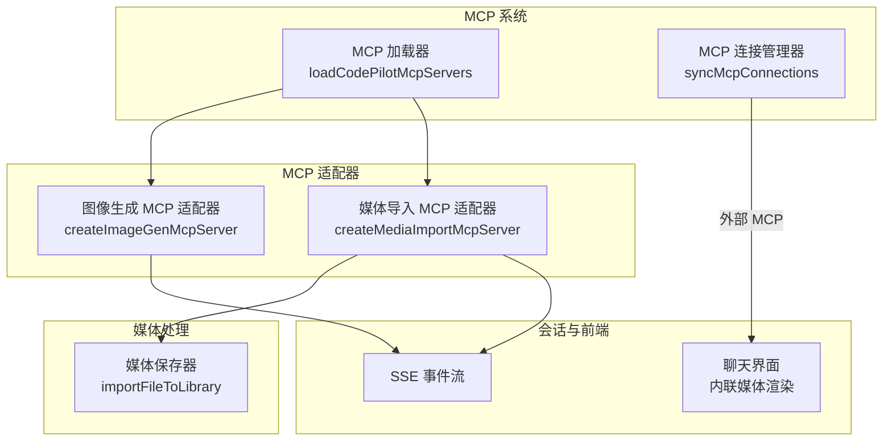
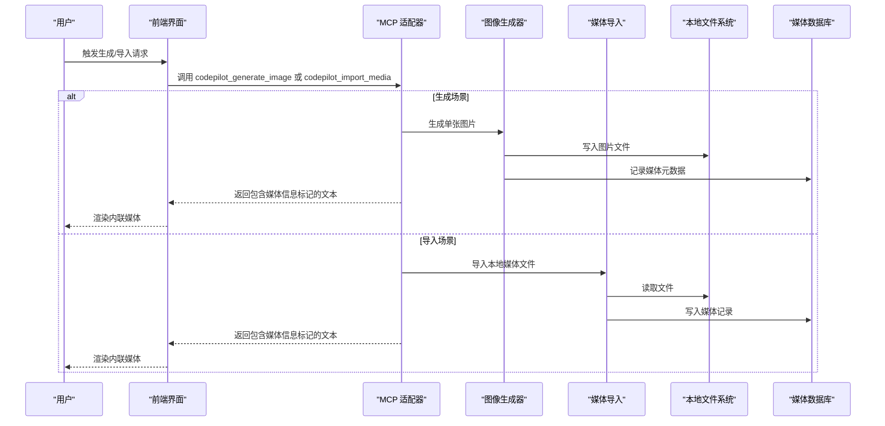
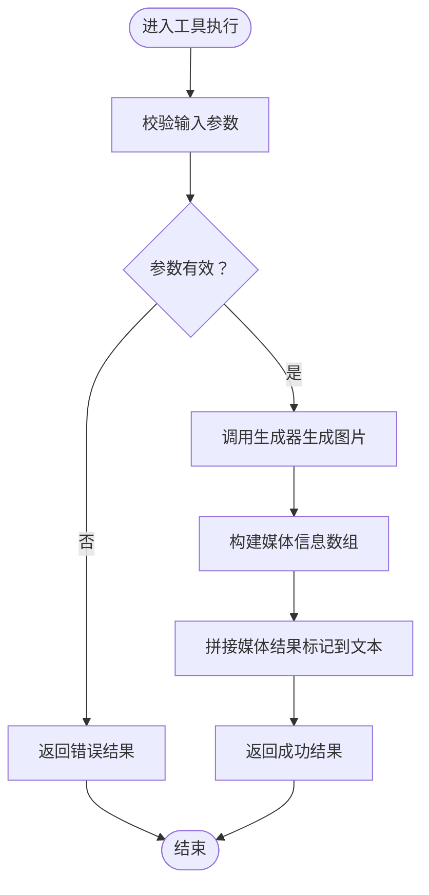
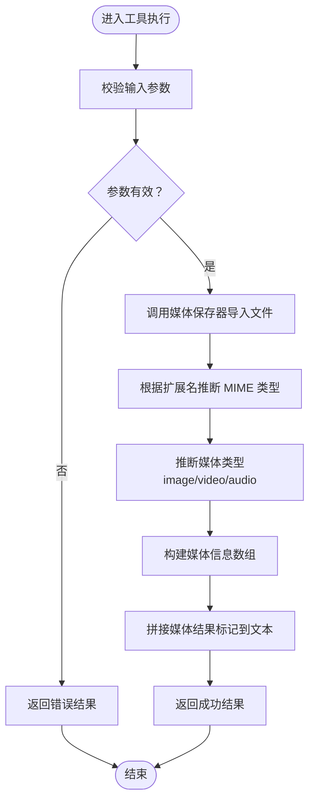
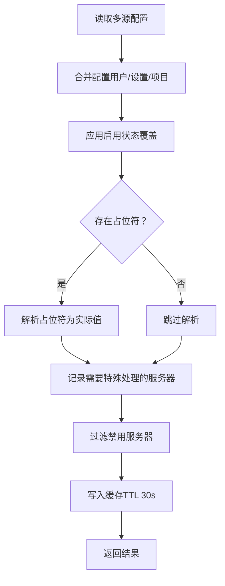
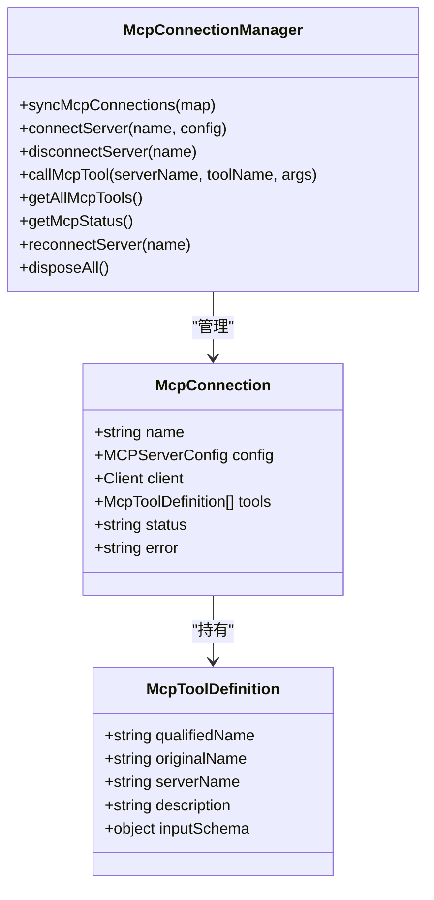
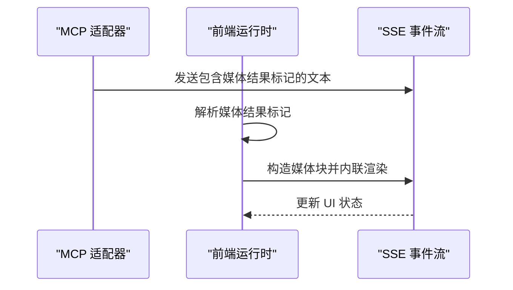
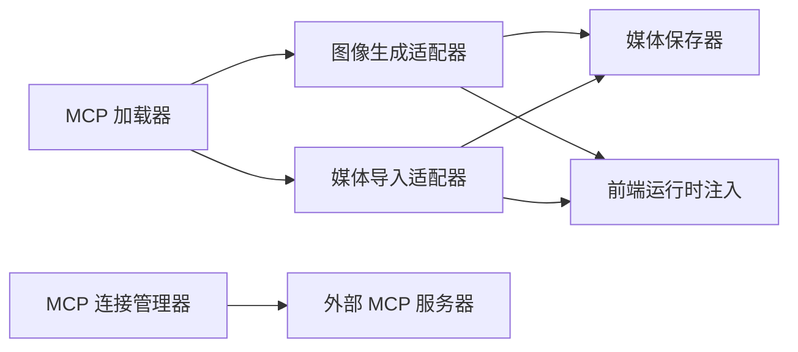

# MCP 媒体集成

<cite>
**本文引用的文件**
- [media-import-mcp.ts](file://src/lib/media-import-mcp.ts)
- [image-gen-mcp.ts](file://src/lib/image-gen-mcp.ts)
- [mcp-loader.ts](file://src/lib/mcp-loader.ts)
- [mcp-connection-manager.ts](file://src/lib/mcp-connection-manager.ts)
- [media-saver.ts](file://src/lib/media-saver.ts)
- [claude-client.ts](file://src/lib/claude-client.ts)
- [mcp-loader.test.ts](file://src/__tests__/unit/mcp-loader.test.ts)
- [media-provider-routes.test.ts](file://src/__tests__/unit/media-provider-routes.test.ts)
- [.mcp.json](file://.mcp.json)
- [README_CN.md](file://README_CN.md)
</cite>

## 目录
1. [简介](#简介)
2. [项目结构](#项目结构)
3. [核心组件](#核心组件)
4. [架构总览](#架构总览)
5. [详细组件分析](#详细组件分析)
6. [依赖关系分析](#依赖关系分析)
7. [性能考量](#性能考量)
8. [故障排查指南](#故障排查指南)
9. [结论](#结论)
10. [附录](#附录)

## 简介
本文件系统性阐述 CodePilot 的 MCP 媒体集成功能，聚焦以下目标：
- 解释 MCP 服务器在媒体生成与导入中的作用，覆盖协议支持（stdio、sse、http）、生命周期管理、工具注册机制
- 说明媒体生成 MCP 适配器的实现原理：如何对接标准 MCP 协议、消息格式转换、错误处理
- 说明媒体导入 MCP 的功能：外部媒体文件导入流程、格式验证、元数据提取
- 覆盖上下文事件同步机制：媒体生成事件的传播、状态更新通知、依赖关系管理
- 提供 MCP 服务器配置与部署指南：环境变量、认证机制、性能调优
- 说明与第三方工具的集成方式与扩展机制

## 项目结构
围绕媒体集成的关键模块分布如下：
- 媒体生成 MCP 适配器：负责在会话中按需注册图像生成工具，并将生成结果以可渲染的媒体块形式注入到前端流式事件中
- 媒体导入 MCP 适配器：负责将本地已存在的媒体文件导入媒体库，并在工具结果中携带媒体信息标记，以便前端渲染
- MCP 加载器：统一加载与合并多来源的 MCP 服务器配置，支持占位符解析与启用状态覆盖
- MCP 连接管理器：管理外部 MCP 服务器连接池，支持 stdio/sse/http 三种传输协议
- 媒体保存器：负责将媒体文件写入本地存储、建立索引并返回媒体标识与本地路径
- 前端事件注入：通过媒体结果标记将媒体信息注入到 SSE 事件中，驱动前端内联渲染

图表来源
- [image-gen-mcp.ts:22-80](file://src/lib/image-gen-mcp.ts#L22-L80)
- [media-import-mcp.ts:40-122](file://src/lib/media-import-mcp.ts#L40-L122)
- [mcp-loader.ts:103-136](file://src/lib/mcp-loader.ts#L103-L136)
- [mcp-connection-manager.ts:45-108](file://src/lib/mcp-connection-manager.ts#L45-L108)
- [media-saver.ts](file://src/lib/media-saver.ts)

章节来源
- [image-gen-mcp.ts:1-81](file://src/lib/image-gen-mcp.ts#L1-L81)
- [media-import-mcp.ts:1-123](file://src/lib/media-import-mcp.ts#L1-L123)
- [mcp-loader.ts:1-212](file://src/lib/mcp-loader.ts#L1-L212)
- [mcp-connection-manager.ts:1-221](file://src/lib/mcp-connection-manager.ts#L1-L221)

## 核心组件
- 图像生成 MCP 适配器
  - 功能：在会话中注册 codepilot_generate_image 工具，调用内部图像生成器，返回包含媒体信息标记的文本结果，前端据此渲染内联媒体
  - 关键点：使用媒体结果标记将媒体类型、MIME、本地路径、媒体 ID 等信息注入到工具结果文本中，前端通过该标记构造媒体块
- 媒体导入 MCP 适配器
  - 功能：注册 codepilot_import_media 工具，将本地媒体文件导入媒体库，自动推断媒体类型（image/video/audio），返回包含媒体信息标记的文本结果
  - 关键点：对输入参数进行元数据填充（prompt/model/resolution/aspectRatio/source/tags），并返回本地路径与媒体 ID
- MCP 加载器
  - 功能：从用户、项目、本地等多源合并 MCP 服务器配置，解析 ${...} 环境占位符，应用启用状态覆盖，返回需要 CodePilot 特殊处理的服务器集合
- MCP 连接管理器
  - 功能：管理外部 MCP 服务器连接池，支持 stdio/sse/http 传输，发现工具列表，提供统一调用接口
- 媒体保存器
  - 功能：将媒体文件写入本地存储，建立索引，返回媒体标识与本地路径，供导入与生成流程复用

章节来源
- [image-gen-mcp.ts:16-80](file://src/lib/image-gen-mcp.ts#L16-L80)
- [media-import-mcp.ts:16-122](file://src/lib/media-import-mcp.ts#L16-L122)
- [mcp-loader.ts:40-99](file://src/lib/mcp-loader.ts#L40-L99)
- [mcp-connection-manager.ts:15-108](file://src/lib/mcp-connection-manager.ts#L15-L108)
- [media-saver.ts](file://src/lib/media-saver.ts)

## 架构总览
下图展示媒体生成与导入在会话中的交互流程，以及与外部 MCP 服务器的连接关系。

图表来源
- [image-gen-mcp.ts:36-76](file://src/lib/image-gen-mcp.ts#L36-L76)
- [media-import-mcp.ts:58-118](file://src/lib/media-import-mcp.ts#L58-L118)
- [media-saver.ts](file://src/lib/media-saver.ts)

## 详细组件分析

### 图像生成 MCP 适配器
- 工具注册与参数校验
  - 工具名称：codepilot_generate_image
  - 参数：prompt、aspectRatio、imageSize、referenceImagePaths
  - 校验：通过 Zod schema 校验输入合法性
- 处理流程
  - 调用内部生成器生成图片，返回包含本地路径与媒体生成 ID 的结果
  - 构造媒体信息数组，包含 type、mimeType、localPath、mediaId
  - 将媒体信息序列化为媒体结果标记，拼接到文本结果中
- 错误处理
  - 对特定错误类型进行友好提示
  - 其他异常封装为错误文本并标记为错误结果

图表来源
- [image-gen-mcp.ts:36-76](file://src/lib/image-gen-mcp.ts#L36-L76)

章节来源
- [image-gen-mcp.ts:22-80](file://src/lib/image-gen-mcp.ts#L22-L80)

### 媒体导入 MCP 适配器
- 工具注册与参数校验
  - 工具名称：codepilot_import_media
  - 参数：filePath、title、prompt、source、model、resolution、aspectRatio、tags
  - 校验：Zod schema 校验
- 处理流程
  - 调用媒体保存器导入文件，返回本地路径与媒体 ID
  - 基于文件扩展名映射 MIME 类型，推断媒体类型（image/video/audio）
  - 构造媒体信息数组，包含 type、mimeType、localPath、mediaId
  - 将媒体信息序列化为媒体结果标记，拼接到文本结果中
- 错误处理
  - 捕获异常并返回错误文本，标记为错误结果

图表来源
- [media-import-mcp.ts:58-118](file://src/lib/media-import-mcp.ts#L58-L118)

章节来源
- [media-import-mcp.ts:40-122](file://src/lib/media-import-mcp.ts#L40-L122)

### MCP 加载器
- 配置来源与合并
  - 用户级：~/.claude.json
  - 设置级：~/.claude/settings.json
  - 项目级：当前工作目录下的 .mcp.json
  - 合并策略：后者覆盖前者，相同键名以更高优先级为准
- 占位符解析
  - 对 env 中以 ${...} 形式的占位符，从 CodePilot 数据库读取对应设置值进行替换
  - 仅对包含占位符且处于启用状态的服务器纳入 CodePilot 特殊处理范围
- 启用状态覆盖
  - 读取设置中的 mcpServerOverrides，对项目级服务器的 enabled 字段进行持久化覆盖
- 缓存机制
  - 30 秒 TTL 缓存，减少重复读取与解析开销

图表来源
- [mcp-loader.ts:40-99](file://src/lib/mcp-loader.ts#L40-L99)

章节来源
- [mcp-loader.ts:103-136](file://src/lib/mcp-loader.ts#L103-L136)
- [mcp-loader.ts:162-211](file://src/lib/mcp-loader.ts#L162-L211)

### MCP 连接管理器
- 连接池管理
  - 维护服务器名称到连接对象的映射，支持新增、移除、重连
  - 对每个连接维护工具清单与状态（connected/connecting/failed/disabled）
- 工具发现与调用
  - 通过 listTools 获取工具列表，统一命名规则（mcp__{serverName}__{toolName}）
  - 提供 callMcpTool 统一调用入口，确保连接状态有效
- 传输协议支持
  - stdio：基于命令与参数启动子进程
  - sse：基于 URL 的 SSE 传输
  - http：基于可流式 HTTP 的传输

图表来源
- [mcp-connection-manager.ts:15-108](file://src/lib/mcp-connection-manager.ts#L15-L108)

章节来源
- [mcp-connection-manager.ts:45-108](file://src/lib/mcp-connection-manager.ts#L45-L108)
- [mcp-connection-manager.ts:191-220](file://src/lib/mcp-connection-manager.ts#L191-L220)

### 上下文事件同步机制
- 媒体结果标记
  - 两个适配器均在工具结果文本中附加媒体结果标记，前端通过该标记识别并构造媒体块
  - 标记内容包含媒体类型、MIME、本地路径、媒体 ID 等关键信息
- 前端注入
  - 前端运行时在 SSE 事件中检测媒体结果标记，将其转换为媒体块并内联渲染
  - 该机制保证媒体生成与导入事件能够及时传播到用户界面
- 依赖关系
  - 导入流程依赖媒体保存器完成文件写入与索引建立
  - 生成流程依赖图像生成器完成文件写入与数据库记录

图表来源
- [image-gen-mcp.ts:58-62](file://src/lib/image-gen-mcp.ts#L58-L62)
- [media-import-mcp.ts:97-101](file://src/lib/media-import-mcp.ts#L97-L101)
- [claude-client.ts](file://src/lib/claude-client.ts)

章节来源
- [image-gen-mcp.ts:16-20](file://src/lib/image-gen-mcp.ts#L16-L20)
- [media-import-mcp.ts:16-17](file://src/lib/media-import-mcp.ts#L16-L17)
- [claude-client.ts](file://src/lib/claude-client.ts)

## 依赖关系分析
- 组件耦合
  - 适配器与媒体保存器之间存在直接依赖，导入流程依赖其完成文件落盘与索引
  - 适配器与前端运行时通过媒体结果标记进行松耦合通信
  - 加载器与连接管理器分别负责“配置层”和“连接层”，职责清晰
- 外部依赖
  - 外部 MCP 服务器通过连接管理器统一接入，支持多种传输协议
  - 项目级 .mcp.json 作为配置源之一，与用户级设置协同工作

图表来源
- [image-gen-mcp.ts:36-76](file://src/lib/image-gen-mcp.ts#L36-L76)
- [media-import-mcp.ts:58-118](file://src/lib/media-import-mcp.ts#L58-L118)
- [mcp-loader.ts:103-136](file://src/lib/mcp-loader.ts#L103-L136)
- [mcp-connection-manager.ts:45-108](file://src/lib/mcp-connection-manager.ts#L45-L108)

章节来源
- [mcp-loader.ts:40-99](file://src/lib/mcp-loader.ts#L40-L99)
- [mcp-connection-manager.ts:191-220](file://src/lib/mcp-connection-manager.ts#L191-L220)

## 性能考量
- 缓存优化
  - MCP 加载器采用 30 秒 TTL 缓存，降低频繁读取配置带来的 IO 开销
- 连接复用
  - 连接管理器维护连接池，避免重复建立连接，提升外部 MCP 服务器调用效率
- 流式传输
  - 支持 SSE 与可流式 HTTP 传输，有助于降低延迟并提升实时性
- 文件处理
  - 导入与生成流程尽量减少不必要的拷贝，直接写入目标位置并建立索引

## 故障排查指南
- 配置问题
  - 检查 .mcp.json 是否存在语法错误，确认服务器 enabled 字段与 mcpServerOverrides 是否符合预期
  - 若使用占位符，请确认对应的设置项已在数据库中正确配置
- 连接问题
  - 查看连接管理器的状态输出，定位 failed 的服务器及其错误信息
  - 确认传输协议类型与目标地址匹配（stdio 命令/参数、sse/http URL）
- 工具调用问题
  - 确认工具名称与输入参数 schema 匹配，避免因参数缺失导致调用失败
- 媒体导入问题
  - 确认 filePath 指向的文件存在且可读
  - 检查返回的媒体信息标记是否被前端正确解析

章节来源
- [mcp-loader.ts:103-136](file://src/lib/mcp-loader.ts#L103-L136)
- [mcp-connection-manager.ts:158-168](file://src/lib/mcp-connection-manager.ts#L158-L168)
- [media-import-mcp.ts:58-118](file://src/lib/media-import-mcp.ts#L58-L118)

## 结论
CodePilot 的 MCP 媒体集成功能通过适配器模式将图像生成与媒体导入能力无缝接入会话流中，借助媒体结果标记实现前后端的低耦合同步。配置层与连接层分离，既保证了灵活性，又提升了可维护性。配合缓存与连接池等性能优化手段，整体具备良好的扩展性与稳定性。

## 附录

### MCP 服务器配置与部署指南
- 配置文件
  - 项目级 .mcp.json：用于声明本地或远程 MCP 服务器，支持 stdio/sse/http 三种类型
  - 用户级设置：用于持久化启用状态覆盖与占位符解析
- 环境变量
  - 可通过环境变量为工具调用注入认证头或自定义端点（示例参考第三方插件共享模块中的认证头构建逻辑）
- 认证机制
  - 支持在请求头中携带认证信息（如 Bearer Token），具体字段与格式依据目标 MCP 服务器要求而定
- 性能调优
  - 合理设置连接池大小与超时时间
  - 利用缓存减少配置读取频率
  - 选择合适的传输协议（SSE/HTTP）以满足实时性需求

章节来源
- [.mcp.json](file://.mcp.json)
- [mcp-loader.ts:40-99](file://src/lib/mcp-loader.ts#L40-L99)
- [mcp-connection-manager.ts:191-220](file://src/lib/mcp-connection-manager.ts#L191-L220)
- [README_CN.md](file://README_CN.md)

### 与第三方工具的集成与扩展
- 工具注册
  - 通过标准 MCP 协议注册工具，遵循 listTools 与 callTool 的约定
  - 对于需要认证的工具，可在调用前进行权限检查并注入必要的头部信息
- 扩展机制
  - 新增工具时，建议复用现有适配器模式，保持参数 schema 一致与错误处理规范统一
  - 对于外部 MCP 服务器，优先使用连接管理器提供的统一接入点，便于集中管理与监控

章节来源
- [mcp-connection-manager.ts:89-100](file://src/lib/mcp-connection-manager.ts#L89-L100)
- [mcp-loader.ts:103-136](file://src/lib/mcp-loader.ts#L103-L136)