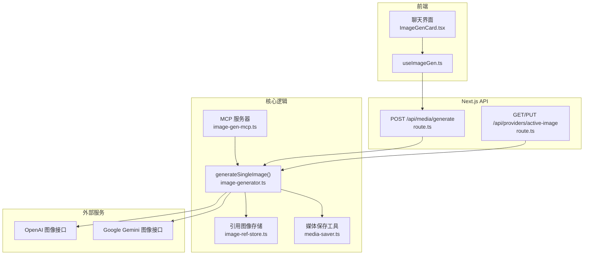
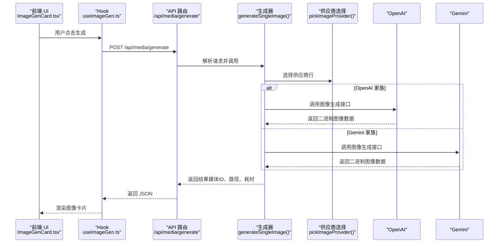
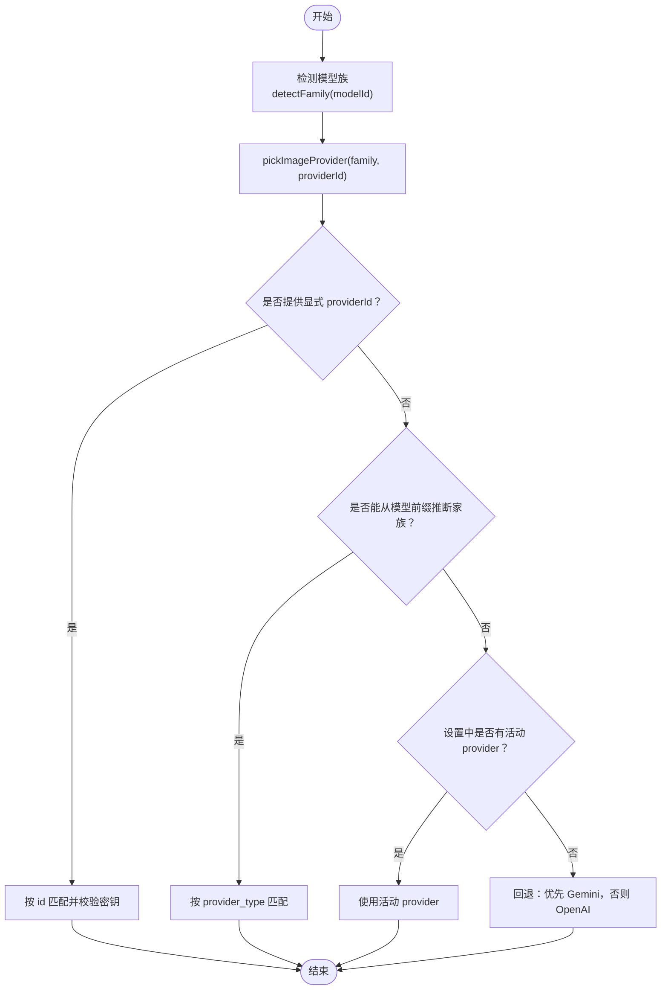
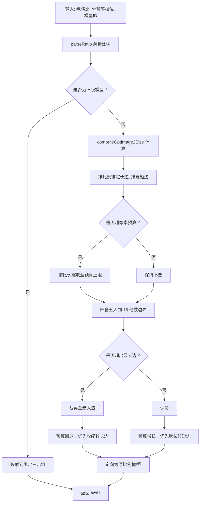
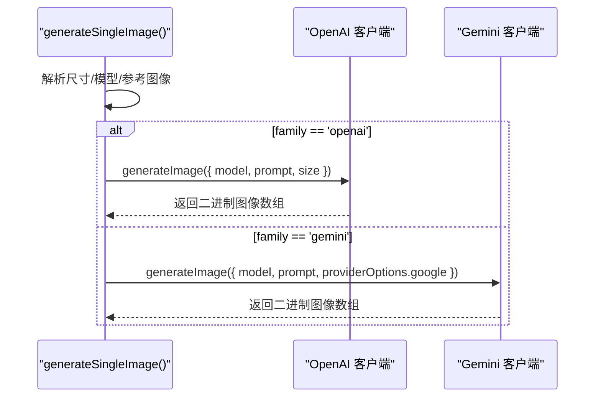
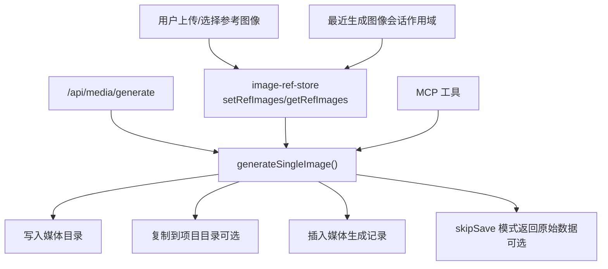
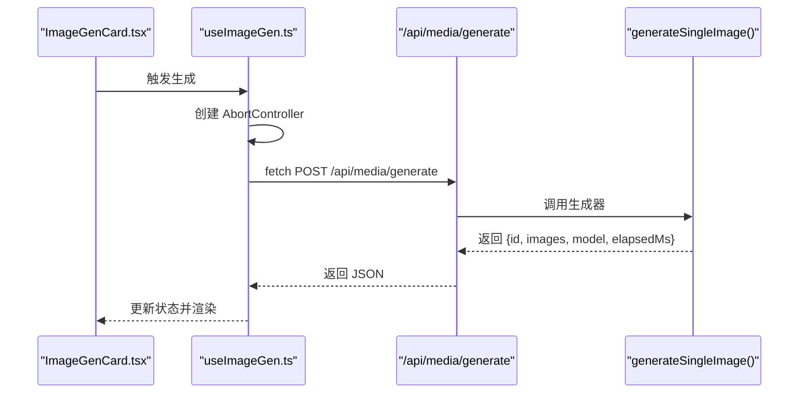
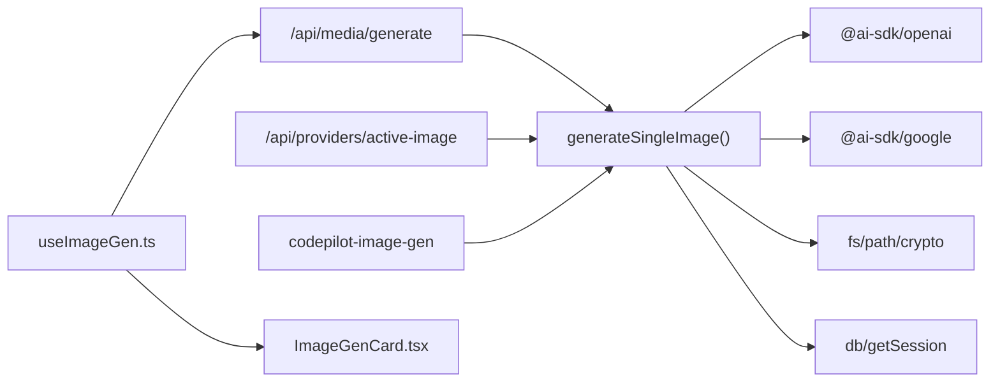

# 图像生成核心

<cite>
**本文引用的文件**
- [image-generator.ts](file://src/lib/image-generator.ts)
- [openai-image-size.test.ts](file://src/__tests__/unit/openai-image-size.test.ts)
- [image-gen-mcp.ts](file://src/lib/image-gen-mcp.ts)
- [image-ref-store.ts](file://src/lib/image-ref-store.ts)
- [route.ts（媒体生成 API）](file://src/app/api/media/generate/route.ts)
- [route.ts（活动图像提供者 API）](file://src/app/api/providers/active-image/route.ts)
- [useImageGen.ts](file://src/hooks/useImageGen.ts)
- [ImageGenCard.tsx](file://src/components/chat/ImageGenCard.tsx)
- [media-saver.ts](file://src/lib/media-saver.ts)
</cite>

## 目录
1. [简介](#简介)
2. [项目结构](#项目结构)
3. [核心组件](#核心组件)
4. [架构总览](#架构总览)
5. [详细组件分析](#详细组件分析)
6. [依赖关系分析](#依赖关系分析)
7. [性能考量](#性能考量)
8. [故障排查指南](#故障排查指南)
9. [结论](#结论)
10. [附录](#附录)

## 简介
本文件面向 CodePilot 的图像生成核心能力，聚焦于 generateSingleImage 函数的实现原理与运行机制，覆盖以下主题：
- 供应商选择算法与优先级
- 模型检测与环境变量解析
- 图像尺寸映射规则与约束（GPT Image 2 约束、纵横比处理）
- OpenAI 与 Gemini 两家供应商的集成方式（API 调用流程、参数转换、错误处理）
- 参考图像支持与会话系统集成
- 项目目录复制机制与媒体库持久化
- 前端调用示例与异步处理、结果解析

## 项目结构
与图像生成相关的关键模块分布如下：
- 核心生成器：src/lib/image-generator.ts
- MCP 工具服务：src/lib/image-gen-mcp.ts
- 引用图像存储：src/lib/image-ref-store.ts
- 媒体生成 API：src/app/api/media/generate/route.ts
- 活动图像提供者 API：src/app/api/providers/active-image/route.ts
- 前端 Hook 与卡片组件：src/hooks/useImageGen.ts、src/components/chat/ImageGenCard.tsx
- 媒体导入与保存工具：src/lib/media-saver.ts
- 单元测试：src/__tests__/unit/openai-image-size.test.ts

**图表来源**
- [image-generator.ts:271-451](file://src/lib/image-generator.ts#L271-L451)
- [image-gen-mcp.ts:22-80](file://src/lib/image-gen-mcp.ts#L22-L80)
- [image-ref-store.ts:120-150](file://src/lib/image-ref-store.ts#L120-L150)
- [media-saver.ts:94-161](file://src/lib/media-saver.ts#L94-L161)
- [route.ts（媒体生成 API）:20-70](file://src/app/api/media/generate/route.ts#L20-L70)
- [route.ts（活动图像提供者 API）:41-119](file://src/app/api/providers/active-image/route.ts#L41-L119)

**章节来源**
- [image-generator.ts:13-455](file://src/lib/image-generator.ts#L13-L455)
- [image-gen-mcp.ts:1-81](file://src/lib/image-gen-mcp.ts#L1-L81)
- [image-ref-store.ts:1-151](file://src/lib/image-ref-store.ts#L1-L151)
- [media-saver.ts:1-162](file://src/lib/media-saver.ts#L1-L162)
- [route.ts（媒体生成 API）:1-71](file://src/app/api/media/generate/route.ts#L1-L71)
- [route.ts（活动图像提供者 API）:1-120](file://src/app/api/providers/active-image/route.ts#L1-L120)

## 核心组件
- generateSingleImage：统一的图像生成入口，负责供应商选择、尺寸映射、API 调用、磁盘写入、项目目录复制、数据库记录与返回结果。
- mapAspectToOpenAISize：将 UI 的纵横比与分辨率档位映射到 OpenAI 图像 API 的有效尺寸（满足 GPT Image 2 约束）。
- pickImageProvider：按优先级选择图像生成供应商行（显式 providerId、模型族推断、设置中的活动提供者、回退策略）。
- image-gen-mcp：MCP 工具服务器，封装 generateSingleImage 并向前端注入媒体块。
- image-ref-store：统一管理“待绑定”、“消息级”、“会话级最近生成”的参考图像集合。
- media-saver：通用媒体保存工具，支持从 base64 或本地文件导入并入库。

**章节来源**
- [image-generator.ts:271-451](file://src/lib/image-generator.ts#L271-L451)
- [image-generator.ts:163-198](file://src/lib/image-generator.ts#L163-L198)
- [image-generator.ts:217-265](file://src/lib/image-generator.ts#L217-L265)
- [image-gen-mcp.ts:22-80](file://src/lib/image-gen-mcp.ts#L22-L80)
- [image-ref-store.ts:120-150](file://src/lib/image-ref-store.ts#L120-L150)
- [media-saver.ts:94-161](file://src/lib/media-saver.ts#L94-L161)

## 架构总览
下图展示了从前端到后端、再到供应商 API 的完整调用链路，以及参考图像与媒体库的集成：

**图表来源**
- [useImageGen.ts:39-100](file://src/hooks/useImageGen.ts#L39-L100)
- [route.ts（媒体生成 API）:20-70](file://src/app/api/media/generate/route.ts#L20-L70)
- [image-generator.ts:271-451](file://src/lib/image-generator.ts#L271-L451)

## 详细组件分析

### 供应商选择算法与模型检测
- 模型族检测：通过模型 ID 前缀判断家族（gpt-image / chatgpt-image → OpenAI；gemini → Gemini；其他返回未定义）。
- 供应商选择优先级：
  1) 显式 providerId（必须存在且有密钥）
  2) 由模型前缀推断的家族，匹配对应 provider_type
  3) 设置中的 active_image_provider_id
  4) 回退：优先返回 Gemini，否则 OpenAI
- 默认模型解析：从 provider.extra_env 中读取 OPENAI_IMAGE_MODEL 或 GEMINI_IMAGE_MODEL，否则使用家族默认值。

**图表来源**
- [image-generator.ts:43-48](file://src/lib/image-generator.ts#L43-L48)
- [image-generator.ts:217-265](file://src/lib/image-generator.ts#L217-L265)

**章节来源**
- [image-generator.ts:43-48](file://src/lib/image-generator.ts#L43-L48)
- [image-generator.ts:217-265](file://src/lib/image-generator.ts#L217-L265)

### 尺寸映射规则与纵横比处理（GPT Image 2 约束）
- 约束条件（来自 OpenAI 文档）：
  - 最长边 ≤ 3840
  - 总像素 ≥ 655360，≤ 8294400
  - 边长必须是 16 的倍数
  - 最大宽高比 ≤ 3:1
- 映射函数 mapAspectToOpenAISize：
  - 旧版模型（gpt-image-1*）：强制映射到固定三元组（1024x1024 / 1536x1024 / 1024x1536），忽略分辨率档位
  - 新版模型（gpt-image-2）：按 UI 支持的纵横比与分辨率档位计算最接近的有效尺寸，保证每种 UI 比例在同档位下输出不同尺寸
- 计算流程：
  - 解析比例字符串，非法输入回落到安全的正方形尺寸
  - 对于正方形走独立锚点表，非正方形以长边锚定到档位，按比例推导短边
  - 若超过像素预算则按比例缩放，再进行步进调整（先回退到预算内，再按短板增长）
  - 最终按原始比例定向（横版/竖版）

**图表来源**
- [image-generator.ts:73-86](file://src/lib/image-generator.ts#L73-L86)
- [image-generator.ts:99-150](file://src/lib/image-generator.ts#L99-L150)
- [image-generator.ts:163-198](file://src/lib/image-generator.ts#L163-L198)
- [openai-image-size.test.ts:26-36](file://src/__tests__/unit/openai-image-size.test.ts#L26-L36)
- [openai-image-size.test.ts:63-129](file://src/__tests__/unit/openai-image-size.test.ts#L63-L129)

**章节来源**
- [image-generator.ts:50-198](file://src/lib/image-generator.ts#L50-L198)
- [openai-image-size.test.ts:1-155](file://src/__tests__/unit/openai-image-size.test.ts#L1-L155)

### OpenAI 与 Gemini 集成方式
- OpenAI：
  - 使用 @ai-sdk/openai 创建客户端，模型名传入 openai.image(requestedModel)
  - 尺寸通过 mapAspectToOpenAISize 计算得到 WxH 字符串
  - 参考图像作为 prompt.images 传递（ai SDK 在 OpenAI 路径下路由到 /images/edits）
- Gemini：
  - 使用 @ai-sdk/google 创建客户端，模型名传入 google.image(requestedModel)
  - 通过 providerOptions.google.imageConfig 传递 aspectRatio 与 imageSize
- 统一错误处理：
  - 对 NoImageGeneratedError 进行特殊处理，返回 422 并提示更换提示词
  - 其他异常返回 500

**图表来源**
- [image-generator.ts:308-348](file://src/lib/image-generator.ts#L308-L348)

**章节来源**
- [image-generator.ts:308-348](file://src/lib/image-generator.ts#L308-L348)
- [route.ts（媒体生成 API）:54-68](file://src/app/api/media/generate/route.ts#L54-L68)

### 参考图像支持与会话系统集成
- 参考图像来源：
  - 前端上传的 File 列表（base64 编码）与本地路径列表（相对路径基于 cwd 解析）
  - 会话级“最近生成图像”（通过 sessionStorage 与内存映射维护）
- 存储与合并：
  - image-ref-store 提供统一的键空间：待绑定、消息级、会话级最近生成
  - buildReferenceImages 合并三类来源，形成最终传给生成器的参考图像数组
- 项目目录复制：
  - 当 sessionId 存在时，将生成的图像复制到会话工作目录下的 .codepilot-images 子目录
- 媒体库持久化：
  - 生成器内部写入全局媒体目录 ~/.codepilot/.codepilot-media，并插入数据库记录
  - 可选 skipSave 模式：跳过磁盘写入与 DB 插入，直接返回原始字节流（MCP 管道使用）

**图表来源**
- [image-ref-store.ts:120-150](file://src/lib/image-ref-store.ts#L120-L150)
- [image-generator.ts:289-304](file://src/lib/image-generator.ts#L289-L304)
- [image-generator.ts:381-400](file://src/lib/image-generator.ts#L381-L400)
- [image-generator.ts:420-442](file://src/lib/image-generator.ts#L420-L442)
- [media-saver.ts:94-161](file://src/lib/media-saver.ts#L94-L161)

**章节来源**
- [image-ref-store.ts:11-150](file://src/lib/image-ref-store.ts#L11-L150)
- [image-generator.ts:289-400](file://src/lib/image-generator.ts#L289-L400)
- [media-saver.ts:94-161](file://src/lib/media-saver.ts#L94-L161)

### 前端调用示例与异步处理
- 前端 Hook useImageGen：
  - 支持取消上一次生成（AbortController）
  - 将 File 列表转为 base64 数组并随请求发送
  - 发送 POST /api/media/generate，解析响应并缓存最后结果
- 前端组件 ImageGenCard：
  - 渲染生成图像网格、显示提示词、显示参考图像缩略图
  - 支持预览、下载、重新生成操作

**图表来源**
- [useImageGen.ts:39-100](file://src/hooks/useImageGen.ts#L39-L100)
- [route.ts（媒体生成 API）:20-70](file://src/app/api/media/generate/route.ts#L20-L70)
- [image-generator.ts:271-451](file://src/lib/image-generator.ts#L271-L451)

**章节来源**
- [useImageGen.ts:1-109](file://src/hooks/useImageGen.ts#L1-L109)
- [ImageGenCard.tsx:1-191](file://src/components/chat/ImageGenCard.tsx#L1-L191)

## 依赖关系分析
- generateSingleImage 依赖：
  - 供应商选择与模型解析：image-generator.ts 内部函数
  - OpenAI/Gemini SDK：@ai-sdk/openai、@ai-sdk/google
  - 数据库与会话：db、getSession
  - 文件系统：fs、path、crypto
- API 层：
  - /api/media/generate：接收请求、调用生成器、返回结果
  - /api/providers/active-image：查询/设置当前活动图像提供者
- MCP 工具：
  - codepilot-image-gen：在进程内提供 MCP 工具，调用生成器并注入媒体块
- 前端：
  - useImageGen：发起请求、处理取消、解析响应
  - ImageGenCard：渲染与交互

**图表来源**
- [route.ts（媒体生成 API）:20-70](file://src/app/api/media/generate/route.ts#L20-L70)
- [route.ts（活动图像提供者 API）:41-119](file://src/app/api/providers/active-image/route.ts#L41-L119)
- [image-gen-mcp.ts:22-80](file://src/lib/image-gen-mcp.ts#L22-L80)
- [image-generator.ts:1-12](file://src/lib/image-generator.ts#L1-L12)

**章节来源**
- [route.ts（媒体生成 API）:1-71](file://src/app/api/media/generate/route.ts#L1-L71)
- [route.ts（活动图像提供者 API）:1-120](file://src/app/api/providers/active-image/route.ts#L1-L120)
- [image-gen-mcp.ts:1-81](file://src/lib/image-gen-mcp.ts#L1-L81)
- [image-generator.ts:1-12](file://src/lib/image-generator.ts#L1-L12)

## 性能考量
- 超时与重试：
  - 生成器默认超时 300 秒，OpenAI/Gemini 调用设置 maxRetries=3
- I/O 与复制：
  - 生成完成后写入媒体目录与项目目录，建议确保磁盘空间充足
- 尺寸计算：
  - mapAspectToOpenAISize 采用步进与预算回退策略，避免无效尝试
- 前端取消：
  - useImageGen 支持 AbortController，及时中断长时间请求

[本节为通用指导，无需具体文件分析]

## 故障排查指南
- 无图像返回（NoImageGeneratedError）：
  - API 层返回 422，提示更换提示词
- 未配置图像提供者：
  - pickImageProvider 抛出明确错误，检查设置中是否存在有效的 gemini-image 或 openai-image 提供者
- 活动提供者失效：
  - /api/providers/active-image 查询返回 stale=true，表示存储的 providerId 不再可用
- MCP 工具错误：
  - image-gen-mcp 捕获 NoImageGeneratedError 并返回结构化错误文本
- 项目目录复制失败：
  - 生成器在复制到项目目录时捕获异常并记录警告，不影响主流程

**章节来源**
- [route.ts（媒体生成 API）:54-68](file://src/app/api/media/generate/route.ts#L54-L68)
- [image-generator.ts:226-228](file://src/lib/image-generator.ts#L226-L228)
- [image-gen-mcp.ts:67-75](file://src/lib/image-gen-mcp.ts#L67-L75)
- [image-generator.ts:396-398](file://src/lib/image-generator.ts#L396-L398)

## 结论
CodePilot 的图像生成核心以 generateSingleImage 为中心，围绕供应商选择、尺寸映射、参考图像与会话集成、媒体库持久化构建了完整的端到端流程。通过严格的约束与稳健的回退策略，确保在不同供应商与模型下都能稳定产出符合规范的图像，并提供良好的前端体验与可扩展的 MCP 集成。

[本节为总结性内容，无需具体文件分析]

## 附录

### API 定义与调用示例
- 生成图像（POST /api/media/generate）
  - 请求体字段：prompt、model、providerId、aspectRatio、imageSize、referenceImages、referenceImagePaths、sessionId
  - 成功响应：包含 id、images（含 mimeType 与 localPath）、model、family、imageSize、elapsedMs
  - 错误：400（缺少 prompt）、422（无图像返回）、500（其他异常）
- 获取/设置活动图像提供者（GET/PUT /api/providers/active-image）
  - GET：返回 providerId、stale、providerName、providerType、family、model、modelLabel
  - PUT：校验 providerId 是否为媒体提供者且有密钥，成功后写入设置

**章节来源**
- [route.ts（媒体生成 API）:4-70](file://src/app/api/media/generate/route.ts#L4-L70)
- [route.ts（活动图像提供者 API）:41-119](file://src/app/api/providers/active-image/route.ts#L41-L119)

### 代码片段路径参考
- 供应商选择与模型解析：[image-generator.ts:217-283](file://src/lib/image-generator.ts#L217-L283)
- 尺寸映射与约束：[image-generator.ts:99-198](file://src/lib/image-generator.ts#L99-L198)
- OpenAI/Gemini 调用与参数转换：[image-generator.ts:308-348](file://src/lib/image-generator.ts#L308-L348)
- 参考图像合并与会话复制：[image-ref-store.ts:120-150](file://src/lib/image-ref-store.ts#L120-L150)、[image-generator.ts:381-400](file://src/lib/image-generator.ts#L381-L400)
- 前端调用与渲染：[useImageGen.ts:39-100](file://src/hooks/useImageGen.ts#L39-L100)、[ImageGenCard.tsx:35-191](file://src/components/chat/ImageGenCard.tsx#L35-L191)