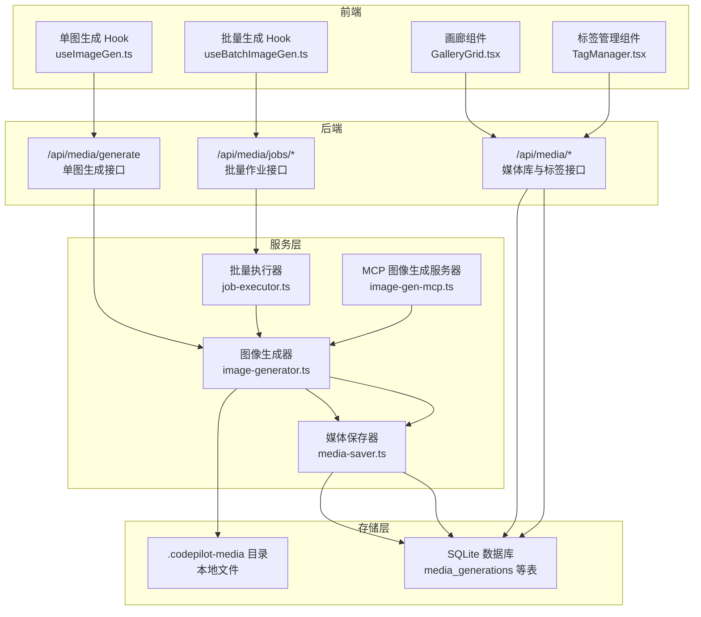
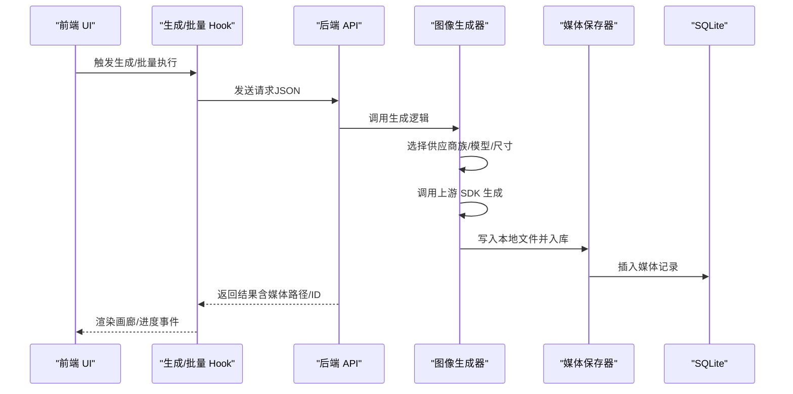
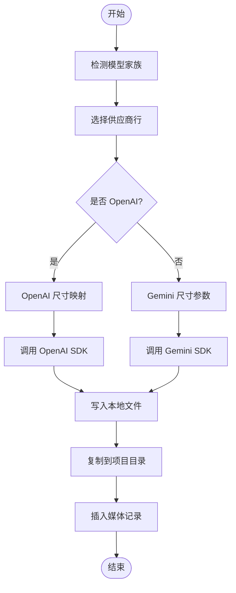
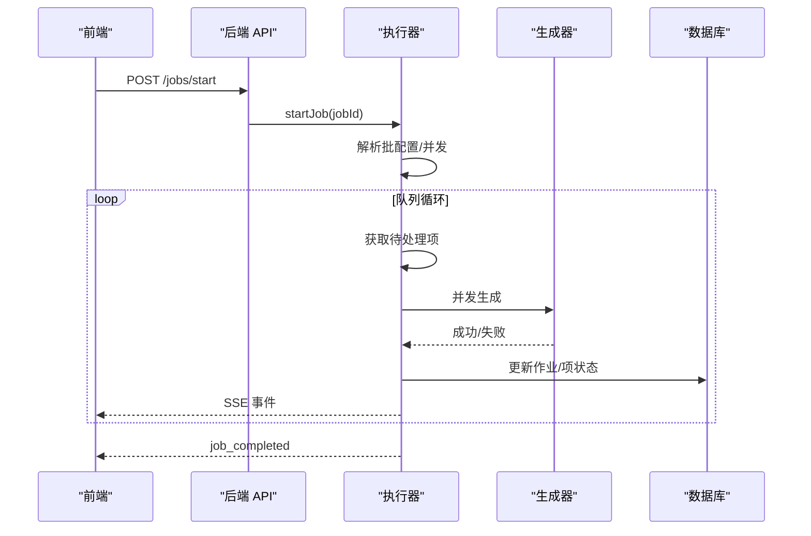
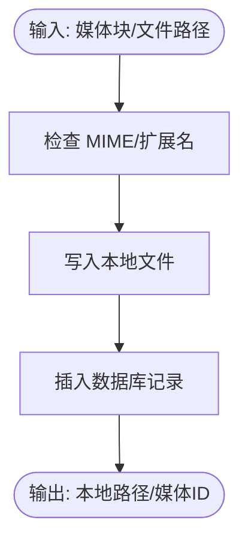
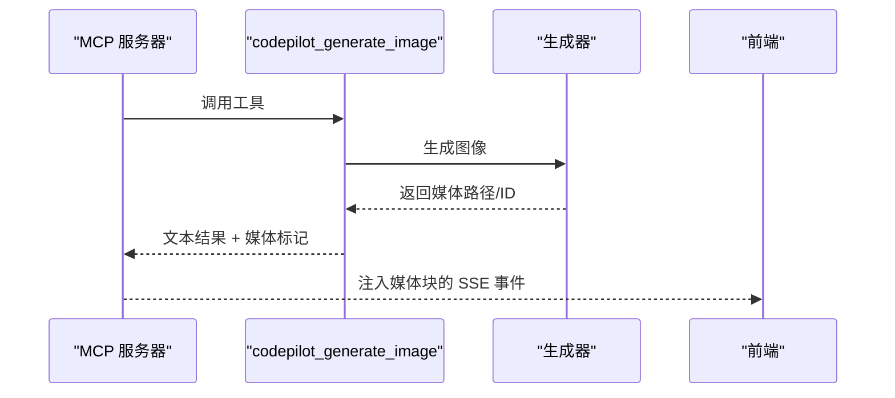
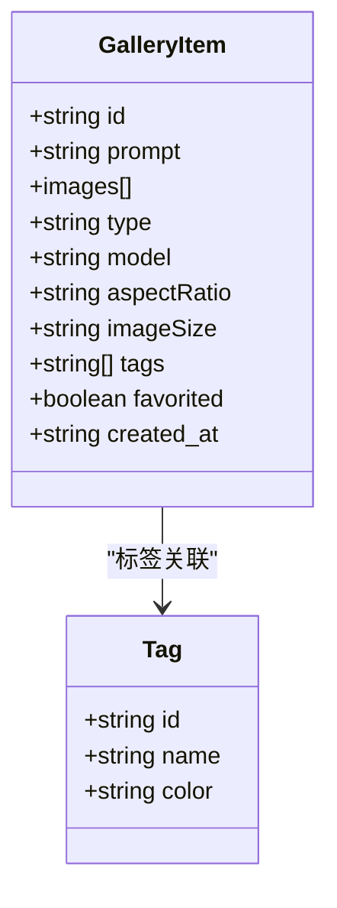
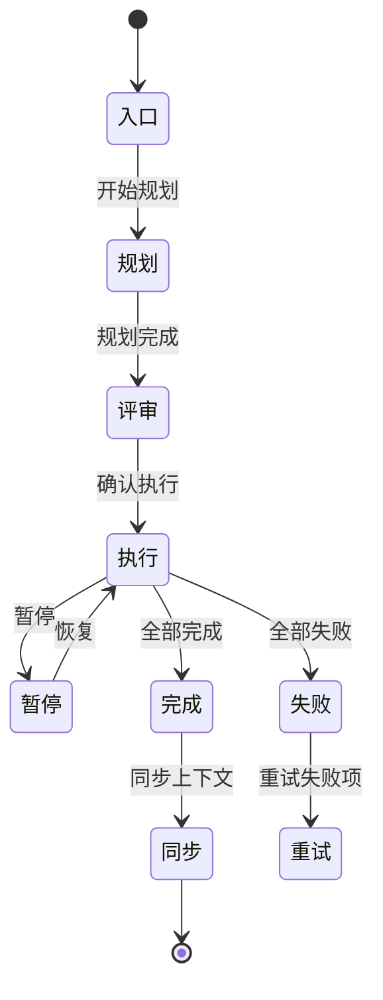
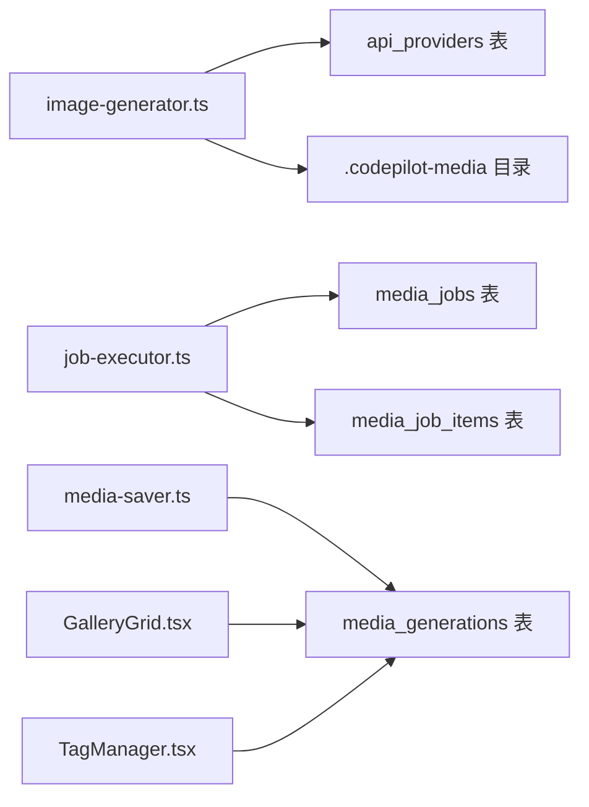

# 媒体生成功能

<cite>
**本文档引用的文件**
- [image-generator.ts](file://src/lib/image-generator.ts)
- [job-executor.ts](file://src/lib/job-executor.ts)
- [media-saver.ts](file://src/lib/media-saver.ts)
- [image-gen-mcp.ts](file://src/lib/image-gen-mcp.ts)
- [GalleryGrid.tsx](file://src/components/gallery/GalleryGrid.tsx)
- [TagManager.tsx](file://src/components/gallery/TagManager.tsx)
- [useBatchImageGen.ts](file://src/hooks/useBatchImageGen.ts)
- [useImageGen.ts](file://src/hooks/useImageGen.ts)
- [db.ts](file://src/lib/db.ts)
- [index.ts](file://src/types/index.ts)
</cite>

## 目录
1. [简介](#简介)
2. [项目结构](#项目结构)
3. [核心组件](#核心组件)
4. [架构总览](#架构总览)
5. [详细组件分析](#详细组件分析)
6. [依赖关系分析](#依赖关系分析)
7. [性能考虑](#性能考虑)
8. [故障排除指南](#故障排除指南)
9. [结论](#结论)
10. [附录](#附录)

## 简介
本文件系统性阐述 CodePilot 的媒体生成功能，覆盖以下关键能力：
- 图像生成流程：从提示词到最终媒体入库与展示的完整链路
- 批量任务执行器：作业计划、并发控制、重试策略与进度同步
- 画廊管理系统：媒体库浏览、标签管理、收藏与元数据
- 供应商集成：Gemini 与 OpenAI 图像模型族的自动识别与调用
- 存储与上下文事件：本地磁盘存储、SQLite 数据库存储、上下文事件同步
- 性能优化与故障排除：并发、超时、错误分类与恢复策略

## 项目结构
媒体生成功能由“生成层”“执行层”“存储层”“UI 展示层”四部分组成，核心文件分布如下：
- 生成层：负责模型选择、尺寸映射、供应商调用与结果落盘
- 执行层：负责批量作业的队列、并发、重试与进度事件
- 存储层：负责本地文件写入、项目目录复制与数据库记录
- UI 展示层：负责画廊网格、标签管理与批量生成工作流

图表来源
- [useImageGen.ts:1-109](file://src/hooks/useImageGen.ts#L1-L109)
- [useBatchImageGen.ts:1-486](file://src/hooks/useBatchImageGen.ts#L1-L486)
- [image-generator.ts:1-455](file://src/lib/image-generator.ts#L1-L455)
- [job-executor.ts:1-363](file://src/lib/job-executor.ts#L1-L363)
- [media-saver.ts:1-162](file://src/lib/media-saver.ts#L1-L162)
- [image-gen-mcp.ts:1-81](file://src/lib/image-gen-mcp.ts#L1-L81)
- [GalleryGrid.tsx:1-111](file://src/components/gallery/GalleryGrid.tsx#L1-L111)
- [TagManager.tsx:1-214](file://src/components/gallery/TagManager.tsx#L1-L214)
- [db.ts:152-229](file://src/lib/db.ts#L152-L229)

章节来源
- [image-generator.ts:1-455](file://src/lib/image-generator.ts#L1-L455)
- [job-executor.ts:1-363](file://src/lib/job-executor.ts#L1-L363)
- [media-saver.ts:1-162](file://src/lib/media-saver.ts#L1-L162)
- [image-gen-mcp.ts:1-81](file://src/lib/image-gen-mcp.ts#L1-L81)
- [GalleryGrid.tsx:1-111](file://src/components/gallery/GalleryGrid.tsx#L1-L111)
- [TagManager.tsx:1-214](file://src/components/gallery/TagManager.tsx#L1-L214)
- [useBatchImageGen.ts:1-486](file://src/hooks/useBatchImageGen.ts#L1-L486)
- [useImageGen.ts:1-109](file://src/hooks/useImageGen.ts#L1-L109)
- [db.ts:152-229](file://src/lib/db.ts#L152-L229)

## 核心组件
- 图像生成器（image-generator.ts）
  - 功能：根据模型族（Gemini/OpenAI）自动识别、尺寸映射、调用上游 API、落盘与入库
  - 关键点：支持参考图（风格/内容引导）、可跳过落盘用于 MCP 流水线
- 批量执行器（job-executor.ts）
  - 功能：作业生命周期管理、并发控制、指数退避重试、进度事件推送
  - 关键点：运行中状态在内存中持久化，进程重启自动恢复为暂停态
- 媒体保存器（media-saver.ts）
  - 功能：Base64/MIME 到本地文件的导入与入库；CLI 工具输出导入
  - 关键点：统一扩展名映射、MIME 类型判定、元数据与标签入库
- MCP 图像生成（image-gen-mcp.ts）
  - 功能：内嵌 MCP 服务器，工具调用触发生成并将结果注入 SSE 事件
  - 关键点：结果标记位用于前端解析媒体块
- 画廊与标签（GalleryGrid.tsx、TagManager.tsx）
  - 功能：媒体库展示、视频/图片识别、多图计数、收藏与标签交互
  - 关键点：懒加载缩略图、颜色标签、增删改查标签 API
- 批量生成工作流（useBatchImageGen.ts、useImageGen.ts）
  - 功能：规划、评审、执行、暂停/恢复/取消、SSE 进度监听、上下文同步
  - 关键点：SSE 事件类型丰富，支持快照与单项事件

章节来源
- [image-generator.ts:13-455](file://src/lib/image-generator.ts#L13-L455)
- [job-executor.ts:17-363](file://src/lib/job-executor.ts#L17-L363)
- [media-saver.ts:36-162](file://src/lib/media-saver.ts#L36-L162)
- [image-gen-mcp.ts:22-81](file://src/lib/image-gen-mcp.ts#L22-L81)
- [GalleryGrid.tsx:20-111](file://src/components/gallery/GalleryGrid.tsx#L20-L111)
- [TagManager.tsx:29-214](file://src/components/gallery/TagManager.tsx#L29-L214)
- [useBatchImageGen.ts:10-486](file://src/hooks/useBatchImageGen.ts#L10-L486)
- [useImageGen.ts:11-109](file://src/hooks/useImageGen.ts#L11-L109)

## 架构总览
媒体生成功能采用“前端驱动 + 后端服务 + 存储”的分层设计：
- 前端通过 Hook 发起请求，使用 SSE 实时接收进度事件
- 后端生成器按供应商族选择具体实现，调用上游 SDK 并落盘
- 执行器负责批量作业的并发与重试，确保稳定性
- 存储层同时维护本地文件与数据库记录，保证可检索与可回放

图表来源
- [useImageGen.ts:39-100](file://src/hooks/useImageGen.ts#L39-L100)
- [useBatchImageGen.ts:203-255](file://src/hooks/useBatchImageGen.ts#L203-L255)
- [image-generator.ts:271-451](file://src/lib/image-generator.ts#L271-L451)
- [media-saver.ts:94-161](file://src/lib/media-saver.ts#L94-L161)
- [db.ts:152-171](file://src/lib/db.ts#L152-L171)

## 详细组件分析

### 组件一：图像生成器（供应商与尺寸映射）
- 供应商识别
  - 通过模型 ID 前缀判断家族（gpt-image-* → OpenAI；gemini-* → Gemini）
  - 支持显式 providerId 强制指定供应商
- 尺寸映射
  - OpenAI 图像 2：基于长边锚点与像素预算约束，计算满足 16 像素步进的尺寸
  - 遗留模型：按比例映射到标准三档分辨率
- 参考图支持
  - 支持 base64 与本地路径两种输入，统一编码后传递给上游
- 落盘与入库
  - 生成完成后写入本地目录，复制到项目目录，插入数据库记录

图表来源
- [image-generator.ts:42-348](file://src/lib/image-generator.ts#L42-L348)
- [image-generator.ts:364-451](file://src/lib/image-generator.ts#L364-L451)

章节来源
- [image-generator.ts:42-348](file://src/lib/image-generator.ts#L42-L348)
- [image-generator.ts:364-451](file://src/lib/image-generator.ts#L364-L451)

### 组件二：批量任务执行器（并发与重试）
- 作业状态机
  - draft → planning → planned → running → paused → completed/cancelled/failed
  - 进程重启自动恢复为 paused，避免丢失进行中的任务
- 并发与重试
  - 默认并发 2，最大重试 2 次，指数退避（3 的幂次）
  - 对 4xx/5xx 错误进行非重试性判定（如 400/401/403）
- 进度事件
  - item_started/item_completed/item_failed/item_retry/job_completed/job_paused/job_cancelled/snapshot
  - 前端通过 SSE 订阅实时更新

图表来源
- [job-executor.ts:88-295](file://src/lib/job-executor.ts#L88-L295)
- [useBatchImageGen.ts:257-330](file://src/hooks/useBatchImageGen.ts#L257-L330)

章节来源
- [job-executor.ts:88-295](file://src/lib/job-executor.ts#L88-L295)
- [useBatchImageGen.ts:257-330](file://src/hooks/useBatchImageGen.ts#L257-L330)

### 组件三：媒体保存器（导入与入库）
- Base64 导入
  - 接收媒体块（含 MIME），解码后写入本地目录，插入数据库记录
- 文件导入
  - 支持相对路径解析（以会话工作目录为基准），复制到媒体库并记录元数据
- 元数据与标签
  - 记录 MIME、来源、模型、宽高比、分辨率等
  - 标签数组以 JSON 字符串形式存储

图表来源
- [media-saver.ts:94-161](file://src/lib/media-saver.ts#L94-L161)

章节来源
- [media-saver.ts:94-161](file://src/lib/media-saver.ts#L94-L161)

### 组件四：MCP 图像生成（内嵌服务）
- 工具定义
  - 提供 codepilot_generate_image 工具，支持提示词、宽高比、分辨率、参考图路径
- 结果注入
  - 生成完成后返回文本结果，并携带媒体信息标记，前端据此构造媒体块注入 SSE

图表来源
- [image-gen-mcp.ts:22-81](file://src/lib/image-gen-mcp.ts#L22-L81)

章节来源
- [image-gen-mcp.ts:22-81](file://src/lib/image-gen-mcp.ts#L22-L81)

### 组件五：画廊与标签管理
- 画廊网格
  - 支持图片/视频预览、多图计数、收藏徽章、懒加载缩略图
  - 通过 /api/media/serve 提供本地文件服务
- 标签管理
  - 支持添加/删除/切换标签，颜色预设，远程 CRUD
  - 与媒体记录的 tags 字段关联

图表来源
- [GalleryGrid.tsx:5-18](file://src/components/gallery/GalleryGrid.tsx#L5-L18)
- [TagManager.tsx:12-16](file://src/components/gallery/TagManager.tsx#L12-L16)

章节来源
- [GalleryGrid.tsx:20-111](file://src/components/gallery/GalleryGrid.tsx#L20-L111)
- [TagManager.tsx:29-214](file://src/components/gallery/TagManager.tsx#L29-L214)

### 组件六：批量生成工作流（Hook）
- 规划阶段：向 /api/media/jobs/plan 流式获取计划文本与最终计划
- 评审阶段：可编辑计划项（提示词、宽高比、分辨率、标签、来源引用）
- 执行阶段：创建作业、启动执行、订阅进度 SSE、支持暂停/恢复/取消/重试
- 上下文同步：支持手动或自动批量同步至 LLM 上下文

图表来源
- [useBatchImageGen.ts:10-486](file://src/hooks/useBatchImageGen.ts#L10-L486)

章节来源
- [useBatchImageGen.ts:10-486](file://src/hooks/useBatchImageGen.ts#L10-L486)

## 依赖关系分析
- 生成器依赖
  - 供应商选择：从 api_providers 表筛选 image 类型供应商，优先级由参数/设置决定
  - 尺寸映射：OpenAI 图像 2 的约束与 Gemini 参数映射
  - 参考图：base64 编码与本地路径解析
- 执行器依赖
  - 作业与项：media_jobs、media_job_items 表
  - 进度事件：SSE 事件类型与快照
- 存储层
  - 本地目录：~/.codepilot/.codepilot-media
  - 数据库：media_generations、media_tags、media_jobs、media_job_items、media_context_events

图表来源
- [image-generator.ts:217-265](file://src/lib/image-generator.ts#L217-L265)
- [job-executor.ts:88-165](file://src/lib/job-executor.ts#L88-L165)
- [media-saver.ts:63-88](file://src/lib/media-saver.ts#L63-L88)
- [db.ts:152-229](file://src/lib/db.ts#L152-L229)

章节来源
- [image-generator.ts:217-265](file://src/lib/image-generator.ts#L217-L265)
- [job-executor.ts:88-165](file://src/lib/job-executor.ts#L88-L165)
- [media-saver.ts:63-88](file://src/lib/media-saver.ts#L63-L88)
- [db.ts:152-229](file://src/lib/db.ts#L152-L229)

## 性能考虑
- 并发与吞吐
  - 批量执行器默认并发 2，可根据硬件与配额调整；注意上游速率限制
- 超时与中断
  - 生成默认超时 300 秒，支持 AbortController 中断；前端可快速取消
- I/O 优化
  - 本地目录统一写入，项目目录复制仅在提供 sessionId 时进行
  - 媒体库缩略图懒加载，减少首屏压力
- 数据库
  - WAL 模式与索引优化，避免大查询阻塞；批量更新计数器减少写放大

## 故障排除指南
- 常见错误与处理
  - 无可用图像供应商：检查设置中是否配置了 Gemini Image 或 OpenAI Image 供应商
  - 非重试性错误：400/401/403 直接失败，检查密钥与权限
  - 重试耗尽：查看重试次数与延迟，确认网络与上游可用性
- 日志与定位
  - 生成器日志包含家族/模型/耗时信息，便于定位问题
  - 执行器对每个项的状态变更均有日志，结合数据库状态核对
- 数据库一致性
  - 进程重启后运行中作业自动恢复为暂停态，避免丢失；必要时手动恢复

章节来源
- [image-generator.ts:226-228](file://src/lib/image-generator.ts#L226-L228)
- [job-executor.ts:222-223](file://src/lib/job-executor.ts#L222-L223)
- [job-executor.ts:266-295](file://src/lib/job-executor.ts#L266-L295)

## 结论
CodePilot 的媒体生成功能以清晰的分层设计实现了从提示词到媒体库的全链路自动化：前端通过 Hook 与 SSE 实现流畅体验，后端以生成器与执行器保障稳定与可观测性，存储层兼顾本地与数据库的可检索性。通过供应商族自动识别、严格的尺寸约束与丰富的标签体系，系统在易用性与可控性之间取得良好平衡。

## 附录
- 生成参数与质量控制
  - 宽高比：支持 1:1、16:9、9:16、4:3、3:4
  - 分辨率：1K、2K（OpenAI 图像 2 有像素预算上限）
  - 参考图：风格/内容引导，支持 base64 与本地路径
- 上下文事件同步
  - 通过 media_context_events 表记录同步事件，支持手动与自动批量模式
- API 与类型
  - 媒体块、消息内容块、标签与作业相关类型定义集中于 types/index.ts

章节来源
- [index.ts:160-186](file://src/types/index.ts#L160-L186)
- [db.ts:218-229](file://src/lib/db.ts#L218-L229)