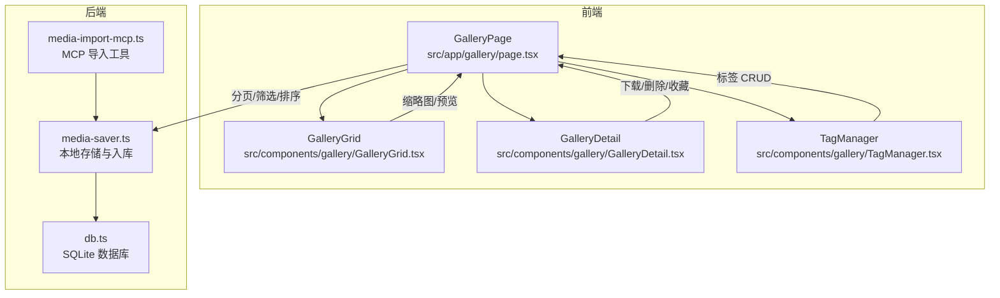
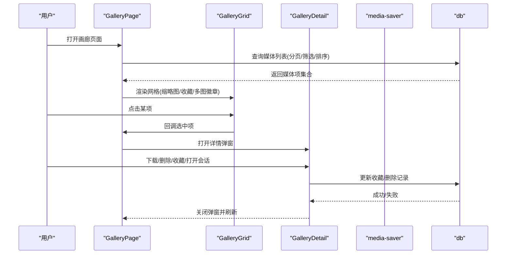
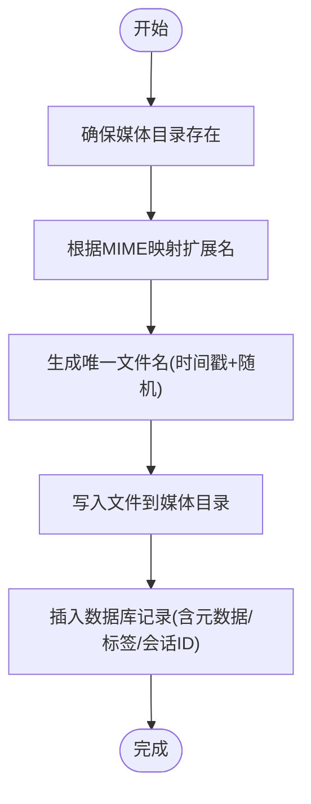
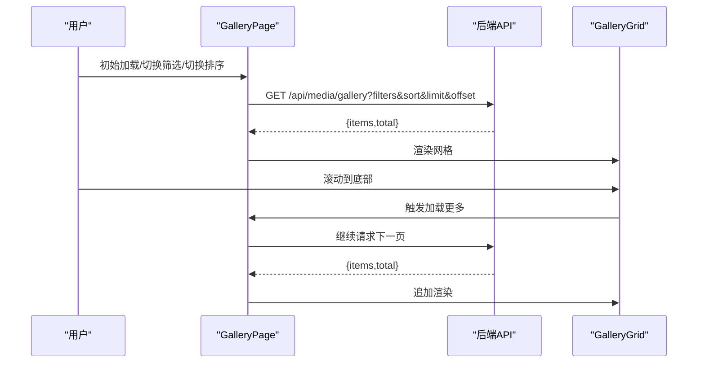
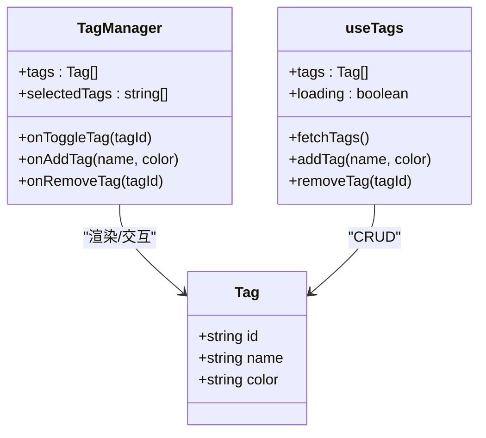
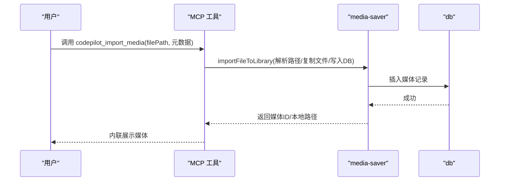
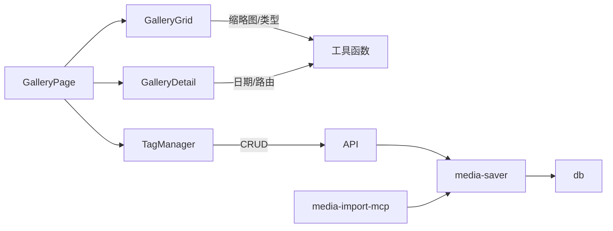

# 媒体画廊管理

<cite>
**本文引用的文件**
- [src/app/gallery/page.tsx](file://src/app/gallery/page.tsx)
- [src/components/gallery/GalleryGrid.tsx](file://src/components/gallery/GalleryGrid.tsx)
- [src/components/gallery/GalleryDetail.tsx](file://src/components/gallery/GalleryDetail.tsx)
- [src/components/gallery/TagManager.tsx](file://src/components/gallery/TagManager.tsx)
- [src/lib/media-saver.ts](file://src/lib/media-saver.ts)
- [src/lib/media-import-mcp.ts](file://src/lib/media-import-mcp.ts)
- [src/lib/db.ts](file://src/lib/db.ts)
</cite>

## 目录
1. [简介](#简介)
2. [项目结构](#项目结构)
3. [核心组件](#核心组件)
4. [架构总览](#架构总览)
5. [详细组件分析](#详细组件分析)
6. [依赖关系分析](#依赖关系分析)
7. [性能考量](#性能考量)
8. [故障排查指南](#故障排查指南)
9. [结论](#结论)
10. [附录](#附录)

## 简介
本文件系统性阐述 CodePilot 媒体画廊管理功能，覆盖媒体文件存储机制（本地路径、命名规则、目录结构）、画廊界面组件（网格显示、缩略图生成、文件预览、搜索过滤）、标签管理系统（创建、分配、查询、删除）、元数据与分类组织、批量操作、导入导出机制（外部文件导入、项目内文件管理、备份恢复）以及与会话系统的关联（会话内媒体文件管理与历史记录追踪）。文档以代码为依据，辅以可视化图表帮助理解。

## 项目结构
媒体画廊功能主要由三部分构成：
- 前端页面与组件：负责展示、交互与筛选
- 后端存储与导入：负责媒体文件落盘、入库与检索
- 标签系统：负责标签的增删改查与与媒体的关联

**图表来源**
- [src/app/gallery/page.tsx:17-257](file://src/app/gallery/page.tsx#L17-L257)
- [src/components/gallery/GalleryGrid.tsx:43-111](file://src/components/gallery/GalleryGrid.tsx#L43-L111)
- [src/components/gallery/GalleryDetail.tsx:59-294](file://src/components/gallery/GalleryDetail.tsx#L59-L294)
- [src/components/gallery/TagManager.tsx:39-214](file://src/components/gallery/TagManager.tsx#L39-L214)
- [src/lib/media-saver.ts:94-162](file://src/lib/media-saver.ts#L94-L162)
- [src/lib/media-import-mcp.ts:40-123](file://src/lib/media-import-mcp.ts#L40-L123)
- [src/lib/db.ts:152-178](file://src/lib/db.ts#L152-L178)

**章节来源**
- [src/app/gallery/page.tsx:17-257](file://src/app/gallery/page.tsx#L17-L257)
- [src/components/gallery/GalleryGrid.tsx:43-111](file://src/components/gallery/GalleryGrid.tsx#L43-L111)
- [src/components/gallery/GalleryDetail.tsx:59-294](file://src/components/gallery/GalleryDetail.tsx#L59-L294)
- [src/components/gallery/TagManager.tsx:39-214](file://src/components/gallery/TagManager.tsx#L39-L214)
- [src/lib/media-saver.ts:94-162](file://src/lib/media-saver.ts#L94-L162)
- [src/lib/media-import-mcp.ts:40-123](file://src/lib/media-import-mcp.ts#L40-L123)
- [src/lib/db.ts:152-178](file://src/lib/db.ts#L152-L178)

## 核心组件
- 媒体画廊页面：负责分页加载、筛选（日期范围、收藏）、排序（最新/最旧）、无限滚动、详情弹窗与删除/收藏操作。
- 媒体网格组件：渲染缩略图（支持图片与视频）、多图计数徽标、收藏状态、懒加载与视频播放指示器。
- 媒体详情组件：支持多图切换、下载、删除确认、收藏切换、打开会话、参考图展示、元数据徽章。
- 标签管理组件：支持标签列表、选择、新增（含颜色）、删除；提供 Hook 封装标签 CRUD。
- 存储与导入：统一保存到本地目录，写入数据库；支持从 MCP 工具导入并自动在聊天中内联展示。
- 数据库：媒体生成记录表、标签表、作业与上下文事件表等。

**章节来源**
- [src/app/gallery/page.tsx:17-257](file://src/app/gallery/page.tsx#L17-L257)
- [src/components/gallery/GalleryGrid.tsx:43-111](file://src/components/gallery/GalleryGrid.tsx#L43-L111)
- [src/components/gallery/GalleryDetail.tsx:59-294](file://src/components/gallery/GalleryDetail.tsx#L59-L294)
- [src/components/gallery/TagManager.tsx:39-214](file://src/components/gallery/TagManager.tsx#L39-L214)
- [src/lib/media-saver.ts:94-162](file://src/lib/media-saver.ts#L94-L162)
- [src/lib/media-import-mcp.ts:40-123](file://src/lib/media-import-mcp.ts#L40-L123)
- [src/lib/db.ts:152-178](file://src/lib/db.ts#L152-L178)

## 架构总览
媒体画廊的端到端流程如下：

**图表来源**
- [src/app/gallery/page.tsx:36-133](file://src/app/gallery/page.tsx#L36-L133)
- [src/components/gallery/GalleryGrid.tsx:43-111](file://src/components/gallery/GalleryGrid.tsx#L43-L111)
- [src/components/gallery/GalleryDetail.tsx:59-294](file://src/components/gallery/GalleryDetail.tsx#L59-L294)
- [src/lib/db.ts:152-178](file://src/lib/db.ts#L152-L178)

## 详细组件分析

### 媒体文件存储机制
- 存储根目录
  - 默认位于用户主目录下的特定子目录，可通过环境变量指定。
  - 目录用于存放所有生成或导入的媒体文件，确保与应用数据隔离。
- 文件命名规则
  - 采用时间戳+随机字节的组合作为文件名，避免冲突并保证唯一性。
  - 扩展名根据 MIME 类型映射或原始扩展名确定。
- 目录结构组织
  - 单一媒体目录集中存放，便于备份与迁移。
  - 不同类型（图像/视频/音频）通过 MIME 类型区分。
- 元数据与索引
  - 数据库存储媒体生成记录（类型、提供商、提示词、会话ID、标签、元数据、收藏状态等）。
  - 提供索引以优化按时间、会话、状态等查询。
- 会话关联
  - 每条媒体记录可绑定会话ID，支持按会话检索与回溯。

**图表来源**
- [src/lib/media-saver.ts:51-117](file://src/lib/media-saver.ts#L51-L117)
- [src/lib/db.ts:152-171](file://src/lib/db.ts#L152-L171)

**章节来源**
- [src/lib/media-saver.ts:51-117](file://src/lib/media-saver.ts#L51-L117)
- [src/lib/db.ts:152-171](file://src/lib/db.ts#L152-L171)

### 画廊界面组件
- 网格显示
  - 使用列布局实现响应式网格，每项包含缩略图、多图徽标、收藏状态。
  - 视频项显示播放指示器，图片使用懒加载。
- 缩略图生成
  - 优先使用本地路径通过服务接口提供；若无本地路径则回退到 Base64 数据 URI。
- 文件预览
  - 支持图片与视频预览；视频自动静音预加载。
- 搜索与过滤
  - 支持日期范围过滤、收藏筛选、排序切换（最新/最旧）。
  - 过滤条件通过查询参数传递给后端。
- 无限滚动
  - 使用 IntersectionObserver 监听“哨兵”元素进入视口，触发分页加载。

**图表来源**
- [src/app/gallery/page.tsx:36-133](file://src/app/gallery/page.tsx#L36-L133)
- [src/components/gallery/GalleryGrid.tsx:43-111](file://src/components/gallery/GalleryGrid.tsx#L43-L111)

**章节来源**
- [src/app/gallery/page.tsx:17-257](file://src/app/gallery/page.tsx#L17-L257)
- [src/components/gallery/GalleryGrid.tsx:43-111](file://src/components/gallery/GalleryGrid.tsx#L43-L111)

### 标签管理系统
- 标签模型
  - 包含名称与可选颜色，支持预设颜色方案。
- 功能
  - 展示标签列表，支持选择/取消选择。
  - 新增标签（输入名称与选择颜色），删除标签。
  - 提供 Hook 封装标签的获取、新增、删除，内部通过 API 调用完成。
- 与媒体的关联
  - 媒体记录包含标签数组字段，可在入库时写入，查询时按标签筛选。

**图表来源**
- [src/components/gallery/TagManager.tsx:12-214](file://src/components/gallery/TagManager.tsx#L12-L214)

**章节来源**
- [src/components/gallery/TagManager.tsx:39-214](file://src/components/gallery/TagManager.tsx#L39-L214)

### 元数据管理与分类组织
- 元数据字段
  - 类型（image/video/audio）、提供商、模型、提示词、宽高比、分辨率、会话ID、消息ID、标签、自定义元数据、收藏状态、创建/完成时间等。
- 分类组织
  - 通过标签进行逻辑分组；通过会话ID进行上下文关联；通过时间索引支持快速检索。
- 批量操作
  - 可基于筛选条件进行批量收藏/取消收藏、删除（建议在后端实现以减少前端压力）。

**章节来源**
- [src/lib/db.ts:152-171](file://src/lib/db.ts#L152-L171)
- [src/lib/media-saver.ts:63-88](file://src/lib/media-saver.ts#L63-L88)

### 导入导出机制
- 外部文件导入
  - 通过 MCP 工具直接导入本地已存在的媒体文件，自动填充元数据并在聊天中内联展示。
  - 支持相对路径解析（基于会话工作目录）。
- 项目内文件管理
  - 通过画廊详情进行单个文件下载；批量下载建议在后端提供打包下载接口。
- 备份与恢复
  - 媒体目录与数据库均可独立备份；数据库迁移逻辑已在初始化时处理多处历史路径。

**图表来源**
- [src/lib/media-import-mcp.ts:40-123](file://src/lib/media-import-mcp.ts#L40-L123)
- [src/lib/media-saver.ts:123-162](file://src/lib/media-saver.ts#L123-L162)
- [src/lib/db.ts:152-171](file://src/lib/db.ts#L152-L171)

**章节来源**
- [src/lib/media-import-mcp.ts:40-123](file://src/lib/media-import-mcp.ts#L40-L123)
- [src/lib/media-saver.ts:123-162](file://src/lib/media-saver.ts#L123-L162)

### 与会话系统的关联
- 会话内媒体文件管理
  - 媒体记录可绑定会话ID，支持在画廊中按会话筛选，或在详情中一键跳转到对应会话。
- 历史记录追踪
  - 数据库按时间索引与会话索引优化查询；支持收藏状态与错误信息记录，便于问题定位。

**章节来源**
- [src/components/gallery/GalleryDetail.tsx:258-269](file://src/components/gallery/GalleryDetail.tsx#L258-L269)
- [src/lib/db.ts:235-236](file://src/lib/db.ts#L235-L236)

## 依赖关系分析
- 前端组件依赖
  - GalleryPage 依赖 GalleryGrid、GalleryDetail、TagManager 与翻译模块。
  - GalleryGrid 依赖图标与工具函数（缩略图/类型判断）。
  - GalleryDetail 依赖路由、图标、工具函数（日期格式化）。
  - TagManager 依赖图标、输入控件与翻译模块。
- 后端依赖
  - media-saver 依赖数据库连接、文件系统与 MIME 映射。
  - media-import-mcp 依赖 SDK 创建 MCP 服务器与导入流程。
  - db 提供数据库初始化、迁移与索引。

**图表来源**
- [src/app/gallery/page.tsx:1-257](file://src/app/gallery/page.tsx#L1-L257)
- [src/components/gallery/GalleryGrid.tsx:1-111](file://src/components/gallery/GalleryGrid.tsx#L1-L111)
- [src/components/gallery/GalleryDetail.tsx:1-294](file://src/components/gallery/GalleryDetail.tsx#L1-L294)
- [src/components/gallery/TagManager.tsx:1-214](file://src/components/gallery/TagManager.tsx#L1-L214)
- [src/lib/media-saver.ts:1-162](file://src/lib/media-saver.ts#L1-L162)
- [src/lib/media-import-mcp.ts:1-123](file://src/lib/media-import-mcp.ts#L1-L123)
- [src/lib/db.ts:1-96](file://src/lib/db.ts#L1-L96)

**章节来源**
- [src/app/gallery/page.tsx:1-257](file://src/app/gallery/page.tsx#L1-L257)
- [src/components/gallery/GalleryGrid.tsx:1-111](file://src/components/gallery/GalleryGrid.tsx#L1-L111)
- [src/components/gallery/GalleryDetail.tsx:1-294](file://src/components/gallery/GalleryDetail.tsx#L1-L294)
- [src/components/gallery/TagManager.tsx:1-214](file://src/components/gallery/TagManager.tsx#L1-L214)
- [src/lib/media-saver.ts:1-162](file://src/lib/media-saver.ts#L1-L162)
- [src/lib/media-import-mcp.ts:1-123](file://src/lib/media-import-mcp.ts#L1-L123)
- [src/lib/db.ts:1-96](file://src/lib/db.ts#L1-L96)

## 性能考量
- 前端
  - 网格渲染采用固定列数与断列策略，避免重排。
  - 图片懒加载与视频静音预加载降低首屏压力。
  - 无限滚动配合防抖与加载状态，避免频繁请求。
- 后端
  - 数据库建立关键索引（创建时间、会话ID、状态）提升查询性能。
  - 分页加载与筛选参数最小化传输，减少网络开销。
- 存储
  - 单一媒体目录简化备份；MIME 映射与扩展名缓存减少重复计算。

[本节为通用指导，无需列出具体文件来源]

## 故障排查指南
- 无法加载媒体
  - 检查媒体目录是否存在且可写；确认数据库连接正常。
- 缩略图不显示
  - 确认本地路径有效或 Base64 数据可用；检查 MIME 类型映射。
- 删除失败
  - 确认后端删除接口返回成功；检查前端状态更新逻辑。
- 标签异常
  - 确认标签 API 返回正确；检查颜色与名称输入。
- 会话跳转无效
  - 确认媒体记录中的会话ID有效；检查路由配置。

**章节来源**
- [src/app/gallery/page.tsx:78-108](file://src/app/gallery/page.tsx#L78-L108)
- [src/components/gallery/GalleryDetail.tsx:104-113](file://src/components/gallery/GalleryDetail.tsx#L104-L113)
- [src/components/gallery/TagManager.tsx:165-210](file://src/components/gallery/TagManager.tsx#L165-L210)
- [src/lib/media-saver.ts:51-55](file://src/lib/media-saver.ts#L51-L55)

## 结论
CodePilot 的媒体画廊管理以清晰的前后端职责划分实现：前端专注展示与交互，后端专注存储与检索；标签系统与会话关联完善了分类与上下文能力；导入导出与备份机制保障了数据安全与可移植性。通过索引与分页等手段，系统在大数据量场景下仍具备良好性能表现。

[本节为总结性内容，无需列出具体文件来源]

## 附录
- 数据模型（简要）
  - 媒体生成记录表：包含类型、提供商、模型、提示词、宽高比、分辨率、本地路径、会话ID、标签、元数据、收藏状态、时间戳等。
  - 标签表：包含名称与颜色。
  - 作业与上下文事件表：支撑批量任务与上下文同步。

**章节来源**
- [src/lib/db.ts:152-178](file://src/lib/db.ts#L152-L178)
- [src/lib/db.ts:173-178](file://src/lib/db.ts#L173-L178)
- [src/lib/db.ts:180-229](file://src/lib/db.ts#L180-L229)